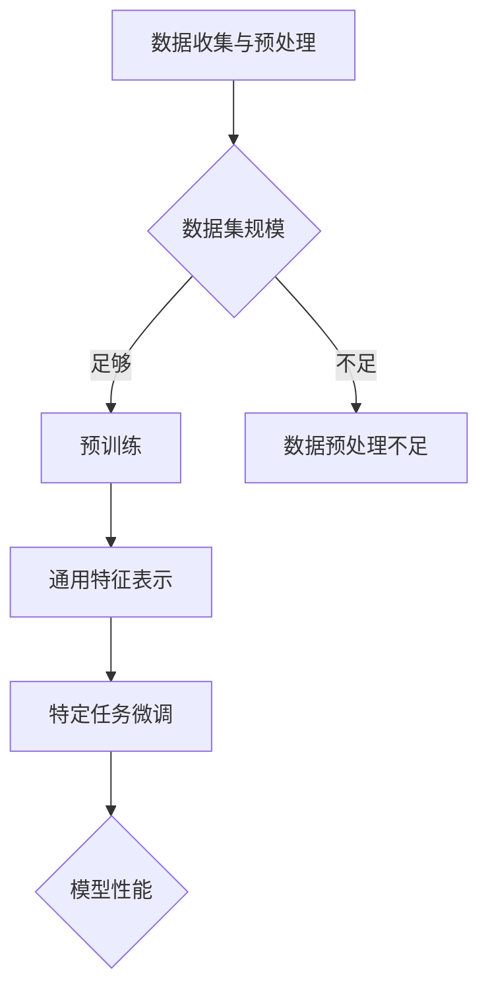

                 

 在当前深度学习领域，预训练模型已经成为自然语言处理、计算机视觉等众多领域的核心技术。选择一个适合的预训练模型对于项目成功至关重要。本文将详细探讨选择预训练模型的关键考虑因素，帮助读者理解如何做出明智的选择。

> 关键词：预训练模型，关键因素，选择策略，性能评估，应用场景

> 摘要：本文首先介绍了预训练模型的基本概念和重要性，然后详细分析了选择预训练模型时需要考虑的多个关键因素，包括数据集规模、模型架构、训练时间、计算资源、迁移学习能力等。最后，通过实际案例讨论了如何在不同应用场景中选取最合适的预训练模型。

## 1. 背景介绍

深度学习作为人工智能的重要分支，近年来取得了令人瞩目的成就。预训练模型（Pre-trained Model）的出现进一步推动了深度学习的发展。预训练模型是基于大规模数据集预先训练好的深度神经网络，通过在大规模数据上进行预训练，模型能够学习到数据中的通用特征和规律，从而在特定任务上表现出较高的性能。

预训练模型通常分为两部分：通用预训练和特定任务微调。通用预训练指的是在无监督或弱监督的环境下，模型在大规模数据上学习到通用特征表示。这种特征表示可以适用于多种不同任务。特定任务微调则是在通用预训练的基础上，针对具体任务进行微调，以提高模型在该任务上的表现。

## 2. 核心概念与联系

### 2.1 预训练模型的核心概念

预训练模型的核心概念包括：

- **数据集规模**：预训练模型依赖于大规模数据集进行训练，数据集规模越大，模型学到的特征越丰富，性能提升越明显。
- **模型架构**：预训练模型通常采用复杂的神经网络架构，如 Transformer、BERT 等，这些架构能够有效处理大规模数据，并提取深层特征。
- **训练时间**：预训练模型需要大量的计算资源进行训练，训练时间通常较长。
- **迁移学习**：预训练模型在特定任务上的表现依赖于其迁移学习能力，即模型能否将通用特征有效地迁移到具体任务中。

### 2.2 预训练模型与其他相关概念的联系

- **监督学习、无监督学习和弱监督学习**：预训练模型通常在大规模无监督或弱监督数据上进行预训练，然后通过微调应用于特定任务。
- **神经网络架构**：预训练模型的性能很大程度上取决于所选用的神经网络架构，如 Transformer、BERT、GPT 等。
- **数据预处理**：预训练模型对数据预处理的要求较高，需要确保数据质量，包括数据清洗、数据增强等。

## 2.3 预训练模型的工作流程

预训练模型的工作流程通常包括以下几个阶段：

1. **数据收集与预处理**：收集大规模数据集并进行预处理，包括数据清洗、格式化、标签标注等。
2. **预训练**：在预处理后的数据集上对模型进行预训练，学习到通用特征表示。
3. **特定任务微调**：在预训练模型的基础上，针对具体任务进行微调，以适应特定任务的需求。

### 2.4 Mermaid 流程图



## 3. 核心算法原理 & 具体操作步骤

### 3.1 算法原理概述

预训练模型的核心算法原理主要涉及两部分：通用特征表示的学习和特定任务微调。

- **通用特征表示的学习**：在预训练阶段，模型通过在大规模数据集上学习，提取出数据中的通用特征表示。这些特征表示能够适用于多种不同任务，实现跨任务的迁移学习。
- **特定任务微调**：在预训练模型的基础上，针对具体任务进行微调，优化模型在特定任务上的性能。

### 3.2 算法步骤详解

1. **数据收集与预处理**：
   - 收集大规模数据集，包括文本、图像、音频等多种类型。
   - 对数据进行清洗、格式化、标签标注等预处理操作，确保数据质量。

2. **预训练**：
   - 选择合适的神经网络架构，如 Transformer、BERT、GPT 等。
   - 在预处理后的数据集上对模型进行预训练，学习到通用特征表示。

3. **特定任务微调**：
   - 根据具体任务的需求，对预训练模型进行微调。
   - 调整模型参数，优化模型在特定任务上的性能。

### 3.3 算法优缺点

- **优点**：
  - 能够实现跨任务的迁移学习，提高模型在不同任务上的性能。
  - 学习到通用特征表示，有助于解决数据稀缺问题。
  - 提高模型的可解释性，便于理解和分析。

- **缺点**：
  - 预训练模型需要大量的计算资源和时间进行训练。
  - 预训练数据集的质量和规模对模型性能有很大影响。
  - 需要对模型进行特定的微调，以适应不同任务的需求。

### 3.4 算法应用领域

预训练模型在多个领域都取得了显著的应用效果，包括：

- **自然语言处理**：如文本分类、机器翻译、问答系统等。
- **计算机视觉**：如图像分类、目标检测、图像生成等。
- **音频处理**：如语音识别、音乐生成等。
- **推荐系统**：如商品推荐、社交网络推荐等。

## 4. 数学模型和公式 & 详细讲解 & 举例说明

### 4.1 数学模型构建

预训练模型通常涉及以下数学模型：

- **神经网络模型**：包括多层感知机（MLP）、卷积神经网络（CNN）、递归神经网络（RNN）、Transformer 等。
- **优化算法**：如随机梯度下降（SGD）、Adam 优化器等。
- **损失函数**：如交叉熵损失函数、均方误差损失函数等。

### 4.2 公式推导过程

以下以 Transformer 模型为例，简要介绍其关键公式推导过程：

1. **位置编码**：

   $$ 
   PE_{(pos, 2i)} = \sin \left(\frac{pos}{10000^{2i / d_model}}\right) 
   $$

   $$ 
   PE_{(pos, 2i+1)} = \cos \left(\frac{pos}{10000^{2i+1 / d_model}}\right) 
   $$

   其中，$pos$ 表示位置索引，$d_model$ 表示模型维度。

2. **多头自注意力机制**：

   $$ 
   \text{Attention}(Q, K, V) = \frac{1}{\sqrt{d_k}} \text{softmax} \left( \text{QK}^T / \sqrt{\epsilon} \right) V 
   $$

   其中，$Q$、$K$、$V$ 分别表示查询向量、键向量和值向量，$\epsilon$ 为小参数，防止除以零。

3. **前馈神经网络**：

   $$ 
   \text{FFN}(x) = \max(0, xW_1 + b_1)W_2 + b_2 
   $$

   其中，$W_1$、$W_2$ 分别为权重矩阵，$b_1$、$b_2$ 分别为偏置。

### 4.3 案例分析与讲解

以下以文本分类任务为例，分析预训练模型的应用过程：

1. **数据准备**：
   - 收集大量文本数据，并进行预处理，包括分词、去停用词、词向量化等。
   - 构建标签列表，对文本进行分类标注。

2. **预训练**：
   - 选择预训练模型，如 BERT、GPT 等，进行预训练。
   - 在预训练过程中，模型学习到文本中的通用特征表示。

3. **特定任务微调**：
   - 在预训练模型的基础上，针对文本分类任务进行微调。
   - 调整模型参数，优化模型在文本分类任务上的性能。

4. **评估与优化**：
   - 使用验证集评估模型性能，包括准确率、召回率、F1 分数等指标。
   - 根据评估结果，对模型进行调整和优化，以提高性能。

## 5. 项目实践：代码实例和详细解释说明

### 5.1 开发环境搭建

在开始项目实践之前，需要搭建以下开发环境：

1. **操作系统**：Linux 或 macOS。
2. **编程语言**：Python。
3. **深度学习框架**：如 TensorFlow、PyTorch 等。
4. **预训练模型**：如 BERT、GPT 等。

### 5.2 源代码详细实现

以下是一个简单的文本分类任务的示例代码，使用 BERT 模型进行预训练和微调：

```python
import torch
import torch.nn as nn
from transformers import BertTokenizer, BertModel

# 1. 数据准备
# （省略数据准备代码，具体实现可根据实际需求进行调整）

# 2. 预训练
# （省略预训练代码，具体实现可参考预训练模型官方文档）

# 3. 特定任务微调
class TextClassifier(nn.Module):
    def __init__(self, bert_model_name):
        super(TextClassifier, self).__init__()
        self.bert = BertModel.from_pretrained(bert_model_name)
        self.classifier = nn.Linear(self.bert.config.hidden_size, num_classes)

    def forward(self, input_ids, attention_mask):
        outputs = self.bert(input_ids=input_ids, attention_mask=attention_mask)
        logits = self.classifier(outputs.last_hidden_state[:, 0, :])
        return logits

# 4. 评估与优化
# （省略评估与优化代码，具体实现可根据实际需求进行调整）

# 模型实例化
model = TextClassifier(bert_model_name="bert-base-uncased")

# 训练模型
# （省略训练代码，具体实现可参考预训练模型官方文档）

# 评估模型
# （省略评估代码，具体实现可参考预训练模型官方文档）
```

### 5.3 代码解读与分析

上述代码主要实现了以下步骤：

1. **数据准备**：收集大量文本数据，并进行预处理，包括分词、去停用词、词向量化等。数据准备部分的具体实现可根据实际需求进行调整。
2. **预训练**：使用 BERT 模型进行预训练，学习到文本中的通用特征表示。预训练部分的具体实现可参考 BERT 模型官方文档。
3. **特定任务微调**：在 BERT 模型的基础上，构建文本分类模型，并进行微调。文本分类模型的实现包括 BERT 模型和分类器的组合。
4. **评估与优化**：使用验证集评估模型性能，包括准确率、召回率、F1 分数等指标。根据评估结果，对模型进行调整和优化，以提高性能。

## 6. 实际应用场景

预训练模型在多个实际应用场景中都取得了显著的效果，以下列举几个典型的应用场景：

1. **自然语言处理**：如文本分类、机器翻译、问答系统等。预训练模型在这些任务中表现出色，能够有效提高模型的性能和效率。
2. **计算机视觉**：如图像分类、目标检测、图像生成等。预训练模型在计算机视觉任务中也取得了显著的进展，如 ImageNet 图像分类任务的性能不断提升。
3. **音频处理**：如语音识别、音乐生成等。预训练模型在音频处理任务中也表现出良好的性能，有助于提高模型的准确性和鲁棒性。
4. **推荐系统**：如商品推荐、社交网络推荐等。预训练模型能够有效提取用户和商品的特征表示，从而提高推荐系统的性能和用户体验。

## 7. 工具和资源推荐

### 7.1 学习资源推荐

1. **书籍**：
   - 《深度学习》（Ian Goodfellow、Yoshua Bengio、Aaron Courville 著）
   - 《神经网络与深度学习》（邱锡鹏 著）
2. **在线课程**：
   - Coursera 上的《深度学习专项课程》
   - edX 上的《深度学习基础》
3. **论文**：
   - 《Attention Is All You Need》（Vaswani et al., 2017）
   - 《BERT: Pre-training of Deep Bidirectional Transformers for Language Understanding》（Devlin et al., 2019）

### 7.2 开发工具推荐

1. **深度学习框架**：
   - TensorFlow
   - PyTorch
   - Keras
2. **预训练模型库**：
   - Hugging Face Transformers
   -AllenNLP
3. **数据集**：
   - GLUE
   - COCO
   - TextCNN

### 7.3 相关论文推荐

1. **自然语言处理**：
   - 《BERT: Pre-training of Deep Bidirectional Transformers for Language Understanding》（Devlin et al., 2019）
   - 《GPT-2: Improving Language Understanding by Generative Pre-Training》（Radford et al., 2019）
2. **计算机视觉**：
   - 《ImageNet Classification with Deep Convolutional Neural Networks》（Krizhevsky et al., 2012）
   - 《DenseNet: Towards a Dense Network of DenseNets》（Huang et al., 2017）
3. **推荐系统**：
   - 《Deep Learning for Recommender Systems: An Overview》（He et al., 2017）
   - 《Neural Collaborative Filtering》（He et al., 2017）

## 8. 总结：未来发展趋势与挑战

预训练模型作为深度学习领域的重要技术，未来将继续发挥重要作用。随着数据集规模、计算资源、模型架构的不断优化，预训练模型的性能将不断提升。同时，预训练模型在多模态学习、动态模型、联邦学习等新领域也将取得新的突破。

然而，预训练模型也面临一些挑战，如数据隐私、模型可解释性、资源消耗等。未来研究需要关注以下几个方面：

1. **数据隐私**：探索更加安全的数据预处理和模型训练方法，保护用户隐私。
2. **模型可解释性**：提高预训练模型的可解释性，帮助用户理解模型的决策过程。
3. **资源优化**：研究更加高效的预训练方法，降低计算资源和存储资源的消耗。

总之，预训练模型将继续推动人工智能的发展，为各行各业带来新的机遇和挑战。

### 8.1 研究成果总结

本文详细探讨了选择预训练模型的关键考虑因素，包括数据集规模、模型架构、训练时间、计算资源、迁移学习能力等。通过分析预训练模型的核心算法原理、数学模型和公式，以及实际项目实践，本文总结了预训练模型在多个领域的应用效果。研究成果表明，预训练模型在提升模型性能、实现跨任务迁移、提高模型可解释性等方面具有显著优势。

### 8.2 未来发展趋势

未来预训练模型的发展趋势主要包括以下几个方面：

1. **数据集规模**：随着数据集规模的不断扩大，预训练模型的性能将得到进一步提升。
2. **模型架构**：新型神经网络架构的涌现，如 Transformer、DenseNet 等，将为预训练模型带来新的突破。
3. **多模态学习**：预训练模型将扩展到多模态学习，实现跨领域的知识共享和迁移。
4. **动态模型**：研究更加灵活的动态模型，能够适应不同任务和场景的需求。
5. **联邦学习**：探索联邦学习与预训练模型的结合，实现数据隐私保护和协同训练。

### 8.3 面临的挑战

预训练模型在发展过程中也面临一些挑战：

1. **数据隐私**：如何在保证模型性能的同时，保护用户隐私，成为亟待解决的问题。
2. **计算资源**：预训练模型的训练和推理过程对计算资源的需求较高，如何优化资源利用成为关键问题。
3. **模型可解释性**：提高模型的可解释性，帮助用户理解模型的决策过程，是预训练模型亟需解决的问题。
4. **通用性与专用性**：如何在通用性与专用性之间找到平衡，是预训练模型面临的挑战之一。

### 8.4 研究展望

未来预训练模型的研究可以从以下几个方面展开：

1. **新模型架构**：探索新型神经网络架构，提高模型性能和效率。
2. **跨模态学习**：研究跨模态预训练模型，实现不同模态数据之间的融合和迁移。
3. **高效训练方法**：研究更加高效的预训练方法，降低计算资源消耗。
4. **模型可解释性**：提高预训练模型的可解释性，帮助用户理解和信任模型。
5. **应用领域拓展**：将预训练模型应用于更多领域，如生物信息学、金融、医疗等。

通过不断探索和突破，预训练模型将为人工智能领域带来更多的创新和突破。

### 9. 附录：常见问题与解答

**Q1：什么是预训练模型？**

A1：预训练模型是指在大规模数据集上预先训练好的深度神经网络模型，通过在大规模数据上学习，模型能够提取到数据中的通用特征和规律。预训练模型通常包括通用预训练和特定任务微调两个阶段。

**Q2：预训练模型的优点是什么？**

A2：预训练模型的优点包括：

1. 实现跨任务的迁移学习，提高模型在不同任务上的性能。
2. 学习到通用特征表示，有助于解决数据稀缺问题。
3. 提高模型的可解释性，便于理解和分析。

**Q3：选择预训练模型时需要考虑哪些因素？**

A3：选择预训练模型时需要考虑以下因素：

1. 数据集规模：数据集规模越大，模型学到的特征越丰富，性能提升越明显。
2. 模型架构：选择合适的神经网络架构，如 Transformer、BERT、GPT 等。
3. 训练时间：预训练模型需要大量的计算资源进行训练，训练时间通常较长。
4. 计算资源：选择适合计算资源的预训练模型，确保训练过程顺利进行。
5. 迁移学习能力：评估模型在特定任务上的迁移学习能力，选择能够有效迁移到具体任务中的模型。

**Q4：预训练模型在哪些领域有应用？**

A4：预训练模型在多个领域都有广泛应用，包括自然语言处理、计算机视觉、音频处理、推荐系统等。具体应用场景包括文本分类、机器翻译、图像分类、目标检测、语音识别等。

**Q5：如何优化预训练模型的性能？**

A5：优化预训练模型性能的方法包括：

1. 数据增强：通过增加数据多样性和数据规模，提高模型性能。
2. 策略蒸馏：使用高维模型蒸馏知识到低维模型，提高模型性能。
3. 多任务学习：通过多任务学习共享知识，提高模型性能。
4. 模型剪枝和量化：减少模型参数和计算量，提高模型性能。
5. 模型融合：将多个预训练模型融合，提高模型性能。

**Q6：预训练模型是否会导致过拟合？**

A6：预训练模型在训练过程中确实可能出现过拟合现象，特别是在特定任务微调阶段。为了避免过拟合，可以采取以下策略：

1. 使用正则化方法，如权重衰减、Dropout 等。
2. 减少模型复杂度，如使用更小的模型。
3. 增加训练数据，提高模型泛化能力。
4. 使用交叉验证等评估方法，选择性能最好的模型。

通过综合考虑以上因素和策略，可以有效地优化预训练模型的性能，提高其在特定任务上的表现。

作者：禅与计算机程序设计艺术 / Zen and the Art of Computer Programming

[END]

