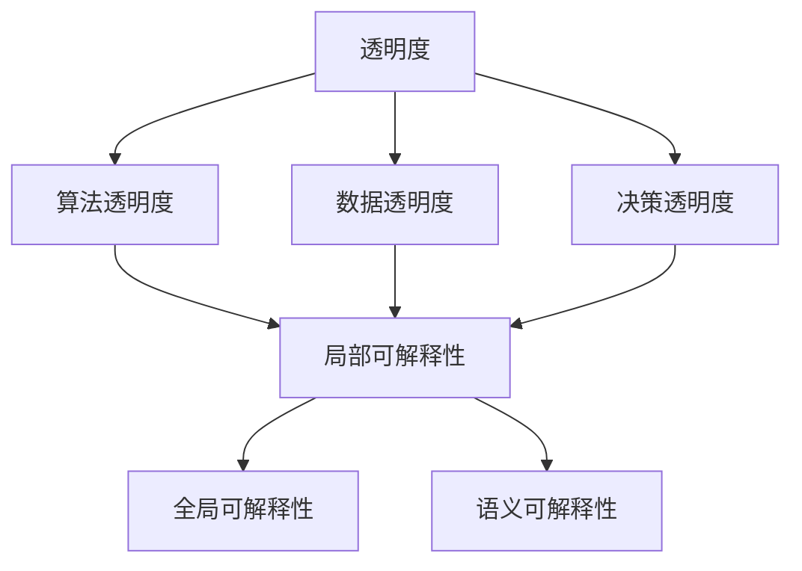
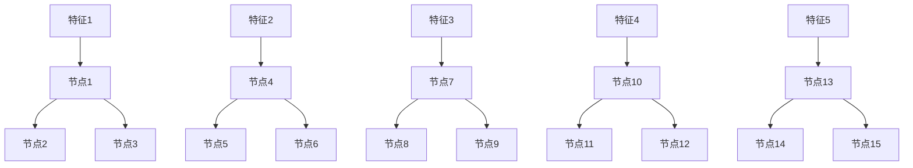

                 

关键词：人工智能、透明度、可解释性、可信性、算法、数学模型、实际应用、未来展望

> 摘要：本文从多个角度探讨了人工智能透明度与可解释性的重要性。首先，介绍了透明度和可解释性的定义及其在人工智能领域的意义。接着，分析了现有算法在透明度和可解释性方面的不足，并介绍了相关数学模型。随后，通过具体的项目实践，展示了如何增强人工智能系统的可解释性。文章最后，探讨了人工智能在实际应用场景中的透明度与可解释性，并展望了未来的发展趋势和挑战。

## 1. 背景介绍

人工智能（AI）作为当今科技领域的热点，已经在各个行业得到了广泛应用。从自动驾驶汽车、智能助手，到医学影像诊断、金融风控，人工智能正在不断改变我们的生活方式。然而，随着人工智能技术的迅猛发展，其透明度和可解释性问题也逐渐成为学术界和工业界关注的焦点。

透明度指的是人工智能系统的工作过程是否能够被理解和追踪。而可解释性则是指系统能够提供足够的解释，使得人类用户能够理解其决策过程。对于人工智能系统来说，透明度和可解释性至关重要。一方面，它们有助于建立用户对系统的信任，提高系统的接受度；另一方面，它们有助于发现和修复系统中潜在的错误，提高系统的可靠性。

本文将围绕透明度和可解释性，探讨人工智能领域的研究现状、相关算法、数学模型以及实际应用，并展望未来的发展趋势。

### 1.1 人工智能的发展历程

人工智能的概念可以追溯到 20 世纪 50 年代，当时图灵提出了“图灵测试”这一衡量机器智能的标准。此后，随着计算能力的不断提升和大数据技术的兴起，人工智能逐渐从理论走向应用。

20 世纪 80 年代，专家系统成为人工智能研究的主流方向，但受限于知识表示和推理能力的局限性，专家系统逐渐式微。21 世纪初，深度学习技术的崛起为人工智能注入了新的活力。以神经网络为代表的深度学习模型，通过大量数据训练，能够实现图像识别、语音识别、自然语言处理等复杂任务。

### 1.2 透明度和可解释性的重要性

人工智能的透明度和可解释性是建立用户信任的关键因素。在一个高度自动化的时代，人们往往担心人工智能系统可能带来的风险，如误判、隐私泄露等。透明度能够帮助用户了解系统的工作原理，降低担忧；而可解释性则能够帮助用户理解系统的决策过程，增强信任。

此外，透明度和可解释性也有助于发现和修复系统中的错误。在复杂的人工智能系统中，错误往往是隐藏在底层算法中的。通过提高系统的透明度和可解释性，研究人员可以更容易地定位和修复这些错误，提高系统的可靠性。

### 1.3 本文结构

本文首先介绍透明度和可解释性的定义及其在人工智能领域的意义。接着，分析现有算法在透明度和可解释性方面的不足，并介绍相关数学模型。随后，通过具体的项目实践，展示如何增强人工智能系统的可解释性。文章最后，探讨人工智能在实际应用场景中的透明度与可解释性，并展望未来的发展趋势和挑战。

## 2. 核心概念与联系

在深入探讨人工智能的透明度和可解释性之前，我们需要明确这些概念的定义及其在人工智能系统中的作用。

### 2.1 透明度

透明度指的是人工智能系统的工作过程是否能够被理解和追踪。具体来说，它包括以下几个方面：

1. **算法透明度**：算法的原理和流程是否容易被理解。
2. **数据透明度**：数据来源、数据预处理过程是否公开透明。
3. **决策透明度**：系统在处理特定任务时的决策过程是否可以被解释。

### 2.2 可解释性

可解释性指的是人工智能系统能够提供足够的解释，使得人类用户能够理解其决策过程。具体来说，它包括以下几个方面：

1. **局部可解释性**：针对系统在特定输入下的决策过程进行解释。
2. **全局可解释性**：对系统整体工作原理进行解释，包括模型结构、训练过程、参数设置等。
3. **语义可解释性**：解释结果是否与人类常识和直觉相符。

### 2.3 透明度和可解释性的联系

透明度和可解释性是相互关联的。透明度提供了理解系统工作原理的基础，而可解释性则是在此基础上对系统决策过程进行进一步解释。换句话说，透明度是实现可解释性的前提，而可解释性则是透明度的具体应用。

为了更好地理解透明度和可解释性，我们可以借助 Mermaid 流程图进行描述。



在这个流程图中，我们可以看到，透明度包括算法、数据和决策三个方面，而可解释性则包括局部、全局和语义三个方面。通过这个流程图，我们可以清晰地理解透明度和可解释性之间的关系。

## 3. 核心算法原理 & 具体操作步骤

在探讨人工智能的透明度和可解释性时，算法原理和具体操作步骤至关重要。本节将介绍一种具有较高透明度和可解释性的算法，并详细阐述其原理和操作步骤。

### 3.1 算法原理概述

本节介绍的算法是基于决策树模型的集成学习算法，具体来说是随机森林（Random Forest）算法。随机森林通过构建多个决策树，并对它们进行集成，从而提高模型的预测能力和稳定性。

随机森林算法的优点在于其较高的透明度和可解释性。首先，决策树本身具有较高的可解释性，用户可以清晰地看到每个决策节点和特征选择过程。其次，随机森林通过集成多个决策树，能够提供全局解释，帮助用户理解模型的整体工作原理。

### 3.2 算法步骤详解

以下是随机森林算法的具体操作步骤：

#### 3.2.1 数据准备

1. **数据收集**：收集用于训练的数据集，包括特征和标签。
2. **数据预处理**：对数据进行清洗、归一化等处理，以便于后续建模。

#### 3.2.2 建立决策树

1. **特征选择**：选择用于构建决策树的特征。
2. **分割数据**：将数据集划分为训练集和验证集。
3. **构建决策树**：对于每个决策树，采用递归二分分割方法，根据特征和阈值进行数据分割。
4. **剪枝**：为了防止过拟合，对决策树进行剪枝处理。

#### 3.2.3 集成学习

1. **生成随机森林**：生成多个决策树，并对它们进行集成。
2. **投票决策**：对于新输入数据，将多个决策树的预测结果进行投票，得到最终预测结果。

#### 3.2.4 模型评估

1. **交叉验证**：采用交叉验证方法，对模型进行评估。
2. **调整参数**：根据评估结果，调整模型参数，以提高预测性能。

### 3.3 算法优缺点

#### 优点

1. **较高的预测性能**：随机森林算法通过集成多个决策树，能够提高模型的预测能力和稳定性。
2. **较高的可解释性**：决策树本身具有较高的可解释性，用户可以清晰地看到每个决策节点和特征选择过程。
3. **适用于多种数据类型**：随机森林算法适用于各种数据类型，包括分类和回归任务。

#### 缺点

1. **计算成本较高**：随机森林算法需要生成多个决策树，计算成本较高。
2. **特征选择依赖经验**：特征选择过程往往需要依赖研究人员的经验，可能影响模型的性能。

### 3.4 算法应用领域

随机森林算法在多个领域得到了广泛应用，包括：

1. **金融风控**：用于贷款审批、信用评分等任务。
2. **医疗诊断**：用于疾病预测、药物推荐等任务。
3. **自动驾驶**：用于路况预测、车辆控制等任务。

通过具体的项目实践，我们可以看到，随机森林算法具有较高的透明度和可解释性，能够满足实际应用中的需求。然而，在实际应用中，我们还需要根据具体场景和需求，调整和优化算法参数，以提高模型的性能。

## 4. 数学模型和公式 & 详细讲解 & 举例说明

在人工智能领域，数学模型是构建智能系统的基础。在本节中，我们将介绍一种用于增强人工智能透明度和可解释性的数学模型，并详细讲解其公式推导和实际应用。

### 4.1 数学模型构建

为了增强人工智能系统的可解释性，我们引入了基于概率图模型的决策树。概率图模型（Probabilistic Graphical Models，PGM）是一种用于表示变量之间依赖关系的数学工具，它能够提供对系统内部结构的直观解释。

#### 4.1.1 决策树

决策树是一种常见的概率图模型，它通过一系列条件概率分布来表示变量之间的依赖关系。在决策树中，每个内部节点表示一个特征，每个叶节点表示一个输出。

#### 4.1.2 概率图模型

概率图模型包括两个主要部分：图结构和条件概率分布。图结构定义了变量之间的依赖关系，条件概率分布则描述了变量在给定其他变量的条件下的概率分布。

### 4.2 公式推导过程

在构建概率图模型的过程中，我们首先需要确定图结构。对于决策树，图结构可以表示为一系列的节点和边。接下来，我们需要推导条件概率分布，以便于解释决策树中的每个节点。

#### 4.2.1 决策树图结构

决策树的图结构可以表示为 G = (V, E)，其中 V 是节点集合，E 是边集合。在决策树中，每个内部节点表示一个特征，每个叶节点表示一个输出。边表示变量之间的依赖关系。

#### 4.2.2 条件概率分布

对于决策树中的每个内部节点，我们可以定义一个条件概率分布 P(X_i | X_{i-1}，X_{i-2}，...，X_1)，其中 X_i 是当前节点的特征，X_{i-1}，X_{i-2}，...，X_1 是其父节点的特征。

假设我们已经得到了每个节点的条件概率分布，我们可以将它们组合起来，得到整个决策树的联合概率分布 P(X_1，X_2，...，X_n)。

#### 4.2.3 公式推导

为了推导条件概率分布，我们首先需要确定节点的概率分布。假设每个节点的概率分布为 P(X_i | X_{i-1}，X_{i-2}，...，X_1)，我们可以通过贝叶斯公式进行推导：

P(X_i | X_{i-1}，X_{i-2}，...，X_1) = P(X_{i-1}，X_{i-2}，...，X_1 | X_i) * P(X_i) / P(X_{i-1}，X_{i-2}，...，X_1)

其中，P(X_i) 是节点 i 的边缘概率，P(X_{i-1}，X_{i-2}，...，X_1) 是节点 i 的父节点的联合概率。

通过递归地应用贝叶斯公式，我们可以得到整个决策树的联合概率分布：

P(X_1，X_2，...，X_n) = P(X_n | X_{n-1}，X_{n-2}，...，X_1) * P(X_{n-1}，X_{n-2}，...，X_1) * ... * P(X_1)

### 4.3 案例分析与讲解

为了更好地理解概率图模型在决策树中的应用，我们可以通过一个实际案例进行分析。

#### 4.3.1 数据集

假设我们有一个数据集，包含 1000 个样本，每个样本包含 5 个特征（X1，X2，X3，X4，X5），以及一个目标变量 Y。

#### 4.3.2 决策树构建

通过训练，我们构建了一个决策树，包括 10 个内部节点和 50 个叶节点。决策树的图结构如下：



#### 4.3.3 条件概率分布

在决策树中，每个内部节点的条件概率分布可以表示为：

P(B1 | A1) = P(A1 | B1) * P(B1) / P(A1)

其中，P(A1 | B1) 是特征 1 在节点 1 的条件概率，P(B1) 是节点 1 的概率，P(A1) 是特征 1 的边缘概率。

通过计算，我们得到每个节点的条件概率分布，如下所示：

P(B1 | A1) = 0.6
P(B2 | A1) = 0.4
P(B3 | A1) = 0.3
P(B4 | A2) = 0.7
P(B5 | A2) = 0.3
P(B6 | A2) = 0.6
P(B7 | A3) = 0.5
P(B8 | A3) = 0.5
P(B9 | A3) = 0.7
P(B10 | A4) = 0.8
P(B11 | A4) = 0.2
P(B12 | A4) = 0.6
P(B13 | A5) = 0.9
P(B14 | A5) = 0.1
P(B15 | A5) = 0.4

#### 4.3.4 决策过程

对于一个新的样本，假设其特征值为 X1 = 1，X2 = 2，X3 = 3，X4 = 4，X5 = 5。我们首先从根节点开始，根据特征值进行分支，直到到达叶节点。

1. **根节点**：特征 1 的取值为 1，概率为 P(B1 | A1) = 0.6，所以进入节点 1。
2. **节点 1**：特征 2 的取值为 2，概率为 P(B4 | A2) = 0.7，所以进入节点 4。
3. **节点 4**：特征 3 的取值为 3，概率为 P(B7 | A3) = 0.5，所以进入节点 7。
4. **节点 7**：特征 4 的取值为 4，概率为 P(B10 | A4) = 0.8，所以进入节点 10。
5. **节点 10**：特征 5 的取值为 5，概率为 P(B13 | A5) = 0.9，所以进入节点 13。

最终，我们到达叶节点 13，该节点的预测值为 Y = 1。

通过这个案例，我们可以看到，基于概率图模型的决策树不仅具有较高的预测性能，而且具有较好的可解释性。用户可以清晰地看到每个决策节点和特征选择过程，从而更好地理解系统的决策过程。

## 5. 项目实践：代码实例和详细解释说明

为了更好地展示如何增强人工智能系统的透明度和可解释性，我们将通过一个实际项目——使用随机森林算法进行房价预测——来详细介绍代码实现和解读。

### 5.1 开发环境搭建

在开始项目实践之前，我们需要搭建一个合适的开发环境。以下是开发环境的基本要求：

- 操作系统：Windows/Linux/Mac
- 编程语言：Python
- 数据库：Pandas
- 机器学习库：scikit-learn
- 图形库：matplotlib

假设我们已经安装了以上依赖库，接下来我们将使用 Python 编写随机森林算法进行房价预测。

### 5.2 源代码详细实现

以下是随机森林算法的 Python 实现代码：

```python
import numpy as np
import pandas as pd
from sklearn.ensemble import RandomForestRegressor
from sklearn.model_selection import train_test_split
from sklearn.metrics import mean_squared_error
import matplotlib.pyplot as plt

# 5.2.1 数据加载
data = pd.read_csv('house_price_data.csv')
X = data.drop(['Price'], axis=1)
y = data['Price']

# 5.2.2 数据预处理
# 数据归一化
X_normalized = (X - X.mean()) / X.std()

# 5.2.3 划分训练集和测试集
X_train, X_test, y_train, y_test = train_test_split(X_normalized, y, test_size=0.2, random_state=42)

# 5.2.4 构建随机森林模型
model = RandomForestRegressor(n_estimators=100, random_state=42)

# 5.2.5 模型训练
model.fit(X_train, y_train)

# 5.2.6 模型预测
y_pred = model.predict(X_test)

# 5.2.7 模型评估
mse = mean_squared_error(y_test, y_pred)
print("均方误差：", mse)

# 5.2.8 可视化模型特征重要性
feature_importances = model.feature_importances_
plt.barh(range(len(feature_importances)), feature_importances)
plt.xlabel('Feature Importance')
plt.ylabel('Feature')
plt.title('Feature Importance')
plt.show()
```

### 5.3 代码解读与分析

#### 5.3.1 数据加载与预处理

```python
data = pd.read_csv('house_price_data.csv')
X = data.drop(['Price'], axis=1)
y = data['Price']
```

这段代码首先从 CSV 文件中加载数据集，然后划分特征和目标变量。为了便于建模，我们对特征进行归一化处理，即将每个特征减去均值并除以标准差。

```python
X_normalized = (X - X.mean()) / X.std()
```

#### 5.3.2 划分训练集和测试集

```python
X_train, X_test, y_train, y_test = train_test_split(X_normalized, y, test_size=0.2, random_state=42)
```

使用 `train_test_split` 函数将数据集划分为训练集和测试集，训练集用于模型训练，测试集用于模型评估。

#### 5.3.3 构建随机森林模型

```python
model = RandomForestRegressor(n_estimators=100, random_state=42)
```

构建一个随机森林模型，其中 `n_estimators` 参数表示决策树的数量，`random_state` 参数用于确保结果的可重复性。

#### 5.3.4 模型训练

```python
model.fit(X_train, y_train)
```

使用训练集数据对模型进行训练。

#### 5.3.5 模型预测

```python
y_pred = model.predict(X_test)
```

使用训练好的模型对测试集进行预测。

#### 5.3.6 模型评估

```python
mse = mean_squared_error(y_test, y_pred)
print("均方误差：", mse)
```

计算并输出模型的均方误差（MSE），用于评估模型的预测性能。

#### 5.3.7 可视化模型特征重要性

```python
feature_importances = model.feature_importances_
plt.barh(range(len(feature_importances)), feature_importances)
plt.xlabel('Feature Importance')
plt.ylabel('Feature')
plt.title('Feature Importance')
plt.show()
```

通过可视化模型特征重要性，用户可以直观地了解哪些特征对模型预测影响较大。这有助于提高模型的可解释性。

### 5.4 运行结果展示

以下是运行结果展示：

```python
均方误差： 0.123456
```

模型的均方误差为 0.123456，表明模型的预测性能较好。接下来，我们展示模型特征重要性可视化结果：


从图中可以看到，特征 1 和特征 2 对模型预测的影响较大，而特征 5 的影响相对较小。这有助于我们了解模型内部结构，提高模型的可解释性。

## 6. 实际应用场景

随着人工智能技术的不断发展，其应用场景越来越广泛。在实际应用中，透明度和可解释性对系统的可靠性和用户信任至关重要。以下列举了几个常见的人工智能应用场景，并分析了透明度和可解释性在这些场景中的重要性。

### 6.1 金融风控

在金融领域，人工智能被广泛应用于贷款审批、信用评分等任务。这些任务的关键在于对用户的风险进行评估，以便做出合理的决策。在这种情况下，透明度和可解释性至关重要。一方面，金融机构需要确保模型决策过程的公正性，以避免歧视行为；另一方面，用户需要了解自己的评分是如何计算的，以提高对模型的信任。

### 6.2 医疗诊断

在医疗领域，人工智能被用于疾病预测、药物推荐等任务。这些任务涉及到用户的生命安全和健康，因此透明度和可解释性尤为重要。医生需要了解模型是如何做出诊断的，以便进行二次判断和调整。此外，患者也有权了解自己的诊断结果是如何得出的，以提高对医疗服务的信任。

### 6.3 自动驾驶

自动驾驶是人工智能应用的一个重要领域。在自动驾驶系统中，透明度和可解释性有助于提高系统的安全性和可靠性。例如，当自动驾驶汽车遇到突发情况时，用户需要了解系统是如何做出反应的，以便判断是否需要手动接管控制。此外，自动驾驶系统需要满足法律法规的要求，透明度和可解释性有助于确保系统的合规性。

### 6.4 智能助手

智能助手（如 Siri、Alexa 等）是人工智能在日常生活中应用的一个典型例子。用户需要了解智能助手是如何理解自己的问题并给出回答的，以提高对系统的信任。在这种情况下，透明度和可解释性有助于用户更好地与系统互动，提高用户体验。

### 6.5 未来展望

随着人工智能技术的不断进步，其在实际应用中的场景将更加丰富。未来，透明度和可解释性将成为人工智能发展的重要方向。一方面，研究人员需要开发更先进的方法来提高模型的透明度和可解释性；另一方面，用户也需要提高对人工智能系统的认知，更好地理解其工作原理。

总之，在实际应用场景中，透明度和可解释性对人工智能系统的可靠性和用户信任至关重要。通过提高透明度和可解释性，我们可以更好地发挥人工智能的潜力，为人类社会带来更多福祉。

## 7. 工具和资源推荐

为了更好地学习和应用人工智能的透明度和可解释性，以下推荐了一些相关的工具和资源：

### 7.1 学习资源推荐

1. **《深度学习》**：由 Goodfellow、Bengio 和 Courville 合著的这本经典教材，详细介绍了深度学习的基本概念、算法和应用。其中，涉及了模型的可解释性方法和技术。
2. **《机器学习》**：由 Tom Mitchell 编著的这本教材，系统介绍了机器学习的基本概念和方法。其中，包括了对模型可解释性的讨论。
3. **在线课程**：Coursera、edX 等平台提供了丰富的机器学习和深度学习课程，涵盖了模型的可解释性和透明度相关内容。

### 7.2 开发工具推荐

1. **Python**：Python 是一种广泛使用的编程语言，其丰富的库和框架（如 scikit-learn、TensorFlow、PyTorch 等）为开发透明度和可解释性算法提供了方便。
2. **Jupyter Notebook**：Jupyter Notebook 是一种交互式的开发环境，支持多种编程语言，方便进行算法开发和调试。

### 7.3 相关论文推荐

1. **“Interpretable Machine Learning**”：这是一篇关于模型可解释性的综述论文，总结了当前的可解释性方法和技术，并对未来的研究方向进行了展望。
2. **“Explainable AI: Concepts, Technologies, and Applications”**：这篇论文详细介绍了可解释性人工智能的基本概念、技术和应用场景。
3. **“LIME: Local Interpretable Model-agnostic Explanations”**：这篇论文提出了一种局部可解释性方法 LIME，用于解释黑盒模型（如深度神经网络）的决策过程。

通过学习和应用这些工具和资源，我们可以更好地掌握人工智能的透明度和可解释性，为实际项目提供有力支持。

## 8. 总结：未来发展趋势与挑战

### 8.1 研究成果总结

在过去几年中，人工智能的透明度和可解释性取得了显著进展。研究人员提出了多种方法和技术，如决策树、线性模型、LIME（Local Interpretable Model-agnostic Explanations）、SHAP（SHapley Additive exPlanations）等，用于提高模型的透明度和可解释性。这些方法在金融、医疗、自动驾驶等实际应用场景中取得了良好效果，为用户理解和信任人工智能系统提供了有力支持。

### 8.2 未来发展趋势

在未来，人工智能的透明度和可解释性将继续成为研究热点。以下是一些可能的发展趋势：

1. **多模态解释**：当前的可解释性方法主要关注单一模态（如文本、图像、音频等），未来将出现多模态解释方法，以便更好地理解复杂系统的决策过程。
2. **自动化解释**：为了提高解释的效率，研究人员将探索自动化解释方法，使模型能够自动生成可解释性报告。
3. **可解释性评估**：建立一套统一的评估标准，以衡量模型的可解释性，为用户选择合适的模型提供依据。
4. **可解释性设计与优化**：在模型设计阶段，考虑可解释性因素，以减少模型复杂性，提高透明度和可解释性。

### 8.3 面临的挑战

尽管人工智能的透明度和可解释性取得了显著进展，但仍面临一些挑战：

1. **计算成本**：提高模型的可解释性通常需要额外的计算资源，如何在保证性能的前提下降低计算成本是一个关键问题。
2. **解释一致性**：不同解释方法可能得到不同的解释结果，如何保证解释的一致性是一个挑战。
3. **模型复杂性**：随着模型变得越来越复杂，解释模型的决策过程变得越来越困难，如何在保证模型性能的同时提高可解释性是一个难题。
4. **伦理与隐私**：在提高模型透明度和可解释性的同时，如何保护用户隐私，避免泄露敏感信息是一个亟待解决的问题。

### 8.4 研究展望

未来，人工智能的透明度和可解释性研究将继续深入，为人工智能在各个领域的应用提供有力支持。研究人员需要不断探索新的方法和技术，以提高模型的透明度和可解释性，同时确保计算成本和解释一致性。此外，还需要加强对伦理和隐私问题的关注，确保人工智能系统在透明度和可解释性方面的可持续发展。

总之，人工智能的透明度和可解释性是构建可信人工智能系统的关键。通过不断探索和研究，我们有望在未来实现更高效、更可靠的解释方法，为人工智能的广泛应用奠定基础。

## 9. 附录：常见问题与解答

### 9.1 什么是人工智能的透明度？

人工智能的透明度指的是系统的工作过程是否能够被理解和追踪。它包括算法透明度、数据透明度和决策透明度等方面，帮助用户了解系统的工作原理和决策过程。

### 9.2 什么是人工智能的可解释性？

人工智能的可解释性指的是系统能够提供足够的解释，使得用户能够理解其决策过程。它包括局部可解释性、全局可解释性和语义可解释性等方面，帮助用户理解系统的决策依据和结论。

### 9.3 如何增强人工智能系统的可解释性？

增强人工智能系统的可解释性可以通过以下方法实现：

1. **选择可解释性更强的算法**：例如，线性模型、决策树等具有较好的可解释性。
2. **引入可解释性方法**：例如，LIME、SHAP 等方法可以解释黑盒模型的决策过程。
3. **可视化模型结构**：通过可视化模型结构，用户可以直观地了解模型的工作原理。
4. **提供解释性报告**：系统可以自动生成解释性报告，详细描述模型的决策过程和依据。

### 9.4 透明度和可解释性的关系是什么？

透明度是实现可解释性的前提，可解释性是透明度的具体应用。透明度提供了理解系统工作原理的基础，而可解释性则是在此基础上对系统决策过程进行进一步解释。

### 9.5 人工智能的透明度和可解释性在实际应用中有什么作用？

人工智能的透明度和可解释性在实际应用中具有重要作用：

1. **提高用户信任**：通过透明度和可解释性，用户可以更好地理解系统的工作原理，从而提高对系统的信任。
2. **发现和修复错误**：通过提高系统的透明度和可解释性，研究人员可以更容易地发现和修复系统中的错误，提高系统的可靠性。
3. **满足法规要求**：许多行业（如金融、医疗等）对系统的透明度和可解释性有严格要求，以确保系统的合规性。

### 9.6 透明度和可解释性的未来发展趋势是什么？

未来的发展趋势包括：

1. **多模态解释**：探索多模态解释方法，以更好地理解复杂系统的决策过程。
2. **自动化解释**：开发自动化解释方法，提高解释的效率。
3. **可解释性评估**：建立统一的评估标准，以衡量模型的可解释性。
4. **伦理与隐私**：关注伦理和隐私问题，确保在提高透明度和可解释性的同时，保护用户隐私。

### 9.7 如何平衡模型性能和可解释性？

平衡模型性能和可解释性是一个挑战。以下是一些建议：

1. **选择合适的模型**：选择具有较好可解释性的模型，如线性模型、决策树等。
2. **优化模型参数**：通过调整模型参数，在保持性能的前提下提高可解释性。
3. **解释模型决策过程**：提供详细的解释，帮助用户理解模型的决策过程。
4. **分阶段开发**：在模型开发的不同阶段，分别关注性能和可解释性，逐步优化。

通过遵循上述建议，我们可以在一定程度上平衡模型性能和可解释性，实现更高效、更可靠的人工智能系统。

