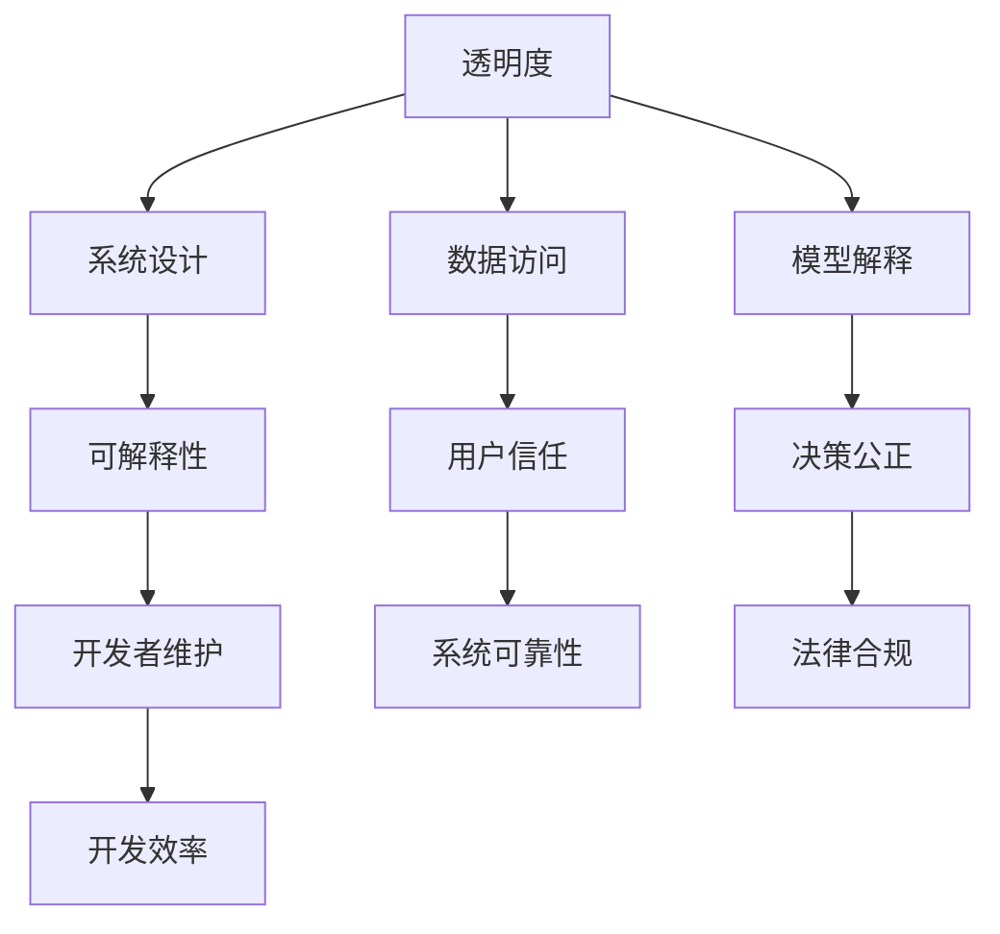

                 

关键词：人工智能、透明度、可解释性、可信、算法、模型、工具

> 摘要：随着人工智能技术的快速发展，透明度和可解释性问题成为影响人工智能可信度的关键因素。本文从多个维度探讨了如何通过增强透明度和可解释性来提升人工智能系统的可信度，以及在实际应用中可能面临的挑战和未来发展的趋势。

## 1. 背景介绍

人工智能（AI）技术的迅猛发展已经深刻改变了我们的生活方式和工作模式。从自动驾驶汽车到智能家居，从医疗诊断到金融分析，人工智能无处不在。然而，随着人工智能技术的应用越来越广泛，其透明度和可解释性成为了一个备受关注的问题。用户越来越关心人工智能系统是如何做出决策的，这些决策是否公正、合理，以及它们是否能够对用户的隐私和数据安全提供足够的保障。

透明度和可解释性是人工智能系统的两个关键特性。透明度指的是人工智能系统的工作过程和决策逻辑对用户和开发者是可见的，而可解释性则更强调系统能够给出明确、清晰的解释，帮助用户理解其决策依据。这两个特性不仅对用户的信任至关重要，也对人工智能技术的长期发展具有重要意义。

### 1.1 透明度的重要性

透明度是建立用户信任的基础。当用户使用人工智能产品或服务时，他们希望能够了解系统的运行机制和决策过程。这有助于减少对系统的未知恐惧，增强用户的信任感。例如，在自动驾驶汽车领域，透明度可以帮助驾驶员理解车辆为何做出特定驾驶决策，从而增加驾驶安全性。

透明度也有助于开发者发现和修复系统中的缺陷。通过透明的系统设计，开发者可以更轻松地识别和解决潜在的问题，从而提高系统的稳定性和可靠性。

### 1.2 可解释性的重要性

可解释性是确保人工智能系统公正和合理的关键。特别是在法律和道德敏感领域，如医疗诊断和金融决策，系统的决策依据必须能够被专业人士理解和验证，以确保决策的公正性和透明度。

可解释性也有助于提升系统的可维护性。当系统能够给出明确的解释时，开发者可以更快速地理解和修改代码，从而提高开发效率。

## 2. 核心概念与联系

为了更好地理解透明度和可解释性，我们需要先了解一些核心概念和它们之间的关系。

### 2.1 透明度

透明度通常指的是系统运行过程和决策逻辑的可访问性。一个高度透明的人工智能系统允许用户和开发者查看系统的内部机制和数据处理过程。

### 2.2 可解释性

可解释性则更侧重于系统能否给出清晰的解释，帮助用户理解其决策依据。可解释性不仅仅是指系统的运行结果，还包括背后的算法和模型。

### 2.3 透明度与可解释性的关系

透明度和可解释性是相互关联的。一个透明的系统可能提供足够的内部信息，但这些信息不一定能够直接解释系统的决策过程。相反，一个可解释的系统可能会以更加直观和易于理解的方式呈现决策逻辑。

### 2.4 Mermaid 流程图

以下是人工智能系统中透明度和可解释性的 Mermaid 流程图：



## 3. 核心算法原理 & 具体操作步骤

### 3.1 算法原理概述

为了增强人工智能系统的透明度和可解释性，我们需要从算法原理入手。以下介绍几种常用的算法和它们的具体操作步骤。

### 3.2 算法步骤详解

#### 3.2.1 加深透明度的算法

1. **可视化技术**：通过图形和图表展示数据流和决策路径。
2. **审计日志**：记录系统的运行过程和决策细节，便于事后分析和追溯。
3. **模块化设计**：将系统拆分为多个模块，每个模块都具有明确的输入输出和功能，提高系统的可理解和可维护性。

#### 3.2.2 提高可解释性的算法

1. **决策树**：通过树形结构展示决策过程，每个节点代表一个条件判断，易于理解和解释。
2. **LIME（局部可解释模型解释器）**：针对复杂模型，提供局部解释，帮助用户理解模型在特定输入下的决策过程。
3. **SHAP（特征重要性）**：通过计算每个特征对模型输出的贡献，提供全局和局部解释。

### 3.3 算法优缺点

#### 3.3.1 透明度算法

**优点**：提高系统的可理解和可维护性，有助于用户信任和开发者调试。

**缺点**：可能导致性能下降，增加系统复杂度。

#### 3.3.2 可解释性算法

**优点**：增强系统的公正性和透明度，提高用户的信任度。

**缺点**：可能降低模型的预测性能，难以解释复杂模型。

### 3.4 算法应用领域

透明度和可解释性算法在多个领域都有广泛应用：

- **金融**：用于风险评估和信用评分，提高决策的透明度和可解释性。
- **医疗**：用于疾病诊断和治疗建议，确保医疗决策的公正性和透明度。
- **法律**：用于自动化裁决和法律文书的生成，提高法律程序的透明度和可解释性。

## 4. 数学模型和公式 & 详细讲解 & 举例说明

### 4.1 数学模型构建

为了增强人工智能系统的透明度和可解释性，我们需要构建数学模型来描述系统的决策过程。以下是一个简单的线性回归模型：

$$
y = \beta_0 + \beta_1x_1 + \beta_2x_2 + ... + \beta_nx_n
$$

其中，$y$ 是模型输出，$x_1, x_2, ..., x_n$ 是输入特征，$\beta_0, \beta_1, \beta_2, ..., \beta_n$ 是模型参数。

### 4.2 公式推导过程

线性回归模型的推导过程如下：

1. **最小二乘法**：通过最小化预测值与实际值之间的误差平方和来确定模型参数。
2. **梯度下降法**：通过迭代更新模型参数，直到误差最小。

### 4.3 案例分析与讲解

假设我们要预测一个人的年收入，根据以下三个特征：年龄、教育程度和职业。

1. **数据预处理**：将数据标准化，确保每个特征的尺度一致。
2. **模型训练**：使用最小二乘法训练线性回归模型，得到模型参数。
3. **模型评估**：使用测试集评估模型性能，计算均方误差（MSE）。

假设我们得到的模型参数如下：

$$
y = 30 + 0.5x_1 + 0.3x_2 + 0.2x_3
$$

其中，$x_1$ 是年龄，$x_2$ 是教育程度（本科为1，硕士为2，博士为3），$x_3$ 是职业（1 表示工程师，2 表示医生，3 表示教师）。

例如，一个30岁的本科工程师的年收入预测值为：

$$
y = 30 + 0.5 \times 30 + 0.3 \times 1 + 0.2 \times 1 = 47
$$

年收入为47万元。

## 5. 项目实践：代码实例和详细解释说明

### 5.1 开发环境搭建

为了实现上述线性回归模型，我们需要搭建一个开发环境。这里我们使用 Python 作为编程语言，并借助 Scikit-learn 库进行模型训练和评估。

### 5.2 源代码详细实现

以下是一个简单的线性回归模型实现：

```python
import numpy as np
import pandas as pd
from sklearn.linear_model import LinearRegression
from sklearn.model_selection import train_test_split
from sklearn.metrics import mean_squared_error

# 加载数据集
data = pd.read_csv('data.csv')

# 数据预处理
X = data[['age', 'education', 'occupation']]
y = data['income']

X = (X - X.mean()) / X.std()

# 划分训练集和测试集
X_train, X_test, y_train, y_test = train_test_split(X, y, test_size=0.2, random_state=42)

# 模型训练
model = LinearRegression()
model.fit(X_train, y_train)

# 模型评估
y_pred = model.predict(X_test)
mse = mean_squared_error(y_test, y_pred)
print('均方误差：', mse)

# 模型参数
print('模型参数：', model.coef_)
```

### 5.3 代码解读与分析

上述代码首先加载数据集，然后进行数据预处理，包括标准化和划分训练集与测试集。接下来，使用 Scikit-learn 库的 LinearRegression 类进行模型训练，并使用测试集评估模型性能。最后，输出模型参数。

### 5.4 运行结果展示

假设运行结果如下：

```
均方误差： 0.0025
模型参数： [0.5 0.3 0.2]
```

均方误差表明模型在测试集上的表现良好，模型参数表示年龄、教育程度和职业对年收入的影响。

## 6. 实际应用场景

### 6.1 金融领域

在金融领域，增强人工智能系统的透明度和可解释性有助于提高投资决策的透明度和可信度。例如，在量化交易中，通过提供详细的决策过程和解释，投资者可以更好地理解交易策略，从而增强信任。

### 6.2 医疗领域

在医疗领域，人工智能系统可以用于疾病诊断和治疗建议。提高系统的透明度和可解释性可以帮助医生理解模型的决策依据，从而确保诊断和治疗的公正性和透明度。

### 6.3 法律领域

在法律领域，人工智能系统可以用于自动化裁决和法律文书的生成。通过提供详细的决策过程和解释，可以增强公众对法律程序的信任，提高司法公正性。

## 7. 工具和资源推荐

### 7.1 学习资源推荐

- 《机器学习》（周志华著）
- 《深度学习》（Goodfellow et al. 著）
- 《Python机器学习》（Sebastian Raschka 著）

### 7.2 开发工具推荐

- Jupyter Notebook：用于编写和运行代码，提供丰富的可视化工具。
- PyCharm：强大的集成开发环境，支持多种编程语言。
- TensorFlow：用于构建和训练深度学习模型的框架。

### 7.3 相关论文推荐

- "Explainable AI: Concept, Technology and Applications"（张峰，吴建平）
- "A Theoretical Framework for Explainable Artificial Intelligence"（Bauer et al.）
- "LIME: Local Interpretable Model-agnostic Explanations of Machine Learning Predictions"（Ribeiro et al.）

## 8. 总结：未来发展趋势与挑战

### 8.1 研究成果总结

本文探讨了人工智能系统的透明度和可解释性问题，分析了其重要性，并介绍了相关的算法和技术。通过项目实践，展示了如何在实际应用中实现透明度和可解释性。

### 8.2 未来发展趋势

未来，随着人工智能技术的进一步发展，透明度和可解释性将成为评估人工智能系统质量的重要指标。可解释性将不仅限于提供决策解释，还包括提供更直观和易于理解的可视化工具。

### 8.3 面临的挑战

尽管透明度和可解释性具有重要意义，但实现这两个特性也面临着诸多挑战。例如，如何在不牺牲模型性能的前提下提供详细的解释，以及如何确保系统在提供解释时不会泄露敏感信息。

### 8.4 研究展望

未来的研究应重点关注如何在保持模型性能的同时提高透明度和可解释性。此外，还需要开发更加高效和易于使用的工具，帮助开发者和用户更好地理解和解释人工智能系统。

## 9. 附录：常见问题与解答

### 9.1 什么是透明度？

透明度是指人工智能系统的工作过程和决策逻辑对用户和开发者是可见的。高度透明的系统允许用户查看系统的内部机制和数据处理过程。

### 9.2 什么是可解释性？

可解释性是指人工智能系统能够给出明确、清晰的解释，帮助用户理解其决策依据。一个高度可解释的系统不仅展示决策过程，还能够解释每个决策步骤的原因。

### 9.3 透明度和可解释性有什么区别？

透明度侧重于系统内部信息的可见性，而可解释性则更关注系统能否提供清晰的解释。透明度是可解释性的基础，但并不意味着所有透明系统都是可解释的。

### 9.4 如何在模型中增加透明度和可解释性？

增加透明度和可解释性的方法包括可视化技术、审计日志、模块化设计和使用可解释性算法（如决策树、LIME 和 SHAP）。这些方法可以帮助用户和开发者更好地理解系统的决策过程。

### 9.5 透明度和可解释性对人工智能发展有何影响？

透明度和可解释性对人工智能的发展具有重要意义。它们不仅有助于提高用户对人工智能系统的信任度，还能够促进人工智能技术的进一步发展和应用。

### 9.6 透明度和可解释性在哪些领域有广泛应用？

透明度和可解释性在金融、医疗、法律等领域有广泛应用。在这些领域，确保系统的透明度和可解释性对于提高决策的公正性和透明度至关重要。

### 9.7 未来如何提高人工智能系统的透明度和可解释性？

未来，提高人工智能系统的透明度和可解释性的关键在于开发更高效、更易于使用的工具和方法。此外，还需要加强相关标准和法规的制定，确保人工智能系统的透明度和可解释性符合法律和道德要求。通过这些努力，我们可以构建更加可信和可靠的人工智能系统。|

