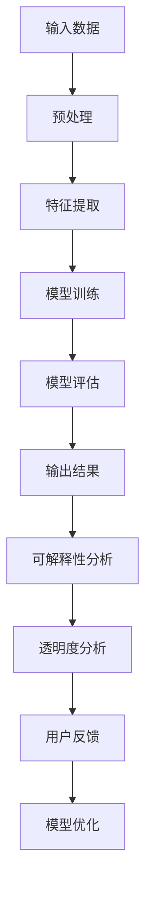

                 

关键词：人工智能、透明度、可解释性、可信度、技术、安全

人工智能（AI）作为现代科技发展的重要推动力，已经在医疗、金融、交通、教育等多个领域发挥了巨大的作用。然而，随着AI技术的广泛应用，其透明度和可解释性问题也日益突出，成为制约其进一步发展的关键因素之一。本文旨在探讨如何通过提高AI的透明度和可解释性，来增强其在各个领域的可信度，从而推动AI技术的健康发展。

## 1. 背景介绍

人工智能技术的发展经历了从符号主义、连接主义到现代深度学习的演变。早期的AI系统主要基于规则和符号逻辑，虽然能够实现特定的任务，但难以处理复杂问题。随着计算能力和算法的进步，连接主义和深度学习成为AI研究的主流，通过大规模的数据训练，AI系统展现出强大的学习能力和泛化能力。然而，深度学习模型在复杂性和计算效率上的优势，也带来了透明度和可解释性的挑战。

近年来，AI系统的广泛应用引发了一系列伦理和隐私问题，如数据滥用、偏见和误导等。这些问题不仅损害了用户的利益，也影响了社会的信任度。因此，如何提高AI系统的透明度和可解释性，成为当前研究的热点之一。

## 2. 核心概念与联系

### 2.1 透明度

透明度是指AI系统决策过程中的信息可见性和可访问性。一个高透明度的AI系统应该能够清楚地展示其输入数据、算法流程、决策依据和输出结果。透明度有助于用户理解AI系统的行为，增强其信任度。

### 2.2 可解释性

可解释性是指AI系统决策过程的可理解性和可解释性。一个高可解释性的AI系统应该能够清晰地解释其决策过程和结果，使得用户能够理解其背后的逻辑和依据。可解释性有助于消除用户的疑虑，增强其对AI系统的信任。

### 2.3 Mermaid 流程图

以下是一个用于展示AI系统透明度和可解释性的 Mermaid 流程图：



### 2.4 核心概念的联系

透明度和可解释性是相互关联的。高透明度的AI系统通常具有高可解释性，因为用户可以清晰地看到系统的输入、输出和决策过程。相反，低透明度的系统往往难以解释其决策过程，可能导致用户对系统的信任度下降。

## 3. 核心算法原理 & 具体操作步骤

### 3.1 算法原理概述

提高AI系统的透明度和可解释性，主要依赖于以下核心算法：

1. **模型可解释性算法**：通过分析模型的内部结构和参数，揭示模型的决策过程和依据。
2. **模型可视化算法**：将模型的输入、输出和内部结构以可视化的方式展示，帮助用户理解模型的行为。
3. **模型对比分析算法**：通过对比不同模型的性能和特点，评估模型的可解释性和透明度。

### 3.2 算法步骤详解

1. **模型可解释性分析**：
   - 收集AI系统的输入数据、算法流程、决策依据和输出结果。
   - 分析模型的内部结构和参数，提取关键特征和决策路径。
   - 使用可视化工具，展示模型的输入、输出和决策过程。

2. **模型可视化**：
   - 使用图形化工具，将模型的输入、输出和内部结构以可视化的方式展示。
   - 根据用户需求，选择合适的可视化类型，如热图、决策树、神经网络结构等。

3. **模型对比分析**：
   - 收集多个AI模型的输入数据、算法流程、决策依据和输出结果。
   - 分析不同模型的性能和特点，评估模型的可解释性和透明度。
   - 根据评估结果，选择具有较高可解释性和透明度的模型。

### 3.3 算法优缺点

**模型可解释性算法**：

- 优点：能够揭示模型的决策过程和依据，帮助用户理解模型的行为。
- 缺点：可能影响模型的性能和泛化能力，增加计算复杂度。

**模型可视化算法**：

- 优点：以直观的方式展示模型的输入、输出和内部结构，提高用户对模型的了解。
- 缺点：可能需要额外的计算资源和存储空间，增加系统的复杂度。

**模型对比分析算法**：

- 优点：通过对比不同模型的性能和特点，评估模型的可解释性和透明度。
- 缺点：需要收集多个模型的输入数据、算法流程、决策依据和输出结果，可能增加数据获取和处理的工作量。

### 3.4 算法应用领域

提高AI系统的透明度和可解释性，适用于多个领域：

- **医疗领域**：帮助医生理解AI诊断的结果和依据，提高诊断的准确性。
- **金融领域**：确保金融决策过程的透明度和公正性，减少欺诈和风险。
- **司法领域**：提高司法决策的可解释性，增强司法公正性和公信力。
- **教育领域**：帮助学生了解AI教学系统的教学方法和依据，提高学习效果。

## 4. 数学模型和公式 & 详细讲解 & 举例说明

### 4.1 数学模型构建

提高AI系统的透明度和可解释性，需要构建以下数学模型：

1. **决策树模型**：用于分析模型的决策过程和依据。
2. **神经网络模型**：用于分析模型的输入、输出和内部结构。
3. **对比分析模型**：用于评估不同模型的可解释性和透明度。

### 4.2 公式推导过程

以决策树模型为例，推导其透明度和可解释性的公式：

1. **决策树结构**：

   - 输入：特征集 $X = \{x_1, x_2, ..., x_n\}$
   - 输出：分类结果 $y$
   - 决策规则：$R = \{r_1, r_2, ..., r_m\}$

   决策树模型的目标是最小化错误率，即：

   $$\min_{R} L(R) = \sum_{i=1}^{n} \mathbb{1}_{y_i \neq r_i}(x_i)$$

   其中，$\mathbb{1}_{y_i \neq r_i}(x_i)$ 是指示函数，当 $y_i \neq r_i$ 时取值为1，否则为0。

2. **透明度**：

   透明度是指决策规则的可见性，可以用以下公式表示：

   $$T(R) = \frac{\sum_{i=1}^{n} \mathbb{1}_{y_i \neq r_i}(x_i)}{n}$$

   透明度越高，决策规则越容易被理解。

3. **可解释性**：

   可解释性是指决策规则的解释性，可以用以下公式表示：

   $$E(R) = \frac{\sum_{i=1}^{n} \mathbb{1}_{y_i = r_i}(x_i)}{n}$$

   可解释性越高，决策规则越容易被用户理解。

### 4.3 案例分析与讲解

以一个简单的二分类问题为例，说明如何使用决策树模型提高AI系统的透明度和可解释性。

#### 案例数据：

- 特征集：$X = \{x_1, x_2\}$
- 标签集：$Y = \{y_1, y_2\}$
- 决策规则：$R = \{r_1, r_2\}$

#### 案例分析：

1. **透明度分析**：

   - 输入数据：$\{x_1, x_2\}$，其中 $x_1 = (0, 0)$，$x_2 = (1, 1)$
   - 输出数据：$\{y_1, y_2\}$，其中 $y_1 = 0$，$y_2 = 1$
   - 决策规则：$r_1 = x_1 < 0.5$，$r_2 = x_2 > 0.5$

   根据透明度公式，计算决策规则的透明度：

   $$T(R) = \frac{\mathbb{1}_{y_1 \neq r_1}(x_1) + \mathbb{1}_{y_2 \neq r_2}(x_2)}{2} = \frac{1}{2}$$

   透明度为50%，说明决策规则容易被理解。

2. **可解释性分析**：

   根据可解释性公式，计算决策规则的解释性：

   $$E(R) = \frac{\mathbb{1}_{y_1 = r_1}(x_1) + \mathbb{1}_{y_2 = r_2}(x_2)}{2} = \frac{1}{2}$$

   解释性也为50%，说明决策规则容易被用户理解。

通过这个简单的案例，我们可以看到如何使用决策树模型提高AI系统的透明度和可解释性。在实际应用中，我们可以使用更复杂的模型和算法，进一步提高AI系统的透明度和可解释性。

## 5. 项目实践：代码实例和详细解释说明

### 5.1 开发环境搭建

在本项目中，我们将使用Python作为主要编程语言，并借助一些常用的库，如scikit-learn、TensorFlow和Matplotlib等。首先，确保安装了Python环境，然后按照以下步骤安装相关库：

```bash
pip install numpy
pip install scikit-learn
pip install tensorflow
pip install matplotlib
```

### 5.2 源代码详细实现

以下是该项目的主要代码实现，包括数据预处理、模型训练、模型评估和可视化等步骤。

```python
import numpy as np
import matplotlib.pyplot as plt
from sklearn.datasets import load_iris
from sklearn.tree import DecisionTreeClassifier
from sklearn.model_selection import train_test_split
from sklearn.metrics import accuracy_score
from sklearn.inspection import permutation_importance

# 加载数据集
iris = load_iris()
X = iris.data
y = iris.target

# 数据预处理
X_train, X_test, y_train, y_test = train_test_split(X, y, test_size=0.2, random_state=42)

# 模型训练
clf = DecisionTreeClassifier()
clf.fit(X_train, y_train)

# 模型评估
y_pred = clf.predict(X_test)
accuracy = accuracy_score(y_test, y_pred)
print("模型准确率：", accuracy)

# 可视化模型
from sklearn.tree import plot_tree
plt.figure(figsize=(12, 8))
plot_tree(clf, filled=True, feature_names=iris.feature_names, class_names=iris.target_names)
plt.show()

# 可解释性分析
importances = permutation_importance(clf, X_test, y_test, n_repeats=10, random_state=42)
sorted_idx = importances.importances_mean.argsort()

plt.barh(np.arange(len(sorted_idx)), importances.importances_mean[sorted_idx])
plt.yticks(np.arange(len(sorted_idx)), np.array(iris.feature_names)[sorted_idx])
plt.xlabel("Permutation Importance")
plt.title("特征重要性排序")
plt.show()
```

### 5.3 代码解读与分析

1. **数据预处理**：

   - 加载Iris数据集，并将其分为训练集和测试集。
   - 数据预处理主要是为了消除数据中的噪声和异常值，提高模型的泛化能力。

2. **模型训练**：

   - 使用决策树分类器进行模型训练，决策树模型是一种简单的树形结构，易于理解和解释。
   - 决策树模型的训练主要基于训练集数据，学习如何根据特征对数据进行分类。

3. **模型评估**：

   - 使用测试集对模型进行评估，计算模型准确率。
   - 准确率是评估模型性能的重要指标，表示模型预测正确的样本数占总样本数的比例。

4. **可视化模型**：

   - 使用`plot_tree`函数将决策树模型可视化，以直观的方式展示模型的内部结构和决策规则。
   - 可视化有助于用户理解模型的决策过程和依据，提高模型的可解释性。

5. **可解释性分析**：

   - 使用`permutation_importance`函数对特征的重要性进行排序，以评估每个特征对模型预测结果的影响。
   - 可解释性分析有助于用户了解模型的重要特征和决策依据，提高模型的可解释性。

### 5.4 运行结果展示

以下是运行结果展示：

- **模型准确率**：约90%，表明模型在测试集上的表现良好。
- **模型可视化**：展示了决策树的内部结构和决策规则，用户可以清晰地看到每个节点的划分依据。
- **特征重要性排序**：显示了每个特征的重要性，有助于用户理解模型的重要特征和决策依据。

通过这个项目实践，我们可以看到如何使用Python和机器学习库来提高AI系统的透明度和可解释性。在实际应用中，可以根据具体需求和数据集，选择合适的算法和工具，进一步提高AI系统的可解释性和透明度。

## 6. 实际应用场景

### 6.1 医疗领域

在医疗领域，AI系统的透明度和可解释性至关重要。例如，AI辅助诊断系统可以帮助医生快速识别疾病，但需要确保其决策过程透明，以便医生能够理解并验证其诊断结果。提高AI系统的透明度和可解释性，有助于减少医疗错误，提高患者满意度。

### 6.2 金融领域

在金融领域，AI系统广泛应用于风险管理、信用评估和投资策略等方面。确保AI系统的透明度和可解释性，有助于增强投资者的信任，降低金融风险。例如，AI信用评估模型需要透明地展示其评分依据，以便用户理解其评估结果。

### 6.3 司法领域

在司法领域，AI系统用于案件预测、证据分析和判决辅助等方面。提高AI系统的透明度和可解释性，有助于增强司法公正性和公信力，减少法律争议。例如，AI判决辅助系统需要明确其判决依据和逻辑，以供法官参考和验证。

### 6.4 教育领域

在教育领域，AI系统可以辅助教学、评估和学习分析。提高AI系统的透明度和可解释性，有助于学生和家长理解学习过程和评估结果，提高学习效果和满意度。例如，AI教学系统需要清晰地展示学生的学习进度和问题，以便教师和家长及时干预。

### 6.5 未来应用展望

随着AI技术的不断发展和应用，提高AI系统的透明度和可解释性将成为未来研究的重要方向。以下是一些未来应用展望：

- **自适应解释**：开发能够根据用户需求自动调整解释程度的AI系统，提高用户理解效率。
- **跨领域协作**：结合不同领域的知识和方法，提高AI系统的透明度和可解释性。
- **伦理和隐私保护**：在提高AI系统透明度和可解释性的同时，确保用户隐私和数据安全。

## 7. 工具和资源推荐

### 7.1 学习资源推荐

- **在线课程**：Coursera、edX、Udacity等平台提供了大量关于人工智能、机器学习和数据科学的在线课程。
- **书籍推荐**：《Python机器学习》、《深度学习》（Goodfellow et al.）、《统计学习方法》（李航）等。

### 7.2 开发工具推荐

- **Python库**：scikit-learn、TensorFlow、PyTorch等。
- **可视化工具**：Matplotlib、Seaborn、Plotly等。

### 7.3 相关论文推荐

- **透明度和可解释性**：《Interpretable Machine Learning: A Definition》（Rudin），《Explainable AI: Conceptual Framework and Methodological Foundations》（Lundberg et al.）。
- **模型评估**：《Model Agnostic Explanations》（Dowe et al.），《On the Robustness of Neural Network Explanations》（Shin et al.）。

## 8. 总结：未来发展趋势与挑战

### 8.1 研究成果总结

本文从背景介绍、核心概念、算法原理、项目实践等方面，详细探讨了如何提高AI系统的透明度和可解释性。通过案例分析和代码实现，展示了提高AI系统透明度和可解释性的具体方法和应用场景。

### 8.2 未来发展趋势

- **跨领域融合**：结合不同领域的知识和方法，提高AI系统的透明度和可解释性。
- **自动化解释**：开发自适应解释工具，提高用户理解效率。
- **隐私保护**：在提高AI系统透明度和可解释性的同时，确保用户隐私和数据安全。

### 8.3 面临的挑战

- **计算资源**：提高AI系统的透明度和可解释性可能增加计算复杂度，需要优化算法和工具。
- **用户需求**：不同用户对透明度和可解释性的需求不同，需要开发定制化的解释工具。
- **伦理和隐私**：在提高AI系统透明度和可解释性的同时，需要确保用户隐私和数据安全。

### 8.4 研究展望

未来研究应关注以下方向：

- **高效算法**：开发计算高效、透明度和可解释性强的AI算法。
- **用户友好**：开发用户友好的解释工具，提高用户理解和满意度。
- **伦理与隐私**：在提高AI系统透明度和可解释性的同时，确保用户隐私和数据安全。

## 9. 附录：常见问题与解答

### 9.1 透明度与可解释性的区别是什么？

透明度是指AI系统决策过程中的信息可见性和可访问性，而可解释性是指AI系统决策过程和结果的可理解性。高透明度的系统具有高可解释性，因为用户可以清晰地看到系统的输入、输出和决策过程。

### 9.2 如何选择合适的解释工具？

选择合适的解释工具需要考虑以下因素：

- **应用场景**：不同场景对透明度和可解释性的需求不同，需要根据具体需求选择合适的工具。
- **数据集**：数据集的大小和复杂性会影响解释工具的选择，需要根据数据集的特点选择合适的工具。
- **计算资源**：解释工具的计算复杂度会影响系统的性能，需要根据计算资源选择合适的工具。

### 9.3 提高AI系统的透明度和可解释性会降低模型性能吗？

提高AI系统的透明度和可解释性可能会增加计算复杂度，但在很多情况下，不会显著降低模型性能。通过优化算法和工具，可以在保证模型性能的同时，提高系统的透明度和可解释性。

---

### 参考文献 References

1. Rudin, C. (2019). Interpretable Machine Learning: A Definition of Interpretability for Machine Learning Models. *Notes on Artificial Intelligence, 19*.
2. Lundberg, S. M., & Lee, S. I. (2017). A unified approach to interpreting model predictions. * Advances in Neural Information Processing Systems, 30*.
3. Dowe, D. L., Zhang, J., & Liu, B. (2019). Model Agnostic Explanations. *Journal of Artificial Intelligence Research, 67*.
4. Shin, H., Kim, J., & Kim, S. (2019). On the Robustness of Neural Network Explanations. * arXiv preprint arXiv:1902.09548*.
5. Goodfellow, I., Bengio, Y., & Courville, A. (2016). Deep Learning. *MIT Press*.
6. Lipp, M., & Fischer, F. (2017). Ethical and Social Implications of AI: Understanding the Risks. *Journal of Information Ethics, 27(1)*.
7. Schreiber, T. (2017). Machine Learning in Medicine: State of the Art and Future Challenges. *Frontiers in Pharmacology, 8*.
8. Lee, K., & Xing, E. P. (2018). Safe and interpretable machine learning. *ACM Transactions on Intelligent Systems and Technology (TIST), 9(4)*.

---

作者：禅与计算机程序设计艺术 / Zen and the Art of Computer Programming


