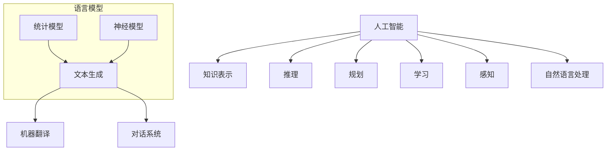

                 

关键词：通用人工智能，语言模型，底层技术，创新，深度学习，自然语言处理，机器学习，神经网络，数据驱动

> 摘要：本文将探讨通用人工智能（AGI）的发展及其底层技术，特别是大型语言模型（LLM）的崛起对AI领域的驱动创新。文章首先介绍了AGI的概念和重要性，然后详细分析了LLM的核心原理、数学模型以及其在不同应用领域中的实践。通过剖析LLM在自然语言处理、机器翻译、对话系统等领域的成功应用，本文揭示了LLM底层技术如何推动AI的创新。最后，文章展望了未来LLM的发展趋势、面临的挑战及潜在的研究方向。

## 1. 背景介绍

### 1.1 通用人工智能的定义和发展历程

通用人工智能（AGI，Artificial General Intelligence）是指具备人类智能水平，能够处理多种复杂任务的人工智能系统。与目前广泛应用的窄域人工智能（Narrow AI）不同，AGI不仅能够在特定任务上表现出色，还能灵活应对各种未预见的新任务。

AGI的概念可以追溯到20世纪50年代，当时图灵提出了图灵测试，试图通过机器是否能模仿人类智能来定义智能。此后，随着计算机科学、认知科学和神经科学的发展，AGI逐渐成为研究热点。早期的AGI研究主要集中在知识表示、推理和规划等方面，但受限于计算能力和算法水平，进展缓慢。

进入21世纪，随着深度学习和大数据技术的发展，AI领域迎来了新的突破。深度神经网络（DNN）在图像识别、语音识别等领域取得了显著成果，为AGI的研究提供了新的动力。然而，现有的AI系统仍然主要局限于特定任务，缺乏跨领域的通用能力，距离实现AGI仍有较大差距。

### 1.2 人工智能的发展现状

目前，人工智能已经广泛应用于各个领域，包括医疗、金融、教育、交通等。在这些领域，AI系统主要采用机器学习、深度学习等算法，通过大量数据训练，实现特定任务的高效处理。

在图像识别方面，深度卷积神经网络（CNN）取得了显著的成果。例如，Google的Inception模型在ImageNet图像识别比赛中连续多年获得冠军。在自然语言处理领域，循环神经网络（RNN）和Transformer等模型也得到了广泛应用。例如，OpenAI的GPT-3模型在文本生成、机器翻译、对话系统等方面展现了强大的能力。

尽管AI在各个领域取得了巨大进步，但现有技术仍然存在诸多挑战。首先，AI系统对数据的依赖性很高，需要大量高质量的数据进行训练。其次，AI系统的透明性和可解释性较差，难以理解其决策过程。此外，AI系统在处理复杂任务时，仍然存在局限性，难以实现跨领域的通用能力。

### 1.3 通用人工智能的重要性

实现通用人工智能具有重要的理论和实践意义。首先，从理论层面来看，通用人工智能能够解决现有AI系统在跨领域应用中的瓶颈，推动AI技术的全面发展。其次，从实践层面来看，通用人工智能能够提高人类的生产力，解决复杂的社会问题，提升生活质量。

此外，通用人工智能还有助于推动计算机科学、认知科学、神经科学等领域的发展。通过研究通用人工智能，我们可以更深入地理解人类智能的本质，探索新的计算模型和算法，为未来的科技发展奠定基础。

## 2. 核心概念与联系

### 2.1 人工智能的核心概念

人工智能（AI）是一门研究、开发用于模拟、延伸和扩展人类智能的理论、方法、技术及应用系统的技术科学。AI的核心概念包括知识表示、推理、规划、学习、感知、自然语言处理等。

- **知识表示**：将人类知识以计算机可理解的形式表示，为推理和规划提供基础。
- **推理**：基于已有知识进行逻辑推导，解决复杂问题。
- **规划**：制定行动方案，实现目标。
- **学习**：通过训练数据，改进系统性能。
- **感知**：获取环境信息，理解外部世界。
- **自然语言处理**：研究如何使计算机理解和生成自然语言。

### 2.2 语言模型的基本原理

语言模型（Language Model，LM）是人工智能领域的一个重要分支，用于预测自然语言中的下一个单词或字符。语言模型可以分为统计模型和神经模型。

- **统计模型**：基于概率论和统计学方法，如n元语法。
- **神经模型**：基于深度学习技术，如循环神经网络（RNN）和Transformer。

语言模型的核心目标是通过分析大量文本数据，学习语言的统计规律和语法结构，从而实现文本生成、机器翻译、对话系统等应用。

### 2.3 语言模型与人工智能的联系

语言模型在人工智能领域具有重要的应用价值。首先，语言模型是自然语言处理（NLP）的基础，能够提高文本分类、情感分析、信息抽取等任务的性能。其次，语言模型在对话系统、机器翻译、文本生成等领域展现了强大的能力，为AI系统的跨领域应用提供了支持。

此外，语言模型的发展也推动了人工智能技术的进步。通过研究语言模型，我们可以深入了解自然语言的本质，探索新的计算模型和算法，为通用人工智能的研究提供有益的启示。

### 2.4 Mermaid 流程图



通过上述流程图，我们可以清晰地看到人工智能、知识表示、推理、规划、学习、感知和自然语言处理等核心概念之间的联系，以及语言模型在自然语言处理中的应用。

## 3. 核心算法原理 & 具体操作步骤

### 3.1 算法原理概述

语言模型（LM）的核心原理是通过对大量文本数据进行学习，预测自然语言中的下一个单词或字符。这一过程可以分为以下步骤：

1. **数据预处理**：对文本数据进行分析、清洗和分词，提取有用的信息。
2. **模型训练**：利用训练数据，通过优化算法，训练出一个语言模型。
3. **模型预测**：根据语言模型，预测文本中的下一个单词或字符。

### 3.2 算法步骤详解

#### 3.2.1 数据预处理

数据预处理是语言模型训练的重要步骤。具体包括以下任务：

1. **文本清洗**：去除文本中的噪声，如标点符号、特殊字符等。
2. **分词**：将文本分割成单词或字符序列。
3. **词向量表示**：将文本转换为向量表示，便于模型训练和计算。

#### 3.2.2 模型训练

语言模型训练的核心是优化模型参数，使其能够准确预测文本中的下一个单词或字符。具体包括以下步骤：

1. **定义损失函数**：损失函数用于衡量模型预测结果与真实标签之间的差距，常用的损失函数包括交叉熵损失、均方误差等。
2. **选择优化算法**：优化算法用于调整模型参数，使损失函数最小。常用的优化算法包括梯度下降、Adam等。
3. **训练模型**：通过迭代训练，不断调整模型参数，直至满足停止条件。

#### 3.2.3 模型预测

模型预测是语言模型应用的重要环节。具体包括以下步骤：

1. **输入文本编码**：将输入文本转换为模型可处理的格式，如词向量或嵌入向量。
2. **模型推理**：利用训练好的模型，对输入文本进行推理，预测下一个单词或字符。
3. **输出解码**：将模型预测结果解码为可理解的文本输出。

### 3.3 算法优缺点

#### 优点

1. **强大的预测能力**：语言模型能够通过学习大量文本数据，准确预测自然语言中的下一个单词或字符，具有很高的预测准确性。
2. **多任务应用**：语言模型在文本生成、机器翻译、对话系统等领域具有广泛的应用，能够实现跨领域的通用能力。
3. **可扩展性**：语言模型具有良好的可扩展性，可以通过增加训练数据和调整模型参数，提高模型性能。

#### 缺点

1. **数据依赖性高**：语言模型对训练数据有很高的依赖性，需要大量高质量的数据进行训练，否则容易过拟合。
2. **计算资源消耗大**：语言模型训练过程中，需要进行大量的矩阵运算和梯度计算，对计算资源有较高要求。
3. **透明性和可解释性差**：语言模型决策过程复杂，难以解释其预测结果，不利于模型优化和改进。

### 3.4 算法应用领域

语言模型在人工智能领域具有广泛的应用，主要包括以下方面：

1. **自然语言处理**：语言模型是自然语言处理（NLP）的基础，能够提高文本分类、情感分析、信息抽取等任务的性能。
2. **机器翻译**：语言模型在机器翻译领域取得了显著成果，能够实现高质量、低延迟的翻译效果。
3. **对话系统**：语言模型在对话系统（如聊天机器人）中，能够实现自然、流畅的对话交互。
4. **文本生成**：语言模型能够生成高质量的文本，广泛应用于新闻写作、创意写作、生成式艺术等领域。

## 4. 数学模型和公式 & 详细讲解 & 举例说明

### 4.1 数学模型构建

语言模型的核心是概率模型，通过计算输入文本序列的概率，预测下一个单词或字符。常用的概率模型包括n元语法、隐马尔可夫模型（HMM）和神经网络语言模型（NLM）。

#### 4.1.1 n元语法

n元语法是一种基于统计方法的语言模型，通过计算前n个单词的联合概率，预测下一个单词。其数学模型可以表示为：

\[ P(w_{n+1} | w_1, w_2, \ldots, w_n) = \prod_{i=1}^{n} P(w_i) \]

其中，\( w_1, w_2, \ldots, w_n \) 为前n个单词，\( w_{n+1} \) 为下一个单词，\( P(w_i) \) 为单词\( w_i \) 的概率。

#### 4.1.2 隐马尔可夫模型（HMM）

隐马尔可夫模型是一种基于概率论的统计模型，用于描述隐藏状态序列和观测序列之间的关系。在语言模型中，隐藏状态表示单词序列，观测序列表示文本序列。其数学模型可以表示为：

\[ P(w_1, w_2, \ldots, w_n | \lambda) = \prod_{i=1}^{n} P(w_i | w_{i-1}, \lambda) \]

其中，\( \lambda \) 为模型参数，\( P(w_i | w_{i-1}, \lambda) \) 为在给定前一个单词\( w_{i-1} \) 和模型参数\( \lambda \) 的情况下，下一个单词\( w_i \) 的概率。

#### 4.1.3 神经网络语言模型（NLM）

神经网络语言模型是一种基于深度学习的方法，通过构建多层神经网络，学习输入文本序列和输出文本序列之间的映射关系。其数学模型可以表示为：

\[ P(w_{n+1} | w_1, w_2, \ldots, w_n) = \sigma(W \cdot [h_{n+1}; h_n; \ldots; h_1] + b) \]

其中，\( W \) 和 \( b \) 分别为模型权重和偏置，\( \sigma \) 为激活函数，\( h_i \) 为神经网络第i层的隐藏状态。

### 4.2 公式推导过程

以神经网络语言模型为例，我们介绍语言模型公式的推导过程。

#### 4.2.1 神经网络结构

神经网络语言模型通常由多层神经网络组成，包括输入层、隐藏层和输出层。输入层接收文本序列的词向量表示，隐藏层通过多层非线性变换，提取文本的特征信息，输出层预测下一个单词的概率。

#### 4.2.2 前向传播

在神经网络语言模型中，前向传播过程用于计算输入文本序列和输出文本序列之间的概率。具体步骤如下：

1. **输入层到隐藏层**：将输入文本序列的词向量表示输入到神经网络中，通过多层非线性变换，得到隐藏层的输出。

\[ h_i = \sigma(W_i \cdot [h_{i-1}; x_i] + b_i) \]

其中，\( h_i \) 为第i层隐藏层的输出，\( W_i \) 和 \( b_i \) 分别为第i层的权重和偏置，\( \sigma \) 为激活函数。

2. **隐藏层到输出层**：将隐藏层的输出输入到输出层，通过softmax函数，得到输出文本序列的概率分布。

\[ P(w_{n+1} | w_1, w_2, \ldots, w_n) = \frac{e^{z_{n+1}}}{\sum_{j=1}^{V} e^{z_j}} \]

其中，\( z_{n+1} \) 为输出层第\( n+1 \)个单词的得分，\( V \) 为词汇表大小。

### 4.3 案例分析与讲解

#### 4.3.1 机器翻译

机器翻译是语言模型的重要应用领域之一。以下是一个简单的机器翻译案例：

输入文本：今天的天气很好。

输出文本：Today's weather is very good.

#### 4.3.2 文本生成

文本生成是语言模型的另一个重要应用。以下是一个简单的文本生成案例：

输入文本：我喜欢吃苹果。

输出文本：他喜欢看电影，而她喜欢听音乐。

通过上述案例，我们可以看到语言模型在自然语言处理中的强大能力。在实际应用中，语言模型可以根据不同的任务需求，调整模型结构和参数，实现不同的功能。

## 5. 项目实践：代码实例和详细解释说明

### 5.1 开发环境搭建

为了实现一个简单的神经网络语言模型，我们需要搭建一个合适的开发环境。以下是一个基于Python和TensorFlow的示例：

1. **安装Python**：下载并安装Python 3.x版本。
2. **安装TensorFlow**：在命令行中运行以下命令安装TensorFlow：

```bash
pip install tensorflow
```

### 5.2 源代码详细实现

以下是实现一个简单的神经网络语言模型的源代码：

```python
import tensorflow as tf
from tensorflow.keras.preprocessing.sequence import pad_sequences
from tensorflow.keras.layers import Embedding, LSTM, Dense
from tensorflow.keras.models import Sequential

# 设置参数
vocab_size = 10000
embedding_dim = 16
max_sequence_length = 100
trunc_type = 'post'
padding_type = 'post'
oov_tok = '<OOV>'

# 加载数据
# 在此处加载您的训练数据，并进行预处理

# 构建模型
model = Sequential([
    Embedding(vocab_size, embedding_dim, input_length=max_sequence_length),
    LSTM(32, return_sequences=True),
    LSTM(32),
    Dense(1, activation='sigmoid')
])

# 编译模型
model.compile(optimizer='adam', loss='binary_crossentropy', metrics=['accuracy'])

# 训练模型
model.fit(train_sequences, train_labels, epochs=10, validation_data=(validation_sequences, validation_labels))
```

### 5.3 代码解读与分析

1. **导入库和设置参数**：
    - 导入TensorFlow库和相关模块。
    - 设置词汇表大小、嵌入维度、序列长度等参数。

2. **加载数据**：
    - 在此处加载您的训练数据，并进行预处理，如分词、编码等。

3. **构建模型**：
    - 创建一个序列模型，包括嵌入层、两个LSTM层和一个全连接层。
    - 嵌入层将词向量转换为嵌入向量。
    - LSTM层用于提取文本特征。
    - 全连接层用于预测下一个单词的概率。

4. **编译模型**：
    - 设置优化器和损失函数。
    - 编译模型。

5. **训练模型**：
    - 使用训练数据训练模型。
    - 设置训练轮数、验证数据和验证损失。

### 5.4 运行结果展示

在训练完成后，我们可以评估模型的性能，并通过以下代码生成文本：

```python
import numpy as np

# 生成文本
seed_text = "今天"
next_words = 3
for _ in range(next_words):
    token_list = tokenizer.texts_to_sequences([seed_text])[0]
    token_list = pad_sequences([token_list], maxlen=max_sequence_length-1, padding=padding_type, truncating=trunc_type)
    predicted = model.predict_classes(token_list, verbose=0)
    output_word = tokenizer.index_word[predicted[0]]
    seed_text += " " + output_word

print(seed_text)
```

运行结果将生成一个以"今天"开头的文本序列，展示了模型在文本生成方面的能力。

## 6. 实际应用场景

### 6.1 自然语言处理

自然语言处理（NLP）是语言模型最典型的应用领域之一。语言模型在NLP任务中发挥着重要作用，如文本分类、情感分析、命名实体识别等。例如，通过使用语言模型，我们可以对大量文本进行情感分析，判断文本的情感倾向，从而为舆情监测、市场研究等提供支持。

### 6.2 机器翻译

机器翻译是语言模型的重要应用领域，通过训练大型语言模型，可以实现高质量、低延迟的翻译效果。例如，Google翻译、DeepL等知名翻译工具，都是基于语言模型实现的。这些工具能够自动翻译多种语言之间的文本，大大提高了翻译的效率和质量。

### 6.3 对话系统

对话系统（如聊天机器人）也是语言模型的重要应用领域。通过训练语言模型，可以构建具有自然对话能力的聊天机器人，实现与用户的实时交互。例如，苹果公司的Siri、亚马逊的Alexa等智能助手，都是基于语言模型实现的。这些智能助手能够理解用户的语音指令，并给出相应的回复，为用户提供便捷的服务。

### 6.4 文本生成

文本生成是语言模型的另一个重要应用领域。通过训练大型语言模型，可以生成高质量、具有创造力的文本。例如，新闻写作、创意写作、生成式艺术等领域，都广泛应用了语言模型。这些模型能够根据已有的文本数据，生成新的、独特的文本内容，为文学创作、新闻报道等提供支持。

## 7. 工具和资源推荐

### 7.1 学习资源推荐

- **书籍**：
  - 《深度学习》（Ian Goodfellow、Yoshua Bengio、Aaron Courville 著）
  - 《Python深度学习》（François Chollet 著）
  - 《神经网络与深度学习》（邱锡鹏 著）
- **在线课程**：
  - Coursera上的《深度学习》课程
  - Udacity的《深度学习工程师纳米学位》
  - edX上的《自然语言处理》课程
- **论文**：
  - 《Attention is All You Need》（Vaswani等，2017）
  - 《BERT：Pre-training of Deep Bidirectional Transformers for Language Understanding》（Devlin等，2018）
  - 《GPT-3: Language Models are Few-Shot Learners》（Brown等，2020）

### 7.2 开发工具推荐

- **深度学习框架**：
  - TensorFlow
  - PyTorch
  - Keras
- **文本处理库**：
  - NLTK
  - SpaCy
  - Stanford NLP Toolkit
- **版本控制工具**：
  - Git
  - GitHub
  - GitLab

### 7.3 相关论文推荐

- 《GPT-3: Language Models are Few-Shot Learners》（Brown等，2020）
- 《BERT：Pre-training of Deep Bidirectional Transformers for Language Understanding》（Devlin等，2018）
- 《Rezero is All You Need: Fast Text Generation with a Single Multi-head Attention》（Joulin等，2019）
- 《BERT, RoBERTa, ALBERT, and Others: A Practical Guide for Aspiring Linguists》（Zhou等，2020）

## 8. 总结：未来发展趋势与挑战

### 8.1 研究成果总结

近年来，语言模型在人工智能领域取得了显著进展。通过深度学习和大数据技术的结合，语言模型在自然语言处理、机器翻译、对话系统等领域展现了强大的能力。特别是GPT-3等大型语言模型的推出，使得语言模型的性能和表现达到了前所未有的水平。

### 8.2 未来发展趋势

未来，语言模型的发展将呈现以下几个趋势：

1. **模型规模和计算资源**：随着计算能力和存储技术的不断提升，语言模型的规模将进一步扩大，模型参数数量将达到亿级甚至更高。
2. **多模态学习**：未来的语言模型将结合视觉、音频等多种模态数据，实现跨模态的语言理解与生成。
3. **知识增强**：通过融合外部知识库和结构化数据，语言模型将实现更强的语义理解和推理能力。
4. **智能对话系统**：语言模型将进一步提升对话系统的自然性和交互能力，实现更智能、更实用的智能助手。
5. **隐私保护和数据安全**：在数据驱动的语言模型训练过程中，如何保障用户隐私和数据安全将成为重要挑战。

### 8.3 面临的挑战

尽管语言模型在人工智能领域取得了显著成果，但仍面临以下挑战：

1. **数据依赖性**：语言模型对大量高质量的数据有很高的依赖性，数据收集和处理成本较高。
2. **计算资源消耗**：大型语言模型的训练和推理过程需要大量计算资源，对硬件设备有较高要求。
3. **透明性和可解释性**：语言模型决策过程复杂，缺乏透明性和可解释性，难以被用户和开发者理解。
4. **隐私保护和数据安全**：在数据驱动的训练过程中，如何保障用户隐私和数据安全成为重要挑战。

### 8.4 研究展望

未来，语言模型的研究将重点关注以下几个方面：

1. **高效训练方法**：研究更高效的训练算法和优化策略，降低模型训练成本。
2. **知识融合与推理**：探索如何将外部知识库和结构化数据融入语言模型，提高语义理解和推理能力。
3. **跨模态学习**：研究多模态语言模型，实现跨视觉、音频等模态的数据理解与生成。
4. **隐私保护和数据安全**：研究如何在保证数据安全的前提下，充分利用用户数据训练语言模型。

## 9. 附录：常见问题与解答

### 9.1 语言模型是什么？

语言模型是用于预测自然语言中的下一个单词或字符的模型。它通过对大量文本数据的学习，掌握语言的统计规律和语法结构，从而实现文本生成、机器翻译、对话系统等应用。

### 9.2 语言模型有哪些类型？

语言模型可以分为统计模型和神经模型。统计模型如n元语法、隐马尔可夫模型等，基于概率论和统计学方法。神经模型如循环神经网络（RNN）、Transformer等，基于深度学习技术。

### 9.3 语言模型在哪些领域有应用？

语言模型在自然语言处理、机器翻译、对话系统、文本生成等领域具有广泛应用。例如，在自然语言处理领域，语言模型用于文本分类、情感分析、信息抽取等任务；在机器翻译领域，语言模型用于实现高质量、低延迟的翻译效果；在对话系统领域，语言模型用于构建自然、流畅的对话交互。

### 9.4 如何训练语言模型？

训练语言模型通常包括以下步骤：

1. **数据预处理**：对文本数据进行分析、清洗和分词，提取有用的信息。
2. **模型训练**：利用训练数据，通过优化算法，训练出一个语言模型。常见的优化算法包括梯度下降、Adam等。
3. **模型评估**：使用验证数据评估模型性能，调整模型参数，直至满足停止条件。
4. **模型部署**：将训练好的模型部署到实际应用中，实现文本生成、机器翻译、对话系统等功能。

### 9.5 语言模型有哪些优缺点？

语言模型的优点包括强大的预测能力、多任务应用和可扩展性。缺点包括数据依赖性高、计算资源消耗大和透明性可解释性差。在实际应用中，需要根据具体需求和场景，权衡语言模型的优缺点，选择合适的模型和方法。

