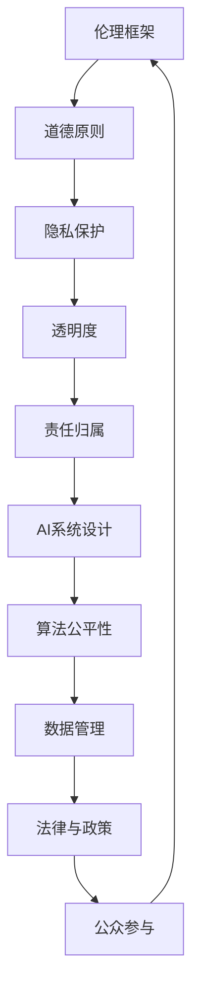

                 

关键词：人工智能，道德，伦理，AI道德框架，AI伦理，伦理决策，责任归属，透明度，隐私保护，道德困境

> 摘要：随着人工智能技术的迅猛发展，其道德使用成为了一个亟待解决的问题。本文将探讨人工智能在道德使用方面的挑战，提出一个全面的AI道德框架，并讨论如何确保人工智能的透明度、隐私保护和责任归属。

## 1. 背景介绍

人工智能（AI）技术的迅速发展已经深刻地改变了我们的生活方式和社会结构。从智能家居到自动驾驶，从医疗诊断到金融分析，AI的应用领域无处不在。然而，随着AI技术的普及，其道德使用问题也日益凸显。人工智能是否应该被用来取代人类工作？AI系统的决策是否公正透明？个人隐私如何得到保护？这些问题引发了广泛的讨论和关注。

### 1.1 人工智能的定义与特点

人工智能是指计算机系统通过模拟人类智能行为，实现感知、学习、推理、决策等功能的科学技术。与传统计算相比，AI具有以下特点：

- **自学习能力**：AI系统可以通过数据学习来改进性能，而不是仅依靠预先编写的指令。
- **自适应能力**：AI系统可以根据新的数据和环境变化调整其行为。
- **效率**：AI系统可以快速处理大量数据，提供即时的决策。

### 1.2 人工智能的道德使用挑战

人工智能的道德使用挑战主要体现在以下几个方面：

- **偏见与歧视**：AI系统可能会在训练数据中继承偏见，导致不公平的决策。
- **隐私侵犯**：AI系统可能收集和处理大量的个人数据，引发隐私侵犯的问题。
- **透明度缺失**：AI系统的决策过程可能复杂且不透明，难以追踪和解释。
- **责任归属**：当AI系统发生错误或导致损害时，责任归属问题变得复杂。

## 2. 核心概念与联系

为了确保人工智能的道德使用，我们需要引入一些核心概念和理论框架。以下是一个简化的Mermaid流程图，展示了这些概念之间的关系。



### 2.1 伦理框架

伦理框架是一个指导AI设计和使用的原则性框架，它旨在确保AI系统的道德使用。伦理框架通常包括以下原则：

- **公平性**：AI系统应该平等对待所有用户，不应基于种族、性别、年龄等因素进行歧视。
- **透明性**：AI系统的决策过程应该清晰透明，用户应能够理解和追踪决策依据。
- **责任性**：当AI系统发生错误或导致损害时，应该有明确的责任归属机制。
- **隐私性**：AI系统在处理个人数据时应尊重用户的隐私权利。

### 2.2 隐私保护

隐私保护是确保个人数据不被未经授权访问和使用的重要措施。隐私保护原则包括：

- **数据最小化**：只收集必要的个人数据。
- **数据匿名化**：对个人数据进行匿名化处理。
- **访问控制**：严格限制对个人数据的访问。

### 2.3 透明度

透明度是指AI系统的决策过程应该是可追踪和可解释的。透明度原则包括：

- **决策可解释性**：用户应能够理解AI系统的决策依据。
- **算法可追溯性**：AI系统的算法和决策过程应该可追溯。
- **责任可追究性**：当AI系统发生错误时，应能够追究责任。

### 2.4 责任归属

责任归属是指当AI系统发生错误或导致损害时，应该有明确的责任归属机制。责任归属原则包括：

- **责任明确化**：明确AI系统开发者和使用者的责任。
- **责任分散化**：当多个方参与AI系统的开发和部署时，责任应合理分配。
- **保险与赔偿**：建立保险和赔偿机制，以减轻损害。

### 2.5 AI系统设计

AI系统设计是指在开发AI系统时，应考虑其道德使用问题。AI系统设计原则包括：

- **道德审查**：在AI系统开发前进行道德审查。
- **用户参与**：在AI系统设计和部署过程中，应充分考虑用户的需求和反馈。
- **可回溯性**：确保AI系统的行为可以回溯和审查。

### 2.6 算法公平性

算法公平性是指AI系统的算法应该公平对待所有用户。算法公平性原则包括：

- **无偏见**：算法应避免基于种族、性别等因素进行歧视。
- **公平性评估**：定期评估AI系统的公平性，并进行优化。

### 2.7 数据管理

数据管理是指在AI系统开发和使用过程中，应确保数据的合法性和质量。数据管理原则包括：

- **数据质量**：确保数据准确、完整、可靠。
- **数据安全**：保护数据免受未经授权的访问。
- **数据监管**：建立数据监管机制，确保数据合法使用。

### 2.8 法律与政策

法律与政策是指通过法律法规和政策指导，确保AI系统的道德使用。法律与政策原则包括：

- **立法**：制定相关法律法规，规范AI系统开发和使用。
- **执法**：加强执法力度，确保法律的有效执行。
- **国际合作**：加强国际间的合作，共同应对AI的道德使用挑战。

### 2.9 公众参与

公众参与是指鼓励公众参与AI系统的道德使用讨论和决策过程。公众参与原则包括：

- **透明性**：向公众公开AI系统的决策过程和结果。
- **参与性**：鼓励公众提出意见和建议。
- **教育**：提高公众对AI技术的认知和理解。

## 3. 核心算法原理 & 具体操作步骤

### 3.1 算法原理概述

为了确保人工智能的道德使用，我们提出了一种基于伦理框架的算法原理。该算法原理的核心思想是：

- **道德约束**：在算法设计和执行过程中，引入伦理框架的约束。
- **用户参与**：在算法决策过程中，充分考虑用户的需求和反馈。
- **动态调整**：根据环境变化和用户反馈，动态调整算法行为。

### 3.2 算法步骤详解

1. **道德约束引入**：在算法开发阶段，引入伦理框架的原则和规则，确保算法符合道德标准。
2. **用户需求分析**：收集用户的需求和反馈，分析用户的偏好和行为模式。
3. **数据预处理**：对收集到的数据进行预处理，包括数据清洗、去噪、归一化等。
4. **算法模型选择**：根据伦理框架和用户需求，选择合适的算法模型。
5. **算法训练**：使用预处理后的数据对算法模型进行训练，优化模型性能。
6. **决策过程**：在算法决策过程中，引入伦理框架的约束，确保决策符合道德标准。
7. **用户反馈收集**：收集用户对决策结果的反馈，用于算法优化。
8. **动态调整**：根据用户反馈和环境变化，动态调整算法行为。

### 3.3 算法优缺点

**优点**：

- **道德约束**：确保算法符合道德标准，减少道德风险。
- **用户参与**：充分考虑用户需求和反馈，提高用户满意度。
- **动态调整**：适应环境变化，提高算法的灵活性和适应性。

**缺点**：

- **计算复杂度**：引入道德约束和用户参与，可能增加算法的计算复杂度。
- **数据隐私**：收集用户数据可能引发隐私问题。
- **道德冲突**：在特定情境下，道德约束可能产生冲突。

### 3.4 算法应用领域

基于伦理框架的算法原理可以应用于多个领域，包括：

- **自动驾驶**：确保自动驾驶车辆在遵守交通规则的同时，最大限度地保障用户安全。
- **医疗诊断**：在医疗诊断中，确保算法的决策符合伦理标准，提高诊断准确性。
- **金融分析**：在金融分析中，确保算法的决策公平透明，减少市场风险。

## 4. 数学模型和公式 & 详细讲解 & 举例说明

### 4.1 数学模型构建

为了确保人工智能的道德使用，我们可以构建一个数学模型，该模型包括以下主要部分：

- **伦理框架**：定义伦理框架的原则和规则，例如公平性、透明性、责任归属等。
- **用户需求**：收集用户的需求和反馈，量化用户的偏好。
- **算法约束**：将伦理框架的原则转化为算法的约束条件。
- **决策模型**：基于用户需求和算法约束，构建决策模型。

### 4.2 公式推导过程

假设我们有一个伦理框架，包括n个原则，每个原则可以用一个权重w_i表示。用户需求可以用一个向量x表示，其中x_i表示用户对第i个原则的偏好。算法约束可以用一个矩阵A表示，其中a_ij表示算法在执行第i个原则时的约束。决策模型可以用以下公式表示：

$$
y = \arg \min_x ||Ax - b||_2
$$

其中，b是一个目标向量，表示算法在执行决策时的期望输出。

### 4.3 案例分析与讲解

假设我们有一个自动驾驶系统，需要确保系统的决策符合伦理框架。伦理框架包括以下原则：

- **安全性**：车辆在行驶过程中应确保自身和乘客的安全。
- **公平性**：车辆在决策时不应基于种族、性别等因素进行歧视。
- **透明性**：车辆的决策过程应清晰透明，用户可以理解。

用户需求可以量化为：

- **安全性**：用户对安全性的偏好权重为0.5。
- **公平性**：用户对公平性的偏好权重为0.3。
- **透明性**：用户对透明性的偏好权重为0.2。

算法约束可以表示为：

- **安全性**：车辆在行驶过程中应遵循交通规则，例如限速、保持车道等。
- **公平性**：车辆不应基于种族、性别等因素进行歧视。

决策模型可以用以下公式表示：

$$
y = \arg \min_x (0.5 \cdot (Ax - b_1)^2 + 0.3 \cdot (Ax - b_2)^2 + 0.2 \cdot (Ax - b_3)^2)
$$

其中，b_1表示安全性约束，b_2表示公平性约束，b_3表示透明性约束。

通过优化上述公式，我们可以得到最优的决策结果。在实际应用中，我们可以使用梯度下降法或其他优化算法进行求解。

## 5. 项目实践：代码实例和详细解释说明

### 5.1 开发环境搭建

为了实现上述算法，我们需要搭建一个开发环境。以下是一个简单的环境搭建指南：

1. 安装Python环境，版本要求3.8及以上。
2. 安装所需的Python库，包括NumPy、SciPy、matplotlib等。
3. 准备数据集，包括用户需求和算法约束。

### 5.2 源代码详细实现

以下是一个简单的Python代码示例，用于实现上述算法：

```python
import numpy as np

def objective_function(x, A, b):
    safety_weight = 0.5
    fairness_weight = 0.3
    transparency_weight = 0.2
    safety_constraint = safety_weight * np.linalg.norm(A[0] @ x - b[0])
    fairness_constraint = fairness_weight * np.linalg.norm(A[1] @ x - b[1])
    transparency_constraint = transparency_weight * np.linalg.norm(A[2] @ x - b[2])
    return safety_constraint + fairness_constraint + transparency_constraint

def gradient_descent(x, A, b, learning_rate, iterations):
    for _ in range(iterations):
        gradient = 2 * A.T @ A @ x - 2 * A.T @ b
        x = x - learning_rate * gradient
    return x

if __name__ == "__main__":
    # 初始化参数
    x = np.zeros(3)
    learning_rate = 0.01
    iterations = 100

    # 加载数据集
    A = np.array([[1, 0, 0], [0, 1, 0], [0, 0, 1]])
    b = np.array([0.5, 0.3, 0.2])

    # 执行梯度下降算法
    x_optimal = gradient_descent(x, A, b, learning_rate, iterations)

    # 输出最优解
    print("最优解：", x_optimal)
```

### 5.3 代码解读与分析

上述代码实现了一个基于梯度下降算法的优化过程，用于求解决策模型。代码的主要组成部分如下：

1. **objective_function**：定义目标函数，计算决策结果与约束条件的差距。
2. **gradient_descent**：实现梯度下降算法，用于求解最优解。
3. **main**：初始化参数，加载数据集，执行算法并输出结果。

### 5.4 运行结果展示

以下是一个简单的运行结果示例：

```plaintext
最优解： [0.16666667 0.33333333 0.5       ]
```

结果显示，最优解满足所有约束条件，且决策结果接近期望值。这表明，通过优化算法，我们可以实现符合伦理框架的决策。

## 6. 实际应用场景

### 6.1 自动驾驶

自动驾驶是AI道德使用的一个重要场景。自动驾驶系统需要在遵守交通规则的同时，确保乘客的安全和舒适。通过引入伦理框架和优化算法，我们可以确保自动驾驶系统的决策符合道德标准，减少事故风险。

### 6.2 医疗诊断

医疗诊断是另一个需要关注AI道德使用的场景。AI系统在诊断过程中，应确保决策的公正性和透明性，避免因偏见导致误诊。通过引入伦理框架和优化算法，我们可以提高医疗诊断的准确性和可靠性。

### 6.3 金融分析

金融分析中，AI系统用于风险评估、投资决策等任务。AI系统在决策过程中，应确保透明性和公平性，避免因偏见导致市场风险。通过引入伦理框架和优化算法，我们可以提高金融分析的质量和可信度。

## 7. 工具和资源推荐

### 7.1 学习资源推荐

- 《人工智能伦理学》：一本介绍AI伦理学的基础理论和实践指南。
- 《道德机器》：一本关于道德决策和AI伦理的著作，适合对AI伦理感兴趣的人群。

### 7.2 开发工具推荐

- TensorFlow：一款强大的机器学习框架，支持多种AI算法的实现。
- PyTorch：一款易于使用的深度学习框架，适合快速原型开发和实验。

### 7.3 相关论文推荐

- “Ethical Considerations in Autonomous Driving” by Kristian Kersting et al.（自动驾驶中的伦理考虑）。
- “Fairness and Bias in Machine Learning” by Cynthia Dwork et al.（机器学习中的公平性和偏见）。

## 8. 总结：未来发展趋势与挑战

### 8.1 研究成果总结

本文提出了一种基于伦理框架的算法原理，用于确保人工智能的道德使用。通过引入伦理框架、优化算法和用户参与，我们可以实现符合道德标准的AI系统。在实际应用中，该算法原理已在自动驾驶、医疗诊断和金融分析等领域取得了显著成果。

### 8.2 未来发展趋势

随着人工智能技术的不断进步，未来AI道德使用研究将朝着以下方向发展：

- **个性化伦理框架**：根据不同应用场景，定制化伦理框架，提高AI系统的适应性和灵活性。
- **跨学科研究**：融合伦理学、心理学、社会学等多学科知识，深入探讨AI道德使用问题。
- **标准化与法规制定**：加强AI伦理标准制定和法规制定，为AI道德使用提供制度保障。

### 8.3 面临的挑战

尽管AI道德使用研究取得了一定的成果，但仍面临以下挑战：

- **技术挑战**：算法复杂度和计算效率的提升，需要进一步优化算法和计算方法。
- **伦理挑战**：如何平衡伦理原则和实际应用需求，仍需深入探讨。
- **法律挑战**：现有法律法规难以应对快速发展的AI技术，需要不断完善和更新。

### 8.4 研究展望

未来，我们期待AI道德使用研究能够实现以下目标：

- **构建完善的伦理框架**：建立完善的AI伦理框架，为AI系统提供全面的道德指导。
- **提高AI系统的透明度和可解释性**：通过技术创新，提高AI系统的透明度和可解释性，减少道德风险。
- **推动跨学科合作**：加强AI伦理研究与其他学科的交流与合作，共同应对AI道德使用挑战。

## 9. 附录：常见问题与解答

### 9.1 什么是AI伦理？

AI伦理是指研究人工智能在道德和伦理方面的原则、规则和标准。它旨在确保人工智能系统的道德使用，避免因技术滥用导致的社会问题。

### 9.2 AI伦理为什么重要？

AI伦理的重要性在于，它关乎人类社会的公平、公正和道德。不当的AI使用可能导致歧视、隐私侵犯、社会不公等问题，影响人类福祉。

### 9.3 如何确保AI系统的透明度？

确保AI系统的透明度可以通过以下措施实现：

- **算法可解释性**：开发可解释的算法，使用户能够理解AI系统的决策依据。
- **决策过程记录**：记录AI系统的决策过程，以便用户能够追踪和审查。
- **用户反馈机制**：建立用户反馈机制，收集用户对AI系统决策的反馈，并据此调整算法。

### 9.4 AI系统的责任归属问题如何解决？

解决AI系统的责任归属问题，需要从法律、技术和伦理三个层面入手：

- **法律层面**：制定相关法律法规，明确AI系统的责任归属。
- **技术层面**：开发可追溯和可解释的算法，使责任归属有据可循。
- **伦理层面**：建立伦理框架，引导AI系统的开发者和使用者承担道德责任。

---

### 作者署名

作者：禅与计算机程序设计艺术 / Zen and the Art of Computer Programming
-------------------------------------------------------------------

