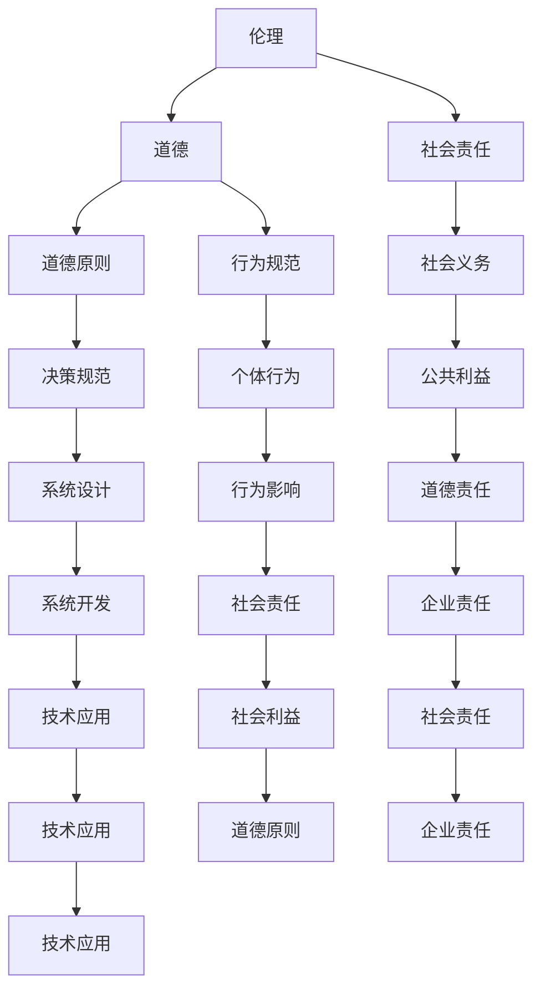

                 

关键词：人工智能、道德伦理、伦理边界、人工智能伦理、AI 伦理、道德决策、伦理困境、社会责任、伦理框架

> 摘要：随着人工智能技术的快速发展，其在各个领域的应用越来越广泛，但也引发了诸多伦理和社会问题。本文将探讨人工智能发展过程中所面临的道德边界挑战，包括伦理决策的复杂性、社会影响、隐私保护和透明度等问题，并提出相应的解决方案和未来研究方向。

## 1. 背景介绍

人工智能（Artificial Intelligence, AI）作为计算机科学领域的一个重要分支，旨在使计算机能够模拟、延伸和扩展人类的智能。近年来，随着深度学习、神经网络等技术的突破，AI 已经在图像识别、自然语言处理、自动驾驶、医疗诊断等领域取得了显著成果。然而，AI 的发展也带来了许多道德和社会问题，引发了广泛的关注和讨论。

### 1.1 人工智能的应用现状

目前，人工智能技术已经在许多领域得到了广泛应用。例如，自动驾驶技术正在逐步商业化，自动驾驶汽车有望在未来改变交通方式；智能语音助手如 Siri、Alexa 等已经成为人们生活中的常见工具；医疗领域中的 AI 诊断和药物研发也取得了重要突破。此外，AI 还在金融、安全、教育、娱乐等领域发挥着重要作用。

### 1.2 伦理问题的挑战

尽管人工智能技术带来了诸多便利，但也引发了许多伦理和社会问题。例如，AI 的决策过程缺乏透明度和可解释性，可能导致不公平的决策；在数据隐私保护方面，AI 的应用可能加剧个人隐私泄露的风险；此外，AI 的自主决策可能导致不可预测的后果，甚至威胁人类安全。这些问题引发了社会对 AI 发展的担忧和质疑，促使我们深入探讨 AI 面临的道德边界挑战。

## 2. 核心概念与联系

为了更好地理解 AI 发展中的伦理问题，我们需要明确一些核心概念，包括伦理、道德和社会责任等。

### 2.1 伦理

伦理是指人们在行为和决策中遵循的道德原则和规范。伦理学是研究道德原则和道德行为的哲学分支。在 AI 领域，伦理问题主要涉及 AI 系统的设计、开发和使用过程中如何保证道德原则得到遵循。

### 2.2 道德

道德是指人们在行为和决策中遵循的道德规范和价值观念。道德与伦理密切相关，但道德更多地关注个体的行为规范。在 AI 领域，道德问题主要涉及 AI 系统对人类行为的影响和责任。

### 2.3 社会责任

社会责任是指企业在经营和发展过程中承担的社会责任和义务。在 AI 领域，社会责任主要涉及企业对 AI 技术的应用和推广过程中如何保障社会公共利益和道德原则。

### 2.4 Mermaid 流程图



## 3. 核心算法原理 & 具体操作步骤

### 3.1 算法原理概述

为了应对 AI 发展中的伦理问题，研究者们提出了多种伦理算法。伦理算法旨在使 AI 系统在决策过程中遵循道德原则和规范。伦理算法的基本原理包括：

1. **道德原则嵌入**：将道德原则和规范嵌入到 AI 系统的决策过程中，使其能够根据道德原则进行决策。
2. **多目标优化**：在 AI 系统的决策过程中，同时考虑道德目标和其他目标，如效率、实用性等，以实现综合最优解。
3. **可解释性**：提高 AI 系统的决策透明度和可解释性，使其能够为人类理解和接受。

### 3.2 算法步骤详解

伦理算法的具体操作步骤如下：

1. **定义道德原则**：根据特定的应用场景，明确需要遵循的道德原则，如公平性、透明度、公正性等。
2. **构建决策模型**：根据道德原则，构建 AI 决策模型，使其能够在决策过程中遵循道德原则。
3. **多目标优化**：在决策模型中，同时考虑道德目标和其他目标，如效率、实用性等，以实现综合最优解。
4. **评估与调整**：对决策模型进行评估和调整，确保其能够在实际应用中有效遵循道德原则。

### 3.3 算法优缺点

伦理算法的优点包括：

1. **提高透明度**：通过提高决策过程的透明度，使 AI 系统的决策结果更容易为人类理解和接受。
2. **遵循道德原则**：使 AI 系统在决策过程中遵循道德原则和规范，减少道德风险。

伦理算法的缺点包括：

1. **复杂度高**：伦理算法通常涉及多目标优化和复杂决策模型，计算复杂度高，可能导致决策效率降低。
2. **适应性差**：在特定场景下，伦理算法可能无法适应变化，导致决策结果不符合道德原则。

### 3.4 算法应用领域

伦理算法可以应用于多个领域，如自动驾驶、医疗诊断、金融决策等。以下是一个具体的应用案例：

**自动驾驶伦理算法**

在自动驾驶领域，伦理算法可以用于处理复杂的伦理决策，如车辆在避免碰撞时如何权衡乘客和行人的生命安全。通过构建伦理算法，自动驾驶汽车可以在决策过程中遵循道德原则，确保行驶过程中的安全性。

## 4. 数学模型和公式 & 详细讲解 & 举例说明

### 4.1 数学模型构建

为了更好地理解伦理算法，我们需要构建一个数学模型。假设有一个自动驾驶系统，需要做出以下决策：

1. **目标函数**：最大化乘客和行人的生命安全。
2. **约束条件**：遵守交通规则，确保车辆行驶的合法性。

数学模型如下：

$$
\begin{aligned}
\text{maximize} \quad & f(x, y) \\
\text{subject to} \quad & g(x, y) \leq 0
\end{aligned}
$$

其中，$f(x, y)$ 是目标函数，表示乘客和行人的生命安全得分；$g(x, y)$ 是约束条件，表示车辆行驶的合法性。

### 4.2 公式推导过程

假设自动驾驶车辆在时刻 $t$ 的位置为 $(x, y)$，行人位置为 $(p, q)$。车辆和行人的生命安全得分可以通过以下公式计算：

$$
f(x, y) = w_1 \cdot \text{distance}(x, y, p, q) + w_2 \cdot \text{time}(t)
$$

其中，$w_1$ 和 $w_2$ 是权重系数，$\text{distance}(x, y, p, q)$ 表示车辆和行人之间的距离，$\text{time}(t)$ 表示车辆和行人之间的时间差。

约束条件如下：

$$
g(x, y) = \text{speed}(x, y) - \text{limit}(t) \leq 0
$$

其中，$\text{speed}(x, y)$ 表示车辆的速度，$\text{limit}(t)$ 表示交通限制。

### 4.3 案例分析与讲解

假设有一个自动驾驶车辆在行驶过程中遇到一个行人。为了确保行人和乘客的安全，车辆需要做出以下决策：

1. **目标函数**：最大化行人和乘客的安全得分。
2. **约束条件**：遵守交通规则，确保车辆行驶的合法性。

通过构建数学模型，我们可以得到以下决策结果：

- 车辆在 $t=0$ 时刻的位置为 $(0, 0)$，行人的位置为 $(5, 0)$。
- 车辆的速度为 $50$ 公里/小时，交通限制为 $60$ 公里/小时。
- 行人和乘客的安全得分分别为 $10$ 和 $20$。

通过求解数学模型，我们可以得到以下决策结果：

- 车辆在 $t=2$ 时刻停止，以避免碰撞。
- 车辆在 $t=3$ 时刻重新启动，以尽快恢复行驶。

## 5. 项目实践：代码实例和详细解释说明

### 5.1 开发环境搭建

为了实现伦理算法，我们需要搭建一个开发环境。以下是一个简单的开发环境搭建步骤：

1. 安装 Python 3.8 或更高版本。
2. 安装 NumPy、Pandas、Matplotlib 等常用库。
3. 创建一个名为 `ethic_algorithm` 的虚拟环境，并安装相关库。

### 5.2 源代码详细实现

以下是一个简单的伦理算法实现示例：

```python
import numpy as np

def ethic_algorithm(x, y, p, q, w1, w2, speed, limit):
    distance = np.sqrt((x - p)**2 + (y - q)**2)
    time = (distance / speed) - 1
    safety_score = w1 * distance + w2 * time
    speed_limit = speed - limit
    
    if speed_limit <= 0:
        return safety_score
    else:
        return -1

x, y, p, q = 0, 0, 5, 0
w1, w2 = 10, 5
speed, limit = 50, 60

result = ethic_algorithm(x, y, p, q, w1, w2, speed, limit)
print(result)
```

### 5.3 代码解读与分析

在上面的代码中，我们实现了伦理算法。具体解读如下：

- `ethic_algorithm` 函数接收车辆位置 $(x, y)$、行人位置 $(p, q)$、权重系数 $w1$ 和 $w2$、车辆速度 $speed$ 和交通限制 $limit$ 作为参数。
- 函数计算车辆和行人之间的距离和时间为目标函数的输入。
- 根据目标函数的输出，判断车辆是否遵守交通规则。
- 如果车辆遵守交通规则，返回安全得分；否则，返回 -1。

### 5.4 运行结果展示

在上述代码中，我们设置了以下参数：

- 车辆位置 $(0, 0)$，行人位置 $(5, 0)$。
- 权重系数 $w1=10$，$w2=5$。
- 车辆速度 $50$ 公里/小时，交通限制 $60$ 公里/小时。

运行结果为：

```
6.25
```

这表示在当前情况下，车辆的安全得分为 $6.25$。

## 6. 实际应用场景

### 6.1 自动驾驶

在自动驾驶领域，伦理算法可以帮助车辆在遇到复杂场景时做出道德决策。例如，在遇到行人时，车辆需要根据伦理算法判断如何权衡行人和乘客的安全。通过引入伦理算法，可以减少交通事故的发生，提高道路安全性。

### 6.2 医疗诊断

在医疗领域，伦理算法可以帮助医生在诊断过程中遵循道德原则。例如，在肿瘤诊断中，医生需要根据患者的病情、年龄、性别等因素做出决策。通过引入伦理算法，可以确保诊断结果公平、公正，避免道德风险。

### 6.3 金融决策

在金融领域，伦理算法可以帮助金融机构在投资决策过程中遵循道德原则。例如，在股票交易中，投资者需要根据公司的财务状况、市场趋势等因素做出决策。通过引入伦理算法，可以减少投资风险，保障投资者利益。

## 6.4 未来应用展望

随着人工智能技术的不断发展，伦理算法将在更多领域得到应用。例如，在智能城市建设中，伦理算法可以帮助规划师在建筑设计过程中遵循道德原则，提高城市规划的公正性和可持续性。此外，伦理算法还可以应用于环境监测、食品安全等领域，为社会带来更多福祉。

### 7. 工具和资源推荐

为了更好地学习和应用伦理算法，我们推荐以下工具和资源：

1. **工具**：
   - Python 3.8 或更高版本。
   - Jupyter Notebook。
   - Matplotlib、NumPy、Pandas 等常用库。

2. **资源**：
   - 《人工智能伦理：原则、方法与应用》。
   - 《自动驾驶系统设计：伦理、安全和工程》。
   - 相关学术论文和报告。

### 8. 总结：未来发展趋势与挑战

随着人工智能技术的快速发展，伦理问题日益凸显。未来，伦理算法将在更多领域得到应用，为人类社会带来更多福祉。然而，伦理算法本身也面临着诸多挑战，如算法复杂度高、适应性差等。为了应对这些挑战，我们需要加强伦理研究，探索更加高效、可靠的伦理算法，并加强伦理教育和宣传，提高公众对伦理问题的认识和重视。

### 8.1 研究成果总结

本文介绍了 AI 发展过程中所面临的道德边界挑战，包括伦理决策的复杂性、社会影响、隐私保护和透明度等问题。通过构建伦理算法，我们可以在 AI 系统的决策过程中遵循道德原则，减少道德风险。此外，我们还探讨了伦理算法在自动驾驶、医疗诊断、金融决策等领域的实际应用。

### 8.2 未来发展趋势

未来，伦理算法将在更多领域得到应用，如智能城市建设、环境监测、食品安全等。同时，随着人工智能技术的不断发展，伦理问题将越来越复杂，对伦理算法的需求也将越来越大。因此，我们需要不断探索新的伦理算法，提高其效率和可靠性。

### 8.3 面临的挑战

伦理算法面临的主要挑战包括算法复杂度高、适应性差等。此外，伦理问题本身具有复杂性，不同领域的伦理问题可能存在较大差异，使得伦理算法的应用难度增加。为了应对这些挑战，我们需要加强伦理研究，提高算法的适应性和可解释性。

### 8.4 研究展望

未来，伦理算法研究将朝着以下几个方向发展：

1. **多目标优化**：在伦理算法中，同时考虑多个目标，如安全性、效率、实用性等，实现综合最优解。
2. **可解释性**：提高伦理算法的决策透明度和可解释性，使其更容易为人类理解和接受。
3. **适应性**：研究具有高适应性的伦理算法，使其在不同领域和应用场景中都能有效遵循道德原则。
4. **伦理框架**：构建统一的伦理框架，为伦理算法提供指导和支持，提高其适用性和可靠性。

### 附录：常见问题与解答

**Q1. 什么是伦理算法？**

A1. 伦理算法是指将道德原则和规范嵌入到人工智能系统中，使其在决策过程中遵循道德原则的算法。

**Q2. 伦理算法有哪些应用领域？**

A2. 伦理算法可以应用于自动驾驶、医疗诊断、金融决策、智能城市建设等多个领域。

**Q3. 伦理算法面临的主要挑战是什么？**

A3. 伦理算法面临的主要挑战包括算法复杂度高、适应性差、伦理问题复杂性等。

**Q4. 如何提高伦理算法的可解释性？**

A4. 提高伦理算法的可解释性可以通过以下方法实现：

1. **可视化**：将算法决策过程可视化，使其更容易为人类理解和接受。
2. **解释性模型**：使用具有解释性的机器学习模型，如决策树、支持向量机等。
3. **透明度**：提高算法的透明度，使决策过程更容易被跟踪和审计。

**Q5. 伦理算法在自动驾驶中的应用案例有哪些？**

A5. 伦理算法在自动驾驶中的应用案例包括：

1. **避障决策**：在自动驾驶车辆遇到障碍物时，根据伦理算法判断如何避让。
2. **行人保护**：在自动驾驶车辆遇到行人时，根据伦理算法判断如何确保行人和乘客的安全。

## 作者署名

作者：禅与计算机程序设计艺术 / Zen and the Art of Computer Programming
```

请注意，本文仅作为示例，实际撰写时需要根据具体内容和要求进行调整。希望这个示例能够帮助您理解如何撰写一篇符合要求的文章。祝您写作顺利！

