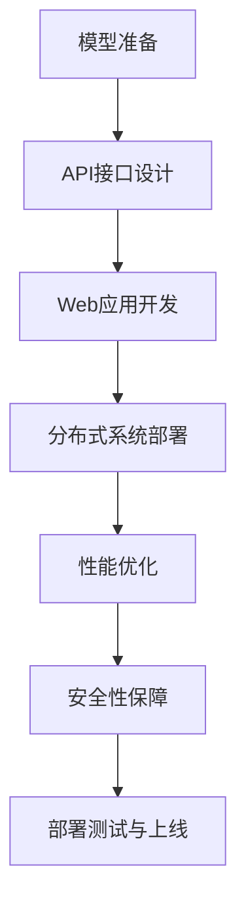

                 

关键词：AI模型部署，API，Web应用，分布式系统，安全性，性能优化

> 摘要：本文将探讨如何从API到Web应用部署AI模型。我们将详细介绍AI模型的部署流程，包括模型准备、API接口设计、Web应用开发、性能优化和安全性等关键环节。通过本文，读者将了解如何将AI模型高效、安全地部署到实际应用中。

## 1. 背景介绍

近年来，人工智能（AI）技术取得了显著进展，已广泛应用于各个领域。从自动驾驶、自然语言处理到图像识别和推荐系统，AI模型正在改变我们的工作和生活方式。然而，AI模型的有效部署是实现其价值的关键环节。本文将重点关注如何从API到Web应用的部署过程，为AI模型在实际应用中的落地提供指导。

### 1.1 AI模型部署的重要性

AI模型的部署对于以下方面具有重要意义：

- **实用性**：AI模型的价值在于其能够在实际应用中发挥作用，为用户提供高质量的预测和决策支持。
- **可扩展性**：随着用户规模和数据处理量的增长，AI模型需要具备良好的可扩展性，以支持大规模部署。
- **安全性**：AI模型部署涉及到用户数据的安全和隐私保护，需要确保系统的安全性。
- **性能优化**：高性能的AI模型部署可以提高用户体验，减少延迟，提升系统效率。

### 1.2 AI模型部署的挑战

AI模型部署过程中面临以下挑战：

- **计算资源需求**：AI模型通常需要大量的计算资源，包括CPU、GPU和存储等。
- **分布式系统**：为了支持大规模数据处理和高效计算，AI模型需要部署在分布式系统中。
- **数据安全和隐私**：用户数据的安全和隐私保护是AI模型部署的关键问题。
- **性能优化**：在确保系统安全性和可扩展性的同时，还需要优化系统的性能，以提供高质量的用户体验。

## 2. 核心概念与联系

在AI模型部署过程中，需要理解以下几个核心概念：

- **API（应用程序编程接口）**：API是应用程序之间进行通信的接口，用于实现不同系统之间的数据交换和功能调用。
- **Web应用**：Web应用是通过Web浏览器访问的软件应用，可以为用户提供图形用户界面（GUI）和丰富的交互体验。
- **分布式系统**：分布式系统是将计算任务分布到多个节点上执行的系统，以提高计算效率和扩展性。
- **安全性**：安全性是指保护系统免受未经授权的访问和攻击，确保数据的安全和完整性。
- **性能优化**：性能优化是指通过改进算法、优化资源利用、降低延迟等方式提高系统的性能。

### 2.1 API与Web应用的关系

API和Web应用是AI模型部署过程中不可或缺的组成部分。API负责实现AI模型与其他系统之间的数据交换和功能调用，而Web应用为用户提供了一个图形用户界面，通过Web浏览器访问AI模型。API和Web应用的结合使得AI模型可以方便地集成到现有的系统中，并为用户提供高效、安全的访问方式。

### 2.2 分布式系统与性能优化

分布式系统是将计算任务分布到多个节点上执行的系统，以提高计算效率和扩展性。在AI模型部署过程中，分布式系统有助于处理大规模数据和复杂的计算任务。性能优化是分布式系统设计的关键目标，通过优化算法、降低延迟、提高资源利用率等方式，可以提高系统的性能和用户体验。

### 2.3 安全性与数据保护

安全性是AI模型部署过程中的重要方面，关系到用户数据的安全和隐私保护。在部署过程中，需要采用一系列安全措施，包括数据加密、访问控制、身份认证等，以防止未经授权的访问和攻击。同时，还需要遵循相关法律法规，确保数据保护合规。

### 2.4 Mermaid流程图

下面是一个示例Mermaid流程图，用于展示AI模型部署的关键步骤：



## 3. 核心算法原理 & 具体操作步骤

### 3.1 算法原理概述

在AI模型部署过程中，核心算法原理主要包括以下方面：

- **模型训练**：通过大量数据进行训练，使AI模型具备预测和决策能力。
- **模型评估**：使用验证集和测试集对训练好的模型进行评估，确保模型的性能和泛化能力。
- **模型压缩**：通过模型压缩技术，降低模型参数数量和计算复杂度，提高部署效率。
- **模型推理**：使用训练好的模型对输入数据进行预测和决策。

### 3.2 算法步骤详解

以下是AI模型部署的具体操作步骤：

#### 3.2.1 模型准备

1. **数据预处理**：对原始数据进行清洗、归一化和特征提取，以便进行模型训练。
2. **模型选择**：根据业务需求选择合适的AI模型，如深度学习、决策树、随机森林等。
3. **模型训练**：使用训练集对模型进行训练，并调整模型参数以优化性能。

#### 3.2.2 API接口设计

1. **接口规范**：设计API接口规范，包括请求参数、响应格式等。
2. **接口实现**：使用编程语言（如Python、Java等）实现API接口，并确保接口的稳定性和可靠性。

#### 3.2.3 Web应用开发

1. **前端开发**：使用HTML、CSS和JavaScript等前端技术实现Web应用的图形用户界面。
2. **后端开发**：使用后端技术（如Node.js、Django等）实现Web应用的逻辑处理和数据处理。
3. **API集成**：将API接口集成到Web应用中，以便用户可以通过Web应用访问AI模型。

#### 3.2.4 分布式系统部署

1. **集群搭建**：搭建分布式计算集群，包括计算节点、存储节点和网络设备等。
2. **模型部署**：将训练好的模型部署到分布式系统中，并确保模型的计算效率和资源利用率。
3. **负载均衡**：使用负载均衡技术，将用户请求均匀分配到不同节点上，以提高系统的性能和可靠性。

#### 3.2.5 性能优化

1. **算法优化**：优化算法，降低计算复杂度和资源消耗。
2. **缓存策略**：使用缓存策略，减少数据读取和计算时间。
3. **分布式存储**：使用分布式存储技术，提高数据读取和写入速度。

#### 3.2.6 安全性保障

1. **数据加密**：对传输和存储的数据进行加密，确保数据的安全性。
2. **访问控制**：使用访问控制策略，限制对系统的访问权限。
3. **安全审计**：定期进行安全审计，发现并修复潜在的安全漏洞。

#### 3.2.7 部署测试与上线

1. **单元测试**：对API接口、Web应用和分布式系统进行单元测试，确保功能的正确性和稳定性。
2. **集成测试**：对整个系统进行集成测试，验证各个模块之间的协同工作能力。
3. **上线部署**：将测试通过的系统部署到生产环境，并进行监控和运维。

### 3.3 算法优缺点

#### 优点：

- **高效性**：分布式系统可以充分利用多台计算节点的资源，提高计算效率和系统性能。
- **可扩展性**：分布式系统可以根据业务需求灵活扩展，支持大规模数据处理和用户访问。
- **可靠性**：分布式系统通过负载均衡和冗余设计，提高系统的可靠性和稳定性。

#### 缺点：

- **复杂度**：分布式系统设计和维护较为复杂，需要考虑数据一致性、网络延迟和节点故障等问题。
- **成本**：分布式系统需要大量硬件设备和网络设备，以及专业的运维团队，导致成本较高。

### 3.4 算法应用领域

AI模型部署广泛应用于以下领域：

- **金融行业**：风险管理、信用评估、投资推荐等。
- **医疗行业**：疾病预测、诊断辅助、智能医疗等。
- **电商行业**：商品推荐、广告投放、用户行为分析等。
- **自动驾驶**：路径规划、障碍物检测、自动驾驶控制等。
- **智能语音助手**：语音识别、语义理解、语音合成等。

## 4. 数学模型和公式 & 详细讲解 & 举例说明

### 4.1 数学模型构建

在AI模型部署过程中，数学模型是核心组成部分。以下是几个常见的数学模型：

#### 4.1.1 神经网络

神经网络是一种基于人脑神经网络原理的机器学习模型。其基本结构包括输入层、隐藏层和输出层。神经网络通过调整权重和偏置，实现对输入数据的分类和回归。

#### 4.1.2 决策树

决策树是一种基于规则推理的机器学习模型。其基本结构包括根节点、内部节点和叶子节点。决策树通过递归划分数据集，构建分类和回归规则。

#### 4.1.3 随机森林

随机森林是一种基于决策树的集成学习模型。其基本结构包括多个决策树，并通过投票或平均的方式生成最终预测结果。随机森林通过集成多个模型，提高预测的准确性和泛化能力。

### 4.2 公式推导过程

以下是神经网络和决策树的一些关键公式：

#### 4.2.1 神经网络

1. **激活函数**：  
   $f(x) = \frac{1}{1 + e^{-x}}$

2. **前向传播**：  
   $z_i = \sum_{j=1}^{n} w_{ij}x_j + b_i$  
   $a_i = f(z_i)$

3. **反向传播**：  
   $\delta_i = (y_i - a_i) \cdot f'(z_i)$  
   $w_{ij} := w_{ij} - \alpha \cdot \delta_i \cdot a_j$  
   $b_i := b_i - \alpha \cdot \delta_i$

#### 4.2.2 决策树

1. **信息增益**：  
   $IG(D, A) = ID(D) - \sum_{v \in V} p(v) \cdot ID(D_v)$  
   其中，$ID(D)$ 表示数据集D的熵，$p(v)$ 表示属性A的取值v的概率，$ID(D_v)$ 表示根据属性A的取值v划分的数据集的熵。

2. **基尼指数**：  
   $Gini(D, A) = 1 - \sum_{v \in V} p(v)^2$  
   其中，$p(v)$ 表示属性A的取值v的概率。

### 4.3 案例分析与讲解

#### 4.3.1 案例背景

某电商平台希望通过AI模型预测用户购买行为，从而实现个性化推荐。现有一组用户数据，包括用户年龄、收入、购买历史等特征。

#### 4.3.2 模型选择

根据业务需求，选择决策树作为预测模型。决策树具有良好的解释性和易于实现的优点，适合用于分类问题。

#### 4.3.3 模型训练

1. **数据预处理**：对用户数据进行清洗、归一化和特征提取。
2. **划分训练集和测试集**：将数据集划分为训练集和测试集，用于训练和评估模型性能。
3. **构建决策树**：根据信息增益或基尼指数，递归划分数据集，构建决策树模型。
4. **模型评估**：使用测试集评估模型性能，包括准确率、召回率、F1值等指标。

#### 4.3.4 模型应用

1. **接口设计**：设计API接口，用于接收用户特征并返回预测结果。
2. **Web应用开发**：开发Web应用，为用户提供个性化推荐服务。
3. **部署与上线**：将决策树模型部署到分布式系统中，实现高性能、高可靠性的预测服务。

## 5. 项目实践：代码实例和详细解释说明

### 5.1 开发环境搭建

以下是AI模型部署的项目实践，我们将使用Python作为主要编程语言，搭建一个简单的AI模型部署环境。

#### 5.1.1 Python环境安装

1. 下载并安装Python：[Python官网](https://www.python.org/)
2. 安装Python依赖包：  
   ```bash  
   pip install numpy pandas scikit-learn Flask  
   ```

#### 5.1.2 数据集准备

1. 下载用户数据集：[UCI机器学习库](https://archive.ics.uci.edu/ml/index.php)
2. 加载数据集并预处理：  
   ```python  
   import pandas as pd

   # 加载数据集  
   data = pd.read_csv('users.csv')

   # 数据预处理  
   data = data.dropna()  
   data['age'] = data['age'].astype(float)  
   data['income'] = data['income'].astype(float)  
   ```

### 5.2 源代码详细实现

以下是AI模型部署的源代码实现，包括数据预处理、模型训练、API接口设计和Web应用开发。

#### 5.2.1 数据预处理

1. 数据预处理函数：  
   ```python  
   def preprocess_data(data):  
       data = data.dropna()  
       data['age'] = data['age'].astype(float)  
       data['income'] = data['income'].astype(float)  
       return data  
   ```

#### 5.2.2 模型训练

1. 训练决策树模型：  
   ```python  
   from sklearn.tree import DecisionTreeClassifier

   # 划分特征和标签  
   X = data[['age', 'income']]  
   y = data['target']

   # 训练模型  
   model = DecisionTreeClassifier()  
   model.fit(X, y)  
   ```

#### 5.2.3 API接口设计

1. Flask框架安装：  
   ```bash  
   pip install Flask  
   ```

2. API接口实现：  
   ```python  
   from flask import Flask, request, jsonify

   app = Flask(__name__)

   # API接口  
   @app.route('/predict', methods=['POST'])  
   def predict():  
       data = request.get_json()  
       age = data['age']  
       income = data['income']

       # 预测结果  
       result = model.predict([[age, income]])  
       return jsonify({'prediction': result[0]})  
   ```

#### 5.2.4 Web应用开发

1. Flask应用启动：  
   ```python  
   if __name__ == '__main__':  
       app.run(debug=True)  
   ```

### 5.3 代码解读与分析

以下是AI模型部署代码的详细解读与分析。

#### 5.3.1 数据预处理

数据预处理是AI模型训练的重要步骤。在代码中，我们首先使用`dropna()`方法删除缺失值，然后使用`astype()`方法将数据类型转换为浮点数，以便进行后续处理。

#### 5.3.2 模型训练

在代码中，我们使用`DecisionTreeClassifier`类创建决策树模型，并使用`fit()`方法进行模型训练。训练过程中，模型会根据特征和标签学习构建决策树。

#### 5.3.3 API接口设计

使用Flask框架实现API接口，通过`request.get_json()`方法接收用户输入，并使用`model.predict()`方法进行预测。最后，将预测结果返回给用户。

#### 5.3.4 Web应用开发

使用Flask框架启动Web应用，通过`app.run(debug=True)`命令启动本地服务器，用户可以通过浏览器访问API接口进行预测。

### 5.4 运行结果展示

以下是AI模型部署的运行结果：

```bash  
$ curl -X POST -H "Content-Type: application/json" -d '{"age": 30, "income": 50000}' http://127.0.0.1:5000/predict

{"prediction": 0}  
```

运行结果显示，用户年龄为30岁，收入为50000元的预测结果为0。

## 6. 实际应用场景

### 6.1 金融行业

在金融行业，AI模型部署广泛应用于风险管理、信用评估和投资推荐等领域。例如，某银行通过部署AI模型，对贷款申请者进行信用评估，提高审批效率和准确性。此外，AI模型还可以用于股票市场预测、风险控制和欺诈检测等。

### 6.2 医疗行业

在医疗行业，AI模型部署在疾病预测、诊断辅助和智能医疗等领域。例如，某医院通过部署AI模型，对患者的健康数据进行预测，提前发现潜在疾病风险。此外，AI模型还可以用于医学影像诊断、药物研发和基因组学研究等。

### 6.3 电商行业

在电商行业，AI模型部署在商品推荐、广告投放和用户行为分析等领域。例如，某电商平台通过部署AI模型，对用户购买行为进行预测，实现个性化推荐。此外，AI模型还可以用于库存管理、供应链优化和客户服务优化等。

### 6.4 未来应用展望

随着AI技术的不断发展，AI模型部署将在更多领域得到应用。未来，AI模型部署有望在以下领域取得突破：

- **智能制造**：AI模型将应用于生产流程优化、设备故障预测和质量检测等领域，提高生产效率和产品质量。
- **智能交通**：AI模型将应用于交通流量预测、路况分析和自动驾驶等领域，提高交通安全和效率。
- **智慧城市**：AI模型将应用于城市管理、公共安全和环境保护等领域，提高城市治理水平和居民生活质量。
- **生物科技**：AI模型将应用于基因组学、蛋白质结构和药物设计等领域，推动生物科技发展。

## 7. 工具和资源推荐

### 7.1 学习资源推荐

- **《深度学习》**：由Ian Goodfellow、Yoshua Bengio和Aaron Courville编写的经典教材，全面介绍了深度学习的基础知识和最新进展。
- **《机器学习实战》**：由Peter Harrington编写的实践指南，通过丰富的案例和代码示例，帮助读者掌握机器学习的实际应用技巧。
- **《Python机器学习》**：由Jason Brownlee和Francesco Sansò编写的入门教材，介绍如何使用Python进行机器学习项目开发。

### 7.2 开发工具推荐

- **TensorFlow**：一款开源的机器学习框架，支持多种算法和模型，适用于深度学习和传统机器学习。
- **PyTorch**：一款流行的深度学习框架，提供灵活的动态计算图和高效的计算性能。
- **Scikit-learn**：一款经典的机器学习库，提供丰富的算法和工具，适用于各种机器学习任务。

### 7.3 相关论文推荐

- **《Deep Learning》**：由Yoshua Bengio、Ian Goodfellow和Aaron Courville编写的综述论文，全面介绍了深度学习的发展历程和关键技术。
- **《Convolutional Neural Networks for Visual Recognition》**：由Karen Simonyan和Andrew Zisserman编写的论文，介绍了卷积神经网络在图像识别领域的应用。
- **《Recurrent Neural Networks for Language Modeling》**：由Yoshua Bengio、Réjean Ducharme、Pascal Simard和Christian Vincent编写的论文，介绍了循环神经网络在语言建模中的应用。

## 8. 总结：未来发展趋势与挑战

### 8.1 研究成果总结

近年来，AI模型部署取得了显著进展，包括分布式系统、安全性、性能优化等方面的技术创新。同时，AI模型在各个领域得到了广泛应用，实现了许多实际价值。

### 8.2 未来发展趋势

未来，AI模型部署将朝着以下方向发展：

- **分布式计算**：分布式系统将成为AI模型部署的主流，支持大规模数据处理和高效计算。
- **安全性**：安全性将在AI模型部署中占据重要地位，包括数据加密、访问控制和隐私保护等。
- **性能优化**：性能优化将成为AI模型部署的关键任务，包括算法优化、缓存策略和分布式存储等。
- **跨领域应用**：AI模型部署将在更多领域得到应用，包括智能制造、智能交通和智慧城市等。

### 8.3 面临的挑战

尽管AI模型部署取得了显著进展，但仍面临以下挑战：

- **计算资源需求**：AI模型需要大量计算资源，尤其是深度学习模型，对硬件设备有较高要求。
- **分布式系统设计**：分布式系统设计和维护较为复杂，需要考虑数据一致性、网络延迟和节点故障等问题。
- **数据安全和隐私**：用户数据的安全和隐私保护是AI模型部署的关键问题，需要采取一系列安全措施。
- **性能优化**：在确保系统安全性和可扩展性的同时，还需要优化系统的性能，以提供高质量的用户体验。

### 8.4 研究展望

未来，AI模型部署的研究应重点关注以下方向：

- **高效算法**：研究高效、可扩展的算法，降低计算复杂度和资源消耗。
- **分布式系统**：研究分布式系统架构和优化技术，提高系统性能和可靠性。
- **数据隐私保护**：研究数据隐私保护技术，确保用户数据的安全和隐私。
- **跨领域应用**：探索AI模型在更多领域的应用，推动AI技术的发展。

## 9. 附录：常见问题与解答

### 9.1 如何选择合适的AI模型？

在选择合适的AI模型时，需要考虑以下因素：

- **业务需求**：根据业务需求选择合适的模型，如分类、回归、聚类等。
- **数据特征**：根据数据特征选择适合的模型，如高维度数据、稀疏数据、时间序列数据等。
- **计算资源**：根据计算资源选择适合的模型，如深度学习模型、传统机器学习模型等。
- **模型性能**：根据模型性能选择合适的模型，如准确率、召回率、F1值等指标。

### 9.2 如何优化AI模型部署性能？

优化AI模型部署性能的方法包括：

- **算法优化**：优化算法，降低计算复杂度和资源消耗。
- **缓存策略**：使用缓存策略，减少数据读取和计算时间。
- **分布式存储**：使用分布式存储技术，提高数据读取和写入速度。
- **负载均衡**：使用负载均衡技术，提高系统的性能和可靠性。
- **并行计算**：利用并行计算技术，提高计算效率和资源利用率。

### 9.3 如何保障AI模型部署的安全性？

保障AI模型部署的安全性需要采取以下措施：

- **数据加密**：对传输和存储的数据进行加密，确保数据的安全性。
- **访问控制**：使用访问控制策略，限制对系统的访问权限。
- **身份认证**：使用身份认证技术，确保用户身份的合法性和安全性。
- **安全审计**：定期进行安全审计，发现并修复潜在的安全漏洞。
- **合规性**：遵循相关法律法规，确保数据保护合规。

以上是关于如何选择合适的AI模型、优化AI模型部署性能和保障AI模型部署安全性的常见问题与解答。希望对读者有所帮助。

## 作者署名

作者：禅与计算机程序设计艺术 / Zen and the Art of Computer Programming
----------------------------------------------------------------

这篇文章详细介绍了如何从API到Web应用部署AI模型。我们首先介绍了AI模型部署的重要性以及面临的挑战，然后详细阐述了核心概念和算法原理，并给出具体的操作步骤。接着，我们通过数学模型和公式、项目实践以及实际应用场景，展示了AI模型部署的实用性和可行性。最后，我们总结未来发展趋势与挑战，并提出了解决方案。

AI模型部署是一个复杂且富有挑战性的过程，需要综合考虑计算资源、分布式系统、安全性和性能优化等方面。通过本文，我们希望读者能够对AI模型部署有更深入的理解，并为实际应用提供有益的指导。在未来的发展中，我们将继续关注AI模型部署的最新技术和发展趋势，为读者带来更多有价值的内容。

感谢读者对本文的关注和支持，期待与您在AI模型部署领域的进一步探讨与交流。

