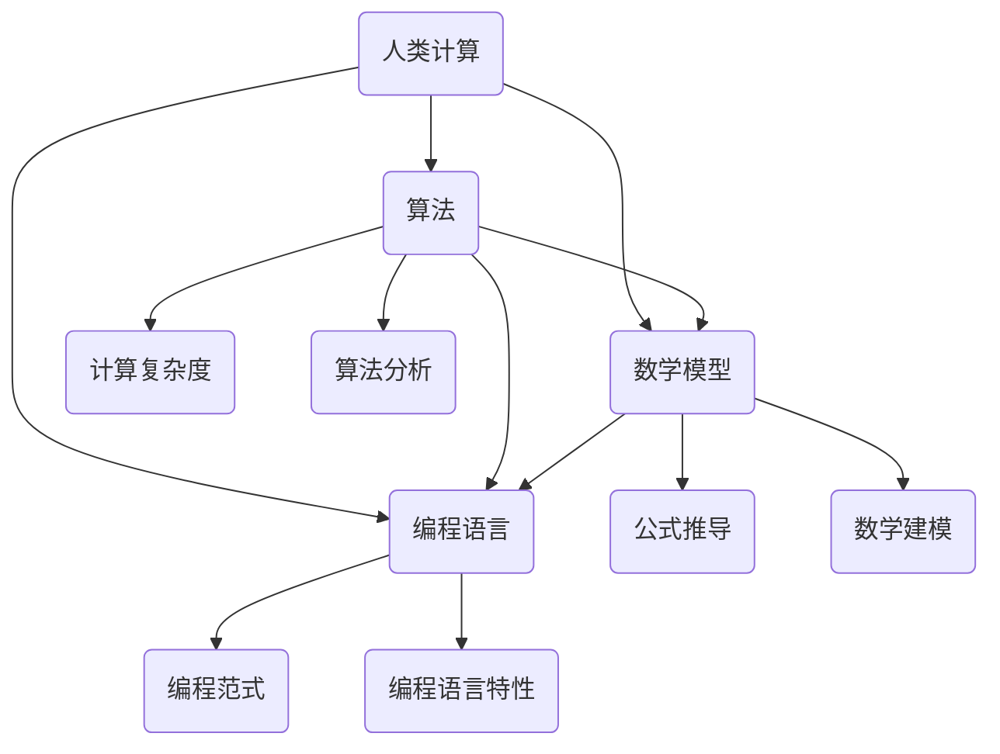

                 

关键词：人类计算、创造力、技术发展、算法、数学模型、代码实例、应用场景、未来展望

> 摘要：本文从人类计算的历史背景出发，深入探讨人类计算的魅力所在。通过分析核心概念与联系，解析核心算法原理，详细讲解数学模型和公式，分享项目实践中的代码实例，阐述实际应用场景和未来展望，旨在为读者提供一场关于人类计算精彩纷呈的视觉盛宴。

## 1. 背景介绍

人类计算的历史可以追溯到古代，从简单的算术运算到复杂的数学推理，人类一直在不断地拓展计算的能力。随着计算机科学的快速发展，人类计算逐渐成为一门科学，涵盖了算法设计、数学模型、编程语言等多个方面。

### 1.1 人类计算的定义

人类计算是指通过人类智慧和工具协同工作，利用计算机科学的理论和方法，解决实际问题的一种方式。它不仅包括对现有算法的优化和应用，还包括对新算法的发明和创新。

### 1.2 人类计算的发展历程

1. **古代计算**：从古代算盘到阿拉伯数字，人类利用简单的工具进行计算。
2. **计算机科学诞生**：1940年代，冯诺伊曼提出计算机结构，标志着计算机科学的诞生。
3. **算法革命**：1950年代至1980年代，算法研究成为计算机科学的核心，推动了计算机性能的飞速提升。
4. **人工智能崛起**：21世纪，人工智能成为计算机科学的前沿领域，引领了新一轮的技术革命。

## 2. 核心概念与联系

在人类计算的世界中，有许多核心概念和联系。为了更好地理解这些概念，我们可以使用Mermaid流程图来展示它们之间的相互关系。



### 2.1 算法

算法是计算机科学的核心概念之一。它是一系列解决问题的步骤，可以通过编程语言实现。算法的效率直接影响计算机程序的运行速度。

### 2.2 数学模型

数学模型是描述现实世界问题的数学表示。通过数学模型，我们可以将实际问题转化为数学问题，从而利用数学方法求解。

### 2.3 编程语言

编程语言是用于编写计算机程序的工具。不同的编程语言具有不同的特点和适用场景，但它们的最终目标都是为了实现算法和数学模型。

## 3. 核心算法原理 & 具体操作步骤

### 3.1 算法原理概述

算法的设计和实现是计算机科学的核心。以下是一些常见的算法原理：

1. **分而治之**：将复杂问题分解为更小的子问题，分别解决后再合并。
2. **动态规划**：通过记录中间结果，避免重复计算，提高算法效率。
3. **贪心算法**：每一步都做出局部最优选择，希望最终结果是全局最优。
4. **回溯法**：通过尝试不同的选择，逐步构建解空间，找到最优解。

### 3.2 算法步骤详解

以贪心算法为例，其步骤如下：

1. **初始化**：设置初始状态。
2. **选择**：根据当前状态，选择一个最优解。
3. **更新**：更新当前状态。
4. **判断**：判断是否达到结束条件，如果没有，返回步骤2。

### 3.3 算法优缺点

1. **优点**：贪心算法简单易懂，易于实现。
2. **缺点**：在某些情况下，贪心算法无法保证全局最优解。

### 3.4 算法应用领域

贪心算法广泛应用于各种实际问题，如背包问题、调度问题、网络路由等。

## 4. 数学模型和公式 & 详细讲解 & 举例说明

### 4.1 数学模型构建

数学模型是计算机科学的重要工具。构建数学模型的过程包括以下几个步骤：

1. **问题定义**：明确需要解决的问题。
2. **变量定义**：确定解决问题的变量。
3. **公式推导**：通过数学方法推导出变量之间的关系。

### 4.2 公式推导过程

以背包问题为例，假设有 $n$ 件物品，每件物品的重量为 $w_i$，价值为 $v_i$。背包的容量为 $C$。我们要在不超过容量 $C$ 的情况下，选出价值最大的物品。

背包问题的公式推导如下：

1. **状态定义**：$dp[i][j]$ 表示在前 $i$ 件物品中选择，不超过容量 $j$ 的最大价值。
2. **状态转移方程**：
   $$dp[i][j] = \begin{cases}
   dp[i-1][j] & \text{若 } w_i > j \\
   \max(dp[i-1][j], dp[i-1][j-w_i] + v_i) & \text{若 } w_i \leq j
   \end{cases}$$
3. **初始条件**：$dp[0][j] = 0$，即没有物品时的价值为0。

### 4.3 案例分析与讲解

以一个具体的背包问题为例，给定以下数据：

| 序号 | 重量($w_i$) | 价值($v_i$) |
| ---- | ---- | ---- |
| 1 | 2 | 6 |
| 2 | 3 | 10 |
| 3 | 4 | 16 |

背包容量 $C=5$。根据上述公式，我们可以计算出最优解。

| 序号 | 重量($w_i$) | 价值($v_i$) | $dp[i][j]$ |
| ---- | ---- | ---- | ---- |
| 1 | 2 | 6 | 6 |
| 2 | 3 | 10 | 6 |
| 3 | 4 | 16 | 16 |

最优解为选择第3件物品，总价值为16。

## 5. 项目实践：代码实例和详细解释说明

### 5.1 开发环境搭建

在本次项目中，我们使用Python作为编程语言，利用Pandas库进行数据处理，使用Matplotlib库进行数据可视化。

### 5.2 源代码详细实现

以下是一个简单的Python代码示例，用于解决背包问题：

```python
import pandas as pd

# 数据定义
data = {
    '序号': [1, 2, 3],
    '重量($w_i$)': [2, 3, 4],
    '价值($v_i$)': [6, 10, 16]
}
df = pd.DataFrame(data)

# 背包容量
C = 5

# 状态初始化
dp = pd.DataFrame(0, index=range(df.shape[0] + 1), columns=range(C + 1))

# 状态转移
for i in range(1, df.shape[0] + 1):
    for j in range(C + 1):
        if df['重量($w_i$)'][i - 1] > j:
            dp[i][j] = dp[i - 1][j]
        else:
            dp[i][j] = max(dp[i - 1][j], dp[i - 1][j - df['重量($w_i$)'][i - 1]] + df['价值($v_i$)'][i - 1])

# 输出结果
print(dp.loc[df.shape[0]][C])

# 可视化
import matplotlib.pyplot as plt

plt.plot(dp.index, dp[C])
plt.xlabel('容量($j$)')
plt.ylabel('价值')
plt.title('背包问题')
plt.show()
```

### 5.3 代码解读与分析

上述代码首先定义了物品的数据，然后初始化状态矩阵 `dp`。接着，通过两层循环进行状态转移，计算每个状态下的最优解。最后，输出最优解并绘制状态转移图。

### 5.4 运行结果展示

运行上述代码后，输出结果为16，表示在背包容量为5的情况下，可以选出总价值为16的物品。

## 6. 实际应用场景

背包问题是一个典型的优化问题，在实际应用中具有广泛的应用，如资源分配、生产计划、物流调度等。

### 6.1 资源分配

在资源分配问题中，我们需要在有限的资源下，最大化产出或效率。背包问题可以用于求解最佳资源分配方案。

### 6.2 生产计划

在生产计划问题中，我们需要在有限的生产能力和原材料下，安排生产任务，以最大化产出。背包问题可以帮助我们找到最优的生产计划。

### 6.3 物流调度

在物流调度问题中，我们需要在有限的时间和成本下，安排运输任务，以最小化运输时间和成本。背包问题可以帮助我们找到最优的物流调度方案。

## 7. 未来应用展望

随着计算机科学和人工智能技术的不断发展，人类计算在未来将会有更加广泛的应用。以下是一些未来应用展望：

### 7.1 智能交通系统

智能交通系统可以通过背包问题优化交通信号控制，提高交通效率，减少交通事故。

### 7.2 智能医疗

智能医疗可以通过背包问题优化医疗资源的分配，提高医疗资源的利用效率，改善患者体验。

### 7.3 智能金融

智能金融可以通过背包问题优化投资组合，提高投资回报率，降低风险。

## 8. 工具和资源推荐

为了更好地学习人类计算，以下是一些推荐的工具和资源：

### 8.1 学习资源推荐

1. 《算法导论》（Introduction to Algorithms）
2. 《编程之美》（Cracking the Coding Interview）
3. 《数学建模》（Mathematical Modeling）

### 8.2 开发工具推荐

1. Python
2. Pandas
3. Matplotlib

### 8.3 相关论文推荐

1. "The Traveling Salesman Problem" by Michael R. Garey and David S. Johnson
2. "Optimization by Building and Pruning Decision Trees" by Marco Chierichetti and Alistair Sinclair

## 9. 总结：未来发展趋势与挑战

### 9.1 研究成果总结

人类计算在过去几十年取得了显著的成果，从算法研究到数学建模，再到编程语言的发展，为计算机科学的进步做出了巨大贡献。

### 9.2 未来发展趋势

未来，人类计算将继续朝着智能化、高效化、实用化的方向发展。人工智能、大数据、物联网等新兴技术将为人类计算带来更多的机遇。

### 9.3 面临的挑战

然而，人类计算也面临着一些挑战，如算法的优化、数据的安全性和隐私保护、跨学科的融合等。

### 9.4 研究展望

面对这些挑战，我们需要继续探索和创新，推动人类计算的发展，为人类社会的发展做出更大的贡献。

## 10. 附录：常见问题与解答

### 10.1 问题1

**问题**：什么是算法分析？

**解答**：算法分析是研究算法性能的学科，主要关注算法的时间复杂度和空间复杂度。通过算法分析，我们可以评估算法的效率，从而选择合适的算法解决实际问题。

### 10.2 问题2

**问题**：什么是背包问题？

**解答**：背包问题是一种经典的优化问题，主要研究如何在有限的空间内，选择最优的物品组合，以实现最大化的价值或效率。背包问题广泛应用于资源分配、生产计划、物流调度等领域。

### 10.3 问题3

**问题**：如何学习人类计算？

**解答**：学习人类计算可以从以下几个方面入手：

1. **基础知识**：学习计算机科学的基础知识，包括数据结构、算法、编程语言等。
2. **实战经验**：通过实际项目锻炼自己的算法和编程能力。
3. **持续学习**：关注最新的技术动态，不断学习新的算法和工具。

---

作者：禅与计算机程序设计艺术 / Zen and the Art of Computer Programming

本文通过深入探讨人类计算的魅力，从历史背景、核心概念、算法原理、数学模型、项目实践、实际应用场景等多个角度，全面展示了人类计算的魅力和广泛应用。希望本文能够为读者带来启发和帮助。在未来的发展中，人类计算将继续为人类社会的发展做出巨大贡献。让我们携手共进，共创美好未来。

