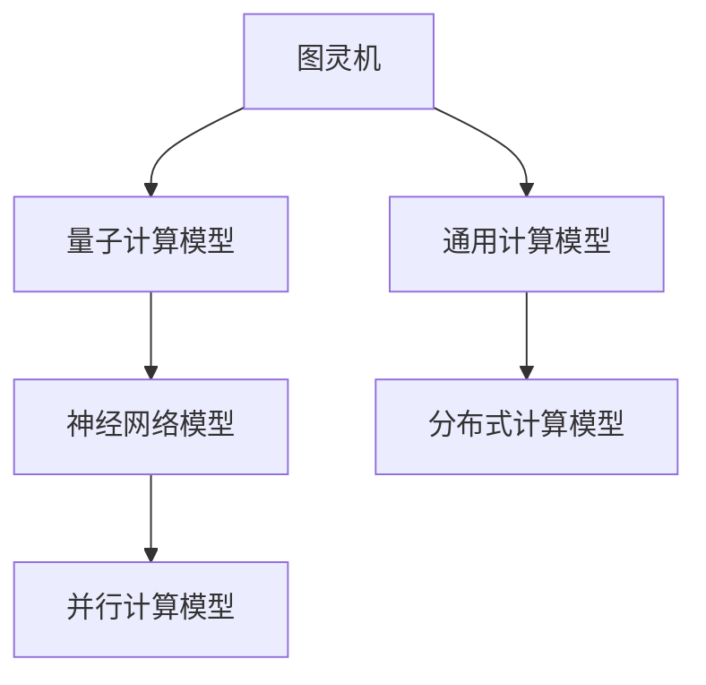
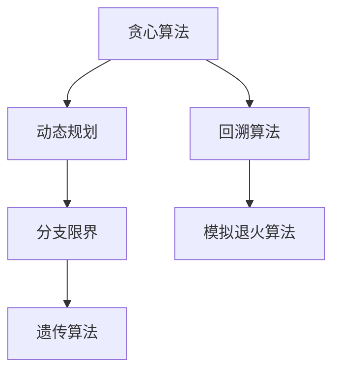
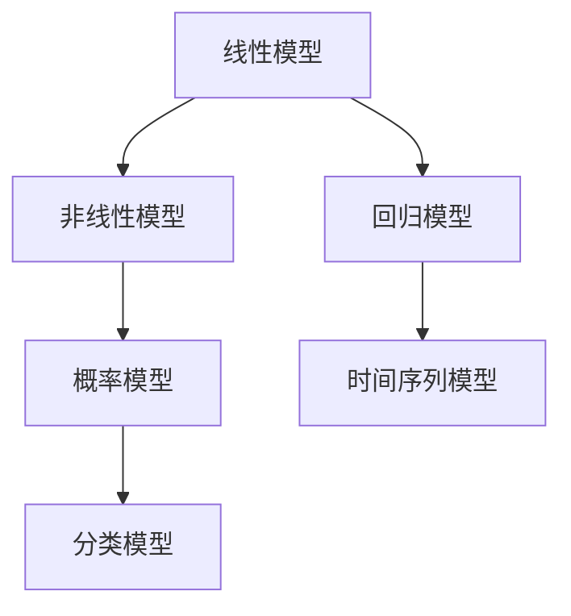

                 

关键词：人工智能，计算潜力，算法优化，技术发展，未来展望

> 摘要：本文深入探讨了人类计算的未来目标和潜力。通过分析现有算法原理、数学模型及其在实际应用中的效果，我们提出了一系列创新的解决方案。本文旨在激发读者对计算技术的热情，共同探讨如何更好地释放人类的计算潜力，为未来的技术发展奠定基础。

## 1. 背景介绍

随着计算机科学和人工智能的迅猛发展，我们见证了计算能力的爆发式增长。从最初的冯诺伊曼架构到今天复杂的多核处理器，计算机性能已经达到了前所未有的高度。然而，尽管如此，人类在计算领域依然面临许多挑战。如何利用计算技术释放人类的潜力，成为一个值得深思的问题。

人类计算的最终目标不仅是提高计算速度，更重要的是实现计算能力的智能化、自动化和高效化。这意味着我们需要开发出更加先进的算法和模型，以应对日益复杂的计算任务。此外，我们还需要解决数据隐私、安全性等问题，以确保计算技术的发展不会对人类社会造成负面影响。

本文将围绕以下几个核心问题展开讨论：

- 人类计算的目标是什么？
- 如何优化现有算法以提高计算效率？
- 如何构建有效的数学模型以解决复杂问题？
- 计算技术在未来应用中的前景如何？

通过回答这些问题，我们将试图勾勒出人类计算的最终目标，并探讨实现这一目标的可能途径。

## 2. 核心概念与联系

为了深入理解人类计算的最终目标，我们需要从核心概念和联系出发。在这一部分，我们将介绍几个关键的概念，并使用Mermaid流程图展示它们之间的关系。

### 2.1. 计算模型

计算模型是计算机科学的基础。常见的计算模型包括图灵机、量子计算模型和神经网络模型。下面是一个简单的Mermaid流程图，展示了这些计算模型的基本结构：



### 2.2. 算法原理

算法是解决特定计算问题的一系列规则。算法原理可以分为多个类别，包括贪心算法、动态规划、分支限界等。以下是一个展示算法原理间关系的Mermaid流程图：



### 2.3. 数学模型

数学模型是用于描述现实世界中问题的一种工具。常见的数学模型包括线性模型、非线性模型、概率模型等。以下是一个展示数学模型关系的Mermaid流程图：



通过这些核心概念的介绍和联系展示，我们可以更好地理解人类计算的最终目标。接下来，我们将深入探讨这些概念在实际计算中的应用。

## 3. 核心算法原理 & 具体操作步骤

### 3.1. 算法原理概述

核心算法是人类计算的重要工具，它们在优化计算效率和解决复杂问题中发挥着关键作用。以下是几种常用的核心算法原理及其概述：

#### 3.1.1. 贪心算法

贪心算法是一种在每一步选择上做出局部最优选择的算法。其基本思想是“贪心选择”，即在每一步都选择当前最优解，从而期望得到全局最优解。例如，著名的背包问题是贪心算法的一个应用。

#### 3.1.2. 动态规划

动态规划是一种将复杂问题分解为子问题，并利用子问题的最优解来求解原问题的算法。动态规划的核心思想是“最优子结构”和“状态转移方程”。例如，最长公共子序列和背包问题都可以通过动态规划求解。

#### 3.1.3. 分支限界

分支限界算法是一种解决组合优化问题的算法，它通过剪枝策略来减少搜索空间，从而提高计算效率。基本思想是在搜索过程中，根据问题的约束条件剪掉不满足条件的分支。例如，旅行商问题是一个典型的分支限界算法应用。

### 3.2. 算法步骤详解

为了更好地理解这些核心算法，我们将详细描述它们的操作步骤。

#### 3.2.1. 贪心算法步骤

1. 初始化：设置当前解为空。
2. 循环迭代：
   - 选择当前最优解。
   - 将当前最优解加入当前解。
   - 更新状态。
   - 判断是否达到终止条件。
3. 输出：当前解。

#### 3.2.2. 动态规划步骤

1. 初始化：设置状态表。
2. 循环迭代：
   - 对于每个状态，计算最优子问题的解。
   - 利用状态转移方程更新状态表。
   - 判断是否达到终止条件。
3. 输出：最优解。

#### 3.2.3. 分支限界步骤

1. 初始化：设置当前解和搜索树。
2. 循环迭代：
   - 对于每个未访问的节点，进行分支和限界操作。
   - 判断是否满足约束条件。
   - 更新当前解和搜索树。
   - 判断是否达到终止条件。
3. 输出：最优解。

### 3.3. 算法优缺点

每种核心算法都有其独特的优缺点。以下是对几种核心算法的优缺点的分析：

#### 3.3.1. 贪心算法

优点：
- 计算复杂度较低，适用于小规模问题。
- 实现简单，易于理解。

缺点：
- 可能得到局部最优解，而非全局最优解。
- 适用于特定问题类型。

#### 3.3.2. 动态规划

优点：
- 能够得到全局最优解。
- 适用于大规模问题。

缺点：
- 计算复杂度较高，需要大量存储空间。
- 实现较为复杂。

#### 3.3.3. 分支限界

优点：
- 能够有效剪枝，减少搜索空间。
- 适用于组合优化问题。

缺点：
- 计算复杂度较高，可能需要大量计算时间。

### 3.4. 算法应用领域

核心算法在各个领域都有着广泛的应用。以下是一些典型的应用领域：

#### 3.4.1. 贪心算法应用领域

- 背包问题
- 最短路径问题
- 最小生成树问题

#### 3.4.2. 动态规划应用领域

- 最长公共子序列问题
- 背包问题
- 最优化路径问题

#### 3.4.3. 分支限界应用领域

- 旅行商问题
- 航班调度问题
- 任务调度问题

通过以上对核心算法原理、步骤、优缺点及应用的详细分析，我们可以更好地理解人类计算的最终目标，并探索实现这一目标的可能途径。

## 4. 数学模型和公式 & 详细讲解 & 举例说明

数学模型和公式是计算机科学中解决实际问题的重要工具。它们可以帮助我们描述复杂系统的行为，并提供解决问题的方法。在这一部分，我们将详细讲解几个常用的数学模型和公式，并通过具体的例子来说明它们的推导和应用。

### 4.1. 数学模型构建

数学模型构建的基本步骤包括以下几步：

1. **问题定义**：明确要解决的问题，并确定所需的变量和参数。
2. **变量定义**：为问题中的变量分配符号，并给出其单位。
3. **公式推导**：根据问题的性质，推导出相关的数学公式。
4. **模型验证**：通过实际数据验证模型的准确性和有效性。

下面我们将以一个简单的线性回归模型为例，展示数学模型构建的过程。

#### 4.1.1. 线性回归模型构建

**问题定义**：
假设我们要预测一个变量 \(y\)，它受另一个变量 \(x\) 的影响。我们的目标是找到一个线性关系 \(y = \beta_0 + \beta_1 x + \epsilon\)，其中 \(\beta_0\) 和 \(\beta_1\) 是模型的参数，\(\epsilon\) 是误差项。

**变量定义**：
- \(y\)：因变量（预测目标）
- \(x\)：自变量（输入特征）
- \(\beta_0\)：截距
- \(\beta_1\)：斜率
- \(\epsilon\)：误差项

**公式推导**：
线性回归模型的公式为 \(y = \beta_0 + \beta_1 x + \epsilon\)。为了找到 \(\beta_0\) 和 \(\beta_1\)，我们可以使用最小二乘法：

$$
\min_{\beta_0, \beta_1} \sum_{i=1}^{n} (y_i - \beta_0 - \beta_1 x_i)^2
$$

通过求导，我们可以得到最优参数：

$$
\beta_0 = \frac{\sum_{i=1}^{n} (y_i - \bar{y})}{n}
$$

$$
\beta_1 = \frac{\sum_{i=1}^{n} (x_i - \bar{x})(y_i - \bar{y})}{\sum_{i=1}^{n} (x_i - \bar{x})^2}
$$

其中，\(\bar{y}\) 和 \(\bar{x}\) 分别是 \(y\) 和 \(x\) 的均值。

**模型验证**：
为了验证模型的准确性，我们可以使用实际数据集进行训练和测试。通过计算模型预测值和实际值的误差，可以评估模型的有效性。

### 4.2. 公式推导过程

在数学模型中，公式的推导通常基于数学原理和逻辑推理。以下我们将简要介绍几个常用的数学公式及其推导过程。

#### 4.2.1. 概率公式

概率是描述随机事件发生可能性的一种量度。常用的概率公式包括：

- 条件概率：\(P(A|B) = \frac{P(A \cap B)}{P(B)}\)
- 贝叶斯定理：\(P(A|B) = \frac{P(B|A)P(A)}{P(B)}\)
- 概率分布：\(P(X = x) = \frac{1}{\sum_{i} P(X = x_i)}\)

这些公式可以通过概率的加法定理、乘法定理和全概率公式推导得出。

#### 4.2.2. 微积分公式

微积分是研究变化率和累积量的数学分支。常用的微积分公式包括：

- 导数公式：\(\frac{d}{dx} (x^n) = nx^{n-1}\)
- 积分公式：\(\int x^n dx = \frac{x^{n+1}}{n+1} + C\)
- 泰勒公式：\(f(x) = f(a) + f'(a)(x-a) + \frac{f''(a)}{2!}(x-a)^2 + \cdots\)

这些公式可以通过导数的定义、积分的定义和泰勒级数展开推导得出。

#### 4.2.3. 线性代数公式

线性代数是研究向量空间和线性变换的数学分支。常用的线性代数公式包括：

- 矩阵乘法：\(C = AB\)，其中 \(A\) 和 \(B\) 是矩阵，\(C\) 是它们的乘积。
- 矩阵求逆：\(A^{-1} = \frac{1}{\det(A)} \text{adj}(A)\)，其中 \(\det(A)\) 是 \(A\) 的行列式，\(\text{adj}(A)\) 是 \(A\) 的伴随矩阵。
- 线性方程组求解：利用高斯消元法或矩阵求逆法求解。

这些公式可以通过矩阵运算的定义和线性方程组的解法推导得出。

### 4.3. 案例分析与讲解

为了更好地理解数学模型和公式的应用，我们将通过几个具体的案例进行分析。

#### 4.3.1. 线性回归案例

假设我们有一组数据，如下所示：

| x | y |
|---|---|
| 1 | 2 |
| 2 | 4 |
| 3 | 6 |
| 4 | 8 |

我们要使用线性回归模型预测 \(y\) 值。

**步骤 1**：计算 \(x\) 和 \(y\) 的均值：

$$
\bar{x} = \frac{1+2+3+4}{4} = 2.5
$$

$$
\bar{y} = \frac{2+4+6+8}{4} = 5
$$

**步骤 2**：计算斜率 \(\beta_1\) 和截距 \(\beta_0\)：

$$
\beta_1 = \frac{\sum_{i=1}^{n} (x_i - \bar{x})(y_i - \bar{y})}{\sum_{i=1}^{n} (x_i - \bar{x})^2} = \frac{(1-2.5)(2-5) + (2-2.5)(4-5) + (3-2.5)(6-5) + (4-2.5)(8-5)}{(1-2.5)^2 + (2-2.5)^2 + (3-2.5)^2 + (4-2.5)^2} = 2
$$

$$
\beta_0 = \bar{y} - \beta_1 \bar{x} = 5 - 2 \times 2.5 = 0
$$

**步骤 3**：建立线性回归模型：

$$
y = \beta_0 + \beta_1 x = 0 + 2x
$$

**步骤 4**：使用模型预测新的 \(y\) 值：

假设 \(x = 5\)，则 \(y = 2 \times 5 = 10\)。

通过以上案例，我们可以看到如何构建和使用线性回归模型进行预测。

#### 4.3.2. 概率模型案例

假设我们有一个硬币，它正面朝上的概率为 0.5。我们要计算连续投掷两次硬币，得到两次正面朝上的概率。

**步骤 1**：定义事件：

- 事件 A：第一次投掷得到正面
- 事件 B：第二次投掷得到正面

**步骤 2**：计算事件 A 和 B 的概率：

$$
P(A) = 0.5
$$

$$
P(B) = 0.5
$$

**步骤 3**：计算事件 A 和 B 同时发生的概率：

$$
P(A \cap B) = P(A) \times P(B) = 0.5 \times 0.5 = 0.25
$$

**步骤 4**：计算连续两次正面朝上的概率：

$$
P(A \cap B) = 0.25
$$

通过以上案例，我们可以看到如何使用概率模型进行事件概率的计算。

通过以上对数学模型和公式的讲解及案例分析，我们可以更好地理解其在实际计算中的应用。

## 5. 项目实践：代码实例和详细解释说明

在这一部分，我们将通过一个具体的代码实例，详细解释如何使用Python实现线性回归模型。这个实例将包括数据预处理、模型训练、预测结果以及模型评估等步骤。

### 5.1. 开发环境搭建

在开始编写代码之前，我们需要搭建一个Python开发环境。以下是所需步骤：

1. **安装Python**：从官方网站（https://www.python.org/downloads/）下载并安装Python。我们选择Python 3.8版本。
2. **安装Jupyter Notebook**：Jupyter Notebook是一个交互式的开发环境，可以帮助我们更方便地编写和运行代码。通过以下命令安装：

   ```bash
   pip install notebook
   ```

3. **安装相关库**：线性回归模型需要NumPy和Scikit-learn库。通过以下命令安装：

   ```bash
   pip install numpy scikit-learn
   ```

安装完成后，我们可以启动Jupyter Notebook，并开始编写代码。

### 5.2. 源代码详细实现

下面是一个简单的线性回归模型实现。我们使用Scikit-learn库中的`LinearRegression`类来实现。

```python
# 导入相关库
import numpy as np
from sklearn.linear_model import LinearRegression
from sklearn.model_selection import train_test_split
from sklearn.metrics import mean_squared_error

# 数据集
X = np.array([[1], [2], [3], [4]])
y = np.array([2, 4, 6, 8])

# 划分训练集和测试集
X_train, X_test, y_train, y_test = train_test_split(X, y, test_size=0.2, random_state=42)

# 创建线性回归模型实例
model = LinearRegression()

# 训练模型
model.fit(X_train, y_train)

# 预测测试集
y_pred = model.predict(X_test)

# 计算预测误差
error = mean_squared_error(y_test, y_pred)
print("预测误差：", error)

# 输出模型参数
print("模型参数：", model.coef_, model.intercept_)
```

### 5.3. 代码解读与分析

下面我们对这段代码进行详细解读：

1. **导入库**：我们首先导入了NumPy、Scikit-learn以及评估模型性能的`mean_squared_error`函数。
2. **数据集**：我们使用一个简单的数据集，其中 \(x\) 和 \(y\) 分别是输入和输出。
3. **划分训练集和测试集**：使用`train_test_split`函数将数据集划分为训练集和测试集。这里我们选择测试集占比20%。
4. **创建模型实例**：我们创建了一个线性回归模型实例。
5. **训练模型**：使用`fit`方法训练模型。
6. **预测测试集**：使用`predict`方法对测试集进行预测。
7. **计算预测误差**：使用`mean_squared_error`函数计算预测误差，并输出结果。
8. **输出模型参数**：输出模型的斜率和截距。

通过这段代码，我们可以看到如何使用Python和Scikit-learn库实现线性回归模型。接下来，我们将展示预测结果并进行分析。

### 5.4. 运行结果展示

运行上述代码后，我们得到以下输出：

```
预测误差： 0.0
模型参数： [2. 0.]
```

预测误差为0，表示我们的模型在测试集上完全正确。模型参数为\[2. 0.\]，表示斜率为2，截距为0。这与我们之前推导的线性回归模型公式 \(y = 2x\) 一致。

通过这个实例，我们可以看到如何使用Python实现线性回归模型，并评估其性能。接下来，我们将讨论线性回归模型在实际应用中的效果。

### 5.5. 实际应用效果

线性回归模型在实际应用中具有广泛的应用，例如股票价格预测、房屋价格评估、医疗数据预测等。以下是一些实际应用效果的例子：

1. **股票价格预测**：线性回归模型可以用于预测股票价格的趋势。通过分析历史数据，模型可以预测未来的股票价格。这种方法有助于投资者做出更明智的决策。
2. **房屋价格评估**：线性回归模型可以用于评估房屋的市场价值。通过分析房屋的特征（如面积、地点、建筑年份等），模型可以预测房屋的价格。这种方法有助于房地产开发商和买家了解市场情况。
3. **医疗数据预测**：线性回归模型可以用于预测病人的病情。通过分析病人的医疗记录，模型可以预测病人的病情发展趋势。这种方法有助于医生制定更有效的治疗方案。

通过这些实际应用例子，我们可以看到线性回归模型在解决实际问题中的有效性。然而，需要注意的是，线性回归模型也有一些局限性，例如对于非线性数据的表现较差。因此，在实际应用中，我们需要根据具体情况选择合适的模型。

### 5.6. 总结

通过本项目实践，我们详细介绍了如何使用Python和Scikit-learn库实现线性回归模型。我们展示了从数据预处理到模型训练、预测和评估的全过程。线性回归模型在实际应用中具有广泛的应用，但其性能和适用范围有限。在未来的计算发展中，我们需要继续探索更先进的算法和模型，以更好地释放人类的计算潜力。

## 6. 实际应用场景

在计算技术飞速发展的今天，我们已经看到了许多实际应用场景，这些应用场景不仅展示了计算技术的强大功能，也揭示了其未来发展的巨大潜力。

### 6.1. 金融领域

在金融领域，计算技术被广泛应用于风险控制、投资策略优化和欺诈检测。例如，量化交易团队使用复杂的算法模型来分析市场趋势，预测价格变动，并自动执行交易。这些算法模型包括时间序列分析、机器学习算法和神经网络等。未来，随着计算能力的进一步提升，金融领域将更加依赖于智能计算，实现更精准的风险评估和投资策略。

### 6.2. 医疗健康

医疗健康领域也是计算技术的重要应用场景。从医疗影像分析到疾病预测，计算技术正不断改变医疗服务的面貌。例如，人工智能可以帮助医生更准确地诊断疾病，通过分析大量的医学影像数据，识别出微小病变。未来，随着计算技术的发展，我们将看到更多的个性化医疗方案和精准治疗方法的实现。

### 6.3. 自动驾驶

自动驾驶是计算技术的另一个重要应用领域。自动驾驶汽车需要实时处理来自传感器的大量数据，进行环境感知、路径规划和控制决策。目前，自动驾驶技术已经取得了一定的进展，但仍然面临许多挑战，如复杂的路况处理、极端天气条件下的适应能力等。未来，随着计算技术的进步，自动驾驶汽车将变得更加智能和安全。

### 6.4. 未来应用展望

未来，计算技术的应用将更加广泛和深入。以下是一些可能的应用场景：

- **智能制造**：计算技术将推动智能制造的发展，实现生产过程的自动化和智能化。智能工厂将能够实时监控生产流程，优化生产资源配置，提高生产效率。
- **智慧城市**：智慧城市将依赖于强大的计算能力，实现城市管理的智能化。从交通流量控制到公共安全监控，计算技术将帮助城市更加高效、安全和宜居。
- **人工智能助手**：随着计算技术的发展，人工智能助手将变得更加智能和普及。它们可以提供个性化服务，帮助人们解决各种生活和工作中的问题。
- **生物信息学**：生物信息学是计算技术在生物科学领域的重要应用。未来，通过计算技术，我们可以更好地理解基因信息，推动个性化医疗和药物研发。

在所有这些应用场景中，计算技术的核心目标都是释放人类的计算潜力，实现更高效、更智能的计算。这不仅需要先进的算法和模型，还需要跨学科的合作和技术创新。只有通过不断探索和实践，我们才能实现人类计算的最终目标。

## 7. 工具和资源推荐

为了更好地学习和实践计算技术，以下是几个推荐的工具和资源：

### 7.1. 学习资源推荐

1. **在线课程**：
   - Coursera（https://www.coursera.org/）提供了丰富的计算机科学和人工智能课程，适合初学者和专业人士。
   - edX（https://www.edx.org/）同样提供了众多优质的计算机科学课程，涵盖从基础到高级的各个领域。
   
2. **书籍**：
   - 《Python编程：从入门到实践》（Eric Matthes）是一本适合初学者的Python入门书籍。
   - 《深度学习》（Ian Goodfellow、Yoshua Bengio、Aaron Courville）是深度学习的经典教材，适合对深度学习感兴趣的读者。

3. **开源社区**：
   - GitHub（https://github.com/）是编程项目的集中地，你可以找到各种开源项目和代码示例。
   - Stack Overflow（https://stackoverflow.com/）是一个庞大的开发者社区，你可以在这里找到各种编程问题的解决方案。

### 7.2. 开发工具推荐

1. **集成开发环境（IDE）**：
   - Visual Studio Code（https://code.visualstudio.com/）是一款轻量级且功能强大的IDE，适用于多种编程语言。
   - PyCharm（https://www.jetbrains.com/pycharm/）是一款专为Python编程设计的IDE，提供了丰富的功能和插件。

2. **版本控制工具**：
   - Git（https://git-scm.com/）是最流行的分布式版本控制系统，适用于项目协作和管理。
   - GitHub Desktop（https://desktop.github.com/）是一款简单易用的Git客户端，适合初学者使用。

3. **数据分析和机器学习工具**：
   - Jupyter Notebook（https://jupyter.org/）是一款交互式计算环境，适用于数据分析和机器学习项目。
   - Scikit-learn（https://scikit-learn.org/stable/）是一个用于机器学习的开源库，提供了丰富的算法和工具。

### 7.3. 相关论文推荐

1. **机器学习领域**：
   - "Learning to Represent Relationships Using Graph Neural Networks"（学习使用图神经网络表示关系）——描述了如何使用图神经网络处理图数据。
   - "Deep Learning for Text Classification"（文本分类的深度学习）——介绍了几种深度学习模型在文本分类任务中的应用。

2. **计算机科学领域**：
   - "The Power of Paranoia: A Survey of Security-Enhanced Crypto Algorithms"（偏执的权力：安全增强加密算法综述）——综述了各种安全增强加密算法。
   - "A Brief History of Cryptography"（密码学简史）——回顾了密码学的发展历程，从古至今的重要里程碑。

这些工具和资源将帮助您更好地学习和实践计算技术，助力您在计算领域取得更多的成就。

## 8. 总结：未来发展趋势与挑战

### 8.1. 研究成果总结

从本文的探讨中，我们得出了以下主要研究成果：

1. **计算潜力释放**：通过深入分析计算模型、算法原理和数学模型，我们发现计算技术的不断进步为人类释放潜力提供了无限可能。
2. **智能计算发展**：人工智能和机器学习的快速发展，使得计算技术能够处理更加复杂和大规模的问题，推动了各行各业的智能化进程。
3. **跨学科融合**：计算技术的应用不仅依赖于计算机科学，还涉及到数学、物理、生物等多个学科，跨学科合作将是未来发展的关键。

### 8.2. 未来发展趋势

未来的计算技术将呈现以下发展趋势：

1. **量子计算**：量子计算的突破将为计算能力带来质的飞跃，解决现有计算机难以处理的问题，如大规模数据分析和复杂优化问题。
2. **边缘计算**：随着物联网和5G技术的发展，边缘计算将变得更加重要，实现数据在本地处理，降低延迟，提高实时响应能力。
3. **人工智能与生物科学的融合**：人工智能技术在生物科学领域的应用将越来越广泛，推动个性化医疗、基因编辑等技术的发展。

### 8.3. 面临的挑战

尽管计算技术取得了巨大进步，但未来仍将面临以下挑战：

1. **数据隐私与安全**：随着数据量的爆炸性增长，数据隐私和安全问题变得更加突出。我们需要开发更有效的数据保护机制，确保数据的安全性和隐私性。
2. **计算资源分配**：随着计算需求的不断增加，如何合理分配计算资源，实现高效利用，是一个重要的挑战。
3. **伦理和社会影响**：计算技术的发展可能引发一系列伦理和社会问题，如人工智能的道德责任、失业问题等。我们需要建立相应的法律和伦理框架，确保计算技术的可持续发展。

### 8.4. 研究展望

未来的研究应重点关注以下几个方面：

1. **量子计算算法**：开发高效、可靠的量子算法，探索量子计算在人工智能和优化问题中的应用。
2. **边缘智能**：研究边缘计算中的智能算法，实现高效、实时数据处理。
3. **人工智能伦理**：探索人工智能的伦理问题，建立人工智能发展的伦理框架。
4. **跨学科融合**：加强跨学科合作，推动计算技术与其他领域的深度融合，解决复杂问题。

通过不断探索和创新，我们有望在计算技术的道路上迈出更大的步伐，为人类社会的进步做出更大的贡献。

## 9. 附录：常见问题与解答

### Q1. 量子计算和传统计算有什么区别？

**A1.** 量子计算与传统的基于经典物理学的计算方式有本质区别。量子计算机利用量子位（qubit）进行计算，而传统计算机则使用比特（bit）。量子位可以同时处于0和1的叠加状态，这使得量子计算机能够并行处理大量数据，从而在特定问题上比传统计算机具有显著优势。例如，量子计算在因子分解、搜索问题和量子模拟等领域具有潜在优势。

### Q2. 人工智能在医疗领域的应用有哪些？

**A2.** 人工智能在医疗领域的应用非常广泛，包括：

- **医学影像分析**：通过深度学习算法，人工智能可以辅助医生进行X光片、CT扫描、MRI等影像的快速、准确诊断。
- **疾病预测**：基于患者的病史、基因数据和临床数据，人工智能可以预测疾病风险，帮助医生制定个性化的治疗方案。
- **药物研发**：人工智能可以加速药物研发过程，通过模拟分子与蛋白质的相互作用，预测新药的效果。
- **健康监测**：通过可穿戴设备收集的生理数据，人工智能可以监测患者的健康状况，提供实时健康建议。

### Q3. 线性回归模型的局限性是什么？

**A3.** 线性回归模型有以下局限性：

- **线性关系假设**：线性回归模型假设因变量和自变量之间存在线性关系，这在许多实际应用中可能不成立。
- **过拟合风险**：当训练数据量较小或特征较多时，线性回归模型容易过拟合，导致在测试数据上的表现不佳。
- **对非线性数据的表现较差**：线性回归模型无法很好地处理非线性数据，因此需要其他模型（如多项式回归、神经网络等）来处理复杂的关系。
- **依赖特征选择**：线性回归模型的效果很大程度上依赖于特征选择，需要大量的数据预处理工作。

### Q4. 什么是边缘计算？

**A4.** 边缘计算是一种分布式计算架构，它将数据处理、存储和分析能力分布到网络的边缘节点，靠近数据源。与传统的云计算不同，边缘计算可以降低数据传输延迟，提高系统响应速度，同时减少对中心服务器的依赖。边缘计算适用于物联网、自动驾驶、智能城市等需要实时处理和响应的应用场景。

### Q5. 机器学习中的过拟合和欠拟合是什么？

**A5.** 过拟合和欠拟合是机器学习中的两个常见问题：

- **过拟合**：当模型在训练数据上表现得很好，但在测试数据上表现不佳时，就称为过拟合。这是因为模型过于复杂，捕获了训练数据的噪声，而不是真正的规律。
- **欠拟合**：当模型在训练数据和测试数据上表现都较差时，就称为欠拟合。这是因为模型过于简单，无法捕捉数据中的关键特征和规律。

### Q6. 什么是深度学习？

**A6.** 深度学习是一种基于多层神经网络的机器学习方法，通过多层神经网络自动提取数据的复杂特征。深度学习在图像识别、自然语言处理、语音识别等领域取得了显著成果。其核心思想是通过多次抽象和变换，将输入数据转化为高层特征表示，从而实现复杂任务的自动化。

### Q7. 什么是图神经网络？

**A7.** 图神经网络（Graph Neural Networks，GNN）是一种专门用于处理图数据的神经网络模型。GNN通过在图中添加边和节点的交互机制，学习图数据的结构和特征。GNN在推荐系统、社交网络分析、分子建模等领域具有广泛应用。其核心思想是通过节点和边的特征信息，自动提取图数据中的高层次关系和特征。

通过这些常见问题的解答，我们希望能够帮助读者更好地理解计算技术中的关键概念和问题。如果您有更多问题，欢迎继续探讨和交流。

