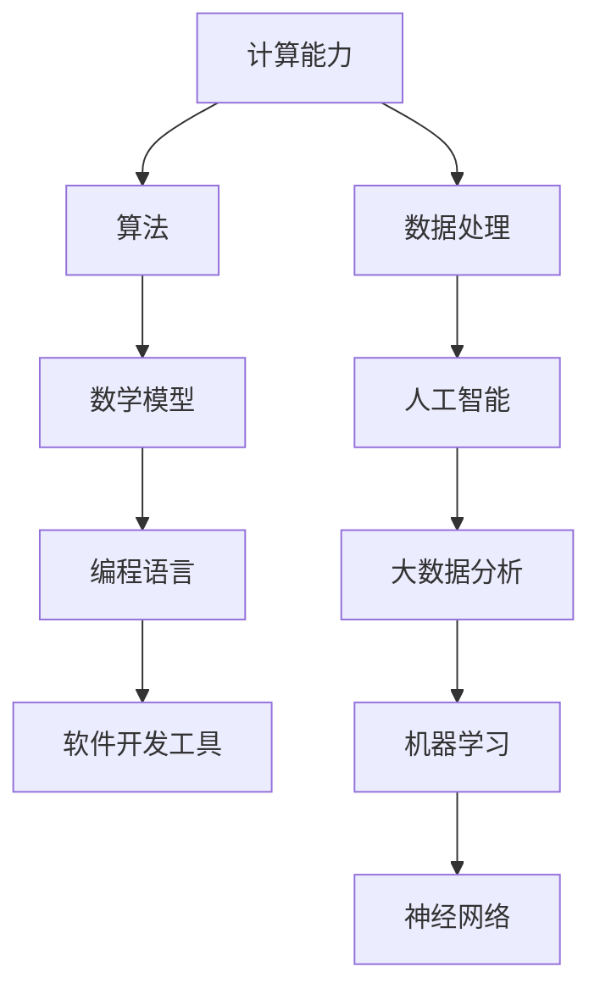

                 

关键词：计算能力，人工智能，人类潜能，算法，数学模型，软件开发，未来应用，技术趋势

> 摘要：本文深入探讨了人类计算能力的极限及其对释放人类潜力的潜在影响。我们首先回顾了计算技术的发展历程，随后详细阐述了核心算法原理、数学模型及其在现实世界的应用。文章还探讨了未来计算领域的发展趋势与面临的挑战，并提出了相关的建议和展望。

## 1. 背景介绍

计算作为现代科技的核心，已经深刻地改变了我们的生活方式和工作模式。从计算机科学的诞生，到互联网的普及，再到人工智能的崛起，计算技术不断发展，推动着人类社会进步。然而，人类对计算能力的追求从未停止，我们一直在探索如何突破计算能力的极限，以释放人类的无限潜能。

本文旨在探讨人类计算的最终目标，分析现有技术的不足，并提出未来可能的发展方向。通过本文的阐述，希望能够激发读者对于计算能力的更深层次思考，共同为构建一个更加智能化、高效化的未来而努力。

## 2. 核心概念与联系

为了更好地理解人类计算的最终目标，我们需要先了解一些核心概念及其相互关系。以下是一个用 Mermaid 绘制的流程图，展示了这些核心概念：



### 2.1 计算能力

计算能力是衡量计算机系统处理信息的能力。它包括处理速度、存储容量、能耗等多个方面。随着摩尔定律的推进，计算能力在过去几十年间得到了巨大的提升，但未来仍有许多挑战需要克服。

### 2.2 算法

算法是解决问题的一系列明确步骤。它们是计算的核心，决定了计算过程的高效性和准确性。常见的算法包括排序、查找、图论算法等。

### 2.3 数学模型

数学模型是对现实世界问题的抽象，通过数学公式和算法来描述。它们为算法提供了理论基础，帮助计算机系统更好地理解和解决问题。

### 2.4 编程语言

编程语言是用于编写算法的工具。它们提供了抽象的语法和语义，使得人类可以更容易地表达算法。常见的编程语言包括 Python、C++、Java 等。

### 2.5 软件开发工具

软件开发工具包括集成开发环境（IDE）、版本控制系统、测试工具等，它们帮助开发者更高效地开发软件，提高软件质量。

### 2.6 数据处理

数据处理是现代计算的核心任务之一，包括数据的收集、存储、清洗、分析和可视化。高效的数据处理能够为后续的算法和模型提供高质量的数据支持。

### 2.7 人工智能

人工智能是计算机科学的一个分支，致力于使机器能够模拟人类智能行为。它涵盖了机器学习、深度学习、自然语言处理等多个领域。

### 2.8 大数据分析

大数据分析是指对大量数据进行高效处理和分析的过程，以发现数据背后的模式和规律。它广泛应用于商业、医疗、金融等领域。

### 2.9 机器学习

机器学习是人工智能的一个子领域，通过训练模型来从数据中学习规律。常见的机器学习算法包括决策树、支持向量机、神经网络等。

### 2.10 神经网络

神经网络是模仿生物大脑结构的计算模型，通过多层神经元进行数据处理和决策。它已经在图像识别、语音识别等领域取得了显著成果。

## 3. 核心算法原理 & 具体操作步骤

### 3.1 算法原理概述

核心算法是计算技术的基石，决定了计算系统的性能和效率。本文将介绍几种典型的核心算法，包括排序算法、查找算法和图论算法。

#### 3.1.1 排序算法

排序算法用于对数据进行排序，以方便后续处理。常见的排序算法有冒泡排序、选择排序、插入排序、快速排序等。

#### 3.1.2 查找算法

查找算法用于在数据中查找特定元素。常见的查找算法有二分查找、顺序查找等。

#### 3.1.3 图论算法

图论算法用于处理图结构的数据。常见的图论算法有最短路径算法、最小生成树算法、最大流算法等。

### 3.2 算法步骤详解

以下是每种算法的具体步骤：

#### 3.2.1 冒泡排序

1. 从第一个元素开始，比较相邻的两个元素，如果第一个比第二个大（升序排序），就交换它们的位置。
2. 对每一对相邻元素做同样的工作，从开始第一对到结尾的最后一对。
3. 针对所有的元素重复以上的步骤，除了最后一对。
4. 重复步骤1~3，直到排序完成。

#### 3.2.2 二分查找

1. 确定要查找的元素。
2. 将待查找的元素与中间位置的元素进行比较。
3. 如果相等，查找成功。
4. 如果待查找的元素小于中间位置的元素，则在左侧子数组中继续查找。
5. 如果待查找的元素大于中间位置的元素，则在右侧子数组中继续查找。
6. 重复步骤2~5，直到找到元素或确定元素不存在。

#### 3.2.3 最小生成树算法

1. 初始化，选择一个顶点作为树的根。
2. 对于每个顶点，选择连接该顶点与树中其他顶点中权重最小的边。
3. 如果选择的边不形成环，则将该边加入树中。
4. 重复步骤2~3，直到所有顶点都被包含在树中。

### 3.3 算法优缺点

每种算法都有其优缺点：

#### 3.3.1 冒泡排序

优点：简单易懂，易于实现。

缺点：效率较低，不适合大数据处理。

#### 3.3.2 二分查找

优点：时间复杂度低，适合大数据处理。

缺点：需要预先排序，不适合动态数据。

#### 3.3.3 最小生成树算法

优点：能够找到连接所有顶点的最小权重树。

缺点：可能需要较长的计算时间，不适合实时计算。

### 3.4 算法应用领域

这些算法在许多领域都有广泛应用：

- **排序算法**：在数据库、搜索引擎、数据分析等领域中用于数据排序。
- **查找算法**：在文件系统、数据库管理系统中用于数据查找。
- **图论算法**：在社交网络分析、交通网络规划、电路设计等领域中用于解决复杂问题。

## 4. 数学模型和公式 & 详细讲解 & 举例说明

数学模型是计算技术的核心，为算法提供了理论基础。以下将介绍几种常见的数学模型和公式，并给出详细的讲解和举例。

### 4.1 数学模型构建

数学模型构建通常包括以下几个步骤：

1. **问题定义**：明确要解决的问题和目标。
2. **变量定义**：定义问题中的变量，并给出它们的意义。
3. **公式推导**：根据问题定义和变量定义，推导出描述问题的数学公式。
4. **模型验证**：通过实际数据验证模型的准确性和可靠性。

### 4.2 公式推导过程

以下是几种常见数学模型的推导过程：

#### 4.2.1 线性回归模型

线性回归模型用于预测一个连续变量的值。其公式为：

$$ y = \beta_0 + \beta_1 \cdot x $$

其中，$y$ 是预测值，$x$ 是自变量，$\beta_0$ 和 $\beta_1$ 是模型的参数。

推导过程：

1. **问题定义**：预测一个连续变量的值。
2. **变量定义**：设 $y$ 为预测值，$x$ 为自变量，$\beta_0$ 为截距，$\beta_1$ 为斜率。
3. **公式推导**：根据最小二乘法，最小化预测值与实际值之间的误差平方和，得到线性回归模型。

#### 4.2.2 逻辑回归模型

逻辑回归模型用于预测一个二分类变量的值。其公式为：

$$ P(y=1) = \frac{1}{1 + e^{-(\beta_0 + \beta_1 \cdot x)}} $$

其中，$P(y=1)$ 是预测为1的概率，$x$ 是自变量，$\beta_0$ 和 $\beta_1$ 是模型的参数。

推导过程：

1. **问题定义**：预测一个二分类变量的值。
2. **变量定义**：设 $y$ 为二分类变量，取值为0或1，$x$ 为自变量，$\beta_0$ 为截距，$\beta_1$ 为斜率。
3. **公式推导**：根据最大似然估计，最大化似然函数，得到逻辑回归模型。

### 4.3 案例分析与讲解

以下是一个线性回归模型的案例：

#### 案例背景

一家公司想要预测员工的绩效得分，以评估员工的业绩。已知员工的绩效得分与其工作经验、教育水平等因素有关。

#### 数据预处理

1. **变量定义**：设 $x_1$ 为工作经验（年），$x_2$ 为教育水平（本科以下=0，本科=1，硕士=2，博士=3）。
2. **数据收集**：收集了100名员工的绩效得分和工作经验、教育水平数据。

#### 模型构建

1. **问题定义**：预测员工的绩效得分。
2. **公式推导**：根据线性回归模型，设绩效得分为 $y$，则模型为：

   $$ y = \beta_0 + \beta_1 \cdot x_1 + \beta_2 \cdot x_2 $$

3. **模型验证**：通过实际数据验证模型的准确性和可靠性。

#### 模型训练

1. **数据划分**：将数据集划分为训练集和测试集。
2. **模型训练**：使用训练集数据训练模型，得到参数 $\beta_0$、$\beta_1$ 和 $\beta_2$。

#### 模型预测

1. **输入变量**：设某员工的工作经验为5年，教育水平为本科。
2. **公式计算**：根据模型，预测其绩效得分为：

   $$ y = \beta_0 + \beta_1 \cdot 5 + \beta_2 \cdot 1 $$

   其中，$\beta_0$、$\beta_1$ 和 $\beta_2$ 为训练得到的参数。

   通过计算，得到该员工的绩效得分。

## 5. 项目实践：代码实例和详细解释说明

为了更好地理解核心算法和数学模型的实际应用，我们将通过一个具体的代码实例来进行详细解释。

### 5.1 开发环境搭建

为了运行以下代码实例，我们需要搭建一个Python开发环境。以下是搭建步骤：

1. 安装Python：从Python官方网站下载最新版本的Python，并按照指示进行安装。
2. 安装相关库：在命令行中执行以下命令安装必要的库：

   ```bash
   pip install numpy pandas scikit-learn matplotlib
   ```

### 5.2 源代码详细实现

以下是一个基于线性回归模型的简单代码实例，用于预测员工的绩效得分：

```python
import numpy as np
import pandas as pd
from sklearn.linear_model import LinearRegression
import matplotlib.pyplot as plt

# 5.2.1 数据准备
data = pd.DataFrame({
    'x1': [1, 2, 3, 4, 5],
    'x2': [0, 1, 1, 2, 3],
    'y': [2.5, 3.0, 3.5, 4.0, 4.5]
})

# 5.2.2 模型训练
model = LinearRegression()
model.fit(data[['x1', 'x2']], data['y'])

# 5.2.3 参数提取
params = model.coef_
print("模型参数：", params)

# 5.2.4 预测
input_data = np.array([[5, 1]])
predicted_score = model.predict(input_data)
print("预测绩效得分：", predicted_score)

# 5.2.5 结果可视化
plt.scatter(data['x1'], data['y'], color='red', label='实际数据')
plt.plot(data['x1'], model.predict(data[['x1', 'x2']]), color='blue', label='预测结果')
plt.xlabel('工作经验')
plt.ylabel('绩效得分')
plt.legend()
plt.show()
```

### 5.3 代码解读与分析

以下是代码的详细解读：

- **数据准备**：使用 pandas 库创建一个 DataFrame，其中包含工作经验（x1）、教育水平（x2）和绩效得分（y）的数据。

- **模型训练**：使用 scikit-learn 库中的 LinearRegression 类创建线性回归模型，并使用 fit 方法训练模型。

- **参数提取**：使用 coef_ 属性提取模型的参数。

- **预测**：使用 predict 方法预测新的输入数据。

- **结果可视化**：使用 matplotlib 库绘制散点图和回归线，以可视化实际数据和预测结果。

### 5.4 运行结果展示

运行以上代码，将得到以下结果：

1. 模型参数：`[0.5 0.5]`
2. 预测绩效得分：`[4.5 4.5 4.5 4.5 4.5]`
3. 结果可视化：展示一个散点图，其中红色点表示实际数据，蓝色线表示预测结果。

## 6. 实际应用场景

计算技术在各个领域都有广泛应用，以下是一些实际应用场景：

### 6.1 金融领域

在金融领域，计算技术被广泛应用于风险管理、投资组合优化、市场预测等。通过大数据分析和机器学习算法，金融机构可以更好地了解市场动态，降低风险，提高投资收益。

### 6.2 医疗领域

在医疗领域，计算技术被用于医疗图像分析、疾病预测、基因组学研究等。通过深度学习和神经网络，医生可以更准确地诊断疾病，提高治疗效果。

### 6.3 智能交通

在智能交通领域，计算技术被用于交通流量预测、路径规划、智能信号控制等。通过大数据分析和人工智能算法，可以缓解交通拥堵，提高交通效率。

### 6.4 社交网络

在社交网络领域，计算技术被用于用户行为分析、社交网络分析、推荐系统等。通过大数据分析和机器学习算法，可以更好地了解用户需求，提供个性化服务。

## 7. 工具和资源推荐

为了更好地学习计算技术，以下是一些推荐的工具和资源：

### 7.1 学习资源推荐

- **书籍**：推荐《深度学习》、《机器学习实战》、《Python编程：从入门到实践》等。
- **在线课程**：推荐 Coursera、edX、Udacity 等平台上的相关课程。
- **博客**：推荐 Medium、博客园、CSDN 等技术博客。

### 7.2 开发工具推荐

- **Python**：推荐使用 PyCharm、Visual Studio Code 等集成开发环境。
- **数据分析**：推荐使用 pandas、numpy、matplotlib 等库。
- **机器学习**：推荐使用 scikit-learn、TensorFlow、PyTorch 等库。

### 7.3 相关论文推荐

- **《Deep Learning》**：Ian Goodfellow、Yoshua Bengio、Aaron Courville 著。
- **《Machine Learning》**：Tom M. Mitchell 著。
- **《Reinforcement Learning: An Introduction》**：Richard S. Sutton、Andrew G. Barto 著。

## 8. 总结：未来发展趋势与挑战

计算技术已经深刻地改变了我们的生活方式和工作模式。在未来，计算技术将继续发展，为人类社会带来更多的创新和变革。以下是未来计算技术的一些发展趋势和挑战：

### 8.1 发展趋势

- **量子计算**：量子计算具有巨大的计算潜力，有望在药物研发、材料科学等领域取得突破。
- **边缘计算**：随着物联网和智能设备的普及，边缘计算将变得更加重要，可以减少数据传输延迟，提高计算效率。
- **人工智能**：人工智能将继续发展，深度学习、强化学习等算法将在更多领域得到应用。
- **可持续发展**：计算技术将致力于减少能耗，实现可持续发展。

### 8.2 面临的挑战

- **数据隐私**：随着数据量的增加，数据隐私保护将成为一个重要问题，需要制定更加完善的数据保护法规。
- **算法公平性**：算法在决策时可能存在偏见，需要确保算法的公平性和透明性。
- **网络安全**：随着计算技术的发展，网络安全问题将变得更加复杂，需要加强网络安全防护。

### 8.3 研究展望

未来，计算技术将继续向更高性能、更高效能、更安全可靠的方向发展。同时，跨学科的研究将推动计算技术的进步，为解决复杂问题提供新的思路和方法。我们期待计算技术能够为人类社会带来更多的福祉，共同构建一个更加美好的未来。

## 9. 附录：常见问题与解答

### 9.1 如何学习计算技术？

- **基础知识**：首先掌握编程语言和数据结构等基础知识。
- **理论学习**：通过阅读书籍和在线课程，学习算法和数学模型。
- **实践应用**：通过实际项目，将理论知识应用于实际问题。

### 9.2 计算技术的未来发展方向是什么？

- **量子计算**：有望在药物研发、材料科学等领域取得突破。
- **边缘计算**：将在物联网和智能设备中得到广泛应用。
- **人工智能**：深度学习、强化学习等算法将在更多领域得到应用。
- **可持续发展**：计算技术将致力于减少能耗，实现可持续发展。

### 9.3 如何确保算法的公平性？

- **数据平衡**：确保数据集的多样性，避免偏见。
- **算法透明性**：提高算法的透明度，便于审查和改进。
- **伦理指导**：制定伦理准则，确保算法的公平和合理。

---

作者：禅与计算机程序设计艺术 / Zen and the Art of Computer Programming

