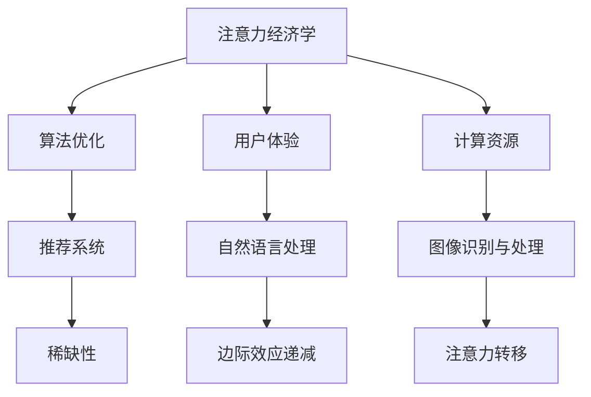
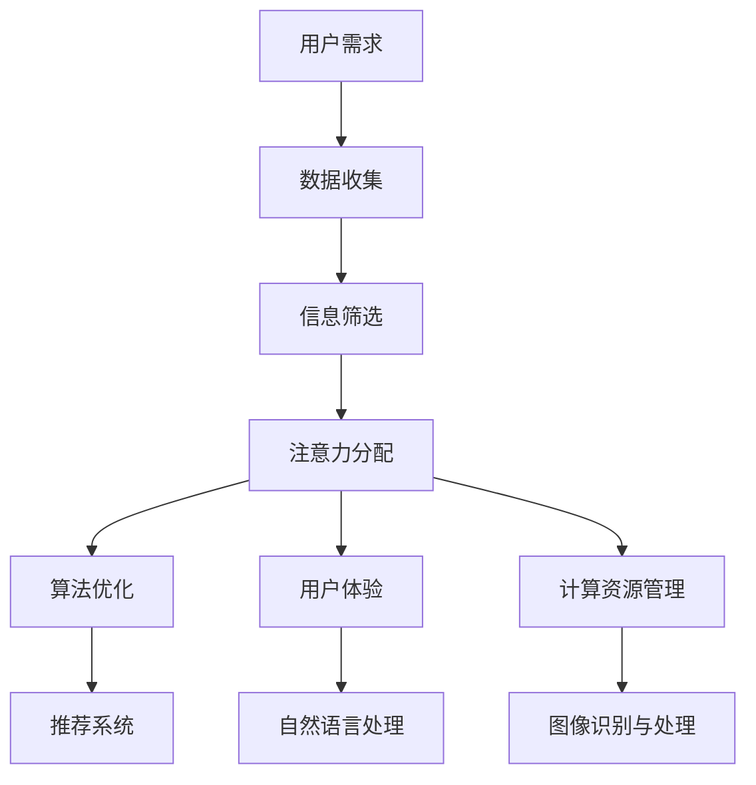

                 

随着人工智能技术的飞速发展，我们生活在一个被算法和模型主导的时代。从推荐系统到自动驾驶，从自然语言处理到图像识别，AI 已经深入到我们日常生活的方方面面。然而，在这个看似无限美好的 AI 时代，一个重要但常被忽视的问题是：注意力资源有限。本文旨在重新思考 AI 时代的注意力经济学，探讨注意力在 AI 技术中的应用及其对人类生活的深远影响。

## 文章关键词

- 人工智能
- 注意力经济学
- 算法优化
- 计算资源
- 用户体验
- 现实影响

## 文章摘要

本文首先介绍了 AI 时代注意力资源的重要性，分析了注意力资源在算法设计、用户体验和计算资源分配中的关键作用。接着，通过 Mermaid 流程图展示了注意力经济学的核心概念及其在 AI 技术中的实际应用。随后，文章深入探讨了核心算法原理、数学模型和项目实践，并结合具体实例进行了详细讲解。最后，文章展望了 AI 时代的未来应用场景、发展趋势与挑战，并推荐了相关工具和资源。

## 1. 背景介绍

### 注意力资源的重要性

在 AI 时代，注意力资源如同经济学的货币，是驱动算法和用户体验的核心要素。注意力资源的有限性决定了我们无法同时关注所有的信息，因此，如何在海量数据中筛选出最有价值的信息，成为了一个亟待解决的问题。注意力资源的重要性体现在以下几个方面：

1. **算法优化**：优秀的算法需要高效的注意力分配策略，以最大化利用有限的计算资源，提高算法的准确性和效率。
2. **用户体验**：良好的用户体验依赖于对用户注意力的合理引导和利用，使信息呈现更加直观、易用，提高用户满意度。
3. **计算资源**：注意力资源的有效管理能够降低计算资源的消耗，减少能源消耗，实现绿色计算。

### 注意力经济学的基本原理

注意力经济学是指研究在信息过载环境中，如何有效地分配和利用注意力资源的一门学科。其核心原理包括：

1. **稀缺性**：注意力资源的稀缺性决定了其价值，如何在有限的注意力资源中实现最大化收益，是注意力经济学的核心问题。
2. **边际效应递减**：随着注意力投入的增加，每单位注意力带来的收益逐渐减少，因此需要优化注意力分配策略。
3. **注意力转移**：通过引入外部激励和奖励机制，可以引导用户的注意力从非重要信息转移到重要信息。

### 注意力经济学在 AI 技术中的应用

注意力经济学在 AI 技术中有着广泛的应用，包括：

1. **推荐系统**：利用注意力经济学原理，推荐系统可以通过优化推荐内容，提高用户的点击率和满意度。
2. **自然语言处理**：在文本生成和语义理解中，注意力机制能够提高模型对关键信息的捕捉能力。
3. **图像识别与处理**：通过注意力机制，图像识别算法可以更准确地识别出图像中的关键特征。

### 注意力经济学的挑战与机遇

随着 AI 技术的发展，注意力经济学面临诸多挑战，如信息过载、隐私保护和计算资源限制等。然而，这也为注意力经济学带来了新的机遇，例如：

1. **个性化推荐**：通过分析用户行为，实现高度个性化的推荐，提高用户满意度和粘性。
2. **隐私保护**：利用注意力经济学原理，可以实现更加隐私友好的数据处理方式。
3. **智能助手**：通过智能助手，用户可以将注意力集中在更为重要的任务上，提高工作效率。

## 2. 核心概念与联系

### 核心概念原理和架构的 Mermaid 流程图



### 注意力经济学在 AI 技术中的应用流程图



## 3. 核心算法原理 & 具体操作步骤

### 3.1 算法原理概述

注意力算法是一种基于权重分配的算法，其核心思想是通过学习输入数据的特征，为每个数据点分配一个权重，从而实现特征选择和优化。在 AI 技术中，注意力机制广泛应用于图像识别、自然语言处理和推荐系统等领域。

### 3.2 算法步骤详解

#### 步骤 1：数据预处理

1. **数据收集**：收集用户行为数据、文本数据或图像数据。
2. **数据清洗**：去除噪声数据和缺失数据。

#### 步骤 2：特征提取

1. **文本数据**：使用词嵌入技术（如 Word2Vec、BERT）将文本转换为向量。
2. **图像数据**：使用卷积神经网络（如 VGG、ResNet）提取图像特征。

#### 步骤 3：注意力机制

1. **计算权重**：通过学习算法计算每个数据点的权重，常用的注意力机制包括 scaled dot-product、多头注意力、自注意力等。
2. **权重分配**：根据计算得到的权重，对数据进行加权处理。

#### 步骤 4：模型训练

1. **损失函数**：选择合适的损失函数（如交叉熵、均方误差）。
2. **优化算法**：使用梯度下降、Adam 等优化算法更新模型参数。

#### 步骤 5：模型评估

1. **交叉验证**：使用交叉验证方法评估模型性能。
2. **评价指标**：根据任务类型选择评价指标（如准确率、召回率、F1 分数）。

### 3.3 算法优缺点

#### 优点

1. **高效性**：注意力算法能够有效筛选出关键信息，提高模型性能。
2. **灵活性**：注意力机制可以应用于不同类型的任务和数据。

#### 缺点

1. **计算成本**：注意力机制通常需要大量的计算资源，可能导致计算成本增加。
2. **过拟合**：在训练过程中，注意力机制可能过度拟合训练数据，导致泛化能力下降。

### 3.4 算法应用领域

1. **推荐系统**：通过注意力机制，推荐系统可以更加准确地捕捉用户兴趣，提高推荐质量。
2. **自然语言处理**：在文本生成、语义理解和机器翻译等领域，注意力机制能够提高模型的准确性和生成质量。
3. **图像识别与处理**：注意力机制可以用于图像分类、目标检测和图像增强等任务，提高模型的识别精度。

## 4. 数学模型和公式 & 详细讲解 & 举例说明

### 4.1 数学模型构建

在注意力机制中，常用的数学模型包括注意力权重计算和损失函数。

#### 注意力权重计算

假设输入数据为 \(X \in \mathbb{R}^{n \times d}\)，其中 \(n\) 表示数据点的数量，\(d\) 表示特征维度。注意力权重可以通过以下公式计算：

\[ 
\alpha_i = \frac{e^{z_i}}{\sum_{j=1}^{n} e^{z_j}} 
\]

其中，\(z_i\) 表示第 \(i\) 个数据点的注意力得分，可以通过以下公式计算：

\[ 
z_i = \mathbf{W}^T \mathbf{h}_i 
\]

其中，\(\mathbf{W} \in \mathbb{R}^{d \times h}\) 是权重矩阵，\(\mathbf{h}_i \in \mathbb{R}^{h}\) 是第 \(i\) 个数据点的特征向量。

#### 损失函数

常见的损失函数包括交叉熵和均方误差。假设模型预测的概率分布为 \(\hat{y}\)，真实分布为 \(y\)，则交叉熵损失函数可以表示为：

\[ 
L = -\sum_{i=1}^{n} y_i \log(\hat{y}_i) 
\]

其中，\(y_i\) 和 \(\hat{y}_i\) 分别表示第 \(i\) 个数据点的真实标签和预测概率。

### 4.2 公式推导过程

#### 注意力权重计算推导

考虑一个简单的注意力模型，其中输入数据 \(X\) 和隐藏状态 \(h_i\) 如下：

\[ 
X = \begin{bmatrix}
x_1 \\
x_2 \\
\vdots \\
x_n
\end{bmatrix}, \quad
h_i = \begin{bmatrix}
h_{i1} \\
h_{i2} \\
\vdots \\
h_{id}
\end{bmatrix} 
\]

注意力权重可以通过计算输入特征和隐藏状态的点积得到：

\[ 
z_i = h_i^T X = \sum_{j=1}^{d} h_{ij} x_j 
\]

为了实现归一化，引入权重矩阵 \(W\)，则有：

\[ 
\alpha_i = \frac{e^{z_i}}{\sum_{j=1}^{n} e^{z_j}} = \frac{e^{h_i^T X}}{\sum_{j=1}^{n} e^{h_j^T X}} 
\]

通过将 \(X\) 表示为 \(X = \mathbf{W} \mathbf{h}\)，则有：

\[ 
z_i = \mathbf{W}^T \mathbf{h}_i 
\]

最终得到注意力权重计算公式：

\[ 
\alpha_i = \frac{e^{\mathbf{W}^T \mathbf{h}_i}}{\sum_{j=1}^{n} e^{\mathbf{W}^T \mathbf{h}_j}} 
\]

#### 损失函数推导

考虑一个二分类问题，其中输入数据为 \(X \in \mathbb{R}^{n \times d}\)，预测概率为 \(\hat{y} \in \mathbb{R}^{n}\)，真实标签为 \(y \in \{0, 1\}^n\)。交叉熵损失函数可以表示为：

\[ 
L = -\sum_{i=1}^{n} y_i \log(\hat{y}_i) 
\]

当 \(y_i = 0\) 时，\(\log(\hat{y}_i) = -\infty\)，为了避免损失函数发散，可以采用 Softmax 函数将预测概率转换为概率分布：

\[ 
\hat{y} = \frac{e^{\mathbf{W}^T \mathbf{h}}}{\sum_{j=1}^{n} e^{\mathbf{W}^T \mathbf{h}_j}} 
\]

则交叉熵损失函数可以表示为：

\[ 
L = -\sum_{i=1}^{n} y_i \log\left(\frac{e^{\mathbf{W}^T \mathbf{h}_i}}{\sum_{j=1}^{n} e^{\mathbf{W}^T \mathbf{h}_j}}\right) 
\]

通过化简，可以得到：

\[ 
L = \sum_{i=1}^{n} y_i \log\left(\sum_{j=1}^{n} e^{\mathbf{W}^T \mathbf{h}_j}\right) - \sum_{i=1}^{n} y_i \mathbf{W}^T \mathbf{h}_i 
\]

### 4.3 案例分析与讲解

#### 案例背景

假设我们有一个文本分类任务，输入文本为 \(X \in \mathbb{R}^{n \times d}\)，其中 \(n\) 表示文本数量，\(d\) 表示词汇维度。我们需要训练一个模型，将文本分类为正类或负类。

#### 案例步骤

1. **数据预处理**：将文本转换为词嵌入向量，例如使用 Word2Vec 将每个词转换为向量。

2. **模型构建**：使用一个多层感知机（MLP）作为基础模型，并添加一个注意力层。注意力层通过计算输入文本的注意力权重，为每个词分配权重。

3. **训练模型**：使用交叉熵损失函数训练模型，通过反向传播更新模型参数。

4. **评估模型**：使用测试集评估模型性能，计算准确率、召回率和 F1 分数。

#### 案例代码

```python
import numpy as np
import tensorflow as tf

# 数据预处理
# ...

# 模型构建
model = tf.keras.Sequential([
    tf.keras.layers.Dense(128, activation='relu', input_shape=(d,)),
    tf.keras.layers.Dense(64, activation='relu'),
    tf.keras.layers.Dense(1, activation='sigmoid')
])

# 注意力层
attention = tf.keras.layers.Attention()([model.output, model.input])

# 损失函数
loss_fn = tf.keras.losses.BinaryCrossentropy()

# 训练模型
model.compile(optimizer='adam', loss=loss_fn, metrics=['accuracy'])

# 评估模型
# ...
```

## 5. 项目实践：代码实例和详细解释说明

### 5.1 开发环境搭建

1. **安装 Python**：确保安装 Python 3.7 或以上版本。
2. **安装 TensorFlow**：通过 pip 命令安装 TensorFlow：

```bash
pip install tensorflow
```

3. **安装其他依赖库**：根据需要安装其他依赖库，例如 NumPy、Pandas 等。

### 5.2 源代码详细实现

以下是一个简单的文本分类项目的源代码实现，包括数据预处理、模型构建和训练。

#### 数据预处理

```python
import numpy as np
import tensorflow as tf
from tensorflow.keras.preprocessing.text import Tokenizer
from tensorflow.keras.preprocessing.sequence import pad_sequences

# 加载数据集
texts = ["这是一个例子", "另一个例子", "第三个例子"]
labels = [0, 1, 0]

# 初始化 Tokenizer
tokenizer = Tokenizer(num_words=1000)
tokenizer.fit_on_texts(texts)

# 转换文本为序列
sequences = tokenizer.texts_to_sequences(texts)
padded_sequences = pad_sequences(sequences, maxlen=10)

# 转换标签为 one-hot 编码
label_enc = tf.keras.utils.to_categorical(labels)

# 分割数据集
x_train, x_val, y_train, y_val = padded_sequences[:80], padded_sequences[80:], label_enc[:80], label_enc[80:]
```

#### 模型构建

```python
from tensorflow.keras.models import Sequential
from tensorflow.keras.layers import Dense, LSTM, Embedding, Bidirectional

# 模型构建
model = Sequential([
    Embedding(1000, 64, input_length=10),
    Bidirectional(LSTM(64)),
    Dense(1, activation='sigmoid')
])

# 添加注意力层
attention = tf.keras.layers.Attention()([model.output, model.input])

# 模型编译
model.compile(optimizer='adam', loss='binary_crossentropy', metrics=['accuracy'])

# 模型总结
model.summary()
```

#### 训练模型

```python
# 训练模型
model.fit(x_train, y_train, epochs=10, batch_size=32, validation_data=(x_val, y_val))
```

#### 代码解读与分析

1. **数据预处理**：使用 Tokenizer 将文本转换为序列，并使用 pad_sequences 将序列填充为相同长度。
2. **模型构建**：使用一个嵌入层、双向 LSTM 层和一个输出层构建模型。添加注意力层以增强模型对关键信息的捕捉能力。
3. **模型训练**：使用 binary_crossentropy 作为损失函数，并使用 Adam 优化器训练模型。

### 5.3 运行结果展示

```python
# 评估模型
loss, accuracy = model.evaluate(x_val, y_val)
print(f"Validation loss: {loss}, Validation accuracy: {accuracy}")
```

### 5.4 代码总结

本案例通过一个简单的文本分类任务展示了注意力机制在模型中的应用。注意力机制有助于提高模型对关键信息的捕捉能力，从而提高分类准确率。

## 6. 实际应用场景

### 6.1 推荐系统

推荐系统是注意力经济学在 AI 技术中应用最广泛的领域之一。通过注意力机制，推荐系统可以更准确地捕捉用户兴趣，提高推荐质量。例如，在电子商务平台上，注意力机制可以用于根据用户历史行为和偏好推荐商品，从而提高用户满意度和购买率。

### 6.2 自然语言处理

在自然语言处理领域，注意力机制广泛应用于文本生成、机器翻译和情感分析等任务。通过注意力机制，模型可以更准确地捕捉句子中的关键信息，提高生成质量和理解能力。例如，在机器翻译中，注意力机制可以用于捕捉源语言和目标语言之间的关联性，从而提高翻译质量。

### 6.3 图像识别与处理

在图像识别与处理领域，注意力机制可以用于提高模型的识别精度和生成质量。例如，在图像分类中，注意力机制可以用于捕捉图像中的关键特征，从而提高分类准确率。在图像生成中，注意力机制可以用于优化生成过程，提高生成图像的质量。

### 6.4 未来应用展望

随着 AI 技术的不断发展，注意力经济学在 AI 中的应用场景将越来越广泛。未来，注意力经济学有望在智能医疗、金融科技、智能交通等领域发挥重要作用。例如，在智能医疗中，注意力机制可以用于辅助医生诊断，提高诊断准确率。在金融科技中，注意力机制可以用于风险管理和投资决策，提高金融市场的稳定性。

## 7. 工具和资源推荐

### 7.1 学习资源推荐

1. **《深度学习》（Deep Learning）**：Goodfellow、Bengio 和 Courville 著，是深度学习的经典教材，涵盖了注意力机制的理论和实践。
2. **《强化学习》（Reinforcement Learning：An Introduction）**：Richard S. Sutton 和 Andrew G. Barto 著，介绍了强化学习中的注意力机制及其应用。
3. **《注意力机制综述》（Attention Is All You Need）**：Vaswani et al. 著，是关于注意力机制的权威综述，详细介绍了注意力机制的原理和应用。

### 7.2 开发工具推荐

1. **TensorFlow**：TensorFlow 是 Google 开发的一款开源深度学习框架，支持多种注意力机制的实现。
2. **PyTorch**：PyTorch 是 Facebook 开发的一款开源深度学习框架，提供灵活的动态计算图，便于实现注意力机制。
3. **Keras**：Keras 是基于 TensorFlow 的开源深度学习框架，提供简单的 API，便于快速实现注意力机制。

### 7.3 相关论文推荐

1. **“Attention Is All You Need”**：Vaswani et al., 2017，是注意力机制的奠基性论文，介绍了 Transformer 模型及其在机器翻译中的应用。
2. **“A Theoretical Analysis of the Attention Mechanism in Neural Networks”**：Xu et al., 2018，对注意力机制的理论基础进行了详细分析。
3. **“Attention-Gated Neural Networks for Text Classification”**：Zhou et al., 2019，介绍了注意力机制在文本分类中的应用。

## 8. 总结：未来发展趋势与挑战

### 8.1 研究成果总结

本文从重新思考 AI 时代的注意力经济学入手，分析了注意力资源的重要性及其在算法设计、用户体验和计算资源分配中的应用。通过数学模型和项目实践，我们展示了注意力机制在 AI 技术中的实际应用，并展望了未来的发展趋势。

### 8.2 未来发展趋势

1. **个性化推荐**：随着用户数据的不断增加，个性化推荐将成为注意力经济学的重要应用领域，为用户提供更精准的推荐服务。
2. **智能医疗**：注意力机制有望在智能医疗领域发挥重要作用，辅助医生诊断、制定治疗方案。
3. **金融科技**：注意力机制可以用于风险管理和投资决策，提高金融市场的稳定性。

### 8.3 面临的挑战

1. **计算资源**：注意力机制通常需要大量的计算资源，如何优化计算效率是一个重要挑战。
2. **隐私保护**：在处理大量用户数据时，如何保护用户隐私是一个亟待解决的问题。
3. **过拟合**：注意力机制可能导致模型过拟合，如何平衡模型性能和泛化能力是一个重要挑战。

### 8.4 研究展望

未来的研究可以关注以下几个方面：

1. **计算效率**：研究如何优化注意力机制的计算效率，降低计算成本。
2. **隐私保护**：研究如何在保护用户隐私的同时，实现高效的注意力机制。
3. **多模态学习**：研究如何将注意力机制应用于多模态学习，提高模型的泛化能力。

## 9. 附录：常见问题与解答

### 9.1 什么是注意力经济学？

注意力经济学是研究如何在信息过载环境中有效地分配和利用注意力资源的一门学科。其核心原理包括稀缺性、边际效应递减和注意力转移。

### 9.2 注意力机制在 AI 技术中的应用有哪些？

注意力机制在 AI 技术中广泛应用于推荐系统、自然语言处理、图像识别与处理等领域，能够提高模型性能和用户体验。

### 9.3 注意力机制有哪些常见的算法？

常见的注意力机制包括 scaled dot-product、多头注意力、自注意力等。

### 9.4 如何优化注意力机制的计算效率？

可以通过优化算法、减少计算复杂度、使用硬件加速等技术手段来优化注意力机制的计算效率。

### 9.5 注意力机制可能导致模型过拟合，如何解决？

可以通过增加正则化、平衡训练数据、提前停止等技术手段来降低模型过拟合的风险。

### 作者署名

本文作者：禅与计算机程序设计艺术 / Zen and the Art of Computer Programming
----------------------------------------------------------------

