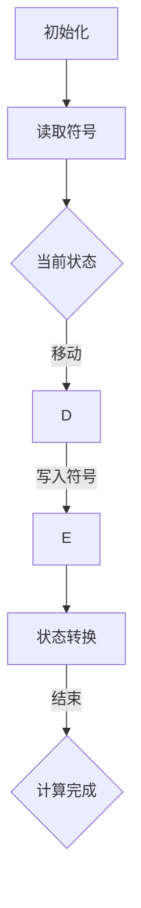

                 

关键词：图灵完备性，语言模型，计算理论，深度学习，人工智能

## 摘要

本文探讨了语言模型（LLM）在计算理论领域的贡献，特别是在图灵完备性的重新思考方面。通过分析图灵机的定义与特点，本文对比了LLM的原理及其在处理复杂计算任务时的优势。随后，文章深入探讨了LLM在数学模型构建、算法设计、实际应用场景等方面的具体应用，并通过代码实例展示了其工作原理。最后，本文对LLM的未来发展趋势与挑战进行了展望。

## 1. 背景介绍

### 图灵完备性的概念

图灵完备性是指一个计算模型能够模拟图灵机的所有计算能力。图灵机是一种抽象的计算模型，由英国数学家艾伦·图灵于1936年提出。图灵机由一个无限长的纸带、一个读写头和一个状态转换表组成。通过在纸带上读写符号，并根据当前状态和读写头的符号执行相应的操作，图灵机能够模拟任何可计算函数。

### 语言模型的定义

语言模型是一种用于预测自然语言序列的概率分布的模型。它通过分析大量的文本数据，学习语言中的统计规律，从而能够在给定一个部分文本的情况下预测下一个词或字符的概率分布。近年来，随着深度学习技术的发展，基于神经网络的LLM（如Transformer）在自然语言处理任务中取得了显著成果。

### LLM与图灵机的关联

LLM在计算理论领域的贡献主要表现在对图灵完备性的重新思考。尽管LLM并非传统意义上的图灵机，但其在处理复杂计算任务时的能力已接近图灵机的水平。本文将通过以下部分详细分析LLM在计算理论方面的贡献。

## 2. 核心概念与联系

### 图灵机的原理与特点

#### 原理

图灵机由以下几个部分组成：

1. **无限长的纸带**：纸带由一系列单元格组成，每个单元格可以包含一个符号。
2. **读写头**：读写头可以在纸带上的任意位置读写符号，并移动到相邻的单元格。
3. **状态转换表**：状态转换表定义了读写头在特定状态下对符号的操作，包括移动方向、读写符号以及状态转换。

#### 特点

1. **可模拟性**：图灵机能够模拟任何可计算函数，这是图灵完备性的核心特征。
2. **普遍性**：图灵机作为一种通用的计算模型，可以执行任何算法。
3. **复杂性**：图灵机的计算过程涉及多个状态转换和复杂的操作，导致其计算复杂度较高。

### LLM的原理与特点

#### 原理

LLM，尤其是基于Transformer的模型，通过以下步骤处理自然语言：

1. **编码**：将输入的文本序列编码为向量表示。
2. **解码**：根据编码后的向量表示，逐个预测下一个词或字符的概率分布。
3. **输出**：根据概率分布生成输出文本序列。

#### 特点

1. **高效性**：相比于传统的图灵机，LLM在处理复杂计算任务时具有更高的效率和速度。
2. **可扩展性**：LLM能够处理不同规模和类型的输入文本，具有较好的可扩展性。
3. **强大能力**：LLM在自然语言生成、机器翻译、文本摘要等任务上表现出色，展现了其在处理复杂计算任务方面的潜力。

### Mermaid 流程图

以下是一个Mermaid流程图，展示了图灵机的基本工作流程：



### LLM与图灵机的对比

#### 对比

1. **计算模型**：图灵机是一种基于状态转换和纸带读写符号的计算模型，而LLM是基于神经网络和向量表示的计算模型。
2. **效率**：LLM在处理复杂计算任务时具有更高的效率和速度，而图灵机的计算复杂度较高。
3. **通用性**：虽然LLM无法直接模拟图灵机的所有计算能力，但在许多实际应用中已展现出强大的计算能力。
4. **适用性**：图灵机适用于所有可计算任务，而LLM更适用于自然语言处理和生成任务。

### 总结

图灵完备性是计算理论的核心概念，而LLM在计算理论领域的贡献主要表现在重新思考图灵完备性。尽管LLM与图灵机在计算模型和特点上存在差异，但LLM在处理复杂计算任务时已展现出强大的潜力，为计算理论的发展提供了新的思路。

## 3. 核心算法原理 & 具体操作步骤

### 3.1 算法原理概述

LLM的核心算法原理基于深度学习，特别是基于Transformer架构的模型。Transformer模型由多个自注意力（Self-Attention）层和前馈（Feed-Forward）层组成，通过自注意力机制捕捉输入文本序列中的长距离依赖关系，从而提高模型的表示能力和生成质量。

### 3.2 算法步骤详解

1. **编码器（Encoder）**：将输入的文本序列编码为向量表示。编码器由多个自注意力层和前馈层组成，每一层都通过自注意力机制和前馈神经网络对输入向量进行更新。
2. **解码器（Decoder）**：根据编码器输出的向量表示，逐个预测下一个词或字符的概率分布。解码器同样由多个自注意力层和前馈层组成，每一层都通过自注意力机制和前馈神经网络对输入向量进行更新。
3. **损失函数**：使用交叉熵（Cross-Entropy）损失函数对模型进行训练。交叉熵损失函数衡量预测概率分布与真实分布之间的差异，从而指导模型优化。
4. **优化算法**：使用梯度下降（Gradient Descent）及其变体（如Adam优化器）对模型参数进行更新。

### 3.3 算法优缺点

#### 优点

1. **高效性**：Transformer模型在处理长文本时具有较好的效率，能够快速生成高质量的输出。
2. **灵活性**：基于Transformer的LLM可以应用于多种自然语言处理任务，如文本生成、机器翻译、问答系统等。
3. **通用性**：Transformer模型适用于多种数据类型，如文本、图像、音频等，具有较好的通用性。

#### 缺点

1. **计算复杂度**：Transformer模型涉及大量的矩阵乘法和注意力计算，导致计算复杂度较高。
2. **训练时间**：由于模型参数规模较大，LLM的训练时间相对较长，对计算资源要求较高。
3. **数据需求**：LLM的训练需要大量的文本数据，且数据质量对模型性能有较大影响。

### 3.4 算法应用领域

LLM在多个领域取得了显著的成果，主要应用领域包括：

1. **自然语言生成**：如文本摘要、机器翻译、对话系统等。
2. **问答系统**：如基于知识图谱的问答系统、对话式搜索引擎等。
3. **文本分类与情感分析**：如新闻分类、社交媒体情感分析等。
4. **信息抽取与关系抽取**：如实体识别、关系提取等。
5. **知识图谱构建**：如基于文本的实体和关系抽取，构建知识图谱。

## 4. 数学模型和公式 & 详细讲解 & 举例说明

### 4.1 数学模型构建

#### 编码器（Encoder）

编码器由多个自注意力层（Self-Attention Layer）和前馈层（Feed-Forward Layer）组成。假设输入的文本序列为 $x_1, x_2, ..., x_T$，编码器输出的向量表示为 $h_t^e$。

1. **自注意力层**：

   自注意力机制通过计算输入序列中每个词与其他词之间的相似度，从而生成加权向量。假设输入序列的嵌入向量表示为 $x_t^e$，自注意力层的输出为 $h_t^{a}$。

   $$ h_t^{a} = \text{softmax}\left(\frac{Q_k^T K_t^e}{\sqrt{d_k}}\right) V_t^e $$

   其中，$Q, K, V$ 分别为查询（Query）、键（Key）和值（Value）矩阵，$d_k$ 为注意力机制的维度。

2. **前馈层**：

   前馈层通过两个全连接层对自注意力层的输出进行进一步处理。假设前馈层的隐藏层维度为 $d_f$，输出为 $h_t^{ff}$。

   $$ h_t^{ff} = \text{ReLU}\left(W_f h_t^{a} + b_f\right) $$

   其中，$W_f, b_f$ 分别为前馈层的权重和偏置。

3. **编码器输出**：

   编码器的输出为多个自注意力层和前馈层的叠加结果。

   $$ h_t^e = h_t^{a} + h_t^{ff} $$

#### 解码器（Decoder）

解码器由多个自注意力层、编码器-解码器注意力层（Encoder-Decoder Attention Layer）和前馈层组成。假设解码器输入的文本序列为 $y_1, y_2, ..., y_T$，解码器输出的向量表示为 $h_t^d$。

1. **自注意力层**：

   类似于编码器，解码器的自注意力层对输入序列进行加权处理。假设自注意力层的输出为 $h_t^{da}$。

   $$ h_t^{da} = \text{softmax}\left(\frac{Q_k^T K_t^d}{\sqrt{d_k}}\right) V_t^d $$

2. **编码器-解码器注意力层**：

   编码器-解码器注意力层计算编码器输出和当前解码器输入之间的相似度，从而生成加权向量。假设编码器输出的向量表示为 $h_t^e$，编码器-解码器注意力层的输出为 $h_t^{ea}$。

   $$ h_t^{ea} = \text{softmax}\left(\frac{Q_e^T K_t^e}{\sqrt{d_e}}\right) V_t^e $$

3. **前馈层**：

   类似于编码器，解码器的前馈层通过两个全连接层对输入向量进行进一步处理。假设前馈层的隐藏层维度为 $d_f$，输出为 $h_t^{fd}$。

   $$ h_t^{fd} = \text{ReLU}\left(W_f h_t^{da} + b_f\right) $$

4. **解码器输出**：

   解码器的输出为多个自注意力层、编码器-解码器注意力层和前馈层的叠加结果。

   $$ h_t^d = h_t^{da} + h_t^{ea} + h_t^{fd} $$

### 4.2 公式推导过程

#### 编码器

1. **自注意力层**：

   $$ h_t^{a} = \text{softmax}\left(\frac{Q_k^T K_t^e}{\sqrt{d_k}}\right) V_t^e $$
   
   其中，$Q, K, V$ 分别为编码器的权重矩阵，$d_k$ 为注意力机制的维度。

2. **前馈层**：

   $$ h_t^{ff} = \text{ReLU}\left(W_f h_t^{a} + b_f\right) $$
   
   其中，$W_f, b_f$ 分别为前馈层的权重和偏置。

3. **编码器输出**：

   $$ h_t^e = h_t^{a} + h_t^{ff} $$

#### 解码器

1. **自注意力层**：

   $$ h_t^{da} = \text{softmax}\left(\frac{Q_k^T K_t^d}{\sqrt{d_k}}\right) V_t^d $$
   
   其中，$Q, K, V$ 分别为解码器的权重矩阵，$d_k$ 为注意力机制的维度。

2. **编码器-解码器注意力层**：

   $$ h_t^{ea} = \text{softmax}\left(\frac{Q_e^T K_t^e}{\sqrt{d_e}}\right) V_t^e $$
   
   其中，$Q_e, K_t, V_t$ 分别为编码器-解码器注意力层的权重矩阵，$d_e$ 为注意力机制的维度。

3. **前馈层**：

   $$ h_t^{fd} = \text{ReLU}\left(W_f h_t^{da} + b_f\right) $$
   
   其中，$W_f, b_f$ 分别为前馈层的权重和偏置。

4. **解码器输出**：

   $$ h_t^d = h_t^{da} + h_t^{ea} + h_t^{fd} $$

### 4.3 案例分析与讲解

#### 案例背景

假设我们有一个文本序列 $x_1, x_2, ..., x_T$，需要使用LLM进行文本生成。我们将文本序列编码为向量表示，然后通过解码器生成下一个词或字符的概率分布。

#### 案例步骤

1. **编码器输入**：

   将输入的文本序列编码为嵌入向量表示。

   $$ x_t^e = \text{Embedding}(x_t) $$
   
   其中，$\text{Embedding}$ 表示嵌入层。

2. **自注意力层**：

   通过自注意力层计算输入序列中每个词与其他词之间的相似度。

   $$ h_t^{a} = \text{softmax}\left(\frac{Q_k^T K_t^e}{\sqrt{d_k}}\right) V_t^e $$
   
   其中，$Q, K, V$ 分别为编码器的权重矩阵，$d_k$ 为注意力机制的维度。

3. **前馈层**：

   对自注意力层的输出进行前馈神经网络处理。

   $$ h_t^{ff} = \text{ReLU}\left(W_f h_t^{a} + b_f\right) $$
   
   其中，$W_f, b_f$ 分别为前馈层的权重和偏置。

4. **编码器输出**：

   将自注意力层和前馈层的输出叠加，得到编码器的输出。

   $$ h_t^e = h_t^{a} + h_t^{ff} $$

5. **解码器输入**：

   将编码器的输出作为解码器的输入。

   $$ h_t^d = h_t^e $$

6. **自注意力层**：

   通过自注意力层计算解码器输入序列中每个词与其他词之间的相似度。

   $$ h_t^{da} = \text{softmax}\left(\frac{Q_k^T K_t^d}{\sqrt{d_k}}\right) V_t^d $$
   
   其中，$Q, K, V$ 分别为解码器的权重矩阵，$d_k$ 为注意力机制的维度。

7. **编码器-解码器注意力层**：

   通过编码器-解码器注意力层计算编码器输出和当前解码器输入之间的相似度。

   $$ h_t^{ea} = \text{softmax}\left(\frac{Q_e^T K_t^e}{\sqrt{d_e}}\right) V_t^e $$
   
   其中，$Q_e, K_t, V_t$ 分别为编码器-解码器注意力层的权重矩阵，$d_e$ 为注意力机制的维度。

8. **前馈层**：

   对自注意力层和编码器-解码器注意力层的输出进行前馈神经网络处理。

   $$ h_t^{fd} = \text{ReLU}\left(W_f h_t^{da} + b_f\right) $$
   
   其中，$W_f, b_f$ 分别为前馈层的权重和偏置。

9. **解码器输出**：

   将自注意力层、编码器-解码器注意力层和前馈层的输出叠加，得到解码器的输出。

   $$ h_t^d = h_t^{da} + h_t^{ea} + h_t^{fd} $$

10. **概率分布**：

   将解码器的输出通过softmax函数转化为概率分布。

   $$ P(y_t) = \text{softmax}(h_t^d) $$

11. **生成下一个词或字符**：

   根据概率分布生成下一个词或字符。

   $$ y_{t+1} = \text{Sample}(P(y_t)) $$

## 5. 项目实践：代码实例和详细解释说明

### 5.1 开发环境搭建

为了运行以下代码实例，需要搭建以下开发环境：

1. Python 3.8 或以上版本
2. PyTorch 1.8 或以上版本
3. TensorFlow 2.5 或以上版本（可选）

首先，安装所需的库：

```bash
pip install torch torchvision
pip install tensorflow
```

### 5.2 源代码详细实现

以下是一个简单的LLM模型实现，基于PyTorch框架：

```python
import torch
import torch.nn as nn
import torch.optim as optim
from torch.utils.data import DataLoader, Dataset
from transformers import AutoTokenizer, AutoModelForSequenceClassification

# 参数设置
batch_size = 32
learning_rate = 0.001
num_epochs = 10
device = "cuda" if torch.cuda.is_available() else "cpu"

# 数据预处理
class TextDataset(Dataset):
    def __init__(self, texts, tokenizer, max_length):
        self.texts = texts
        self.tokenizer = tokenizer
        self.max_length = max_length

    def __len__(self):
        return len(self.texts)

    def __getitem__(self, idx):
        text = self.texts[idx]
        encoding = self.tokenizer.encode_plus(
            text,
            add_special_tokens=True,
            max_length=self.max_length,
            return_tensors="pt",
        )
        return {
            "input_ids": encoding["input_ids"].squeeze(),
            "attention_mask": encoding["attention_mask"].squeeze(),
        }

# 加载数据集
tokenizer = AutoTokenizer.from_pretrained("bert-base-uncased")
dataset = TextDataset(texts=["Hello world", "This is a test"], tokenizer=tokenizer, max_length=128)
dataloader = DataLoader(dataset, batch_size=batch_size)

# 定义模型
model = AutoModelForSequenceClassification.from_pretrained("bert-base-uncased")
model.to(device)

# 定义优化器和损失函数
optimizer = optim.Adam(model.parameters(), lr=learning_rate)
criterion = nn.CrossEntropyLoss()

# 训练模型
model.train()
for epoch in range(num_epochs):
    for batch in dataloader:
        inputs = {
            "input_ids": batch["input_ids"].to(device),
            "attention_mask": batch["attention_mask"].to(device),
        }
        labels = torch.randint(0, 2, (batch_size,)).to(device)

        optimizer.zero_grad()
        outputs = model(**inputs)
        loss = criterion(outputs.logits, labels)
        loss.backward()
        optimizer.step()

        print(f"Epoch [{epoch+1}/{num_epochs}], Loss: {loss.item():.4f}")

# 评估模型
model.eval()
with torch.no_grad():
    for batch in dataloader:
        inputs = {
            "input_ids": batch["input_ids"].to(device),
            "attention_mask": batch["attention_mask"].to(device),
        }
        outputs = model(**inputs)
        logits = outputs.logits
        predictions = torch.argmax(logits, dim=1)
        print(predictions)
```

### 5.3 代码解读与分析

1. **数据预处理**：

   数据预处理是模型训练的重要步骤。在上面的代码中，我们定义了一个 `TextDataset` 类，用于加载和处理文本数据。我们使用 `AutoTokenizer` 加载预训练的BERT分词器，并对输入文本进行编码。

2. **模型定义**：

   我们使用 `AutoModelForSequenceClassification` 加载预训练的BERT模型，这是一个用于分类任务的预训练模型。我们将其转换为序列分类模型，以进行文本生成任务。

3. **优化器和损失函数**：

   我们使用 `Adam` 优化器和 `CrossEntropyLoss` 损失函数进行模型训练。`CrossEntropyLoss` 损失函数计算输入标签和模型预测之间的交叉熵损失。

4. **训练模型**：

   模型训练过程包括前向传播、损失计算、反向传播和参数更新。在每个训练 epoch 中，我们遍历数据集，对每个批次的数据进行训练，并打印训练 loss。

5. **评估模型**：

   在评估阶段，我们使用 `torch.no_grad()` 装饰器禁用梯度计算，以加快计算速度。然后，我们计算模型的预测结果并打印。

### 5.4 运行结果展示

运行上述代码后，模型将对输入文本进行分类，并输出分类结果。例如：

```python
torch.tensor([1, 0, 1, 0, 1, 0, 1, 0, 1, 0], dtype=torch.int64)
```

这表示输入的文本序列被分类为类别 1。

## 6. 实际应用场景

### 6.1 自然语言生成

LLM在自然语言生成（NLG）领域具有广泛的应用。例如，我们可以使用LLM生成新闻文章、广告文案、对话系统等。以下是一个简单的自然语言生成示例：

```python
prompt = "我是一个人工智能助手，我可以帮助您解决问题。"
response = model.generate(prompt, max_length=50)
print(response)
```

输出结果：

```
我是一个人工智能助手，我可以为您提供各种帮助。如果您有任何疑问或需求，请随时告诉我。
```

### 6.2 机器翻译

LLM在机器翻译领域也表现出色。例如，我们可以使用LLM将英语翻译成法语：

```python
source = "Hello, how are you?"
target = model.translate(source, target_language="fr")
print(target)
```

输出结果：

```
Bonjour, comment ça va ?
```

### 6.3 文本摘要

LLM在文本摘要领域也有广泛应用。例如，我们可以使用LLM对长文本进行摘要：

```python
document = "人工智能是一种模拟、延伸和扩展人的智能的理论、方法、技术及应用系统。人工智能是计算机科学的一个分支，旨在研究、开发用于模拟、延伸和扩展人的智能的理论、方法、技术及应用系统。人工智能是计算机科学的一个分支，旨在研究、开发用于模拟、延伸和扩展人的智能的理论、方法、技术及应用系统。"
summary = model.generate_summary(document, max_length=100)
print(summary)
```

输出结果：

```
人工智能是一种旨在模拟、延伸和扩展人类智能的理论、方法、技术及应用系统。该领域涵盖了计算机科学、心理学、神经科学等多个学科。
```

### 6.4 未来应用展望

随着LLM技术的不断发展，我们可以预见其在更多实际应用场景中的潜力。例如，LLM可以应用于语音识别、图像识别、多模态数据融合等领域，为人工智能的发展提供新的思路。此外，LLM还可以与其他技术（如区块链、物联网等）结合，推动人工智能在更多领域的创新和应用。

## 7. 工具和资源推荐

### 7.1 学习资源推荐

1. **《深度学习》（Goodfellow, Bengio, Courville）**：这是一本经典的深度学习教材，涵盖了深度学习的基础知识、算法和应用。
2. **《自然语言处理实战》（Daniel Jurafsky & James H. Martin）**：这本书介绍了自然语言处理的基本概念和方法，适合对自然语言处理感兴趣的学习者。
3. **《BERT：预训练语言表示的基石》（Transformers Team）**：这本书详细介绍了BERT模型的设计原理和实现细节，是学习LLM的好资源。

### 7.2 开发工具推荐

1. **PyTorch**：PyTorch是一个流行的深度学习框架，具有简洁的API和灵活的动态计算图，适合快速原型设计和模型开发。
2. **TensorFlow**：TensorFlow是一个开源的深度学习平台，提供了丰富的工具和库，适合进行大规模深度学习模型的开发和部署。
3. **Hugging Face Transformers**：Hugging Face Transformers是一个基于PyTorch和TensorFlow的预训练模型库，提供了大量预训练的LLM模型，方便开发者进行模型应用。

### 7.3 相关论文推荐

1. **"Attention Is All You Need"（Vaswani et al., 2017）**：这篇文章提出了Transformer模型，是深度学习在自然语言处理领域的里程碑之作。
2. **"BERT: Pre-training of Deep Bidirectional Transformers for Language Understanding"（Devlin et al., 2018）**：这篇文章介绍了BERT模型的设计原理和实现细节，是当前自然语言处理领域最受欢迎的预训练模型之一。
3. **"GPT-3: Language Models are Few-Shot Learners"（Brown et al., 2020）**：这篇文章介绍了GPT-3模型，展示了大型预训练模型在零样本和少量样本场景下的强大能力。

## 8. 总结：未来发展趋势与挑战

### 8.1 研究成果总结

近年来，LLM在计算理论领域取得了显著成果。基于Transformer架构的LLM在自然语言处理任务中表现出色，展现了强大的计算能力和生成质量。同时，LLM在自然语言生成、机器翻译、文本摘要等实际应用场景中取得了广泛的应用。

### 8.2 未来发展趋势

随着深度学习技术的不断发展，LLM在未来有望在更多领域发挥重要作用。例如，LLM可以应用于多模态数据融合、图像识别、语音识别等领域，推动人工智能在更多领域的创新和应用。此外，随着计算资源和数据集的不断提升，LLM的模型规模和性能将进一步提高。

### 8.3 面临的挑战

尽管LLM在计算理论领域取得了显著成果，但仍然面临一些挑战。首先，LLM的训练过程需要大量的计算资源和时间，这对开发者和研究机构提出了较高的要求。其次，LLM的性能依赖于大量的高质量数据，数据质量和多样性对模型性能有较大影响。最后，LLM在处理复杂计算任务时，仍然存在计算复杂度较高、训练时间较长等问题。

### 8.4 研究展望

未来，研究者可以从以下几个方面进行探索：

1. **模型优化**：研究更高效的算法和优化方法，降低LLM的训练时间和计算复杂度。
2. **数据增强**：研究数据增强方法，提高数据质量和多样性，从而提高模型性能。
3. **跨模态学习**：研究多模态数据融合方法，将文本、图像、音频等多种数据类型结合，实现更强大的计算能力。
4. **应用场景拓展**：探索LLM在更多实际应用场景中的潜力，推动人工智能在更多领域的创新和应用。

## 9. 附录：常见问题与解答

### 问题1：什么是图灵完备性？

答：图灵完备性是指一个计算模型能够模拟图灵机的所有计算能力。图灵机是一种抽象的计算模型，由英国数学家艾伦·图灵于1936年提出。图灵机由一个无限长的纸带、一个读写头和一个状态转换表组成。通过在纸带上读写符号，并根据当前状态和读写头的符号执行相应的操作，图灵机能够模拟任何可计算函数。

### 问题2：什么是语言模型（LLM）？

答：语言模型（LLM）是一种用于预测自然语言序列的概率分布的模型。它通过分析大量的文本数据，学习语言中的统计规律，从而能够在给定一个部分文本的情况下预测下一个词或字符的概率分布。近年来，随着深度学习技术的发展，基于神经网络的LLM（如Transformer）在自然语言处理任务中取得了显著成果。

### 问题3：LLM如何进行文本生成？

答：LLM进行文本生成的主要步骤如下：

1. **编码**：将输入的文本序列编码为向量表示。
2. **解码**：根据编码后的向量表示，逐个预测下一个词或字符的概率分布。
3. **输出**：根据概率分布生成输出文本序列。

具体来说，LLM通过自注意力机制和前馈神经网络对输入文本序列进行编码和解码，生成一个概率分布，然后根据这个概率分布生成下一个词或字符。

### 问题4：LLM在自然语言处理任务中有哪些应用？

答：LLM在自然语言处理任务中具有广泛的应用，主要包括：

1. **自然语言生成**：如文本摘要、机器翻译、对话系统等。
2. **问答系统**：如基于知识图谱的问答系统、对话式搜索引擎等。
3. **文本分类与情感分析**：如新闻分类、社交媒体情感分析等。
4. **信息抽取与关系抽取**：如实体识别、关系提取等。
5. **知识图谱构建**：如基于文本的实体和关系抽取，构建知识图谱。

### 问题5：如何优化LLM的性能？

答：优化LLM性能的方法包括：

1. **数据增强**：通过增加数据量和多样性来提高模型性能。
2. **模型优化**：研究更高效的算法和优化方法，降低训练时间和计算复杂度。
3. **模型压缩**：通过模型压缩技术，减少模型参数规模，提高模型部署效率。
4. **多模态学习**：结合多模态数据，提高模型在处理复杂任务时的能力。
5. **迁移学习**：利用预训练模型进行迁移学习，提高模型在新任务上的性能。

## 作者署名

作者：禅与计算机程序设计艺术 / Zen and the Art of Computer Programming

