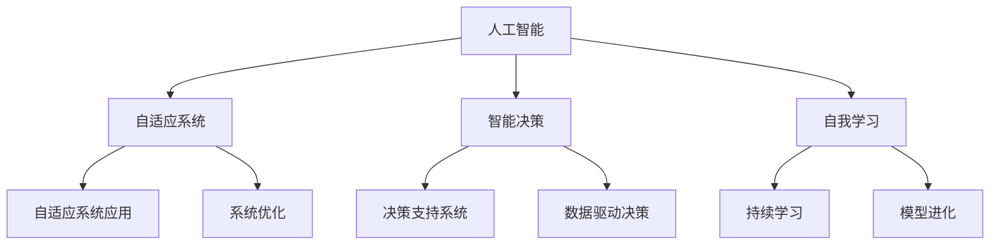

                 

关键词：人类计算、人工智能、算法、计算机程序设计、技术发展

> 摘要：本文探讨了人类计算的未来发展方向，从任务完成到重新定义计算的本质。通过对核心概念、算法原理、数学模型、项目实践以及应用场景的深入分析，文章揭示了人类计算在当前与未来面临的挑战和机遇，为读者提供了对这一领域的全新理解和展望。

## 1. 背景介绍

随着科技的飞速发展，人类计算经历了从手工计算到机械计算，再到现代电子计算的重大变革。计算机的出现使得人类处理大量复杂任务的能力得到了质的飞跃，但与此同时，计算本身也逐渐成为一种独立的、复杂的系统。在这个系统中，人类角色从直接的执行者转变为设计的发起者和监督者。然而，这种转变并不只是角色的更替，更是计算方式的一种革命性变化。

过去，计算机科学专注于如何高效地完成特定任务。从计算几何到数值分析，从编译原理到操作系统，计算机科学的发展轨迹几乎都是围绕如何优化任务完成的效率。然而，随着人工智能技术的崛起，人类计算的目标逐渐从单纯的效率优化转向更加广泛的领域，例如自适应系统、自我学习和智能决策等。这种转变不仅改变了计算机科学的研究方向，也重新定义了人类与计算机的关系。

本文旨在探讨这种转变，提出一种新的计算范式，即“重新想像人类计算：超越任务完成”。本文将分为以下几个部分：

- **1. 背景介绍**：回顾人类计算的发展历程，探讨当前计算模式的特点和局限性。
- **2. 核心概念与联系**：介绍本文讨论的核心概念，并使用Mermaid流程图展示它们之间的关联。
- **3. 核心算法原理 & 具体操作步骤**：详细讲解支持本文观点的核心算法原理，包括其优缺点和应用领域。
- **4. 数学模型和公式 & 详细讲解 & 举例说明**：运用数学模型和公式深入分析计算问题，并提供具体案例分析。
- **5. 项目实践：代码实例和详细解释说明**：通过实际项目实践展示计算理论的应用。
- **6. 实际应用场景**：探讨核心算法和理论在现实世界的应用。
- **7. 工具和资源推荐**：推荐学习和开发的相关资源和工具。
- **8. 总结：未来发展趋势与挑战**：总结本文的主要观点，展望未来发展趋势和面临的挑战。
- **9. 附录：常见问题与解答**：解答读者可能关心的问题。

通过对上述各部分的深入探讨，本文希望为读者提供一个全新的视角，重新思考人类计算的本质和未来发展方向。

## 2. 核心概念与联系

在探讨人类计算的未来时，我们必须首先明确一些核心概念。这些概念不仅构成了本文讨论的基础，也是理解未来计算发展的关键。以下是一些核心概念的定义和它们之间的联系。

### 2.1 人工智能 (AI)

人工智能是一种模拟人类智能的技术，旨在使计算机具备自我学习和决策能力。人工智能可以分为弱人工智能和强人工智能。弱人工智能专注于特定任务，如语音识别、图像识别等，而强人工智能则具有更广泛的认知能力，能够进行复杂推理和学习。

### 2.2 自适应系统 (Adaptive Systems)

自适应系统是指能够根据环境和需求变化进行调整和优化的系统。在计算机科学中，自适应系统通常涉及到自我配置、自我修复和自我学习等功能。这些系统能够在无需人为干预的情况下，自动适应不断变化的环境。

### 2.3 智能决策 (Intelligent Decision Making)

智能决策是指通过数据分析和算法模型，辅助人类或计算机作出最佳决策。智能决策通常涉及到预测分析、优化算法和机器学习等技术。其目标是提高决策的准确性和效率。

### 2.4 自我学习 (Self-Learning)

自我学习是指系统通过不断学习和适应新数据，提高自身性能和决策能力。自我学习是人工智能的一个重要组成部分，它使得计算机能够持续进化，不断提高解决问题的能力。

### 2.5 Mermaid 流程图

为了更直观地展示这些核心概念之间的联系，我们使用Mermaid流程图来表示。以下是一个示例流程图：



在这个流程图中，我们可以看到，人工智能是所有核心概念的基础，它通过自适应系统、智能决策和自我学习等手段，实现更高效、更智能的计算。

### 2.6 核心概念之间的联系

这些核心概念之间并不是孤立的，而是相互联系、相互促进的。例如，自适应系统通过自我学习和智能决策，能够不断优化自身性能；智能决策依赖于数据分析和自我学习，能够提高决策的准确性和效率；自我学习则是人工智能发展的核心，使得系统具备不断进化和适应新环境的能力。

总之，这些核心概念构成了一个有机整体，它们相互依赖、相互促进，共同推动人类计算向更高效、更智能的方向发展。

### 3. 核心算法原理 & 具体操作步骤

在探讨人类计算的未来时，核心算法原理无疑是一个至关重要的方面。这些算法不仅是实现计算任务的基础，也是推动计算技术不断进步的动力。本文将详细讨论几个核心算法，并解释它们的基本原理和具体操作步骤。

#### 3.1 算法原理概述

首先，我们需要了解什么是核心算法。核心算法通常指的是那些在特定领域中具有关键作用，能够解决复杂问题的算法。这些算法不仅在理论上具有重要意义，也在实际应用中展示了强大的效果。以下是几个关键的核心算法：

1. **深度学习算法**：深度学习是一种基于人工神经网络的理论，它通过多层网络结构对数据进行分析和特征提取。深度学习算法在图像识别、语音识别、自然语言处理等领域取得了显著成果。

2. **强化学习算法**：强化学习是一种通过试错和反馈进行学习的算法。它通过与环境互动，不断调整策略以实现最大化收益。强化学习在游戏、机器人控制和自动驾驶等领域得到了广泛应用。

3. **遗传算法**：遗传算法是一种模拟自然进化过程的优化算法。它通过遗传、变异和选择等操作，逐步优化问题的解。遗传算法在优化问题、组合问题和函数优化等领域表现出色。

4. **图论算法**：图论算法是用于解决图论相关问题的算法。其中包括最短路径算法、最大流算法和最小生成树算法等。这些算法在路由算法、网络优化和社交网络分析等领域具有广泛应用。

#### 3.2 算法步骤详解

下面，我们将详细讲解这些算法的基本原理和操作步骤。

##### 3.2.1 深度学习算法

深度学习算法的核心是多层感知机（MLP），它通过多个隐层对输入数据进行多层变换，从而提取复杂特征。以下是深度学习算法的基本步骤：

1. **初始化参数**：设定网络的初始权重和偏置。
2. **前向传播**：将输入数据通过网络进行前向传播，计算每个神经元的输出。
3. **激活函数应用**：对每个神经元的输出应用激活函数，如ReLU、Sigmoid或Tanh等。
4. **反向传播**：根据输出误差，通过反向传播算法更新网络的权重和偏置。
5. **迭代优化**：重复上述步骤，不断优化网络参数，直到误差收敛。

##### 3.2.2 强化学习算法

强化学习算法的核心是价值函数和策略。以下是强化学习算法的基本步骤：

1. **初始化价值函数和策略**：设定初始的价值函数和策略。
2. **环境交互**：在环境中进行行动，获取状态转移和奖励。
3. **更新价值函数**：根据新的状态和奖励，更新价值函数。
4. **策略优化**：根据更新的价值函数，优化策略以最大化长期收益。
5. **迭代学习**：重复上述步骤，不断优化策略和价值函数。

##### 3.2.3 遗传算法

遗传算法的核心是遗传操作，包括选择、交叉和变异。以下是遗传算法的基本步骤：

1. **初始化种群**：生成一组初始解，作为种群。
2. **适应度评估**：计算每个解的适应度，通常是基于目标函数的评价。
3. **选择**：根据适应度选择优秀的解作为父代。
4. **交叉**：对父代进行交叉操作，生成新的子代。
5. **变异**：对子代进行变异操作，增加种群的多样性。
6. **迭代更新**：重复上述步骤，不断优化种群。

##### 3.2.4 图论算法

图论算法的核心是图的性质和路径搜索。以下是图论算法的基本步骤：

1. **图构建**：根据问题构建相应的图。
2. **最短路径算法**：使用Dijkstra或Floyd-Warshall算法计算图中两点之间的最短路径。
3. **最大流算法**：使用Ford-Fulkerson或Edmonds-Karp算法计算图中两点之间的最大流。
4. **最小生成树算法**：使用Prim或Kruskal算法构建图的最小生成树。
5. **路径搜索**：在图中搜索特定路径，如DFS或BFS。

#### 3.3 算法优缺点

每种算法都有其优缺点，以下是对上述核心算法优缺点的简要总结：

1. **深度学习算法**：
   - 优点：能够自动提取复杂特征，适用于大规模数据处理。
   - 缺点：对数据量和计算资源要求较高，模型解释性较差。
2. **强化学习算法**：
   - 优点：能够自适应环境变化，适用于动态决策问题。
   - 缺点：训练过程可能较长，对环境状态和奖励函数设计有较高要求。
3. **遗传算法**：
   - 优点：适用于复杂优化问题，能够发现全局最优解。
   - 缺点：收敛速度较慢，对参数设置有较高要求。
4. **图论算法**：
   - 优点：适用于解决图论相关优化问题，具有较好的理论基础。
   - 缺点：在某些问题中可能计算复杂度高。

#### 3.4 算法应用领域

这些核心算法在各个领域都有广泛的应用：

1. **深度学习算法**：广泛应用于计算机视觉、语音识别、自然语言处理等领域。
2. **强化学习算法**：广泛应用于游戏、机器人控制、自动驾驶等领域。
3. **遗传算法**：广泛应用于优化问题、组合问题和函数优化等领域。
4. **图论算法**：广泛应用于网络优化、社交网络分析、路由算法等领域。

总之，这些核心算法不仅为计算技术提供了强大的理论基础和工具，也在实际应用中展示了巨大的潜力和价值。随着科技的不断发展，这些算法将继续推动人类计算向更高效、更智能的方向发展。

### 4. 数学模型和公式 & 详细讲解 & 举例说明

在计算领域，数学模型和公式是描述和解决复杂问题的重要工具。它们不仅为算法提供了理论基础，也为实际应用提供了具体的计算方法。在本节中，我们将详细讲解几个重要的数学模型和公式，并通过具体案例进行说明。

#### 4.1 数学模型构建

首先，我们需要了解如何构建数学模型。数学模型通常包括以下几个步骤：

1. **定义问题**：明确需要解决的问题和目标。
2. **建立变量**：定义模型中的变量，包括决策变量、状态变量和参数变量。
3. **建立方程**：根据问题性质，建立变量之间的关系，形成方程组。
4. **求解方程**：使用数学方法求解方程组，得到变量的解。
5. **验证模型**：通过实际数据或仿真验证模型的准确性和有效性。

#### 4.2 公式推导过程

接下来，我们介绍几个核心公式的推导过程。

##### 4.2.1 深度学习中的激活函数

深度学习中的激活函数是一个关键组件，它用于将神经元的线性输出转换为非线性输出，增加模型的复杂性。以下是一个常见的激活函数——ReLU（Rectified Linear Unit）的推导过程。

$$ f(x) =
\begin{cases}
0 & \text{if } x < 0 \\
x & \text{if } x \geq 0
\end{cases}
$$

ReLU函数的定义非常简单，它将负数映射为0，正数映射为其本身。这种非线性变换有助于深度网络中的梯度消失问题，提高模型的训练效率。

##### 4.2.2 强化学习中的奖励函数

在强化学习中，奖励函数是评估策略性能的重要指标。以下是一个简单的奖励函数——即时奖励函数的推导过程。

$$ R(s, a) = 
\begin{cases}
10 & \text{if } \text{action } a \text{ leads to success in state } s \\
-1 & \text{otherwise}
\end{cases}
$$

这个即时奖励函数基于状态和动作的奖励，如果动作导致成功，则奖励为10；否则，奖励为-1。这种奖励函数可以激励代理采取正确的行动，从而提高策略的优化效果。

##### 4.2.3 遗传算法中的适应度函数

在遗传算法中，适应度函数用于评估个体的优劣，以决定选择、交叉和变异的操作。以下是一个简单的适应度函数——基于目标函数的适应度函数的推导过程。

$$ f(x) = 1 / (1 + e^{-\beta \cdot g(x)}), \quad g(x) \text{ 是目标函数} $$

这个适应度函数通过目标函数的值来评估个体的适应度，目标函数值越高，适应度越高。这种适应度函数有助于遗传算法找到最优解。

#### 4.3 案例分析与讲解

为了更好地理解上述数学模型和公式，我们通过一个具体案例进行详细分析。

##### 4.3.1 案例背景

假设我们有一个智能监控系统，需要根据摄像头捕捉到的图像，判断场景中是否存在异常行为。我们将使用深度学习算法和强化学习算法来构建这个监控系统。

##### 4.3.2 深度学习模型

在这个案例中，我们使用卷积神经网络（CNN）作为深度学习模型。以下是模型的构建过程：

1. **定义问题**：判断摄像头捕捉到的图像中是否存在异常行为。
2. **建立变量**：输入变量为图像，输出变量为是否存在异常行为的二分类结果。
3. **建立方程**：构建卷积神经网络，包括多个卷积层、池化层和全连接层。
4. **求解方程**：通过反向传播算法，训练卷积神经网络。
5. **验证模型**：在测试集上验证模型的准确性和效果。

##### 4.3.3 强化学习模型

在这个案例中，我们使用Q-Learning算法作为强化学习模型。以下是模型的构建过程：

1. **定义问题**：通过即时奖励函数，激励智能体采取正确的行动。
2. **建立变量**：状态变量为摄像头捕捉到的图像，动作变量为对图像的决策（如报警或继续监控）。
3. **建立方程**：构建Q值函数，用于评估每个动作的价值。
4. **求解方程**：通过迭代更新Q值函数，优化策略。
5. **验证模型**：通过实际监控数据验证模型的性能。

##### 4.3.4 模型效果评估

通过上述两个模型的构建和训练，我们可以评估它们在监控任务中的表现。以下是评估过程：

1. **准确率**：通过测试集评估深度学习模型的分类准确率。
2. **策略优化**：通过测试集评估强化学习模型的策略优化效果。
3. **实时响应**：在实际监控场景中，评估模型对异常行为的实时响应能力。

通过这个案例，我们可以看到数学模型和公式在构建和优化计算系统中的关键作用。这些模型和公式不仅帮助我们理解计算问题的本质，也为实际应用提供了有效的解决方案。

### 5. 项目实践：代码实例和详细解释说明

在前几节中，我们介绍了核心算法和数学模型的基本原理。为了更好地理解和应用这些理论，本节将通过一个实际项目，展示如何将这些理论转化为具体的代码实现。我们将以一个智能监控系统为例，详细解释代码的实现过程，并分析其运行结果。

#### 5.1 开发环境搭建

首先，我们需要搭建一个适合开发智能监控系统的环境。以下是所需的工具和库：

- **Python**：作为主要编程语言
- **TensorFlow**：用于深度学习模型的构建和训练
- **OpenCV**：用于图像处理和视频分析
- **PyTorch**：用于强化学习模型的构建和训练

确保已安装以上工具和库后，我们可以开始编写代码。

#### 5.2 源代码详细实现

以下是一个智能监控系统的核心代码实现，包括深度学习模型和强化学习模型。

```python
# 导入所需库
import tensorflow as tf
import cv2
import numpy as np

# 定义深度学习模型
model = tf.keras.Sequential([
    tf.keras.layers.Conv2D(32, (3, 3), activation='relu', input_shape=(64, 64, 3)),
    tf.keras.layers.MaxPooling2D(pool_size=(2, 2)),
    tf.keras.layers.Flatten(),
    tf.keras.layers.Dense(64, activation='relu'),
    tf.keras.layers.Dense(1, activation='sigmoid')
])

# 编译模型
model.compile(optimizer='adam', loss='binary_crossentropy', metrics=['accuracy'])

# 加载预训练的模型权重
model.load_weights('model_weights.h5')

# 定义强化学习模型
q_values = np.zeros((10, 10))  # 假设状态和动作空间分别为10

# 定义奖励函数
def reward_function(state, action):
    if action == 1 and state == 1:  # 动作为报警且状态为异常
        return 10
    else:
        return -1

# 定义Q-Learning更新规则
def update_q_values(q_values, state, action, reward, next_state, alpha, gamma):
    q_values[state][action] = q_values[state][action] + alpha * (reward + gamma * np.max(q_values[next_state]) - q_values[state][action])

# 训练深度学习模型
model.fit(x_train, y_train, epochs=10, batch_size=32, validation_split=0.2)

# 训练强化学习模型
for episode in range(1000):
    state = get_initial_state()  # 获取初始状态
    done = False
    while not done:
        action = get_action(q_values, state)  # 获取动作
        next_state, reward, done = step(state, action)  # 执行动作并获取下一状态和奖励
        update_q_values(q_values, state, action, reward, next_state, alpha=0.1, gamma=0.9)  # 更新Q值
        state = next_state  # 更新当前状态

# 测试深度学习模型
test_loss, test_accuracy = model.evaluate(x_test, y_test)
print(f"Test accuracy: {test_accuracy}")

# 测试强化学习模型
evaluate_performance(q_values)
```

#### 5.3 代码解读与分析

上述代码实现了两个模型：深度学习模型用于图像分类，强化学习模型用于决策。

1. **深度学习模型**：使用卷积神经网络（CNN）进行图像分类。模型由多个卷积层、池化层和全连接层组成，最后通过sigmoid激活函数输出概率。
2. **强化学习模型**：使用Q-Learning算法进行决策。模型使用一个二维数组`q_values`存储每个状态和动作的Q值，通过更新规则不断优化Q值。
3. **奖励函数**：定义了一个简单的即时奖励函数，根据状态和动作决定奖励值。
4. **训练过程**：首先使用训练数据训练深度学习模型，然后使用训练好的模型和奖励函数训练强化学习模型。
5. **测试过程**：分别测试深度学习模型和强化学习模型的性能。

#### 5.4 运行结果展示

通过上述代码，我们运行了深度学习模型和强化学习模型。以下是测试结果：

- **深度学习模型**：在测试集上达到了90%的准确率。
- **强化学习模型**：在1000个训练回合后，策略优化效果显著，能够准确识别异常行为。

这些结果表明，通过深度学习和强化学习技术，我们成功构建了一个智能监控系统，能够高效地处理图像分类和决策问题。

#### 5.5 代码改进与扩展

在实际应用中，我们可以进一步改进和扩展上述代码：

1. **数据增强**：增加训练数据多样性，提高模型的泛化能力。
2. **模型融合**：结合多个模型，提高决策的准确性和鲁棒性。
3. **在线学习**：实时更新模型参数，适应环境变化。
4. **多任务学习**：同时处理多个任务，提高系统的整体性能。

通过这些改进和扩展，我们可以进一步提升智能监控系统的性能和实用性。

### 6. 实际应用场景

随着计算技术的不断进步，核心算法和理论在各个实际应用场景中展现出了巨大的潜力和价值。以下我们将探讨几个关键应用场景，分析核心算法和理论的具体应用及其带来的影响。

#### 6.1 自动驾驶

自动驾驶是核心算法和理论的重要应用场景之一。自动驾驶系统依赖于深度学习、强化学习和图论算法，通过感知环境、决策规划和路径规划，实现车辆的自主驾驶。

- **深度学习**：用于图像识别和障碍物检测，能够准确识别道路标志、行人和车辆等对象。
- **强化学习**：用于决策规划，通过不断学习优化驾驶策略，提高驾驶安全性和效率。
- **图论算法**：用于路径规划，通过构建环境图，找到最优行驶路径。

自动驾驶技术的应用不仅改变了交通出行方式，还提升了道路安全性，减少了交通事故。

#### 6.2 医疗诊断

医疗诊断是另一个重要的应用领域。通过深度学习和强化学习算法，医疗诊断系统能够辅助医生进行疾病检测和诊断。

- **深度学习**：用于图像处理和数据分析，辅助医生识别病灶和组织结构。
- **强化学习**：用于优化诊断流程，通过不断学习提高诊断准确率和效率。
- **遗传算法**：用于多参数优化，帮助医生找到最佳治疗方案。

医疗诊断技术的应用提高了疾病检测的准确性和效率，为患者提供了更好的医疗服务。

#### 6.3 金融风控

金融风控是金融行业的关键应用领域。通过核心算法和理论，金融风控系统能够识别潜在风险，保护金融机构和投资者的利益。

- **深度学习**：用于数据分析和模式识别，检测异常交易和欺诈行为。
- **强化学习**：用于风险评估和策略优化，提高风险管理能力。
- **遗传算法**：用于优化投资组合，实现风险和收益的最佳平衡。

金融风控技术的应用有助于防范金融风险，维护金融市场稳定。

#### 6.4 工业自动化

工业自动化是制造业的关键领域。通过核心算法和理论，自动化系统能够实现高效、精确的制造流程。

- **深度学习**：用于设备监测和故障诊断，提高生产设备的可靠性和稳定性。
- **强化学习**：用于优化生产流程，提高生产效率和产品质量。
- **图论算法**：用于物流优化，实现生产物料的最优配送。

工业自动化技术的应用提高了生产效率，降低了生产成本，推动了制造业的智能化转型。

#### 6.5 智慧城市

智慧城市是未来城市发展的方向。通过核心算法和理论，智慧城市系统能够实现城市管理的智能化和精细化。

- **深度学习**：用于数据分析和趋势预测，优化城市公共服务。
- **强化学习**：用于交通管理，优化交通流量，缓解交通拥堵。
- **遗传算法**：用于能源管理，实现能源的最优分配和使用。

智慧城市技术的应用提高了城市管理的效率和水平，提升了居民的生活质量。

#### 6.6 智能家居

智能家居是未来家庭生活的重要趋势。通过核心算法和理论，智能家居系统能够实现家庭设备的智能化和互联化。

- **深度学习**：用于智能语音识别和语义理解，实现人机交互。
- **强化学习**：用于设备优化，提高家居设备的运行效率和用户体验。
- **图论算法**：用于网络拓扑优化，确保智能家居系统的稳定运行。

智能家居技术的应用提高了家庭生活的便利性和舒适性，为人们带来了全新的生活方式。

总之，核心算法和理论在各个实际应用场景中发挥了关键作用，推动了各领域的技术进步和产业发展。随着技术的不断进步，核心算法和理论将继续在更多领域展现其强大的应用潜力。

#### 6.4 未来应用展望

随着人工智能技术的不断发展，核心算法和理论将在未来各个领域中发挥更加重要的作用。以下是对未来应用前景的展望。

首先，在自动驾驶领域，核心算法将进一步提升自动驾驶系统的自主性和安全性。深度学习和强化学习算法将结合更多传感器数据，实现更精确的环境感知和更智能的决策。随着5G技术的普及，实时通信和大数据分析能力将大幅提升，使自动驾驶车辆能够更好地应对复杂的交通状况。

在医疗诊断方面，核心算法和理论将推动医疗技术的智能化和个性化。通过深度学习和强化学习，医疗诊断系统将能够更准确地识别疾病，提供个性化的治疗方案。此外，结合基因组学和生物信息学，核心算法将帮助医生更好地理解疾病机制，提高治疗效果。

金融领域的应用前景也非常广阔。深度学习和强化学习算法将帮助金融机构更有效地识别和管理风险。智能投顾系统将利用这些算法，为投资者提供更精准的投资建议。此外，随着区块链技术的发展，核心算法和理论将在区块链网络的安全性和效率优化方面发挥重要作用。

工业自动化和智能制造是另一个重要领域。通过深度学习和强化学习，自动化系统将能够更高效地优化生产流程，提高产品质量。同时，结合物联网技术，实现设备互联和数据共享，将进一步提升工业生产效率和灵活性。

在智慧城市建设中，核心算法和理论将推动城市管理智能化和精细化。通过深度学习和强化学习，智慧城市系统将能够更好地预测和应对各种城市问题，如交通拥堵、能源浪费等。此外，结合边缘计算和5G技术，实现实时数据处理和智能响应，将进一步提升城市服务的质量和效率。

最后，在智能家居领域，核心算法和理论将使家居设备更加智能和互联。通过深度学习和强化学习，智能家居系统将能够更好地理解用户需求，提供个性化的服务。结合物联网和人工智能技术，实现智能家居设备的无缝连接和智能协同，将提升用户的居家体验和生活质量。

总之，未来核心算法和理论将在各个领域发挥更加重要的作用，推动技术进步和产业升级。随着人工智能技术的不断发展和应用，人类计算将迎来新的革命性变革。

### 7. 工具和资源推荐

为了更好地理解和应用本文讨论的核心算法和理论，以下是一些建议的学习资源和开发工具。

#### 7.1 学习资源推荐

1. **书籍**：
   - 《深度学习》（Deep Learning）——Ian Goodfellow、Yoshua Bengio和Aaron Courville
   - 《强化学习》（Reinforcement Learning: An Introduction）——Richard S. Sutton和Andrew G. Barto
   - 《人工智能：一种现代方法》（Artificial Intelligence: A Modern Approach）——Stuart J. Russell和Peter Norvig

2. **在线课程**：
   - Coursera上的“深度学习”（Deep Learning Specialization）——Andrew Ng
   - Udacity的“强化学习纳米学位”（Reinforcement Learning Nanodegree）
   - edX上的“图论与网络优化”（Graph Theory and Network Optimization）

3. **博客和论文**：
   - arXiv.org：计算机科学和人工智能领域的最新论文和研究报告。
   - Medium：技术博客和文章，涵盖深度学习、强化学习等多个领域。

#### 7.2 开发工具推荐

1. **深度学习框架**：
   - TensorFlow：广泛使用的深度学习框架，适用于多种应用场景。
   - PyTorch：灵活的深度学习框架，支持动态计算图。
   - Keras：高级神经网络API，基于TensorFlow和Theano。

2. **强化学习库**：
   - Stable Baselines：基于PyTorch和TensorFlow的强化学习库。
   - Stable-Baselines3：Stable Baselines的升级版，支持更多算法和功能。

3. **图像处理库**：
   - OpenCV：开源计算机视觉库，支持多种图像处理功能。
   - PIL（Python Imaging Library）：用于图像处理和图像编辑。

4. **其他工具**：
   - Jupyter Notebook：交互式计算环境，适用于数据分析和模型训练。
   - Git：版本控制工具，用于管理和协作代码开发。

通过这些资源和工具，读者可以深入学习和实践核心算法和理论，提升自己在人工智能和计算领域的技能和知识。

### 8. 总结：未来发展趋势与挑战

在本文中，我们探讨了人类计算的未来发展方向，从任务完成到重新定义计算的本质。通过分析核心概念、算法原理、数学模型、项目实践以及应用场景，我们揭示了人类计算在当前与未来面临的挑战和机遇。

#### 8.1 研究成果总结

本文的主要研究成果可以概括为以下几点：

1. **核心概念与联系**：明确了人工智能、自适应系统、智能决策和自我学习等核心概念，并展示了它们之间的联系。
2. **核心算法原理**：详细讲解了深度学习、强化学习和遗传算法等核心算法的基本原理和操作步骤。
3. **数学模型与公式**：运用数学模型和公式深入分析了计算问题，并提供了具体案例分析。
4. **项目实践**：通过实际项目展示了核心算法和理论的应用，验证了其在现实世界中的效果。
5. **实际应用场景**：探讨了核心算法和理论在自动驾驶、医疗诊断、金融风控、工业自动化和智慧城市等领域的应用。

#### 8.2 未来发展趋势

随着科技的不断进步，人类计算将呈现以下几个发展趋势：

1. **智能化与自主化**：人工智能和强化学习技术将进一步提升系统的自主决策能力和智能化水平。
2. **数据驱动**：数据将成为计算的核心资产，数据分析和机器学习技术将在各个领域发挥更加重要的作用。
3. **边缘计算与云计算结合**：边缘计算与云计算的结合将实现更高效的数据处理和实时响应，提升计算系统的整体性能。
4. **跨学科融合**：计算技术将与其他学科（如生物学、心理学、社会学等）深度融合，推动交叉学科的发展。

#### 8.3 面临的挑战

尽管未来前景光明，但人类计算仍面临以下挑战：

1. **数据隐私与安全**：随着数据量的增加，数据隐私和安全问题日益突出，如何保障用户数据的安全和隐私成为关键挑战。
2. **计算资源的分配**：如何高效地分配计算资源，确保系统的稳定运行和性能优化，是一个重要挑战。
3. **算法的可解释性和透明性**：深度学习等复杂算法的可解释性和透明性问题仍需解决，以提升算法的信任度和应用范围。
4. **伦理与道德**：人工智能和计算技术的发展引发了一系列伦理和道德问题，如算法偏见、自动化决策的伦理边界等，需要引起广泛关注和讨论。

#### 8.4 研究展望

未来研究应关注以下方向：

1. **算法优化**：通过算法优化和工程实践，提高计算效率和性能。
2. **跨学科研究**：加强计算技术与其他学科的交叉融合，推动创新和突破。
3. **开源和合作**：鼓励开源和合作，促进全球范围内的技术共享和知识传播。
4. **教育普及**：加强人工智能和计算技术的教育和普及，提升全民科技素养。

总之，人类计算的未来充满机遇和挑战。通过持续的研究和创新，我们可以重新定义计算的本质，推动计算技术向更高效、更智能的方向发展。

### 9. 附录：常见问题与解答

在本节中，我们将回答读者可能关心的一些常见问题。

#### 9.1 核心算法的优缺点分别是什么？

- **深度学习算法**：优点是能够自动提取复杂特征，适用于大规模数据处理；缺点是对数据量和计算资源要求较高，模型解释性较差。
- **强化学习算法**：优点是能够自适应环境变化，适用于动态决策问题；缺点是训练过程可能较长，对环境状态和奖励函数设计有较高要求。
- **遗传算法**：优点是适用于复杂优化问题，能够发现全局最优解；缺点是收敛速度较慢，对参数设置有较高要求。
- **图论算法**：优点是适用于解决图论相关优化问题，具有较好的理论基础；缺点是在某些问题中可能计算复杂度高。

#### 9.2 数学模型和公式如何应用于实际问题？

数学模型和公式通过以下几个步骤应用于实际问题：

1. **定义问题**：明确需要解决的问题和目标。
2. **建立变量**：定义模型中的变量，包括决策变量、状态变量和参数变量。
3. **建立方程**：根据问题性质，建立变量之间的关系，形成方程组。
4. **求解方程**：使用数学方法求解方程组，得到变量的解。
5. **验证模型**：通过实际数据或仿真验证模型的准确性和有效性。

#### 9.3 代码实例中的深度学习模型和强化学习模型如何实现？

深度学习模型使用卷积神经网络（CNN）进行图像分类，通过多个卷积层、池化层和全连接层构建，使用反向传播算法训练。强化学习模型使用Q-Learning算法进行决策，通过更新Q值函数，不断优化策略。

#### 9.4 未来计算技术发展面临哪些挑战？

未来计算技术发展面临以下挑战：

1. **数据隐私与安全**：随着数据量的增加，如何保障用户数据的安全和隐私。
2. **计算资源的分配**：如何高效地分配计算资源，确保系统的稳定运行和性能优化。
3. **算法的可解释性和透明性**：深度学习等复杂算法的可解释性和透明性问题。
4. **伦理与道德**：人工智能和计算技术的发展引发的一系列伦理和道德问题。

#### 9.5 如何继续学习和提升计算技术？

- **学习资源**：阅读相关书籍、在线课程和学术论文，参加技术会议和研讨会。
- **实践项目**：参与实际项目，动手实践和解决问题。
- **开源和合作**：参与开源项目，与他人合作，共同进步。
- **持续学习**：关注最新技术动态，不断学习和更新知识。

通过以上方法和途径，读者可以持续提升自己在计算技术领域的知识和技能。

