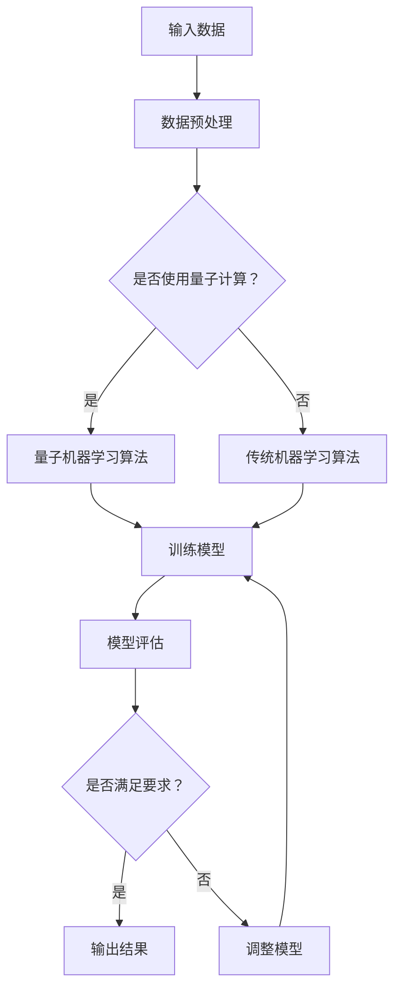

                 

关键词：量子计算、机器学习、量子算法、潜在应用

> 摘要：本文探讨了量子机器学习的原理与潜在应用，从量子计算的基本概念出发，分析了量子机器学习与传统机器学习的区别与联系，并深入探讨了量子机器学习的核心算法原理及其在不同领域中的应用。通过本文的阅读，读者将了解量子机器学习的基本框架，及其在未来的发展前景。

## 1. 背景介绍

在过去的几十年中，计算机科学和人工智能领域取得了巨大的进步。传统的计算机技术，包括图灵机和传统计算机，已经帮助我们解决了许多复杂的问题。然而，随着数据量的爆炸性增长和问题复杂度的不断增加，传统计算机在处理某些问题时已经显得力不从心。为了解决这些问题，量子计算作为一种全新的计算模式，逐渐引起了人们的关注。

量子计算是基于量子力学原理的计算机，它使用量子位（qubit）作为信息的基本单位，而不是传统计算机中的比特。量子位可以同时处于0和1的状态，这种特性被称为“叠加态”。此外，量子位之间还可以存在一种称为“纠缠态”的关联关系，这使得量子计算机在处理某些问题时具有巨大的计算优势。

机器学习作为人工智能的一个重要分支，通过对数据的学习和模式识别，实现了自动化的决策和预测。传统的机器学习算法，如决策树、支持向量机、神经网络等，都在各种领域中取得了显著的成果。然而，随着数据规模的扩大和计算复杂度的增加，传统机器学习算法在处理某些问题时也遇到了瓶颈。

将量子计算与机器学习相结合，形成量子机器学习，可以充分发挥量子计算的并行计算能力和机器学习的模式识别能力，为解决复杂问题提供新的思路。

## 2. 核心概念与联系

### 2.1 量子计算的基本概念

量子计算是基于量子力学原理的计算机，其基本单元是量子位（qubit）。与经典计算机中的比特不同，量子位可以同时处于0和1的状态，这种特性称为叠加态。此外，量子位之间还可以存在一种称为纠缠态的关联关系。

量子计算的核心概念包括：

- **叠加态**：量子位可以同时处于多个状态，这种状态称为叠加态。
- **纠缠态**：量子位之间可以相互纠缠，形成一种复杂的关联关系。
- **量子门**：量子门是量子计算的基本操作，类似于经典计算机中的逻辑门。

### 2.2 量子机器学习与传统机器学习的区别与联系

量子机器学习与传统机器学习的主要区别在于其计算基础不同。传统机器学习基于经典计算机，使用比特作为信息的基本单位，而量子机器学习基于量子计算机，使用量子位作为信息的基本单位。

尽管计算基础不同，但量子机器学习与传统机器学习仍然有许多相似之处。例如，它们都致力于通过学习数据中的模式和规律，实现自动化的决策和预测。

### 2.3 量子机器学习的核心算法

量子机器学习的核心算法包括量子支持向量机（QSVM）、量子神经网络（QNN）、量子聚类算法等。这些算法利用量子计算的优势，在处理某些问题时具有传统算法无法比拟的速度和效率。

### 2.4 Mermaid 流程图

以下是一个简单的Mermaid流程图，展示了量子机器学习的基本框架：

## 3. 核心算法原理 & 具体操作步骤

### 3.1 算法原理概述

量子机器学习的核心算法包括量子支持向量机（QSVM）、量子神经网络（QNN）、量子聚类算法等。这些算法利用量子计算的优势，在处理某些问题时具有传统算法无法比拟的速度和效率。

以量子支持向量机（QSVM）为例，其原理如下：

1. **特征映射**：将输入数据映射到高维空间，使得数据中的线性不可分问题转化为线性可分问题。
2. **寻找最优超平面**：在高维空间中寻找一个最优超平面，使得分类间隔最大。
3. **量子优化**：利用量子计算机的并行计算能力，快速寻找最优超平面。

### 3.2 算法步骤详解

1. **特征映射**：将输入数据\(x_i\)映射到高维空间，得到\(x_i'\)。

$$
x_i' = \sum_{j=1}^{d} \phi_j(x_i) |j\rangle
$$

其中，\(\phi_j(x_i)\)是第\(j\)个特征值，\( |j\rangle \)是量子位的状态。

2. **构建哈密顿量**：构建一个描述分类问题的哈密顿量\(H\)。

$$
H = - \sum_{i,j} A_{ij} |i\rangle \langle j|
$$

其中，\(A_{ij}\)是哈密顿量的矩阵元素，用于描述特征之间的关联。

3. **量子优化**：利用量子计算机的并行计算能力，寻找最优超平面。

$$
\frac{\partial H}{\partial |i\rangle} = 0
$$

4. **测量结果**：测量量子位的状态，得到分类结果。

### 3.3 算法优缺点

量子支持向量机（QSVM）的优点包括：

- 高效：利用量子计算机的并行计算能力，提高算法的运行速度。
- 精准：通过量子优化，提高分类精度。

缺点包括：

- 受限于量子计算机的发展：量子计算机尚未完全成熟，量子机器学习算法的实际应用受到一定限制。
- 复杂性：量子机器学习算法的实现和调试相对复杂。

### 3.4 算法应用领域

量子支持向量机（QSVM）在以下领域具有潜在应用：

- 数据挖掘：通过高效分类，挖掘数据中的潜在规律和模式。
- 信号处理：利用量子计算机的优势，提高信号处理的效率和精度。
- 生物信息学：通过高效分类，分析生物数据，揭示生物现象的本质。

## 4. 数学模型和公式 & 详细讲解 & 举例说明

### 4.1 数学模型构建

量子机器学习的数学模型主要包括量子支持向量机（QSVM）、量子神经网络（QNN）等。以下以量子支持向量机（QSVM）为例，介绍其数学模型构建。

假设输入数据集为\(X = \{x_1, x_2, \ldots, x_n\}\)，其中\(x_i\)是第\(i\)个样本，\(y_i\)是第\(i\)个样本的标签，标签为\(+1\)或\(-1\)。

量子支持向量机（QSVM）的数学模型包括以下部分：

1. **特征映射**：将输入数据\(x_i\)映射到高维空间。

$$
x_i' = \sum_{j=1}^{d} \phi_j(x_i) |j\rangle
$$

2. **构建哈密顿量**：构建一个描述分类问题的哈密顿量\(H\)。

$$
H = - \sum_{i,j} A_{ij} |i\rangle \langle j|
$$

其中，\(A_{ij}\)是哈密顿量的矩阵元素，用于描述特征之间的关联。

3. **量子优化**：利用量子计算机的并行计算能力，寻找最优超平面。

$$
\frac{\partial H}{\partial |i\rangle} = 0
$$

4. **测量结果**：测量量子位的

