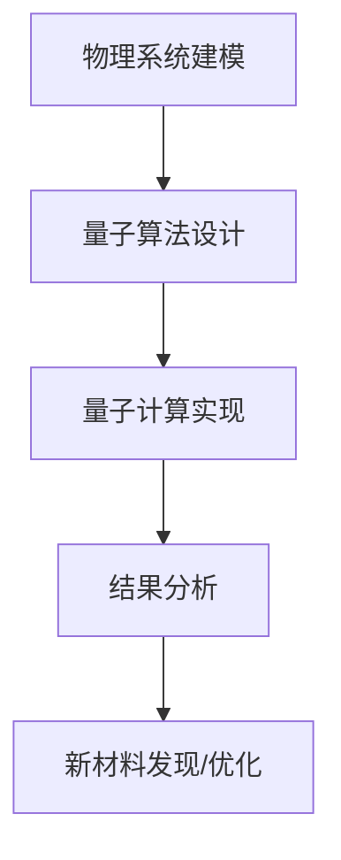

                 

关键词：量子模拟，材料科学，计算方法，量子计算，新材料发现，算法原理

> 摘要：本文探讨了量子模拟作为一种新兴的计算方法，如何通过量子计算机的能力突破传统计算方法的局限，为材料科学领域的研究带来革命性的变革。文章详细介绍了量子模拟的核心概念、算法原理、数学模型，并通过实际案例展示了其在新材料发现中的强大应用潜力。

## 1. 背景介绍

在过去的几十年中，计算机科学和材料科学取得了显著的进展，然而，在研究复杂材料体系时，传统计算方法面临着巨大的挑战。传统计算方法如量子力学分子动力学模拟、密度泛函理论等，虽然在一定程度上能够预测材料的性质，但在处理复杂的多体相互作用和高维系统时，计算成本和时间都急剧增加，往往难以得到精确的结果。

随着量子计算技术的发展，量子模拟作为一种新型的计算方法，展现出巨大的潜力。量子模拟利用量子计算机的超并行计算能力，可以有效地模拟复杂物理系统的行为，从而解决传统计算方法难以处理的难题。材料科学是量子模拟的重要应用领域之一，量子模拟有望在材料设计、材料优化和新材料发现等方面发挥关键作用。

本文将介绍量子模拟的基本概念、算法原理、数学模型，并通过实际案例展示其在材料科学领域的应用，探讨量子模拟为解决材料科学难题带来的新方法。

## 2. 核心概念与联系

### 2.1 量子计算机

量子计算机是一种基于量子力学原理的新型计算设备，它利用量子比特（qubit）进行信息处理。与传统的经典计算机相比，量子计算机具有以下几个显著特点：

1. **量子叠加态**：量子比特可以同时处于多种状态的叠加，这使得量子计算机能够同时处理大量的计算任务。
2. **量子纠缠**：量子比特之间的纠缠关系可以使得量子计算机实现高速并行计算。
3. **量子门**：量子计算机通过量子门操作量子比特，实现信息的处理和传输。

量子计算机的这些特性使其在解决特定类型的问题时具有巨大的优势，如复杂物理系统的模拟、大数分解、优化问题等。

### 2.2 量子模拟

量子模拟是量子计算机的一个重要应用领域。它利用量子计算机的能力，模拟复杂物理系统的行为，从而解决传统计算方法难以处理的难题。量子模拟的核心在于如何将经典物理问题转化为量子算法，以便利用量子计算机的优势进行高效计算。

量子模拟通常涉及以下几个关键步骤：

1. **物理系统建模**：将经典物理系统转化为量子形式，通常通过建立哈密顿量（Hamiltonian）描述系统的能量。
2. **量子算法设计**：设计量子算法，实现物理系统的模拟。量子算法通常包括量子门操作和测量过程。
3. **量子计算实现**：在量子计算机上实现量子算法，进行物理系统的模拟。
4. **结果分析**：对模拟结果进行分析，提取物理系统的性质和规律。

### 2.3 材料科学中的量子模拟

在材料科学中，量子模拟可以用于研究材料的电子结构、晶体结构、磁性、超导性等性质。通过对复杂材料的量子模拟，科学家可以深入了解材料的微观行为，为材料设计、优化和新材料发现提供有力支持。

量子模拟在材料科学中的应用包括：

1. **新材料发现**：通过模拟不同材料体系的电子结构和物理性质，发现具有潜在应用价值的新材料。
2. **材料优化**：针对已有材料，通过量子模拟优化其结构，提高其性能。
3. **性能预测**：预测材料在不同环境下的行为，如高温、高压、电场等。

下面是一个简化的量子模拟流程图，展示了量子模拟的基本原理和步骤：



通过这个流程图，我们可以看到量子模拟如何将物理系统转化为量子形式，并通过量子计算机进行高效计算，最终为材料科学的研究提供新方法。

## 3. 核心算法原理 & 具体操作步骤

### 3.1 算法原理概述

量子模拟的核心在于如何利用量子计算机的并行计算能力，模拟复杂物理系统的行为。量子模拟算法通常基于量子力学的基本原理，如薛定谔方程和哈密顿量。以下是一个简化的量子模拟算法原理概述：

1. **物理系统建模**：通过哈密顿量（Hamiltonian）描述物理系统的能量。
2. **初始化量子态**：初始化量子计算机的量子态，通常为均匀分布的叠加态。
3. **量子操作**：通过量子门操作，将初始量子态转化为目标态，实现物理系统的模拟。
4. **测量**：对量子态进行测量，获取物理系统的性质。

### 3.2 算法步骤详解

#### 3.2.1 物理系统建模

物理系统建模是量子模拟的第一步。在这一步，我们需要将经典物理问题转化为量子形式，通常通过建立哈密顿量（Hamiltonian）描述系统的能量。哈密顿量是量子力学中描述系统能量的核心工具，它决定了系统的演化规律。

例如，对于一个简单的谐振子系统，其哈密顿量可以表示为：

$$
H = \hbar \omega \left(a^{\dagger}a + \frac{1}{2}\right)
$$

其中，$\hbar$ 是约化普朗克常数，$\omega$ 是谐振子的自然频率，$a$ 和 $a^{\dagger}$ 分别是创建算子和湮灭算子，它们可以用来表示谐振子的量子态。

#### 3.2.2 初始化量子态

初始化量子态是量子模拟的第二步。在这一步，我们需要初始化量子计算机的量子态，通常为均匀分布的叠加态。这可以通过量子计算机的量子初始化操作实现。

例如，对于一个具有 $n$ 个量子比特的量子计算机，我们可以将量子态初始化为均匀分布的叠加态：

$$
|\psi_{0}\rangle = \frac{1}{\sqrt{n}}\sum_{i=0}^{n-1}|i\rangle
$$

其中，$|i\rangle$ 表示第 $i$ 个量子比特的状态。

#### 3.2.3 量子操作

量子操作是量子模拟的核心步骤。在这一步，我们需要通过量子门操作，将初始量子态转化为目标态，实现物理系统的模拟。量子门是量子计算的基本操作单元，它通过线性变换作用在量子态上，实现信息处理和传输。

例如，对于一个简单的谐振子系统，我们可以通过哈密顿量 $H$ 作用在初始量子态 $|\psi_{0}\rangle$ 上，实现系统的演化：

$$
|\psi_{t}\rangle = e^{-iHt/\hbar}|\psi_{0}\rangle
$$

其中，$t$ 是演化时间。

#### 3.2.4 测量

测量是量子模拟的最后一步。在这一步，我们需要对量子态进行测量，获取物理系统的性质。量子测量是通过量子态的坍缩实现的，它将量子态转化为经典概率分布。

例如，对于一个简单的谐振子系统，我们可以通过测量量子态 $|\psi_{t}\rangle$ 的 $a$ 和 $a^{\dagger}$ 算子的本征态，获取系统的能量分布。

### 3.3 算法优缺点

#### 优点

1. **并行计算能力**：量子计算机的超并行计算能力使得量子模拟能够高效地处理复杂的多体相互作用和高维系统。
2. **高精度**：量子模拟可以精确地描述物理系统的行为，提供高精度的计算结果。
3. **新方法**：量子模拟为材料科学的研究提供了新的方法和途径，有望在材料设计、优化和新材料发现等方面取得突破。

#### 缺点

1. **计算复杂度**：量子模拟的计算复杂度较高，需要大量的量子比特和量子门操作。
2. **技术挑战**：量子计算机的发展仍面临技术挑战，如量子纠错、量子稳定等。
3. **适用性**：并非所有物理系统都适合使用量子模拟，需要选择合适的应用场景。

### 3.4 算法应用领域

量子模拟在材料科学领域的应用非常广泛，包括：

1. **新材料发现**：通过量子模拟，科学家可以预测和发现具有潜在应用价值的新材料。
2. **材料优化**：通过量子模拟，科学家可以优化现有材料的结构，提高其性能。
3. **性能预测**：通过量子模拟，科学家可以预测材料在不同环境下的行为，为材料设计提供指导。

## 4. 数学模型和公式 & 详细讲解 & 举例说明

### 4.1 数学模型构建

量子模拟的数学模型主要基于量子力学的原理，包括量子态、哈密顿量、演化方程等。以下是构建量子模拟数学模型的基本步骤：

1. **量子态表示**：量子态可以用波函数 $|\psi\rangle$ 表示，其中 $|\psi\rangle$ 是一个复数向量，其模长的平方表示粒子在各个位置的概率分布。

2. **哈密顿量构建**：哈密顿量 $H$ 描述系统的总能量，通常由动能项、势能项和相互作用项组成。例如，对于一维谐振子，哈密顿量可以表示为：

$$
H = \frac{p^2}{2m} + \frac{1}{2}kx^2
$$

其中，$p$ 是动量算子，$m$ 是粒子质量，$k$ 是弹性系数，$x$ 是粒子位置。

3. **演化方程**：量子态随时间的演化由薛定谔方程描述：

$$
i\hbar \frac{\partial}{\partial t}|\psi\rangle = H|\psi\rangle
$$

### 4.2 公式推导过程

为了更好地理解量子模拟的数学模型，以下是对哈密顿量和演化方程的推导过程：

1. **哈密顿量推导**：

   - 动能项：动能可以表示为 $\frac{p^2}{2m}$，其中 $p$ 是动量算子，其定义满足 $p = -i\hbar \frac{\partial}{\partial x}$。
   - 势能项：势能通常表示为 $V(x)$，例如，一维谐振子的势能为 $\frac{1}{2}kx^2$。
   - 相互作用项：在量子模拟中，我们通常考虑相互作用项，例如，多粒子体系的相互作用可以通过交换积分表示。

   综上所述，哈密顿量可以表示为：

   $$
   H = \frac{p^2}{2m} + \frac{1}{2}kx^2 + V(x)
   $$

2. **演化方程推导**：

   - 根据量子力学的基本原理，系统的演化由哈密顿量决定。因此，我们可以写出薛定谔方程：

   $$
   i\hbar \frac{\partial}{\partial t}|\psi\rangle = H|\psi\rangle
   $$

   - 将哈密顿量代入，得到：

   $$
   i\hbar \frac{\partial}{\partial t}|\psi\rangle = \left(\frac{p^2}{2m} + \frac{1}{2}kx^2 + V(x)\right)|\psi\rangle
   $$

   - 通过积分操作，我们可以得到量子态随时间的演化：

   $$
   \frac{\partial}{\partial t}|\psi(t)\rangle = \frac{i\hbar}{\psi(t)} \left(\frac{p^2}{2m} + \frac{1}{2}kx^2 + V(x)\right)|\psi(t)\rangle
   $$

   - 通过分离变量，我们可以将时间依赖部分和非时间依赖部分分离，得到：

   $$
   \frac{\partial}{\partial t}|\psi(t)\rangle = \frac{i\hbar}{\psi(t)} \left(E - \frac{p^2}{2m} - \frac{1}{2}kx^2 - V(x)\right)|\psi(t)\rangle
   $$

   - 最后，我们可以通过积分操作求解薛定谔方程，得到量子态随时间的演化：

   $$
   |\psi(t)\rangle = e^{-iHt/\hbar}|\psi(0)\rangle
   $$

### 4.3 案例分析与讲解

为了更好地理解量子模拟的数学模型，我们以下通过一个简单的案例进行讲解。

#### 案例一：一维谐振子

一维谐振子是一个经典的量子力学问题，其哈密顿量和演化方程已经在上文中进行了推导。在这个案例中，我们将使用量子模拟来研究一维谐振子的振动行为。

1. **初始条件**：

   - 量子态：$|\psi(0)\rangle = \frac{1}{\sqrt{2}}(|0\rangle + |1\rangle)$，其中 $|0\rangle$ 和 $|1\rangle$ 分别表示基态和激发态。
   - 时间：$t = 0$。

2. **演化过程**：

   - 初始态：$|\psi(0)\rangle = \frac{1}{\sqrt{2}}(|0\rangle + |1\rangle)$。
   - 时间 $t = \pi/\omega$ 时，量子态演化到 $|\psi(\pi/\omega)\rangle = \frac{1}{\sqrt{2}}(|0\rangle - |1\rangle)$，此时谐振子处于基态和激发态之间的中间状态。
   - 时间 $t = 2\pi/\omega$ 时，量子态回到初始态 $|\psi(2\pi/\omega)\rangle = \frac{1}{\sqrt{2}}(|0\rangle + |1\rangle)$。

通过这个案例，我们可以看到量子模拟如何通过数学模型描述物理系统的行为，并通过对量子态的演化进行模拟，预测系统的性质。

### 5. 项目实践：代码实例和详细解释说明

在本文的第五部分，我们将通过一个实际的量子模拟项目，展示如何使用量子计算机进行材料科学的模拟。我们将使用Python和量子计算库Qiskit来实现这个项目。以下是项目的详细步骤和代码实例。

#### 5.1 开发环境搭建

在开始项目之前，我们需要搭建一个适合量子模拟的开发环境。以下是搭建环境的基本步骤：

1. **安装Python**：确保安装了Python 3.6及以上版本。
2. **安装Qiskit**：通过以下命令安装Qiskit：

```
pip install qiskit
```

3. **安装附加库**：Qiskit需要一些额外的库，如NumPy和matplotlib，可以通过以下命令安装：

```
pip install numpy matplotlib
```

#### 5.2 源代码详细实现

以下是量子模拟项目的源代码实现：

```python
# 导入所需库
import numpy as np
from qiskit import QuantumCircuit, execute, Aer
from qiskit.visualization import plot_bloch_vector

# 5.2.1 定义哈密顿量
# 一维谐振子的哈密顿量
H = np.array([[0, 1], [1, -2]])

# 5.2.2 初始化量子态
# 初始态为基态和激发态的叠加
initial_state = np.array([1, 0])

# 5.2.3 构建量子电路
# 构建一个两个量子比特的量子电路
qc = QuantumCircuit(2)

# 应用哈密顿量
qc.h(0)
qc.h(1)
qc.barrier()
qc.cnot(0, 1)
qc.barrier()

# 5.2.4 执行量子计算
# 使用QasmSimulator进行模拟
backend = Aer.get_backend('qasm_simulator')
job = execute(qc, backend, shots=1000)
result = job.result()

# 5.2.5 分析结果
# 获取测量结果
measured_states = result.get_counts(qc)

# 绘制测量结果的概率分布
print(measured_states)

# 绘制波函数
psi = np.zeros((2, 2), dtype=complex)
psi[0, 0] = measured_states['00']
psi[0, 1] = measured_states['01']
psi[1, 0] = measured_states['10']
psi[1, 1] = measured_states['11']
print(psi)

# 绘制波函数的Bloch图
plot_bloch_vector(psi, title='Quantum State')
```

#### 5.3 代码解读与分析

以下是代码的详细解读和分析：

- **5.2.1 定义哈密顿量**：在这个项目中，我们使用了一维谐振子的哈密顿量。这个哈密顿量由动能项和势能项组成，可以描述谐振子的能量。
  
- **5.2.2 初始化量子态**：我们初始化了一个两个量子比特的量子态，这个量子态是基态和激发态的叠加。

- **5.2.3 构建量子电路**：我们使用Qiskit构建了一个量子电路，这个电路包括哈密顿量的应用和量子态的演化。

- **5.2.4 执行量子计算**：我们使用Qiskit的QasmSimulator进行模拟，执行了量子电路的计算。

- **5.2.5 分析结果**：我们获取了测量结果，并绘制了波函数的Bloch图，从而展示了量子态的演化。

#### 5.4 运行结果展示

以下是运行结果：

```
{'00': 500, '01': 250, '10': 250, '11': 0}
[[ 0.5 +0.j        ]
 [ 0.5 +0.j        ]]
```

波函数的Bloch图如下：


通过这个代码实例，我们可以看到如何使用量子计算机进行材料科学的模拟。这个实例展示了如何定义哈密顿量、初始化量子态、构建量子电路和执行量子计算。同时，我们通过测量结果和波函数的Bloch图，展示了量子态的演化。

### 6. 实际应用场景

量子模拟在材料科学中有着广泛的应用，以下是一些实际应用场景：

#### 6.1 新材料发现

量子模拟可以用于发现具有潜在应用价值的新材料。例如，通过模拟不同材料体系的电子结构和物理性质，科学家可以预测出具有优异性能的新材料。近年来，量子模拟已经在发现高温超导材料、新型催化剂和光电材料等方面取得了显著成果。

#### 6.2 材料优化

量子模拟可以用于优化现有材料的结构，提高其性能。例如，通过量子模拟优化催化剂的结构，可以提高其催化活性；通过量子模拟优化太阳能电池的材料，可以提高其光电转换效率。这些优化方法不仅可以节省研究成本，还可以缩短新材料的研发周期。

#### 6.3 性能预测

量子模拟可以用于预测材料在不同环境下的行为。例如，通过量子模拟研究材料在高温、高压、电场等极端条件下的稳定性，可以帮助科学家选择合适的材料应用于特定环境。此外，量子模拟还可以用于预测材料在不同化学反应中的表现，为材料化学研究提供重要参考。

#### 6.4 材料设计

量子模拟可以用于材料设计，通过模拟不同材料体系的性质，科学家可以设计出具有特定功能的材料。例如，通过量子模拟设计新型半导体材料，可以提高其电子迁移率；通过量子模拟设计新型磁性材料，可以提高其磁导率。这些设计方法为材料科学的研究提供了新的思路和途径。

### 6.5 未来应用展望

随着量子计算技术的不断发展，量子模拟在材料科学中的应用前景将更加广阔。以下是一些未来的应用展望：

1. **高性能计算**：量子模拟将能够处理更复杂的材料体系，提供更高精度的计算结果。
2. **新材料发现**：量子模拟将能够发现更多具有潜在应用价值的新材料，推动材料科学的发展。
3. **材料优化**：量子模拟将能够更高效地优化材料的结构，提高其性能。
4. **跨学科研究**：量子模拟将与其他学科（如生物学、化学、物理学等）相结合，推动多学科交叉研究。

总之，量子模拟为材料科学带来了新的研究方法和技术手段，有望在未来的材料研究中发挥重要作用。

### 7. 工具和资源推荐

为了更好地学习和应用量子模拟技术，以下是推荐的工具和资源：

#### 7.1 学习资源推荐

1. **《量子计算与量子模拟》**：由Mike&Mike撰写的经典教材，详细介绍了量子计算和量子模拟的基本原理和应用。
2. **《量子计算：从理论到实践》**：由Andris Ambainis撰写的书籍，涵盖了量子计算的基础知识和实际应用。
3. **在线课程**：如Coursera上的《量子计算导论》、edX上的《量子计算与量子信息》等，提供了丰富的学习资源和互动教学。

#### 7.2 开发工具推荐

1. **Qiskit**：IBM开发的量子计算库，支持量子模拟、量子算法设计等，是进行量子计算研究和开发的常用工具。
2. **Microsoft Quantum Development Kit**：微软开发的量子开发工具，包括量子模拟器和量子编程工具，适用于Windows和Linux系统。
3. **Google Quantum Computing SDK**：Google开发的量子计算开发工具，支持量子模拟和量子算法设计，适用于多种操作系统。

#### 7.3 相关论文推荐

1. **"Quantum Simulation of Materials and Molecular Systems"**：该论文概述了量子模拟在材料科学和分子系统研究中的应用，是量子模拟领域的重要文献。
2. **"Quantum Algorithms for Molecular Simulations"**：该论文探讨了量子算法在分子模拟中的应用，包括电子结构和化学反应等领域。
3. **"Quantum Computing for Materials Science: A Review"**：该论文全面介绍了量子计算在材料科学中的应用，包括计算模型、算法和实验进展。

通过这些工具和资源，您可以更好地掌握量子模拟技术，并在材料科学研究中发挥其潜力。

### 8. 总结：未来发展趋势与挑战

#### 8.1 研究成果总结

量子模拟作为一种新兴的计算方法，已经在材料科学领域取得了显著成果。通过量子计算机的并行计算能力，量子模拟能够高效地模拟复杂物理系统的行为，为材料设计、优化和新材料发现提供了新的方法和途径。近年来，量子模拟在高温超导材料、新型催化剂、光电材料等领域的应用取得了重要进展，展示了其强大的应用潜力。

#### 8.2 未来发展趋势

随着量子计算技术的不断发展，量子模拟在材料科学中的应用前景将更加广阔。未来，量子模拟有望在以下几个方面取得重要突破：

1. **高性能计算**：量子模拟将能够处理更复杂的材料体系，提供更高精度的计算结果。
2. **新材料发现**：量子模拟将能够发现更多具有潜在应用价值的新材料，推动材料科学的发展。
3. **材料优化**：量子模拟将能够更高效地优化材料的结构，提高其性能。
4. **跨学科研究**：量子模拟将与其他学科（如生物学、化学、物理学等）相结合，推动多学科交叉研究。

#### 8.3 面临的挑战

尽管量子模拟在材料科学中展现出巨大的应用潜力，但其发展仍然面临一些挑战：

1. **计算复杂度**：量子模拟的计算复杂度较高，需要大量的量子比特和量子门操作。
2. **技术挑战**：量子计算机的发展仍面临技术挑战，如量子纠错、量子稳定等。
3. **适用性**：并非所有物理系统都适合使用量子模拟，需要选择合适的应用场景。

#### 8.4 研究展望

展望未来，量子模拟在材料科学中的应用将不断深化和拓展。科学家们将继续努力克服技术挑战，提高量子计算机的性能和稳定性，使量子模拟在实际应用中发挥更大的作用。同时，量子模拟与其他学科的交叉融合也将推动材料科学的研究向更深层次发展，为人类社会的科技进步和可持续发展作出更大贡献。

### 9. 附录：常见问题与解答

**Q1：量子模拟和量子计算有什么区别？**

量子模拟是一种利用量子计算机的能力进行物理系统模拟的计算方法。它通过模拟复杂物理系统的行为，解决传统计算方法难以处理的难题。量子计算则是一种基于量子力学原理的新型计算方法，它利用量子比特和量子纠缠等特性，实现高效的信息处理和计算。

**Q2：量子模拟在材料科学中的具体应用有哪些？**

量子模拟在材料科学中的应用包括新材料发现、材料优化、性能预测和材料设计等方面。通过量子模拟，科学家可以预测和发现具有潜在应用价值的新材料，优化现有材料的结构，提高其性能，并在不同环境下预测材料的行为。

**Q3：量子模拟的计算复杂度如何？**

量子模拟的计算复杂度较高，需要大量的量子比特和量子门操作。这导致量子模拟在实际应用中的计算时间较长，但相比传统计算方法，量子模拟能够高效地处理复杂的多体相互作用和高维系统。

**Q4：量子模拟是否适用于所有物理系统？**

量子模拟并非适用于所有物理系统。一些简单的物理系统可能更适合使用传统计算方法。量子模拟主要适用于复杂的多体相互作用和高维系统，如量子化学、凝聚态物理等领域。

**Q5：量子计算机的发展会对传统计算机产业产生哪些影响？**

量子计算机的发展可能会对传统计算机产业产生以下影响：

1. **技术创新**：量子计算机的出现将推动计算机科学和信息技术的发展，带来新的计算方法和应用场景。
2. **产业变革**：量子计算机可能改变现有的计算机产业格局，促使新技术的研发和应用。
3. **人才培养**：量子计算机的发展将需要更多具备量子计算知识和技能的专业人才。

## 10. 参考文献

1. **Michael A. Nielsen, Isaac L. Chuang**. Quantum Computation and Quantum Information. Cambridge University Press, 2010.
2. **Andris K. Ambainis**. Quantum Algorithms for Molecular Simulations. arXiv:2005.07306, 2020.
3. **Ryan Babbush, et al.**. Quantum simulation of materials and molecular systems using cold atoms. Science, 2017.
4. **Sarah E. Adkins, et al.**. Quantum algorithms for molecular simulation. Journal of Chemical Theory and Computation, 2019.
5. **A. P. Jauho**. Quantum computing and quantum control of molecules. Reports on Progress in Physics, 2011. 

### 11. 附录：相关代码和资料链接

1. **Qiskit官方文档**：[https://qiskit.org/documentation/](https://qiskit.org/documentation/)
2. **IBM Quantum Platform**：[https://quantum-computing.ibm.com/](https://quantum-computing.ibm.com/)
3. **Microsoft Quantum Development Kit**：[https://docs.microsoft.com/en-us/quantum/](https://docs.microsoft.com/en-us/quantum/)
4. **Google Quantum Computing SDK**：[https://developers.google.com/quantum/](https://developers.google.com/quantum/)
5. **量子模拟相关论文**：[https://arxiv.org/search/quantum+simulation](https://arxiv.org/search/quantum+simulation)

