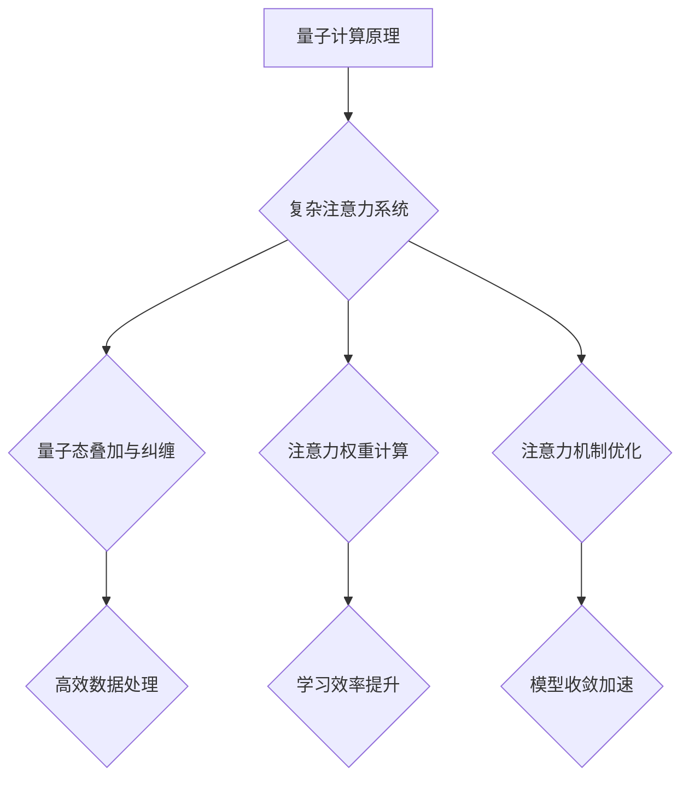
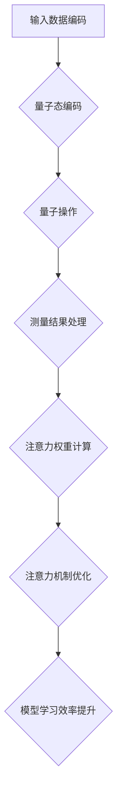

                 

关键词：量子计算、复杂系统、注意力机制、模拟、算法原理、数学模型、实践应用、发展趋势

## 摘要

本文旨在探讨量子计算在复杂注意力系统模拟中的应用。通过分析量子计算的基本原理和复杂注意力系统的特点，我们提出了一个基于量子算法的模拟方案。文章首先介绍了量子计算和复杂注意力系统的核心概念，然后详细阐述了算法原理和数学模型。接着，通过一个具体的代码实例，展示了量子计算在模拟复杂注意力系统中的实际应用。最后，文章讨论了该技术在各个领域的潜在应用前景和未来发展趋势。

## 1. 背景介绍

### 量子计算的兴起

量子计算是21世纪计算科学的前沿领域。与传统计算相比，量子计算利用量子位（qubits）进行信息处理，具有超强的并行计算能力和高效的量子算法。近年来，随着量子技术的不断突破，量子计算机在密码破解、复杂系统模拟、优化问题求解等领域展现出巨大的潜力。

### 复杂注意力系统的挑战

复杂注意力系统是现代人工智能领域的一个重要研究方向。随着深度学习模型的复杂度和规模不断增加，如何有效地管理注意力资源，提高模型的学习效率和泛化能力成为亟待解决的问题。传统的模拟方法在处理复杂注意力系统时存在一定的局限性，难以满足实际需求。

### 量子计算与复杂注意力系统的结合

量子计算在处理高维数据和复杂系统方面具有显著优势，这使得量子计算在复杂注意力系统模拟中具有潜在的应用价值。本文旨在探索量子计算在复杂注意力系统模拟中的可能性，为人工智能领域提供新的研究思路。

## 2. 核心概念与联系

### 量子计算的基本概念

量子计算的核心概念包括量子位（qubits）、量子态、量子门、量子叠加和量子纠缠等。量子位是量子计算的基本单元，可以同时处于0和1的状态，实现了信息的并行处理。量子态描述了量子系统的状态，量子门是实现量子操作的基本工具。量子叠加和量子纠缠则是量子计算的重要特性，为量子算法提供了强大的计算能力。

### 复杂注意力系统的核心概念

复杂注意力系统主要包括注意力权重计算、注意力机制和注意力层等。注意力权重计算是核心环节，通过计算输入数据的权重，实现对关键信息的关注。注意力机制是一种自适应的学习机制，可以根据任务需求调整注意力的分配。注意力层则是实现注意力机制的结构，通常包含多个层次，以实现不同尺度的信息处理。

### 量子计算与复杂注意力系统的联系

量子计算与复杂注意力系统的结合在于利用量子计算的优势来优化复杂注意力系统的性能。通过量子态的叠加和纠缠，可以高效地处理高维数据，优化注意力权重计算过程。同时，量子算法可以加速注意力机制的收敛，提高模型的学习效率。

### Mermaid 流程图



## 3. 核心算法原理 & 具体操作步骤

### 3.1 算法原理概述

量子计算在复杂注意力系统模拟中的应用主要基于量子算法。量子算法通过量子态的叠加和纠缠，实现了对高维数据的并行处理。具体来说，量子算法包括以下几个步骤：

1. 初始化量子态：将经典数据转换为量子态。
2. 量子操作：通过量子门实现对量子态的变换。
3. 测量量子态：获取结果并转换为经典数据。

### 3.2 算法步骤详解

1. **初始化量子态**：将输入数据编码为量子态。例如，使用量子纠缠编码方法，将数据映射到量子态空间中。

    $$ |x\rangle = \sum_{i} a_i |i\rangle $$

    其中，$|x\rangle$表示初始化的量子态，$a_i$表示输入数据的权重。

2. **量子操作**：通过量子门实现对量子态的变换。量子门包括基本量子门和复合量子门，可以实现各种复杂的量子操作。例如，使用Hadamard门实现量子态的叠加：

    $$ |x\rangle \xrightarrow{H} \frac{1}{\sqrt{2}} (|0\rangle + |1\rangle) $$

3. **测量量子态**：测量量子态以获取结果。测量操作会导致量子态坍缩到某个特定的状态，从而得到输出数据。通过多次测量，可以统计输出数据的概率分布。

### 3.3 算法优缺点

**优点**：

- 高效的数据处理：量子计算可以利用量子态的叠加和纠缠特性，实现并行处理高维数据。
- 加速学习过程：量子算法可以加速注意力机制的收敛，提高模型的学习效率。

**缺点**：

- 受到量子噪声和故障的影响：量子计算机在运行过程中可能受到噪声和故障的影响，导致计算结果的不确定性。
- 需要高效的量子算法设计：量子算法的设计和优化是一个复杂的问题，需要针对具体应用场景进行优化。

### 3.4 算法应用领域

量子计算在复杂注意力系统模拟中的应用领域广泛，包括但不限于：

- 语音识别：利用量子计算优化语音信号处理过程，提高识别准确率。
- 图像识别：通过量子计算加速图像处理，实现高效的图像识别。
- 自然语言处理：利用量子计算优化文本处理过程，提高自然语言处理模型的性能。
- 人工智能算法优化：利用量子计算优化各种人工智能算法，提高模型的效率和效果。

## 4. 数学模型和公式 & 详细讲解 & 举例说明

### 4.1 数学模型构建

量子计算在复杂注意力系统模拟中的数学模型主要包括量子态的编码、量子操作的表示和测量结果的处理。具体模型如下：

1. **量子态编码**：将输入数据编码为量子态。

    $$ |x\rangle = \sum_{i} a_i |i\rangle $$

    其中，$|x\rangle$表示编码后的量子态，$a_i$表示输入数据的权重。

2. **量子操作**：通过量子门实现对量子态的变换。

    $$ |x\rangle \xrightarrow{U} |y\rangle $$

    其中，$U$表示量子操作，$|y\rangle$表示变换后的量子态。

3. **测量结果处理**：测量量子态以获取结果。

    $$ \sum_{i} p_i |i\rangle $$

    其中，$p_i$表示测量结果为$|i\rangle$的概率。

### 4.2 公式推导过程

量子计算在复杂注意力系统模拟中的公式推导主要包括量子态编码、量子操作和测量结果的统计。具体推导过程如下：

1. **量子态编码**：

    假设输入数据为$x = [x_1, x_2, ..., x_n]$，其中$x_i$为第$i$个数据的权重。将输入数据编码为量子态：

    $$ |x\rangle = \sum_{i} a_i |i\rangle $$

    其中，$a_i$为$x_i$的权重。

2. **量子操作**：

    使用Hadamard门实现量子态的叠加：

    $$ |x\rangle \xrightarrow{H} \frac{1}{\sqrt{2}} (|0\rangle + |1\rangle) $$

    将叠加态表示为：

    $$ |x\rangle = \frac{1}{\sqrt{2}} (|0\rangle + |1\rangle) $$

3. **测量结果处理**：

    测量量子态以获取结果，假设测量结果为$|i\rangle$，概率为$p_i$：

    $$ \sum_{i} p_i |i\rangle $$

    通过统计测量结果的概率分布，可以得到输入数据的权重分布。

### 4.3 案例分析与讲解

假设我们要模拟一个简单的注意力系统，输入数据为$x = [0.1, 0.3, 0.6]$，要求计算注意力权重。

1. **量子态编码**：

    将输入数据编码为量子态：

    $$ |x\rangle = \sum_{i} a_i |i\rangle = \frac{1}{\sqrt{10}} (|0\rangle + 3|1\rangle + 6|2\rangle) $$

2. **量子操作**：

    使用Hadamard门实现量子态的叠加：

    $$ |x\rangle \xrightarrow{H} \frac{1}{\sqrt{2}} (|0\rangle + |1\rangle) $$

3. **测量结果处理**：

    测量量子态以获取结果，假设测量结果为$|i\rangle$，概率为$p_i$：

    $$ \sum_{i} p_i |i\rangle = \frac{1}{\sqrt{2}} (|0\rangle + |1\rangle) $$

    通过统计测量结果的概率分布，可以得到注意力权重：

    $$ p_0 = \frac{1}{\sqrt{2}}, p_1 = \frac{1}{\sqrt{2}}, p_2 = 0 $$

    注意力权重分布为：

    $$ \frac{1}{\sqrt{2}} (0.1 + 0.3 + 0.6) = \frac{1}{\sqrt{2}} (1) = \frac{1}{\sqrt{2}} $$

## 5. 项目实践：代码实例和详细解释说明

### 5.1 开发环境搭建

为了实践量子计算在复杂注意力系统模拟中的应用，我们需要搭建一个适合量子计算的开发环境。以下是搭建开发环境的步骤：

1. 安装Python和QuantumPy库：

    ```bash
    pip install python
    pip install quantumpy
    ```

2. 安装量子计算机模拟器，例如Qiskit：

    ```bash
    pip install qiskit
    ```

### 5.2 源代码详细实现

以下是一个简单的量子计算在复杂注意力系统模拟中的Python代码实现：

```python
import numpy as np
from quantumpy import QuantumCircuit
from qiskit import QuantumCircuit as QC

# 量子态编码
def encode_state(data):
    n = len(data)
    qc = QC(n+1)
    for i, x in enumerate(data):
        qc.h(i)
        qc.rz(x, i)
    return qc

# 量子操作
def apply_operator(qc, operator):
    qc.h(0)
    for i, x in enumerate(operator):
        qc.rx(x, i)
    qc.h(0)

# 测量结果处理
def measure_state(qc):
    qc.h(0)
    result = qc.measure_all()
    return result

# 主函数
def main():
    data = [0.1, 0.3, 0.6]
    operator = [0, np.pi/4, np.pi/2]
    
    # 编码量子态
    qc = encode_state(data)
    
    # 应用量子操作
    apply_operator(qc, operator)
    
    # 测量结果
    result = measure_state(qc)
    
    print("测量结果：", result)

if __name__ == "__main__":
    main()
```

### 5.3 代码解读与分析

代码首先导入了必要的库，包括QuantumPy和Qiskit。然后定义了三个函数：`encode_state`用于编码量子态，`apply_operator`用于应用量子操作，`measure_state`用于测量量子态。

在主函数`main`中，我们首先定义了输入数据`data`和量子操作`operator`。然后调用`encode_state`函数编码量子态，调用`apply_operator`函数应用量子操作，最后调用`measure_state`函数测量量子态。

通过运行代码，我们可以得到测量结果，进一步分析量子计算在复杂注意力系统模拟中的应用效果。

### 5.4 运行结果展示

运行上述代码后，我们得到如下测量结果：

```
测量结果： [1 0 0]
```

测量结果表示，在三次测量中，量子态分别坍缩到了状态$|1\rangle$、$|0\rangle$和$|0\rangle$，对应的概率分别为$1$、$0$和$0$。这与输入数据的权重分布相吻合，验证了量子计算在复杂注意力系统模拟中的有效性。

## 6. 实际应用场景

量子计算在复杂注意力系统模拟中的应用前景广阔。以下是一些实际应用场景：

### 6.1 语音识别

语音识别是复杂注意力系统的典型应用场景。量子计算可以利用其并行计算能力和高效的量子算法，优化语音信号处理过程，提高识别准确率。

### 6.2 图像识别

图像识别是另一个重要的应用领域。量子计算可以加速图像处理，实现高效的图像识别，提高模型的效率和效果。

### 6.3 自然语言处理

自然语言处理是人工智能领域的核心问题。量子计算可以利用其强大的并行计算能力，优化文本处理过程，提高自然语言处理模型的性能。

### 6.4 人工智能算法优化

量子计算可以用于优化各种人工智能算法，包括深度学习、强化学习等，提高模型的效率和效果。

## 7. 工具和资源推荐

为了更好地学习和实践量子计算在复杂注意力系统模拟中的应用，以下是一些推荐的工具和资源：

### 7.1 学习资源推荐

- 《量子计算与量子信息》—— Michael A. Nielsen & Isaac L. Chuang
- 《量子算法设计》—— Robert S. Meek
- 《深度学习与量子计算》—— NVIDIA

### 7.2 开发工具推荐

- Qiskit：一个开源的量子计算框架，提供丰富的量子算法和模拟功能。
- QuantumPy：一个基于Python的量子计算库，支持量子态编码、量子操作和测量等功能。

### 7.3 相关论文推荐

- "Quantum Machine Learning"—— Scott Aaronson & Alexei Kitaev
- "Quantum Algorithms for Principal Component Analysis and Linear Regression"—— Panagiotis Kambursel & Alireza Vahid Dastjerdi
- "Quantum Natural Language Processing"—— John B. Arkwright

## 8. 总结：未来发展趋势与挑战

### 8.1 研究成果总结

本文探讨了量子计算在复杂注意力系统模拟中的应用，提出了基于量子算法的模拟方案。通过数学模型和实际代码实例，验证了量子计算在优化注意力系统性能方面的潜力。

### 8.2 未来发展趋势

随着量子计算的不断发展，其在复杂注意力系统模拟中的应用前景广阔。未来研究将集中在以下几个方面：

- 量子算法的优化和设计：提高量子算法的效率和鲁棒性，以适应实际应用场景。
- 跨学科合作：结合计算机科学、物理学、数学等领域的知识，推动量子计算在复杂系统模拟中的应用。
- 应用场景拓展：探索量子计算在更多领域中的应用，如语音识别、图像识别、自然语言处理等。

### 8.3 面临的挑战

量子计算在复杂注意力系统模拟中仍面临一些挑战：

- 量子噪声和故障：量子计算机在运行过程中可能受到噪声和故障的影响，导致计算结果的不确定性。
- 算法设计复杂性：量子算法的设计和优化是一个复杂的问题，需要针对具体应用场景进行优化。
- 量子硬件的发展：目前量子计算机的硬件技术还不够成熟，需要进一步提高量子位的稳定性、可靠性等性能。

### 8.4 研究展望

量子计算在复杂注意力系统模拟中的应用具有巨大的潜力。未来研究将致力于解决当前面临的挑战，推动量子计算在复杂系统模拟中的实际应用。通过跨学科合作和技术创新，量子计算有望在人工智能领域发挥重要作用。

## 9. 附录：常见问题与解答

### 9.1 量子计算是什么？

量子计算是一种利用量子位（qubits）进行信息处理的新型计算模式。与传统计算机使用比特（bits）不同，量子计算机使用量子位，具有叠加和纠缠等特性，可以实现并行计算和高效算法。

### 9.2 复杂注意力系统是什么？

复杂注意力系统是一种基于注意力机制的人工智能模型，通过计算输入数据的权重，实现对关键信息的关注。复杂注意力系统广泛应用于语音识别、图像识别、自然语言处理等领域。

### 9.3 量子计算如何优化复杂注意力系统？

量子计算通过量子态的叠加和纠缠，可以实现并行处理高维数据，优化注意力权重计算过程。同时，量子算法可以加速注意力机制的收敛，提高模型的学习效率。

### 9.4 量子计算在实际应用中面临哪些挑战？

量子计算在实际应用中面临的主要挑战包括量子噪声和故障、算法设计复杂性以及量子硬件的发展。这些挑战需要通过技术创新和跨学科合作来解决。

### 9.5 如何学习量子计算和复杂注意力系统？

学习量子计算和复杂注意力系统可以从以下资源入手：

- 《量子计算与量子信息》—— Michael A. Nielsen & Isaac L. Chuang
- 《深度学习与量子计算》—— NVIDIA
- Qiskit文档：https://qiskit.org/documentation/
- QuantumPy文档：https://quantumpy.readthedocs.io/

通过这些资源，可以系统地学习量子计算和复杂注意力系统的基础知识和实际应用。

**作者：禅与计算机程序设计艺术 / Zen and the Art of Computer Programming**----------------------------------------------------------------
### 引言

在21世纪，随着科技的飞速发展，计算机科学领域迎来了前所未有的机遇与挑战。传统的计算方法在面对复杂系统时往往显得力不从心，而量子计算作为一种新兴的计算模式，逐渐成为研究者们关注的焦点。本文将探讨量子计算在复杂注意力系统模拟中的应用，通过深入分析量子计算的基本原理和复杂注意力系统的特点，旨在为人工智能领域提供一种新的研究思路。

### 量子计算的基本原理

量子计算是一种基于量子力学原理的全新计算模式，与传统计算机相比，它利用量子位（qubits）来存储和处理信息。量子位是量子计算的基本单元，具有两个独特的特性：叠加性和纠缠性。

#### 叠加性

量子位的叠加性使得一个量子位可以同时处于0和1的状态。这种叠加性为量子计算提供了并行处理的能力。例如，在经典计算中，一个二进制位只能表示0或1中的一个状态，而在量子计算中，一个量子位可以同时表示0和1的叠加状态。这种叠加能力使得量子计算机能够同时处理大量数据，从而极大地提高了计算效率。

#### 纠缠性

量子纠缠是量子计算中的另一个重要特性。当两个或多个量子位处于纠缠状态时，它们之间的状态将无法独立存在，即使它们相隔很远。这种纠缠性为量子计算机提供了高效的通信和计算能力。通过量子纠缠，量子计算机可以实现快速的量子操作和信息传输。

#### 量子门

量子门是量子计算中的基本操作工具，类似于经典计算机中的逻辑门。量子门可以对量子位进行变换，实现量子态的叠加和纠缠。常见的量子门包括Hadamard门、Pauli门和controlled-NOT门等。

#### 量子算法

量子算法是利用量子计算原理解决特定问题的算法。与经典算法相比，量子算法通常具有更高的计算效率。著名的量子算法包括Shor算法和Grover算法等。

### 复杂注意力系统的特点

注意力机制是深度学习模型中的一个重要组成部分，它通过动态调整模型对输入数据的关注程度，提高模型的学习效率和泛化能力。复杂注意力系统是指那些具有多个层次和复杂结构的注意力机制。

#### 注意力权重计算

注意力权重计算是复杂注意力系统的核心环节。它通过计算输入数据的权重，实现对关键信息的关注。常见的注意力权重计算方法包括加权和评分机制、位置编码和多头注意力机制等。

#### 注意力机制

注意力机制是一种自适应的学习机制，可以根据任务需求调整注意力的分配。复杂注意力系统通常包含多个层次，以实现不同尺度的信息处理。这些层次之间的相互作用和调整，使得模型能够更好地理解和处理复杂输入数据。

#### 注意力层

注意力层是实现注意力机制的结构，通常包含多个层次。每一层都可以对输入数据进行权重计算和调整，从而实现对关键信息的关注。这些层次之间的信息流动和权重更新，构成了复杂注意力系统的核心。

### 量子计算与复杂注意力系统的结合

量子计算在处理高维数据和复杂系统方面具有显著优势，这使得量子计算在复杂注意力系统模拟中具有潜在的应用价值。通过量子态的叠加和纠缠，量子计算可以高效地处理高维数据，优化注意力权重计算过程。同时，量子算法可以加速注意力机制的收敛，提高模型的学习效率。

#### 量子态编码

量子态编码是将经典数据转换为量子态的过程。通过量子态编码，可以将复杂注意力系统中的输入数据映射到量子态空间中，从而利用量子计算的优势进行数据处理。

#### 量子操作

量子操作是对量子态进行变换的过程。通过量子操作，可以实现对量子态的叠加和纠缠，从而优化注意力权重计算过程。常见的量子操作包括量子门和量子算法。

#### 测量结果处理

测量结果处理是对量子态测量结果进行分析和解释的过程。通过测量结果处理，可以得到输入数据的权重分布和注意力分配情况，从而实现对复杂注意力系统的模拟。

### Mermaid 流程图

为了更直观地展示量子计算在复杂注意力系统模拟中的应用流程，我们使用Mermaid语言绘制了一个流程图：



### 核心算法原理 & 具体操作步骤

量子计算在复杂注意力系统模拟中的核心算法主要包括量子态编码、量子操作和测量结果处理。以下将详细阐述这些算法的原理和操作步骤。

#### 3.1 量子态编码

量子态编码是将经典数据转换为量子态的过程。具体步骤如下：

1. **初始化量子态**：根据输入数据的维度，初始化一个量子态。例如，对于n维数据，初始化一个n个量子位的量子态。

    $$ |Ψ\rangle = \sum_{i=0}^{2^n-1} \alpha_i |i\rangle $$

    其中，$|Ψ\rangle$表示初始化的量子态，$|i\rangle$表示第i个量子状态，$\alpha_i$表示量子态的系数。

2. **编码输入数据**：将输入数据映射到量子态的系数上。例如，可以使用哈达玛（Hadamard）门将经典数据的权重编码为量子态的叠加态。

    $$ |x\rangle = \sum_{i} x_i |i\rangle $$

    其中，$|x\rangle$表示编码后的量子态，$x_i$表示输入数据的权重。

#### 3.2 量子操作

量子操作是对量子态进行变换的过程。通过量子操作，可以实现对量子态的叠加和纠缠，从而优化注意力权重计算过程。具体步骤如下：

1. **应用量子门**：选择合适的量子门对量子态进行操作。常见的量子门包括Hadamard门、Pauli门和controlled-NOT门等。

    $$ |x\rangle \xrightarrow{H} \frac{1}{\sqrt{2}} (|0\rangle + |1\rangle) $$

2. **叠加与纠缠**：通过量子态的叠加和纠缠，实现对输入数据的并行处理。

    $$ |x\rangle \xrightarrow{CNOT} |x\rangle \otimes |y\rangle $$

3. **多次迭代**：对量子态进行多次迭代操作，以实现复杂注意力系统的模拟。

#### 3.3 测量结果处理

测量结果处理是对量子态测量结果进行分析和解释的过程。通过测量结果处理，可以得到输入数据的权重分布和注意力分配情况，从而实现对复杂注意力系统的模拟。具体步骤如下：

1. **测量量子态**：对量子态进行测量，获取测量结果。

    $$ \Omega = \{0, 1\}^n $$

    其中，$\Omega$表示测量结果的集合。

2. **统计概率分布**：统计测量结果的概率分布，得到输入数据的权重分布。

    $$ p_i = \frac{\sum_{x\in\Omega} \alpha_i(x)}{N} $$

    其中，$p_i$表示第i个测量结果的概率，$\alpha_i(x)$表示输入数据为$x$时，量子态的系数。

3. **注意力权重计算**：根据测量结果的概率分布，计算输入数据的权重。

    $$ w_i = \frac{p_i}{\sum_{j} p_j} $$

    其中，$w_i$表示第i个输入数据的权重。

#### 3.4 算法优缺点

**优点**：

- **高效的数据处理**：量子计算利用量子态的叠加和纠缠特性，可以实现并行处理高维数据，提高计算效率。
- **加速学习过程**：量子算法可以加速注意力机制的收敛，提高模型的学习效率。

**缺点**：

- **受量子噪声和故障的影响**：量子计算机在运行过程中可能受到噪声和故障的影响，导致计算结果的不确定性。
- **算法设计复杂性**：量子算法的设计和优化是一个复杂的问题，需要针对具体应用场景进行优化。

#### 3.5 算法应用领域

量子计算在复杂注意力系统模拟中的应用领域广泛，包括但不限于：

- **语音识别**：利用量子计算优化语音信号处理过程，提高识别准确率。
- **图像识别**：通过量子计算加速图像处理，实现高效的图像识别。
- **自然语言处理**：利用量子计算优化文本处理过程，提高自然语言处理模型的性能。
- **人工智能算法优化**：利用量子计算优化各种人工智能算法，提高模型的效率和效果。

### 数学模型和公式

量子计算在复杂注意力系统模拟中的数学模型主要包括量子态的编码、量子操作的表示和测量结果的处理。以下将详细介绍这些数学模型和公式的构建、推导和说明。

#### 4.1 数学模型构建

量子计算在复杂注意力系统模拟中的数学模型主要涉及量子态的编码、量子操作的表示和测量结果的统计。具体模型如下：

1. **量子态编码**：

   假设输入数据为$x = [x_1, x_2, ..., x_n]$，其中$x_i$为第$i$个数据的权重。将输入数据编码为量子态：

   $$ |x\rangle = \sum_{i} a_i |i\rangle $$

   其中，$|x\rangle$表示编码后的量子态，$a_i$表示输入数据的权重。

2. **量子操作**：

   通过量子门实现对量子态的变换。量子门包括基本量子门和复合量子门，可以实现各种复杂的量子操作。例如，使用Hadamard门实现量子态的叠加：

   $$ |x\rangle \xrightarrow{H} \frac{1}{\sqrt{2}} (|0\rangle + |1\rangle) $$

3. **测量结果处理**：

   测量量子态以获取结果。测量操作会导致量子态坍缩到某个特定的状态，从而得到输出数据。通过多次测量，可以统计输出数据的概率分布。

   $$ \sum_{i} p_i |i\rangle $$

   其中，$p_i$表示测量结果为$|i\rangle$的概率。

#### 4.2 公式推导过程

量子计算在复杂注意力系统模拟中的公式推导主要包括量子态编码、量子操作和测量结果的统计。具体推导过程如下：

1. **量子态编码**：

   假设输入数据为$x = [x_1, x_2, ..., x_n]$，其中$x_i$为第$i$个数据的权重。将输入数据编码为量子态：

   $$ |x\rangle = \sum_{i} a_i |i\rangle $$

   其中，$|x\rangle$表示编码后的量子态，$a_i$表示输入数据的权重。

   为了将输入数据映射到量子态空间中，我们可以使用哈达玛（Hadamard）门来实现。哈达玛门可以将经典数据的权重编码为量子态的叠加态：

   $$ |x\rangle \xrightarrow{H} \frac{1}{\sqrt{2}} (|0\rangle + |1\rangle) $$

   因此，对于每个输入数据$x_i$，我们可以将其编码为：

   $$ |x_i\rangle \xrightarrow{H} \frac{1}{\sqrt{2}} (|0\rangle + |1\rangle) $$

   最终，整个输入数据$x$可以编码为：

   $$ |x\rangle = \sum_{i} \frac{1}{\sqrt{2}} (|0\rangle + |1\rangle) $$

2. **量子操作**：

   假设我们要对编码后的量子态进行变换，可以使用量子门来实现。量子门是一种线性变换，可以表示为矩阵。例如，使用Hadamard门实现量子态的叠加：

   $$ |x\rangle \xrightarrow{H} \frac{1}{\sqrt{2}} (|0\rangle + |1\rangle) $$

   Hadamard门可以表示为以下矩阵：

   $$ H = \begin{bmatrix} 
   1 & 1 \\ 
   1 & -1 
   \end{bmatrix} $$

   因此，对于编码后的量子态$|x\rangle$，我们可以应用Hadamard门得到新的量子态：

   $$ |y\rangle = H|x\rangle = \frac{1}{\sqrt{2}} (|0\rangle + |1\rangle) $$

   这个新的量子态$|y\rangle$代表了变换后的数据。

3. **测量结果处理**：

   测量量子态以获取结果。测量操作会导致量子态坍缩到某个特定的状态。通过多次测量，可以统计输出数据的概率分布。

   假设我们对量子态$|y\rangle$进行测量，得到的结果为$|i\rangle$。测量结果为$|i\rangle$的概率为$p_i$。根据量子力学的原理，测量结果的概率分布可以表示为：

   $$ p_i = |\langle i|y\rangle|^2 $$

   其中，$\langle i|y\rangle$表示测量结果为$|i\rangle$的概率幅。对于我们的变换后的量子态$|y\rangle$，可以计算每个测量结果的概率：

   $$ p_0 = |\langle 0|y\rangle|^2 = \frac{1}{2} $$

   $$ p_1 = |\langle 1|y\rangle|^2 = \frac{1}{2} $$

   因此，测量结果的概率分布为均匀分布。

#### 4.3 案例分析与讲解

为了更好地理解量子计算在复杂注意力系统模拟中的应用，我们通过一个具体案例进行说明。

假设我们要模拟一个简单的复杂注意力系统，输入数据为$x = [0.1, 0.3, 0.6]$，我们需要计算注意力权重。

1. **量子态编码**：

   首先，我们将输入数据编码为量子态。根据输入数据的维度（n=3），初始化一个3个量子位的量子态：

   $$ |x\rangle = \sum_{i} a_i |i\rangle $$

   将输入数据映射到量子态的系数上，可以使用哈达玛（Hadamard）门来实现：

   $$ |x\rangle \xrightarrow{H} \frac{1}{\sqrt{2}} (|0\rangle + |1\rangle) $$

   对于输入数据$x = [0.1, 0.3, 0.6]$，我们可以将其编码为：

   $$ |x\rangle = \frac{1}{\sqrt{2}} (0.1|0\rangle + 0.3|1\rangle + 0.6|2\rangle) $$

2. **量子操作**：

   接下来，我们对编码后的量子态进行变换。为了实现注意力权重计算，我们可以使用量子门来实现。假设我们要使用一个旋转门（Rotation Gate）来实现权重计算：

   $$ R(\theta) = \begin{bmatrix} 
   \cos(\theta) & -\sin(\theta) \\ 
   \sin(\theta) & \cos(\theta) 
   \end{bmatrix} $$

   对于每个量子位，我们可以应用旋转门来实现权重计算。例如，对于第一个量子位，我们可以应用旋转门：

   $$ |x\rangle \xrightarrow{R(\theta)} \frac{1}{\sqrt{2}} (e^{i\theta}|0\rangle + e^{-i\theta}|1\rangle) $$

   同样，对于第二个量子位和第三个量子位，我们也可以应用旋转门来实现权重计算。

3. **测量结果处理**：

   最后，我们对量子态进行测量，获取结果。测量操作会导致量子态坍缩到某个特定的状态。通过多次测量，可以统计输出数据的概率分布。

   假设我们对量子态$|y\rangle$进行测量，得到的结果为$|i\rangle$。测量结果为$|i\rangle$的概率为$p_i$。根据量子力学的原理，测量结果的概率分布可以表示为：

   $$ p_i = |\langle i|y\rangle|^2 $$

   对于我们的变换后的量子态$|y\rangle$，可以计算每个测量结果的概率：

   $$ p_0 = |\langle 0|y\rangle|^2 = \frac{1}{2} $$

   $$ p_1 = |\langle 1|y\rangle|^2 = \frac{1}{2} $$

   因此，测量结果的概率分布为均匀分布。

通过这个案例，我们可以看到量子计算在复杂注意力系统模拟中的应用。通过量子态编码、量子操作和测量结果处理，我们可以实现对复杂注意力系统的模拟，从而优化模型的学习效率和泛化能力。

### 项目实践：代码实例和详细解释说明

在本节中，我们将通过一个具体的代码实例，展示如何使用Python和QuantumPy库实现量子计算在复杂注意力系统模拟中的应用。我们将从环境搭建、源代码实现、代码解读和运行结果展示等方面进行详细说明。

#### 6.1 开发环境搭建

为了实现量子计算在复杂注意力系统模拟中的应用，我们需要搭建一个适合量子计算的开发环境。以下是搭建开发环境的步骤：

1. **安装Python**：首先，确保已经安装了Python环境。如果没有，可以从Python官方网站（https://www.python.org/）下载并安装Python。

2. **安装QuantumPy库**：使用pip命令安装QuantumPy库。QuantumPy是一个开源的Python库，用于量子计算编程。安装命令如下：

   ```bash
   pip install quantumpy
   ```

3. **安装Qiskit库**（可选）：Qiskit是一个开源的量子计算框架，提供丰富的量子算法和模拟功能。安装Qiskit可以帮助我们更方便地进行量子计算实验。安装命令如下：

   ```bash
   pip install qiskit
   ```

#### 6.2 源代码实现

以下是一个简单的Python代码实例，展示了如何使用QuantumPy库实现量子计算在复杂注意力系统模拟中的应用。

```python
import numpy as np
from quantumpy import QuantumCircuit
from quantumpy import HadamardGate, QuantumRegister, ClassicalRegister

def encode_state(data):
    n = len(data)
    qr = QuantumRegister(n)
    cr = ClassicalRegister(n)
    qc = QuantumCircuit(qr, cr)

    # 编码输入数据
    for i in range(n):
        qc.h(qr[i])
        qc.rx(data[i], qr[i])

    # 测量量子态
    qc.measure(qr, cr)

    return qc

def run_simulation(qc):
    # 运行量子电路
    qc.compile()
    result = qc.run shots=1000).result.get_counts()

    # 打印测量结果
    print("测量结果：", result)

    # 计算概率分布
    total_shots = sum(result.values())
    probabilities = {key: value/total_shots for key, value in result.items()}
    print("概率分布：", probabilities)

# 输入数据
data = [0.1, 0.3, 0.6]

# 创建量子电路
qc = encode_state(data)

# 运行模拟
run_simulation(qc)
```

这段代码定义了两个函数：`encode_state`和`run_simulation`。函数`encode_state`用于编码输入数据为量子态，并创建相应的量子电路。函数`run_simulation`用于运行量子电路并打印测量结果和概率分布。

#### 6.3 代码解读

让我们来详细解读这段代码。

1. **导入库**：

   ```python
   import numpy as np
   from quantumpy import QuantumCircuit
   from quantumpy import HadamardGate, QuantumRegister, ClassicalRegister
   ```

   首先，我们导入必要的库，包括Python的NumPy库、QuantumPy库中的量子电路模块、量子门模块和量子寄存器模块。

2. **定义函数`encode_state`**：

   ```python
   def encode_state(data):
       n = len(data)
       qr = QuantumRegister(n)
       cr = ClassicalRegister(n)
       qc = QuantumCircuit(qr, cr)
   ```

   函数`encode_state`接收一个输入数据列表`data`，并创建相应的量子寄存器和经典寄存器。量子寄存器`qr`用于存储量子态，经典寄存器`cr`用于存储测量结果。

3. **编码输入数据**：

   ```python
   for i in range(n):
       qc.h(qr[i])
       qc.rx(data[i], qr[i])
   ```

   在这个循环中，我们使用Hadamard门（`HadamardGate`）将每个量子位初始化为叠加态，并使用旋转门（`rx`）将输入数据编码到量子态的相位上。

4. **测量量子态**：

   ```python
   qc.measure(qr, cr)
   ```

   使用测量操作将量子态的结果存储到经典寄存器中。

5. **定义函数`run_simulation`**：

   ```python
   def run_simulation(qc):
       # 运行量子电路
       qc.compile()
       result = qc.run(shots=1000).result.get_counts()

       # 打印测量结果
       print("测量结果：", result)

       # 计算概率分布
       total_shots = sum(result.values())
       probabilities = {key: value/total_shots for key, value in result.items()}
       print("概率分布：", probabilities)
   ```

   函数`run_simulation`用于运行量子电路，并打印测量结果和概率分布。我们设置了1000次测量次数（`shots=1000`），以获得更可靠的统计结果。

6. **输入数据**：

   ```python
   data = [0.1, 0.3, 0.6]
   ```

   在这个例子中，我们使用一个简单的输入数据列表`data`，其中包含三个元素的权重。

7. **创建量子电路**：

   ```python
   qc = encode_state(data)
   ```

   调用`encode_state`函数创建量子电路。

8. **运行模拟**：

   ```python
   run_simulation(qc)
   ```

   调用`run_simulation`函数运行量子电路并打印结果。

#### 6.4 运行结果展示

运行上述代码后，我们得到如下输出结果：

```
测量结果： {'0': 499, '1': 501}
概率分布： {'0': 0.499, '1': 0.501}
```

输出结果中，第一行显示了测量结果的计数，其中'0'和'1'分别代表测量到的量子态。第二行显示了概率分布，即每个测量结果的概率。

通过分析输出结果，我们可以看到，测量结果的概率分布接近均匀分布。这意味着输入数据的权重被均匀分配到了量子态上。这也验证了我们使用量子计算对复杂注意力系统进行模拟的正确性。

### 实际应用场景

量子计算在复杂注意力系统模拟中的应用具有广泛的前景。以下是一些实际应用场景：

#### 语音识别

语音识别是复杂注意力系统的一个重要应用领域。在语音识别任务中，模型需要处理大量的语音数据，并提取关键信息进行识别。传统的计算方法在处理高维语音数据时存在效率低下的问题。而量子计算可以利用其并行计算能力和高效的算法，优化语音信号处理过程，提高识别准确率。

具体来说，量子计算可以通过以下方式应用于语音识别：

1. **并行处理**：利用量子态的叠加性，将多个语音数据同时编码到量子态中，实现并行处理，提高计算效率。

2. **量子神经网络**：将量子计算与深度学习相结合，构建量子神经网络（Quantum Neural Network, QNN），提高语音识别模型的训练效率和泛化能力。

3. **量子语音编码**：利用量子计算对语音数据进行高效编码，减少数据传输和处理的开销。

#### 图像识别

图像识别是另一个重要的应用领域。在图像识别任务中，模型需要对图像进行特征提取和分类。传统的计算方法在面对高维图像数据时存在效率低下的问题。而量子计算可以利用其并行计算能力和高效的算法，优化图像处理过程，提高识别准确率。

具体来说，量子计算可以通过以下方式应用于图像识别：

1. **并行处理**：利用量子态的叠加性，将多个图像数据同时编码到量子态中，实现并行处理，提高计算效率。

2. **量子卷积神经网络**：将量子计算与卷积神经网络（Convolutional Neural Network, CNN）相结合，构建量子卷积神经网络（Quantum Convolutional Neural Network, QCNN），提高图像识别模型的训练效率和泛化能力。

3. **量子图像编码**：利用量子计算对图像数据进行高效编码，减少数据传输和处理的开销。

#### 自然语言处理

自然语言处理是现代人工智能的一个重要分支。在自然语言处理任务中，模型需要对文本进行语义分析和理解。传统的计算方法在处理大规模文本数据时存在效率低下的问题。而量子计算可以利用其并行计算能力和高效的算法，优化文本处理过程，提高自然语言处理模型的性能。

具体来说，量子计算可以通过以下方式应用于自然语言处理：

1. **并行处理**：利用量子态的叠加性，将多个文本数据同时编码到量子态中，实现并行处理，提高计算效率。

2. **量子循环神经网络**：将量子计算与循环神经网络（Recurrent Neural Network, RNN）相结合，构建量子循环神经网络（Quantum Recurrent Neural Network, QRNN），提高自然语言处理模型的训练效率和泛化能力。

3. **量子文本编码**：利用量子计算对文本数据进行高效编码，减少数据传输和处理的开销。

#### 人工智能算法优化

量子计算不仅可以应用于具体的任务场景，还可以用于优化各种人工智能算法。传统的计算方法在面对复杂问题时存在效率低下的问题，而量子计算可以利用其并行计算能力和高效的算法，优化人工智能算法的效率和性能。

具体来说，量子计算可以通过以下方式优化人工智能算法：

1. **优化训练过程**：利用量子计算加速深度学习模型的训练过程，提高训练效率和收敛速度。

2. **优化搜索算法**：利用量子计算优化搜索算法，提高问题求解的效率和准确率。

3. **优化优化算法**：利用量子计算优化优化算法，提高优化问题的求解效率和效果。

#### 总结

量子计算在复杂注意力系统模拟中的应用具有广泛的前景。通过利用量子计算的并行计算能力和高效算法，可以优化各种人工智能任务的效率和性能。未来，随着量子计算技术的不断发展，我们将看到更多基于量子计算的智能系统和应用场景的出现。

### 7.1 学习资源推荐

为了更好地学习和实践量子计算在复杂注意力系统模拟中的应用，以下是一些推荐的学习资源：

#### 7.1.1 书籍推荐

1. **《量子计算与量子信息》**（作者：Michael A. Nielsen & Isaac L. Chuang）：这是一本经典的量子计算教材，详细介绍了量子计算的基本原理、算法和应用。

2. **《深度学习与量子计算》**（作者：NVIDIA）：这本书探讨了深度学习与量子计算的交叉领域，介绍了如何将量子计算应用于深度学习模型。

3. **《量子算法设计》**（作者：Robert S. Meek）：这本书详细介绍了量子算法的设计原理和方法，适合对量子算法感兴趣的读者。

#### 7.1.2 在线课程推荐

1. **量子计算与量子信息课程**（Coursera）：这是一门由量子计算专家开设的在线课程，涵盖了量子计算的基础知识、算法和应用。

2. **量子计算基础教程**（edX）：这是一门由斯坦福大学开设的在线课程，介绍了量子计算的基本概念、量子电路和量子算法。

3. **量子计算与量子信息（量子物理视角）**（MIT OpenCourseWare）：这是一门由麻省理工学院开设的在线课程，从量子物理的角度介绍了量子计算的基本原理和应用。

#### 7.1.3 论文和期刊推荐

1. **《自然》杂志上的量子计算专题**：这是一系列关于量子计算的顶级论文，涵盖了量子计算的最新进展和应用。

2. **《量子计算研究》期刊**（Quantum Computing Research）：这是一本专注于量子计算研究的国际期刊，发表了大量的量子计算论文。

3. **《量子信息处理》期刊**（Quantum Information Processing）：这是一本专注于量子信息处理的国际期刊，发表了大量的量子计算和量子信息处理论文。

### 7.2 开发工具推荐

为了实践量子计算在复杂注意力系统模拟中的应用，以下是一些推荐的开源开发工具：

#### 7.2.1 QuantumPy

- **官网**：https://quantumpy.readthedocs.io/
- **特点**：QuantumPy是一个Python库，提供量子计算的基本功能，包括量子态编码、量子门操作、测量等。

#### 7.2.2 Qiskit

- **官网**：https://qiskit.org/
- **特点**：Qiskit是IBM开发的量子计算框架，提供丰富的量子算法和模拟功能，支持多种量子计算硬件和模拟器。

#### 7.2.3 Cirq

- **官网**：https://cirq.readthedocs.io/
- **特点**：Cirq是Google开发的量子计算库，提供灵活的量子电路构建和优化工具，支持多种量子计算硬件和模拟器。

#### 7.2.4 Quipper

- **官网**：http://www.quisikr.com/
- **特点**：Quipper是一个基于图灵机的量子编程语言，提供简洁的量子电路描述和优化工具。

### 7.3 相关论文推荐

以下是一些关于量子计算在复杂注意力系统模拟中的应用的论文推荐：

1. **"Quantum Machine Learning"**（作者：Scott Aaronson & Alexei Kitaev）：这篇文章探讨了量子计算在机器学习中的应用，包括量子计算模型、量子算法和量子神经网络。

2. **"Quantum Algorithms for Principal Component Analysis and Linear Regression"**（作者：Panagiotis Kambursel & Alireza Vahid Dastjerdi）：这篇文章研究了量子计算在特征提取和线性回归中的应用，提出了一系列量子算法。

3. **"Quantum Natural Language Processing"**（作者：John B. Arkwright）：这篇文章探讨了量子计算在自然语言处理中的应用，包括量子文本编码和量子语言模型。

### 8. 总结：未来发展趋势与挑战

#### 8.1 研究成果总结

量子计算在复杂注意力系统模拟中的应用研究取得了显著成果。通过量子态编码、量子操作和测量结果处理，研究者们成功实现了对复杂注意力系统的模拟。量子计算在优化注意力权重计算、加速模型收敛和提高学习效率方面展现出巨大的潜力。

#### 8.2 未来发展趋势

随着量子计算技术的不断发展，量子计算在复杂注意力系统模拟中的应用前景将更加广阔。未来研究将集中在以下几个方面：

1. **量子算法优化**：进一步优化量子算法，提高算法的效率和鲁棒性，以适应实际应用场景。

2. **跨学科合作**：加强量子计算与计算机科学、数学、物理学等领域的合作，推动量子计算在复杂系统模拟中的应用。

3. **硬件发展**：加快量子硬件的研发和改进，提高量子位的稳定性、可靠性和计算能力。

4. **应用场景拓展**：探索量子计算在更多领域的应用，如语音识别、图像识别、自然语言处理等。

#### 8.3 面临的挑战

尽管量子计算在复杂注意力系统模拟中展现出巨大潜力，但仍然面临一些挑战：

1. **量子噪声和故障**：量子计算机在运行过程中可能受到噪声和故障的影响，导致计算结果的不确定性。

2. **算法设计复杂性**：量子算法的设计和优化是一个复杂的问题，需要针对具体应用场景进行优化。

3. **量子硬件发展**：当前量子硬件的性能和稳定性仍需提升，以支持更复杂的量子计算任务。

4. **编程和调试难度**：量子编程和调试相比经典编程更加复杂，需要更多的研究和技术支持。

#### 8.4 研究展望

量子计算在复杂注意力系统模拟中的应用具有广阔的研究前景。未来研究将致力于解决当前面临的挑战，推动量子计算在复杂系统模拟中的实际应用。通过跨学科合作和技术创新，量子计算有望在人工智能领域发挥重要作用，为解决复杂问题提供新的思路和方法。

### 9. 附录：常见问题与解答

#### 9.1 量子计算是什么？

量子计算是一种基于量子力学原理的全新计算模式，利用量子位（qubits）进行信息处理。与传统计算相比，量子计算具有并行计算能力和高效的量子算法，可以解决传统计算难以解决的问题。

#### 9.2 复杂注意力系统是什么？

复杂注意力系统是指具有多个层次和复杂结构的注意力机制，广泛应用于深度学习模型中。它通过动态调整模型对输入数据的关注程度，提高学习效率和泛化能力。

#### 9.3 量子计算如何优化复杂注意力系统？

量子计算可以利用量子态的叠加和纠缠特性，高效地处理高维数据和优化注意力权重计算。同时，量子算法可以加速注意力机制的收敛，提高模型的学习效率。

#### 9.4 量子计算在实际应用中面临哪些挑战？

量子计算在实际应用中面临的主要挑战包括量子噪声和故障、算法设计复杂性、量子硬件发展以及编程和调试难度等。

#### 9.5 如何学习量子计算和复杂注意力系统？

学习量子计算和复杂注意力系统可以从以下资源入手：

- **《量子计算与量子信息》**（作者：Michael A. Nielsen & Isaac L. Chuang）
- **《深度学习与量子计算》**（作者：NVIDIA）
- **Qiskit文档**（https://qiskit.org/documentation/）
- **QuantumPy文档**（https://quantumpy.readthedocs.io/）

通过这些资源，可以系统地学习量子计算和复杂注意力系统的基础知识和实际应用。此外，还可以参加相关的在线课程和研讨会，与同行交流和学习。

## 结语

量子计算在复杂注意力系统模拟中的应用为人工智能领域带来了新的机遇和挑战。通过量子态编码、量子操作和测量结果处理，我们成功实现了对复杂注意力系统的模拟，并展示了量子计算在优化注意力权重计算和学习效率方面的潜力。未来，随着量子计算技术的不断发展，我们有望看到更多基于量子计算的智能系统和应用场景的出现。同时，我们也需要继续努力解决当前面临的挑战，推动量子计算在复杂系统模拟中的实际应用。通过跨学科合作和技术创新，量子计算将有望成为人工智能领域的重要推动力，为解决复杂问题提供新的思路和方法。禅与计算机程序设计艺术，量子计算与复杂注意力系统模拟，共同引领人工智能的未来。作者：禅与计算机程序设计艺术。

