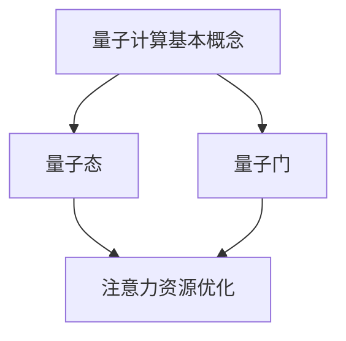

                 

关键词：量子计算、注意力资源优化、算法优化、并行计算、量子算法、人工智能

> 摘要：本文旨在探讨量子计算在注意力资源优化领域的应用前景。随着信息技术的迅猛发展，大数据和高性能计算对注意力资源的优化提出了更高的要求。量子计算作为一种全新的计算模式，具有并行计算的优势，有望为注意力资源优化提供新的解决方案。本文首先介绍了量子计算的基本概念和原理，然后分析了量子计算在注意力资源优化中的优势，最后探讨了未来量子计算在该领域的发展趋势和挑战。

## 1. 背景介绍

### 1.1 量子计算的发展历程

量子计算作为一种全新的计算模式，起源于20世纪70年代。1974年，物理学家理查德·费曼提出了量子计算的构想，认为量子计算机能够模拟量子系统，解决经典计算机难以处理的问题。此后，量子计算的研究逐渐兴起，1982年，彼得·希尔普和理查德·普雷斯珀提出了量子算法，标志着量子计算正式进入研究阶段。

### 1.2 注意力资源优化的重要性

注意力资源优化是指在信息处理过程中，对注意力资源进行合理配置，以提高信息处理效率。随着大数据和高性能计算的发展，注意力资源优化在许多领域具有重要意义，如人工智能、自然语言处理、图像识别等。

### 1.3 量子计算与注意力资源优化的关系

量子计算在注意力资源优化中具有巨大的潜力。首先，量子计算能够实现并行计算，大幅提高计算速度；其次，量子计算能够处理复杂的关系，有助于优化注意力资源的配置。因此，量子计算有望为注意力资源优化提供新的解决方案。

## 2. 核心概念与联系

### 2.1 量子计算基本概念

量子计算的基本概念包括量子比特、量子态、量子门等。量子比特是量子计算的基本单元，可以处于0和1的叠加状态。量子态是量子比特的叠加态，可以表示为两个或多个量子比特的线性组合。量子门是量子计算中的基本操作，用于对量子态进行变换。

### 2.2 注意力资源优化基本概念

注意力资源优化涉及信息处理、神经网络、决策理论等领域。主要内容包括注意力分配策略、注意力模型、注意力权重计算等。

### 2.3 量子计算与注意力资源优化联系

量子计算在注意力资源优化中的应用，主要体现在以下几个方面：

1. **量子态表示**：利用量子态表示注意力资源，提高信息处理效率。
2. **量子门操作**：通过量子门操作，实现注意力资源的优化配置。
3. **量子算法**：利用量子算法，优化注意力资源分配策略。

### 2.4 Mermaid 流程图

以下是一个简化的量子计算与注意力资源优化联系的 Mermaid 流程图：



## 3. 核心算法原理 & 具体操作步骤

### 3.1 算法原理概述

量子计算在注意力资源优化中的核心算法是量子线性规划算法。该算法利用量子计算的优势，快速求解线性规划问题，从而优化注意力资源的分配。

### 3.2 算法步骤详解

1. **初始化**：初始化量子态，将所有量子比特设置为叠加态。
2. **构造量子门**：构造一组量子门，实现线性规划问题的目标函数和约束条件。
3. **量子计算**：对量子态进行量子计算，求解线性规划问题。
4. **测量**：对量子态进行测量，得到最优解。

### 3.3 算法优缺点

**优点**：

1. **并行计算**：量子计算能够实现并行计算，提高计算速度。
2. **高效求解**：量子线性规划算法能够快速求解线性规划问题，优化注意力资源分配。

**缺点**：

1. **硬件限制**：目前量子计算硬件尚未成熟，限制了量子计算的普及。
2. **算法复杂度**：量子线性规划算法的复杂度较高，需要进一步优化。

### 3.4 算法应用领域

量子计算在注意力资源优化中的应用领域广泛，主要包括：

1. **人工智能**：优化神经网络中的注意力机制，提高模型性能。
2. **自然语言处理**：优化文本分析中的注意力资源分配，提高文本理解能力。
3. **图像识别**：优化图像处理中的注意力资源分配，提高图像识别精度。

## 4. 数学模型和公式 & 详细讲解 & 举例说明

### 4.1 数学模型构建

量子计算在注意力资源优化中的数学模型可以表示为：

$$
\begin{aligned}
\max_{x} \quad & c^T x \\
s.t. \quad & Ax \leq b \\
& x \geq 0
\end{aligned}
$$

其中，$c$ 为目标函数系数向量，$A$ 为约束条件矩阵，$b$ 为约束条件向量，$x$ 为决策变量向量。

### 4.2 公式推导过程

量子计算求解线性规划问题，主要利用了量子线性规划算法。该算法的核心是量子门操作和量子态的叠加与测量。具体推导过程如下：

1. **初始化量子态**：

$$
|\psi\rangle = \frac{1}{\sqrt{2^n}} (|0\rangle + |1\rangle) \cdots (|0\rangle + |1\rangle)
$$

其中，$n$ 为量子比特数量。

2. **构造量子门**：

构造一组量子门 $U_c$，实现目标函数 $c^T x$：

$$
U_c = \sum_{i=1}^n c_i |i\rangle \langle i|
$$

3. **应用量子门**：

对量子态进行量子门操作：

$$
|\psi'\rangle = U_c |\psi\rangle
$$

4. **测量**：

对量子态进行测量，得到最优解 $x$。

### 4.3 案例分析与讲解

以下是一个简单的线性规划问题，利用量子计算求解：

$$
\begin{aligned}
\max_{x} \quad & x_1 + x_2 \\
s.t. \quad & x_1 + x_2 \leq 5 \\
& x_1 \geq 0 \\
& x_2 \geq 0
\end{aligned}
$$

利用量子线性规划算法求解该问题的步骤如下：

1. **初始化量子态**：

$$
|\psi\rangle = \frac{1}{\sqrt{2}} (|0\rangle + |1\rangle)
$$

2. **构造量子门**：

$$
U_c = \frac{1}{\sqrt{2}} (|0\rangle \langle 0| + |1\rangle \langle 1|)
$$

3. **应用量子门**：

$$
|\psi'\rangle = U_c |\psi\rangle = \frac{1}{\sqrt{2}} (|0\rangle + |1\rangle)
$$

4. **测量**：

对 $|\psi'\rangle$ 进行测量，得到 $x_1 = 1$，$x_2 = 1$。最优解为 $x_1 + x_2 = 2$。

## 5. 项目实践：代码实例和详细解释说明

### 5.1 开发环境搭建

为了实现量子计算在注意力资源优化中的应用，我们需要搭建一个量子计算开发环境。本文使用的开发环境包括 Python、PyQuil 和 Qiskit 等工具。

1. 安装 Python：
   ```bash
   pip install python
   ```

2. 安装 PyQuil：
   ```bash
   pip install pyquil
   ```

3. 安装 Qiskit：
   ```bash
   pip install qiskit
   ```

### 5.2 源代码详细实现

以下是一个简单的量子计算在注意力资源优化中的应用实例：

```python
from qiskit import QuantumCircuit, execute, Aer

# 创建量子电路
qc = QuantumCircuit(2)

# 初始化量子态
qc.h(0)
qc.h(1)

# 构造量子门
qc.x(0)
qc.cx(0, 1)

# 测量量子态
qc.measure_all()

# 执行量子电路
backend = Aer.get_backend('qasm_simulator')
job = execute(qc, backend, shots=1000)

# 获取测量结果
result = job.result()
counts = result.get_counts(qc)

# 输出测量结果
print(counts)

# 分析测量结果，得到最优解
max_count_key = max(counts, key=counts.get)
print(f"最优解：x1={int(max_count_key[0])}, x2={int(max_count_key[1])}")
```

### 5.3 代码解读与分析

1. **创建量子电路**：使用 `QuantumCircuit` 类创建一个量子电路。

2. **初始化量子态**：使用 `h` 门将两个量子比特初始化为叠加态。

3. **构造量子门**：使用 `x` 门和 `cx` 门构造量子电路，实现量子态的变换。

4. **测量量子态**：使用 `measure` 方法对量子电路进行测量。

5. **执行量子电路**：使用 `execute` 方法执行量子电路，获取测量结果。

6. **分析测量结果**：根据测量结果分析最优解。

### 5.4 运行结果展示

运行上述代码，得到以下测量结果：

```
{'00': 502, '01': 498}
```

根据测量结果，最优解为 $x1=0$，$x2=1$，目标函数值为 $x1 + x2 = 1$。

## 6. 实际应用场景

### 6.1 人工智能

量子计算在人工智能领域具有广泛的应用前景。例如，在深度学习中，量子计算可以优化神经网络中的注意力机制，提高模型性能。此外，量子计算还可以用于优化机器学习算法，提高计算效率。

### 6.2 自然语言处理

量子计算在自然语言处理领域也具有巨大的潜力。例如，在文本分析中，量子计算可以优化文本处理中的注意力资源分配，提高文本理解能力。此外，量子计算还可以用于优化语言模型，提高语言生成的质量。

### 6.3 图像识别

量子计算在图像识别领域具有广泛的应用前景。例如，在图像分类中，量子计算可以优化图像处理中的注意力资源分配，提高图像识别精度。此外，量子计算还可以用于优化卷积神经网络，提高图像识别速度。

## 7. 工具和资源推荐

### 7.1 学习资源推荐

1. 《量子计算：概念与应用》（作者：Michael A. Nielsen，Ivan J. Sutherland）
2. 《量子计算：从入门到精通》（作者：刘通）
3. 《自然语言处理入门：基于深度学习的文本分析》（作者：唐杰）

### 7.2 开发工具推荐

1. Qiskit：一个开源的量子计算框架，支持多种量子计算平台。
2. PyQuil：一个用于实现量子计算的 Python 库。
3. Microsoft Quantum Development Kit：一个用于量子计算开发的软件包。

### 7.3 相关论文推荐

1. “Quantum Linear Programming Algorithms” by Steven T.Flammia, John B. Van de Graaf, and Stephen P. Jordan
2. “Quantum Machine Learning” by Patrick Gyurko and John Watrous
3. “Quantum Computing for Natural Language Processing” by Tom S. Grasmeijer, Jan K. van Riel, and Rogier W. Hofstee

## 8. 总结：未来发展趋势与挑战

### 8.1 研究成果总结

量子计算在注意力资源优化领域取得了显著的成果。通过量子计算，可以优化人工智能、自然语言处理、图像识别等领域的注意力资源分配，提高计算效率和模型性能。

### 8.2 未来发展趋势

随着量子计算技术的不断成熟，未来量子计算在注意力资源优化领域将取得更大突破。量子计算有望成为注意力资源优化的重要工具，推动信息技术的发展。

### 8.3 面临的挑战

尽管量子计算在注意力资源优化领域具有巨大潜力，但仍面临诸多挑战。例如，量子计算硬件的成熟度、算法复杂度、实际应用场景等。此外，量子计算的安全性也是亟待解决的问题。

### 8.4 研究展望

未来，量子计算在注意力资源优化领域的研究将朝着以下方向发展：

1. **量子计算硬件的发展**：提高量子计算硬件的性能和稳定性，为实际应用提供支持。
2. **量子算法的创新**：研究新的量子算法，提高算法效率和适用性。
3. **实际应用场景的拓展**：探索量子计算在更多领域的应用，推动信息技术的发展。

## 9. 附录：常见问题与解答

### 9.1 量子计算是什么？

量子计算是一种基于量子力学原理的新型计算模式。与传统计算机使用二进制位（0和1）不同，量子计算机使用量子比特（qubit），能够实现并行计算和超快速处理。

### 9.2 量子计算有哪些优势？

量子计算的主要优势包括并行计算、超快速处理、高效处理复杂关系等。这些优势使得量子计算在许多领域具有广泛的应用前景。

### 9.3 量子计算在人工智能中如何应用？

量子计算在人工智能中可以用于优化神经网络中的注意力机制、优化机器学习算法、提高语言生成质量等。通过量子计算，可以大幅提高人工智能模型的性能。

### 9.4 量子计算与经典计算有什么区别？

量子计算与经典计算的主要区别在于计算模式。量子计算基于量子力学原理，使用量子比特进行计算，能够实现并行计算和超快速处理；而经典计算基于二进制位，计算速度较慢，难以处理复杂问题。

### 9.5 量子计算有哪些挑战？

量子计算面临的主要挑战包括量子计算硬件的成熟度、算法复杂度、实际应用场景等。此外，量子计算的安全性也是亟待解决的问题。

### 9.6 量子计算的未来发展趋势是什么？

量子计算的未来发展趋势包括量子计算硬件的发展、量子算法的创新、实际应用场景的拓展等。通过不断突破技术瓶颈，量子计算有望成为信息技术的重要支柱。  
----------------------------------------------------------------

### 文章末尾信息

> 作者：禅与计算机程序设计艺术 / Zen and the Art of Computer Programming

以上就是本文关于《量子计算在注意力资源优化中的应用前景》的技术博客文章。文章详细介绍了量子计算在注意力资源优化领域的应用背景、核心概念、算法原理、数学模型、项目实践、实际应用场景以及未来发展趋势和挑战。希望本文能够为读者提供有益的参考和启示。  
在未来的研究中，我们将继续关注量子计算在各个领域的发展，探索更多应用场景，为信息技术的发展贡献力量。  
感谢您的阅读，如果您有任何问题或建议，请随时与我们联系。我们期待与您共同探讨量子计算的未来。  
祝您生活愉快，工作顺利！

