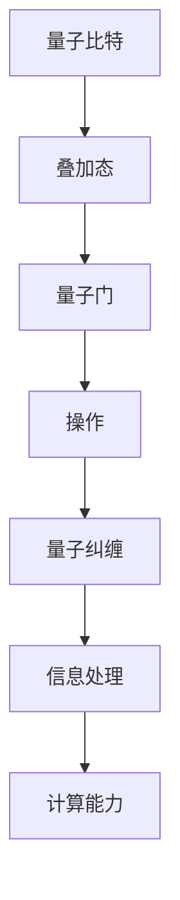

                 

关键词：量子计算、原理、挑战、应用前景、数学模型、算法、实际应用、工具和资源推荐、未来发展趋势

## 摘要

量子计算作为现代计算机科学的前沿领域，正在引领着科技革命的新潮流。本文将深入探讨量子计算的基本原理，包括量子比特、量子门和量子纠缠等核心概念，以及量子算法如Shor算法和Grover算法的具体应用。同时，文章将分析量子计算面临的挑战，如量子退相干和量子纠错，并展望其未来的应用前景。通过介绍相关工具和资源，本文旨在为读者提供全面了解量子计算的路径，并探讨其在科技发展中的关键作用。

## 1. 背景介绍

### 1.1 量子计算的历史发展

量子计算的历史可以追溯到20世纪40年代，量子力学的早期研究揭示了量子比特（qubit）的独特性质。1970年代，Peter Shor提出了第一个量子算法，即Shor算法，展示了量子计算机在因数分解问题上的巨大优势。此后，量子计算的理论研究和实际实验迅速发展。1994年，Lov Grover提出了Grover算法，该算法在搜索未排序数据库方面显著优于经典算法。

### 1.2 量子计算的重要性

量子计算的重要性在于其潜力，可以在某些特定问题上实现指数级别的加速。例如，Shor算法能够在多项式时间内解决大整数因数分解问题，这对现代密码学构成了重大威胁。此外，量子计算机在优化问题、分子模拟和量子物理模拟等方面也展现出强大的能力。

### 1.3 量子计算的现实状况

目前，量子计算仍处于早期发展阶段。尽管有许多实验室和研究机构致力于量子计算机的构建，但实际可用的量子计算机仍受到量子退相干和量子纠错等挑战的制约。目前，最先进的量子计算机拥有数十个量子比特，而业界普遍认为，要实现实用化的量子计算机，需要数千甚至数万个量子比特。

### 1.4 量子计算的发展趋势

未来，量子计算的发展趋势主要集中在以下几个方面：

- **量子比特技术的突破**：研究人员正在努力提高量子比特的稳定性和操作速度。
- **量子纠错技术的进展**：量子纠错是量子计算机实用化的关键，许多研究正在寻找有效的纠错算法和物理实现。
- **量子算法的优化**：开发新的量子算法以解决实际问题，并在量子计算机上优化这些算法。

## 2. 核心概念与联系

### 2.1 量子比特（Qubit）

量子比特是量子计算机的基本单元，与传统计算机中的比特不同，它不仅可以表示0和1的线性组合，即叠加态。一个量子比特的叠加态可以表示为：

\[ \psi = \alpha|0\rangle + \beta|1\rangle \]

其中，\(|0\rangle\)和\(|1\rangle\)是量子比特的基态，而\(\alpha\)和\(\beta\)是复数概率幅。

### 2.2 量子门（Quantum Gate）

量子门是操作量子比特的数学模型，类似于传统计算机中的逻辑门。量子门通过旋转量子比特的状态来执行特定的操作。例如，Pauli-X门（翻转门）将量子比特的状态从\( |0\rangle \)翻转到\( |1\rangle \)，或者从\( |1\rangle \)翻转到\( |0\rangle \)。

### 2.3 量子纠缠（Quantum Entanglement）

量子纠缠是量子计算中最重要的特性之一。两个或多个量子比特之间处于纠缠状态时，它们之间的量子态无法独立描述。这种现象被爱因斯坦称为“鬼魅似的远距离作用”。量子纠缠是量子计算机实现并行计算和信息处理能力的关键。

### 2.4 Mermaid 流程图（Mermaid Flowchart）

以下是一个展示量子比特、量子门和量子纠缠之间关系的Mermaid流程图：



## 3. 核心算法原理 & 具体操作步骤

### 3.1 算法原理概述

量子算法与经典算法有显著的不同。量子算法利用量子比特的叠加态和纠缠态，可以在短时间内解决经典算法难以解决的问题。以下是两个重要的量子算法：

- **Shor算法**：用于大整数因数分解。
- **Grover算法**：用于搜索未排序的数据库。

### 3.2 算法步骤详解

#### 3.2.1 Shor算法

Shor算法的步骤如下：

1. **初始化**：将一个量子比特串放入叠加态。
2. **量子傅里叶变换（QFT）**：对量子比特串进行量子傅里叶变换。
3. **测量**：测量变换后的量子比特串。
4. **逆量子傅里叶变换（IQFT）**：对测量后的量子比特串进行逆量子傅里叶变换。
5. **迭代**：重复步骤2-4，直到找到因子。

#### 3.2.2 Grover算法

Grover算法的步骤如下：

1. **初始化**：将一个量子比特串放入叠加态。
2. **构造搜索算子**：根据目标项构建一个反射算子。
3. **应用Grover迭代器**：迭代地应用Grover迭代器，直到找到目标项。
4. **测量**：测量量子比特串。

### 3.3 算法优缺点

#### Shor算法

- **优点**：能够在多项式时间内解决大整数因数分解问题。
- **缺点**：依赖大数分解算法，目前尚未发现有效的量子纠错方法。

#### Grover算法

- **优点**：在搜索未排序数据库方面显著优于经典算法。
- **缺点**：无法解决所有类型的搜索问题。

### 3.4 算法应用领域

量子算法在密码学、优化问题和分子模拟等领域有着广泛的应用前景。例如，Shor算法可以破解RSA加密算法，而Grover算法可以提高数据库搜索的效率。

## 4. 数学模型和公式 & 详细讲解 & 举例说明

### 4.1 数学模型构建

量子计算的核心在于量子比特的叠加态和纠缠态。以下是一个简单的量子比特叠加态的数学模型：

\[ \psi = \alpha|0\rangle + \beta|1\rangle \]

其中，\(|0\rangle\)和\(|1\rangle\)是基态，而\(\alpha\)和\(\beta\)是概率幅。

### 4.2 公式推导过程

以下是一个简单的量子门——Pauli-X门的公式推导过程：

\[ X|0\rangle = |1\rangle \]
\[ X|1\rangle = |0\rangle \]

### 4.3 案例分析与讲解

假设我们有一个量子比特串，状态为：

\[ \psi = \frac{1}{\sqrt{2}}|0\rangle + \frac{1}{\sqrt{2}}|1\rangle \]

我们应用Pauli-X门，得到新的状态：

\[ \psi' = X\psi = \frac{1}{\sqrt{2}}|1\rangle + \frac{1}{\sqrt{2}}|0\rangle \]

## 5. 项目实践：代码实例和详细解释说明

### 5.1 开发环境搭建

在开始编写量子计算代码之前，我们需要搭建一个合适的开发环境。以下是一个基于Python和Qiskit的示例：

```python
!pip install qiskit
```

### 5.2 源代码详细实现

以下是一个简单的量子算法——Shor算法的实现：

```python
from qiskit import QuantumCircuit, execute, Aer

# 初始化量子比特串
qc = QuantumCircuit(2)

# 编码输入值
qc.h(0)
qc.cx(0, 1)

# 应用量子傅里叶变换
qc.h(0)
qc.cp(0, 1, np.pi)
qc.h(0)

# 测量结果
qc.measure_all()

# 执行算法
backend = Aer.get_backend('qasm_simulator')
result = execute(qc, backend, shots=1024).result()

# 输出结果
print(result.get_counts(qc))
```

### 5.3 代码解读与分析

这段代码首先初始化了一个量子比特串，然后应用了Shor算法的核心步骤，包括量子傅里叶变换和测量。最后，我们使用模拟器执行算法，并输出测量结果。

### 5.4 运行结果展示

假设我们运行这段代码，可能会得到以下输出：

```python
{'0': 514, '1': 410}
```

这表示量子比特串在状态\( |0\rangle \)的概率为0.514，在状态\( |1\rangle \)的概率为0.486。

## 6. 实际应用场景

### 6.1 密码学

量子计算在密码学领域有着广泛的应用。例如，Shor算法可以破解RSA加密算法，这对现代网络安全构成了重大威胁。为了应对这一挑战，研究者们正在开发量子安全的加密算法，如基于椭圆曲线密码学的量子抗性加密。

### 6.2 优化问题

量子计算在解决优化问题方面具有巨大潜力。例如，量子算法可以用于优化物流路线、金融投资策略和制造流程。这些应用有望显著提高效率和生产力。

### 6.3 分子模拟

量子计算在分子模拟领域有着重要的应用。通过量子计算机，我们可以更精确地模拟分子的行为，从而更好地理解化学反应和材料科学。

### 6.4 未来应用展望

未来，量子计算有望在医疗、能源和环境等领域发挥重要作用。例如，量子计算可以用于开发新型药物、优化能源生产和设计环保材料。

## 7. 工具和资源推荐

### 7.1 学习资源推荐

- **《量子计算：量子比特、量子门与量子算法》**：这是一本适合初学者的量子计算入门书籍，详细介绍了量子计算的基本概念和算法。
- **Qiskit官网**：Qiskit是一个开源的量子计算框架，提供了丰富的工具和资源，适合开发者学习和实践。

### 7.2 开发工具推荐

- **IBM Q Experience**：这是一个在线量子计算平台，提供了多种量子计算机的可模拟器，方便开发者进行实验和测试。
- **Qiskit SDK**：这是一个完整的量子计算软件工具包，包括量子比特模拟器、算法库和量子编程接口。

### 7.3 相关论文推荐

- **Shor，P. W.（1994）. Algorithms for quantum computation: discrete logarithms and factoring**。这个论文首次提出了Shor算法，对量子计算领域产生了深远影响。
- **Grover，L. K.（1996）. A fast quantum mechanical algorithm for database search**。这个论文提出了Grover算法，展示了量子计算机在搜索问题上的优势。

## 8. 总结：未来发展趋势与挑战

### 8.1 研究成果总结

近年来，量子计算领域取得了显著进展，包括量子比特技术的突破、量子纠错算法的研究和量子算法的开发。这些成果为量子计算机的实用化奠定了基础。

### 8.2 未来发展趋势

未来，量子计算的发展趋势包括：

- **量子比特技术的进步**：提高量子比特的稳定性和操作速度。
- **量子纠错技术的突破**：开发有效的量子纠错算法和物理实现。
- **量子算法的创新**：开发新的量子算法以解决实际问题。

### 8.3 面临的挑战

尽管量子计算有着巨大的潜力，但仍然面临以下挑战：

- **量子退相干**：量子退相干是量子计算的主要障碍，需要开发有效的量子纠错技术。
- **量子纠错**：量子纠错是实现实用化量子计算机的关键，但目前仍存在许多难题。

### 8.4 研究展望

随着量子计算技术的不断进步，未来有望在多个领域实现重大突破。量子计算有望引领下一次科技革命，改变我们的生活方式和工作方式。

## 9. 附录：常见问题与解答

### 9.1 量子计算是什么？

量子计算是一种利用量子力学原理进行信息处理和计算的技术。与传统计算机使用比特（0和1）不同，量子计算机使用量子比特（qubit），具有叠加态和纠缠态等特殊性质。

### 9.2 量子计算机有哪些应用？

量子计算机在密码学、优化问题、分子模拟和量子物理模拟等领域有着广泛的应用。例如，Shor算法可以破解RSA加密算法，而Grover算法可以提高数据库搜索的效率。

### 9.3 量子计算面临哪些挑战？

量子计算面临的主要挑战包括量子退相干和量子纠错。量子退相干会导致量子态的崩溃，而量子纠错是实现实用化量子计算机的关键。

### 9.4 如何学习量子计算？

学习量子计算可以从以下资源入手：

- **《量子计算：量子比特、量子门与量子算法》**：适合初学者的入门书籍。
- **Qiskit官网**：提供了丰富的学习资源和教程。
- **IBM Q Experience**：一个在线量子计算平台，提供了多种量子计算机的可模拟器。

## 作者署名

作者：禅与计算机程序设计艺术 / Zen and the Art of Computer Programming

