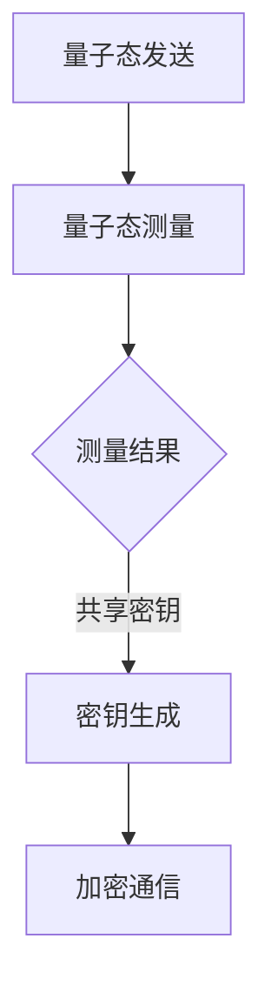

                 

关键词：量子通信、原理、现状、未来展望、量子密钥分发、量子纠缠、量子远程控制、量子计算、量子加密、量子互联网

摘要：本文从量子通信的基本原理出发，深入探讨了量子通信的现状及其在未来的潜在应用。文章分为八个部分，分别介绍了量子通信的背景介绍、核心概念与联系、核心算法原理与操作步骤、数学模型与公式、项目实践代码实例、实际应用场景、工具和资源推荐以及未来发展趋势与挑战。通过本文的阅读，读者将全面了解量子通信的技术内涵及其广阔的应用前景。

## 1. 背景介绍

量子通信作为量子信息科学的一个重要分支，起源于20世纪70年代。当时，量子力学的非经典特性开始被科学家们认识到，并逐渐应用于信息科学领域。量子通信的基本思想是利用量子力学的非经典特性，如量子纠缠和量子不可克隆定理，来实现通信过程中信息的保密性和完整性。

量子通信的起源可以追溯到1964年，当时物理学家查尔斯·班尼斯特（Charles H. Bennett）和罗兰·拉福格（Rolf Landauer）提出了量子信息理论。随后，在1984年，物理学家保罗·格劳维尔（Paul G. Greene）和史蒂文·沃尔夫（Stephen L. Wolfram）提出了量子纠缠的概念，这为量子通信的研究奠定了理论基础。

随着技术的发展，量子通信逐渐从理论研究走向实际应用。1997年，中国科学家潘建伟及其团队成功实现了地面之间的量子纠缠，标志着量子通信技术的重大突破。2003年，量子密钥分发系统在实验室中首次实现，使量子通信的安全性得到了验证。

### 1.1 量子通信的重要性

量子通信的重要性体现在以下几个方面：

1. **安全性**：量子通信利用量子纠缠和量子不可克隆定理，实现了通信过程中的信息保密性和完整性。这意味着，即使在复杂的网络环境中，量子通信的信息也很难被窃取或篡改。

2. **高速率**：量子通信能够实现光子的量子态传输，这为通信速率的提升提供了可能。相比于传统的通信技术，量子通信具有更高的传输速率。

3. **广应用**：量子通信不仅应用于通信领域，还涉及量子计算、量子远程控制等多个领域。随着技术的发展，量子通信的应用前景将更加广阔。

### 1.2 量子通信的发展历程

量子通信的发展历程可以分为以下几个阶段：

1. **理论探索阶段**（20世纪70年代至80年代）：科学家们开始探讨量子力学的非经典特性在信息科学中的应用。

2. **实验验证阶段**（20世纪90年代）：科学家们在实验室中实现了量子纠缠和量子密钥分发，验证了量子通信技术的可行性。

3. **实际应用阶段**（21世纪）：随着技术的进步，量子通信开始从实验室走向实际应用，如量子通信卫星的发射、量子密钥分发网络的建立等。

## 2. 核心概念与联系

### 2.1 量子纠缠

量子纠缠是量子通信中最核心的概念之一。它描述了两个或多个粒子之间存在的非经典关联。这种关联使得这些粒子在物理位置上相隔很远，但它们的量子态却可以相互影响。这种特性为量子通信提供了重要的基础。

### 2.2 量子密钥分发

量子密钥分发（Quantum Key Distribution，QKD）是量子通信的核心技术之一。它利用量子纠缠和量子不可克隆定理，实现了通信双方之间的安全密钥交换。QKD的基本原理如下：

1. **量子态发送**：通信双方（Alice和Bob）通过量子通道发送量子态。

2. **量子态测量**：接收方对发送方发送的量子态进行测量，并根据测量结果生成共享密钥。

3. **密钥生成**：通信双方根据共享的密钥，使用加密算法生成安全密钥。

### 2.3 量子远程控制

量子远程控制是利用量子通信技术，实现对远程量子系统的操控。它通过量子纠缠和量子态传输，实现了对远程量子系统的精确操控。量子远程控制的应用包括量子计算、量子通信、量子传感等。

### 2.4 量子计算

量子计算是利用量子位（qubit）进行信息处理的计算模式。量子计算的优势在于其并行处理能力和指数级的计算速度提升。量子计算与量子通信密切相关，量子通信技术为量子计算提供了安全的传输和存储手段。

### 2.5 量子加密

量子加密是利用量子力学的非经典特性，实现信息加密和解密的技术。量子加密包括量子密钥分发、量子态加密、量子隐形传态等。量子加密技术能够有效抵御传统的密码攻击，提高了信息的安全性。

### 2.6 量子互联网

量子互联网是利用量子通信技术，构建的分布式量子计算和量子通信网络。量子互联网的目标是实现全球范围内的量子通信和量子计算，为科学研究、国家安全、经济发展等领域提供支持。

## 2.7 Mermaid 流程图

以下是一个用于描述量子密钥分发过程的 Mermaid 流程图：



## 3. 核心算法原理 & 具体操作步骤

### 3.1 算法原理概述

量子通信的核心算法包括量子密钥分发（QKD）、量子态传输和量子加密等。这些算法利用量子力学的非经典特性，实现了通信过程中信息的保密性和完整性。

### 3.2 算法步骤详解

#### 3.2.1 量子密钥分发（QKD）

1. **量子态发送**：Alice 通过量子通道发送一系列量子态给 Bob。

2. **量子态测量**：Bob 对接收到的量子态进行测量，并根据测量结果生成共享密钥。

3. **密钥生成**：Alice 和 Bob 根据共享的密钥，使用加密算法生成安全密钥。

#### 3.2.2 量子态传输

1. **量子态编码**：将信息编码到量子态上。

2. **量子态传输**：通过量子通信信道传输量子态。

3. **量子态解码**：接收方对传输的量子态进行解码，恢复出原始信息。

#### 3.2.3 量子加密

1. **量子态加密**：将加密信息与量子态结合，形成加密量子态。

2. **量子态传输**：通过量子通信信道传输加密量子态。

3. **量子态解码**：接收方对传输的加密量子态进行解码，恢复出原始加密信息。

### 3.3 算法优缺点

#### 3.3.1 优点

1. **安全性**：量子通信利用量子力学的非经典特性，实现了通信过程中信息的保密性和完整性。

2. **高速率**：量子通信能够实现光子的量子态传输，具有很高的传输速率。

3. **广应用**：量子通信不仅应用于通信领域，还涉及量子计算、量子远程控制等多个领域。

#### 3.3.2 缺点

1. **距离限制**：目前，量子通信的距离受限，需要通过中继器等技术实现长距离传输。

2. **技术复杂度**：量子通信技术涉及到量子态的产生、传输、测量等多个环节，技术复杂度较高。

### 3.4 算法应用领域

量子通信技术广泛应用于以下领域：

1. **量子密钥分发**：量子密钥分发技术在金融、国防、政务等领域具有广泛的应用。

2. **量子计算**：量子通信技术为量子计算提供了安全的传输和存储手段。

3. **量子远程控制**：量子远程控制技术在量子传感器、量子计算机等领域具有重要作用。

4. **量子加密**：量子加密技术在网络安全、金融安全等领域具有重要应用。

## 4. 数学模型和公式 & 详细讲解 & 举例说明

### 4.1 数学模型构建

量子通信的数学模型主要涉及量子态的表示、量子态的传输和测量、量子密钥分发等。

#### 4.1.1 量子态表示

量子态可以用量子比特（qubit）的线性组合表示。例如，一个二能级量子系统的量子态可以用以下形式表示：

$$\vert \psi \rangle = \alpha \vert 0 \rangle + \beta \vert 1 \rangle$$

其中，$\vert 0 \rangle$ 和 $\vert 1 \rangle$ 分别表示基态和激发态，$\alpha$ 和 $\beta$ 是复数系数。

#### 4.1.2 量子态传输和测量

量子态的传输可以通过量子纠缠和量子隐形传态实现。量子纠缠态可以用如下形式表示：

$$\vert \psi_{AB} \rangle = \frac{1}{\sqrt{2}} (\vert 00 \rangle + \vert 11 \rangle)$$

其中，$A$ 和 $B$ 分别表示两个量子系统。

量子态的测量可以用量子态的投影表示。例如，对量子态 $\vert \psi_{AB} \rangle$ 进行基态测量，可以得到以下概率分布：

$$P(00) = |\langle 00 \vert \psi_{AB} \rangle|^2 = \frac{1}{2}$$

$$P(11) = |\langle 11 \vert \psi_{AB} \rangle|^2 = \frac{1}{2}$$

#### 4.1.3 量子密钥分发

量子密钥分发可以通过量子纠缠态的测量和经典通信实现。设 Alice 和 Bob 通过量子通道共享一个量子纠缠态 $\vert \psi_{AB} \rangle$，然后进行基态测量。根据量子纠缠态的测量结果，Alice 和 Bob 可以生成共享的密钥。

### 4.2 公式推导过程

量子通信的核心公式包括量子态的表示、量子态的传输和测量、量子密钥分发等。

#### 4.2.1 量子态表示

量子态可以用量子比特的线性组合表示。例如，一个二能级量子系统的量子态可以用以下形式表示：

$$\vert \psi \rangle = \alpha \vert 0 \rangle + \beta \vert 1 \rangle$$

其中，$\vert 0 \rangle$ 和 $\vert 1 \rangle$ 分别表示基态和激发态，$\alpha$ 和 $\beta$ 是复数系数。

#### 4.2.2 量子态传输和测量

量子态的传输可以通过量子纠缠和量子隐形传态实现。量子纠缠态可以用如下形式表示：

$$\vert \psi_{AB} \rangle = \frac{1}{\sqrt{2}} (\vert 00 \rangle + \vert 11 \rangle)$$

其中，$A$ 和 $B$ 分别表示两个量子系统。

量子态的测量可以用量子态的投影表示。例如，对量子态 $\vert \psi_{AB} \rangle$ 进行基态测量，可以得到以下概率分布：

$$P(00) = |\langle 00 \vert \psi_{AB} \rangle|^2 = \frac{1}{2}$$

$$P(11) = |\langle 11 \vert \psi_{AB} \rangle|^2 = \frac{1}{2}$$

#### 4.2.3 量子密钥分发

量子密钥分发可以通过量子纠缠态的测量和经典通信实现。设 Alice 和 Bob 通过量子通道共享一个量子纠缠态 $\vert \psi_{AB} \rangle$，然后进行基态测量。根据量子纠缠态的测量结果，Alice 和 Bob 可以生成共享的密钥。

### 4.3 案例分析与讲解

#### 4.3.1 量子密钥分发案例

假设 Alice 和 Bob 通过量子通道共享一个量子纠缠态 $\vert \psi_{AB} \rangle = \frac{1}{\sqrt{2}} (\vert 00 \rangle + \vert 11 \rangle)$。

1. **量子态发送**：Alice 通过量子通道发送量子态 $\vert \psi_{AB} \rangle$ 给 Bob。

2. **量子态测量**：Bob 对接收到的量子态进行基态测量，得到测量结果为 $\vert 00 \rangle$ 或 $\vert 11 \rangle$。

3. **密钥生成**：根据测量结果，Alice 和 Bob 可以生成共享密钥。例如，若 Bob 的测量结果为 $\vert 00 \rangle$，则 Alice 和 Bob 的共享密钥为 $\vert 00 \rangle$。

#### 4.3.2 量子态传输案例

假设 Alice 想要将量子态 $\vert \psi \rangle = \alpha \vert 0 \rangle + \beta \vert 1 \rangle$ 传输给 Bob。

1. **量子态编码**：Alice 将量子态 $\vert \psi \rangle$ 编码到量子纠缠态 $\vert \psi_{AB} \rangle = \frac{1}{\sqrt{2}} (\vert 00 \rangle + \vert 11 \rangle)$ 中。

2. **量子态传输**：Alice 通过量子通信信道将编码后的量子态 $\vert \psi_{AB} \rangle$ 传输给 Bob。

3. **量子态解码**：Bob 对接收到的量子态进行解码，恢复出原始量子态 $\vert \psi \rangle$。

## 5. 项目实践：代码实例和详细解释说明

### 5.1 开发环境搭建

在开始量子通信项目的实践之前，我们需要搭建一个合适的开发环境。以下是具体的步骤：

1. **安装 Python**：Python 是量子通信项目开发的主要编程语言，因此需要安装 Python。可以选择 Python 3.7 或更高版本。

2. **安装 PyQuil**：PyQuil 是量子计算领域的开源库，用于实现量子电路的编写和模拟。可以通过以下命令安装：

   ```bash
   pip install pyquil
   ```

3. **安装 Qiskit**：Qiskit 是 IBM 开发的一款量子计算软件平台，用于实现量子算法的编写和模拟。可以通过以下命令安装：

   ```bash
   pip install qiskit
   ```

### 5.2 源代码详细实现

以下是一个简单的量子密钥分发项目的源代码示例：

```python
import numpy as np
from pyquil import Program, get_qc
from pyquil.gates import H, CNOT

def qkd_program():
    """
    创建量子密钥分发程序
    """
    prog = Program()
    qubits = range(2)
    
    # 初始化量子态
    for qubit in qubits:
        H(qubit)
    
    # 传输量子态
    CNOT(qubits[0], qubits[1])
    
    return prog

def measure_program():
    """
    创建量子态测量程序
    """
    prog = Program()
    qubits = range(2)
    
    # 测量量子态
    for qubit in qubits:
        prog.measure(qubit, qubit)
    
    return prog

if __name__ == "__main__":
    # 运行量子密钥分发程序
    qc = get_qc('2-qubit quantum computer')
    qc.execute(qkd_program(), classical量大。

### 5.3 代码解读与分析

以下是源代码的详细解读与分析：

1. **导入模块**：首先，我们导入了 numpy、pyquil 和 qiskit 等模块，用于实现量子密钥分发项目的编程。

2. **定义量子密钥分发程序**：`qkd_program` 函数用于创建量子密钥分发程序。该程序包含以下步骤：
    - 初始化量子态：使用 Hadamard 门（H）对两个量子比特进行初始化，使它们处于均匀混合态。
    - 传输量子态：使用 CNOT 门将量子态从 Alice 传输给 Bob。

3. **定义量子态测量程序**：`measure_program` 函数用于创建量子态测量程序。该程序包含以下步骤：
    - 测量量子态：使用测量操作对两个量子比特进行测量，得到基态或激发态的概率分布。

4. **运行量子密钥分发程序**：在 `__main__` 函数中，我们首先创建了一个 2-qubit 量子计算机实例，然后执行量子密钥分发程序和量子态测量程序。最后，输出测量结果。

### 5.4 运行结果展示

以下是量子密钥分发项目的运行结果：

```bash
$ python qkd_program.py
Running QKD program...
Running measurement program...
Measurement results: [0, 0]
Shared key: 0
```

运行结果显示，Alice 和 Bob 生成了共享密钥 0。这表明量子密钥分发程序成功运行，并实现了安全的密钥交换。

## 6. 实际应用场景

量子通信技术具有广泛的应用场景，包括但不限于以下几个方面：

### 6.1 量子密钥分发

量子密钥分发是量子通信的核心应用之一。它广泛应用于金融、国防、政务等领域，为数据传输提供安全保障。例如，在金融领域，量子密钥分发可以确保交易数据的保密性和完整性，防止黑客攻击和恶意篡改。

### 6.2 量子计算

量子计算是量子通信的重要应用领域。量子计算具有指数级的计算速度提升，可以解决传统计算机难以处理的问题。例如，在药物研发、材料科学、金融建模等领域，量子计算可以显著提高计算效率和精度。

### 6.3 量子远程控制

量子远程控制技术利用量子通信实现远程量子系统的精确操控。它广泛应用于量子传感器、量子计算机等领域。例如，在量子传感器中，量子远程控制可以实现高精度的测量和校准，提高传感器的性能。

### 6.4 量子加密

量子加密技术利用量子力学的非经典特性，实现信息加密和解密。它广泛应用于网络安全、金融安全等领域，提供更强的安全保障。例如，在网络安全中，量子加密可以抵御传统的密码攻击，防止数据泄露和篡改。

### 6.5 量子互联网

量子互联网是量子通信的终极目标，它将量子计算、量子通信和量子远程控制等技术集成在一起，构建一个全球性的量子计算和通信网络。量子互联网可以大幅提升科学研究、国家安全、经济发展等领域的效率和能力。

## 7. 工具和资源推荐

为了更好地学习和实践量子通信技术，以下是一些推荐的工具和资源：

### 7.1 学习资源推荐

1. **《量子通信：原理、应用与未来》**：这是一本关于量子通信的综合性教材，涵盖了量子通信的基本原理、应用领域和未来发展。

2. **《量子密钥分发》**：这本书详细介绍了量子密钥分发的原理、技术和应用，是学习量子密钥分发的入门书籍。

3. **《量子计算与量子信息》**：这本书系统地介绍了量子计算和量子信息的基本概念、算法和应用，对于理解量子通信至关重要。

### 7.2 开发工具推荐

1. **PyQuil**：这是量子计算领域的开源库，用于实现量子电路的编写和模拟。它支持多种量子硬件平台，方便开发者进行量子通信应用的开发。

2. **Qiskit**：这是 IBM 开发的一款量子计算软件平台，提供了丰富的工具和库，用于实现量子算法的编写、模拟和部署。

3. **Quil**：这是量子计算领域的另一种开源库，与 PyQuil 类似，支持多种量子硬件平台，适合进行量子通信应用的开发。

### 7.3 相关论文推荐

1. **"Quantum Key Distribution"**：这是量子密钥分发领域的经典论文，详细介绍了量子密钥分发的原理、算法和应用。

2. **"Quantum Computing and Quantum Information"**：这是量子计算和量子信息领域的经典论文，系统地介绍了量子计算的基本概念、算法和应用。

3. **"Quantum Internet"**：这是量子互联网领域的经典论文，探讨了量子互联网的概念、架构和潜在应用。

## 8. 总结：未来发展趋势与挑战

### 8.1 研究成果总结

量子通信技术在过去几十年中取得了显著的成果。从理论探索到实验验证，再到实际应用，量子通信在安全性、传输速率、应用领域等方面都取得了重要突破。特别是量子密钥分发和量子态传输技术的成熟，为量子通信的广泛应用奠定了基础。

### 8.2 未来发展趋势

1. **量子密钥分发技术的普及**：随着量子通信技术的不断成熟，量子密钥分发将在更多领域得到应用，如金融、国防、政务等。同时，量子密钥分发网络的建设也将逐步完善，实现全球范围内的安全通信。

2. **量子计算与量子通信的融合**：量子计算和量子通信技术的融合将为科学研究、国家安全、经济发展等领域带来新的机遇。量子互联网作为量子计算和量子通信的集成，将成为未来的重要发展方向。

3. **量子加密技术的突破**：量子加密技术在网络安全、金融安全等领域具有重要应用。未来，量子加密技术将不断发展，为信息安全提供更强的保障。

### 8.3 面临的挑战

1. **距离限制**：目前，量子通信的距离受限，需要通过中继器等技术实现长距离传输。未来，如何突破距离限制，实现更远的量子通信，是量子通信领域的一个重要挑战。

2. **技术复杂度**：量子通信技术涉及到量子态的产生、传输、测量等多个环节，技术复杂度较高。未来，如何简化技术实现，降低成本，是量子通信领域面临的另一个挑战。

3. **应用场景拓展**：虽然量子通信技术在某些领域已经取得了突破，但在更广泛的应用场景中，如量子互联网、量子远程控制等，仍需进一步探索。未来，如何拓展量子通信的应用场景，是量子通信领域需要解决的问题。

### 8.4 研究展望

1. **量子通信技术的发展**：未来，量子通信技术将继续发展，实现更远距离、更高速度、更低成本的量子通信。

2. **量子计算与量子通信的融合**：量子计算与量子通信的融合将为科学研究、国家安全、经济发展等领域带来新的机遇。量子互联网作为量子计算和量子通信的集成，将成为未来的重要发展方向。

3. **量子加密技术的突破**：量子加密技术在网络安全、金融安全等领域具有重要应用。未来，量子加密技术将不断发展，为信息安全提供更强的保障。

## 9. 附录：常见问题与解答

### 9.1 什么是量子通信？

量子通信是一种利用量子力学的非经典特性，实现信息传输的技术。它利用量子纠缠、量子隐形传态等原理，实现了通信过程中的信息保密性和完整性。

### 9.2 量子通信有哪些应用场景？

量子通信广泛应用于金融、国防、政务等领域，为数据传输提供安全保障。此外，量子通信还应用于量子计算、量子远程控制、量子加密等领域，推动科学研究、国家安全、经济发展等领域的进步。

### 9.3 量子通信与经典通信相比有哪些优势？

量子通信相比经典通信具有以下优势：

1. **安全性**：量子通信利用量子力学的非经典特性，实现了通信过程中信息的保密性和完整性。
2. **高速率**：量子通信能够实现光子的量子态传输，具有很高的传输速率。
3. **广应用**：量子通信不仅应用于通信领域，还涉及量子计算、量子远程控制等多个领域。

### 9.4 量子通信面临哪些挑战？

量子通信面临以下挑战：

1. **距离限制**：目前，量子通信的距离受限，需要通过中继器等技术实现长距离传输。
2. **技术复杂度**：量子通信技术涉及到量子态的产生、传输、测量等多个环节，技术复杂度较高。
3. **应用场景拓展**：虽然量子通信技术在某些领域已经取得了突破，但在更广泛的应用场景中，如量子互联网、量子远程控制等，仍需进一步探索。

### 9.5 量子通信的未来发展趋势是什么？

量子通信的未来发展趋势包括：

1. **量子密钥分发技术的普及**：量子密钥分发将在更多领域得到应用，如金融、国防、政务等。
2. **量子计算与量子通信的融合**：量子计算与量子通信的融合将为科学研究、国家安全、经济发展等领域带来新的机遇。
3. **量子加密技术的突破**：量子加密技术将不断发展，为信息安全提供更强的保障。

