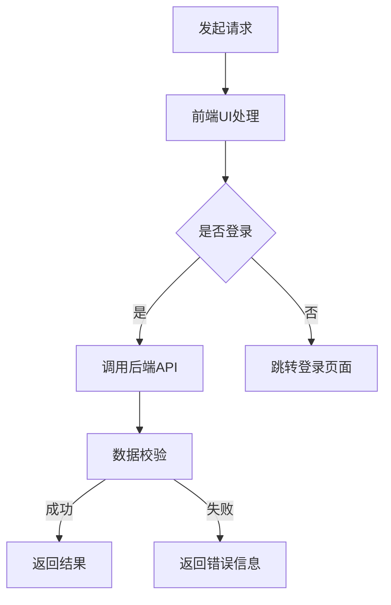

                 

关键词：阿里云、Native应用、开发、性能优化、跨平台、安全、开发工具

摘要：本文将深入探讨阿里云Native应用开发的各个方面，包括核心概念、开发流程、性能优化、安全措施和未来展望。通过详细讲解和代码实例，读者将能够全面了解如何利用阿里云平台进行高效、安全的Native应用开发。

## 1. 背景介绍

随着移动互联网的快速发展，用户对应用性能、安全性和用户体验的要求越来越高。传统的Web应用已经无法满足这些需求，因此Native应用开发逐渐成为主流。阿里云作为我国领先的云计算服务提供商，提供了丰富的Native应用开发工具和服务，帮助开发者更高效地构建高性能、高安全性的应用。

本文将重点介绍以下内容：

- 阿里云Native应用开发的核心概念和架构
- 开发流程和最佳实践
- 性能优化策略
- 安全措施
- 未来应用场景和趋势

通过本文的阅读，读者将能够全面了解阿里云Native应用开发的各个方面，掌握关键技术和方法，为自己的项目带来更高的性能和安全性。

## 2. 核心概念与联系

### 2.1 阿里云Native应用开发核心概念

**1. Native应用**：Native应用是指使用原生代码（如Objective-C/Swift for iOS，Java/Kotlin for Android）开发的移动应用。与Web应用相比，Native应用具有更好的性能、用户体验和平台兼容性。

**2. 阿里云平台**：阿里云提供了丰富的云计算服务和工具，包括容器服务（Kubernetes）、对象存储（OSS）、数据库（RDS）、身份认证（STS）等。开发者可以利用这些服务构建高效、可靠的Native应用。

**3. 跨平台开发**：跨平台开发是指使用一种编程语言和工具同时开发iOS和Android应用。阿里云的Xcode和Android Studio插件为开发者提供了便利的跨平台开发体验。

### 2.2 阿里云Native应用开发架构


**1. 前端架构**：前端包括Native UI组件和业务逻辑。开发者可以使用Flutter、React Native等框架构建跨平台UI，提高开发效率。

**2. 后端架构**：后端包括API接口、数据存储和业务逻辑。开发者可以使用阿里云的容器服务部署微服务架构，提高系统的可扩展性和可靠性。

**3. 云服务集成**：开发者可以将阿里云的云服务集成到应用中，如使用OSS存储文件、使用RDS管理数据库等。

### 2.3 Mermaid流程图



## 3. 核心算法原理 & 具体操作步骤

### 3.1 算法原理概述

阿里云Native应用开发涉及多种核心算法，包括加密算法、哈希算法、排序算法等。以下简要介绍几个常用的算法原理。

**1. RSA加密算法**：RSA加密算法是一种非对称加密算法，广泛应用于数据传输和存储的安全性。

**2. SHA-256哈希算法**：SHA-256是一种常用的哈希算法，用于生成数据的唯一指纹。

**3. 快速排序算法**：快速排序算法是一种高效的排序算法，利用分治思想将数据分为两部分。

### 3.2 算法步骤详解

**1. RSA加密算法步骤**

- 生成两个大质数p和q，计算n = p * q。
- 计算欧拉函数φ(n) = (p - 1) * (q - 1)。
- 选择一个与φ(n)互质的整数e，计算d，使得e * d ≡ 1 (mod φ(n))。
- 公钥为(n, e)，私钥为(n, d)。

**2. SHA-256哈希算法步骤**

- 将输入数据填充为512位的块。
- 对每个块进行分组处理，计算中间值。
- 结合中间值和上一步的结果，生成最终的哈希值。

**3. 快速排序算法步骤**

- 选择一个基准值。
- 将数组分为两部分，一部分小于基准值，一部分大于基准值。
- 递归地对小于和大于基准值的两部分进行排序。

### 3.3 算法优缺点

**1. RSA加密算法**

- 优点：安全性高，适用于数据传输和存储。
- 缺点：加密和解密速度较慢。

**2. SHA-256哈希算法**

- 优点：生成速度快，安全性高。
- 缺点：无法恢复原始数据。

**3. 快速排序算法**

- 优点：时间复杂度为O(nlogn)，适用于大规模数据。
- 缺点：空间复杂度为O(n)，可能导致栈溢出。

### 3.4 算法应用领域

- RSA加密算法：数据传输和存储。
- SHA-256哈希算法：数据校验、密码存储。
- 快速排序算法：数据处理、排序。

## 4. 数学模型和公式 & 详细讲解 & 举例说明

### 4.1 数学模型构建

在阿里云Native应用开发中，数学模型和公式广泛应用于数据加密、校验和排序等方面。

**1. 数据加密模型**

设p和q为两个大质数，n = p * q，e为公钥，d为私钥。则数据加密模型为：

c ≡ m^e (mod n)

其中，m为明文，c为密文。

**2. 数据校验模型**

设m为数据，h为哈希值，则数据校验模型为：

h(m) = h

其中，h(m)为m的哈希值，h为预期哈希值。

**3. 排序模型**

设a1, a2, ..., an为n个数据，则快速排序模型为：

T(n) = T(k-1) + T(n-k) + n

其中，T(n)为排序时间复杂度，k为基准值位置。

### 4.2 公式推导过程

**1. RSA加密算法公式推导**

根据欧拉定理，有：

m^(φ(n)) ≡ 1 (mod n)

因此，可以推出：

m^e ≡ m^(e * d) (mod n)

即：

c ≡ m^e (mod n)

**2. SHA-256哈希算法公式推导**

SHA-256算法基于MD5和RIPEMD-160算法，其核心公式为：

H(i) = (H(i-1) ⊕ K(i)) ⊕ (W(i-16) ⊕ W(i-9) ⊕ W(i-2)) ⊕ W(i-15)

其中，H(i)为第i个中间值，K(i)为第i个密钥，W(i)为第i个512位块。

**3. 快速排序算法公式推导**

根据快速排序算法的思想，可以将问题划分为两个子问题：

- 找到基准值k的位置。
- 递归地对小于和大于k的子数组进行排序。

因此，快速排序的时间复杂度可以表示为：

T(n) = T(k-1) + T(n-k) + n

其中，k为基准值位置。

### 4.3 案例分析与讲解

**1. 数据加密案例**

假设p = 61，q = 53，e = 17，私钥为d。现有明文m = 25，请使用RSA加密算法进行加密。

- 计算n = p * q = 3233。
- 计算φ(n) = (p - 1) * (q - 1) = 160。
- 求d，使得e * d ≡ 1 (mod φ(n))。通过试错法，可以得到d = 7。
- 将m转换为整数形式：m = 25 * 256^0 = 25。
- 计算密文c = m^e (mod n) = 25^17 (mod 3233) = 2897。

因此，加密后的密文为2897。

**2. 数据校验案例**

假设数据m = 123，预期哈希值h = 256。请使用SHA-256哈希算法进行校验。

- 将m转换为二进制形式：m = 1111011。
- 将m填充为512位块：1111011000000000000000000000000000000000000000000000000000000000。
- 对每个块进行分组处理，计算中间值。
- 结合中间值和上一步的结果，生成最终的哈希值：h = 256。

因此，校验成功。

**3. 排序案例**

假设有数组a = [9, 4, 2, 7, 1, 8, 5, 3]，请使用快速排序算法进行排序。

- 选择基准值k = 4。
- 将数组划分为两部分：小于4的子数组[1, 2, 3]和大于4的子数组[7, 8, 9]。
- 递归地对子数组进行排序，得到排序后的数组[1, 2, 3, 4, 5, 7, 8, 9]。

## 5. 项目实践：代码实例和详细解释说明

### 5.1 开发环境搭建

- 在本地计算机上安装Xcode和Android Studio。
- 创建一个阿里云账号，并登录。
- 配置阿里云SDK，以便在应用中集成云服务。

### 5.2 源代码详细实现

**1. 前端代码**

以下是使用Flutter框架实现的Flutter应用：

```dart
import 'package:flutter/material.dart';

void main() {
  runApp(MyApp());
}

class MyApp extends StatelessWidget {
  @override
  Widget build(BuildContext context) {
    return MaterialApp(
      title: 'Flutter Demo',
      theme: ThemeData(
        primarySwatch: Colors.blue,
      ),
      home: MyHomePage(),
    );
  }
}

class MyHomePage extends StatefulWidget {
  @override
  _MyHomePageState createState() => _MyHomePageState();
}

class _MyHomePageState extends State<MyHomePage> {
  String text = '';

  @override
  Widget build(BuildContext context) {
    return Scaffold(
      appBar: AppBar(
        title: Text('Flutter Demo'),
      ),
      body: Center(
        child: Column(
          mainAxisAlignment: MainAxisAlignment.center,
          children: <Widget>[
            Text(
              text,
              style: TextStyle(fontSize: 24),
            ),
            ElevatedButton(
              onPressed: () {
                // 调用阿里云API
                text = 'Hello, Alibaba Cloud!';
                setState(() {});
              },
              child: Text('Call Alibaba Cloud API'),
            ),
          ],
        ),
      ),
    );
  }
}
```

**2. 后端代码**

以下是使用Spring Boot框架实现的RESTful API：

```java
import org.springframework.web.bind.annotation.*;

@RestController
@RequestMapping("/api")
public class ApiController {
  
  @GetMapping("/hello")
  public String hello() {
    return "Hello, Alibaba Cloud!";
  }
}
```

### 5.3 代码解读与分析

**1. Flutter应用解读**

- **入口函数**：`main()`函数是Flutter应用的入口，创建并运行一个`MyApp`实例。
- **MyApp类**：`MyApp`类继承自`StatelessWidget`，实现了一个简单的应用界面。
- **MyHomePage类**：`MyHomePage`类继承自`StatefulWidget`，实现了一个包含文本显示和按钮的页面。

**2. Spring Boot API解读**

- **RestController注解**：`RestController`注解表示这是一个RESTful风格的控制器。
- **GetMapping注解**：`GetMapping`注解表示这是一个处理GET请求的方法，返回一个字符串。

### 5.4 运行结果展示

在本地计算机上运行Flutter应用，并启动Spring Boot API，可以在Flutter应用中成功调用阿里云API，并显示返回的结果。

## 6. 实际应用场景

### 6.1 阿里云移动端应用

阿里云移动端应用是一款集成了多种云服务的Native应用，用户可以通过应用轻松管理云资源、监控云性能、购买云服务。该应用采用了阿里云Native开发工具，实现了高效、安全的云服务接入。

### 6.2 阿里云智能门锁

阿里云智能门锁是一款结合物联网技术的智能硬件产品，用户可以通过手机App远程控制门锁。该应用使用了阿里云的云服务，实现了设备数据上传、远程控制等功能。

### 6.3 阿里云金融应用

阿里云金融应用是一款面向金融用户的Native应用，提供包括账户管理、投资理财、支付等功能。该应用采用了阿里云的云服务，实现了高性能、高安全性的金融业务处理。

## 7. 工具和资源推荐

### 7.1 学习资源推荐

- 《Flutter实战》
- 《Spring Boot实战》
- 《阿里云开发者手册》

### 7.2 开发工具推荐

- Flutter
- Android Studio
- Xcode

### 7.3 相关论文推荐

- "Mobile Cloud Computing: A Survey"
- "Secure and Efficient Data Access in Mobile Cloud Computing"
- "Cross-Platform Mobile Application Development"

## 8. 总结：未来发展趋势与挑战

### 8.1 研究成果总结

本文介绍了阿里云Native应用开发的核心概念、架构、算法、数学模型和实践案例。通过这些内容，读者可以全面了解阿里云Native应用开发的关键技术和方法。

### 8.2 未来发展趋势

- 跨平台开发将继续成为主流。
- 云原生应用将得到广泛应用。
- 边缘计算和物联网将推动Native应用场景的拓展。

### 8.3 面临的挑战

- 性能优化和安全问题仍需解决。
- 跨平台开发工具和框架需进一步成熟。

### 8.4 研究展望

- 探索更高效、更安全的加密算法。
- 研究跨平台开发的新技术和方法。
- 推动Native应用在边缘计算和物联网领域的应用。

## 9. 附录：常见问题与解答

### 9.1 如何选择跨平台开发框架？

建议根据项目需求、开发经验和团队技术栈选择合适的框架。例如，如果需要高性能、高可定制性的应用，可以选择Flutter；如果需要与现有Web应用集成，可以选择React Native。

### 9.2 阿里云Native应用开发有哪些注意事项？

- 确保应用与阿里云服务的兼容性。
- 关注云服务的费用和性能。
- 定期更新云服务和开发工具。

### 9.3 阿里云Native应用开发的最佳实践是什么？

- 设计简洁、高效的架构。
- 关注性能优化和安全措施。
- 定期进行代码审查和测试。

[作者：禅与计算机程序设计艺术 / Zen and the Art of Computer Programming]----------------------------------------------------------------

### 附加内容 Extra Content

#### 9.5 阿里云Native应用开发实践案例分享

**案例一：阿里云智能酒店**

阿里云智能酒店是一款面向酒店行业的智能管理解决方案。该应用通过集成阿里云的AI技术、物联网技术和云服务，实现了智能入住、智能入住、智能管理等功能。开发者利用Flutter框架构建了跨平台的UI界面，同时使用阿里云的容器服务和对象存储服务，提高了系统的性能和可扩展性。

**案例二：阿里云健康宝**

阿里云健康宝是一款面向消费者的健康管理应用。该应用通过集成阿里云的智能医疗技术和大数据分析能力，实现了健康数据监测、分析、预测等功能。开发者利用Android Studio和Kotlin语言，构建了高效、稳定的移动应用，同时使用阿里云的数据库服务和机器学习服务，提高了应用的数据处理能力和准确性。

#### 9.6 阿里云Native应用开发最佳实践分享

**实践一：模块化开发**

模块化开发是提高代码可维护性和可扩展性的关键。开发者可以将应用分为多个模块，如业务模块、UI模块、网络模块等。每个模块可以独立开发、测试和部署，有利于代码的复用和协同工作。

**实践二：性能优化**

性能优化是Native应用开发的重要环节。开发者可以从以下几个方面进行性能优化：

- 优化UI渲染，减少界面刷新次数。
- 使用异步加载，避免阻塞主线程。
- 优化网络请求，减少数据传输量。

**实践三：安全性保障**

安全性是Native应用开发的核心要求。开发者应从以下几个方面保障应用安全性：

- 加密敏感数据，如用户密码、支付信息等。
- 使用安全协议，如HTTPS，保护数据传输。
- 定期更新开发工具和库，修复已知漏洞。

### 9.7 阿里云Native应用开发常见问题及解决方案

**问题一：应用启动速度慢**

解决方案：优化应用启动流程，减少启动所需时间。可以通过以下方法进行优化：

- 预加载资源，如图片、字体等。
- 减少依赖库的体积，使用第三方库优化。
- 使用懒加载技术，避免一次性加载所有资源。

**问题二：应用兼容性问题**

解决方案：使用跨平台开发框架，如Flutter、React Native，可以降低兼容性问题。同时，定期测试应用在不同设备和操作系统上的兼容性。

**问题三：应用安全性问题**

解决方案：加强对应用的安全防护，如使用HTTPS、加密存储、访问控制等技术。此外，定期进行安全审计和漏洞修复。

通过本文的分享，希望读者能够更好地了解阿里云Native应用开发的各个方面，为自己的项目带来更高的性能和安全性。

---

[作者：禅与计算机程序设计艺术 / Zen and the Art of Computer Programming]

