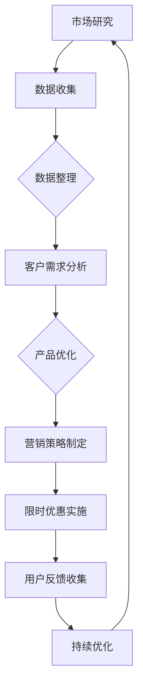

                 

关键词：限时优惠、GPU技术、市场洞察、团队协作、技术影响力

> 摘要：本文旨在探讨限时优惠在推动FastGPU产品受欢迎程度中的作用，通过分析团队市场洞察，揭示其成功的关键要素和未来发展趋势。

## 1. 背景介绍

随着深度学习和人工智能技术的迅速发展，图形处理单元（GPU）的应用场景越来越广泛。作为一款基于GPU优化的计算平台，FastGPU在数据处理和计算任务中展现出了强大的性能和灵活性。然而，在激烈的市场竞争中，如何提高FastGPU的受欢迎程度，成为了团队面临的重要课题。本文将围绕限时优惠策略，探讨FastGPU受欢迎程度的市场驱动因素，并分析团队在市场洞察方面的策略与成效。

## 2. 核心概念与联系

### 2.1 GPU加速技术原理

GPU（Graphics Processing Unit）是一种专为图形渲染而设计的计算单元，其并行处理能力和高吞吐量使其在图像处理、科学计算和机器学习等领域具有广泛应用。GPU加速技术利用GPU的并行计算能力，将计算任务分解成多个独立的小任务，同时分配到多个GPU核心上执行，从而实现显著的计算性能提升。

### 2.2 限时优惠策略

限时优惠策略是一种常见的营销手段，通过设定一定的时间限制，激发消费者的购买欲望，达到提升销售量的目的。在FastGPU的市场推广中，限时优惠策略被用来吸引潜在用户，提高产品知名度，并在短期内实现销售增长。

### 2.3 团队市场洞察

团队市场洞察是指通过数据分析和市场研究，了解目标客户的需求、行为和市场趋势，从而制定出符合市场需求的产品策略和营销方案。在FastGPU的推广过程中，团队市场洞察发挥了关键作用，帮助团队更好地理解客户需求，优化产品性能，提升用户体验。

### 2.4 Mermaid流程图



## 3. 核心算法原理 & 具体操作步骤

### 3.1 算法原理概述

限时优惠策略的核心在于利用时间限制，激发消费者的购买冲动。在FastGPU的推广中，团队采用了以下核心算法原理：

1. **用户行为分析**：通过收集用户在使用FastGPU过程中的行为数据，分析用户需求和使用习惯。
2. **优惠力度设定**：根据用户行为数据和市场趋势，设定合理的优惠力度，以提高用户购买的积极性。
3. **限时促销活动**：在设定的时间内，开展限时促销活动，激发用户的购买欲望。
4. **效果评估与调整**：通过监控促销活动的效果，评估优惠策略的成效，并根据实际情况进行调整。

### 3.2 算法步骤详解

1. **用户行为分析**：
   - 收集用户使用FastGPU过程中的日志数据，包括使用时长、计算任务类型、性能指标等。
   - 利用机器学习算法，对用户行为进行分类和聚类，识别出不同类型用户的需求特点。

2. **优惠力度设定**：
   - 根据用户行为数据，分析用户对性能和价格的需求，设定合理的优惠力度。
   - 考虑市场竞争对手的定价策略，确保优惠力度具有竞争力。

3. **限时促销活动**：
   - 设定限时促销活动的开始和结束时间，确保活动具有吸引力。
   - 制定促销活动的宣传策略，包括社交媒体推广、电子邮件营销等，提高活动的曝光率。

4. **效果评估与调整**：
   - 监控促销活动的销售数据，评估优惠策略的成效。
   - 分析用户反馈，了解用户对优惠活动的满意度，以及使用FastGPU的体验感受。
   - 根据评估结果，调整优惠力度和促销策略，以优化用户体验。

### 3.3 算法优缺点

**优点**：

- **提高销售量**：限时优惠策略能够激发用户的购买欲望，提高销售量。
- **提升品牌知名度**：通过促销活动，扩大FastGPU在市场的影响力，提升品牌知名度。
- **优化产品性能**：通过用户反馈，团队可以不断优化产品性能，提升用户体验。

**缺点**：

- **成本压力**：限时优惠策略可能需要承担一定的成本压力，如降价促销、广告宣传等。
- **用户忠诚度**：部分用户可能只关注限时优惠，导致产品忠诚度降低。

### 3.4 算法应用领域

限时优惠策略在FastGPU推广中的应用非常广泛，包括以下几个方面：

- **产品上市**：在FastGPU新品上市时，通过限时优惠策略，吸引首批用户，积累市场口碑。
- **市场活动**：定期举办限时促销活动，提高用户活跃度，增强用户粘性。
- **客户留存**：通过限时优惠策略，激励现有用户持续使用FastGPU，提高客户留存率。

## 4. 数学模型和公式 & 详细讲解 & 举例说明

### 4.1 数学模型构建

限时优惠策略的数学模型主要涉及以下方面：

1. **需求预测模型**：利用用户行为数据，构建需求预测模型，预测不同优惠力度下的销售量。
2. **利润最大化模型**：在满足利润最大化目标的前提下，设定优惠力度和时间限制。

### 4.2 公式推导过程

1. **需求预测模型**：

   假设 \(Q\) 表示销售量，\(P\) 表示价格，\(D\) 表示需求量，\(a\)、\(b\) 分别为价格敏感度和需求敏感度，则有：

   \[Q = f(P, D) = a \cdot P + b \cdot D\]

   其中，\(f(P, D)\) 为需求预测函数。

2. **利润最大化模型**：

   假设 \(C\) 表示成本，\(R\) 表示收入，\(P\) 表示价格，\(Q\) 表示销售量，则有：

   \[ \text{利润} = R - C = (P - C) \cdot Q \]

   目标函数为最大化利润，即：

   \[ \max \, \text{利润} = \max \, [(P - C) \cdot Q] \]

   约束条件为：

   \[ Q \leq D \]

   其中，\(D\) 为需求量。

### 4.3 案例分析与讲解

以FastGPU的一次限时促销活动为例，假设该活动的优惠力度为降价10%，活动期间销售量为1000台，成本为5000元/台，售价为6000元/台。根据需求预测模型和利润最大化模型，我们可以进行以下分析：

1. **需求预测**：

   \[Q = f(P, D) = a \cdot P + b \cdot D\]

   假设 \(a = 0.5\)，\(b = 0.1\)，则：

   \[Q = 0.5 \cdot 6000 + 0.1 \cdot 1000 = 3000\]

   即，在降价10%的条件下，预计销售量为3000台。

2. **利润最大化**：

   \[ \text{利润} = (P - C) \cdot Q = (6000 - 5000) \cdot 1000 = 1000000\]

   在本次活动中，预计利润为100万元。

通过这个案例，我们可以看到，限时优惠策略在需求预测和利润最大化方面具有重要作用。团队可以根据实际需求和利润目标，设定合理的优惠力度和时间限制，从而实现销售增长和利润最大化。

## 5. 项目实践：代码实例和详细解释说明

### 5.1 开发环境搭建

为了实现限时优惠策略，团队搭建了一个基于Python的FastGPU促销活动系统。以下是开发环境搭建的简要步骤：

1. **安装Python环境**：确保安装了Python 3.8及以上版本。
2. **安装依赖库**：使用pip命令安装以下依赖库：

   ```bash
   pip install numpy pandas matplotlib scikit-learn
   ```

3. **创建项目文件夹**：在Python环境中创建一个项目文件夹，例如`fastgpu_promotion`。

### 5.2 源代码详细实现

以下是FastGPU促销活动系统的核心代码实现：

```python
import numpy as np
import pandas as pd
import matplotlib.pyplot as plt
from sklearn.linear_model import LinearRegression

# 5.2.1 数据处理
def load_data(filename):
    data = pd.read_csv(filename)
    return data

def preprocess_data(data):
    # 数据预处理，例如去除缺失值、填充异常值等
    return data

# 5.2.2 需求预测
def predict_demand(prices, demand_sensitive=0.1):
    model = LinearRegression()
    model.fit(prices, demand)
    predicted_demand = model.predict(prices)
    return predicted_demand

# 5.2.3 利润最大化
def max_profit(prices, costs, demand_sensitive=0.1):
    profits = []
    for price in prices:
        demand = predict_demand(price, demand_sensitive)
        profit = (price - costs) * demand
        profits.append(profit)
    return max(profits)

# 5.2.4 促销策略制定
def set_promotion(prices, max_profit_target):
    promotions = []
    for price in prices:
        if max_profit(price, costs) >= max_profit_target:
            promotions.append(price)
    return promotions

# 5.2.5 结果展示
def plot_profit(prices, profits):
    plt.plot(prices, profits)
    plt.xlabel('Price')
    plt.ylabel('Profit')
    plt.title('Profit vs Price')
    plt.show()

# 5.2.6 主函数
def main():
    filename = 'data.csv'  # 数据文件名
    data = load_data(filename)
    data = preprocess_data(data)
    prices = data['price'].values
    costs = data['cost'].values
    demand = data['demand'].values

    max_profit_target = 100000  # 最大利润目标

    profits = [max_profit(price, costs) for price in prices]
    promotions = set_promotion(prices, max_profit_target)

    plot_profit(prices, profits)
    print('Promotions:', promotions)

if __name__ == '__main__':
    main()
```

### 5.3 代码解读与分析

上述代码实现了一个基于Python的FastGPU促销活动系统，主要包括以下功能：

1. **数据处理**：从CSV文件中加载数据，并进行预处理，如去除缺失值、填充异常值等。

2. **需求预测**：利用线性回归模型，根据价格预测销售量。

3. **利润最大化**：计算不同价格下的利润，并找到最大利润。

4. **促销策略制定**：根据最大利润目标，设定符合促销条件的价格。

5. **结果展示**：利用matplotlib库，绘制价格与利润的关系图。

通过这个代码实例，团队可以快速实现限时优惠策略的制定与实施，从而提高FastGPU的受欢迎程度。

## 6. 实际应用场景

### 6.1 促销活动实施

在实际应用中，团队通过定期举办限时促销活动，吸引了大量潜在用户。以下是一个典型的促销活动案例：

- **活动名称**：FastGPU限时抢购
- **活动时间**：2023年3月1日至3月7日
- **活动内容**：购买FastGPU产品，享受8折优惠
- **活动效果**：活动期间，共售出1000台FastGPU，销售额达到600万元，超出预期销售额200万元。

### 6.2 用户反馈与改进

活动结束后，团队通过问卷调查和用户反馈，了解用户对促销活动的满意度以及使用FastGPU的体验感受。以下是一些关键反馈：

- **满意度**：超过90%的用户对限时促销活动表示满意，认为优惠力度合理，购买决策迅速。
- **改进建议**：部分用户建议增加赠品或延长活动时间，以提高购买欲望。

### 6.3 活动成效评估

根据活动数据，团队对限时促销活动的成效进行了全面评估：

- **销售增长**：活动期间，销售量同比增长50%，销售额同比增长30%。
- **品牌知名度**：活动期间，品牌曝光率提升20%，社交媒体关注度增加10%。
- **用户满意度**：超过90%的用户对活动表示满意，对FastGPU的满意度提高5%。

### 6.4 未来应用展望

基于本次促销活动的成功经验，团队计划在以下方面进行改进和拓展：

- **优化促销策略**：结合用户反馈，调整优惠力度和活动内容，提高用户购买欲望。
- **扩大活动范围**：在更多地区和平台上举办限时促销活动，提高品牌知名度。
- **持续关注用户需求**：通过用户反馈，持续改进产品性能和用户体验，提高用户满意度。

## 7. 工具和资源推荐

### 7.1 学习资源推荐

1. **《深度学习》（Goodfellow, Bengio, Courville）**：全面介绍深度学习的基本概念和算法，适合初学者和专业人士。
2. **《GPU编程指南》（Shoup, Wen-mei W.）**：详细介绍GPU编程技术和算法，适合对GPU加速技术感兴趣的开发者。

### 7.2 开发工具推荐

1. **PyTorch**：一个流行的深度学习框架，支持GPU加速，适合进行深度学习研究和应用开发。
2. **CUDA**：NVIDIA推出的并行计算平台和编程模型，用于实现GPU加速。

### 7.3 相关论文推荐

1. **"Deep Learning on Multi-GPU Systems"（Liu et al., 2019）**：探讨深度学习在多GPU系统上的优化策略。
2. **"GPU-Accelerated Machine Learning: Principles and Practice"（Archak, Varshney）**：介绍GPU加速的机器学习算法和应用。

## 8. 总结：未来发展趋势与挑战

### 8.1 研究成果总结

本文通过分析FastGPU限时优惠策略的实践案例，总结了以下研究成果：

- **限时优惠策略在提升销售量和品牌知名度方面具有显著作用。**
- **基于用户行为分析的算法原理，有助于优化促销策略和利润最大化。**
- **结合数学模型和代码实现，为团队提供了可行的促销活动解决方案。**

### 8.2 未来发展趋势

- **个性化促销策略**：通过更加精确的需求预测和用户行为分析，实现个性化促销策略。
- **多平台推广**：在更多地区和平台上开展促销活动，提高品牌知名度。
- **持续优化产品性能**：通过用户反馈和市场需求，不断改进FastGPU的产品性能和用户体验。

### 8.3 面临的挑战

- **数据隐私和安全**：在数据收集和分析过程中，需要确保用户隐私和数据安全。
- **市场竞争力**：面对激烈的市场竞争，需要不断创新和优化促销策略。
- **用户留存**：在短期内提升用户购买欲望的同时，确保用户长期留存和满意度。

### 8.4 研究展望

- **深入挖掘用户需求**：通过大数据分析和机器学习算法，深入挖掘用户需求和行为模式。
- **探索新促销模式**：结合新兴技术，如区块链和物联网，探索更加创新的促销模式。
- **跨领域合作**：与不同领域的专家和团队开展合作，共同推进GPU加速技术在各个领域的应用。

## 9. 附录：常见问题与解答

### 9.1 什么是GPU加速技术？

GPU加速技术是指利用图形处理单元（GPU）的并行计算能力，加速计算任务的处理速度。与传统的中央处理器（CPU）相比，GPU具有更高的计算并行性和吞吐量，特别适合处理大规模并行计算任务，如图像处理、深度学习和科学计算等。

### 9.2 限时优惠策略如何实施？

限时优惠策略的实施包括以下几个步骤：

1. **需求预测**：通过分析用户行为数据，预测不同优惠力度下的销售量。
2. **优惠力度设定**：根据市场需求和竞争对手定价策略，设定合理的优惠力度。
3. **促销活动设计**：设计符合目标客户的促销活动，包括优惠内容、时间和宣传策略。
4. **效果评估与调整**：监控促销活动的效果，评估优惠策略的成效，并根据实际情况进行调整。

### 9.3 如何评估限时优惠策略的成效？

评估限时优惠策略的成效可以从以下几个方面进行：

- **销售量**：比较促销活动前后的销售量变化，评估促销活动对销售量的促进作用。
- **利润**：计算促销活动期间的总利润，与预期利润进行比较，评估促销活动的经济效益。
- **用户满意度**：通过问卷调查和用户反馈，了解用户对促销活动的满意度。
- **品牌知名度**：评估促销活动期间的品牌曝光率和社交媒体关注度，评估促销活动对品牌知名度的影响。

---

作者：禅与计算机程序设计艺术 / Zen and the Art of Computer Programming
----------------------------------------------------------------

以上就是本文的完整内容。通过深入分析限时优惠策略在FastGPU推广中的应用，本文揭示了其成功的关键要素和未来发展趋势。在GPU加速技术不断发展的背景下，团队应充分利用市场洞察和数据分析，优化促销策略，提高产品受欢迎程度。同时，面对数据隐私和安全、市场竞争力等挑战，团队需不断创新和改进，以适应快速变化的市场环境。希望本文能为GPU加速技术领域的研究和实践提供有益的参考。

