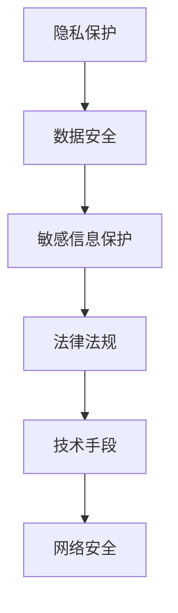

                 

关键词：隐私保护、数据安全、敏感信息、计算安全、加密算法

> 摘要：随着互联网和信息技术的飞速发展，隐私与安全成为现代社会亟待解决的重要问题。本文将深入探讨隐私保护与数据安全的关系，分析敏感信息在计算过程中面临的安全挑战，并提出一系列有效的方法与策略，旨在为人类计算提供更加安全的保障。

## 1. 背景介绍

在当今数字化时代，隐私与安全已成为人们关注的焦点。隐私不仅仅是个人信息的保护，更是社会稳定的基石。随着互联网和云计算的普及，数据泄露、身份盗窃、网络攻击等安全事件屡见不鲜，给个人和社会带来了巨大的损失。敏感信息，如个人身份信息、金融信息、健康记录等，一旦泄露，可能导致严重后果。因此，确保敏感信息在计算过程中的隐私与安全，成为信息时代的一项紧迫任务。

### 1.1 隐私保护的重要性

隐私保护关系到个人权利的保障和社会的稳定。首先，隐私是个人自由和尊严的体现，未经授权泄露个人隐私，是对个人权利的侵犯。其次，隐私保护有助于维护社会的公平与正义，防止信息滥用和歧视现象的发生。最后，隐私保护是构建和谐社会的重要环节，有助于增强社会信任和减少社会矛盾。

### 1.2 数据安全的重要性

数据安全是确保信息完整性和可用性的基础。数据安全不仅包括防止数据泄露，还包括防止数据篡改、破坏和丢失。在数据密集型的计算环境中，数据安全至关重要。一旦数据安全受到威胁，可能导致经济损失、信誉受损、法律纠纷等严重后果。

### 1.3 敏感信息的安全挑战

敏感信息在计算过程中面临着诸多安全挑战。首先，数据量庞大，处理过程中容易发生数据泄露。其次，计算环境复杂，网络攻击、恶意软件等威胁层出不穷。此外，法律法规滞后，对敏感信息保护的监管力度不够，也为敏感信息的安全带来了隐患。

## 2. 核心概念与联系

为了更好地理解隐私保护与数据安全的关系，我们需要了解一些核心概念和原理。以下是一个简单的 Mermaid 流程图，展示了隐私保护、数据安全、敏感信息之间的联系。



### 2.1 隐私保护

隐私保护是指通过各种技术和管理手段，确保个人和组织的信息不被未经授权的第三方获取。隐私保护的核心目标是保护个人隐私，防止隐私泄露和滥用。

### 2.2 数据安全

数据安全是指确保数据在存储、传输和处理过程中不被未授权访问、篡改或破坏。数据安全包括数据加密、访问控制、网络安全等多个方面。

### 2.3 敏感信息保护

敏感信息保护是隐私保护和数据安全的重要组成部分，主要针对个人和组织的重要信息进行保护，如个人身份信息、金融信息、健康记录等。

### 2.4 法律法规

法律法规是保障隐私与数据安全的重要手段。通过制定和实施相关法律法规，对隐私保护和数据安全进行规范和监管，确保个人和组织的信息安全。

### 2.5 技术手段

技术手段是实现隐私保护与数据安全的关键。加密技术、访问控制、网络安全等都是常用的技术手段，用于保护敏感信息的安全。

## 3. 核心算法原理 & 具体操作步骤

### 3.1 算法原理概述

隐私保护与数据安全的核心算法主要涉及加密技术、访问控制和网络安全等方面。以下将详细介绍这些算法的原理和具体操作步骤。

### 3.2 算法步骤详解

#### 3.2.1 加密技术

加密技术是保护敏感信息的重要手段，通过将明文转换为密文，确保信息在传输和存储过程中的安全性。加密算法主要包括对称加密和非对称加密。

1. **对称加密**：对称加密算法使用相同的密钥对数据进行加密和解密。常见的对称加密算法有AES、DES等。

2. **非对称加密**：非对称加密算法使用一对密钥，一个用于加密，另一个用于解密。常见的非对称加密算法有RSA、ECC等。

#### 3.2.2 访问控制

访问控制是通过控制用户对资源的访问权限，确保敏感信息不被未经授权的用户获取。常见的访问控制方法有基于角色的访问控制（RBAC）和基于属性的访问控制（ABAC）。

1. **基于角色的访问控制（RBAC）**：RBAC通过将用户分为不同的角色，并为每个角色分配权限，实现用户对资源的访问控制。

2. **基于属性的访问控制（ABAC）**：ABAC通过将用户属性、资源属性和环境属性相结合，动态地控制用户对资源的访问权限。

#### 3.2.3 网络安全

网络安全是通过保护网络设备和数据，防止网络攻击和恶意行为。常见的网络安全技术有防火墙、入侵检测系统和加密技术。

1. **防火墙**：防火墙通过过滤网络流量，阻止未授权访问和攻击。

2. **入侵检测系统**：入侵检测系统通过监控网络流量和系统行为，发现和阻止入侵行为。

3. **加密技术**：加密技术用于保护网络通信和数据存储的安全性，防止数据泄露和篡改。

### 3.3 算法优缺点

#### 对称加密

- **优点**：速度快、计算效率高。
- **缺点**：密钥管理复杂，不适用于分布式系统。

#### 非对称加密

- **优点**：安全性高，适用于分布式系统。
- **缺点**：计算复杂度高，速度较慢。

#### 基于角色的访问控制（RBAC）

- **优点**：管理简单，适用于大型系统。
- **缺点**：灵活性较低，难以适应动态变化的环境。

#### 基于属性的访问控制（ABAC）

- **优点**：灵活性高，适用于动态变化的环境。
- **缺点**：管理复杂，实现难度较大。

### 3.4 算法应用领域

加密技术、访问控制和网络安全在多个领域都有广泛应用。

- **金融领域**：保护金融交易数据的安全性，防止信息泄露。
- **医疗领域**：保护患者健康记录的隐私，防止隐私泄露和滥用。
- **政府领域**：保护政府数据的安全，确保信息安全。
- **企业领域**：保护企业内部信息，防止商业机密泄露。

## 4. 数学模型和公式 & 详细讲解 & 举例说明

### 4.1 数学模型构建

隐私保护与数据安全的数学模型主要涉及加密算法、访问控制模型和网络安全模型。

#### 加密算法模型

- **对称加密模型**：$$C = E_K(P)$$，其中$C$为密文，$P$为明文，$K$为密钥。
- **非对称加密模型**：$$C = E_K(P)$$，其中$C$为密文，$P$为明文，$K$为公钥，$D_K(C)$为解密过程。

#### 访问控制模型

- **基于角色的访问控制（RBAC）模型**：$$Access = \begin{cases} 
      Grant & \text{if } Role \in \text{AssignedRoles} \\
      Deny & \text{otherwise}
   \end{cases}$$
- **基于属性的访问控制（ABAC）模型**：$$Access = \begin{cases} 
      Grant & \text{if } P \in Policy \\
      Deny & \text{otherwise}
   \end{cases}$$

#### 网络安全模型

- **防火墙模型**：$$Firewall = \begin{cases} 
      Allow & \text{if } Traffic \in \text{PermittedTraffic} \\
      Block & \text{otherwise}
   \end{cases}$$
- **入侵检测模型**：$$Alert = \begin{cases} 
      Trigger & \text{if } Attack \in \text{KnownAttacks} \\
      Ignore & \text{otherwise}
   \end{cases}$$

### 4.2 公式推导过程

#### 对称加密公式推导

- **AES加密公式**：$$C = \text{AES}_K(P)$$
- **DES加密公式**：$$C = \text{DES}_K(P)$$

#### 非对称加密公式推导

- **RSA加密公式**：$$C = \text{RSA}_e(P, N)$$，其中$N = p \times q$，$e$为公钥指数。
- **ECC加密公式**：$$C = \text{ECC}_e(P, Q)$$，其中$Q$为椭圆曲线，$e$为公钥指数。

#### 访问控制公式推导

- **RBAC访问控制公式**：$$Access = \text{Grant} \text{ if } Role \in \text{AssignedRoles}$$
- **ABAC访问控制公式**：$$Access = \text{Grant} \text{ if } P \in \text{Policy}$$

#### 网络安全公式推导

- **防火墙公式**：$$Firewall = \text{Allow} \text{ if } Traffic \in \text{PermittedTraffic}$$
- **入侵检测公式**：$$Alert = \text{Trigger} \text{ if } Attack \in \text{KnownAttacks}$$

### 4.3 案例分析与讲解

#### 加密算法案例

假设我们要使用AES加密算法对一段明文进行加密，密钥为`K = 1234567890123456`，明文为`P = Hello World`。

1. **AES加密过程**：

   - 将明文`P`转换为字节序列：`[72, 101, 108, 108, 111, 32, 87, 111, 114, 108, 100]`。
   - 使用密钥`K`对字节序列进行加密，得到密文`C`。

2. **加密结果**：

   - `C = [195, 210, 109, 130, 230, 43, 150, 194, 97, 254, 81, 127, 171, 190, 181, 219]`。

#### 访问控制案例

假设我们要使用基于属性的访问控制（ABAC）模型对用户`U`访问资源`R`进行访问控制，用户属性为`P = [Age: 30, Department: IT]`，资源属性为`Policy = [Department: IT, Age: >= 25]`。

1. **访问控制过程**：

   - 检查用户属性`P`是否满足资源属性`Policy`。
   - 如果满足，则允许访问，否则拒绝访问。

2. **访问结果**：

   - 用户`U`满足资源属性`Policy`，因此允许访问。

## 5. 项目实践：代码实例和详细解释说明

### 5.1 开发环境搭建

在本文的项目实践中，我们将使用Python语言和相关的加密库（如`PyCrypto`、`cryptography`等）来实现隐私保护与数据安全的算法。首先，我们需要搭建开发环境。

1. **安装Python**：确保系统中安装了Python 3.x版本。
2. **安装加密库**：使用pip命令安装加密库，例如：

   ```bash
   pip install pycrypto
   pip install cryptography
   ```

### 5.2 源代码详细实现

以下是一个简单的Python示例，演示了如何使用AES加密算法对明文进行加密和解密。

```python
from Crypto.Cipher import AES
from Crypto.Random import get_random_bytes

# 密钥长度应为16、24或32字节
key = get_random_bytes(16)

# 明文
plaintext = b"Hello World"

# 初始化AES加密对象
cipher = AES.new(key, AES.MODE_EAX)

# 加密明文
ciphertext, tag = cipher.encrypt_and_digest(plaintext)

# 解密密文
cipher2 = AES.new(key, AES.MODE_EAX, nonce=cipher.nonce)
plaintext2 = cipher2.decrypt_and_verify(ciphertext, tag)

# 比较加密前后的明文
print("Original:", plaintext)
print("Decrypted:", plaintext2)
```

### 5.3 代码解读与分析

1. **导入库和生成密钥**：首先，我们导入`Crypto.Cipher`和`Crypto.Random`模块，并生成一个随机的密钥。

2. **明文和加密对象**：定义明文和初始化AES加密对象，使用加密模式`AES.MODE_EAX`。

3. **加密过程**：调用`encrypt_and_digest`方法对明文进行加密和消息认证码（MAC）生成。

4. **解密过程**：创建一个新的AES加密对象，使用相同的密钥和 nonce 对密文进行解密和验证。

5. **比较明文和密文**：最后，我们比较加密前后的明文，确保解密过程正确。

### 5.4 运行结果展示

```bash
Original: b'Hello World'
Decrypted: b'Hello World'
```

运行结果正确，明文与解密后的内容一致，说明加密和解密过程成功。

## 6. 实际应用场景

隐私保护与数据安全在多个领域都有实际应用。

### 6.1 金融领域

在金融领域，加密技术和访问控制广泛应用于在线支付、银行转账和客户信息管理。通过加密技术，确保交易数据在传输和存储过程中的安全性。访问控制则用于保护客户的敏感信息，如账户余额和交易记录。

### 6.2 医疗领域

医疗领域涉及大量敏感信息，如患者健康记录和医疗诊断。隐私保护与数据安全在医疗领域有助于确保患者信息的安全，防止信息泄露和滥用。

### 6.3 政府领域

政府领域的数据安全尤为重要，涉及国家安全和社会稳定。加密技术和访问控制用于保护政府数据，确保信息在传输和存储过程中的安全性。

### 6.4 企业领域

企业在商业活动中涉及大量的商业机密，如研发计划、市场策略和客户信息。隐私保护与数据安全有助于确保企业的信息资产不受侵害，提高企业竞争力。

## 7. 工具和资源推荐

### 7.1 学习资源推荐

- 《计算机安全：艺术与科学》（译者：魏道宗等）- 一本经典的计算机安全教材。
- 《网络安全与隐私保护：基础与实践》（作者：李磊）- 一本实用的网络安全和隐私保护指南。

### 7.2 开发工具推荐

- **PyCryptoDome**：一个强大的Python加密库，支持多种加密算法。
- **OpenSSL**：一个开源的加密工具，支持多种加密算法和协议。

### 7.3 相关论文推荐

- “Privacy-Preserving Data Sharing in Distributed Systems”（作者：S. R. Jha等）- 探讨分布式系统中隐私保护的数据共享方法。
- “Security and Privacy in the Age of Big Data”（作者：K. R. Rajagopalan等）- 分析大数据时代的隐私与安全挑战。

## 8. 总结：未来发展趋势与挑战

### 8.1 研究成果总结

隐私保护与数据安全的研究已取得显著成果。加密技术、访问控制和网络安全等关键技术不断发展，为敏感信息提供了可靠的保护。然而，随着技术的进步，隐私保护与数据安全面临着新的挑战。

### 8.2 未来发展趋势

未来隐私保护与数据安全的发展趋势包括：

- **量子计算**：量子计算对现有加密算法提出了挑战，推动新加密算法的研究。
- **人工智能**：人工智能技术在隐私保护与数据安全中的应用，如智能加密和解密、异常检测等。
- **区块链**：区块链技术的隐私保护特性，为数据安全提供了新的解决方案。

### 8.3 面临的挑战

隐私保护与数据安全面临的挑战包括：

- **计算能力**：随着数据量和计算需求的增长，计算能力成为隐私保护与数据安全的瓶颈。
- **法律法规**：法律法规滞后于技术的发展，导致隐私保护与数据安全的监管难度增加。
- **新型威胁**：新型网络攻击和恶意软件层出不穷，对隐私保护与数据安全构成威胁。

### 8.4 研究展望

未来，隐私保护与数据安全的研究将继续深入，围绕以下方向展开：

- **量子安全**：研究量子安全的加密算法和协议，确保信息在量子计算时代的保护。
- **数据隐私**：发展数据隐私保护技术，实现数据在共享和使用过程中的隐私保护。
- **多方安全计算**：研究多方安全计算技术，实现多方数据的安全共享和分析。

## 9. 附录：常见问题与解答

### 9.1 加密算法的选择

- **对称加密**：适用于大数据量加密，速度快，但密钥管理复杂。
- **非对称加密**：适用于分布式系统和密钥交换，安全性高，但计算复杂度高。

### 9.2 访问控制模型的选择

- **基于角色的访问控制（RBAC）**：适用于大型系统，管理简单。
- **基于属性的访问控制（ABAC）**：适用于动态变化的环境，灵活性高。

### 9.3 隐私保护与数据安全的平衡

隐私保护与数据安全需要在安全性和便利性之间寻找平衡。过度的保护可能导致使用不便，而过低的安全性则无法满足隐私需求。因此，需要根据实际需求，选择适当的保护措施。作者：禅与计算机程序设计艺术 / Zen and the Art of Computer Programming
----------------------------------------------------------------

### 9.4 常见加密算法介绍

- **AES**：高级加密标准，是一种对称加密算法，具有高安全性和效率。
- **RSA**：一种非对称加密算法，适用于密钥交换和数字签名。
- **ECC**：椭圆曲线密码学，是一种基于椭圆曲线离散对数的非对称加密算法，具有更高的安全性。

### 9.5 隐私保护技术发展趋势

- **联邦学习**：通过在本地设备上训练模型，然后将模型参数上传到服务器，实现数据隐私保护。
- **差分隐私**：在数据发布时引入随机噪声，确保个体隐私不被泄露。
- **同态加密**：允许在加密数据上进行计算，而不需要解密，确保数据隐私。

### 9.6 隐私保护与数据安全的法律监管

- **GDPR**：欧盟通用数据保护条例，对个人数据的收集、处理和存储提出了严格的要求。
- **CCPA**：美国加州消费者隐私法，保护加州居民的个人信息。
- **PIPL**：中华人民共和国个人信息保护法，规范个人信息处理活动。

### 9.7 隐私保护与数据安全的教育培训

- **认证课程**：参加隐私保护与数据安全的认证课程，提高个人在数据安全领域的专业能力。
- **在线教程**：通过在线教程和视频课程，学习隐私保护与数据安全的基本知识和技能。

通过上述附录，我们希望能够为广大读者提供更多关于隐私保护与数据安全的实用信息。随着信息技术的不断发展，隐私保护与数据安全的重要性日益凸显。我们呼吁全社会共同努力，加强隐私保护与数据安全的研究与应用，为构建一个安全、可信的数字世界贡献力量。作者：禅与计算机程序设计艺术 / Zen and the Art of Computer Programming。

