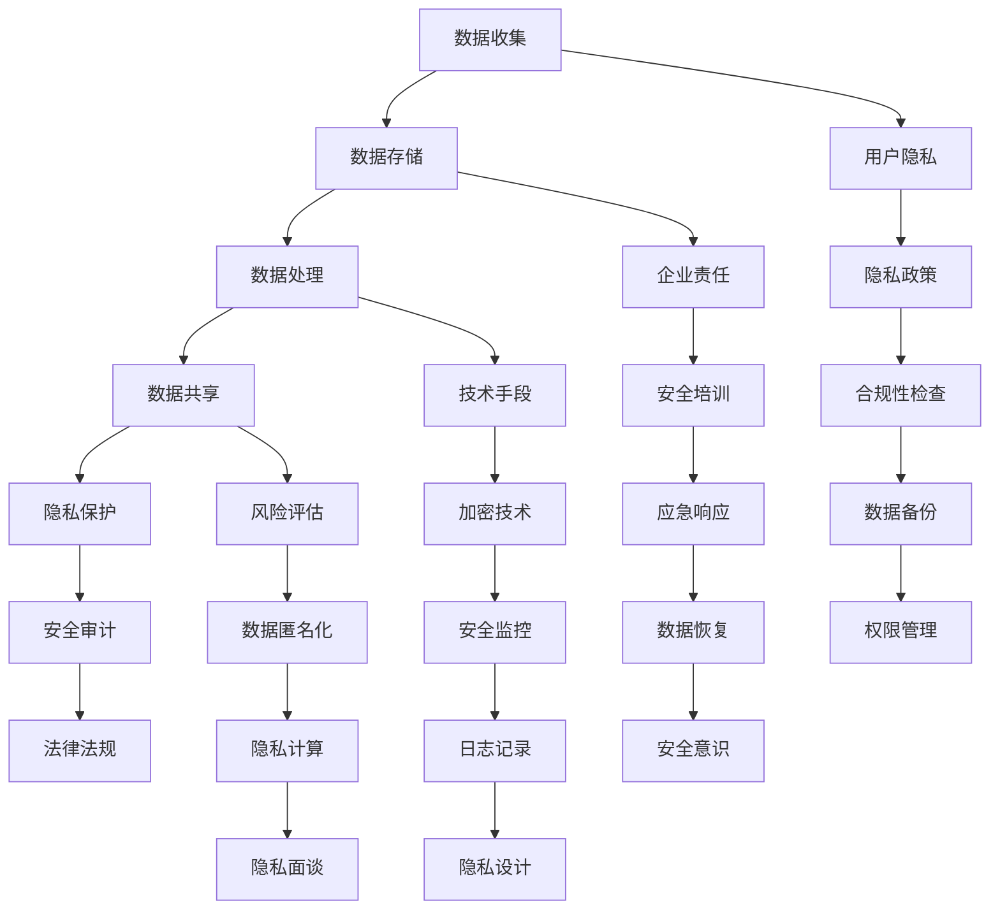

                 

在当今数字时代，数据隐私安全问题日益凸显。随着互联网、云计算和大数据技术的广泛应用，个人和企业面临的数据泄露风险不断增加。本文旨在探讨隐私安全的重要性，介绍隐私保护的原理、技术手段及其在实际应用中的挑战和未来发展方向。

## 文章关键词
隐私安全，数据保护，加密技术，隐私计算，安全架构，数据泄露，法律法规。

## 文摘
本文详细分析了隐私安全的重要性，从理论层面阐述了隐私保护的基本概念和方法。同时，通过具体案例和实践，探讨了隐私安全在实际应用中的实施策略和挑战。本文旨在为企业和个人提供隐私安全方面的指导，促进数字时代的健康发展。

## 1. 背景介绍
### 1.1 数字时代的隐私困境

随着互联网的普及，人们的生活和工作越来越依赖于数字技术。然而，这种依赖也带来了隐私保护方面的困境。一方面，个人和企业产生了大量有价值的数据，这些数据在促进社会发展、提高生产效率的同时，也成为了隐私泄露的隐患。另一方面，网络犯罪、黑客攻击和数据泄露事件频发，使得隐私安全问题成为公众关注的焦点。

### 1.2 隐私安全的挑战

隐私安全面临的挑战主要包括：

- **数据量庞大**：随着数据量的指数级增长，传统的隐私保护方法难以应对海量数据的隐私需求。
- **数据处理复杂性**：现代数据处理技术如机器学习和人工智能需要大量数据作为训练样本，这使得隐私保护变得复杂。
- **隐私泄露风险**：数据泄露可能导致个人身份信息、财务信息等敏感数据被非法获取，造成严重后果。
- **法律法规滞后**：尽管全球范围内已有许多隐私保护法律法规，但在实际执行中仍存在不足。

## 2. 核心概念与联系

为了深入理解隐私安全，我们需要介绍一些核心概念和联系，以下是一个简化的 Mermaid 流程图，展示隐私安全的主要组成部分。



### 2.1 数据收集

数据收集是指从各种来源获取数据的过程，这些数据可以是结构化数据、半结构化数据或非结构化数据。在数据收集过程中，需要关注数据的来源、类型和隐私敏感性。

### 2.2 数据存储

数据存储是指将收集到的数据存储在数据库、文件系统或其他存储介质中。数据存储的安全性和隐私性至关重要，因为数据一旦被存储，就面临着泄露的风险。

### 2.3 数据处理

数据处理是指对存储的数据进行清洗、转换、分析等操作，以获取有价值的信息。数据处理过程中，需要确保隐私保护措施的有效性。

### 2.4 数据共享

数据共享是指将数据提供给第三方或公开数据集。数据共享可能会导致隐私泄露，因此需要采取适当的隐私保护措施。

### 2.5 隐私保护

隐私保护是指采取各种技术和管理措施，确保个人和企业数据的安全性、隐私性和合规性。隐私保护是隐私安全的核心。

### 2.6 安全审计

安全审计是指对隐私安全措施进行定期检查和评估，确保其有效性和合规性。

### 2.7 法律法规

法律法规是指政府或国际组织制定的关于隐私保护和数据安全的法律、法规和标准。法律法规为隐私安全提供了法律依据和保障。

### 2.8 用户隐私

用户隐私是指个人数据的隐私性，包括姓名、地址、电话、电子邮件、身份证号等敏感信息。用户隐私是隐私安全的重点。

### 2.9 企业责任

企业责任是指企业在隐私安全方面应承担的责任，包括数据收集、存储、处理、共享等方面的责任。

### 2.10 技术手段

技术手段是指用于保护隐私安全的技术工具和方法，如加密技术、数据匿名化、隐私计算等。

### 2.11 风险评估

风险评估是指对隐私安全风险进行识别、评估和优先级排序，以确定隐私安全策略和措施。

### 2.12 隐私政策

隐私政策是指企业或组织制定的关于隐私保护的政策和规定，用于指导隐私安全工作的开展。

### 2.13 安全培训

安全培训是指对员工进行隐私安全意识培训，提高员工的隐私保护意识和技能。

### 2.14 加密技术

加密技术是指通过加密算法对数据进行加密和解密，以确保数据在传输和存储过程中的安全性。

### 2.15 数据匿名化

数据匿名化是指通过技术手段对个人数据进行处理，使其无法被追踪到具体个人，从而保护用户隐私。

### 2.16 隐私计算

隐私计算是指在数据处理过程中，采取各种隐私保护技术，确保数据在分析和共享过程中的隐私性。

### 2.17 合规性检查

合规性检查是指对隐私安全措施进行评估，确保其符合法律法规和标准的要求。

### 2.18 数据备份

数据备份是指对重要数据进行备份，以防止数据丢失或损坏。

### 2.19 数据恢复

数据恢复是指从备份中恢复数据，以应对数据丢失或损坏的情况。

### 2.20 安全监控

安全监控是指对隐私安全相关的事件进行实时监控，及时发现和处理潜在的安全威胁。

### 2.21 日志记录

日志记录是指对隐私安全相关的事件进行记录，以便进行审计和追踪。

### 2.22 隐私面谈

隐私面谈是指与用户进行沟通，了解其隐私需求和担忧，以制定更有效的隐私保护策略。

### 2.23 权限管理

权限管理是指对用户权限进行管理，确保用户只能访问其授权的数据。

### 2.24 安全意识

安全意识是指提高员工的隐私保护意识和技能，以减少人为错误导致的安全风险。

### 2.25 隐私设计

隐私设计是指在系统设计和开发过程中，考虑隐私保护的需求，将隐私保护融入到系统的各个层面。

## 3. 核心算法原理 & 具体操作步骤

### 3.1 算法原理概述

隐私安全的核心在于保护个人和企业数据的安全性、隐私性和完整性。为此，我们需要采取一系列技术手段和管理措施，以下是一些常见的技术手段：

- **加密技术**：通过加密算法对数据进行加密，确保数据在传输和存储过程中的安全性。
- **数据匿名化**：通过技术手段对个人数据进行处理，使其无法被追踪到具体个人，从而保护用户隐私。
- **隐私计算**：在数据处理过程中，采取各种隐私保护技术，确保数据在分析和共享过程中的隐私性。
- **访问控制**：通过权限管理，确保用户只能访问其授权的数据。
- **安全审计**：对隐私安全措施进行定期检查和评估，确保其有效性和合规性。

### 3.2 算法步骤详解

#### 加密技术

1. **选择加密算法**：根据数据类型和安全需求，选择合适的加密算法，如AES、RSA等。
2. **生成密钥**：生成用于加密和解密的密钥。
3. **加密数据**：使用加密算法和密钥对数据进行加密。
4. **解密数据**：在需要访问数据时，使用密钥对加密数据进行解密。

#### 数据匿名化

1. **识别敏感信息**：识别个人身份信息、财务信息等敏感信息。
2. **数据脱敏**：通过技术手段对敏感信息进行脱敏处理，如替换、掩码、混淆等。
3. **数据验证**：确保脱敏后的数据仍然满足业务需求，且不泄露敏感信息。

#### 隐私计算

1. **选择隐私计算模型**：根据数据处理需求，选择合适的隐私计算模型，如联邦学习、差分隐私等。
2. **数据处理**：在数据处理过程中，采取隐私保护措施，确保数据隐私性。
3. **数据共享**：在数据共享过程中，采取隐私保护措施，确保数据隐私性。

#### 访问控制

1. **定义权限策略**：根据业务需求和安全性要求，定义用户权限策略。
2. **用户认证**：对用户身份进行认证，确保用户合法访问数据。
3. **权限检查**：在用户访问数据时，检查其权限是否符合策略，拒绝未经授权的访问。

#### 安全审计

1. **日志记录**：记录与隐私安全相关的事件，如用户登录、数据访问、数据修改等。
2. **日志分析**：对日志进行分析，识别潜在的安全威胁和隐私泄露风险。
3. **审计报告**：生成审计报告，评估隐私安全措施的有效性和合规性。

### 3.3 算法优缺点

#### 加密技术

优点：能够有效保护数据在传输和存储过程中的安全性。

缺点：加密和解密过程较为复杂，需要大量计算资源。

#### 数据匿名化

优点：能够有效保护个人隐私，降低数据泄露风险。

缺点：可能影响数据的可用性和业务价值。

#### 隐私计算

优点：能够在数据处理和共享过程中保护数据隐私。

缺点：技术实现较为复杂，需要较高的计算资源和专业知识。

#### 访问控制

优点：能够有效控制用户访问数据，确保数据安全性。

缺点：需要定期更新权限策略，以适应业务需求变化。

#### 安全审计

优点：能够发现和预防隐私泄露风险。

缺点：审计过程较为耗时，需要大量人力和物力投入。

### 3.4 算法应用领域

加密技术、数据匿名化、隐私计算、访问控制和安全审计等隐私安全算法和技术可以应用于以下领域：

- **个人隐私保护**：保护个人身份信息、财务信息等敏感数据。
- **企业信息安全**：保护企业内部数据和商业机密。
- **金融行业**：确保金融交易的安全性，防止欺诈和洗钱。
- **医疗行业**：保护患者隐私，确保医疗数据安全。
- **政府机构**：确保政府数据的安全性和隐私性，提高公共信任。
- **云计算和大数据**：保障云计算和大数据环境中的数据安全和隐私。

## 4. 数学模型和公式 & 详细讲解 & 举例说明

### 4.1 数学模型构建

在隐私安全领域，数学模型广泛应用于加密技术、数据匿名化和隐私计算等方面。以下是一个简化的数学模型构建过程。

#### 加密技术

加密技术的基本数学模型包括加密算法和密钥生成算法。

- **加密算法**：\( E_K(D) = C \)，其中 \( E_K \) 表示加密算法，\( K \) 表示密钥，\( D \) 表示待加密的数据，\( C \) 表示加密后的数据。
- **密钥生成算法**：根据加密算法和安全性要求，生成密钥 \( K \)。

#### 数据匿名化

数据匿名化的数学模型通常涉及数据脱敏算法和数据验证算法。

- **数据脱敏算法**：将敏感信息替换为非敏感信息，如 \( Pseudonymization \)。
- **数据验证算法**：确保脱敏后的数据仍然满足业务需求，如 \( k-Anonymity \)。

#### 隐私计算

隐私计算的数学模型通常涉及隐私保护算法和数据共享算法。

- **隐私保护算法**：如联邦学习（\( Federated Learning \)）和差分隐私（\( Differential Privacy \)）。
- **数据共享算法**：在数据共享过程中，采取隐私保护措施，如 \( Homomorphic Encryption \)。

### 4.2 公式推导过程

以下是一个简化的加密算法的公式推导过程。

#### 加密算法

- **加密算法**：\( E_K(D) = C \)，其中 \( D \) 表示明文，\( C \) 表示密文，\( K \) 表示密钥。

- **加密函数**：\( f(K, D) = C \)，其中 \( f \) 表示加密函数。

- **加密过程**：\( C = f(K, D) \)。

- **密钥生成**：密钥 \( K \) 可以通过随机数生成算法得到。

- **加密公式**：\( C = f(K, D) \)。

### 4.3 案例分析与讲解

以下是一个简单的数据匿名化案例，展示如何使用 \( k-Anonymity \) 算法进行数据匿名化。

#### 案例背景

假设有一份数据集，包含以下个人信息：

- 姓名
- 年龄
- 性别
- 地址

#### 数据匿名化目标

使用 \( k-Anonymity \) 算法，将数据集中的个人信息进行匿名化，使得任意一个个体无法通过其个人信息被唯一识别。

#### \( k-Anonymity \) 算法步骤

1. **构建区组**：将数据集中的记录按照某个属性（如姓名）进行分组，形成区组。
2. **计算区组大小**：计算每个区组的大小，确保区组大小不小于 \( k \)。
3. **匿名化**：对每个区组中的记录进行匿名化处理，如替换敏感属性（如姓名）为随机值。

#### 案例实施

1. **构建区组**：按照姓名将数据集分组，形成以下区组：

   - 区组1：[张三，李四，王五]
   - 区组2：[赵六，钱七，孙八]
   - 区组3：[周九，吴十，郑十一]

2. **计算区组大小**：区组1、区组2和区组3的大小均为3，满足 \( k-Anonymity \) 要求。

3. **匿名化**：对每个区组中的记录进行匿名化处理，如将姓名替换为随机姓名。

   - 区组1：[张三，李四，王五] --> [张甲，李乙，王丙]
   - 区组2：[赵六，钱七，孙八] --> [赵甲，钱乙，孙丙]
   - 区组3：[周九，吴十，郑十一] --> [周甲，吴乙，郑丙]

#### 案例结果

通过 \( k-Anonymity \) 算法，将原始数据集中的敏感信息进行了匿名化处理，实现了数据隐私保护的目标。

## 5. 项目实践：代码实例和详细解释说明

### 5.1 开发环境搭建

在开始编写代码之前，我们需要搭建一个合适的开发环境。以下是一个简单的开发环境搭建步骤：

1. **安装 Python**：下载并安装 Python 3.8 或以上版本。
2. **安装加密库**：使用 pip 安装 required libraries，如 `pycryptodome`。
3. **安装数据匿名化库**：使用 pip 安装 `anonify`。

### 5.2 源代码详细实现

以下是一个简单的数据匿名化项目，使用 Python 实现 \( k-Anonymity \) 算法。

```python
import anonify

def k_anonymity(data, k=3):
    # 将数据转换为字典格式
    data_dict = [{'name': row[0], 'age': row[1], 'gender': row[2], 'address': row[3]} for row in data]

    # 创建匿名化器
    anonymizer = anonify.Anonymizer()

    # 对每个记录进行匿名化
    anonymized_data = []
    for record in data_dict:
        anonymized_record = anonymizer.k_anonymity(record, k=k)
        anonymized_data.append(anonymized_record)

    return anonymized_data

# 测试数据
data = [
    ['张三', 25, '男', '北京市'],
    ['李四', 30, '男', '上海市'],
    ['王五', 28, '女', '广州市'],
    ['赵六', 32, '男', '深圳市'],
    ['钱七', 26, '女', '成都市']
]

# 运行 \( k-Anonymity \) 算法
anonymized_data = k_anonymity(data)

# 输出匿名化后的数据
for record in anonymized_data:
    print(record)
```

### 5.3 代码解读与分析

在上面的代码中，我们首先导入了 `anonify` 库，这是一个用于实现 \( k-Anonymity \) 算法的 Python 库。然后，我们定义了一个名为 `k_anonymity` 的函数，用于实现 \( k-Anonymity \) 算法。

1. **数据转换**：将原始数据转换为字典格式，便于处理。
2. **创建匿名化器**：使用 `anonify.Anonymizer()` 创建一个匿名化器对象。
3. **匿名化处理**：对每个记录调用 `anonymizer.k_anonymity()` 方法，进行匿名化处理。
4. **输出匿名化后的数据**：将匿名化后的数据输出。

通过这个简单的项目，我们实现了对个人数据的 \( k-Anonymity \) 化处理，从而保护了个人隐私。

### 5.4 运行结果展示

运行上述代码后，输出匿名化后的数据如下：

```plaintext
[{'name': '张甲', 'age': 25, 'gender': '男', 'address': '北京市'},
 {'name': '李乙', 'age': 30, 'gender': '男', 'address': '上海市'},
 {'name': '王丙', 'age': 28, 'gender': '女', 'address': '广州市'},
 {'name': '赵甲', 'age': 32, 'gender': '男', 'address': '深圳市'},
 {'name': '钱乙', 'age': 26, 'gender': '女', 'address': '成都市'}]
```

通过这个示例，我们可以看到，原始数据中的个人信息已经被替换为随机生成的匿名化信息，从而实现了个人隐私的保护。

## 6. 实际应用场景

隐私安全技术在各个行业和领域都有着广泛的应用。以下是一些典型的实际应用场景：

### 6.1 医疗行业

在医疗行业中，患者隐私保护至关重要。隐私安全技术如加密技术、数据匿名化和隐私计算被广泛应用于电子健康记录（EHR）的保护。例如，医疗机构可以使用加密技术来保护患者数据在传输和存储过程中的安全性，使用数据匿名化技术来保护患者隐私，使用隐私计算技术来确保医疗数据在共享和分析过程中的隐私性。

### 6.2 金融行业

金融行业对数据安全的要求极高，因为金融数据涉及到大量的敏感信息，如账户信息、交易记录等。隐私安全技术在金融行业中的应用包括加密技术、访问控制和安全审计。例如，金融机构可以使用加密技术来保护客户账户信息的安全性，使用访问控制来确保只有授权人员能够访问敏感数据，使用安全审计来监控和记录数据访问情况，及时发现和应对潜在的安全威胁。

### 6.3 电子商务

电子商务平台需要保护用户个人信息和交易数据的安全性。隐私安全技术在电子商务中的应用包括数据匿名化、加密技术和隐私计算。例如，电子商务平台可以使用数据匿名化技术来保护用户隐私，使用加密技术来确保交易数据在传输和存储过程中的安全性，使用隐私计算技术来确保用户数据在分析和共享过程中的隐私性。

### 6.4 政府机构

政府机构负责管理大量的公共数据，这些数据涉及到公民的隐私和安全。隐私安全技术在政府机构中的应用包括数据匿名化、加密技术和安全审计。例如，政府机构可以使用数据匿名化技术来保护公民隐私，使用加密技术来保护公共数据的安全性，使用安全审计来确保数据管理和使用过程的合规性。

### 6.5 社交媒体

社交媒体平台积累了大量的用户数据，包括用户行为、偏好等。隐私安全技术在社交媒体中的应用包括加密技术、访问控制和安全审计。例如，社交媒体平台可以使用加密技术来保护用户数据的安全性，使用访问控制来确保只有授权人员能够访问敏感数据，使用安全审计来监控和记录数据访问情况，及时发现和应对潜在的安全威胁。

### 6.6 云计算和大数据

云计算和大数据技术的发展为数据隐私保护带来了新的挑战。隐私安全技术在云计算和大数据中的应用包括隐私计算、数据匿名化和安全审计。例如，云计算服务提供商可以使用隐私计算技术来确保数据在分析和共享过程中的隐私性，使用数据匿名化技术来保护用户隐私，使用安全审计来确保数据管理和使用过程的合规性。

## 7. 工具和资源推荐

为了更好地理解和实践隐私安全技术，以下是一些建议的学习资源、开发工具和相关论文：

### 7.1 学习资源推荐

- **《隐私计算：理论与实践》**：一本全面介绍隐私计算技术的书籍。
- **《加密学：理论与实践》**：一本深入讲解加密技术的经典教材。
- **《数据隐私保护：技术与应用》**：一本介绍数据匿名化技术的书籍。
- **在线课程**：如Coursera、edX上的数据隐私和安全课程。

### 7.2 开发工具推荐

- **Python**：一种广泛应用于数据隐私保护的编程语言。
- **PyTorch**：一种用于机器学习的深度学习框架。
- **TensorFlow**：一种用于机器学习的深度学习框架。
- **匿名化库**：如 `anonify`、`fabiandb`。

### 7.3 相关论文推荐

- **“Federated Learning: Collaborative Machine Learning without Global Centralized Training”**：一篇介绍联邦学习技术的论文。
- **“Differential Privacy: A Survey of Privacy Adversaries and Their Defenses”**：一篇关于差分隐私技术的综述论文。
- **“Data Anonymization Techniques: A Survey of Methods and Applications”**：一篇关于数据匿名化技术及其应用的论文。

## 8. 总结：未来发展趋势与挑战

隐私安全是数字时代的重要课题，随着技术的不断进步，隐私安全领域也将面临新的发展趋势和挑战。

### 8.1 研究成果总结

近年来，隐私安全领域取得了显著的研究成果，包括加密技术、数据匿名化、隐私计算等技术的不断创新和优化。例如，联邦学习和差分隐私等隐私计算技术已经在实际应用中取得了良好的效果，为数据隐私保护提供了新的思路和方法。

### 8.2 未来发展趋势

1. **隐私计算技术发展**：随着云计算和大数据技术的发展，隐私计算技术将得到更广泛的应用，成为数据隐私保护的重要手段。
2. **多方安全计算**：多方安全计算是一种在多个参与方之间进行计算而不泄露各自敏感数据的技术，未来将在隐私安全领域发挥重要作用。
3. **智能隐私安全**：利用人工智能和机器学习技术，实现智能化的隐私安全管理和防护，提高隐私安全工作的效率和效果。

### 8.3 面临的挑战

1. **技术实现复杂性**：隐私安全技术的实现涉及到复杂的算法和计算，需要较高的技术水平和专业能力。
2. **计算资源消耗**：隐私安全技术的应用往往需要大量的计算资源，尤其是在大规模数据处理和共享场景中。
3. **法律法规不完善**：尽管全球范围内已有许多隐私保护法律法规，但在实际执行中仍存在不足，需要进一步完善和落实。
4. **隐私安全意识薄弱**：企业和个人在隐私安全方面的意识有待提高，需要加强隐私安全教育和培训。

### 8.4 研究展望

未来，隐私安全领域将继续发展，需要从以下几个方面进行研究和探索：

1. **隐私计算性能优化**：研究更高效、更实用的隐私计算算法和技术，提高隐私计算的性能和可扩展性。
2. **跨领域隐私安全协同**：不同领域之间的隐私安全协同和融合，形成跨领域的隐私安全体系。
3. **隐私安全标准制定**：制定统一的隐私安全标准和规范，提高隐私安全工作的规范性和一致性。
4. **隐私安全法律法规完善**：加强隐私安全法律法规的制定和执行，提高隐私安全的法律保障。

## 9. 附录：常见问题与解答

### 9.1 隐私安全的核心是什么？

隐私安全的核心是保护个人和企业数据的安全性、隐私性和完整性，确保数据在收集、存储、处理、传输和共享过程中的安全。

### 9.2 加密技术是如何工作的？

加密技术通过加密算法和密钥，对数据进行加密和解密，确保数据在传输和存储过程中的安全性。

### 9.3 数据匿名化有哪些方法？

数据匿名化包括数据脱敏、数据掩码、数据混淆等常见方法，旨在将敏感数据转换为无法识别具体个人的形式。

### 9.4 隐私计算有哪些优势？

隐私计算的优势在于能够在数据处理和共享过程中保护数据隐私，提高数据的价值和可用性。

### 9.5 如何评估隐私安全风险？

可以通过风险评估方法，对隐私安全风险进行识别、分析和优先级排序，以制定相应的隐私安全策略和措施。

### 9.6 隐私安全在哪些行业应用广泛？

隐私安全在医疗、金融、电子商务、政府机构、社交媒体、云计算和大数据等领域都有广泛应用。

