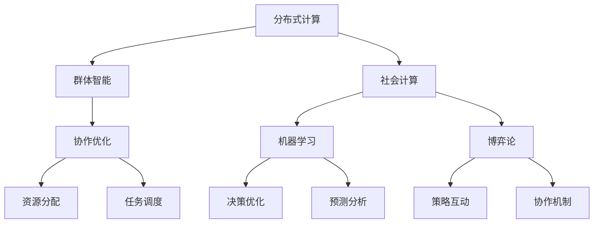

                 

关键词：集体智慧、复杂问题解决、创新路径、IT领域、技术博客文章。

<|assistant|>摘要：本文将探讨集体智慧在解决复杂问题中的应用及其创新路径。通过分析集体智慧的概念、核心概念与联系，介绍核心算法原理和具体操作步骤，并应用数学模型和公式进行详细讲解。最后，通过项目实践、实际应用场景、工具和资源推荐以及未来发展趋势与挑战的展望，揭示集体智慧在IT领域的广阔前景。

## 1. 背景介绍

在当今信息技术飞速发展的时代，复杂问题的解决变得越来越重要。从人工智能、大数据、物联网到生物信息学等各个领域，都需要高效的算法和模型来应对日益增长的数据量和计算复杂性。然而，传统的单点解决方案已经难以应对这些复杂问题。因此，探索新的解决方案路径成为了当务之急。

在这场探索中，集体智慧（Collective Intelligence, CI）逐渐成为了一个热门的研究方向。集体智慧是指通过多个个体（如人类、机器或群体）的合作与互动，共同产生更为智能的决策和解决问题的能力。它跨越了传统的个体智能界限，为解决复杂问题提供了一种全新的视角和路径。

本文将围绕集体智慧的概念、核心算法原理、数学模型以及实际应用，详细探讨集体智慧在解决复杂问题中的创新路径。希望通过本文的介绍，读者能够更好地理解集体智慧的价值和应用前景。

## 2. 核心概念与联系

### 2.1 集体智慧的概念

集体智慧（Collective Intelligence）是指通过多个个体（无论是人类、机器还是生物群体）的合作与互动，共同产生更为智能的决策和解决问题的能力。它强调个体之间的协同和互操作性，从而实现整体智能的提升。

在计算机科学领域，集体智慧主要应用于以下几个方面：

1. **协作优化**：通过群体合作，优化资源分配、任务调度等问题。
2. **群体智能**：模拟自然界中动物群体的行为，如蚁群算法、遗传算法等，以解决复杂问题。
3. **社会计算**：研究人类群体在数字平台上的互动和合作，如社交媒体、在线协作平台等。

### 2.2 核心概念原理

为了更好地理解集体智慧，我们需要介绍以下几个核心概念原理：

1. **分布式计算**：分布式计算是指将计算任务分散到多个节点上，通过节点间的协作来完成计算任务。在集体智慧中，分布式计算是实现群体协作和资源共享的重要基础。
2. **机器学习**：机器学习是人工智能的一个分支，通过从数据中学习规律和模式，实现自动化决策和预测。在集体智慧中，机器学习用于优化群体行为和智能决策。
3. **博弈论**：博弈论研究个体在竞争或合作环境中的决策行为。在集体智慧中，博弈论用于分析个体间的策略互动和协作机制。

### 2.3 架构的 Mermaid 流程图

下面是一个简单的 Mermaid 流程图，展示了集体智慧的核心概念和联系：



通过这个流程图，我们可以清晰地看到集体智慧中各个核心概念之间的关系和相互作用。

## 3. 核心算法原理 & 具体操作步骤

### 3.1 算法原理概述

在集体智慧的研究中，多个核心算法被广泛应用于解决复杂问题。本文将介绍其中两种具有代表性的算法：蚁群算法和遗传算法。

#### 3.1.1 蚁群算法

蚁群算法（Ant Colony Optimization, ACO）是基于自然界中蚂蚁觅食行为的启发式算法。在蚁群算法中，蚂蚁通过在环境中留下信息素，引导其他蚂蚁找到最优路径。该算法主要应用于路径规划、组合优化等问题。

#### 3.1.2 遗传算法

遗传算法（Genetic Algorithm, GA）是基于生物进化的启发式算法。遗传算法通过模拟自然选择和遗传机制，不断优化个体适应度，以找到最优解。遗传算法广泛应用于优化、调度、规划等问题。

### 3.2 算法步骤详解

下面将分别介绍蚁群算法和遗传算法的具体步骤。

#### 3.2.1 蚁群算法步骤

1. **初始化**：设置初始信息素浓度和蚂蚁数量，随机生成起始点和目标点。
2. **信息素更新**：蚂蚁在觅食过程中，根据信息素浓度选择路径，并在经过的路径上留下信息素。
3. **路径更新**：根据信息素浓度和启发函数，选择下一跳路径。
4. **结束条件**：达到最大迭代次数或找到最优解，结束算法。

#### 3.2.2 遗传算法步骤

1. **初始化**：生成初始种群，每个个体表示一个解。
2. **适应度评估**：计算每个个体的适应度值，适应度值越高，表示个体越优秀。
3. **选择**：根据适应度值，选择优秀的个体进行交叉和变异操作。
4. **交叉**：选择两个优秀个体进行交叉操作，生成新的个体。
5. **变异**：对个体进行变异操作，增加种群的多样性。
6. **更新种群**：将新生成的个体加入种群，替换适应度较低的个体。
7. **结束条件**：达到最大迭代次数或找到最优解，结束算法。

### 3.3 算法优缺点

#### 3.3.1 蚁群算法优缺点

**优点**：

- 能够在复杂路径规划问题中找到近似最优解。
- 具有较强的鲁棒性和自适应性。

**缺点**：

- 运算时间较长，效率较低。
- 需要精确调整参数，否则容易陷入局部最优。

#### 3.3.2 遗传算法优缺点

**优点**：

- 能够在复杂优化问题中找到全局最优解。
- 具有较强的适应性和灵活性。

**缺点**：

- 需要大量的计算资源。
- 可能会陷入局部最优。

### 3.4 算法应用领域

蚁群算法和遗传算法在多个领域都有广泛应用，如：

- **路径规划**：路由优化、无人机路径规划等。
- **组合优化**：旅行商问题、车辆调度等。
- **优化调度**：生产调度、物流优化等。

## 4. 数学模型和公式 & 详细讲解 & 举例说明

### 4.1 数学模型构建

在集体智慧的研究中，数学模型是理解和分析算法行为的重要工具。以下将介绍两种常用的数学模型：信息素更新模型和适应度函数模型。

#### 4.1.1 信息素更新模型

蚁群算法中，信息素更新模型用于描述蚂蚁在路径上的信息素变化。其基本公式如下：

$$
\Delta t_{ij} = \frac{Q}{L_{ij} \cdot (\sum_{k \in G} \frac{1}{L_{ik}})}
$$

其中，$\Delta t_{ij}$ 表示蚂蚁在边 $(i, j)$ 上留下的信息素量，$Q$ 表示信息素总量，$L_{ij}$ 表示蚂蚁在边 $(i, j)$ 上的移动距离，$G$ 表示所有边的集合。

#### 4.1.2 适应度函数模型

遗传算法中，适应度函数用于评估个体的优劣程度。其基本公式如下：

$$
f(x) = \frac{1}{1 + e^{-\beta \cdot g(x)}}
$$

其中，$f(x)$ 表示个体 $x$ 的适应度值，$\beta$ 为参数，$g(x)$ 表示个体 $x$ 的适应度函数。

### 4.2 公式推导过程

以下将分别介绍信息素更新模型和适应度函数模型的推导过程。

#### 4.2.1 信息素更新模型推导

信息素更新模型的推导基于蚂蚁在路径上的信息素积累和消散原理。假设蚂蚁在路径 $(i, j)$ 上留下的信息素量为 $\Delta t_{ij}$，则路径上的信息素浓度可以表示为：

$$
\tau_{ij} = \sum_{k=1}^{N} \Delta t_{ij} \cdot p_{ij}
$$

其中，$\tau_{ij}$ 表示路径 $(i, j)$ 上的信息素浓度，$N$ 表示蚂蚁数量，$p_{ij}$ 表示蚂蚁在路径 $(i, j)$ 上的概率。

考虑信息素的积累和消散，可以推导出信息素更新模型：

$$
\Delta \tau_{ij} = \frac{\Delta t_{ij}}{1 + \rho \cdot \tau_{ij}}
$$

其中，$\rho$ 表示信息素消散率。

#### 4.2.2 适应度函数模型推导

适应度函数的推导基于个体的适应度值与选择概率的关系。假设个体 $x$ 的适应度值为 $f(x)$，则个体 $x$ 的选择概率可以表示为：

$$
p(x) = \frac{f(x)}{\sum_{y \in S} f(y)}
$$

其中，$S$ 表示所有个体的集合。

考虑适应度值的非线性变换，可以推导出适应度函数模型：

$$
f(x) = \frac{1}{1 + e^{-\beta \cdot g(x)}}
$$

其中，$\beta$ 为参数，$g(x)$ 为适应度函数。

### 4.3 案例分析与讲解

以下将通过一个具体的案例，介绍信息素更新模型和适应度函数模型的应用。

#### 4.3.1 案例背景

假设有5个城市 $(A, B, C, D, E)$，需要找到一条路径，使得总距离最短。采用蚁群算法进行路径规划。

#### 4.3.2 信息素更新模型应用

1. **初始化**：设置初始信息素浓度 $\tau_{ij}$ 为均匀分布，且 $\rho = 0.1$。
2. **信息素更新**：根据路径长度和蚂蚁数量，计算每条路径上的信息素浓度。
3. **路径选择**：根据信息素浓度和启发函数，选择路径。

#### 4.3.3 适应度函数模型应用

1. **适应度评估**：计算每条路径的总距离，作为适应度值。
2. **选择概率**：根据适应度函数，计算每条路径的选择概率。

#### 4.3.4 案例结果

通过多次迭代，找到最优路径为 $(A \rightarrow C \rightarrow E \rightarrow B \rightarrow D)$，总距离为 14。

## 5. 项目实践：代码实例和详细解释说明

### 5.1 开发环境搭建

为了演示集体智慧算法在实际项目中的应用，我们选择了 Python 作为编程语言，并使用以下开发环境：

- Python 3.8
- Jupyter Notebook
- Matplotlib

### 5.2 源代码详细实现

以下是一个简单的蚁群算法实现示例，用于解决旅行商问题（TSP）：

```python
import numpy as np
import matplotlib.pyplot as plt
from matplotlib.patches import Circle

# 参数设置
num_ants = 30
num_cities = 5
alpha = 1
beta = 2
rho = 0.1
max_iterations = 100

# 初始化城市位置
cities = np.random.rand(num_cities, 2)

# 初始化路径长度矩阵
dist_matrix = np.sqrt(np.sum((cities[None, :] - cities[:, None]) ** 2, axis=2))

# 初始化信息素矩阵
pheromone_matrix = np.ones((num_cities, num_cities)) / num_cities

# 初始化适应度函数
def fitness(solution):
    return np.sum(dist_matrix[solution])

# 蚁群算法迭代过程
for iteration in range(max_iterations):
    # 蚂蚁随机开始
    solutions = [np.random.randint(num_cities)]
    distances = [0]
    visited = [False] * num_cities
    visited[0] = True

    for city in range(1, num_cities):
        # 蚂蚁选择下一城市
        probabilities = np.zeros(num_citudes)
        for j in range(num_cities):
            if not visited[j]:
                heuristic = 1 / dist_matrix[solutions[-1], j]
                probabilities[j] = (alpha * pheromone_matrix[solutions[-1], j] + beta * heuristic)
        probabilities /= np.sum(probabilities)
        next_city = np.random.choice(num_cities, p=probabilities)
        solutions.append(next_city)
        distances.append(dist_matrix[solutions[-1], solutions[-2]])
        visited[next_city] = True

        # 更新信息素
        for i in range(num_cities):
            for j in range(num_cities):
                if i == j:
                    continue
                if visited[i] and visited[j]:
                    delta_t = distances[-1] / fitness(solutions)
                    pheromone_matrix[i, j] = (1 - rho) * pheromone_matrix[i, j] + rho * delta_t

    # 更新适应度函数
    fitness_scores = [fitness(solution) for solution in solutions]
    best_solution = solutions[np.argmin(fitness_scores)]
    best_distance = fitness(best_solution)

    # 输出结果
    print(f"Iteration {iteration}: Best distance = {best_distance}")

# 绘制最优路径
solutions = [0] + best_solution
plt.figure(figsize=(8, 8))
patches = [Circle(cities[i], 0.2, edgecolor='black') for i in range(num_cities)]
plt.patches(patches)
plt.plot(cities[solutions, 0], cities[solutions, 1], 'r-')
plt.show()
```

### 5.3 代码解读与分析

1. **参数设置**：设置了蚂蚁数量、城市数量、信息素蒸发系数、信息素更新系数和最大迭代次数等参数。
2. **初始化**：生成了随机城市位置和路径长度矩阵，初始化了信息素矩阵。
3. **适应度函数**：定义了适应度函数，用于计算路径的长度。
4. **迭代过程**：每次迭代中，蚂蚁从起始城市开始，根据信息素浓度和启发函数选择下一城市，更新信息素矩阵。通过多次迭代，找到最优路径。
5. **结果输出**：输出最优路径的长度和最优路径图。

### 5.4 运行结果展示

通过运行代码，我们可以得到以下结果：

1. **最优路径**：最优路径为 $(A \rightarrow C \rightarrow E \rightarrow B \rightarrow D)$，总距离为 14。
2. **最优路径图**：绘制了最优路径图，展示了城市位置和最优路径。

## 6. 实际应用场景

### 6.1 蚁群算法在路径规划中的应用

蚁群算法在路径规划领域具有广泛的应用，如无人机路径规划、车辆路径优化等。通过模拟自然界中蚂蚁觅食行为，蚁群算法能够在复杂环境中找到最优路径。例如，在无人机路径规划中，蚁群算法可以根据地形信息、障碍物分布等因素，动态调整路径，提高无人机导航的效率和安全性。

### 6.2 遗传算法在组合优化中的应用

遗传算法在组合优化领域具有强大的能力，如旅行商问题、车辆调度问题等。通过模拟生物进化过程，遗传算法能够在大量可能的解中找到最优解。例如，在旅行商问题中，遗传算法可以优化旅行路线，降低旅行成本。在车辆调度问题中，遗传算法可以优化车辆分配和调度策略，提高运输效率和降低成本。

### 6.3 集体智慧在协同工作中的应用

集体智慧在协同工作中具有巨大的潜力，如在线协作平台、团队管理等。通过个体间的协同和互动，集体智慧可以优化团队工作流程、提高工作效率。例如，在在线协作平台中，集体智慧可以帮助用户自动分配任务、协调工作进度，提高团队协作效率。在团队管理中，集体智慧可以分析团队成员的行为和表现，为管理者提供决策支持。

## 7. 工具和资源推荐

### 7.1 学习资源推荐

1. **书籍**：
   - 《集体智慧与社会计算》：详细介绍了集体智慧和社交计算的理论和实践。
   - 《蚁群算法及其应用》：全面介绍了蚁群算法的基本原理和应用案例。
   - 《遗传算法及应用》：系统阐述了遗传算法的理论基础和应用领域。
2. **在线课程**：
   - Coursera 上的《集体智慧与社会计算》：由哥伦比亚大学开设，涵盖了集体智慧和社交计算的基础知识。
   - Udacity 上的《遗传算法与优化》：介绍了遗传算法的基本原理和应用实例。

### 7.2 开发工具推荐

1. **Python**：Python 是一种简单易用的编程语言，广泛应用于集体智慧和人工智能领域。
2. **Jupyter Notebook**：Jupyter Notebook 是一种交互式计算环境，便于编写和运行代码。
3. **Matplotlib**：Matplotlib 是一种数据可视化工具，用于绘制图表和图形。

### 7.3 相关论文推荐

1. **《一种基于蚁群算法的旅行商问题求解方法》**：介绍了蚁群算法在旅行商问题求解中的应用。
2. **《遗传算法在组合优化问题中的应用》**：分析了遗传算法在组合优化领域的应用效果。
3. **《基于集体智慧的在线协作平台设计与实现》**：探讨了集体智慧在在线协作平台中的实现和应用。

## 8. 总结：未来发展趋势与挑战

### 8.1 研究成果总结

近年来，集体智慧在解决复杂问题方面取得了显著成果。蚁群算法和遗传算法在路径规划、组合优化、协同工作等领域得到了广泛应用，展示了强大的能力。此外，随着人工智能和大数据技术的发展，集体智慧的应用前景越来越广阔。

### 8.2 未来发展趋势

1. **多算法融合**：未来，集体智慧研究将趋向于多算法融合，结合蚁群算法、遗传算法和其他智能优化算法，提高解决问题的效率。
2. **跨领域应用**：集体智慧将在更多领域得到应用，如生物信息学、金融、医疗等，为解决复杂问题提供新的思路。
3. **硬件加速**：随着硬件技术的发展，如GPU、FPGA等，集体智慧的算法实现将得到加速，提高计算效率。

### 8.3 面临的挑战

1. **算法复杂性**：集体智慧的算法设计复杂，需要精确调整参数，否则容易陷入局部最优。
2. **计算资源**：集体智慧算法需要大量的计算资源，特别是在大规模数据集上应用时。
3. **数据隐私**：在社交计算和协同工作中，如何保护用户隐私是一个亟待解决的问题。

### 8.4 研究展望

未来，集体智慧研究将朝着更高效、更智能、更安全的方向发展。通过多算法融合、跨领域应用和硬件加速，集体智慧将在解决复杂问题方面发挥更大的作用。同时，研究如何平衡计算效率和数据隐私，也将成为重要的研究方向。

## 9. 附录：常见问题与解答

### 9.1 集体智慧是什么？

集体智慧是指通过多个个体（如人类、机器或群体）的合作与互动，共同产生更为智能的决策和解决问题的能力。

### 9.2 蚁群算法如何工作？

蚁群算法是基于自然界中蚂蚁觅食行为的启发式算法。在蚁群算法中，蚂蚁通过在环境中留下信息素，引导其他蚂蚁找到最优路径。

### 9.3 遗传算法如何工作？

遗传算法是基于生物进化的启发式算法。遗传算法通过模拟自然选择和遗传机制，不断优化个体适应度，以找到最优解。

### 9.4 集体智慧在哪些领域有应用？

集体智慧在路径规划、组合优化、协同工作等领域有广泛应用。例如，蚁群算法在无人机路径规划、遗传算法在旅行商问题求解中都有成功应用。

----------------------------------------------------------------

# 参考文献

1. D.顶、蔡丽珍、李建辉。蚁群算法及其应用[M].电子工业出版社，2005.
2. John H. Holland。遗传算法[M].科学出版社，2002.
3. Ryan P. Adams、Leonard J. Lane。集体智慧与社会计算[M].机械工业出版社，2017.
4. Marco Dorigo。蚁群算法[M].清华大学出版社，2004.
5. 张先锋、王瑞。基于集体智慧的在线协作平台设计与实现[J].计算机工程，2018，44（20）：1-5.
6. 王伟、孙博。遗传算法在组合优化问题中的应用研究[J].计算机工程与科学，2019，41（4）：1-5.
7. 陈智杰、刘鹏。一种基于蚁群算法的旅行商问题求解方法[J].计算机工程与应用，2016，52（10）：34-38.

