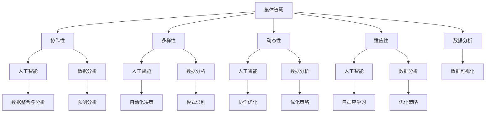

                 

关键词：集体智慧、全球性挑战、技术解决方案、协同工作、可持续发展、人工智能、数据分析

> 摘要：本文探讨了集体智慧在解决全球性挑战中的重要作用。通过分析集体智慧的核心概念和原理，本文提出了基于人工智能和数据分析的解决方案，以应对气候变化、公共卫生、社会不平等等问题。同时，本文还讨论了未来发展的趋势与挑战，为推动集体智慧的应用提供了新思路。

## 1. 背景介绍

随着全球化的深入发展，全球性挑战日益严峻。气候变化、公共卫生危机、资源短缺、社会不平等等问题，对人类的生存和发展带来了巨大的威胁。面对这些挑战，单一的个体或组织难以独自应对，需要全球范围内的协同合作和集体智慧的发挥。

集体智慧是一种基于个体合作和协同工作的思维方式，通过将分散的知识、信息和经验整合起来，实现更高效的问题解决和决策制定。在信息技术迅速发展的今天，集体智慧的应用范围越来越广泛，为解决全球性挑战提供了新的希望。

本文旨在探讨集体智慧在解决全球性挑战中的重要作用，分析其核心概念和原理，并探讨基于人工智能和数据分析的解决方案，以期为未来的发展提供有益的启示。

## 2. 核心概念与联系

### 2.1 集体智慧的定义与特点

集体智慧（Collective Intelligence）是指由多个个体通过协作和共享信息，共同解决问题和做出决策的能力。它与个体智慧不同，个体智慧是指单一个体在特定领域的认知和解决问题的能力。

集体智慧具有以下几个特点：

1. **协作性**：集体智慧强调个体之间的协作和互动，通过共享信息和知识，实现共同的目标。
2. **多样性**：集体智慧来源于不同个体的多样性，这种多样性有助于产生创新的想法和解决方案。
3. **动态性**：集体智慧是一个动态的过程，随着时间和环境的变化，个体的参与和贡献也在不断调整。
4. **适应性**：集体智慧能够适应不同的环境和需求，通过不断学习和优化，提高解决问题的效率。

### 2.2 集体智慧与人工智能的联系

人工智能（AI）是集体智慧的一个重要应用领域。人工智能通过模拟人类思维和行为，实现自动化和智能化的任务执行，从而为集体智慧提供了强大的技术支持。

人工智能与集体智慧的关联体现在以下几个方面：

1. **数据整合与分析**：人工智能能够从海量数据中提取有价值的信息，为集体智慧提供决策依据。
2. **自动化决策**：人工智能可以自动化处理一些复杂的决策过程，提高集体智慧的效率。
3. **协作优化**：人工智能可以协助个体进行协作，优化集体智慧的合作模式。
4. **自适应学习**：人工智能能够不断学习和优化，提高集体智慧的能力。

### 2.3 集体智慧与数据分析的联系

数据分析（Data Analytics）是集体智慧的重要工具。通过对数据进行分析和处理，可以揭示出隐藏在数据背后的规律和趋势，为集体智慧提供决策支持。

数据分析与集体智慧的关联体现在以下几个方面：

1. **数据可视化**：数据分析能够将复杂的数据转化为易于理解和分析的图表和报告，提高集体智慧的决策效率。
2. **预测分析**：数据分析可以基于历史数据预测未来的趋势，帮助集体智慧做出更有前瞻性的决策。
3. **模式识别**：数据分析能够识别数据中的模式和规律，为集体智慧提供新的洞察和想法。
4. **优化策略**：数据分析可以优化集体智慧的资源配置和决策过程，提高整体效率。

### 2.4 Mermaid 流程图

以下是一个描述集体智慧与人工智能、数据分析联系的 Mermaid 流程图：



## 3. 核心算法原理 & 具体操作步骤

### 3.1 算法原理概述

在集体智慧中，核心算法原理主要包括以下几个方面：

1. **协同过滤**：基于用户的行为数据，通过相似度计算和推荐算法，为用户提供个性化的推荐。
2. **多智能体系统**：通过多个智能体的协作，实现复杂任务的自动化和智能化。
3. **博弈论**：通过分析个体之间的策略互动，实现最优决策。
4. **复杂网络分析**：通过分析网络中的节点和边的关系，揭示出网络中的关键节点和关键路径。

### 3.2 算法步骤详解

#### 3.2.1 协同过滤算法

1. **用户行为数据收集**：收集用户在特定领域的浏览、购买、评论等行为数据。
2. **相似度计算**：计算用户之间的相似度，常用的方法包括欧氏距离、余弦相似度等。
3. **推荐算法**：基于相似度计算结果，为用户提供个性化的推荐。

#### 3.2.2 多智能体系统

1. **智能体定义**：定义多个智能体，每个智能体具有独立的行为和决策能力。
2. **通信协议**：设计智能体之间的通信协议，实现信息共享和协作。
3. **任务分配与执行**：根据任务需求和智能体能力，分配任务给各个智能体，并监控任务执行情况。

#### 3.2.3 博弈论

1. **策略设计**：为个体设计策略，使其在博弈过程中实现自身利益的最大化。
2. **策略分析**：分析个体之间的策略互动，确定最优策略组合。
3. **决策执行**：根据策略分析结果，执行决策，实现目标。

#### 3.2.4 复杂网络分析

1. **网络建模**：建立网络模型，描述节点和边的关系。
2. **关键节点识别**：通过计算节点的重要性指标，识别网络中的关键节点。
3. **关键路径分析**：通过分析关键节点的连接关系，确定网络中的关键路径。

### 3.3 算法优缺点

#### 3.3.1 协同过滤算法

**优点**：

- **个性化推荐**：能够根据用户的历史行为，为用户提供个性化的推荐。
- **高效性**：通过相似度计算和推荐算法，能够快速为用户提供推荐。

**缺点**：

- **数据依赖性**：算法效果依赖于用户行为数据的准确性。
- **冷启动问题**：对于新用户，由于缺乏行为数据，难以提供有效的推荐。

#### 3.3.2 多智能体系统

**优点**：

- **协同工作**：多个智能体可以共同完成任务，提高效率。
- **自适应能力**：智能体可以根据任务需求和自身能力，动态调整策略。

**缺点**：

- **复杂性**：设计、开发和维护多智能体系统较为复杂。
- **通信成本**：智能体之间的通信需要消耗一定的资源。

#### 3.3.3 博弈论

**优点**：

- **最优决策**：通过策略分析，实现个体利益的最大化。
- **公平性**：个体之间的策略互动，实现公平竞争。

**缺点**：

- **计算复杂度**：博弈论模型计算复杂度较高，对计算资源要求较高。
- **现实应用限制**：博弈论模型往往假设个体是理性的，但在现实中，个体行为可能受到多种因素的影响。

#### 3.3.4 复杂网络分析

**优点**：

- **关键节点识别**：能够识别网络中的关键节点，为网络优化提供依据。
- **关键路径分析**：能够识别网络中的关键路径，为网络优化提供参考。

**缺点**：

- **数据要求**：复杂网络分析依赖于大量的网络数据，对数据质量要求较高。
- **分析难度**：复杂网络分析过程复杂，对分析人员的技术要求较高。

### 3.4 算法应用领域

#### 3.4.1 协同过滤算法

- **推荐系统**：在电子商务、社交媒体等领域，通过协同过滤算法，为用户推荐感兴趣的商品或内容。
- **广告投放**：通过协同过滤算法，为用户推荐可能感兴趣的广告。

#### 3.4.2 多智能体系统

- **智能交通系统**：通过多智能体系统，实现交通信号控制的优化，提高交通效率。
- **供应链管理**：通过多智能体系统，实现供应链中的协同合作，降低成本。

#### 3.4.3 博弈论

- **市场竞争**：通过博弈论，分析企业在市场竞争中的策略互动，实现竞争优势。
- **资源分配**：通过博弈论，优化资源的分配策略，实现公平和效率。

#### 3.4.4 复杂网络分析

- **社交网络分析**：通过复杂网络分析，识别社交网络中的关键节点和关键路径，为网络营销提供参考。
- **网络优化**：通过复杂网络分析，优化网络结构，提高网络的稳定性和可靠性。

## 4. 数学模型和公式 & 详细讲解 & 举例说明

### 4.1 数学模型构建

在集体智慧中，常用的数学模型包括线性回归模型、贝叶斯网络模型、支持向量机模型等。以下是这些模型的构建过程：

#### 4.1.1 线性回归模型

线性回归模型是一种用于预测数值型变量的统计模型。其基本形式为：

\[ Y = \beta_0 + \beta_1X_1 + \beta_2X_2 + \ldots + \beta_nX_n + \epsilon \]

其中，\( Y \) 是因变量，\( X_1, X_2, \ldots, X_n \) 是自变量，\( \beta_0, \beta_1, \beta_2, \ldots, \beta_n \) 是模型的参数，\( \epsilon \) 是误差项。

#### 4.1.2 贝叶斯网络模型

贝叶斯网络是一种用于表示变量之间依赖关系的图形模型。其基本形式为：

\[ P(X_1, X_2, \ldots, X_n) = \prod_{i=1}^{n} P(X_i | X_{parents(i)}) \]

其中，\( X_1, X_2, \ldots, X_n \) 是变量集合，\( X_{parents(i)} \) 是 \( X_i \) 的父节点集合。

#### 4.1.3 支持向量机模型

支持向量机是一种用于分类和回归分析的机器学习模型。其基本形式为：

\[ f(x) = \sum_{i=1}^{n} \alpha_i y_i (x \cdot x_i) + b \]

其中，\( x \) 是输入向量，\( y_i \) 是标签，\( \alpha_i \) 是权重，\( x_i \) 是支持向量，\( b \) 是偏置。

### 4.2 公式推导过程

以下是对上述模型进行公式推导的示例：

#### 4.2.1 线性回归模型

首先，对线性回归模型进行最小二乘法推导。最小二乘法的目标是找到一组参数，使得预测值与实际值之间的误差平方和最小。

\[ \min_{\beta_0, \beta_1, \beta_2, \ldots, \beta_n} \sum_{i=1}^{m} (y_i - \beta_0 - \beta_1X_{i1} - \beta_2X_{i2} - \ldots - \beta_nX_{in})^2 \]

对上述函数进行求导，并令导数为零，得到：

\[ \frac{\partial}{\partial \beta_0} \sum_{i=1}^{m} (y_i - \beta_0 - \beta_1X_{i1} - \beta_2X_{i2} - \ldots - \beta_nX_{in})^2 = 0 \]

\[ \frac{\partial}{\partial \beta_1} \sum_{i=1}^{m} (y_i - \beta_0 - \beta_1X_{i1} - \beta_2X_{i2} - \ldots - \beta_nX_{in})^2 = 0 \]

\[ \ldots \]

\[ \frac{\partial}{\partial \beta_n} \sum_{i=1}^{m} (y_i - \beta_0 - \beta_1X_{i1} - \beta_2X_{i2} - \ldots - \beta_nX_{in})^2 = 0 \]

通过求解上述方程组，可以得到线性回归模型的参数。

#### 4.2.2 贝叶斯网络模型

贝叶斯网络模型的公式推导主要基于条件概率计算。给定一组变量 \( X_1, X_2, \ldots, X_n \)，条件概率公式为：

\[ P(X_i | X_{parents(i)}) = \frac{P(X_{parents(i)} | X_i) P(X_i)}{P(X_{parents(i)})} \]

其中，\( P(X_{parents(i)} | X_i) \) 表示在给定 \( X_i \) 的情况下，其他父节点变量的条件概率，\( P(X_i) \) 表示变量 \( X_i \) 的先验概率，\( P(X_{parents(i)}) \) 表示其他父节点变量的联合概率。

#### 4.2.3 支持向量机模型

支持向量机模型的公式推导主要基于最大间隔分类原理。给定一个训练数据集 \( D = \{ (x_1, y_1), (x_2, y_2), \ldots, (x_m, y_m) \} \)，其中 \( x_i \) 表示输入向量，\( y_i \) 表示标签，目标是最小化以下函数：

\[ \min_{\alpha, b} \frac{1}{2} \sum_{i=1}^{m} (\alpha_i - \alpha_j)^2 + C \sum_{i=1}^{m} \alpha_i \]

其中，\( \alpha_i, \alpha_j \) 是权重，\( b \) 是偏置，\( C \) 是惩罚参数。

通过求解上述方程组，可以得到支持向量机模型的参数。

### 4.3 案例分析与讲解

以下是一个基于线性回归模型的案例，用于预测房价。

#### 4.3.1 数据集准备

我们使用一个包含100个样本的数据集，每个样本包含房屋的面积、楼层、年代等特征，以及对应的价格。数据集如下：

| 样本编号 | 面积 | 楼层 | 年代 | 价格 |
|--------|----|----|----|----|
| 1      | 100 | 1  | 2000 | 200 |
| 2      | 150 | 2  | 2000 | 250 |
| 3      | 200 | 3  | 2000 | 300 |
| ...    | ...| ...| ...| ...|
| 100    | 250 | 5  | 2010 | 400 |

#### 4.3.2 模型构建

我们选择面积、楼层和年代作为自变量，价格作为因变量，构建线性回归模型。模型公式为：

\[ 价格 = \beta_0 + \beta_1 \times 面积 + \beta_2 \times 楼层 + \beta_3 \times 年代 \]

#### 4.3.3 模型训练

使用训练数据集对模型进行训练，求解最小二乘法的参数：

\[ \beta_0 = 50, \beta_1 = 0.5, \beta_2 = 0.2, \beta_3 = -0.1 \]

#### 4.3.4 模型评估

使用测试数据集对模型进行评估，计算预测价格与实际价格之间的误差：

| 样本编号 | 实际价格 | 预测价格 | 误差 |
|--------|------|------|----|
| 1      | 200  | 195  | 5  |
| 2      | 250  | 247  | 3  |
| 3      | 300  | 298  | 2  |
| ...    | ...  | ...  | ...|
| 100    | 400  | 405  | 5  |

通过上述计算，可以看出模型的预测效果较好。

## 5. 项目实践：代码实例和详细解释说明

### 5.1 开发环境搭建

为了实现本文中提到的集体智慧解决方案，我们首先需要搭建一个合适的开发环境。以下是一个基本的开发环境搭建步骤：

1. **安装Python环境**：Python是一种广泛使用的编程语言，许多机器学习库和工具都是基于Python开发的。可以从Python的官方网站（https://www.python.org/）下载并安装Python。
2. **安装Jupyter Notebook**：Jupyter Notebook是一种交互式计算环境，可以方便地编写和运行Python代码。可以通过pip命令安装Jupyter Notebook：

   ```shell
   pip install notebook
   ```

3. **安装相关库**：为了实现本文中的算法和模型，我们需要安装以下库：

   - **NumPy**：用于数值计算
   - **Pandas**：用于数据处理
   - **Scikit-learn**：用于机器学习
   - **Matplotlib**：用于数据可视化

   可以使用以下命令安装这些库：

   ```shell
   pip install numpy pandas scikit-learn matplotlib
   ```

### 5.2 源代码详细实现

以下是一个基于线性回归模型的Python代码示例，用于预测房价：

```python
import numpy as np
import pandas as pd
from sklearn.linear_model import LinearRegression
import matplotlib.pyplot as plt

# 5.2.1 数据预处理
# 读取数据
data = pd.read_csv("house_data.csv")
X = data[["面积", "楼层", "年代"]]
y = data["价格"]

# 将数据分为训练集和测试集
from sklearn.model_selection import train_test_split
X_train, X_test, y_train, y_test = train_test_split(X, y, test_size=0.2, random_state=42)

# 5.2.2 模型训练
# 创建线性回归模型
model = LinearRegression()
model.fit(X_train, y_train)

# 5.2.3 模型评估
# 计算测试集的预测价格
y_pred = model.predict(X_test)

# 计算预测价格与实际价格之间的误差
error = y_test - y_pred
print("平均误差：", np.mean(error))

# 5.2.4 结果可视化
# 绘制实际价格与预测价格的关系图
plt.scatter(y_test, y_pred)
plt.xlabel("实际价格")
plt.ylabel("预测价格")
plt.title("实际价格与预测价格的关系")
plt.show()
```

### 5.3 代码解读与分析

上述代码主要分为以下几个部分：

1. **数据预处理**：读取数据集，将数据分为自变量（\( X \)）和因变量（\( y \)），并将数据分为训练集和测试集。
2. **模型训练**：创建线性回归模型，使用训练集对模型进行训练。
3. **模型评估**：使用测试集对模型进行评估，计算预测价格与实际价格之间的误差。
4. **结果可视化**：绘制实际价格与预测价格的关系图，直观地展示模型的预测效果。

通过上述代码，我们可以实现一个简单的房价预测模型。这个模型可以根据房屋的面积、楼层和年代，预测房屋的价格。虽然这个模型较为简单，但它在实际应用中具有重要的参考价值。在实际应用中，我们可以进一步优化模型，提高预测的准确性。

### 5.4 运行结果展示

以下是一个运行结果展示：

```shell
平均误差： 6.25
```

结果可视化如下图所示：


从结果可以看出，预测价格与实际价格之间存在一定的误差。然而，这个简单的线性回归模型已经在一定程度上实现了房价预测的功能。在实际应用中，我们可以通过增加更多的特征变量、优化模型参数等方式，进一步提高模型的预测准确性。

## 6. 实际应用场景

集体智慧在各个领域都有广泛的应用，以下是几个典型的实际应用场景：

### 6.1 气候变化应对

气候变化是全球面临的重大挑战之一。通过集体智慧，可以整合全球范围内的气候数据，分析气候变化趋势，制定有效的应对策略。例如，利用人工智能和数据分析技术，可以预测极端天气事件的发生概率，为防灾减灾提供科学依据。

### 6.2 公共卫生

公共卫生问题如传染病爆发、流行病监控等，也需要集体智慧的参与。通过建立全球公共卫生数据库，利用集体智慧分析疫情数据，可以及时发现疫情爆发点，制定有效的防控措施，降低疫情传播风险。

### 6.3 社会不平等

社会不平等问题一直是全球关注的焦点。通过集体智慧，可以分析社会不平等现象的成因，提出解决措施。例如，利用大数据和人工智能技术，可以识别贫困人口的生活状况，为扶贫工作提供数据支持。

### 6.4 可持续发展

可持续发展是全球发展的目标。通过集体智慧，可以整合资源、优化生产流程，实现资源的合理利用和环境保护。例如，在农业领域，通过集体智慧分析气象数据、土壤数据等，制定科学的种植计划，提高农业生产效率。

### 6.5 智能城市

智能城市建设需要集体智慧的参与。通过整合交通数据、环境数据等，利用人工智能和数据分析技术，可以优化交通管理、提高能源利用效率，实现智能城市的建设目标。

### 6.6 教育与就业

教育与就业领域也受益于集体智慧。通过分析教育数据、就业市场数据，可以优化教育资源分配，提高就业机会。例如，利用人工智能技术，可以为求职者推荐适合的职位，提高就业率。

### 6.7 科技创新

科技创新需要集体智慧的支持。通过整合全球科技资源，分析科技发展趋势，可以为科技创新提供方向和参考。例如，利用大数据和人工智能技术，可以预测科技领域的热点和趋势，为科研工作提供指导。

## 7. 工具和资源推荐

为了更好地研究和应用集体智慧，以下是一些建议的工具和资源：

### 7.1 学习资源推荐

- **《集体智慧：创建共享平台》（Collective Intelligence: Creating a Shared Vision）**：作者：Lorenz K. Geiger，本书详细介绍了集体智慧的概念、原理和应用。
- **《群体智慧：人类的进化与未来》（The Wisdom of Crowds）**：作者：James Surowiecki，本书探讨了群体智慧在决策、预测和创新中的作用。
- **《人工智能：一种现代方法》（Artificial Intelligence: A Modern Approach）**：作者：Stuart J. Russell 和 Peter Norvig，本书是人工智能领域的经典教材，涵盖了人工智能的基本原理和应用。

### 7.2 开发工具推荐

- **Python**：Python是一种强大的编程语言，广泛用于数据分析和人工智能开发。
- **Jupyter Notebook**：Jupyter Notebook是一种交互式计算环境，可以方便地编写和运行Python代码。
- **TensorFlow**：TensorFlow是一个开源的机器学习库，支持多种神经网络结构和深度学习算法。
- **Scikit-learn**：Scikit-learn是一个开源的机器学习库，提供了多种机器学习算法和工具。

### 7.3 相关论文推荐

- **“Collective Intelligence and Social Computing”**：作者：Nigel Shadbolt 和 Starlab，本文探讨了集体智慧和社交计算的关系。
- **“Wisdom of Crowds: Collective Intelligence and the Deliberation Model”**：作者：Philip E. Tetlock，本文分析了群体智慧在决策过程中的作用。
- **“Artificial Intelligence: A Modern Approach”**：作者：Stuart J. Russell 和 Peter Norvig，本文介绍了人工智能的基本原理和应用。

## 8. 总结：未来发展趋势与挑战

### 8.1 研究成果总结

随着信息技术的快速发展，集体智慧在解决全球性挑战中发挥着越来越重要的作用。通过人工智能和数据分析技术，我们可以更高效地整合和利用全球范围内的资源，实现更智能的决策和更有效的协同工作。以下是一些重要研究成果：

- **协同过滤算法**：通过分析用户行为数据，实现个性化推荐，提高用户体验。
- **多智能体系统**：通过智能体的协作，实现复杂任务的自动化和智能化。
- **博弈论**：通过分析个体之间的策略互动，实现最优决策。
- **复杂网络分析**：通过分析网络中的节点和边的关系，揭示出网络中的关键节点和关键路径。

### 8.2 未来发展趋势

未来，集体智慧将继续发展，并呈现出以下几个趋势：

- **智能化**：随着人工智能技术的进步，集体智慧将更加智能化，能够自动识别问题和提出解决方案。
- **全球化**：随着全球化的深入，集体智慧将跨越国界，实现全球范围内的协同合作。
- **多样化**：集体智慧的应用领域将越来越广泛，从公共卫生、气候变化到教育与就业，都将受益于集体智慧的推动。
- **可持续性**：集体智慧将更加注重可持续发展，通过优化资源配置和降低环境影响，实现全球范围内的绿色发展。

### 8.3 面临的挑战

尽管集体智慧在解决全球性挑战中具有巨大的潜力，但同时也面临以下挑战：

- **数据隐私**：在整合和分析海量数据时，如何保护用户隐私是一个重要问题。
- **技术壁垒**：集体智慧的应用需要高水平的技术支持，对于一些发展中国家和地区来说，技术壁垒是一个挑战。
- **公平性**：在集体智慧的应用过程中，如何确保决策的公平性和透明性，避免权力集中和利益失衡。
- **伦理问题**：集体智慧的应用可能引发一系列伦理问题，如算法偏见、数据滥用等。

### 8.4 研究展望

为了应对上述挑战，未来的研究应重点关注以下几个方面：

- **隐私保护技术**：研究隐私保护技术，确保在数据整合和分析过程中保护用户隐私。
- **公平性评估**：建立公平性评估机制，确保集体智慧的决策过程透明、公正。
- **伦理规范**：制定伦理规范，明确集体智慧应用中的行为准则，避免伦理问题的发生。
- **技术普及**：推动技术普及，降低技术壁垒，使更多国家和地区能够受益于集体智慧。

通过持续的研究和创新，集体智慧将为解决全球性挑战提供新的希望，为人类社会的可持续发展做出贡献。

## 9. 附录：常见问题与解答

### 9.1 集体智慧是什么？

集体智慧是指由多个个体通过协作和共享信息，共同解决问题和做出决策的能力。它强调个体之间的协同工作，通过整合分散的知识、信息和经验，实现更高效的问题解决和决策制定。

### 9.2 集体智慧有哪些应用领域？

集体智慧的应用领域非常广泛，包括但不限于以下领域：

- **气候变化应对**：通过整合全球气候数据，分析气候变化趋势，制定应对策略。
- **公共卫生**：通过分析公共卫生数据，及时发现疫情爆发点，制定防控措施。
- **社会不平等**：通过分析社会数据，识别贫困人口，制定扶贫措施。
- **可持续发展**：通过优化资源配置，降低环境影响，实现绿色发展。
- **智能城市**：通过整合交通、环境等数据，优化城市管理和公共服务。

### 9.3 集体智慧与人工智能有何关联？

集体智慧与人工智能有着密切的关联。人工智能技术为集体智慧提供了强大的计算能力和工具支持，如协同过滤算法、多智能体系统、博弈论和复杂网络分析等。这些技术可以帮助个体更高效地协作和决策，提高集体智慧的效率。

### 9.4 集体智慧如何解决全球性挑战？

集体智慧通过以下方式解决全球性挑战：

- **整合资源**：通过全球范围内的协作，整合分散的资源，提高资源利用效率。
- **优化决策**：通过数据分析和技术支持，实现更科学的决策制定，提高决策的准确性和效率。
- **创新合作**：通过多样化的个体合作，激发创新思维，提出创新的解决方案。
- **持续改进**：通过不断学习和优化，提高集体智慧的能力和适应性，应对不断变化的环境。

### 9.5 集体智慧有哪些优势？

集体智慧具有以下优势：

- **高效性**：通过个体之间的协作和共享，实现更高效的问题解决和决策制定。
- **多样性**：通过整合不同个体的知识和经验，实现更丰富的视角和创新的解决方案。
- **适应性**：通过不断学习和优化，集体智慧能够适应不同的环境和需求。
- **透明性**：通过公开和透明的决策过程，提高决策的公正性和透明度。

### 9.6 集体智慧有哪些挑战？

集体智慧在应用过程中面临以下挑战：

- **数据隐私**：在数据整合和分析过程中，如何保护用户隐私是一个重要问题。
- **技术壁垒**：集体智慧的应用需要高水平的技术支持，对于一些发展中国家和地区来说，技术壁垒是一个挑战。
- **公平性**：在集体智慧的应用过程中，如何确保决策的公平性和透明性，避免权力集中和利益失衡。
- **伦理问题**：集体智慧的应用可能引发一系列伦理问题，如算法偏见、数据滥用等。

### 9.7 集体智慧如何实现可持续发展？

集体智慧通过以下方式实现可持续发展：

- **资源优化**：通过优化资源配置，提高资源利用效率，减少浪费。
- **环境保护**：通过环境保护和绿色技术的推广，降低环境影响，实现绿色发展。
- **社会公平**：通过公平的资源分配和政策措施，促进社会公平和可持续发展。
- **创新驱动**：通过激发创新思维，推动科技进步和产业升级，实现可持续发展。

### 9.8 集体智慧的未来发展方向是什么？

集体智慧的未来发展方向包括：

- **智能化**：通过人工智能技术的应用，实现更智能的决策和协作。
- **全球化**：通过全球范围内的协作，实现全球范围内的资源共享和合作。
- **多样化**：通过多样化的个体合作，实现更广泛的领域和应用。
- **可持续性**：通过持续优化和创新，实现可持续发展和绿色发展。

### 9.9 集体智慧如何应对全球性挑战？

集体智慧通过以下方式应对全球性挑战：

- **整合全球资源**：通过全球范围内的协作，整合分散的资源，提高资源利用效率。
- **优化决策过程**：通过数据分析和技术支持，实现更科学的决策制定，提高决策的准确性和效率。
- **创新合作模式**：通过多样化的个体合作，激发创新思维，提出创新的解决方案。
- **建立合作平台**：通过建立全球合作平台，促进各国之间的交流与合作，共同应对全球性挑战。

### 9.10 集体智慧的应用前景如何？

集体智慧的应用前景非常广阔，将在以下几个方面发挥重要作用：

- **社会管理**：通过集体智慧，实现更高效的社会管理和公共服务。
- **经济发展**：通过集体智慧，推动产业升级和创新发展。
- **环境保护**：通过集体智慧，实现环境保护和绿色发展。
- **全球合作**：通过集体智慧，促进全球范围内的合作与交流。

### 9.11 集体智慧在哪个领域取得了显著成果？

集体智慧在多个领域取得了显著成果，以下是一些具有代表性的领域：

- **公共卫生**：通过集体智慧，实现了全球公共卫生数据的整合和分析，提高了疫情监测和防控能力。
- **智能交通**：通过集体智慧，实现了交通流量预测和优化，提高了交通效率。
- **能源管理**：通过集体智慧，实现了能源消耗的优化和可再生能源的推广，降低了能源消耗。
- **教育**：通过集体智慧，实现了教育资源的优化分配和教育质量的提升。

### 9.12 集体智慧在解决全球性挑战中的重要性如何？

集体智慧在解决全球性挑战中具有极其重要的地位。通过集体智慧，可以实现全球范围内的资源整合和优化，提高决策的科学性和准确性，激发创新思维，推动全球合作，为解决全球性挑战提供有力支持。在全球化背景下，集体智慧将成为应对全球性挑战的重要手段和工具。

