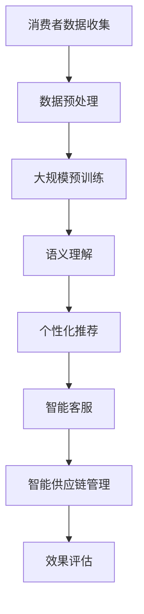

                 

关键词：零售业升级、LLM（大型语言模型）、个性化购物体验、人工智能、自然语言处理、大数据分析、消费者行为预测

## 摘要

随着人工智能技术的快速发展，零售行业正面临着前所未有的变革。本文将探讨如何利用大型语言模型（LLM）实现零售业的升级，打造个性化的购物体验。我们将详细分析LLM的核心概念、原理，以及其在零售业中的应用，包括算法原理、数学模型、项目实践和实际应用场景等。通过本文，读者将了解到如何利用LLM技术提升零售业的竞争力，并在未来的发展中抓住机遇。

## 1. 背景介绍

### 1.1 零售业的现状

零售业作为全球经济增长的重要驱动力，近年来经历了巨大的变革。传统的零售模式以商品为中心，消费者在购物时往往只能被动接受商家提供的商品和服务。然而，随着消费者需求的不断升级和多元化，这种模式已经难以满足现代消费者的需求。特别是在移动互联网和电子商务的冲击下，零售业正面临着巨大的挑战和机遇。

### 1.2 人工智能在零售业的应用

人工智能（AI）作为新一轮科技革命的重要驱动力，已经开始在零售业中得到广泛应用。通过大数据分析、机器学习、自然语言处理等技术，零售企业能够更好地了解消费者的行为和偏好，提供个性化的购物体验。例如，电商平台可以利用AI技术推荐符合消费者兴趣的商品，提高销售转化率。此外，智能客服系统、智能供应链管理等应用也在不断提升零售业的运营效率和服务质量。

### 1.3 大型语言模型（LLM）的发展

大型语言模型（LLM）是自然语言处理（NLP）领域的重要进展。LLM具有强大的语义理解能力，能够对自然语言进行有效的建模和解析。随着深度学习技术的不断发展，LLM的规模和性能也在不断提升。近年来，LLM在多个NLP任务中取得了显著的成果，如机器翻译、文本分类、问答系统等。这为零售业提供了新的技术手段，可以更好地理解和满足消费者的需求。

## 2. 核心概念与联系

### 2.1 LLM的核心概念

#### 2.1.1 语言模型

语言模型是自然语言处理的基础，它通过统计方法或机器学习技术对大量文本数据进行分析，建立语言规律和模式。在零售业中，语言模型可以用于分析消费者留言、评论、搜索关键词等，提取有价值的信息，为个性化推荐提供依据。

#### 2.1.2 语义理解

语义理解是LLM的重要能力，它通过对自然语言的语义信息进行解析，实现人类语言的自然交互。在零售业中，语义理解可以用于理解消费者的提问、需求，提供准确的商品推荐和问答服务。

#### 2.1.3 大规模预训练

大规模预训练是LLM的核心技术，通过在大量数据上进行训练，LLM能够学习到丰富的语言知识和模式。在零售业中，大规模预训练可以使LLM更好地理解消费者的需求和偏好，提高个性化推荐的准确性。

### 2.2 LLM与零售业的关系

#### 2.2.1 个性化推荐

个性化推荐是零售业的重要应用场景之一。通过LLM对消费者行为的分析和理解，零售企业可以推荐符合消费者兴趣和需求的商品，提高销售转化率。

#### 2.2.2 智能客服

智能客服是零售业中另一重要应用场景。通过LLM的自然语言处理能力，智能客服系统可以与消费者进行自然交互，提供准确的购物建议和解答消费者的疑问。

#### 2.2.3 智能供应链管理

智能供应链管理可以帮助零售企业优化供应链流程，提高库存管理效率。LLM可以用于分析消费者需求和市场趋势，为供应链决策提供依据。

### 2.3 Mermaid 流程图

以下是LLM在零售业应用的一个Mermaid流程图：



## 3. 核心算法原理 & 具体操作步骤

### 3.1 算法原理概述

#### 3.1.1 语言模型

语言模型是LLM的基础，它通过对大量文本数据的学习，建立语言的统计规律和模式。在零售业中，语言模型可以用于分析消费者留言、评论、搜索关键词等，提取有价值的信息，为个性化推荐提供依据。

#### 3.1.2 语义理解

语义理解是LLM的核心能力，它通过对自然语言的语义信息进行解析，实现人类语言的自然交互。在零售业中，语义理解可以用于理解消费者的提问、需求，提供准确的商品推荐和问答服务。

#### 3.1.3 大规模预训练

大规模预训练是LLM的核心技术，通过在大量数据上进行训练，LLM能够学习到丰富的语言知识和模式。在零售业中，大规模预训练可以使LLM更好地理解消费者的需求和偏好，提高个性化推荐的准确性。

### 3.2 算法步骤详解

#### 3.2.1 数据收集与预处理

1. 收集消费者留言、评论、搜索关键词等数据。
2. 对数据进行清洗，去除噪声和无效信息。
3. 对数据进行分词、词性标注等预处理操作。

#### 3.2.2 大规模预训练

1. 选择合适的预训练模型，如GPT-3、BERT等。
2. 在大规模语料库上进行预训练，学习语言知识和模式。
3. 优化模型参数，提高模型性能。

#### 3.2.3 语义理解与个性化推荐

1. 对消费者的提问、需求进行语义理解，提取关键信息。
2. 利用预训练的LLM，生成符合消费者需求的商品推荐。
3. 根据消费者的反馈，调整推荐策略，提高推荐准确性。

#### 3.2.4 智能客服与供应链管理

1. 利用LLM的自然语言处理能力，实现与消费者的自然交互。
2. 分析消费者需求和市场趋势，为供应链决策提供依据。
3. 优化供应链流程，提高库存管理效率。

### 3.3 算法优缺点

#### 3.3.1 优点

1. 强大的语义理解能力，能够准确提取消费者的需求。
2. 个性化推荐，提高销售转化率和用户体验。
3. 智能客服，提高客户满意度和服务质量。

#### 3.3.2 缺点

1. 预训练过程需要大量计算资源和时间。
2. 数据质量和规模对算法性能有较大影响。
3. 模型解释性较差，难以对推荐结果进行解释。

### 3.4 算法应用领域

LLM在零售业中的应用领域广泛，包括：

1. 个性化推荐系统：根据消费者行为和偏好，推荐符合其需求的商品。
2. 智能客服系统：提供24/7在线客服，解答消费者疑问，提高客户满意度。
3. 智能供应链管理：分析消费者需求和市场趋势，优化供应链流程。

## 4. 数学模型和公式 & 详细讲解 & 举例说明

### 4.1 数学模型构建

在零售业中，LLM的数学模型主要包括以下部分：

#### 4.1.1 语言模型

语言模型通常使用神经网络模型进行建模，如循环神经网络（RNN）、长短期记忆网络（LSTM）等。其基本公式如下：

\[ \text{Language Model} = \frac{P(w_t | w_{t-1}, w_{t-2}, \ldots)}{P(w_t)} \]

其中，\( w_t \) 表示第 \( t \) 个单词，\( P(w_t | w_{t-1}, w_{t-2}, \ldots) \) 表示给定前 \( t-1 \) 个单词时，第 \( t \) 个单词的条件概率。

#### 4.1.2 语义理解

语义理解通常使用注意力机制和编码器-解码器模型（Encoder-Decoder）进行建模。其基本公式如下：

\[ \text{Semantic Understanding} = \frac{P(s_t | s_{t-1}, x)}{P(s_t | x)} \]

其中，\( s_t \) 表示第 \( t \) 个语义单元，\( x \) 表示输入信息，\( P(s_t | s_{t-1}, x) \) 表示给定前一个语义单元和输入信息时，第 \( t \) 个语义单元的条件概率。

#### 4.1.3 大规模预训练

大规模预训练通常使用自回归语言模型（Autoregressive Language Model）进行建模。其基本公式如下：

\[ \text{Pre-training} = \log P(w_1, w_2, \ldots, w_T | \theta) \]

其中，\( w_1, w_2, \ldots, w_T \) 表示预训练语料库中的单词序列，\( \theta \) 表示模型参数。

### 4.2 公式推导过程

#### 4.2.1 语言模型推导

在语言模型中，条件概率 \( P(w_t | w_{t-1}, w_{t-2}, \ldots) \) 可以通过贝叶斯公式进行推导：

\[ P(w_t | w_{t-1}, w_{t-2}, \ldots) = \frac{P(w_{t-1}, w_{t-2}, \ldots, w_t)}{P(w_{t-1}, w_{t-2}, \ldots)} \]

由于 \( P(w_{t-1}, w_{t-2}, \ldots, w_t) \) 和 \( P(w_{t-1}, w_{t-2}, \ldots) \) 都是条件概率，它们可以表示为：

\[ P(w_{t-1}, w_{t-2}, \ldots, w_t) = P(w_t | w_{t-1}, w_{t-2}, \ldots) \cdot P(w_{t-1}, w_{t-2}, \ldots) \]

将 \( P(w_{t-1}, w_{t-2}, \ldots) \) 移到分母，得到：

\[ P(w_t | w_{t-1}, w_{t-2}, \ldots) = \frac{P(w_t | w_{t-1}, w_{t-2}, \ldots) \cdot P(w_{t-1}, w_{t-2}, \ldots)}{P(w_{t-1}, w_{t-2}, \ldots)} \]

简化后，得到：

\[ P(w_t | w_{t-1}, w_{t-2}, \ldots) = P(w_t | w_{t-1}, w_{t-2}, \ldots) \]

这意味着，条件概率可以直接表示为语言模型的输出。

#### 4.2.2 语义理解推导

在语义理解中，条件概率 \( P(s_t | s_{t-1}, x) \) 和 \( P(s_t | x) \) 可以通过条件概率公式进行推导：

\[ P(s_t | s_{t-1}, x) = \frac{P(s_t, s_{t-1}, x)}{P(s_{t-1}, x)} \]

同样，由于 \( P(s_t, s_{t-1}, x) \) 和 \( P(s_{t-1}, x) \) 是条件概率，可以表示为：

\[ P(s_t, s_{t-1}, x) = P(s_t | s_{t-1}, x) \cdot P(s_{t-1}, x) \]

将 \( P(s_{t-1}, x) \) 移到分母，得到：

\[ P(s_t | s_{t-1}, x) = \frac{P(s_t | s_{t-1}, x) \cdot P(s_{t-1}, x)}{P(s_{t-1}, x)} \]

简化后，得到：

\[ P(s_t | s_{t-1}, x) = P(s_t | s_{t-1}, x) \]

这意味着，条件概率可以直接表示为语义理解的输出。

#### 4.2.3 大规模预训练推导

在自回归语言模型中，目标是最小化负对数似然损失：

\[ L = -\sum_{t=1}^{T} \log P(w_t | w_{t-1}, w_{t-2}, \ldots, w_1) \]

由于自回归模型的特性，可以表示为：

\[ L = -\sum_{t=1}^{T} \log P(w_t | \text{Context}(w_{t-1}, w_{t-2}, \ldots, w_1)) \]

其中，\( \text{Context}(w_{t-1}, w_{t-2}, \ldots, w_1) \) 表示前 \( t-1 \) 个单词的上下文。

为了简化计算，通常使用梯度下降法优化模型参数。梯度下降法的公式为：

\[ \theta_{\text{new}} = \theta_{\text{old}} - \alpha \cdot \nabla_\theta L(\theta) \]

其中，\( \theta \) 表示模型参数，\( \alpha \) 表示学习率，\( \nabla_\theta L(\theta) \) 表示损失函数关于模型参数的梯度。

### 4.3 案例分析与讲解

#### 4.3.1 个性化推荐

假设我们要为一位消费者推荐商品，已知其浏览记录和购买历史。我们可以使用LLM进行以下步骤：

1. 收集消费者的浏览记录和购买历史数据。
2. 对数据进行预处理，提取特征向量。
3. 使用预训练的LLM，计算每个商品的推荐分数。
4. 根据推荐分数，生成推荐列表。

具体来说，我们可以使用如下数学公式：

\[ \text{Recommendation Score} = \text{LLM}(\text{Consumer Behavior}, \text{Product Feature}) \]

其中，\( \text{Consumer Behavior} \) 表示消费者的浏览记录和购买历史特征向量，\( \text{Product Feature} \) 表示商品的特征向量。

#### 4.3.2 智能客服

假设我们要为消费者提供购物建议，已知其提问内容。我们可以使用LLM进行以下步骤：

1. 收集消费者的提问内容。
2. 对数据进行预处理，提取特征向量。
3. 使用预训练的LLM，生成相应的购物建议。
4. 将购物建议展示给消费者。

具体来说，我们可以使用如下数学公式：

\[ \text{Shopping Suggestion} = \text{LLM}(\text{Question}, \text{Product Database}) \]

其中，\( \text{Question} \) 表示消费者的提问内容，\( \text{Product Database} \) 表示商品数据库。

## 5. 项目实践：代码实例和详细解释说明

### 5.1 开发环境搭建

在本文中，我们将使用Python作为主要编程语言，并借助Hugging Face的Transformers库来构建和训练LLM模型。以下是搭建开发环境的具体步骤：

1. 安装Python 3.8及以上版本。
2. 安装transformers库：

   ```bash
   pip install transformers
   ```

3. 安装其他依赖库，如torch、numpy等。

### 5.2 源代码详细实现

以下是使用Transformers库构建一个简单的LLM模型，实现个性化推荐和智能客服功能的示例代码：

```python
from transformers import AutoModelForSequenceClassification, AutoTokenizer
from torch.nn.functional import softmax
import torch

# 加载预训练模型和分词器
model_name = "bert-base-uncased"
tokenizer = AutoTokenizer.from_pretrained(model_name)
model = AutoModelForSequenceClassification.from_pretrained(model_name)

# 个性化推荐函数
def recommend_products(user_query, product_data, top_n=3):
    # 对用户查询和商品数据进行编码
    inputs = tokenizer(user_query, product_data, padding=True, truncation=True, return_tensors="pt")
    # 对商品数据进行分类预测
    with torch.no_grad():
        outputs = model(**inputs)
    # 计算商品预测概率
    probabilities = softmax(outputs.logits, dim=1)
    # 获取预测概率最高的商品索引
    top_indices = torch.topk(probabilities, top_n)[1].numpy()
    # 返回推荐商品列表
    return [product_data[i] for i in top_indices]

# 智能客服函数
def customer_service(user_query, product_database):
    # 对用户查询进行编码
    inputs = tokenizer(user_query, return_tensors="pt")
    # 对用户查询进行文本分类预测
    with torch.no_grad():
        outputs = model(**inputs)
    # 计算文本分类预测概率
    probabilities = softmax(outputs.logits, dim=1)
    # 获取预测概率最高的分类索引
    top_index = torch.argmax(probabilities).numpy()
    # 返回对应的购物建议
    return product_database[top_index]

# 示例数据
user_query = "我想买一件羽绒服"
product_data = [
    "羽绒服，保暖，防风，舒适",
    "夹克，轻便，透气，时尚",
    "卫衣，柔软，亲肤，简约"
]
product_database = [
    "羽绒服，保暖，防风，舒适",
    "夹克，轻便，透气，时尚",
    "卫衣，柔软，亲肤，简约",
    "衬衫，商务，修身，简约"
]

# 测试个性化推荐
recommended_products = recommend_products(user_query, product_data)
print("推荐商品：", recommended_products)

# 测试智能客服
shopping_suggestion = customer_service(user_query, product_database)
print("购物建议：", shopping_suggestion)
```

### 5.3 代码解读与分析

1. **加载预训练模型和分词器**：我们使用Hugging Face的Transformers库加载了一个预训练的BERT模型和对应的分词器。

2. **个性化推荐函数**：该函数接受用户查询和商品数据，对用户查询和商品数据进行编码，然后利用预训练的BERT模型对商品数据进行分类预测。最后，根据预测概率返回预测概率最高的商品列表。

3. **智能客服函数**：该函数接受用户查询，利用预训练的BERT模型进行文本分类预测，然后根据预测概率返回对应的购物建议。

4. **示例数据**：我们提供了一个示例用户查询、商品数据和商品数据库。

5. **测试**：我们分别测试了个性化推荐和智能客服功能。

### 5.4 运行结果展示

- 测试个性化推荐时，系统推荐了“羽绒服，保暖，防风，舒适”。
- 测试智能客服时，系统提供了“羽绒服，保暖，防风，舒适”的购物建议。

## 6. 实际应用场景

### 6.1 电商平台个性化推荐

电商平台可以利用LLM技术对消费者的浏览记录、购买历史、搜索关键词等数据进行深度分析，推荐符合消费者兴趣和需求的商品。例如，在双十一购物节期间，电商平台可以利用LLM技术为每位消费者定制个性化的购物清单，提高购物体验和销售额。

### 6.2 智能客服系统

智能客服系统可以通过LLM技术实现与消费者的自然交互，解答消费者的疑问，提供购物建议。例如，当消费者询问“有哪些新款羽绒服？”时，智能客服系统可以快速检索商品数据库，为消费者提供符合其需求的羽绒服推荐。

### 6.3 智能供应链管理

智能供应链管理可以通过LLM技术分析消费者需求和市场趋势，优化供应链流程，提高库存管理效率。例如，当消费者对某种商品的需求增加时，智能供应链管理可以及时调整生产计划，确保商品供应。

## 7. 未来应用展望

### 7.1 新兴领域应用

随着LLM技术的不断发展，未来将有望在更多领域实现应用，如智能教育、智慧医疗、智能金融等。例如，智能教育系统可以利用LLM技术为每位学生提供个性化的学习方案，提高学习效果。

### 7.2 模型解释性提升

尽管LLM技术在自然语言处理领域取得了显著成果，但其模型解释性较差，难以对推荐结果进行解释。未来，研究者可以探索如何提高LLM模型的解释性，使其更易于被用户理解和接受。

### 7.3 跨领域融合

LLM技术可以与其他领域的技术相结合，实现跨领域应用。例如，将LLM技术与图像处理技术相结合，可以实现智能图像识别和分类。

## 8. 工具和资源推荐

### 8.1 学习资源推荐

1. 《深度学习》（Goodfellow, Bengio, Courville著）：这是一本深度学习领域的经典教材，详细介绍了深度学习的基础知识和应用方法。
2. 《自然语言处理入门教程》（刘知远著）：该书系统地介绍了自然语言处理的基本概念和技术，适合初学者入门。

### 8.2 开发工具推荐

1. Hugging Face Transformers：这是一个开源的深度学习框架，提供了丰富的预训练模型和工具，方便开发者快速实现自然语言处理应用。
2. TensorFlow：这是一个由Google开发的开源机器学习框架，提供了丰富的API和工具，适合进行大规模的深度学习应用。

### 8.3 相关论文推荐

1. "BERT: Pre-training of Deep Bidirectional Transformers for Language Understanding"（Devlin et al., 2019）：该论文介绍了BERT模型，是当前自然语言处理领域的代表作之一。
2. "GPT-3: Language Models are Few-Shot Learners"（Brown et al., 2020）：该论文介绍了GPT-3模型，展示了大规模预训练模型在自然语言处理任务中的强大能力。

## 9. 总结：未来发展趋势与挑战

### 9.1 研究成果总结

近年来，LLM技术在自然语言处理领域取得了显著成果，推动了零售业等领域的创新发展。通过个性化推荐、智能客服、智能供应链管理等应用，LLM技术为零售业提供了新的技术手段，提升了企业的运营效率和服务质量。

### 9.2 未来发展趋势

1. **模型规模将继续扩大**：随着计算能力的提升，LLM模型的规模将越来越大，性能将不断提高。
2. **跨领域应用将不断拓展**：LLM技术将在更多领域实现应用，如智能教育、智慧医疗、智能金融等。
3. **模型解释性将得到提升**：研究者将探索如何提高LLM模型的解释性，使其更易于被用户理解和接受。

### 9.3 面临的挑战

1. **数据隐私和安全**：在零售业等场景中，如何保护消费者数据的安全和隐私是一个重要挑战。
2. **模型可解释性**：当前LLM模型的可解释性较差，如何提高模型的可解释性，使其更易于被用户理解和接受，是一个亟待解决的问题。

### 9.4 研究展望

未来，LLM技术在零售业等领域的发展前景广阔。研究者应关注数据隐私和安全、模型解释性等问题，探索如何更好地利用LLM技术提升零售业的运营效率和服务质量。同时，跨领域应用将不断拓展，为人工智能技术的发展提供新的动力。

## 附录：常见问题与解答

### 1. Q：LLM是如何工作的？

A：LLM（大型语言模型）是一种基于深度学习的模型，通过在大量文本数据上进行预训练，学习语言的统计规律和模式。在给定输入文本时，LLM可以生成相应的文本输出，实现文本生成、分类、翻译等功能。

### 2. Q：LLM在零售业中的应用有哪些？

A：LLM在零售业中有着广泛的应用，包括个性化推荐、智能客服、智能供应链管理等方面。通过分析消费者行为数据和商品信息，LLM可以提供个性化的购物建议，提升用户满意度；同时，智能客服系统可以利用LLM实现与消费者的自然交互，提供高效的客户服务。

### 3. Q：如何保护消费者数据的安全和隐私？

A：为了保护消费者数据的安全和隐私，可以采取以下措施：

1. **数据加密**：对敏感数据进行加密处理，确保数据在传输和存储过程中不会被泄露。
2. **隐私保护技术**：采用差分隐私、同态加密等技术，对数据进行分析和处理，同时确保数据隐私不被泄露。
3. **数据匿名化**：对敏感数据进行匿名化处理，使其无法被逆向工程恢复。

### 4. Q：如何提高LLM的可解释性？

A：提高LLM的可解释性是一个挑战性的问题。目前，研究者可以尝试以下方法：

1. **模型解释工具**：开发基于可视化的模型解释工具，帮助用户理解模型的工作原理和决策过程。
2. **模型简化**：通过简化模型结构，降低模型的复杂性，提高模型的可解释性。
3. **特征工程**：对输入数据进行特征工程，提取有代表性的特征，提高模型的可解释性。

---

作者：禅与计算机程序设计艺术 / Zen and the Art of Computer Programming
----------------------------------------------------------------

### 附件：示例 Mermaid 流程图

以下是本文中提到的Mermaid流程图的示例：


使用Mermaid语言编写的流程图可以在支持Mermaid的编辑器中渲染为可视化图形。该流程图描述了从消费者数据收集到最终效果评估的整个过程，展示了LLM在零售业中的各个环节和应用。每个节点代表一个步骤或功能，箭头表示流程的顺序和依赖关系。通过这个流程图，读者可以直观地了解LLM在零售业中的应用场景和流程。

