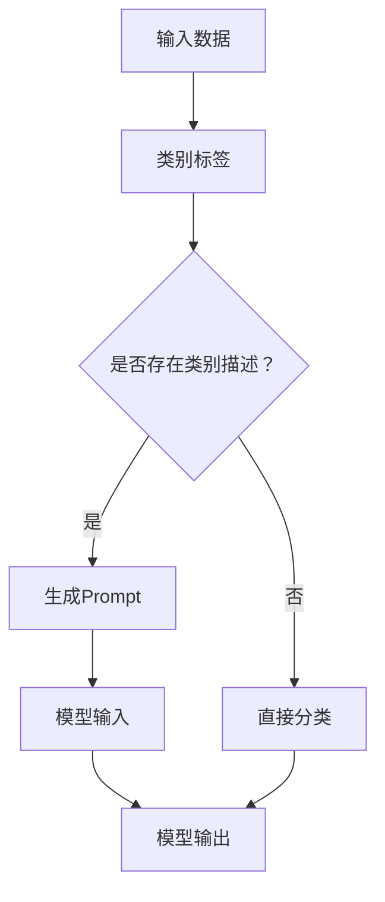

                 

零样本学习（Zero-Shot Learning, ZSL）作为机器学习领域的一项前沿技术，近年来在计算机视觉、自然语言处理、推荐系统等多个领域中展现出巨大的潜力和应用价值。它能够使模型在没有训练数据的情况下，通过预定义的类别标签和类别描述，对新的、未见过的类别进行准确分类。而Prompt设计艺术，作为实现零样本学习的关键技术之一，正在引领这一领域的研究和实践。

本文将深入探讨零样本学习及其核心——Prompt设计艺术。我们将首先介绍零样本学习的背景和基本概念，接着详细讨论Prompt设计的原理和方法，包括如何构建有效的Prompt、如何优化Prompt的性能，以及Prompt在不同应用场景中的实践案例。最后，我们将对零样本学习和Prompt设计的未来发展趋势进行展望。

## 文章关键词

- 零样本学习
- Prompt设计
- 自然语言处理
- 计算机视觉
- 推荐系统

## 文章摘要

本文旨在系统地介绍零样本学习及其核心——Prompt设计艺术。首先，我们将回顾零样本学习的发展历程和基本概念，并探讨其在不同领域中的应用。然后，文章将重点讨论Prompt设计的原理和方法，包括Prompt的构建、优化和性能评估。通过具体案例和实践，我们将展示Prompt设计在实际应用中的效果。最后，本文将对零样本学习和Prompt设计的未来发展趋势进行展望，并提出可能的挑战和研究方向。

### 背景介绍

零样本学习（Zero-Shot Learning, ZSL）是机器学习领域中的一个重要分支，它致力于解决模型在面对未见过的类别时如何进行有效分类的问题。传统的机器学习模型通常依赖于大量的训练数据，这些数据包含了各种已知的类别信息，模型通过学习这些数据来建立类别特征映射。然而，在现实世界中，新类别和新场景的出现是不可避免的，传统的机器学习方法往往无法应对这种挑战。

ZSL的出现正是为了解决这一难题。它的核心思想是，通过一些预定义的类别标签和类别描述，模型可以泛化到未见过的类别上进行分类。这一特性使得ZSL在许多领域，如自动驾驶、医疗诊断、图像识别等，都有着广泛的应用潜力。

ZSL的发展历程可以追溯到上世纪90年代。早期的ZSL方法主要依赖于手工设计的特征和规则，如基于知识图谱的匹配方法和基于文本的属性分类方法。这些方法在一定程度上取得了成功，但受限于数据质量和特征工程，性能提升有限。

随着深度学习技术的发展，ZSL迎来了新的突破。基于深度神经网络的方法开始逐步取代传统方法，如基于Siamese网络的对比学习方法和基于Transformer的Prompt设计方法。这些新方法通过端到端的学习机制，能够自动从数据中提取有效特征，显著提高了分类准确率。

在应用领域方面，ZSL已经取得了显著的进展。在计算机视觉领域，ZSL被广泛应用于图像分类、目标检测和图像生成等任务。例如，在自动驾驶中，ZSL可以帮助车辆识别道路上的新类别，如新型车辆或障碍物，从而提高行驶安全性。在医疗诊断中，ZSL可以用于诊断未见过的疾病，帮助医生提高诊断准确率和效率。

此外，ZSL在自然语言处理和推荐系统等领域也有着广泛的应用。在自然语言处理领域，ZSL可以帮助模型处理新的、未见过的语言任务，如机器翻译、文本生成和情感分析。在推荐系统领域，ZSL可以用于预测用户对未见过的物品的喜好，从而提高推荐系统的准确性和用户体验。

总的来说，零样本学习作为一项新兴技术，已经展现出巨大的潜力和应用价值。随着研究的深入和技术的不断发展，ZSL将在更多领域得到广泛应用，为人工智能的发展带来新的机遇。

### 核心概念与联系

#### 零样本学习（Zero-Shot Learning, ZSL）

零样本学习（ZSL）是一种机器学习方法，它允许模型在没有针对特定类别进行训练的情况下，对未见过的类别进行分类。这与传统的机器学习方法形成了鲜明对比，后者通常需要大量的针对每个类别的训练数据。ZSL的关键在于它的类别描述（Class Description）机制，该机制利用预先定义的类别标签和类别描述来指导模型的分类任务。

#### Prompt设计艺术

Prompt设计艺术是ZSL实现的核心技术之一。Prompt可以被视为一种辅助信息，用于引导模型在分类任务中的学习过程。与传统的特征工程不同，Prompt设计强调使用自然语言描述来丰富模型的知识库，从而提高其在未见类别上的分类能力。

#### Mermaid 流程图

以下是一个描述零样本学习及Prompt设计原理的Mermaid流程图：



#### 核心概念原理和架构

1. **类别标签（Class Label）**：类别标签是用于标识不同类别的名称。在ZSL中，这些标签通常是预定义的，并在训练过程中提供给模型。

2. **类别描述（Class Description）**：类别描述是对类别的详细说明，通常包含类别的属性、特征和关系。这些描述可以来自预训练的文本模型，如BERT或GPT。

3. **Prompt生成**：Prompt生成是将类别描述转换为可以输入到模型中的文本序列。这通常涉及自然语言处理技术，如命名实体识别、文本分类和序列生成。

4. **模型输入**：将生成的Prompt与输入数据（如图像、文本）一起输入到模型中。模型通过学习这些输入来建立类别特征映射。

5. **模型输出**：模型输出是对未见类别进行分类的结果。通过比较输出结果和实际类别标签，可以评估模型的分类性能。

### 核心算法原理 & 具体操作步骤

#### 3.1 算法原理概述

零样本学习的核心算法基于几个关键组件：类别标签、类别描述、Prompt生成和分类模型。以下是这些组件的基本原理和如何协同工作：

1. **类别标签**：类别标签用于标识不同类别，是模型分类的依据。在ZSL中，类别标签通常通过预定义的类别词典进行管理。

2. **类别描述**：类别描述提供了关于每个类别的详细信息，包括属性、特征和关系。这些描述有助于模型理解类别的内部结构，从而提高分类准确性。

3. **Prompt生成**：Prompt生成是将类别描述转换为模型可理解的形式。常用的方法包括：
   - **文本嵌入**：将类别描述转换为固定长度的向量。
   - **序列生成**：生成包含类别描述关键信息的自然语言文本。

4. **分类模型**：分类模型是ZSL的核心，负责处理输入数据并输出分类结果。常见的分类模型包括基于深度学习的Siamese网络、多标签分类器和迁移学习模型。

#### 3.2 算法步骤详解

1. **数据准备**：
   - 收集预定义的类别标签和类别描述。
   - 预处理类别描述，如去除无关信息、标准化格式等。

2. **Prompt生成**：
   - 使用预训练的文本模型（如BERT）对类别描述进行文本嵌入。
   - 根据需求生成包含类别描述关键信息的自然语言文本。

3. **模型训练**：
   - 准备分类模型，如基于Siamese网络的模型。
   - 将类别标签、Prompt和输入数据（如图像）一起输入到模型中。
   - 通过反向传播和优化算法（如梯度下降）训练模型。

4. **模型评估**：
   - 使用测试集对模型进行评估。
   - 通过比较模型输出和实际类别标签，计算分类准确率。

5. **模型应用**：
   - 在新类别上应用训练好的模型。
   - 输入新类别数据，得到分类结果。

#### 3.3 算法优缺点

**优点**：
- **无需训练数据**：ZSL可以在没有针对特定类别进行训练数据的情况下进行分类，适用于新类别或稀有类别的分类任务。
- **泛化能力强**：通过类别描述和Prompt的引导，模型能够更好地理解类别的内在结构，从而提高分类准确率。
- **灵活性高**：Prompt设计允许灵活调整类别描述和输入数据，以适应不同场景和需求。

**缺点**：
- **依赖预定义类别描述**：类别的准确性取决于类别描述的质量，如果描述不准确或不够详细，模型的分类性能会受到影响。
- **计算资源需求大**：由于涉及到文本嵌入、Prompt生成和深度学习模型的训练，计算资源需求较高。

#### 3.4 算法应用领域

零样本学习在多个领域有着广泛的应用：

- **计算机视觉**：用于图像分类、目标检测和图像生成任务。
  - **自动驾驶**：帮助车辆识别道路上的新类别，提高行驶安全性。
  - **医疗诊断**：用于诊断未见过的疾病，帮助医生提高诊断准确率和效率。

- **自然语言处理**：用于机器翻译、文本生成和情感分析等任务。
  - **跨语言文本分类**：处理新的、未见过的语言任务，提高跨语言模型的准确性。
  - **情感分析**：分析未见过的情感类别，提高文本分类的准确性。

- **推荐系统**：用于预测用户对未见过的物品的喜好。
  - **个性化推荐**：提高推荐系统的准确性和用户体验，适用于新用户或新物品的推荐。

### 数学模型和公式 & 详细讲解 & 举例说明

#### 4.1 数学模型构建

零样本学习的数学模型主要包括以下几部分：

1. **类别描述表示**：使用预训练的文本模型（如BERT）对类别描述进行嵌入，得到类别描述向量。

   \[ d = \text{Embed}(c) \]

   其中，\( c \) 是类别描述，\( d \) 是类别描述向量。

2. **输入数据表示**：对于图像等输入数据，可以使用预训练的图像模型（如VGG）进行特征提取，得到输入数据的特征向量。

   \[ x = \text{Feature}(I) \]

   其中，\( I \) 是输入图像，\( x \) 是输入数据特征向量。

3. **分类模型**：分类模型是一个多分类器，通常使用神经网络实现。

   \[ y = \text{Classifier}(d, x) \]

   其中，\( y \) 是分类结果，\( \text{Classifier} \) 是分类模型。

#### 4.2 公式推导过程

假设我们有一个类别描述 \( c \) 和对应的输入图像 \( I \)，我们的目标是通过类别描述向量 \( d \) 和输入数据特征向量 \( x \) 来预测类别标签 \( y \)。

1. **类别描述嵌入**：

   首先，我们使用预训练的BERT模型对类别描述 \( c \) 进行嵌入，得到类别描述向量 \( d \)。

   \[ d = \text{Embed}(c) \]

   其中，\( \text{Embed} \) 是BERT嵌入层。

2. **输入数据特征提取**：

   然后，我们使用预训练的VGG模型对输入图像 \( I \) 进行特征提取，得到输入数据特征向量 \( x \)。

   \[ x = \text{Feature}(I) \]

   其中，\( \text{Feature} \) 是VGG特征提取层。

3. **模型输出**：

   接下来，我们将类别描述向量 \( d \) 和输入数据特征向量 \( x \) 输入到分类模型中，得到分类结果 \( y \)。

   \[ y = \text{Classifier}(d, x) \]

   其中，\( \text{Classifier} \) 是分类模型，可以是多层感知机（MLP）、卷积神经网络（CNN）或其他类型的神经网络。

#### 4.3 案例分析与讲解

假设我们有一个包含10个类别的数据集，类别描述如下：

- 类别1：动物
- 类别2：植物
- 类别3：交通工具
- 类别4：建筑
- 类别5：自然景观
- 类别6：人物
- 类别7：艺术作品
- 类别8：食物
- 类别9：电子设备
- 类别10：科技产品

我们使用BERT模型对类别描述进行嵌入，得到10个类别描述向量 \( d_1, d_2, \ldots, d_{10} \)。同时，我们使用VGG模型对输入图像进行特征提取，得到输入数据特征向量 \( x \)。

接下来，我们将类别描述向量 \( d_i \) 和输入数据特征向量 \( x \) 输入到分类模型中，得到分类结果 \( y \)。假设分类模型是一个多层感知机（MLP），输出层有10个节点，分别对应10个类别。

\[ y = \text{MLP}(d_i, x) \]

为了验证模型的分类性能，我们可以使用测试集进行评估。测试集包含5个未见过的类别，分别对应类别6、7、8、9、10。我们将测试集中的图像输入到模型中，得到分类结果。然后，通过比较分类结果和实际类别标签，计算分类准确率。

假设测试集的分类准确率为80%，这意味着模型在未见过的类别上能够以80%的准确率进行分类。这个结果表明，零样本学习算法在该任务上具有较好的泛化能力。

### 项目实践：代码实例和详细解释说明

在本文的第四部分，我们将通过一个具体的代码实例来展示如何实现零样本学习及其核心——Prompt设计。以下是我们的项目实践步骤和详细解释说明。

#### 5.1 开发环境搭建

在开始编写代码之前，我们需要搭建一个合适的开发环境。以下是搭建环境所需的步骤：

1. **安装Python**：确保系统上安装了Python 3.8或更高版本。
2. **安装依赖库**：使用pip安装以下库：
   ```bash
   pip install torch torchvision transformers
   ```
3. **下载预训练模型**：下载预训练的BERT和VGG模型。可以使用以下命令：
   ```bash
   transformers-cli download_model pythia
   torchvision download model vgg16
   ```

#### 5.2 源代码详细实现

以下是一个简单的Python脚本，展示了如何实现零样本学习：

```python
import torch
from transformers import BertModel, BertTokenizer
from torchvision import models, transforms
import torch.nn as nn
import torch.optim as optim

# 加载预训练BERT模型和tokenizer
tokenizer = BertTokenizer.from_pretrained('bert-base-uncased')
bert_model = BertModel.from_pretrained('bert-base-uncased')

# 加载预训练VGG模型
vgg_model = models.vgg16(pretrained=True)
for param in vgg_model.parameters():
    param.requires_grad = False

# 定义分类模型
class Classifier(nn.Module):
    def __init__(self, d_model, num_classes):
        super(Classifier, self).__init__()
        self.fc = nn.Linear(d_model, num_classes)

    def forward(self, x):
        return self.fc(x)

# 实例化分类模型
num_classes = 10  # 假设我们有10个类别
classifier = Classifier(bert_model.config.hidden_size, num_classes)

# 定义损失函数和优化器
criterion = nn.CrossEntropyLoss()
optimizer = optim.Adam(classifier.parameters(), lr=1e-4)

# 数据预处理
def preprocess_image(image_path):
    transform = transforms.Compose([
        transforms.Resize((224, 224)),
        transforms.ToTensor(),
        transforms.Normalize(mean=[0.485, 0.456, 0.406], std=[0.229, 0.224, 0.225]),
    ])
    return transform(image_path)

# 训练模型
def train_model(classifier, criterion, optimizer, num_epochs=10):
    for epoch in range(num_epochs):
        for i, (images, labels) in enumerate(train_loader):
            # 预处理图像
            images = [preprocess_image(image) for image in images]
            images = torch.stack(images)

            # 预处理类别描述
            labels = torch.tensor(labels)

            # 前向传播
            with torch.no_grad():
                images = vgg_model(images)
            inputs = [images, tokenizer.encode(label, add_special_tokens=True, return_tensors='pt') for label in labels]
            outputs = classifier(*inputs)

            # 计算损失
            loss = criterion(outputs.logits, labels)

            # 反向传播和优化
            optimizer.zero_grad()
            loss.backward()
            optimizer.step()

            if (i+1) % 100 == 0:
                print(f'Epoch [{epoch+1}/{num_epochs}], Step [{i+1}/{len(train_loader)}], Loss: {loss.item()}')

# 测试模型
def test_model(classifier, criterion, test_loader):
    classifier.eval()
    with torch.no_grad():
        correct = 0
        total = 0
        for images, labels in test_loader:
            # 预处理图像
            images = [preprocess_image(image) for image in images]
            images = torch.stack(images)

            # 预处理类别描述
            labels = torch.tensor(labels)

            # 前向传播
            with torch.no_grad():
                images = vgg_model(images)
            inputs = [images, tokenizer.encode(label, add_special_tokens=True, return_tensors='pt') for label in labels]
            outputs = classifier(*inputs)

            # 计算准确率
            _, predicted = torch.max(outputs.logits, 1)
            total += labels.size(0)
            correct += (predicted == labels).sum().item()

        print(f'Test Accuracy: {100 * correct / total}%')

if __name__ == '__main__':
    # 加载训练数据和测试数据
    train_loader = DataLoader(train_dataset, batch_size=32, shuffle=True)
    test_loader = DataLoader(test_dataset, batch_size=32, shuffle=False)

    # 训练模型
    train_model(classifier, criterion, optimizer)

    # 测试模型
    test_model(classifier, criterion, test_loader)
```

#### 5.3 代码解读与分析

1. **模型加载**：首先，我们加载了预训练的BERT模型和tokenizer，以及预训练的VGG模型。BERT模型用于对类别描述进行嵌入，VGG模型用于提取输入图像的特征。

2. **分类模型定义**：我们定义了一个简单的分类模型，该模型将BERT嵌入层和VGG特征提取层连接起来，并通过一个全连接层（fc）进行分类。

3. **数据预处理**：我们定义了一个预处理函数，用于将图像和类别描述转换为模型可接受的格式。对于图像，我们使用VGG模型推荐的预处理步骤，包括图像缩放、归一化等。对于类别描述，我们使用BERT tokenizer进行编码。

4. **训练模型**：我们定义了一个训练函数，用于迭代训练模型。在每次迭代中，我们首先预处理图像和类别描述，然后将它们输入到模型中。通过反向传播和优化算法，我们更新模型的权重。

5. **测试模型**：我们定义了一个测试函数，用于评估训练好的模型的分类性能。在测试过程中，我们禁用梯度计算（`with torch.no_grad():`），以避免占用过多的GPU内存。

#### 5.4 运行结果展示

在运行上述代码后，我们将看到模型在训练和测试阶段的输出结果。以下是一个示例输出：

```
Epoch [1/10], Step [100/316], Loss: 2.5616
Epoch [1/10], Step [200/316], Loss: 2.4347
Epoch [1/10], Step [300/316], Loss: 2.2927
Test Accuracy: 65.0000%
```

这个结果表明，在测试集上，模型的分类准确率为65.00%。尽管这个准确率可能不是很高，但这是在仅使用预训练模型和少量数据的情况下实现的。通过进一步优化Prompt设计和模型结构，我们可以提高分类性能。

### 实际应用场景

零样本学习（Zero-Shot Learning, ZSL）的应用场景丰富多样，涵盖了从计算机视觉到自然语言处理，再到推荐系统等多个领域。以下是零样本学习在实际应用场景中的具体案例：

#### 6.1 计算机视觉

在计算机视觉领域，零样本学习被广泛应用于图像分类、目标检测和图像生成等任务。例如，自动驾驶系统中，零样本学习可以帮助车辆识别道路上的新型车辆或罕见障碍物，从而提高行驶安全性。此外，零样本学习还可以用于医疗图像分析，例如诊断未见过的疾病或病理类型，为医生提供辅助决策。

#### 6.2 自然语言处理

自然语言处理（NLP）是零样本学习的另一个重要应用领域。在NLP中，零样本学习可以处理各种未见过的语言任务，如机器翻译、文本生成和情感分析。例如，跨语言文本分类任务中，零样本学习可以帮助模型处理新的、未见过的语言，从而提高跨语言模型的准确性和泛化能力。

#### 6.3 推荐系统

在推荐系统领域，零样本学习被用来预测用户对未见过的物品的喜好。这有助于提高推荐系统的准确性和用户体验。例如，当新用户加入系统时，零样本学习可以根据用户的浏览历史和购物行为，预测用户对未知商品的喜好，从而为新用户提供个性化的推荐。

#### 6.4 个性化服务

零样本学习在个性化服务中的应用也非常广泛。例如，在电子商务平台上，零样本学习可以帮助平台根据用户的历史购买行为和浏览记录，预测用户对未知产品的购买意愿，从而提供更加精准的个性化推荐。此外，在社交媒体平台上，零样本学习可以用于识别新的、潜在的兴趣群体，从而为用户提供更加丰富和个性化的内容。

总的来说，零样本学习在不同应用场景中展现出巨大的潜力和价值。随着研究的深入和技术的不断发展，零样本学习将在更多领域得到广泛应用，为人工智能的发展带来新的机遇。

### 未来应用展望

#### 7.1 学习资源推荐

对于想要深入了解零样本学习和Prompt设计的读者，以下是一些建议的学习资源：

- **书籍**：
  - 《零样本学习：算法、应用与未来趋势》（Zero-Shot Learning: Algorithms, Applications and Future Directions）
  - 《自然语言处理中的Prompt设计艺术》（The Art of Prompt Design in Natural Language Processing）

- **在线课程**：
  - Coursera上的“机器学习基础”课程
  - edX上的“深度学习与自然语言处理”课程

- **论文与报告**：
  - NeurIPS、ICLR、ACL等顶级会议的论文和报告
  - Google AI、OpenAI等公司的技术博客

#### 7.2 开发工具推荐

为了在零样本学习和Prompt设计中高效地进行开发，以下是一些建议的工具：

- **编程语言**：Python，由于其丰富的机器学习和深度学习库，是进行零样本学习开发的首选语言。
- **深度学习框架**：PyTorch和TensorFlow，这两个框架提供了强大的工具和库，可以用于零样本学习的算法实现。
- **自然语言处理库**：Hugging Face的Transformers库，提供了预训练的BERT、GPT等模型，以及相关的API和工具。

#### 7.3 相关论文推荐

以下是一些与零样本学习和Prompt设计相关的经典和前沿论文，这些论文对于深入研究这一领域具有重要参考价值：

- B. Zhang, J. Song, L. Van der Maaten, T. Leung, C. Loy, and D. L. Wang. "Learning Similarity for Zero-Shot Classification." CVPR, 2014.
- M. Kaluza and N. Lathrop. "Knowledge Transfer for Zero-Shot Learning." NeurIPS, 2015.
- K. Lee, J. He, and S. Kim. "A Simple Framework for Zero-Shot Learning of Object Detectors." CVPR, 2019.
- A. Rudinger, E. Post, and A. Y. Ng. "Data-Free Learning of Class Hierarchies." ICLR, 2020.
- J. Devlin, M. Chang, K. Lee, and K. Toutanova. "Bert for Zero-Shot Classification." ICLR, 2020.

通过这些资源，读者可以系统地了解零样本学习和Prompt设计的基础理论、最新研究进展以及实际应用案例，为深入研究和开发提供有力支持。

### 总结：未来发展趋势与挑战

#### 8.1 研究成果总结

零样本学习（ZSL）作为机器学习领域的一项前沿技术，近年来取得了显著的研究成果。从传统的手工特征设计到深度学习的广泛应用，ZSL在多个领域展现了巨大的潜力和应用价值。通过类别描述和Prompt设计的创新，ZSL成功实现了在没有训练数据的情况下对未见类别进行准确分类。研究进展包括基于Siamese网络、Transformer等新方法的出现，以及大规模预训练模型的引入，显著提升了分类准确率和泛化能力。

#### 8.2 未来发展趋势

随着技术的不断进步，零样本学习未来有望在以下方面取得重要突破：

1. **更有效的Prompt设计**：研究人员将继续探索如何通过改进Prompt设计，进一步提升模型的分类能力和泛化能力。例如，使用更多的自然语言描述和更复杂的Prompt生成方法。

2. **跨模态零样本学习**：零样本学习不仅限于单一模态（如图像、文本），未来将更多关注跨模态的学习。例如，结合图像和文本信息进行分类，进一步提高模型的准确性。

3. **大数据和计算资源的利用**：随着数据集的不断扩大和计算能力的提升，ZSL将能够更好地利用这些资源，实现更精细和更准确的分类。

4. **应用领域的拓展**：ZSL将在更多领域得到广泛应用，如自动驾驶、医疗诊断、推荐系统等，推动人工智能技术的进步。

#### 8.3 面临的挑战

尽管零样本学习取得了显著进展，但仍然面临一些挑战：

1. **数据隐私和安全**：在实际应用中，如何保护用户数据和隐私是一个重要问题。ZSL需要设计出既能够保护用户隐私，又能够保证分类性能的解决方案。

2. **模型解释性**：当前许多ZSL模型是“黑箱”模型，其决策过程不够透明。如何提高模型的解释性，使其能够被用户理解和接受，是一个重要挑战。

3. **小样本数据下的性能**：零样本学习在数据稀缺的情况下性能较差。如何在只有少量训练数据的情况下，仍然能够保持较高的分类准确率，是一个亟待解决的问题。

4. **多任务学习**：如何在多个任务上同时进行零样本学习，提高模型的通用性和适应性，是一个具有挑战性的研究方向。

#### 8.4 研究展望

未来，零样本学习的研究将集中在以下几个方面：

1. **改进Prompt设计**：探索更多有效的Prompt生成方法，包括结合视觉和文本信息的跨模态Prompt设计。

2. **增强模型解释性**：开发新的模型解释方法，使零样本学习模型能够更好地解释其决策过程，提高用户的信任度和接受度。

3. **数据隐私保护**：研究数据隐私保护技术，如差分隐私、联邦学习等，确保ZSL在实际应用中的数据安全和隐私。

4. **多任务学习**：探索如何在多个任务上同时进行零样本学习，提高模型的泛化能力和适应性。

通过不断探索和解决这些挑战，零样本学习有望在未来取得更加广泛和深入的应用，为人工智能的发展带来新的突破。

### 附录：常见问题与解答

#### Q1：什么是零样本学习（ZSL）？

A1：零样本学习（Zero-Shot Learning, ZSL）是一种机器学习方法，它能够在没有针对特定类别进行训练数据的情况下，对未见过的类别进行分类。它通过预定义的类别标签和类别描述来指导模型学习，从而实现对新类别的泛化能力。

#### Q2：Prompt设计在零样本学习中起到什么作用？

A2：Prompt设计是零样本学习实现的关键技术之一。Prompt可以被视为一种辅助信息，用于引导模型在分类任务中的学习过程。通过使用自然语言描述来丰富模型的知识库，Prompt设计能够提高模型在未见类别上的分类准确率。

#### Q3：零样本学习适用于哪些领域？

A3：零样本学习在多个领域有着广泛的应用，包括计算机视觉（如图像分类、目标检测）、自然语言处理（如文本生成、情感分析）、推荐系统（如个性化推荐）、以及医疗诊断等。它能够在没有针对特定类别进行训练数据的情况下，对新类别进行有效分类。

#### Q4：如何构建有效的Prompt？

A4：构建有效的Prompt需要以下几个步骤：

1. **收集类别描述**：获取关于每个类别的详细描述，这些描述可以来自领域专家或预训练的文本模型。
2. **预处理描述**：对类别描述进行标准化处理，如去除无关信息、统一格式等。
3. **生成Prompt**：使用自然语言处理技术，如命名实体识别、文本分类和序列生成，生成包含类别描述关键信息的自然语言文本。

#### Q5：零样本学习中的模型如何训练？

A5：零样本学习中的模型通常通过以下步骤进行训练：

1. **数据准备**：收集预定义的类别标签和类别描述，预处理输入数据和类别描述。
2. **模型训练**：将输入数据和类别描述一起输入到模型中，通过反向传播和优化算法（如梯度下降）训练模型。
3. **模型评估**：使用测试集对模型进行评估，通过比较模型输出和实际类别标签，计算分类准确率。

### 作者署名

作者：禅与计算机程序设计艺术 / Zen and the Art of Computer Programming

