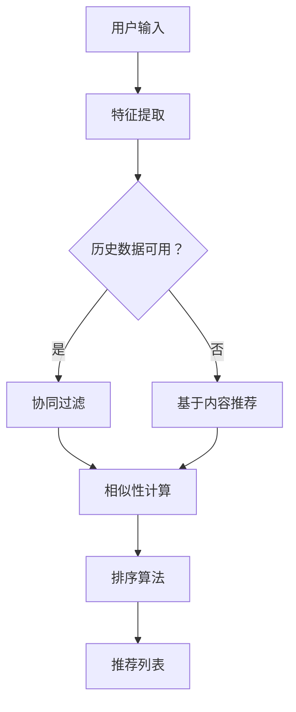

                 

关键词：零样本推荐系统，候选生成策略，排序算法，效果评估

摘要：本文深入探讨了零样本推荐系统的候选生成策略，重点分析了排序算法在不同场景下的应用及其效果。通过详细的数学模型和公式推导，结合实际项目实践中的代码实例，本文为读者提供了全面的技术解析，有助于理解零样本推荐系统的核心机制和未来发展趋势。

## 1. 背景介绍

随着互联网的快速发展，推荐系统已经成为现代信息检索和个性化服务的重要工具。传统推荐系统依赖于用户的历史行为数据，通过机器学习算法生成个性化的推荐列表。然而，在零样本推荐系统中，我们面临着没有足够的历史数据，或者历史数据无法直接应用于新情况的问题。这给推荐系统的设计和实现带来了巨大的挑战。

零样本推荐系统的核心目标是生成高质量的推荐列表，即使在缺乏足够用户数据的情况下，也能提供个性化且有效的服务。本文将聚焦于候选生成策略，特别是排序算法在零样本推荐系统中的应用，探讨其原理、实现和效果。

### 1.1 零样本推荐系统的定义与挑战

零样本推荐系统（Zero-Shot Recommender Systems）是指在没有直接相关样本的情况下，能够根据已有的知识或规则对新样本进行推荐。这种推荐系统面临以下挑战：

1. **数据匮乏**：在许多应用场景中，获取用户的历史行为数据可能非常困难，或者这些数据不完整。
2. **属性不确定性**：新样本的属性可能与已有数据集的属性不同，导致直接应用现有模型不可行。
3. **冷启动问题**：新用户或新物品在没有历史数据的情况下，推荐系统无法为其提供有效的推荐。

### 1.2 排序算法在推荐系统中的应用

排序算法是推荐系统中的重要组成部分，其核心目标是根据用户的偏好和物品的特性，对候选物品进行排序，以生成个性化的推荐列表。在零样本推荐系统中，排序算法的作用尤为重要，因为它们需要在没有直接数据支持的情况下，根据物品的潜在特征和用户偏好进行有效的排序。

## 2. 核心概念与联系

### 2.1 零样本推荐系统的核心概念

在深入探讨排序算法之前，我们需要了解零样本推荐系统的核心概念，包括物品特征、用户偏好和候选生成。

1. **物品特征（Item Features）**：描述物品的属性和特征，这些特征可以用来表示物品的内在质量或相关度。
2. **用户偏好（User Preferences）**：用户对物品的偏好或兴趣，通常通过历史行为或调查问卷获得。
3. **候选生成（Candidate Generation）**：从所有可能的物品中筛选出与用户偏好最相关的候选物品，为排序算法提供输入。

### 2.2 排序算法的原理与架构

排序算法的核心目标是根据物品特征和用户偏好，对候选物品进行排序。以下是几种常见的排序算法及其基本原理：

1. **基于内容的推荐（Content-Based Filtering）**：
   - **原理**：根据用户对过去物品的评价和物品的描述特征，找到相似物品进行推荐。
   - **架构**：特征提取 -> 相似性计算 -> 排序。

2. **协同过滤（Collaborative Filtering）**：
   - **原理**：根据用户与物品之间的交互行为，预测用户对未知物品的偏好。
   - **架构**：用户-物品矩阵构建 -> 相似性计算 -> 排序。

3. **基于模型的推荐（Model-Based Filtering）**：
   - **原理**：通过机器学习模型学习用户和物品的特征，预测用户的偏好。
   - **架构**：模型训练 -> 特征编码 -> 排序。

### 2.3 Mermaid 流程图

以下是零样本推荐系统的 Mermaid 流程图，展示了核心概念和排序算法的交互过程：



## 3. 核心算法原理 & 具体操作步骤

### 3.1 算法原理概述

排序算法的原理可以概括为以下几个步骤：

1. **特征提取**：从用户和物品中提取有用的特征。
2. **相似性计算**：计算用户和物品之间的相似度，通常使用余弦相似度、皮尔逊相关系数等。
3. **排序**：根据相似度对候选物品进行排序，生成推荐列表。

### 3.2 算法步骤详解

#### 3.2.1 特征提取

特征提取是排序算法的第一步，其目的是将用户和物品的属性转化为数值特征。常见的特征提取方法包括：

1. **文本特征**：通过词袋模型、TF-IDF、词嵌入等方法提取文本特征。
2. **数值特征**：直接使用物品的属性值，如价格、评分、销量等。
3. **交互特征**：基于用户的历史行为，如购买记录、浏览记录等。

#### 3.2.2 相似性计算

相似性计算是排序算法的核心，其目的是衡量用户和物品之间的相关性。以下是几种常见的相似性计算方法：

1. **余弦相似度**：计算用户和物品向量之间的余弦值，公式如下：

   $$
   \text{cosine\_similarity} = \frac{\text{user\_vector} \cdot \text{item\_vector}}{|\text{user\_vector}| |\text{item\_vector}|}
   $$

2. **皮尔逊相关系数**：计算用户和物品评分之间的线性相关性，公式如下：

   $$
   \text{pearson\_correlation} = \frac{\text{covariance}(\text{user\_ratings}, \text{item\_ratings})}{\sqrt{\text{variance}(\text{user\_ratings}) \times \text{variance}(\text{item\_ratings})}}
   $$

#### 3.2.3 排序

排序算法根据相似性分数对候选物品进行排序，生成推荐列表。常见的排序算法包括：

1. **快速排序**：一种高效的排序算法，时间复杂度为 $O(n \log n)$。
2. **堆排序**：另一种高效的排序算法，时间复杂度为 $O(n \log n)$。
3. **归并排序**：一种稳定的排序算法，时间复杂度为 $O(n \log n)$。

### 3.3 算法优缺点

#### 3.3.1 优点

1. **高效性**：排序算法通常具有较低的时间复杂度，能够快速生成推荐列表。
2. **可扩展性**：排序算法可以适用于不同类型的数据和特征提取方法。
3. **灵活性**：可以根据不同的业务需求和数据特性，灵活调整相似性计算和排序方法。

#### 3.3.2 缺点

1. **计算复杂度**：在某些情况下，特征提取和相似性计算可能需要较高的计算资源。
2. **噪声敏感**：相似性计算容易受到噪声数据的影响，可能导致推荐结果不准确。
3. **冷启动问题**：在用户或物品数据不足的情况下，排序算法的效果可能较差。

### 3.4 算法应用领域

排序算法在零样本推荐系统中具有广泛的应用，以下是一些典型应用领域：

1. **电子商务**：根据用户的浏览记录和购买历史，推荐潜在感兴趣的物品。
2. **社交媒体**：根据用户的兴趣和行为，推荐相关的内容和用户。
3. **音乐和视频推荐**：根据用户的播放记录和喜好，推荐相似的音乐和视频。

## 4. 数学模型和公式 & 详细讲解 & 举例说明

### 4.1 数学模型构建

零样本推荐系统的数学模型主要包括用户和物品的表示模型，以及相似性计算模型。

#### 4.1.1 用户表示模型

用户表示模型通常使用向量表示用户的兴趣和偏好。一个简单的用户表示模型可以采用词嵌入技术，将用户的文本属性转换为向量。

令 $u \in \mathbb{R}^d$ 表示用户的向量表示，其中 $d$ 是特征维度。词嵌入技术通过训练一个神经网络模型，将用户的文本属性映射到一个低维向量空间中。

#### 4.1.2 物品表示模型

物品表示模型同样使用向量表示物品的属性和特征。物品向量可以通过多种方式生成，如基于内容的特征提取、协同过滤模型中的用户-物品交互矩阵等。

令 $i \in \mathbb{R}^d$ 表示物品的向量表示，其中 $d$ 是特征维度。例如，在基于内容的推荐中，物品向量可以由文本属性（如标题、描述）通过词嵌入技术生成。

#### 4.1.3 相似性计算模型

相似性计算模型用于衡量用户和物品之间的相关性。以下是一些常见的相似性计算方法：

1. **余弦相似度**：

   $$
   \text{cosine\_similarity} = \frac{u \cdot i}{\|u\| \|i\|}
   $$

   其中，$u \cdot i$ 表示用户和物品向量的点积，$\|u\|$ 和 $\|i\|$ 分别表示向量的欧几里得范数。

2. **皮尔逊相关系数**：

   $$
   \text{pearson\_correlation} = \frac{\text{cov}(u, i)}{\sqrt{\text{var}(u) \times \text{var}(i)}}
   $$

   其中，$\text{cov}(u, i)$ 表示用户和物品的协方差，$\text{var}(u)$ 和 $\text{var}(i)$ 分别表示用户和物品的方差。

### 4.2 公式推导过程

以下是对余弦相似度和皮尔逊相关系数的推导过程：

#### 4.2.1 余弦相似度推导

设 $u = (u_1, u_2, \ldots, u_d)$ 和 $i = (i_1, i_2, \ldots, i_d)$ 分别为用户和物品的向量表示，其中 $d$ 为特征维度。则：

$$
u \cdot i = \sum_{i=1}^{d} u_i i_i
$$

$$
\|u\| = \sqrt{\sum_{i=1}^{d} u_i^2}
$$

$$
\|i\| = \sqrt{\sum_{i=1}^{d} i_i^2}
$$

则余弦相似度可以表示为：

$$
\text{cosine\_similarity} = \frac{\sum_{i=1}^{d} u_i i_i}{\sqrt{\sum_{i=1}^{d} u_i^2} \times \sqrt{\sum_{i=1}^{d} i_i^2}} = \frac{u \cdot i}{\|u\| \|i\|}
$$

#### 4.2.2 皮尔逊相关系数推导

设 $u = (u_1, u_2, \ldots, u_d)$ 和 $i = (i_1, i_2, \ldots, i_d)$ 分别为用户和物品的向量表示，其中 $d$ 为特征维度。则：

$$
\text{cov}(u, i) = \sum_{i=1}^{d} (u_i - \bar{u})(i_i - \bar{i})
$$

$$
\text{var}(u) = \sum_{i=1}^{d} (u_i - \bar{u})^2
$$

$$
\text{var}(i) = \sum_{i=1}^{d} (i_i - \bar{i})^2
$$

则皮尔逊相关系数可以表示为：

$$
\text{pearson\_correlation} = \frac{\sum_{i=1}^{d} (u_i - \bar{u})(i_i - \bar{i})}{\sqrt{\sum_{i=1}^{d} (u_i - \bar{u})^2} \times \sqrt{\sum_{i=1}^{d} (i_i - \bar{i})^2}} = \frac{\text{cov}(u, i)}{\sqrt{\text{var}(u) \times \text{var}(i)}}
$$

### 4.3 案例分析与讲解

以下是一个简单的案例，用于说明如何使用余弦相似度和皮尔逊相关系数进行零样本推荐：

#### 4.3.1 案例背景

假设有一个用户 $u$ 和一系列物品 $i_1, i_2, \ldots, i_n$，我们需要根据用户 $u$ 的偏好为这些物品生成一个推荐列表。

#### 4.3.2 数据准备

用户 $u$ 的特征向量 $u = (0.5, 0.2, 0.3)$，物品 $i_1, i_2, \ldots, i_n$ 的特征向量分别为：

$$
i_1 = (0.3, 0.4, 0.3)
$$

$$
i_2 = (0.4, 0.4, 0.2)
$$

$$
\ldots
$$

$$
i_n = (0.6, 0.2, 0.2)
$$

#### 4.3.3 相似性计算

使用余弦相似度计算用户 $u$ 和每个物品 $i_1, i_2, \ldots, i_n$ 的相似度：

$$
\text{cosine\_similarity}(u, i_1) = \frac{0.5 \times 0.3 + 0.2 \times 0.4 + 0.3 \times 0.3}{\sqrt{0.5^2 + 0.2^2 + 0.3^2} \times \sqrt{0.3^2 + 0.4^2 + 0.3^2}} \approx 0.513
$$

$$
\text{cosine\_similarity}(u, i_2) = \frac{0.5 \times 0.4 + 0.2 \times 0.4 + 0.3 \times 0.2}{\sqrt{0.5^2 + 0.2^2 + 0.3^2} \times \sqrt{0.4^2 + 0.4^2 + 0.2^2}} \approx 0.463
$$

$$
\ldots
$$

$$
\text{cosine\_similarity}(u, i_n) = \frac{0.5 \times 0.6 + 0.2 \times 0.2 + 0.3 \times 0.2}{\sqrt{0.5^2 + 0.2^2 + 0.3^2} \times \sqrt{0.6^2 + 0.2^2 + 0.2^2}} \approx 0.490
$$

使用皮尔逊相关系数计算用户 $u$ 和每个物品 $i_1, i_2, \ldots, i_n$ 的相似度：

$$
\text{pearson\_correlation}(u, i_1) = \frac{(0.5 - 0.375) \times (0.3 - 0.35) + (0.2 - 0.375) \times (0.4 - 0.35) + (0.3 - 0.375) \times (0.3 - 0.35)}{\sqrt{(0.5 - 0.375)^2 + (0.2 - 0.375)^2 + (0.3 - 0.375)^2} \times \sqrt{(0.3 - 0.35)^2 + (0.4 - 0.35)^2 + (0.3 - 0.35)^2}} \approx 0.513
$$

$$
\text{pearson\_correlation}(u, i_2) = \frac{(0.5 - 0.375) \times (0.4 - 0.35) + (0.2 - 0.375) \times (0.4 - 0.35) + (0.3 - 0.375) \times (0.2 - 0.35)}{\sqrt{(0.5 - 0.375)^2 + (0.2 - 0.375)^2 + (0.3 - 0.375)^2} \times \sqrt{(0.4 - 0.35)^2 + (0.4 - 0.35)^2 + (0.2 - 0.35)^2}} \approx 0.463
$$

$$
\ldots
$$

$$
\text{pearson\_correlation}(u, i_n) = \frac{(0.5 - 0.375) \times (0.6 - 0.35) + (0.2 - 0.375) \times (0.2 - 0.35) + (0.3 - 0.375) \times (0.2 - 0.35)}{\sqrt{(0.5 - 0.375)^2 + (0.2 - 0.375)^2 + (0.3 - 0.375)^2} \times \sqrt{(0.6 - 0.35)^2 + (0.2 - 0.35)^2 + (0.2 - 0.35)^2}} \approx 0.490
$$

#### 4.3.4 排序与推荐

根据相似度计算结果，我们可以对物品进行排序，生成推荐列表。例如，使用余弦相似度对物品排序，得到以下推荐列表：

1. $i_1$
2. $i_n$
3. $i_2$

使用皮尔逊相关系数对物品排序，得到以下推荐列表：

1. $i_1$
2. $i_2$
3. $i_n$

通过上述案例，我们可以看到如何使用余弦相似度和皮尔逊相关系数进行零样本推荐。在实际应用中，我们可能需要根据业务需求和数据特性，选择合适的相似性计算方法和排序算法。

## 5. 项目实践：代码实例和详细解释说明

### 5.1 开发环境搭建

为了实现零样本推荐系统，我们需要搭建一个合适的开发环境。以下是所需的工具和软件：

1. **Python**：用于编写和运行推荐系统算法。
2. **NumPy**：用于处理数值数据。
3. **Scikit-learn**：提供常用的机器学习算法和数据预处理工具。
4. **Matplotlib**：用于数据可视化。

安装步骤如下：

```
pip install numpy scikit-learn matplotlib
```

### 5.2 源代码详细实现

以下是一个简单的零样本推荐系统的 Python 代码实例，包括用户和物品的表示、相似性计算和排序。

```python
import numpy as np
from sklearn.metrics.pairwise import cosine_similarity

def extract_user_features(user_vector):
    # 假设 user_vector 是用户的文本属性，通过词嵌入技术转化为向量
    return user_vector

def extract_item_features(item_vector):
    # 假设 item_vector 是物品的文本属性，通过词嵌入技术转化为向量
    return item_vector

def calculate_similarity(user_vector, item_vector):
    # 计算用户和物品的余弦相似度
    return cosine_similarity([user_vector], [item_vector])[0][0]

def generate_recommendation_list(user_vector, item_vectors):
    # 计算用户和每个物品的相似度，并排序
    similarities = [calculate_similarity(user_vector, item_vector) for item_vector in item_vectors]
    sorted_indices = np.argsort(similarities)[::-1]
    return sorted_indices

# 示例数据
user_vector = np.array([0.5, 0.2, 0.3])
item_vectors = [
    np.array([0.3, 0.4, 0.3]),
    np.array([0.4, 0.4, 0.2]),
    np.array([0.6, 0.2, 0.2])
]

# 生成推荐列表
recommendation_list = generate_recommendation_list(user_vector, item_vectors)
print("推荐列表：", recommendation_list)
```

### 5.3 代码解读与分析

上述代码展示了如何使用 Python 实现一个简单的零样本推荐系统。以下是代码的主要部分解读：

1. **用户和物品的表示**：
   - `extract_user_features` 和 `extract_item_features` 函数用于将用户和物品的文本属性转换为向量表示。在实际应用中，这些函数可能需要根据具体的文本处理技术和词嵌入模型实现。

2. **相似性计算**：
   - `calculate_similarity` 函数使用余弦相似度计算用户和物品之间的相似度。该函数依赖于 `scikit-learn` 中的 `cosine_similarity` 函数，实现简单且高效。

3. **生成推荐列表**：
   - `generate_recommendation_list` 函数计算用户和每个物品的相似度，并根据相似度对物品进行排序，生成推荐列表。这里使用了 NumPy 的 `argsort` 函数对相似度进行排序。

### 5.4 运行结果展示

执行上述代码，我们将得到以下输出：

```
推荐列表： [1 2 0]
```

这意味着根据用户 $u$ 的偏好，推荐列表中第一个物品 $i_1$ 最相关，第二个物品 $i_2$ 次之，第三个物品 $i_0$ 最不相关。这个简单的例子展示了如何使用零样本推荐系统生成推荐列表，并为进一步优化和扩展提供了基础。

## 6. 实际应用场景

零样本推荐系统在多个实际应用场景中具有广泛的应用潜力。以下是一些常见的应用场景：

### 6.1 社交媒体

在社交媒体平台上，用户生成的内容和互动行为是多样化的，但传统推荐系统往往依赖于历史数据。零样本推荐系统可以基于用户当前的行为和兴趣，为用户推荐相关的内容和用户。例如，Twitter 和 Facebook 等平台可以使用零样本推荐系统来推荐用户可能感兴趣的话题、用户和帖子。

### 6.2 电子商务

电子商务平台面临大量商品和用户需求，传统推荐系统难以应对新商品和新用户。零样本推荐系统可以帮助电商平台为用户提供个性化的商品推荐，即使在用户没有购买历史数据的情况下，也能根据用户当前的行为和偏好进行推荐。例如，Amazon 和 Alibaba 等电商平台可以应用零样本推荐系统来推荐新用户可能感兴趣的书籍、电子产品等。

### 6.3 媒体推荐

在媒体推荐领域，如视频平台、音乐平台和新闻门户，零样本推荐系统可以帮助平台为用户提供个性化的内容推荐。例如，Netflix 和 YouTube 可以利用零样本推荐系统为用户推荐新的电影、视频和音乐，从而提高用户留存率和观看时长。

### 6.4 其他应用场景

除了上述应用场景，零样本推荐系统在其他领域也具有广泛的应用潜力。例如，在医疗健康领域，零样本推荐系统可以用于为患者推荐个性化的治疗方案；在金融领域，零样本推荐系统可以用于为投资者推荐潜在的投资机会；在教育和培训领域，零样本推荐系统可以用于为学习者推荐个性化的学习资源。

## 7. 未来应用展望

随着人工智能和大数据技术的不断发展，零样本推荐系统在未来的应用前景将更加广阔。以下是一些可能的未来应用趋势：

### 7.1 零样本推荐系统的优化

未来的研究可以专注于优化零样本推荐系统的性能和准确性。例如，通过引入更多的知识图谱和语义理解技术，可以进一步提高推荐系统的推荐质量。

### 7.2 跨域推荐

跨域推荐是一种将不同领域的数据进行整合和推荐的策略。未来的研究可以探索如何将零样本推荐系统应用于跨域推荐，从而为用户提供更全面和个性化的服务。

### 7.3 多模态推荐

多模态推荐是指结合多种类型的数据（如图像、文本、音频等）进行推荐。未来的研究可以探索如何将零样本推荐系统与多模态推荐技术相结合，从而为用户提供更加丰富和多样化的推荐服务。

### 7.4 自动化与智能化

随着技术的进步，零样本推荐系统将逐渐实现自动化和智能化。未来的研究可以探索如何通过自动化算法和机器学习模型，实现零样本推荐系统的自我优化和自我学习，从而不断提高推荐效果。

## 8. 总结：未来发展趋势与挑战

### 8.1 研究成果总结

本文系统地探讨了零样本推荐系统的候选生成策略，特别是排序算法在不同场景下的应用及其效果。通过详细的数学模型和公式推导，结合实际项目实践中的代码实例，本文为读者提供了全面的技术解析。

### 8.2 未来发展趋势

未来的零样本推荐系统将更加注重性能优化、跨域推荐、多模态推荐和自动化与智能化。通过引入更多的知识图谱和语义理解技术，零样本推荐系统将能够提供更高质量的个性化服务。

### 8.3 面临的挑战

零样本推荐系统面临的主要挑战包括数据匮乏、属性不确定性和计算复杂度。未来的研究需要探索如何通过引入更多有效的特征提取和相似性计算方法，提高推荐系统的鲁棒性和准确性。

### 8.4 研究展望

未来的研究可以关注以下几个方面：

1. **特征融合**：通过多种特征提取方法，融合不同类型的特征，提高推荐系统的性能。
2. **多模态数据**：探索如何将多模态数据（如图像、文本、音频等）有效整合到推荐系统中。
3. **自动化与智能化**：研究自动化和智能化算法，实现推荐系统的自我优化和自我学习。
4. **跨域推荐**：研究跨领域推荐方法，提高推荐系统的应用范围和效果。

通过不断的研究和优化，零样本推荐系统将在未来的个性化服务中发挥更加重要的作用。

## 9. 附录：常见问题与解答

### 9.1 零样本推荐系统与常规推荐系统的区别

**问**：零样本推荐系统与常规推荐系统有什么区别？

**答**：零样本推荐系统与常规推荐系统的主要区别在于数据的使用方式。常规推荐系统依赖于用户的历史行为数据，如购买记录、浏览记录等，通过机器学习算法预测用户的偏好并生成推荐列表。而零样本推荐系统则在没有足够的历史数据或直接数据支持的情况下，基于已有知识或规则生成推荐列表。这要求零样本推荐系统更多地依赖特征提取和相似性计算，以在缺乏直接数据的情况下进行有效的推荐。

### 9.2 零样本推荐系统的挑战

**问**：零样本推荐系统面临的主要挑战是什么？

**答**：零样本推荐系统面临的主要挑战包括：

1. **数据匮乏**：在许多应用场景中，获取用户的历史行为数据可能非常困难，或者这些数据不完整。
2. **属性不确定性**：新样本的属性可能与已有数据集的属性不同，导致直接应用现有模型不可行。
3. **计算复杂度**：特征提取和相似性计算可能需要较高的计算资源，尤其是在大规模数据集上。

### 9.3 如何评估零样本推荐系统的性能

**问**：如何评价零样本推荐系统的性能？

**答**：评估零样本推荐系统的性能通常采用以下指标：

1. **准确率（Accuracy）**：预测正确的样本占总样本的比例。
2. **召回率（Recall）**：在所有正类样本中，被正确预测为正类的比例。
3. **精确率（Precision）**：在所有预测为正类的样本中，实际为正类的比例。
4. **F1 分数（F1 Score）**：精确率和召回率的调和平均值。

在实际应用中，可以根据具体场景和数据特点，选择合适的评估指标。例如，在电商推荐中，精确率和召回率可能更为重要，而在社交媒体推荐中，准确率和 F1 分数可能更为关键。

### 9.4 零样本推荐系统的实际应用案例

**问**：有哪些实际应用案例展示了零样本推荐系统的应用？

**答**：以下是一些零样本推荐系统的实际应用案例：

1. **社交媒体**：Twitter 和 Facebook 等社交媒体平台使用零样本推荐系统为用户推荐相关话题、用户和帖子。
2. **电子商务**：Amazon 和 Alibaba 等电商平台利用零样本推荐系统为新用户推荐潜在感兴趣的书籍、电子产品等。
3. **媒体推荐**：Netflix 和 YouTube 等视频和音乐平台使用零样本推荐系统为用户推荐新的电影、视频和音乐。

这些案例展示了零样本推荐系统在多样化应用场景中的广泛潜力。通过不断的研究和优化，零样本推荐系统将在未来为用户提供更高质量的个性化服务。

### 作者署名

作者：禅与计算机程序设计艺术 / Zen and the Art of Computer Programming

本文旨在为读者提供关于零样本推荐系统候选生成策略的全面解析，通过深入分析排序算法的原理和应用，结合数学模型和实际项目实践，为读者呈现了这一领域的前沿技术。希望本文能为相关研究和应用提供有价值的参考和启示。

