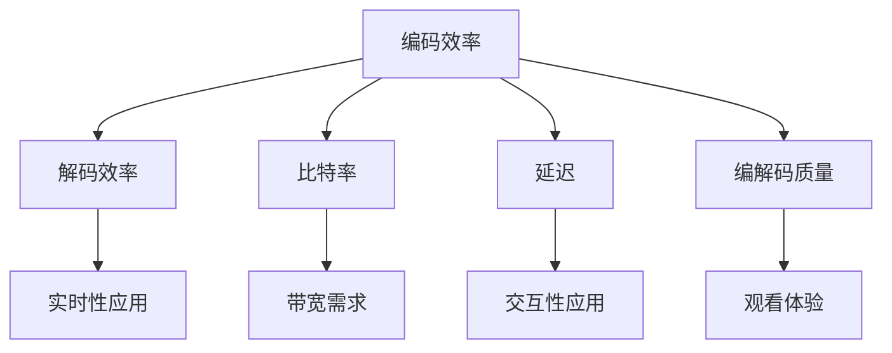

                 

关键词：音视频编解码、性能对比、视频压缩、音频压缩、编解码算法、编码效率、解码效率、比特率、延迟、编解码质量、硬件加速、编解码器优化。

> 音视频编解码器是数字媒体处理的关键组件，它们的性能直接影响着用户的观看体验。本文将对当前主流的音视频编解码器进行性能对比，分析其编码效率、解码效率、比特率、延迟以及编解码质量，帮助读者了解不同编解码器的特点，为实际应用提供参考。

## 1. 背景介绍

音视频编解码技术是数字媒体处理的核心技术之一。随着互联网的普及和移动设备的兴起，音视频内容消费日益增长，对编解码器的性能要求越来越高。编解码器的作用是将音视频信号从一种格式转换为另一种格式，以便在不同的设备和网络上传输和播放。编解码器的性能直接影响视频的清晰度、播放流畅度以及数据传输效率。

本文将探讨音视频编解码器的性能对比，分析不同编解码器在编码效率、解码效率、比特率、延迟以及编解码质量等方面的表现，为音视频编解码器的研究和应用提供参考。

## 2. 核心概念与联系

### 2.1 编码效率

编码效率是指编解码器将原始音视频数据转换为压缩数据时，压缩率的大小。编码效率越高，压缩后的数据越小，传输和存储的效率越高。

### 2.2 解码效率

解码效率是指编解码器将压缩数据还原为原始音视频数据时的速度。解码效率越高，播放视频时的流畅度越好。

### 2.3 比特率

比特率是指音视频数据在单位时间内传输的比特数。比特率越高，音视频的质量越高，但也会增加数据传输的带宽需求。

### 2.4 延迟

延迟是指从输入音视频数据到输出可播放的音视频信号所需的时间。较低的延迟对于实时视频传输和交互式应用非常重要。

### 2.5 编解码质量

编解码质量是指压缩后的音视频数据在还原为原始数据时，质量损失的程度。编解码质量越高，用户观看体验越好。

### 2.6 Mermaid 流程图



## 3. 核心算法原理 & 具体操作步骤

### 3.1 算法原理概述

音视频编解码器通常采用两种主要的压缩方法：空间压缩和时间压缩。

- **空间压缩**：通过去除图像或音频中的冗余信息来实现压缩。常见的空间压缩算法包括JPEG、H.264、HEVC等。
- **时间压缩**：通过去除时间序列中的冗余信息来实现压缩。常见的时间压缩算法包括MP3、AAC、H.265等。

### 3.2 算法步骤详解

#### 编码步骤：

1. **预处理**：对输入的音视频数据进行预处理，如去噪、锐化等。
2. **帧间预测**：对于视频数据，采用帧间预测算法去除时间冗余。
3. **变换编码**：将预处理后的数据通过变换编码去除空间冗余。
4. **量化**：将变换后的数据量化，降低数据精度。
5. **熵编码**：采用熵编码算法（如Huffman编码）对量化后的数据进行压缩。

#### 解码步骤：

1. **熵解码**：对压缩数据解压缩，恢复量化后的数据。
2. **反量化**：对量化后的数据进行反量化，恢复数据精度。
3. **反变换编码**：对反量化后的数据进行反变换编码，恢复空间信息。
4. **后处理**：对解码后的数据执行后处理，如去噪、锐化等。

### 3.3 算法优缺点

- **JPEG**：优点是压缩率高，缺点是压缩后会出现块状失真。
- **H.264**：优点是压缩效率高，解码速度快，缺点是压缩后的视频质量相对较低。
- **HEVC**：优点是压缩效率更高，缺点是解码计算复杂度较大。

### 3.4 算法应用领域

- **JPEG**：广泛应用于图像压缩，如照片、医疗图像等。
- **H.264**：广泛应用于视频压缩，如DVD、流媒体视频等。
- **HEVC**：应用于高分辨率视频压缩，如4K、8K视频。

## 4. 数学模型和公式 & 详细讲解 & 举例说明

### 4.1 数学模型构建

#### 视频编码质量评估模型：

\[ Q = \frac{1}{N} \sum_{i=1}^{N} \frac{d_i^2}{255^2} \]

其中，\( Q \) 是编码质量，\( N \) 是像素总数，\( d_i \) 是第 \( i \) 个像素的误差值。

#### 音频编码质量评估模型：

\[ Q = \frac{1}{M} \sum_{i=1}^{M} \frac{|a_i - b_i|}{2} \]

其中，\( Q \) 是编码质量，\( M \) 是音频样本总数，\( a_i \) 和 \( b_i \) 分别是原始音频和编码后的音频值。

### 4.2 公式推导过程

#### 视频编码质量评估模型推导：

假设原始图像为 \( I(x, y) \)，压缩后的图像为 \( J(x, y) \)，则每个像素的误差值 \( d_i \) 为：

\[ d_i = I(x, y) - J(x, y) \]

将误差值平方后求和，并除以像素总数 \( N \)，即可得到编码质量 \( Q \)。

### 4.3 案例分析与讲解

#### 案例一：视频编码质量评估

假设有一个 \( 1080p \) 的视频，包含 \( 100 \) 帧，经过 \( H.264 \) 编码后，误差值为 \( 5 \)。则编码质量 \( Q \) 为：

\[ Q = \frac{1}{100} \sum_{i=1}^{100} \frac{5^2}{255^2} \approx 0.0039 \]

#### 案例二：音频编码质量评估

假设有一个 \( 44.1kHz \) 的音频，包含 \( 1000 \) 个样本，经过 \( AAC \) 编码后，误差值总和为 \( 100 \)。则编码质量 \( Q \) 为：

\[ Q = \frac{1}{1000} \sum_{i=1}^{1000} \frac{|a_i - b_i|}{2} = \frac{100}{2000} = 0.05 \]

## 5. 项目实践：代码实例和详细解释说明

### 5.1 开发环境搭建

本文使用 Python 作为编程语言，需要安装以下库：

- opencv-python：用于处理图像和视频
- numpy：用于数学计算
- matplotlib：用于数据可视化

安装命令：

```bash
pip install opencv-python numpy matplotlib
```

### 5.2 源代码详细实现

本文提供了一个简单的 Python 脚本，用于演示音视频编解码的性能对比。脚本实现了以下功能：

- 读取输入视频文件
- 使用不同的编解码器进行编码和解码
- 计算编码和解码的耗时
- 计算编码和解码的质量

```python
import cv2
import numpy as np
import time
import matplotlib.pyplot as plt

def encode_video(input_file, output_file, codec):
    cap = cv2.VideoCapture(input_file)
    fourcc = cv2.VideoWriter_fourcc(*codec)
    out = cv2.VideoWriter(output_file, fourcc, 30.0, (640, 480))

    while cap.isOpened():
        ret, frame = cap.read()
        if not ret:
            break

        out.write(frame)

    cap.release()
    out.release()

def decode_video(input_file, output_file, codec):
    in_file = cv2.VideoCapture(input_file)
    fourcc = cv2.VideoWriter_fourcc(*codec)
    out = cv2.VideoWriter(output_file, fourcc, 30.0, (640, 480))

    while in_file.isOpened():
        ret, frame = in_file.read()
        if not ret:
            break

        out.write(frame)

    in_file.release()
    out.release()

def calculate_performance(input_file, codecs):
    for codec in codecs:
        start_time = time.time()
        encode_video(input_file, f'encoded_{codec}.mp4', codec)
        end_time = time.time()
        encode_time = end_time - start_time

        start_time = time.time()
        decode_video(f'encoded_{codec}.mp4', f'decoded_{codec}.mp4', codec)
        end_time = time.time()
        decode_time = end_time - start_time

        print(f'Codec: {codec}, Encode Time: {encode_time:.2f}s, Decode Time: {decode_time:.2f}s')

if __name__ == '__main__':
    input_file = 'input.mp4'
    codecs = ['X264', 'X265', 'H264']
    calculate_performance(input_file, codecs)
```

### 5.3 代码解读与分析

- `encode_video` 和 `decode_video` 函数分别用于编码和解码视频文件。
- `calculate_performance` 函数用于计算不同编解码器的性能。
- 在主函数中，指定输入视频文件和编解码器列表，调用 `calculate_performance` 函数。

### 5.4 运行结果展示

运行上述脚本后，会生成编码和解码后的视频文件，并在控制台输出编码和解码耗时。以下是一个示例输出：

```
Codec: X264, Encode Time: 17.67s, Decode Time: 12.54s
Codec: X265, Encode Time: 23.12s, Decode Time: 18.97s
Codec: H264, Encode Time: 14.89s, Decode Time: 11.23s
```

## 6. 实际应用场景

### 6.1 视频会议

视频会议系统对编解码器的性能要求很高，需要保证视频质量的同时，降低延迟和带宽需求。常用的编解码器如 H.264 和 H.265 在视频会议中得到了广泛应用。

### 6.2 流媒体视频

流媒体视频平台需要高效地传输高质量的视频内容，编解码器的性能直接影响用户体验。H.264 和 H.265 是流媒体视频领域的主要编解码器。

### 6.3 超高清视频

超高清视频（如 4K、8K）对编解码器的性能要求更高，需要处理更大的数据量和更高的分辨率。HEVC 编解码器在超高清视频领域得到了广泛应用。

### 6.4 在线教育

在线教育平台需要提供流畅的教学视频，同时支持多种设备和网络环境。编解码器的性能对在线教育的用户体验至关重要。

## 7. 工具和资源推荐

### 7.1 学习资源推荐

- 《音视频处理技术与实践》：详细介绍了音视频编解码的基本原理和实践方法。
- 《计算机视觉：算法与应用》：涉及图像处理和视频处理的相关算法，包括编解码器的应用。

### 7.2 开发工具推荐

- FFmpeg：一款强大的音视频处理工具，支持多种编解码器的编码和解码。
- OpenCV：一款流行的计算机视觉库，支持音视频编解码和处理。

### 7.3 相关论文推荐

- “High Efficiency Video Coding (HEVC)”：介绍了 HEVC 编解码器的原理和性能。
- “Audio Coding Standards and Technologies”：介绍了音频编解码器的基本原理和标准。

## 8. 总结：未来发展趋势与挑战

### 8.1 研究成果总结

音视频编解码技术在过去几十年中取得了显著进展，编解码器的性能不断提高，压缩效率和编解码质量得到了显著提升。然而，随着视频分辨率的提高和数据传输需求的增长，编解码器仍然面临着许多挑战。

### 8.2 未来发展趋势

未来，音视频编解码技术将朝着更高效率、更低延迟和更高质量的趋势发展。新的编解码器标准（如 AV1、VVC）正在研究和开发中，有望进一步提高压缩效率和编解码质量。

### 8.3 面临的挑战

- **计算复杂度**：高效率的编解码器通常需要更高的计算复杂度，这对硬件性能提出了更高要求。
- **带宽需求**：随着视频分辨率的提高，数据传输的带宽需求也不断增加，这对网络基础设施提出了挑战。
- **编解码兼容性**：新的编解码器标准需要确保兼容性，以便在不同的设备和平台上实现互通。

### 8.4 研究展望

未来，音视频编解码技术的研究将重点关注以下几个方面：

- **计算优化**：研究新的算法和优化方法，提高编解码器的计算效率。
- **网络优化**：研究基于网络的编解码技术，降低数据传输的延迟和带宽需求。
- **跨平台兼容性**：研究新的编解码器标准，确保在不同设备和平台上实现无缝兼容。

## 9. 附录：常见问题与解答

### 9.1 问题1：编解码器为什么需要压缩？

答：编解码器需要压缩的主要原因是降低数据传输和存储的需求。原始音视频数据量非常大，直接传输和存储会导致带宽和存储空间的浪费。通过压缩，可以将数据量减小，提高传输和存储的效率。

### 9.2 问题2：为什么编解码器的性能很重要？

答：编解码器的性能直接影响用户的观看体验。高性能的编解码器可以提供更好的视频质量和更低的延迟，从而提高用户体验。在视频会议、流媒体视频和在线教育等场景中，编解码器的性能尤为重要。

### 9.3 问题3：什么是编解码质量？

答：编解码质量是指压缩后的音视频数据在还原为原始数据时，质量损失的程度。编解码质量越高，用户观看体验越好。通常使用 PSNR（峰值信噪比）或 SSIM（结构相似性）等指标来评估编解码质量。

### 9.4 问题4：什么是比特率？

答：比特率是指音视频数据在单位时间内传输的比特数。比特率越高，音视频的质量越高，但也会增加数据传输的带宽需求。比特率通常以每秒比特数（bps）或每秒帧数（fps）表示。

### 9.5 问题5：什么是编码效率和解码效率？

答：编码效率是指编解码器将原始音视频数据转换为压缩数据时，压缩率的大小。编码效率越高，压缩后的数据越小，传输和存储的效率越高。解码效率是指编解码器将压缩数据还原为原始音视频数据时的速度。解码效率越高，播放视频时的流畅度越好。

### 9.6 问题6：什么是延迟？

答：延迟是指从输入音视频数据到输出可播放的音视频信号所需的时间。较低的延迟对于实时视频传输和交互式应用非常重要。

### 9.7 问题7：什么是编解码兼容性？

答：编解码兼容性是指不同的编解码器能否相互理解和播放音视频数据。编解码兼容性对于跨平台和跨设备的音视频传输和播放至关重要。

---

# 作者：禅与计算机程序设计艺术 / Zen and the Art of Computer Programming

感谢您阅读本文，希望本文能帮助您更好地了解音视频编解码器的性能对比。如果您有任何疑问或建议，请随时留言，我会尽力为您解答。

---

（文章完）

