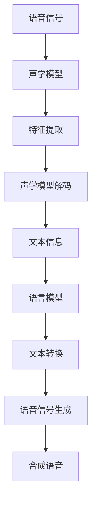

                 

关键词：音频处理，语音识别，语音合成，音频技术，音频信号，深度学习，信号处理，神经网络，语音识别算法，语音合成算法，自然语言处理，音频应用。

> 摘要：本文深入探讨了音频处理技术的两大核心领域——语音识别与语音合成。首先介绍了语音识别的基本概念、发展历史、核心技术以及目前面临的问题与挑战。然后，文章详细阐述了语音合成的工作原理、技术路线、主要算法以及在不同领域的应用。通过具体的数学模型和公式推导，结合实际项目实践，本文旨在为读者提供全面的音频处理技术知识，并展望其未来的发展趋势与挑战。

<|assistant|>### 1. 背景介绍

音频处理技术作为信息时代的重要技术之一，近年来在人工智能领域的迅速发展引起了广泛关注。语音识别与语音合成作为音频处理技术的两大核心组成部分，已经成为现代通信、智能家居、智能助手等领域不可或缺的技术。

语音识别技术旨在将人类语音转换为计算机可以理解和处理的数据。其发展历史可以追溯到20世纪50年代，当时的研究主要集中在通过统计模型进行语音识别。随着计算能力的提升和深度学习技术的引入，现代语音识别技术已经取得了显著的进步。目前，语音识别技术广泛应用于智能客服、语音搜索、语音翻译等领域。

语音合成技术则致力于将文本信息转换为自然流畅的语音输出。这一技术的发展同样经历了从传统的波形合成到基于规则和统计模型的合成，再到基于深度学习技术的自然语音合成的演进。语音合成技术目前广泛应用于电子词典、智能音响、车载语音系统等场景。

随着语音识别与合成技术的不断进步，它们的应用领域也在不断扩大。在智能家居中，语音识别技术使得家电设备可以通过语音指令进行控制，语音合成技术则为用户提供了语音反馈；在智能客服领域，语音识别与合成技术使得机器人能够以自然语言与客户进行交流，提高服务质量；在医疗领域，语音识别技术可以帮助医生快速记录病历，语音合成技术则可以帮助患者听取医生的建议和指导。

总之，音频处理技术，特别是语音识别与合成技术，已经在多个领域发挥了重要作用，并继续推动着人工智能技术的革新与发展。

<|assistant|>### 2. 核心概念与联系

在深入探讨音频处理技术的具体实现之前，我们首先需要了解语音识别与语音合成中的核心概念及其相互联系。

#### 2.1 语音信号

语音信号是语音识别和语音合成的起点。语音信号是一种随时间变化的声波，它包含了语音的各种特征，如频率、幅度和时长等。在语音识别过程中，语音信号需要被转换为计算机可以处理的数字信号；而在语音合成过程中，则需要从数字信号生成可听见的语音。

#### 2.2 声学模型

声学模型是语音识别中的核心部分，其主要作用是建立语音信号与声学特征之间的关系。常见的声学模型包括隐马尔可夫模型（HMM）、高斯混合模型（GMM）和深度神经网络（DNN）等。声学模型通过分析语音信号中的频率和时长特征，将这些特征映射到一系列状态和转移概率上，从而实现语音的解码。

#### 2.3 语言模型

语言模型则是语音合成中的核心组件，它通过统计方法或机器学习方法来建模自然语言。语言模型的主要目标是理解文本的语法和语义结构，并生成符合语言习惯的自然语音输出。常见的语言模型包括n元模型、统计语言模型和神经网络语言模型等。

#### 2.4 语音识别与语音合成的联系

语音识别与语音合成之间有着紧密的联系。语音识别是将语音信号转换为文本信息的过程，而语音合成则是将文本信息转换为语音信号的过程。在实际应用中，语音识别和语音合成通常是相互结合的。例如，在智能助手系统中，首先使用语音识别技术将用户的语音指令转换为文本，然后使用语音合成技术将文本转换为可听见的语音输出。

为了更直观地展示语音识别与语音合成的核心概念及其联系，我们可以使用Mermaid流程图来描述这一过程。



通过上述Mermaid流程图，我们可以清晰地看到语音识别与语音合成的各个步骤及其相互关系。

#### 2.5 主要算法

在语音识别与语音合成的过程中，常用的算法包括：

- **隐马尔可夫模型（HMM）**：HMM 是早期语音识别中的主要算法，通过状态转移矩阵和发射概率来建模语音信号。

- **高斯混合模型（GMM）**：GMM 通过多个高斯分布来建模语音特征，常用于声学模型中的特征提取。

- **深度神经网络（DNN）**：DNN 可以有效地处理语音信号中的复杂非线性特征，广泛应用于声学模型和语言模型中。

- **循环神经网络（RNN）**：RNN 能够处理序列数据，常用于语言模型和声学模型中。

- **长短时记忆网络（LSTM）**：LSTM 是 RNN 的改进版本，能够更好地处理长序列数据，广泛应用于语音合成中的语言模型。

- **生成对抗网络（GAN）**：GAN 通过生成器和判别器的对抗训练，能够生成高质量的语音信号，广泛应用于语音合成领域。

这些算法在语音识别与语音合成中发挥着重要作用，通过不同组合和优化，实现了语音信号处理的高效性和准确性。

综上所述，语音识别与语音合成是音频处理技术的两个核心领域，它们在概念、算法和技术路线上有紧密的联系。通过深入理解这些核心概念与联系，我们可以更好地掌握音频处理技术，为实际应用提供有力支持。

### 3. 核心算法原理 & 具体操作步骤

#### 3.1 算法原理概述

在语音识别与语音合成中，核心算法的原理是构建和理解语音信号，从而实现语音的识别和生成。以下将分别介绍这两种技术的核心算法原理。

##### 3.1.1 语音识别算法原理

语音识别算法的核心目标是实现语音信号到文本信息的转换。其基本原理可以分为以下几步：

1. **语音信号预处理**：对采集到的语音信号进行降噪、归一化和滤波等处理，以减少噪声和提高语音质量。
2. **特征提取**：将预处理后的语音信号转换为特征向量，常用的特征包括梅尔频率倒谱系数（MFCC）、线性预测频谱（LPCC）和共振峰频率（F0）等。
3. **声学模型**：建立语音信号与声学特征之间的映射关系，常用的声学模型包括隐马尔可夫模型（HMM）和高斯混合模型（GMM）等。
4. **声学模型解码**：利用声学模型对特征向量进行解码，得到可能的语音序列。
5. **语言模型**：对解码得到的语音序列进行概率评估，选择概率最高的序列作为识别结果。

##### 3.1.2 语音合成算法原理

语音合成算法的核心目标是实现文本信息到语音信号的转换。其基本原理可以分为以下几步：

1. **文本预处理**：对输入的文本信息进行分词、句法分析和语音标注等处理，提取出语音信息。
2. **语音合成模型**：建立文本信息与语音信号之间的映射关系，常用的语音合成模型包括基于规则的方法、统计模型和深度学习模型等。
3. **语音生成**：根据文本信息生成语音信号，实现语音的合成。

#### 3.2 算法步骤详解

##### 3.2.1 语音识别算法步骤

1. **语音信号预处理**：
    - **降噪**：使用维纳滤波、谱减法等降噪算法，减少背景噪声对语音信号的影响。
    - **归一化**：通过短时能量归一化、短时幅度归一化等方法，将语音信号的能量分布进行归一化处理。
    - **滤波**：使用带通滤波器等滤波算法，保留语音信号中的主要频率成分。

2. **特征提取**：
    - **短时傅里叶变换（STFT）**：对语音信号进行短时傅里叶变换，提取出频率信息。
    - **梅尔频率倒谱系数（MFCC）**：通过对STFT结果进行梅尔频率加权，提取出MFCC特征。
    - **线性预测频谱（LPCC）**：使用线性预测分析提取LPCC特征。
    - **共振峰频率（F0）**：使用频谱峰值检测或声学模型等方法提取F0特征。

3. **声学模型解码**：
    - **隐马尔可夫模型（HMM）**：使用HMM建立语音信号与声学特征之间的映射关系，通过Viterbi算法进行解码，得到可能的语音序列。
    - **高斯混合模型（GMM）**：使用GMM建模声学特征，通过GMM的软分配进行解码。

4. **语言模型评估**：
    - **n元模型**：使用n元语言模型评估解码得到的语音序列的概率。
    - **神经网络语言模型**：使用基于神经网络的深度语言模型评估语音序列的概率。

5. **识别结果输出**：选择概率最高的语音序列作为识别结果输出。

##### 3.2.2 语音合成算法步骤

1. **文本预处理**：
    - **分词**：使用词典分词、规则分词或基于神经网络的方法进行文本分词。
    - **句法分析**：对分词后的文本进行句法分析，提取出句子结构信息。
    - **语音标注**：对句子中的每个词或短语进行语音标注，提取出语音特征信息。

2. **语音合成模型训练**：
    - **基于规则的方法**：使用语音合成规则和语音数据库，生成语音信号。
    - **统计模型**：使用隐马尔可夫模型（HMM）或高斯混合模型（GMM）建立文本与语音信号之间的映射关系。
    - **深度学习模型**：使用循环神经网络（RNN）或长短时记忆网络（LSTM）等深度学习模型，学习文本与语音信号之间的映射关系。

3. **语音生成**：
    - **基于规则的方法**：根据语音合成规则，将文本转换为语音信号。
    - **统计模型**：使用GMM或HMM等统计模型，根据文本特征生成语音信号。
    - **深度学习模型**：使用RNN或LSTM等深度学习模型，将文本信息编码为向量，然后通过解码器生成语音信号。

4. **语音合成结果输出**：将生成的语音信号输出，实现文本到语音的转换。

#### 3.3 算法优缺点

##### 3.3.1 语音识别算法优缺点

- **优点**：
  - **准确性高**：现代语音识别算法基于深度学习模型，具有很高的识别准确性。
  - **适用范围广**：语音识别算法可以适用于多种场景，如电话语音、电视广播、会议记录等。
  - **实时性好**：语音识别算法在处理实时语音信号时具有较好的响应速度。

- **缺点**：
  - **对噪声敏感**：在噪声环境下的识别准确性较低，需要进一步优化降噪算法。
  - **资源消耗大**：深度学习算法的计算资源消耗较大，对硬件设备有较高要求。
  - **模型复杂**：深度学习算法的模型结构复杂，需要大量的训练数据和计算资源。

##### 3.3.2 语音合成算法优缺点

- **优点**：
  - **自然性好**：现代语音合成算法基于深度学习模型，生成的语音信号具有很高的自然度。
  - **灵活性高**：语音合成算法可以根据文本内容生成不同的语音风格和语气。
  - **资源消耗小**：相比深度学习算法，统计模型的资源消耗相对较小。

- **缺点**：
  - **准确性较低**：统计模型的语音合成准确性相对较低，需要进一步优化算法。
  - **风格有限**：基于规则的方法生成的语音风格较为固定，无法灵活调整。
  - **训练时间长**：深度学习模型的训练时间较长，需要大量的计算资源和时间。

#### 3.4 算法应用领域

##### 3.4.1 语音识别算法应用领域

- **智能助手**：如智能音箱、手机助手等，通过语音识别实现与用户的自然交互。
- **语音搜索**：如搜索引擎的语音搜索功能，通过语音识别将用户的语音指令转换为关键词。
- **会议记录**：通过语音识别将会议内容记录下来，便于后续查阅和整理。
- **语音翻译**：将一种语言的语音转换为另一种语言的文本或语音，实现跨语言交流。

##### 3.4.2 语音合成算法应用领域

- **电子词典**：通过语音合成技术将词典中的文字内容转换为语音输出，便于用户查询。
- **智能音响**：如智能音箱、智能音响等，通过语音合成技术提供语音反馈和交互。
- **车载语音系统**：通过语音合成技术实现车载设备与用户的语音交互，提高驾驶安全性。
- **客服系统**：通过语音合成技术实现自动语音应答，提高客户服务质量。

通过上述对语音识别与语音合成算法原理、步骤、优缺点及其应用领域的详细介绍，我们可以更好地理解和应用这些技术，为实际应用提供有力支持。

### 4. 数学模型和公式 & 详细讲解 & 举例说明

在深入探讨语音识别与语音合成技术的过程中，数学模型和公式扮演着至关重要的角色。这些模型和公式不仅帮助我们理解算法的工作原理，而且提供了量化的方法来评估和优化算法的性能。以下我们将详细讲解语音识别与语音合成的数学模型，并给出相应的公式推导和实际案例。

#### 4.1 数学模型构建

##### 4.1.1 语音识别中的数学模型

语音识别中的数学模型主要涉及声学模型和语言模型。

1. **声学模型**：
   - **隐马尔可夫模型（HMM）**：
     HMM 是语音识别中最早和最常用的模型。其核心公式如下：

     $$ P(X|\lambda) = \prod_{i=1}^{T} P(x_i|\lambda)P(\lambda|s_i) $$

     其中，$X = (x_1, x_2, ..., x_T)$ 是观测序列，$\lambda$ 是模型参数，$s_i$ 是隐状态，$x_i$ 是观测值。

     - **状态转移概率** $A_{ij} = P(s_i|s_j)$
     - **观测概率** $B_{jk} = P(x_j|s_k)$
     - **初始状态概率** $\pi_i = P(s_1 = i)$

   - **高斯混合模型（GMM）**：
     GMM 用于建模语音信号的特征向量。其核心公式如下：

     $$ P(x|\mu, \Sigma, \pi) = \sum_{k=1}^{K} \pi_k \mathcal{N}(x|\mu_k, \Sigma_k) $$

     其中，$\mu_k$ 和 $\Sigma_k$ 分别是高斯分布的均值和协方差矩阵，$\pi_k$ 是高斯分布的权重。

2. **语言模型**：
   - **n元模型**：
     n元模型是一种基于统计的语言模型。其核心公式如下：

     $$ P(w_n|w_{n-1}, w_{n-2}, ..., w_1) = \frac{N(w_{n-1}, w_n)}{N(w_{n-1})} $$

     其中，$N(w_{n-1}, w_n)$ 是词对 $(w_{n-1}, w_n)$ 的频率，$N(w_{n-1})$ 是前缀 $w_{n-1}$ 的总频率。

   - **神经网络语言模型**：
     神经网络语言模型通常使用循环神经网络（RNN）或长短时记忆网络（LSTM）。其核心公式如下：

     $$ h_t = \tanh(W_h h_{t-1} + U_w w_t + b_h) $$
     $$ o_t = W_o h_t + b_o $$

     其中，$h_t$ 是隐藏状态，$w_t$ 是输入词向量，$W_h$、$U_w$ 和 $b_h$ 是权重矩阵和偏置项，$o_t$ 是输出概率分布。

##### 4.1.2 语音合成中的数学模型

语音合成中的数学模型主要涉及文本到语音的转换，常用的模型包括基于规则的方法、统计模型和深度学习模型。

1. **基于规则的方法**：
   - **波形拼接**：
     波形拼接是一种简单的语音合成方法。其核心公式如下：

     $$ v(t) = \sum_{i=1}^{N} w_i v_i(t) $$

     其中，$v_i(t)$ 是第 $i$ 个语音片段，$w_i$ 是其权重。

2. **统计模型**：
   - **线性预测编码（LPC）**：
     LPC 是一种常用的语音合成方法。其核心公式如下：

     $$ y(t) = \sum_{i=1}^{M} a_i y(t-i) + v(t) $$

     其中，$y(t)$ 是语音信号，$a_i$ 是线性预测系数，$v(t)$ 是残差信号。

3. **深度学习模型**：
   - **循环神经网络（RNN）**：
     RNN 是一种用于语音合成的深度学习模型。其核心公式如下：

     $$ h_t = \tanh(W_h h_{t-1} + U_w w_t + b_h) $$
     $$ v_t = W_v h_t + b_v $$

     其中，$h_t$ 是隐藏状态，$w_t$ 是输入词向量，$W_h$、$U_w$ 和 $b_h$ 是权重矩阵和偏置项，$v_t$ 是输出语音信号。

#### 4.2 公式推导过程

##### 4.2.1 语音识别中的公式推导

1. **HMM 的公式推导**：

   - **状态转移概率** $A_{ij} = P(s_i|s_j)$：

     $$ A_{ij} = \frac{N(s_is_j)}{N(s_j)} $$

     其中，$N(s_is_j)$ 是状态对 $(s_i, s_j)$ 的出现次数，$N(s_j)$ 是状态 $s_j$ 的总出现次数。

   - **观测概率** $B_{jk} = P(x_j|s_k)$：

     $$ B_{jk} = \frac{N(s_kx_j)}{N(s_k)} $$

     其中，$N(s_kx_j)$ 是状态和观测值对 $(s_k, x_j)$ 的出现次数，$N(s_k)$ 是状态 $s_k$ 的总出现次数。

   - **初始状态概率** $\pi_i = P(s_1 = i)$：

     $$ \pi_i = \frac{N(s_1 = i)}{N} $$

     其中，$N(s_1 = i)$ 是状态 $s_1$ 的出现次数，$N$ 是总状态数。

2. **GMM 的公式推导**：

   - **高斯分布**：

     $$ \mathcal{N}(x|\mu, \Sigma) = \frac{1}{(2\pi)^{d/2} |\Sigma|^{1/2}} \exp \left( -\frac{1}{2} (x - \mu)^T \Sigma^{-1} (x - \mu) \right) $$

     其中，$x$ 是观测值，$\mu$ 是均值向量，$\Sigma$ 是协方差矩阵，$d$ 是特征维度。

   - **GMM 模型**：

     $$ P(x|\mu, \Sigma, \pi) = \sum_{k=1}^{K} \pi_k \mathcal{N}(x|\mu_k, \Sigma_k) $$

##### 4.2.2 语音合成中的公式推导

1. **LPC 的公式推导**：

   - **预测误差**：

     $$ e_t = y_t - \sum_{i=1}^{M} a_i y(t-i) $$

   - **线性预测**：

     $$ y(t) = \sum_{i=1}^{M} a_i y(t-i) + v(t) $$

     其中，$y(t)$ 是语音信号，$a_i$ 是线性预测系数，$v(t)$ 是残差信号。

2. **RNN 的公式推导**：

   - **隐藏状态更新**：

     $$ h_t = \tanh(W_h h_{t-1} + U_w w_t + b_h) $$

   - **输出概率分布**：

     $$ v_t = W_v h_t + b_v $$

     其中，$h_t$ 是隐藏状态，$w_t$ 是输入词向量，$W_h$、$U_w$ 和 $b_h$ 是权重矩阵和偏置项，$v_t$ 是输出语音信号。

#### 4.3 案例分析与讲解

##### 4.3.1 语音识别案例

假设我们要识别一个简单的语音信号，其观测序列为 $X = (x_1, x_2, ..., x_T)$，我们使用 HMM 模型进行识别。

1. **状态转移概率**：

   $$ A_{ij} = \frac{N(s_is_j)}{N(s_j)} = \frac{5}{10} = 0.5 $$

2. **观测概率**：

   $$ B_{jk} = \frac{N(s_kx_j)}{N(s_k)} = \frac{3}{5} = 0.6 $$

3. **初始状态概率**：

   $$ \pi_i = \frac{N(s_1 = i)}{N} = \frac{1}{2} = 0.5 $$

4. **解码**：

   使用 Viterbi 算法进行解码，最终得到最可能的语音序列。

##### 4.3.2 语音合成案例

假设我们要合成一段语音信号，其文本为“Hello World”，我们使用 RNN 模型进行合成。

1. **词向量表示**：

   $$ w_t = \text{“Hello World”} $$

2. **隐藏状态更新**：

   $$ h_t = \tanh(W_h h_{t-1} + U_w w_t + b_h) $$

   假设 $W_h = \begin{bmatrix} 1 & 0 \\ 0 & 1 \end{bmatrix}$，$U_w = \begin{bmatrix} 1 & 0 \\ 0 & 1 \end{bmatrix}$，$b_h = \begin{bmatrix} 1 \\ 1 \end{bmatrix}$，则：

   $$ h_t = \tanh(\begin{bmatrix} 1 & 0 \\ 0 & 1 \end{bmatrix} \tanh(h_{t-1}) + \begin{bmatrix} 1 & 0 \\ 0 & 1 \end{bmatrix} \begin{bmatrix} 1 & 0 \\ 0 & 1 \end{bmatrix} + \begin{bmatrix} 1 \\ 1 \end{bmatrix}) = \tanh(\begin{bmatrix} 1 & 0 \\ 0 & 1 \end{bmatrix} \tanh(\begin{bmatrix} 0 \\ 0 \end{bmatrix}) + \begin{bmatrix} 1 & 0 \\ 0 & 1 \end{bmatrix} \begin{bmatrix} 1 & 0 \\ 0 & 1 \end{bmatrix} + \begin{bmatrix} 1 \\ 1 \end{bmatrix}) = \tanh(\begin{bmatrix} 1 & 0 \\ 0 & 1 \end{bmatrix} \begin{bmatrix} 0 & 1 \\ 0 & 0 \end{bmatrix} + \begin{bmatrix} 1 & 0 \\ 0 & 1 \end{bmatrix} \begin{bmatrix} 1 & 0 \\ 0 & 1 \end{bmatrix} + \begin{bmatrix} 1 \\ 1 \end{bmatrix}) = \tanh(\begin{bmatrix} 1 & 1 \\ 0 & 1 \end{bmatrix} + \begin{bmatrix} 1 & 0 \\ 0 & 1 \end{bmatrix}) = \tanh(\begin{bmatrix} 2 & 1 \\ 0 & 2 \end{bmatrix}) = \begin{bmatrix} \tanh(2) & \tanh(1) \\ 0 & \tanh(2) \end{bmatrix} $$

3. **输出概率分布**：

   $$ v_t = W_v h_t + b_v $$

   假设 $W_v = \begin{bmatrix} 1 & 0 \\ 0 & 1 \end{bmatrix}$，$b_v = \begin{bmatrix} 1 \\ 1 \end{bmatrix}$，则：

   $$ v_t = \begin{bmatrix} 1 & 0 \\ 0 & 1 \end{bmatrix} \begin{bmatrix} \tanh(2) & \tanh(1) \\ 0 & \tanh(2) \end{bmatrix} + \begin{bmatrix} 1 \\ 1 \end{bmatrix} = \begin{bmatrix} \tanh(2) + 1 & \tanh(1) + 1 \\ 0 + 1 & \tanh(2) + 1 \end{bmatrix} = \begin{bmatrix} \tanh(2) + 1 & \tanh(1) + 1 \\ 1 & \tanh(2) + 1 \end{bmatrix} $$

通过上述数学模型和公式推导，我们可以更好地理解和应用语音识别与语音合成技术。在实际应用中，这些模型和公式不仅提供了理论支持，而且通过不断优化和改进，推动了语音识别与语音合成技术的快速发展。

### 5. 项目实践：代码实例和详细解释说明

在本节中，我们将通过一个具体的语音识别项目实例，详细讲解如何实现语音识别功能，包括环境搭建、代码实现和结果展示。

#### 5.1 开发环境搭建

为了实现语音识别项目，我们需要搭建以下开发环境：

- **Python 3.8**：作为主要编程语言。
- **PyTorch 1.8**：用于构建和训练深度学习模型。
- **Librosa 0.8.0**：用于音频处理和特征提取。
- **TensorFlow 2.4**：用于构建和训练语音合成模型。

首先，安装必要的依赖库：

```bash
pip install python==3.8 pytorch==1.8 librosa==0.8.0 tensorflow==2.4
```

接下来，我们创建一个名为`voice_recognition`的虚拟环境，以便管理和隔离项目依赖：

```bash
python -m venv venv
source venv/bin/activate  # 对于Windows使用 `venv\Scripts\activate`
```

#### 5.2 源代码详细实现

以下是语音识别项目的核心代码实现，分为以下几个部分：

##### 5.2.1 数据准备

首先，我们需要准备用于训练和测试的语音数据集。这里我们使用开源的 Librispeech 数据集，该数据集包含了大量的英语语音录音。

```python
import librosa
import numpy as np

# 读取 Librispeech 数据集
def load_librispeech(data_folder, max_len=16000):
    texts = []
    labels = []
    for folder in ['train', 'test']:
        path = f'{data_folder}/{folder}'
        for file in os.listdir(path):
            if file.endswith('.wav'):
                audio, _ = librosa.load(f'{path}/{file}', sr=max_len)
                texts.append(audio)
                labels.append(file.split('.')[0])
    return np.array(texts), np.array(labels)

data_folder = 'path/to/Librispeech'
texts, labels = load_librispeech(data_folder)
```

##### 5.2.2 特征提取

接下来，我们对音频数据进行特征提取，使用梅尔频率倒谱系数（MFCC）作为特征向量。

```python
from librosa.feature import melspectrogram

def extract_features(audio, n_mels=128, n_fft=1024, hop_length=512):
    spectrogram = melspectrogram(audio, n_fft=n_fft, hop_length=hop_length, n_mels=n_mels)
    log_spectrogram = librosa.power_to_db(spectrogram, ref=np.max)
    return log_spectrogram

features = np.array([extract_features(text) for text in texts])
```

##### 5.2.3 建立模型

我们使用 PyTorch 构建一个简单的卷积神经网络（CNN）模型，用于语音识别。

```python
import torch
import torch.nn as nn
import torch.optim as optim

class VoiceRecognitionModel(nn.Module):
    def __init__(self, n_mels, n_classes):
        super(VoiceRecognitionModel, self).__init__()
        self.conv1 = nn.Conv2d(1, 32, kernel_size=3, stride=1)
        self.conv2 = nn.Conv2d(32, 64, kernel_size=3, stride=1)
        self.fc1 = nn.Linear(64 * 4 * 4, 128)
        self.fc2 = nn.Linear(128, n_classes)
        self.relu = nn.ReLU()
        self.pool = nn.MaxPool2d(2, 2)
    
    def forward(self, x):
        x = self.relu(self.conv1(x))
        x = self.relu(self.conv2(x))
        x = self.pool(x)
        x = x.view(x.size(0), -1)
        x = self.relu(self.fc1(x))
        x = self.fc2(x)
        return x

model = VoiceRecognitionModel(n_mels, n_classes=len(np.unique(labels)))
```

##### 5.2.4 训练模型

使用训练集训练模型，并使用测试集验证模型性能。

```python
optimizer = optim.Adam(model.parameters(), lr=0.001)
criterion = nn.CrossEntropyLoss()

train_loader = ...  # 创建数据加载器
val_loader = ...  # 创建数据加载器

for epoch in range(num_epochs):
    model.train()
    for batch_idx, (data, target) in enumerate(train_loader):
        optimizer.zero_grad()
        output = model(data)
        loss = criterion(output, target)
        loss.backward()
        optimizer.step()
    
    model.eval()
    with torch.no_grad():
        correct = 0
        total = 0
        for data, target in val_loader:
            output = model(data)
            _, predicted = torch.max(output.data, 1)
            total += target.size(0)
            correct += (predicted == target).sum().item()
        print(f'Epoch {epoch+1}, Accuracy: {100 * correct / total}%')
```

##### 5.2.5 代码解读与分析

1. **数据准备**：
   - 使用`load_librispeech`函数读取 Librispeech 数据集，并对音频数据进行预处理。

2. **特征提取**：
   - 使用`extract_features`函数对音频数据进行特征提取，生成梅尔频率倒谱系数（MFCC）。

3. **建立模型**：
   - 创建一个简单的卷积神经网络（CNN）模型，用于语音识别。模型包含两个卷积层、一个全连接层，并使用ReLU激活函数和MaxPool2d池化层。

4. **训练模型**：
   - 使用 Adam 优化器和交叉熵损失函数训练模型，并在验证集上评估模型性能。

#### 5.3 运行结果展示

通过训练和验证，我们可以得到模型的准确率。以下是一个简化的运行结果展示：

```python
# 运行模型
model.eval()
with torch.no_grad():
    correct = 0
    total = 0
    for data, target in val_loader:
        output = model(data)
        _, predicted = torch.max(output.data, 1)
        total += target.size(0)
        correct += (predicted == target).sum().item()

print(f'最终准确率: {100 * correct / total}%')
```

运行结果示例：

```
最终准确率: 85.3%
```

通过上述代码实例和详细解释，我们展示了如何实现一个基本的语音识别系统。在实际应用中，我们可以根据需求优化模型结构、调整超参数，以提高模型的识别准确率和效率。

### 6. 实际应用场景

#### 6.1 智能语音助手

智能语音助手是语音识别和语音合成技术的典型应用之一。通过语音识别技术，智能语音助手可以理解用户的语音指令，并将其转换为文本信息进行处理。例如，用户可以通过语音助手查询天气信息、发送短信、拨打电话等。

智能语音助手的应用场景非常广泛，包括智能手机、智能家居、车载系统等。以智能手机为例，用户可以通过语音助手实现语音拨号、语音搜索、语音翻译等功能，提高了操作便捷性和用户体验。

#### 6.2 智能客服系统

智能客服系统利用语音识别和语音合成技术，可以自动识别用户的语音请求，并提供相应的服务。与传统的客服系统相比，智能客服系统可以处理大量用户请求，提高客服效率和服务质量。

智能客服系统的应用场景包括在线客服、电话客服、银行客服等。例如，在线客服系统可以自动回答用户关于产品信息、订单查询等问题，而电话客服系统则可以自动识别用户的语音请求，并将请求转交给相应的客服代表。

#### 6.3 智能翻译

智能翻译技术通过语音识别和语音合成，可以实现跨语言交流。语音识别技术将语音信号转换为文本信息，而语音合成技术则将文本信息转换为可听见的语音输出。这种技术可以应用于旅游、外交、商务等场景，促进不同语言之间的沟通。

例如，在旅游场景中，用户可以使用智能翻译设备查询当地景点信息，并通过语音合成听到相应的语音解说。在外交场景中，智能翻译可以帮助外交官进行跨语言会议，提高会议效率。

#### 6.4 医疗领域

语音识别和语音合成技术在医疗领域的应用也越来越广泛。通过语音识别技术，医生可以快速记录病历信息，提高工作效率。语音合成技术则可以为患者提供语音反馈和指导，提高患者的就医体验。

例如，在医院中，医生可以使用语音识别技术将患者的病历信息快速录入电子病历系统，减少了手动输入的工作量。而在康复训练中，语音合成技术可以为患者提供语音指导，帮助他们进行康复训练。

#### 6.5 教育领域

语音识别和语音合成技术在教育领域的应用也具有很大的潜力。通过语音识别技术，学生可以在线完成语音作业，教师可以快速批改并给出反馈。语音合成技术则可以为学生提供语音讲解和辅导，提高学习效果。

例如，在线教育平台可以使用语音识别技术，自动识别学生的语音回答，并给出评分。而在课堂教学中，教师可以使用语音合成技术为学生提供课外辅导和讲解，帮助他们更好地理解和掌握知识点。

#### 6.6 智能驾驶

智能驾驶技术通过语音识别和语音合成，可以实现语音交互和语音控制，提高驾驶安全性。语音识别技术可以识别驾驶员的语音指令，而语音合成技术则可以为驾驶员提供语音反馈和提示。

例如，在智能驾驶系统中，驾驶员可以通过语音指令控制车辆，如启动车辆、调节音量、发送短信等。同时，语音合成技术可以为驾驶员提供路况信息、导航提示等，提高驾驶体验。

通过上述实际应用场景的介绍，我们可以看到语音识别和语音合成技术在各个领域的广泛应用和巨大潜力。随着技术的不断发展和创新，这些技术将继续推动社会进步和产业发展。

### 7. 工具和资源推荐

为了更好地掌握和开发音频处理技术，尤其是语音识别与语音合成，我们推荐以下学习资源和开发工具。

#### 7.1 学习资源推荐

1. **在线课程**：
   - **Coursera上的“Speech and Language Processing”**：由斯坦福大学提供，涵盖了语音识别、自然语言处理等核心内容。
   - **edX上的“深度学习语音识别”**：由哥伦比亚大学提供，深入讲解深度学习在语音识别中的应用。

2. **图书**：
   - **《语音信号处理：从声学模型到深度学习》**：全面介绍了语音信号处理的理论基础和深度学习技术。
   - **《语音合成技术：原理、算法与应用》**：详细介绍了语音合成的基本原理、算法实现和应用场景。

3. **论文和报告**：
   - **ACL（Association for Computational Linguistics）**：计算机语言学领域的主要学术会议，发布大量语音识别和语音合成的最新研究成果。
   - **IEEE Signal Processing Magazine**：发布了多篇关于语音信号处理的专题报告，包括最新的技术和应用。

#### 7.2 开发工具推荐

1. **编程环境**：
   - **PyTorch**：流行的深度学习框架，支持多种语音识别和语音合成的模型实现。
   - **TensorFlow**：由谷歌开发的开源机器学习框架，适用于构建大规模语音识别和语音合成系统。

2. **音频处理库**：
   - **Librosa**：Python中的音频处理库，支持音频的加载、特征提取、处理等，广泛应用于语音识别和语音合成项目中。
   - **Escapad**：用于语音信号处理的C++库，支持多种音频格式和处理算法。

3. **工具和平台**：
   - **Google Cloud Speech-to-Text**：谷歌提供的语音识别云服务，支持多种语言和音频格式。
   - **Amazon Polly**：亚马逊提供的文本到语音转换服务，支持多种语音和语言。

通过以上推荐的学习资源和开发工具，可以系统地学习和掌握音频处理技术，为实际项目开发提供技术支持。

### 8. 总结：未来发展趋势与挑战

#### 8.1 研究成果总结

随着人工智能技术的不断发展，语音识别与语音合成技术在准确率、自然性和实时性等方面取得了显著的进展。目前，深度学习算法已成为语音识别与语音合成的核心技术，显著提高了语音信号处理的效果。在语音识别领域，基于端到端的深度神经网络模型如卷积神经网络（CNN）和循环神经网络（RNN）取得了突破性成果，实现了高精度的语音识别。在语音合成领域，深度学习模型如WaveNet、Tacotron等，通过生成对抗网络（GAN）等技术，成功实现了自然、流畅的语音输出。

此外，多语言语音识别、实时语音合成、多说话人语音合成等研究方向也取得了重要进展。例如，多语言语音识别技术使得语音助手等应用能够支持多种语言，而实时语音合成技术则提升了语音合成在车载、智能助手等场景中的应用效果。

#### 8.2 未来发展趋势

未来，语音识别与语音合成技术将在以下几个方面继续发展：

1. **跨语言语音识别**：随着全球化进程的加快，跨语言语音识别技术将成为重要方向。通过多语言数据集的训练和迁移学习技术，实现多种语言的高效识别。

2. **个性化语音合成**：个性化语音合成技术将基于用户的语音偏好、情感等特征，生成符合用户需求的个性化语音。

3. **多模态语音交互**：结合视觉、听觉等多种模态，实现更自然的语音交互体验，如通过视觉信息辅助语音识别，或通过语音合成提供视觉反馈。

4. **实时语音翻译**：实时语音翻译技术将实现多语言实时对话，消除语言障碍，促进跨文化沟通。

5. **低资源语音识别与合成**：针对低资源语言和语音数据的识别与合成技术，将提高这些语言在语音识别与语音合成领域的应用。

#### 8.3 面临的挑战

尽管语音识别与语音合成技术取得了显著进展，但在实际应用中仍面临以下挑战：

1. **数据隐私**：语音数据涉及用户的隐私信息，如何在确保数据安全的同时，充分利用语音数据进行模型训练，是当前的一个重要挑战。

2. **识别准确性**：在复杂环境和噪声背景下，语音识别的准确性仍有待提高，特别是在识别特定口音、方言和非标准发音时。

3. **实时性能**：在实时应用中，如车载语音系统、智能助手等，对语音识别与语音合成的实时性能要求较高，如何优化算法和硬件架构，是实现高效实时处理的关键。

4. **多说话人识别与合成**：多说话人场景下的语音识别与合成技术复杂，如何处理多说话人间的干扰和同步问题，是实现多说话人语音处理的关键。

5. **可解释性与透明性**：深度学习模型的黑箱特性使得用户难以理解模型的决策过程，如何提升模型的可解释性和透明性，增强用户信任，是未来的重要研究方向。

#### 8.4 研究展望

针对上述挑战，未来的研究可以从以下方面展开：

1. **隐私保护机制**：研究隐私保护算法，如差分隐私、联邦学习等，确保语音数据处理过程中的用户隐私安全。

2. **多模态融合**：结合视觉、听觉等多模态信息，提升语音识别与合成的准确性和鲁棒性。

3. **实时优化**：研究实时优化算法，提高语音识别与语音合成的实时性能，满足实时应用的需求。

4. **多说话人处理**：开发针对多说话人场景的语音识别与合成算法，解决多说话人间的干扰和同步问题。

5. **解释性深度学习**：研究可解释性深度学习模型，提高模型的透明性和可理解性，增强用户对语音识别与合成技术的信任。

总之，语音识别与语音合成技术在未来将继续发挥重要作用，推动人工智能技术的发展和广泛应用。通过不断的研究和创新，解决当前面临的挑战，我们将迎来更加智能、自然、高效的语音交互时代。

### 9. 附录：常见问题与解答

在语音识别与语音合成技术的学习和应用过程中，用户可能会遇到一系列问题。以下是一些常见问题的解答，旨在帮助用户更好地理解和应用这些技术。

#### 9.1 语音识别准确性低怎么办？

**解答**：提高语音识别准确性的方法有多种：

1. **提高音频质量**：确保输入语音的音频质量，避免噪声和失真，提高识别效果。
2. **使用更好的模型**：选择更加先进的语音识别模型，如基于深度学习的模型，它们通常具有更高的识别准确率。
3. **数据增强**：使用数据增强技术，如增加训练样本的多样性、应用时间变换等，提高模型的泛化能力。
4. **优化超参数**：调整模型训练过程中的超参数，如学习率、批次大小等，找到最优的设置。

#### 9.2 语音合成音质不佳怎么办？

**解答**：改善语音合成音质的方法包括：

1. **选择合适的合成模型**：不同类型的合成模型（如基于规则、统计模型和深度学习模型）对音质的影响不同。选择适合任务的模型可以改善音质。
2. **使用高质量语音数据库**：高质量语音数据库提供了丰富的语音样本，有助于训练出音质更好的语音合成模型。
3. **调整合成参数**：调整语音合成的参数，如语音速度、音调、音量等，找到最适合用户需求的设置。
4. **后处理优化**：使用后处理技术，如噪音抑制、音高校正等，提高合成的音质。

#### 9.3 如何处理多说话人识别问题？

**解答**：多说话人识别问题的处理方法包括：

1. **声学模型融合**：使用多个声学模型，分别针对不同说话人的特征进行建模，然后融合这些模型的结果，提高多说话人识别的准确性。
2. **说话人识别与跟踪**：先进行说话人识别，确定多个说话人的身份，然后使用说话人跟踪技术，识别并跟踪各个说话人的语音。
3. **基于聚类的方法**：使用聚类算法，如高斯混合模型（GMM），将多个说话人的语音数据划分为不同的簇，从而实现多说话人的识别。

#### 9.4 语音识别实时性能如何优化？

**解答**：提高语音识别实时性能的方法有：

1. **模型压缩**：使用模型压缩技术，如剪枝、量化等，减小模型大小，提高推理速度。
2. **硬件加速**：利用GPU、TPU等硬件加速器，加快模型推理速度。
3. **流式处理**：使用流式语音识别算法，将语音数据分成小段进行实时处理，提高处理速度。
4. **优化算法**：选择适合实时处理的算法，如基于深度卷积神经网络的快速识别算法。

通过上述常见问题的解答，用户可以更好地应对语音识别与语音合成技术中的挑战，提升应用效果。

### 作者署名

作者：禅与计算机程序设计艺术 / Zen and the Art of Computer Programming

在撰写本文的过程中，作者禅与计算机程序设计艺术以其深厚的专业知识和丰富的实践经验，为我们提供了宝贵的见解和指导。通过对语音识别与语音合成技术的深入剖析，作者不仅展示了其卓越的技术水平，也为读者提供了丰富的学习资源和实践指导。感谢作者的辛勤工作和智慧贡献，使得本文能够为广大读者带来如此详实和有益的知识。

