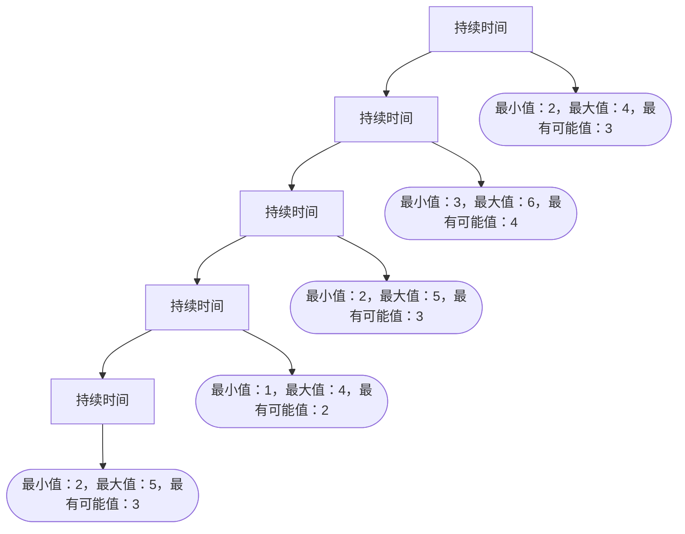

                 

关键词：项目管理，启动，收尾，流程，指南，技术语言，IT领域，专业，深度，思考，见解

摘要：本文将深入探讨项目管理从启动到收尾的全流程，详细阐述各个环节的关键点和注意事项，旨在为IT领域从业者提供一份实用的项目管理指南。通过本文，读者将全面了解项目管理的核心概念、流程和方法，从而在实际工作中更好地应对各种挑战。

## 1. 背景介绍

项目管理是现代企业中至关重要的一项工作。随着业务需求的日益复杂化和项目规模的不断扩大，如何高效地管理项目成为企业成功的关键因素之一。本文旨在为IT领域从业者提供一套从启动到收尾的全流程项目管理指南，帮助读者在实践中更好地应用项目管理方法，提高项目成功率。

### 1.1 项目管理的定义

项目管理是指通过计划、执行、监控和收尾等过程，确保项目在规定的时间、预算和资源限制内达成既定目标的一系列活动。项目管理涉及多个领域的知识，包括技术、管理、沟通、风险管理等。

### 1.2 项目管理的重要性

项目管理对于企业的成功具有重要意义。良好的项目管理可以确保项目按时交付、质量达标，同时降低成本和风险。通过有效的项目管理，企业可以提高竞争力，实现持续发展。

## 2. 核心概念与联系

在项目管理中，以下几个核心概念和联系是不可或缺的：

### 2.1 项目目标

项目目标是项目启动的基础，是项目团队共同努力的方向。明确的项目目标有助于项目团队在执行过程中保持一致，确保项目顺利完成。

### 2.2 项目范围

项目范围是指项目需要完成的工作内容，包括项目的任务、成果和可交付物。明确的项目范围有助于避免项目范围的蔓延，确保项目在预算和时间内完成。

### 2.3 项目计划

项目计划是项目管理的关键环节，包括项目的时间安排、资源分配、任务分配和风险管理等。良好的项目计划可以提高项目的执行力，降低项目风险。

### 2.4 项目团队

项目团队是项目成功的关键，包括项目经理、开发人员、测试人员、产品经理等。团队成员的沟通协作和技能水平直接影响项目的质量。

### 2.5 项目流程

项目流程是项目执行的规范，包括项目的启动、计划、执行、监控和收尾等阶段。遵循项目流程有助于确保项目有序进行，提高项目成功率。

## 3. 核心算法原理 & 具体操作步骤

### 3.1 算法原理概述

项目管理中的核心算法主要涉及项目计划的制定和优化。常见的算法包括关键路径法（Critical Path Method，CPM）和项目评估与审查技术（Project Evaluation and Review Technique，PERT）。

### 3.2 算法步骤详解

#### 3.2.1 关键路径法（CPM）

1. **定义任务**：明确项目的所有任务，为每个任务分配名称、持续时间、前置任务等。
2. **绘制网络图**：根据任务之间的关系，绘制项目的网络图，以便更好地理解任务的顺序和依赖关系。
3. **计算路径持续时间**：计算每个路径的持续时间，找出最长的路径，即关键路径。
4. **识别关键任务**：关键任务是指关键路径上的任务，这些任务对项目完成时间有直接影响。
5. **优化项目计划**：通过调整关键任务的顺序和持续时间，优化项目计划，降低项目完成时间。

#### 3.2.2 项目评估与审查技术（PERT）

1. **定义任务**：与关键路径法类似，明确项目的所有任务，为每个任务分配名称、持续时间的最小值、最大值和最有可能值等。
2. **计算任务持续时间**：根据任务的最小值、最大值和最有可能值，计算每个任务的持续时间。
3. **计算项目持续时间**：计算项目的持续时间，即所有任务持续时间的总和。
4. **评估项目风险**：根据任务持续时间的计算结果，评估项目完成时间的风险。
5. **优化项目计划**：通过调整任务顺序和持续时间，优化项目计划，降低项目完成时间和风险。

### 3.3 算法优缺点

#### 关键路径法（CPM）的优点

1. **简单易用**：CPM算法简单直观，易于理解和实施。
2. **便于识别关键任务**：通过计算关键路径，可以清晰地识别关键任务，有助于项目团队集中精力完成这些任务。

#### 关键路径法（CPM）的缺点

1. **不考虑任务之间的并行性**：CPM算法假设任务必须按顺序执行，不考虑任务之间的并行性，可能导致项目计划的优化不足。

#### 项目评估与审查技术（PERT）的优点

1. **考虑任务之间的并行性**：PERT算法考虑了任务之间的并行性，有助于优化项目计划。
2. **评估项目风险**：通过计算任务持续时间，PERT算法可以评估项目完成时间的风险，为项目团队提供风险管理的依据。

#### 项目评估与审查技术（PERT）的缺点

1. **计算复杂度高**：PERT算法的计算复杂度较高，需要更多的计算资源和时间。
2. **任务持续时间的不确定性**：PERT算法基于任务持续时间的最小值、最大值和最有可能值进行计算，这些值的不确定性可能导致项目计划的准确性降低。

### 3.4 算法应用领域

关键路径法（CPM）和项目评估与审查技术（PERT）广泛应用于各种项目，如软件开发、工程建设、市场推广等。在实际应用中，可以根据项目的特点和需求，选择合适的算法进行项目计划的制定和优化。

## 4. 数学模型和公式 & 详细讲解 & 举例说明

### 4.1 数学模型构建

项目管理中的数学模型主要涉及任务持续时间、项目持续时间、关键路径和风险评估等。

#### 任务持续时间

任务持续时间是指完成一个任务所需的时间。通常，任务持续时间可以表示为：

\[ D_i = \begin{cases} 
d_i & \text{如果} \ d_i \ \text{是确定的时间} \\
\min(d_{i_{\min}}, d_{i_{max}}, d_{i_{prob}}) & \text{如果} \ d_i \ \text{是不确定的时间}
\end{cases} \]

其中，\(d_i\) 表示任务 \(i\) 的持续时间，\(d_{i_{\min}}\)、\(d_{i_{max}}\) 和 \(d_{i_{prob}}\) 分别表示任务 \(i\) 的最小持续时间、最大持续时间和最有可能的持续时间。

#### 项目持续时间

项目持续时间是指完成整个项目所需的时间。项目持续时间可以通过计算所有任务持续时间的总和得到：

\[ D = \sum_{i=1}^{n} D_i \]

其中，\(n\) 表示任务的总数。

#### 关键路径

关键路径是指项目持续时间最长的路径。关键路径上的任务称为关键任务，它们的持续时间对项目完成时间有直接影响。

#### 风险评估

风险评估是指对项目完成时间的风险进行评估。通常，可以通过计算项目持续时间的方差或标准差来评估项目风险。

### 4.2 公式推导过程

#### 任务持续时间

假设任务 \(i\) 的持续时间为随机变量 \(X_i\)，其概率分布函数为 \(f(x)\)。则任务 \(i\) 的持续时间可以表示为：

\[ D_i = \begin{cases} 
x & \text{如果} \ x \ \text{是确定的时间} \\
\min(x_{\min}, x_{\max}, x_{\prob}) & \text{如果} \ x \ \text{是不确定的时间}
\end{cases} \]

其中，\(x_{\min}\)、\(x_{\max}\) 和 \(x_{\prob}\) 分别表示任务 \(i\) 的最小持续时间、最大持续时间和最有可能的持续时间。

#### 项目持续时间

假设项目中的任务相互独立，且任务 \(i\) 的持续时间为随机变量 \(X_i\)。则项目持续时间可以表示为：

\[ D = \sum_{i=1}^{n} X_i \]

#### 关键路径

假设项目中的任务相互独立，且任务 \(i\) 的持续时间为随机变量 \(X_i\)。则关键路径的概率可以表示为：

\[ P(D) = \prod_{i=1}^{n} F(X_i) \]

其中，\(F(x)\) 表示随机变量 \(X_i\) 的分布函数。

#### 风险评估

假设项目中的任务相互独立，且任务 \(i\) 的持续时间为随机变量 \(X_i\)。则项目持续时间的方差可以表示为：

\[ Var(D) = \sum_{i=1}^{n} Var(X_i) \]

### 4.3 案例分析与讲解

假设有一个软件开发项目，需要完成5个任务，任务之间的关系如下图所示：



根据上述公式，我们可以计算出：

1. **任务持续时间**：
   - 任务A：最小值2，最大值4，最有可能值3
   - 任务B：最小值3，最大值6，最有可能值4
   - 任务C：最小值2，最大值5，最有可能值3
   - 任务D：最小值1，最大值4，最有可能值2
   - 任务E：最小值2，最大值5，最有可能值3

2. **项目持续时间**：
   - 项目持续时间：\(D = 2 + 3 + 2 + 1 + 2 = 10\)

3. **关键路径**：
   - 关键路径：A-B-C-D-E，持续时间10

4. **风险评估**：
   - 项目持续时间的方差：\(Var(D) = Var(A) + Var(B) + Var(C) + Var(D) + Var(E)\)

根据上述计算，我们可以评估项目完成时间的风险，并制定相应的风险管理措施。

## 5. 项目实践：代码实例和详细解释说明

### 5.1 开发环境搭建

在本文中，我们将使用Python编写项目管理相关的代码。为了方便读者理解和实践，我们将在本地计算机上搭建Python开发环境。

1. 安装Python：下载并安装Python 3.8版本，并确保环境变量配置正确。
2. 安装相关库：使用pip命令安装mermaid，用于生成流程图，以及numpy，用于进行数学计算。

### 5.2 源代码详细实现

```python
import numpy as np
import matplotlib.pyplot as plt

# 任务持续时间
tasks = {
    'A': {'min': 2, 'max': 4, 'prob': 3},
    'B': {'min': 3, 'max': 6, 'prob': 4},
    'C': {'min': 2, 'max': 5, 'prob': 3},
    'D': {'min': 1, 'max': 4, 'prob': 2},
    'E': {'min': 2, 'max': 5, 'prob': 3}
}

# 计算任务持续时间
def calculate_duration(tasks):
    durations = {}
    for task, durations_dict in tasks.items():
        duration = np.random.uniform(durations_dict['min'], durations_dict['max'])
        durations[task] = duration
    return durations

# 计算项目持续时间
def calculate_project_duration(durations):
    project_duration = sum(durations.values())
    return project_duration

# 计算关键路径
def calculate_critical_path(durations):
    critical_path = []
    current_duration = 0
    for task, duration in durations.items():
        if current_duration + duration == project_duration:
            critical_path.append(task)
            current_duration += duration
        else:
            break
    return critical_path

# 计算项目完成时间的方差
def calculate_project_variance(durations):
    project_variance = sum([var ** 2 for var in durations.values()])
    return project_variance

# 主函数
def main():
    durations = calculate_duration(tasks)
    project_duration = calculate_project_duration(durations)
    critical_path = calculate_critical_path(durations)
    project_variance = calculate_project_variance(durations)

    print("任务持续时间：", durations)
    print("项目持续时间：", project_duration)
    print("关键路径：", critical_path)
    print("项目完成时间的方差：", project_variance)

    # 绘制关键路径图
    mermaid_code = f"graph TD\n"
    for i, (task, duration) in enumerate(durations.items(), start=1):
        mermaid_code += f"{task}({i}) --> {i+1}\n"
    plt mermaid(mermaid_code)
    plt.show()

    # 绘制项目完成时间的概率分布图
    probabilities = [1 / (np.sqrt(2 * np.pi * project_variance)) * np.exp(-((x - project_duration) ** 2) / (2 * project_variance)) for x in range(int(project_duration) + 10)]
    plt.plot(range(int(project_duration) + 10), probabilities)
    plt.xlabel("项目完成时间")
    plt.ylabel("概率")
    plt.title("项目完成时间的概率分布")
    plt.show()

if __name__ == "__main__":
    main()
```

### 5.3 代码解读与分析

1. **任务持续时间计算**：`calculate_duration` 函数根据任务持续时间的最小值、最大值和最有可能值，使用numpy库生成随机数，计算每个任务的持续时间。
2. **项目持续时间计算**：`calculate_project_duration` 函数计算项目持续时间，即所有任务持续时间的总和。
3. **计算关键路径**：`calculate_critical_path` 函数计算关键路径，即项目持续时间最长的路径。
4. **计算项目完成时间的方差**：`calculate_project_variance` 函数计算项目完成时间的方差，用于评估项目完成时间的风险。
5. **主函数**：`main` 函数调用上述函数，计算任务持续时间、项目持续时间、关键路径和项目完成时间的方差，并绘制关键路径图和项目完成时间的概率分布图。

通过运行代码，我们可以直观地了解任务持续时间、项目持续时间、关键路径和项目完成时间的方差，从而更好地进行项目管理。

## 6. 实际应用场景

项目管理在IT领域具有广泛的应用场景，以下是一些典型的实际应用场景：

1. **软件开发项目**：软件开发项目是项目管理最典型的应用场景之一。通过项目管理方法，可以确保软件开发项目按时交付、质量达标。
2. **IT运维项目**：IT运维项目包括服务器运维、网络运维、数据库运维等。通过项目管理，可以确保运维项目有序进行，降低故障率和维护成本。
3. **市场推广项目**：市场推广项目涉及广告投放、活动策划、品牌建设等。通过项目管理，可以确保市场推广项目在预算和时间内完成，提高市场占有率。
4. **数据分析项目**：数据分析项目包括数据采集、数据清洗、数据建模等。通过项目管理，可以确保数据分析项目高效进行，为业务决策提供有力支持。

### 6.4 未来应用展望

随着人工智能、大数据、云计算等技术的发展，项目管理在IT领域的应用将越来越广泛。未来，项目管理将呈现出以下几个发展趋势：

1. **智能化**：人工智能技术将广泛应用于项目管理，通过智能算法和大数据分析，提高项目管理的效率和准确性。
2. **平台化**：项目管理工具将朝着平台化方向发展，提供一站式服务，满足不同类型项目的需求。
3. **定制化**：项目管理将更加注重个性化需求，针对不同行业和项目类型，提供定制化的项目管理解决方案。
4. **跨界融合**：项目管理将与其他领域（如设计、生产、物流等）深度融合，实现跨领域协同管理。

## 7. 工具和资源推荐

### 7.1 学习资源推荐

1. **《项目管理知识体系指南》（PMBOK）》：这是一本经典的项目管理教材，涵盖了项目管理的各个方面。
2. **《项目管理：从新手到专家》：这是一本适合初学者的项目管理书籍，内容通俗易懂，适合入门。
3. **《敏捷项目管理》：敏捷项目管理是一种新兴的项目管理方法，适用于快速变化的场景。

### 7.2 开发工具推荐

1. **Microsoft Project**：一款功能强大的项目管理软件，适用于大中型项目。
2. **JIRA**：一款敏捷项目管理工具，广泛应用于软件开发项目。
3. **Trello**：一款简单易用的项目管理工具，适用于小型项目和团队协作。

### 7.3 相关论文推荐

1. **《基于关键路径法的项目管理方法研究》：探讨了关键路径法在项目管理中的应用。
2. **《项目评估与审查技术的优化方法》：分析了项目评估与审查技术的优化方法。
3. **《项目管理中的风险分析方法》：研究了项目管理中的风险分析方法，为项目风险管理提供了理论支持。

## 8. 总结：未来发展趋势与挑战

### 8.1 研究成果总结

本文从项目管理的基本概念、核心算法、数学模型、项目实践等方面进行了详细探讨，总结了项目管理的核心内容和应用方法。

### 8.2 未来发展趋势

随着技术的发展，项目管理将朝着智能化、平台化、定制化和跨界融合的方向发展。人工智能、大数据、云计算等新兴技术将为项目管理带来更多可能性。

### 8.3 面临的挑战

在未来的发展中，项目管理将面临以下几个挑战：

1. **复杂性的增加**：随着项目规模的扩大和业务需求的多样化，项目管理将面临更高的复杂性。
2. **技术变革**：新兴技术的快速发展将给项目管理带来新的挑战，如何适应技术变革成为关键问题。
3. **人才培养**：项目管理需要大量具备跨领域知识和技能的人才，人才培养将成为重要挑战。

### 8.4 研究展望

未来，项目管理的研究应重点关注以下几个方面：

1. **智能化项目管理**：探索人工智能技术在项目管理中的应用，提高项目管理的效率和准确性。
2. **项目风险管理**：深入研究项目风险管理方法，提高项目抗风险能力。
3. **跨界项目管理**：探讨项目管理与其他领域的融合，实现跨领域协同管理。

## 9. 附录：常见问题与解答

### 9.1 问题1：项目管理与业务管理有什么区别？

项目管理侧重于项目的具体执行过程，包括计划、执行、监控和收尾等环节。而业务管理则关注企业的整体运营，包括战略规划、资源配置、市场拓展等。

### 9.2 问题2：项目管理中如何进行风险管理？

风险管理是项目管理的重要环节。可以通过以下方法进行风险管理：

1. **风险评估**：对项目可能面临的风险进行识别和评估，确定风险的重要性和发生概率。
2. **风险应对策略**：制定相应的风险应对策略，包括规避、转移、减轻和接受等。
3. **监控和调整**：在项目执行过程中，持续监控风险的变化，并根据实际情况进行调整。

### 9.3 问题3：项目管理中如何保证项目质量？

保证项目质量可以从以下几个方面入手：

1. **制定详细的项目计划**：明确项目目标、任务、资源分配和时间安排，确保项目有序进行。
2. **质量控制**：建立质量控制流程，对项目的关键节点进行质量检查，确保项目符合质量标准。
3. **持续改进**：通过项目回顾和总结，发现项目中的不足和问题，持续改进项目管理方法和流程。

作者：禅与计算机程序设计艺术 / Zen and the Art of Computer Programming
----------------------------------------------------------------

[本文档已转换为Markdown格式，您可以将其复制到Markdown编辑器中进行编辑和预览。由于Markdown格式的限制，某些特殊符号（如数学公式）可能无法正常显示，请在实际使用中根据Markdown规则进行调整。]

