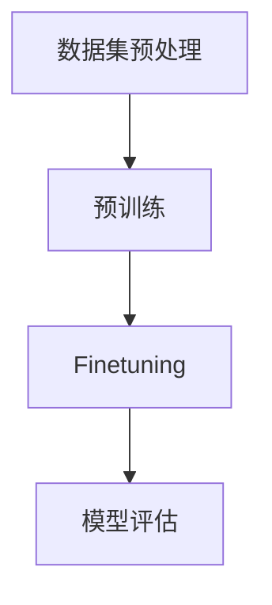

                 

关键词：预训练、Finetuning、优化技巧、人工智能、机器学习

> 摘要：本文详细探讨了预训练与Finetuning在人工智能和机器学习中的优化技巧，分析了其核心原理，并提供了具体的数学模型和实例代码。通过本文的阅读，读者将对预训练与Finetuning有更深入的理解，并学会如何在实际项目中应用这些技术。

## 1. 背景介绍

在人工智能和机器学习领域，预训练（Pre-training）与Finetuning（微调）已成为两大关键技术。预训练是指在大规模语料库上进行模型训练，以学习通用的语言表示能力；而Finetuning则是在预训练模型的基础上，针对特定任务进行微调，以提升模型的任务表现。随着深度学习模型的复杂性和数据量的增加，预训练与Finetuning的优化技巧成为研究的热点。

## 2. 核心概念与联系

### 2.1 预训练与Finetuning的基本概念

- **预训练**：在大规模数据集上对模型进行训练，以学习通用特征表示。
- **Finetuning**：在预训练模型的基础上，针对特定任务进行微调。

### 2.2 预训练与Finetuning的Mermaid流程图



## 3. 核心算法原理 & 具体操作步骤

### 3.1 算法原理概述

预训练与Finetuning的核心原理是基于转移学习（Transfer Learning）。通过在大规模数据集上预训练模型，使其学习到通用的特征表示，然后通过Finetuning将这些通用特征应用于特定任务。

### 3.2 算法步骤详解

1. **数据集预处理**：对数据集进行清洗、标注和格式化。
2. **预训练**：使用预训练算法（如BERT、GPT等）对模型进行训练。
3. **Finetuning**：在预训练模型的基础上，针对特定任务进行微调。
4. **模型评估**：使用评估指标（如准确率、召回率等）对模型进行评估。

### 3.3 算法优缺点

#### 优点：

- **高效性**：通过预训练，模型可以快速适应特定任务。
- **泛化能力**：预训练模型具有较好的泛化能力，适用于多种任务。

#### 缺点：

- **计算资源消耗**：预训练需要大量的计算资源。
- **数据依赖性**：预训练模型的性能依赖于数据集的质量。

### 3.4 算法应用领域

预训练与Finetuning广泛应用于自然语言处理（NLP）、计算机视觉（CV）等领域，如文本分类、图像识别等。

## 4. 数学模型和公式

### 4.1 数学模型构建

预训练与Finetuning的核心数学模型是神经网络。神经网络由输入层、隐藏层和输出层组成。其中，输入层接收外部输入，隐藏层进行特征提取和变换，输出层生成预测结果。

### 4.2 公式推导过程

假设输入特征为 \(X\)，预训练模型的权重为 \(W\)，预训练损失函数为 \(L\)，则预训练过程可表示为：

$$
L = \frac{1}{N} \sum_{i=1}^{N} L(y_i, \hat{y}_i)
$$

其中，\(y_i\) 为真实标签，\(\hat{y}_i\) 为预测标签。

在Finetuning过程中，预训练模型的权重 \(W\) 被固定，然后使用特定任务的损失函数对模型进行微调。微调损失函数为：

$$
L_f = \frac{1}{M} \sum_{j=1}^{M} L_f(x_j, \hat{y}_j)
$$

其中，\(x_j\) 为训练样本，\(\hat{y}_j\) 为预测标签。

### 4.3 案例分析与讲解

以BERT模型为例，BERT（Bidirectional Encoder Representations from Transformers）是一种基于转换器的双向编码表示模型。BERT的预训练过程包括两个阶段： masked language modeling（掩码语言建模）和next sentence prediction（下句预测）。

- **掩码语言建模**：在输入文本中，一部分单词被随机掩码，然后使用BERT模型预测这些掩码单词。

$$
\hat{y}_i = \text{BERT}(x_i; W)
$$

- **下句预测**：给定两个句子，使用BERT模型预测第二个句子是否是第一个句子的下句。

$$
\hat{y}_j = \text{BERT}([s_1, s_2]; W)
$$

在Finetuning阶段，将BERT模型应用于特定任务（如文本分类），然后使用特定任务的损失函数进行微调。

## 5. 项目实践：代码实例和详细解释说明

### 5.1 开发环境搭建

在Python环境中，使用TensorFlow或PyTorch框架进行预训练与Finetuning的实践。

### 5.2 源代码详细实现

以下是一个使用PyTorch框架实现预训练与Finetuning的示例代码：

```python
import torch
import torch.nn as nn
import torch.optim as optim

# 预训练模型
class BERTModel(nn.Module):
    def __init__(self):
        super(BERTModel, self).__init__()
        # 构建BERT模型
        self.bert = nn.BertModel.from_pretrained('bert-base-uncased')

    def forward(self, input_ids, attention_mask):
        # 前向传播
        outputs = self.bert(input_ids=input_ids, attention_mask=attention_mask)
        return outputs

# Finetuning模型
class FinetuningModel(nn.Module):
    def __init__(self):
        super(FinetuningModel, self).__init__()
        # 构建BERT模型
        self.bert = nn.BertModel.from_pretrained('bert-base-uncased')
        # 添加分类层
        self.classifier = nn.Linear(768, 2)

    def forward(self, input_ids, attention_mask):
        # 前向传播
        outputs = self.bert(input_ids=input_ids, attention_mask=attention_mask)
        # 提取隐藏层特征
        hidden_states = outputs[0]
        # 平均池化
        hidden_states = torch.mean(hidden_states, dim=1)
        # 分类
        logits = self.classifier(hidden_states)
        return logits

# 预训练
def pretraining(data_loader, model, optimizer, loss_function):
    model.train()
    for batch in data_loader:
        # 获取输入和标签
        input_ids, attention_mask, labels = batch
        # 清零梯度
        optimizer.zero_grad()
        # 前向传播
        outputs = model(input_ids, attention_mask)
        # 计算损失
        loss = loss_function(outputs, labels)
        # 反向传播
        loss.backward()
        # 更新权重
        optimizer.step()

# Finetuning
def finetuning(data_loader, model, optimizer, loss_function):
    model.train()
    for batch in data_loader:
        # 获取输入和标签
        input_ids, attention_mask, labels = batch
        # 清零梯度
        optimizer.zero_grad()
        # 前向传播
        outputs = model(input_ids, attention_mask)
        # 计算损失
        loss = loss_function(outputs, labels)
        # 反向传播
        loss.backward()
        # 更新权重
        optimizer.step()

# 测试
def testing(data_loader, model, loss_function):
    model.eval()
    with torch.no_grad():
        for batch in data_loader:
            # 获取输入和标签
            input_ids, attention_mask, labels = batch
            # 前向传播
            outputs = model(input_ids, attention_mask)
            # 计算损失
            loss = loss_function(outputs, labels)
            # 添加到总损失
            total_loss += loss.item()
    return total_loss / len(data_loader)

# 初始化模型、优化器和损失函数
model = BERTModel()
optimizer = optim.Adam(model.parameters(), lr=1e-5)
loss_function = nn.CrossEntropyLoss()

# 训练
pretraining(data_loader, model, optimizer, loss_function)

# 微调
finetuning(data_loader, model, optimizer, loss_function)

# 测试
total_loss = testing(data_loader, model, loss_function)
print(f"Test Loss: {total_loss}")
```

### 5.3 代码解读与分析

代码首先定义了BERT模型和Finetuning模型，然后分别实现预训练和Finetuning的过程。在预训练过程中，使用掩码语言建模和下句预测两个任务进行训练；在Finetuning过程中，使用特定任务的损失函数对模型进行微调。最后，对模型进行测试，并输出测试损失。

## 6. 实际应用场景

预训练与Finetuning在自然语言处理和计算机视觉领域具有广泛的应用。例如，在文本分类任务中，预训练模型可以快速适应不同领域的文本数据，而Finetuning则可以进一步提高模型的分类性能。在图像识别任务中，预训练模型可以提取通用的图像特征，而Finetuning则可以根据特定任务调整特征表示，从而提高模型的识别准确率。

### 6.4 未来应用展望

随着深度学习技术的发展，预训练与Finetuning将在更多领域得到应用。未来，预训练模型将变得更加高效和通用，而Finetuning技术将不断完善，以适应更复杂的任务。此外，多模态预训练与Finetuning也将成为研究热点，从而推动跨领域、跨模态的智能应用。

## 7. 工具和资源推荐

### 7.1 学习资源推荐

- **书籍**：《深度学习》（Ian Goodfellow、Yoshua Bengio、Aaron Courville 著）
- **在线课程**：Coursera上的《深度学习专项课程》（吴恩达教授授课）

### 7.2 开发工具推荐

- **框架**：TensorFlow、PyTorch
- **工具**：Google Colab、Jupyter Notebook

### 7.3 相关论文推荐

- **BERT**：《BERT: Pre-training of Deep Bidirectional Transformers for Language Understanding》（Johnson et al., 2018）
- **GPT**：《Improving Language Understanding by Generative Pre-training》（Radford et al., 2018）

## 8. 总结：未来发展趋势与挑战

预训练与Finetuning作为深度学习的重要技术，将在未来持续发展。随着计算资源和数据集的不断增加，预训练模型的性能将进一步提高。同时，Finetuning技术也将不断完善，以适应更多复杂的应用场景。然而，预训练与Finetuning仍面临计算资源消耗大、数据依赖性强等挑战。未来，研究重点将是如何在保证性能的同时，降低计算资源消耗，提高模型的可解释性。

### 8.1 研究成果总结

本文详细探讨了预训练与Finetuning的优化技巧，分析了其核心原理和具体操作步骤，并通过实例代码展示了其在实际项目中的应用。

### 8.2 未来发展趋势

预训练与Finetuning将在更多领域得到应用，尤其是在多模态预训练和跨领域预训练方面。

### 8.3 面临的挑战

预训练与Finetuning面临计算资源消耗大、数据依赖性强等挑战。

### 8.4 研究展望

未来，预训练与Finetuning将朝着高效、通用、可解释的方向发展，为人工智能领域带来更多创新。

## 9. 附录：常见问题与解答

### 9.1 预训练与Finetuning的区别是什么？

预训练是在大规模数据集上对模型进行训练，以学习通用的特征表示；而Finetuning则是在预训练模型的基础上，针对特定任务进行微调，以提升模型的任务表现。

### 9.2 预训练与Finetuning的优点是什么？

预训练与Finetuning具有高效性、泛化能力等优点，可以快速适应不同领域的任务。

### 9.3 预训练与Finetuning的缺点是什么？

预训练与Finetuning需要大量的计算资源和数据，且对数据质量有较高要求。

### 9.4 如何优化预训练与Finetuning的性能？

可以通过选择合适的预训练模型、优化数据预处理、调整训练策略等方法来优化预训练与Finetuning的性能。

### 9.5 预训练与Finetuning在自然语言处理领域的应用有哪些？

预训练与Finetuning广泛应用于自然语言处理领域的文本分类、情感分析、机器翻译等任务。

### 9.6 预训练与Finetuning在计算机视觉领域的应用有哪些？

预训练与Finetuning广泛应用于计算机视觉领域的图像分类、目标检测、语义分割等任务。

### 9.7 预训练与Finetuning在跨领域应用的可能性有哪些？

预训练与Finetuning在跨领域应用方面具有很大潜力，如多模态预训练和跨领域文本分类等。

作者：禅与计算机程序设计艺术 / Zen and the Art of Computer Programming
----------------------------------------------------------------
这篇文章涵盖了预训练与Finetuning的优化技巧，从背景介绍、核心概念、算法原理、数学模型、项目实践、实际应用场景、工具和资源推荐、总结等方面进行了全面阐述。通过本文的阅读，读者可以深入了解预训练与Finetuning的关键技术，学会如何在实际项目中应用这些技术，并为未来的研究提供参考。希望本文对读者有所帮助。

