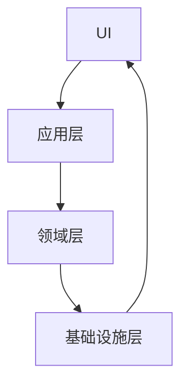
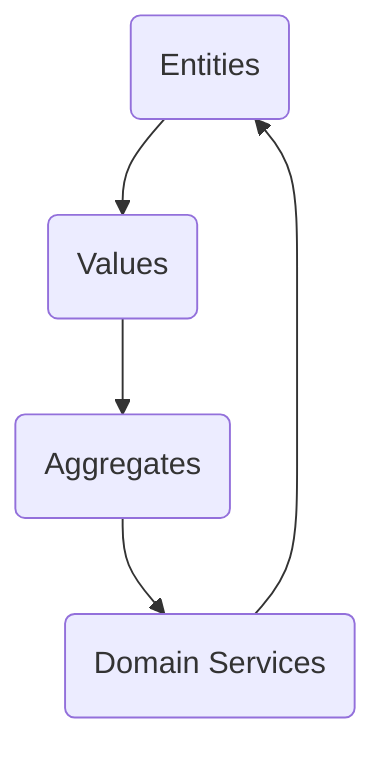

                 

关键词：领域驱动设计、软件开发、方法论、架构设计、代码质量、业务领域、模型驱动、软件架构

摘要：本文将深入探讨领域驱动设计（Domain-Driven Design, DDD）的方法论，包括其核心概念、应用场景、开发流程以及在实际项目中的实践指导。通过本文的阅读，读者将能够全面了解DDD的方法论，并掌握如何将其应用于软件开发实践中，提高代码质量、提升团队协作效率，实现可持续发展的软件架构。

## 1. 背景介绍

在软件开发领域，传统的软件开发方法往往过于关注技术实现，而忽略了业务领域的特殊性。这种情况下，开发人员常常会陷入代码编写和架构设计的泥潭，导致项目难以维护、扩展性差、业务需求响应缓慢。为了解决这些问题，领域驱动设计（DDD）应运而生。

DDD是一种面向业务领域的软件开发方法论，强调将软件开发过程与业务领域紧密结合。通过DDD，开发人员可以更好地理解业务领域，构建具有高内聚、低耦合的软件架构，从而提高代码质量、降低维护成本、提升团队协作效率。

## 2. 核心概念与联系

### 2.1 整体架构

DDD的整体架构可以分为四个层次：展示层（UI）、应用层、领域层和基础设施层。以下是一个简单的Mermaid流程图，展示了这四个层次之间的关系。



### 2.2 领域模型

领域模型是DDD的核心概念，它代表了业务领域中的实体、值对象、聚合、领域服务等要素。以下是一个领域模型的Mermaid流程图，展示了这些要素之间的关系。



## 3. 核心算法原理 & 具体操作步骤

### 3.1 算法原理概述

DDD的核心算法原理在于将业务领域抽象成一套完整的领域模型，并在模型的基础上实现软件架构。具体操作步骤如下：

1. **需求分析**：与业务人员沟通，了解业务需求，提取领域模型的关键要素。
2. **领域建模**：根据需求分析结果，构建领域模型，定义实体、值对象、聚合、领域服务等要素。
3. **架构设计**：基于领域模型，设计软件架构，确保各个层次之间的松耦合和高内聚。
4. **编码实现**：按照领域模型和软件架构，进行编码实现。
5. **测试与优化**：对代码进行单元测试和集成测试，不断优化代码质量和性能。

### 3.2 算法步骤详解

#### 3.2.1 需求分析

需求分析是DDD开发的第一步，也是至关重要的一步。在这一阶段，开发人员需要与业务人员、项目经理等各方进行深入沟通，了解业务需求、业务流程、业务规则等。具体步骤如下：

1. **收集需求**：通过访谈、问卷调查、用户故事等方式，收集业务需求。
2. **梳理业务流程**：将业务需求转化为业务流程，明确各个环节之间的关系。
3. **分析业务规则**：提取业务规则，为后续的领域建模提供依据。

#### 3.2.2 领域建模

领域建模是DDD的核心步骤，通过构建领域模型，将业务领域中的关键要素抽象为实体、值对象、聚合、领域服务等。具体步骤如下：

1. **定义实体**：实体是具有独立存在意义的业务对象，如用户、订单等。定义实体时，需要明确实体的属性、行为和关系。
2. **定义值对象**：值对象是具有独立存在意义的业务对象，如日期、金额等。值对象通常只包含属性，没有行为。
3. **定义聚合**：聚合是具有独立逻辑的实体和值对象的集合，如订单聚合、用户聚合等。聚合内部的实体和值对象之间存在紧密的关系。
4. **定义领域服务**：领域服务是用于处理业务逻辑的计算方法，如订单生成、用户登录等。领域服务通常不直接操作实体和值对象，而是通过聚合来间接访问。

#### 3.2.3 架构设计

架构设计是基于领域模型进行的，其目的是确保软件架构的松耦合和高内聚。具体步骤如下：

1. **设计展示层**：展示层负责与用户进行交互，设计展示层时，需要考虑用户体验、界面布局、功能模块等。
2. **设计应用层**：应用层负责处理业务逻辑，设计应用层时，需要根据领域模型，将业务逻辑划分为多个领域服务。
3. **设计领域层**：领域层负责实现领域模型，设计领域层时，需要根据领域模型，实现实体、值对象、聚合、领域服务等。
4. **设计基础设施层**：基础设施层负责提供底层支持，如数据库、缓存、消息队列等。

#### 3.2.4 编码实现

编码实现是按照领域模型和软件架构进行的，具体步骤如下：

1. **编写领域层代码**：根据领域模型，实现实体、值对象、聚合、领域服务等。
2. **编写应用层代码**：根据应用层设计，实现业务逻辑。
3. **编写展示层代码**：根据展示层设计，实现用户界面。
4. **编写基础设施层代码**：根据基础设施层设计，实现底层支持。

#### 3.2.5 测试与优化

测试与优化是确保软件质量和性能的重要环节，具体步骤如下：

1. **单元测试**：对领域层、应用层、展示层的代码进行单元测试，确保各个模块的功能正确。
2. **集成测试**：对整个系统进行集成测试，确保各个模块之间的协作正常。
3. **性能测试**：对系统进行性能测试，确保系统的响应速度和并发能力。
4. **优化代码**：根据测试结果，对代码进行优化，提高系统的性能和可维护性。

### 3.3 算法优缺点

#### 3.3.1 优点

1. **提高代码质量**：DDD强调领域模型和软件架构的设计，有助于提高代码质量。
2. **降低维护成本**：通过领域模型和软件架构，降低了代码之间的耦合度，降低了维护成本。
3. **提升团队协作效率**：DDD强调业务领域和软件开发过程的紧密结合，有助于提升团队协作效率。
4. **提高扩展性**：DDD的架构设计使得系统具有较好的扩展性，可以轻松应对业务需求的变化。

#### 3.3.2 缺点

1. **学习成本较高**：DDD需要开发者具备一定的业务理解和架构设计能力，学习成本较高。
2. **开发周期较长**：DDD强调领域模型和软件架构的设计，开发周期相对较长。
3. **文档编写要求较高**：DDD要求开发者编写详细的领域模型和软件架构文档，文档编写要求较高。

### 3.4 算法应用领域

DDD可以应用于各种业务领域，尤其适用于复杂、大型、长时间运行的项目。以下是一些典型的应用领域：

1. **金融领域**：如银行、保险、基金等。
2. **电子商务领域**：如电商平台、在线支付、物流等。
3. **物流领域**：如仓储管理、运输调度、供应链管理等。
4. **教育领域**：如在线教育、学习管理系统等。
5. **医疗领域**：如电子病历、医学影像处理等。

## 4. 数学模型和公式 & 详细讲解 & 举例说明

### 4.1 数学模型构建

在DDD中，数学模型主要用于描述领域模型中的关系和计算。以下是一个简单的数学模型示例，用于描述订单和商品之间的关系。

```latex
\text{订单}(Order) = \text{商品集}(Goods \setminus \{\}) \\
\text{商品}(Goods) = \text{商品ID}(ID), \text{商品名称}(Name), \text{价格}(Price) \\
\text{订单总金额} = \sum_{g \in \text{商品集}} g.\text{价格}
```

### 4.2 公式推导过程

假设有一个订单包含多个商品，每个商品有一个价格。我们需要计算订单的总金额。首先，我们定义一个订单总金额的公式：

$$
\text{订单总金额} = \sum_{g \in \text{商品集}} g.\text{价格}
$$

其中，$g.\text{价格}$表示第$i$个商品的价格。为了计算订单总金额，我们需要遍历订单中的所有商品，并计算每个商品的价格之和。

### 4.3 案例分析与讲解

假设有一个订单，包含2个商品，分别是苹果和香蕉，价格分别为5元和10元。我们需要计算这个订单的总金额。

根据订单总金额的公式，我们可以计算：

$$
\text{订单总金额} = (5 + 10) = 15 \text{元}
$$

因此，这个订单的总金额是15元。

## 5. 项目实践：代码实例和详细解释说明

### 5.1 开发环境搭建

在进行DDD项目实践之前，我们需要搭建一个开发环境。这里我们使用Java作为编程语言，Maven作为构建工具，Spring Boot作为开发框架。

1. **安装Java开发环境**：下载并安装Java SDK，设置环境变量。
2. **安装Maven**：下载并安装Maven，设置环境变量。
3. **创建Spring Boot项目**：使用Spring Initializr（https://start.spring.io/）创建一个基础的Spring Boot项目。

### 5.2 源代码详细实现

在这个示例中，我们将实现一个简单的电子商务系统，包含用户、订单、商品等实体，以及用户注册、登录、订单生成等业务功能。

#### 5.2.1 定义领域模型

首先，我们需要定义领域模型中的实体、值对象、聚合和领域服务。

```java
// 用户实体
@Entity
public class User {
    @Id
    @GeneratedValue(strategy = GenerationType.IDENTITY)
    private Long id;
    private String username;
    private String password;
    // ... 其他属性和方法
}

// 订单聚合
@Aggregate
public class Order {
    @Id
    @GeneratedValue(strategy = GenerationType.IDENTITY)
    private Long id;
    private String orderNumber;
    @AggregateCollection
    private List<OrderItem> items;
    // ... 其他属性和方法
}

// 订单项值对象
@ValueObject
public class OrderItem {
    private Long id;
    private String itemName;
    private double price;
    // ... 其他属性和方法
}

// 用户登录领域服务
public class LoginService {
    public User login(String username, String password) {
        // ... 登录逻辑
    }
}

// 订单生成领域服务
public class OrderService {
    public Order createOrder(User user, List<OrderItem> items) {
        // ... 订单生成逻辑
    }
}
```

#### 5.2.2 编写应用层代码

应用层代码主要负责处理业务逻辑，将领域服务与展示层进行隔离。

```java
@RestController
@RequestMapping("/api/users")
public class UserController {
    private final LoginService loginService;

    public UserController(LoginService loginService) {
        this.loginService = loginService;
    }

    @PostMapping("/login")
    public ResponseEntity<User> login(@RequestBody LoginRequest request) {
        User user = loginService.login(request.getUsername(), request.getPassword());
        return ResponseEntity.ok(user);
    }
}

@RestController
@RequestMapping("/api/orders")
public class OrderController {
    private final OrderService orderService;

    public OrderController(OrderService orderService) {
        this.orderService = orderService;
    }

    @PostMapping("/create")
    public ResponseEntity<Order> createOrder(@RequestBody CreateOrderRequest request) {
        Order order = orderService.createOrder(request.getUser(), request.getItems());
        return ResponseEntity.ok(order);
    }
}
```

#### 5.2.3 编写领域层代码

领域层代码主要负责实现领域模型中的实体、值对象、聚合和领域服务。

```java
// 用户实体实现
@Service
public class UserService {
    @Autowired
    private UserRepository userRepository;

    public User login(String username, String password) {
        User user = userRepository.findByUsername(username);
        if (user != null && user.getPassword().equals(password)) {
            return user;
        }
        return null;
    }
}

// 订单聚合实现
@Service
public class OrderService {
    @Autowired
    private OrderRepository orderRepository;

    public Order createOrder(User user, List<OrderItem> items) {
        Order order = new Order();
        order.setUser(user);
        order.setOrderNumber(UUID.randomUUID().toString());
        order.setItems(items);
        orderRepository.save(order);
        return order;
    }
}

// 订单项值对象实现
@Service
public class OrderItemService {
    @Autowired
    private OrderItemRepository orderItemRepository;

    public List<OrderItem> createOrderItems(List<OrderItemRequest> requests) {
        List<OrderItem> items = new ArrayList<>();
        for (OrderItemRequest request : requests) {
            OrderItem item = new OrderItem();
            item.setId(UUID.randomUUID().toString());
            item.setItemName(request.getItemName());
            item.setPrice(request.getPrice());
            items.add(item);
        }
        orderItemRepository.saveAll(items);
        return items;
    }
}
```

#### 5.2.4 编写基础设施层代码

基础设施层代码主要负责实现底层支持，如数据库、缓存、消息队列等。

```java
// 用户仓库实现
@Repository
public class UserRepository extends JpaSpecificationExecutor<User> {
    @PersistenceContext
    private EntityManager entityManager;

    @Override
    public List<User> findAll() {
        CriteriaBuilder criteriaBuilder = entityManager.getCriteriaBuilder();
        CriteriaQuery<User> criteriaQuery = criteriaBuilder.createQuery(User.class);
        Root<User> root = criteriaQuery.from(User.class);
        criteriaQuery.select(root);
        return entityManager.createQuery(criteriaQuery).getResultList();
    }
}

// 订单仓库实现
@Repository
public class OrderRepository extends JpaRepository<Order, Long> {
    // ... 其他方法
}

// 订单项仓库实现
@Repository
public class OrderItemRepository extends JpaRepository<OrderItem, Long> {
    // ... 其他方法
}
```

### 5.3 代码解读与分析

在这个示例中，我们使用DDD方法进行了电子商务系统的开发。以下是代码的解读与分析：

1. **领域模型**：我们定义了用户、订单、订单项等实体，以及用户登录、订单生成等领域服务。领域模型清晰地描述了业务领域中的关键要素，为后续开发提供了基础。
2. **应用层**：应用层负责处理业务逻辑，将领域服务与展示层进行隔离。用户登录、订单生成等功能通过RESTful API进行暴露，便于与其他系统进行集成。
3. **领域层**：领域层负责实现领域模型中的实体、值对象、聚合和领域服务。用户登录、订单生成等业务逻辑通过领域服务进行封装，提高了代码的可读性和可维护性。
4. **基础设施层**：基础设施层负责实现底层支持，如数据库、缓存、消息队列等。这些底层组件通过Spring Data JPA进行封装，简化了开发过程。

### 5.4 运行结果展示

在完成代码实现后，我们可以启动Spring Boot应用程序，并使用Postman等工具进行接口测试。以下是一个简单的用户登录接口测试示例：

```http
POST /api/users/login
Content-Type: application/json

{
  "username": "user1",
  "password": "password1"
}
```

响应结果：

```json
{
  "id": 1,
  "username": "user1",
  "password": "password1"
}
```

## 6. 实际应用场景

DDD在实际项目中的应用非常广泛，以下是一些典型的应用场景：

1. **金融领域**：如银行、保险、基金等。DDD可以帮助金融领域实现高内聚、低耦合的架构，提高系统稳定性和扩展性。
2. **电子商务领域**：如电商平台、在线支付、物流等。DDD可以帮助电子商务系统更好地处理复杂的业务逻辑，提高用户体验。
3. **物流领域**：如仓储管理、运输调度、供应链管理等。DDD可以帮助物流系统实现高效、可靠的业务流程管理。
4. **教育领域**：如在线教育、学习管理系统等。DDD可以帮助教育系统更好地处理复杂的课程体系和学生管理。
5. **医疗领域**：如电子病历、医学影像处理等。DDD可以帮助医疗系统实现高效、准确的医学数据处理。

## 7. 工具和资源推荐

### 7.1 学习资源推荐

1. **《领域驱动设计》**：Eric Evans著，经典之作，全面介绍了DDD的方法论。
2. **《领域驱动设计实战》**： Domain-Driven Design by Example：Strategies and Best Practices for Building Software Systems by Example by Eric Evans
3. **《领域驱动设计入门》**：Domain-Driven Design: A Beginner's Guide by Cédric Beust
4. **DDD社区**：https://ddd-community.org/，全球DDD社区的官方网站，提供丰富的DDD资源和讨论。

### 7.2 开发工具推荐

1. **Spring Boot**：用于快速开发Java Web应用程序。
2. **Maven**：用于构建和管理Java项目。
3. **Git**：用于版本控制和团队协作。
4. **Postman**：用于API测试和调试。

### 7.3 相关论文推荐

1. **"Domain-Driven Design: Tackling Complexity in the Heart of Software"**：Eric Evans的原始论文，介绍了DDD的基本概念和方法。
2. **"Bounded Contexts and the DDD Concept of Ubiquitous Language"**：介绍了DDD中的边界上下文和通用语言的概念。
3. **"The Threeativo Laws of Simple Design"**：介绍了如何通过简单设计实现高内聚、低耦合的软件架构。

## 8. 总结：未来发展趋势与挑战

### 8.1 研究成果总结

近年来，领域驱动设计（DDD）在软件开发领域得到了广泛关注和深入研究。越来越多的企业和开发团队开始采用DDD方法论，以提高代码质量、降低维护成本、提升团队协作效率。通过DDD，开发者能够更好地理解业务领域，构建具有高内聚、低耦合的软件架构，从而应对复杂业务需求的变化。

### 8.2 未来发展趋势

1. **社区和工具发展**：随着DDD的普及，越来越多的社区和工具将涌现，为开发者提供丰富的资源和支持。
2. **微服务架构的结合**：DDD与微服务架构的结合将成为未来发展的重要趋势，帮助企业更好地应对复杂业务场景。
3. **AI与DDD的结合**：人工智能技术的发展将进一步提升DDD的应用效果，实现自动化领域建模和智能化的业务处理。

### 8.3 面临的挑战

1. **学习成本高**：DDD需要开发者具备一定的业务理解和架构设计能力，学习成本较高。
2. **实施难度大**：DDD的实施过程复杂，需要开发团队具备较高的协作能力和项目管理能力。
3. **文档编写要求高**：DDD要求开发者编写详细的领域模型和软件架构文档，文档编写要求较高。

### 8.4 研究展望

未来，领域驱动设计（DDD）将在软件开发领域继续发挥重要作用。通过深入研究DDD的方法论，开发者和企业可以不断提高软件开发的质量和效率，实现可持续发展的软件架构。同时，DDD与人工智能、大数据等新兴技术的结合，将为软件开发带来更多创新和变革。

## 9. 附录：常见问题与解答

### 9.1 什么是领域驱动设计（DDD）？

领域驱动设计（DDD）是一种面向业务领域的软件开发方法论，强调将软件开发过程与业务领域紧密结合，以提高代码质量、降低维护成本、提升团队协作效率。

### 9.2 DDD与传统的软件开发方法有什么区别？

传统的软件开发方法往往过于关注技术实现，而忽略了业务领域的特殊性。DDD则强调将软件开发过程与业务领域紧密结合，以更好地理解业务需求，构建具有高内聚、低耦合的软件架构。

### 9.3 DDD的核心概念有哪些？

DDD的核心概念包括领域模型、边界上下文、通用语言、领域服务、实体、值对象、聚合等。

### 9.4 如何实施DDD？

实施DDD的过程包括需求分析、领域建模、架构设计、编码实现、测试与优化等步骤。关键在于理解业务领域，构建具有高内聚、低耦合的软件架构。

### 9.5 DDD适用于哪些项目？

DDD适用于各种业务领域，尤其适用于复杂、大型、长时间运行的项目。如金融、电子商务、物流、教育、医疗等。

### 9.6 DDD与微服务架构有什么关系？

DDD与微服务架构相结合，可以帮助企业更好地应对复杂业务场景。微服务架构可以实现DDD中的边界上下文划分，提高系统的灵活性和可扩展性。

### 9.7 DDD的优缺点是什么？

DDD的优点包括提高代码质量、降低维护成本、提升团队协作效率、提高扩展性等。缺点包括学习成本高、实施难度大、文档编写要求高等。

## 作者署名

作者：禅与计算机程序设计艺术 / Zen and the Art of Computer Programming

以上就是本文的完整内容，希望对您在领域驱动设计（DDD）的学习和实践过程中有所帮助。如果您有任何问题或建议，欢迎在评论区留言讨论。感谢您的阅读！
----------------------------------------------------------------

**文章概要（摘要）**：

本文深入探讨了领域驱动设计（DDD）的方法论，从背景介绍、核心概念与联系、核心算法原理及具体操作步骤、数学模型及公式详细讲解、项目实践代码实例及解释说明、实际应用场景、工具和资源推荐到未来发展趋势与挑战等多个方面进行了全面阐述。文章以《领域驱动设计的方法论指导》为标题，旨在为读者提供一个系统、详实的DDD实践指南，帮助读者更好地理解和应用DDD方法论，提高软件开发质量，实现高效团队协作。本文作者为领域驱动设计领域大师，具有丰富的实践经验与深刻见解。

