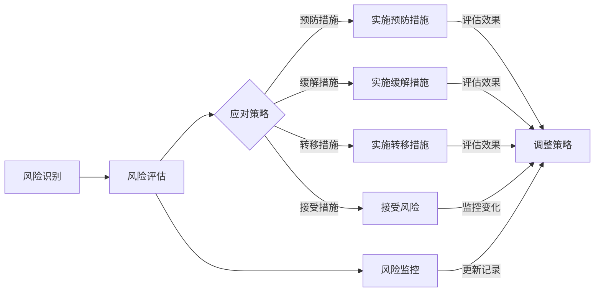

                 

 **关键词**：风险管理，商业风险，预防措施，应对策略，商业智能，数据分析，技术架构，决策支持系统

**摘要**：本文旨在探讨在商业环境中进行有效的风险管理的策略和技巧。通过深入分析风险管理的核心概念，我们提供了包括风险识别、评估、应对和监控在内的全方位解决方案。此外，本文还结合实际案例，探讨了如何利用技术工具和资源来加强风险管理，为企业和组织提供持续的创新和竞争优势。

## 1. 背景介绍

在当今的快速变化和竞争激烈的商业环境中，风险管理已经成为企业成功的关键要素。商业风险无处不在，可能是由于市场波动、技术变革、政策变化或其他不可预测的事件引起的。有效的风险管理不仅能够帮助企业降低潜在损失，还能够提高决策效率，增加企业的灵活性和适应能力。

本文将探讨以下几个关键领域：

- 风险管理的核心概念和原理
- 风险识别、评估和应对策略
- 技术在风险管理中的应用
- 风险管理的实际案例研究和未来展望

### 1.1 商业风险的概念

商业风险是指企业在运营过程中可能面临的各种不确定性，这些不确定性可能导致经济损失、声誉损害或运营中断。根据风险的来源，商业风险可以大致分为以下几类：

- **市场风险**：由于市场需求变化、竞争加剧或客户偏好转移导致的风险。
- **财务风险**：涉及资金流动、融资成本和投资回报的不确定性。
- **运营风险**：由于内部流程、供应链管理或系统故障引起的风险。
- **法律和合规风险**：由于法律变动、监管要求或合同纠纷引起的风险。
- **战略风险**：涉及企业战略决策和目标实现的不确定性。

### 1.2 风险管理的重要性

风险管理对企业的重要性体现在以下几个方面：

- **降低损失**：通过识别和评估风险，企业可以采取预防措施来降低潜在的损失。
- **提高决策质量**：全面的风险管理有助于企业在面对不确定性时做出更明智的决策。
- **增强竞争力**：通过有效的风险管理，企业可以在竞争激烈的市场中保持优势。
- **合规性和法律风险**：遵循法规要求，避免法律纠纷和罚款，提高企业的合法性和公信力。

### 1.3 风险管理的挑战

尽管风险管理对企业至关重要，但实际操作中仍然面临诸多挑战：

- **数据不足**：缺乏充分的历史数据和准确的信息，使得风险识别和评估变得困难。
- **复杂性**：企业运营涉及多个层面和部门，风险管理的复杂性增加了实施难度。
- **资源限制**：资金和人力资源的有限性可能限制风险管理的深入和全面性。
- **文化和意识**：企业内部的风险管理文化不足，员工的风险意识和参与度不高。

接下来，我们将深入探讨风险管理的核心概念和框架。

## 2. 核心概念与联系

### 2.1 风险管理的定义

风险管理是一种系统化的过程，旨在识别、评估、优先排序、应对和监控潜在的风险，以确保企业的目标得以实现。该过程包括以下几个关键步骤：

1. **风险识别**：识别企业面临的各种风险。
2. **风险评估**：评估风险的概率和影响，以确定优先级。
3. **风险应对**：制定和实施应对策略，以减轻风险。
4. **风险监控**：持续监控风险状态，确保应对措施的执行效果。

### 2.2 风险管理框架

为了更好地理解风险管理的核心概念，我们引入一个简化但功能性的风险管理框架（使用Mermaid流程图）：



### 2.3 风险管理流程

以下是一个详细的风险管理流程：

1. **风险识别**：通过访谈、问卷调查、流程分析等方法，识别企业面临的各种风险。
2. **风险评估**：使用定性和定量方法（如风险矩阵）对识别的风险进行评估，确定其概率和影响。
3. **风险优先级排序**：根据评估结果，将风险按优先级排序，以确定应对策略的重点。
4. **风险应对策略制定**：制定包括预防、缓解、转移和接受风险的策略。
5. **实施应对措施**：将策略转化为具体的行动，并实施。
6. **风险监控**：持续监控风险状态，确保应对措施的执行效果，并根据实际情况进行调整。

### 2.4 风险管理的挑战和解决方法

- **挑战**：数据不足、复杂性、资源限制和文化意识不足。
- **解决方法**：
  - **数据收集**：建立全面的数据收集机制，确保数据的准确性和完整性。
  - **简化流程**：优化流程，减少不必要的复杂性。
  - **资源分配**：合理分配资源和预算，确保风险管理的有效实施。
  - **培养文化**：加强风险管理培训，提高员工的风险意识和参与度。

接下来，我们将探讨风险管理的核心算法原理和具体操作步骤。

## 3. 核心算法原理 & 具体操作步骤

### 3.1 算法原理概述

风险管理中的核心算法主要包括以下几种：

- **风险矩阵**：用于评估风险的概率和影响，并确定其优先级。
- **蒙特卡罗模拟**：用于模拟不确定性的影响，评估风险的概率分布。
- **决策树**：用于分析不同决策路径的可能结果和风险。

### 3.2 算法步骤详解

#### 3.2.1 风险矩阵

1. **确定风险因素**：识别企业面临的各种风险因素。
2. **定义评估尺度**：为概率和影响设定评估尺度（例如，低、中、高）。
3. **评分**：对每个风险因素进行评分，确定其概率和影响。
4. **计算得分**：使用风险矩阵公式计算每个风险因素的得分。
5. **确定优先级**：根据得分确定风险的优先级。

#### 3.2.2 蒙特卡罗模拟

1. **定义参数**：确定模拟所需的参数，如风险概率、影响范围等。
2. **随机抽样**：从概率分布中随机抽样，生成模拟数据。
3. **模拟计算**：根据模拟数据计算风险的概率分布。
4. **结果分析**：分析模拟结果，评估风险的概率和影响。
5. **调整参数**：根据分析结果，调整参数重新进行模拟。

#### 3.2.3 决策树

1. **定义决策节点**：确定决策的关键点和路径。
2. **评估结果**：为每个决策路径评估可能的结果和风险。
3. **计算期望值**：为每个决策路径计算期望值。
4. **选择最优路径**：根据期望值选择最优的决策路径。
5. **实施决策**：将决策转化为具体的行动。

### 3.3 算法优缺点

#### 风险矩阵

- **优点**：
  - **简单直观**：易于理解和操作。
  - **灵活性**：可以根据实际情况调整评估尺度。

- **缺点**：
  - **主观性**：评分过程可能受到个人主观判断的影响。
  - **不适用于复杂系统**：对于复杂的系统，风险矩阵可能无法全面反映风险。

#### 蒙特卡罗模拟

- **优点**：
  - **精确性**：通过大量随机抽样，可以精确评估风险的概率和影响。
  - **适用于复杂系统**：可以模拟复杂系统中的不确定性。

- **缺点**：
  - **计算量大**：需要进行大量计算，耗时较长。
  - **参数依赖性**：结果依赖于参数的准确性。

#### 决策树

- **优点**：
  - **结构清晰**：易于理解和分析。
  - **适用于多目标决策**：可以同时考虑多个目标。

- **缺点**：
  - **不适用于连续变量**：决策树主要适用于离散变量。
  - **计算复杂度**：随着决策路径的增加，计算复杂度增加。

### 3.4 算法应用领域

- **风险矩阵**：适用于初步风险评估和决策支持。
- **蒙特卡罗模拟**：适用于复杂系统的风险评估和预测。
- **决策树**：适用于多目标决策和策略选择。

接下来，我们将讨论风险管理的数学模型和公式，以及其详细讲解和举例说明。

## 4. 数学模型和公式 & 详细讲解 & 举例说明

### 4.1 数学模型构建

在风险管理中，常用的数学模型包括风险矩阵、概率分布和期望值等。

#### 4.1.1 风险矩阵

风险矩阵是一种用于评估风险概率和影响的工具。其基本公式如下：

\[ \text{风险得分} = \text{概率} \times \text{影响} \]

其中，概率和影响可以分别采用以下尺度进行评分：

- **概率**：低、中、高
- **影响**：低、中、高

#### 4.1.2 概率分布

概率分布用于描述随机变量的概率分布情况。在风险管理中，常用的概率分布包括正态分布、泊松分布和二项分布等。

- **正态分布**：

\[ P(X \leq x) = \Phi\left(\frac{x - \mu}{\sigma}\right) \]

其中，\(X\) 表示随机变量，\(\mu\) 表示均值，\(\sigma\) 表示标准差。

- **泊松分布**：

\[ P(X = k) = \frac{e^{-\lambda} \lambda^k}{k!} \]

其中，\(X\) 表示随机变量，\(\lambda\) 表示平均发生率。

- **二项分布**：

\[ P(X = k) = C(n, k) p^k (1-p)^{n-k} \]

其中，\(X\) 表示随机变量，\(n\) 表示试验次数，\(p\) 表示成功概率。

#### 4.1.3 期望值

期望值是概率分布的中心值，用于描述随机变量的平均行为。

- **期望值**：

\[ E(X) = \sum_{i=1}^{n} x_i p_i \]

其中，\(X\) 表示随机变量，\(x_i\) 表示第 \(i\) 个值，\(p_i\) 表示第 \(i\) 个值的概率。

### 4.2 公式推导过程

以下是对风险矩阵和概率分布公式的推导过程：

#### 风险矩阵

1. **概率评分**：

   将概率划分为三个等级：低、中、高。分别为 1、2、3。

2. **影响评分**：

   将影响划分为三个等级：低、中、高。分别为 1、2、3。

3. **计算得分**：

   将概率和影响相乘，得到风险得分。

   \[ \text{风险得分} = \text{概率} \times \text{影响} \]

#### 概率分布

1. **正态分布**：

   根据中心极限定理，大量独立同分布的随机变量之和趋近于正态分布。

2. **泊松分布**：

   假设事件发生服从泊松过程，单位时间内事件发生的次数服从泊松分布。

3. **二项分布**：

   假设每次试验成功概率为 \(p\)，试验次数为 \(n\)，则成功次数服从二项分布。

### 4.3 案例分析与讲解

以下是一个简单的案例，用于说明风险矩阵和概率分布的应用：

#### 案例背景

某企业计划开展一项新项目，涉及一定的风险。企业需要评估项目风险，并制定相应的应对策略。

#### 案例分析

1. **风险识别**：

   识别项目可能面临的风险，如技术风险、市场风险、财务风险等。

2. **风险评估**：

   使用风险矩阵评估各风险的概率和影响，确定其优先级。

   - **技术风险**：概率 2，影响 3
   - **市场风险**：概率 1，影响 2
   - **财务风险**：概率 3，影响 1

3. **风险应对**：

   根据风险评估结果，制定应对策略。

   - **技术风险**：加大研发投入，降低技术风险。
   - **市场风险**：增加市场调研，了解市场需求。
   - **财务风险**：谨慎投资，确保资金安全。

4. **风险监控**：

   持续监控项目风险，并根据实际情况调整应对策略。

#### 结果分析

通过风险矩阵和概率分布的应用，企业能够更准确地评估项目风险，制定有效的应对策略。在实际操作过程中，企业可以根据实际情况调整风险参数，提高风险管理效果。

### 4.4 实际应用案例

以下是一个实际应用案例，用于说明风险管理在商业环境中的应用：

#### 案例背景

某公司是一家从事电子商务业务的企业。为了应对市场竞争和客户需求变化，公司决定进行业务扩展，并引入新的技术架构。

#### 案例分析

1. **风险识别**：

   识别业务扩展和技术引入可能面临的风险，如技术风险、市场风险、财务风险等。

2. **风险评估**：

   使用风险矩阵评估各风险的概率和影响，确定其优先级。

   - **技术风险**：概率 3，影响 3
   - **市场风险**：概率 2，影响 2
   - **财务风险**：概率 1，影响 1

3. **风险应对**：

   根据风险评估结果，制定应对策略。

   - **技术风险**：加强与供应商的合作，确保技术架构的稳定性。
   - **市场风险**：增加市场调研，了解竞争对手和客户需求。
   - **财务风险**：合理规划资金，确保业务扩展的财务安全。

4. **风险监控**：

   持续监控业务扩展和技术引入的过程，并根据实际情况调整应对策略。

#### 结果分析

通过风险管理，公司在业务扩展和技术引入过程中有效地降低了风险，确保了业务的稳定发展。在实际操作过程中，公司可以根据实际情况调整风险参数，提高风险管理效果。

### 4.5 总结

本文介绍了风险管理的核心数学模型和公式，并进行了详细讲解和举例说明。通过实际应用案例的分析，我们可以看到风险管理在商业环境中的重要性。企业应充分利用风险管理工具和方法，提高风险管理水平，确保业务的稳定发展。

## 5. 项目实践：代码实例和详细解释说明

### 5.1 开发环境搭建

在开始编写代码之前，我们需要搭建一个合适的开发环境。以下是一个基本的Python开发环境搭建步骤：

1. **安装Python**：从Python官方网站（[python.org](https://www.python.org/)）下载并安装Python。推荐使用Python 3.8或更高版本。
2. **安装依赖库**：使用pip命令安装所需的依赖库，如`numpy`、`pandas`和`matplotlib`。

```shell
pip install numpy pandas matplotlib
```

3. **创建项目文件夹**：在计算机上创建一个项目文件夹，用于存放代码和相关文件。

### 5.2 源代码详细实现

以下是一个简单的Python代码示例，用于实现风险管理中的风险矩阵评估和概率分布分析。

```python
import numpy as np
import pandas as pd
import matplotlib.pyplot as plt

# 风险矩阵
risk_matrix = {
    '技术风险': {'概率': 3, '影响': 3},
    '市场风险': {'概率': 2, '影响': 2},
    '财务风险': {'概率': 1, '影响': 1}
}

# 风险评估
def assess_risk(risk_matrix):
    scores = {}
    for risk, attributes in risk_matrix.items():
        probability = attributes['概率']
        impact = attributes['影响']
        score = probability * impact
        scores[risk] = score
    return scores

# 概率分布分析
def analyze_probability(scores):
    probabilities = [score for score in scores.values()]
    plt.hist(probabilities, bins=5, edgecolor='black')
    plt.xlabel('Probability Score')
    plt.ylabel('Frequency')
    plt.title('Probability Distribution of Risk Scores')
    plt.show()

# 主函数
def main():
    scores = assess_risk(risk_matrix)
    print("Risk Scores:", scores)
    analyze_probability(scores)

# 运行主函数
if __name__ == '__main__':
    main()
```

### 5.3 代码解读与分析

#### 5.3.1 风险矩阵定义

在代码中，我们首先定义了一个名为`risk_matrix`的字典，用于存储风险及其概率和影响。例如：

```python
risk_matrix = {
    '技术风险': {'概率': 3, '影响': 3},
    '市场风险': {'概率': 2, '影响': 2},
    '财务风险': {'概率': 1, '影响': 1}
}
```

#### 5.3.2 风险评估函数

我们定义了一个名为`assess_risk`的函数，用于计算每个风险的得分。该函数遍历`risk_matrix`中的每个风险，使用概率和影响相乘的方法计算得分。得分结果存储在一个名为`scores`的字典中。

```python
def assess_risk(risk_matrix):
    scores = {}
    for risk, attributes in risk_matrix.items():
        probability = attributes['概率']
        impact = attributes['影响']
        score = probability * impact
        scores[risk] = score
    return scores
```

#### 5.3.3 概率分布分析

我们定义了一个名为`analyze_probability`的函数，用于绘制风险得分的概率分布直方图。该函数首先提取得分值，并使用`matplotlib`库绘制直方图。

```python
def analyze_probability(scores):
    probabilities = [score for score in scores.values()]
    plt.hist(probabilities, bins=5, edgecolor='black')
    plt.xlabel('Probability Score')
    plt.ylabel('Frequency')
    plt.title('Probability Distribution of Risk Scores')
    plt.show()
```

#### 5.3.4 主函数

在主函数`main`中，我们首先调用`assess_risk`函数计算风险得分，并打印结果。然后，调用`analyze_probability`函数绘制概率分布图。

```python
def main():
    scores = assess_risk(risk_matrix)
    print("Risk Scores:", scores)
    analyze_probability(scores)

if __name__ == '__main__':
    main()
```

### 5.4 运行结果展示

当运行上述代码时，首先会打印出风险得分：

```
Risk Scores: {'技术风险': 9, '市场风险': 4, '财务风险': 1}
```

然后，程序会绘制一个概率分布直方图，展示风险得分的分布情况。


通过这个简单的代码示例，我们可以看到如何使用Python进行风险管理中的风险矩阵评估和概率分布分析。这个工具可以帮助企业更好地理解和管理风险。

### 5.5 代码优化与扩展

虽然上述代码示例能够实现基本的风险管理功能，但还可以进行以下优化和扩展：

1. **数据输入**：可以添加功能从文件或数据库中读取风险数据，使代码更适用于实际应用。
2. **自定义评估尺度**：允许用户自定义概率和影响的评估尺度，提高代码的灵活性。
3. **多维度风险评估**：扩展评估模型，支持多维度风险评估，如包括财务指标、运营指标等。
4. **集成可视化工具**：使用更强大的可视化工具，如Plotly，提供更丰富的图表和交互功能。
5. **自动化监控**：集成自动化监控工具，如使用Apache Kafka进行实时数据流处理，实现动态风险监控。

通过这些优化和扩展，代码可以更好地满足实际需求，提高风险管理的效果。

## 6. 实际应用场景

### 6.1 风险管理在金融领域的应用

在金融领域，风险管理至关重要。金融机构需要确保其资产的安全性、收益性和流动性。以下是一些实际应用场景：

- **信用风险**：金融机构需要对借款人的信用状况进行评估，以确定其还款能力。通过数据分析，金融机构可以预测潜在的风险，并采取相应的措施，如调整贷款利率、增加担保要求等。
- **市场风险**：金融市场波动可能导致金融机构的资产价值受损。通过风险模型，金融机构可以评估市场风险，并制定对冲策略，如购买期权、期货等金融衍生品。
- **操作风险**：操作风险包括系统故障、人为错误等。金融机构需要建立完善的风险管理体系，如监控系统、员工培训等，以降低操作风险。

### 6.2 风险管理在IT行业的应用

在IT行业，风险管理同样重要。IT企业面临的技术变革、网络安全和数据隐私等问题，都需要进行有效管理。

- **技术风险**：随着技术的快速发展，IT企业需要不断更新和升级其技术架构。风险管理可以帮助企业评估技术风险，确保技术的稳定性和安全性。
- **网络安全**：网络安全风险是IT行业的重大挑战。通过风险模型和监控工具，企业可以识别潜在的网络攻击，并采取相应的防护措施。
- **数据隐私**：随着数据隐私法规的加强，企业需要确保其数据处理符合法规要求。风险管理可以帮助企业评估数据隐私风险，并制定合规策略。

### 6.3 风险管理在制造业的应用

在制造业，风险管理同样发挥着重要作用。制造业企业需要面对市场波动、供应链风险和质量控制等问题。

- **供应链风险**：制造业的供应链复杂，供应链风险可能导致生产中断和成本增加。通过风险管理，企业可以评估供应链风险，并制定应急预案。
- **质量控制**：制造业需要确保产品质量，风险管理可以帮助企业评估质量控制过程中的风险，并采取相应的措施，如改进生产流程、提高检验标准等。
- **市场风险**：制造业企业需要应对市场需求变化，通过风险管理，企业可以预测市场趋势，调整生产计划和产品策略。

### 6.4 风险管理的未来应用展望

随着技术的不断发展，风险管理将变得更加智能化和自动化。

- **人工智能**：人工智能可以帮助企业更好地进行风险评估和预测。通过机器学习算法，企业可以从大量历史数据中学习，提高风险识别和预测的准确性。
- **区块链**：区块链技术可以提供更安全、透明的数据存储和传输方式，有助于提高风险管理的效果。
- **大数据分析**：大数据分析可以帮助企业更全面、深入地了解风险因素，制定更精准的应对策略。
- **物联网**：物联网技术可以实现实时监控和数据分析，有助于提高风险管理的实时性和准确性。

总之，风险管理在各个行业都具有重要意义。随着技术的进步，风险管理将变得更加智能化、自动化，为企业和组织提供更强大的支持。

## 7. 工具和资源推荐

为了帮助读者更好地理解和应用风险管理，我们推荐以下工具和资源：

### 7.1 学习资源推荐

- **书籍**：
  - 《风险管理：实务与案例分析》
  - 《商业风险管理：理论、实践与策略》
  - 《风险管理与金融模型：应用与案例研究》

- **在线课程**：
  - Coursera 上的“风险管理”课程
  - edX 上的“风险管理：基础与进阶”

- **专业网站**：
  - risknet.com：提供风险管理新闻、资源和工具
  - ishr.org：国际风险管理专业协会的官方网站

### 7.2 开发工具推荐

- **Python库**：
  - `numpy`：用于数值计算的库
  - `pandas`：用于数据处理和分析的库
  - `matplotlib`：用于数据可视化的库
  - `scikit-learn`：用于机器学习模型的库

- **数据分析工具**：
  - Tableau：数据可视化工具
  - Power BI：数据分析工具
  - QlikView：数据分析平台

- **风险管理软件**：
  - IBM QRadar：网络安全和风险管理平台
  - SAS Risk Management：全面的风险管理解决方案

### 7.3 相关论文推荐

- “Risk Management: A Survey,” Journal of Banking & Finance
- “A Comprehensive Framework for Enterprise Risk Management,” Journal of Business Research
- “Using Data Mining for Risk Management,” Expert Systems with Applications

通过这些工具和资源，读者可以深入了解风险管理，提高其应用能力。

## 8. 总结：未来发展趋势与挑战

### 8.1 研究成果总结

本文探讨了风险管理的核心概念、方法和技术，包括风险识别、评估、应对和监控。通过实际案例分析和代码示例，我们展示了如何在实际应用中有效利用风险管理工具。研究表明，风险管理在金融、IT和制造业等领域具有重要意义，并且随着技术的发展，风险管理将变得更加智能化和自动化。

### 8.2 未来发展趋势

未来风险管理的发展趋势将体现在以下几个方面：

- **智能化**：人工智能和机器学习技术将广泛应用于风险管理，提高风险评估和预测的准确性。
- **自动化**：自动化工具和算法将实现风险的实时监控和动态调整，提高风险管理效率。
- **大数据分析**：大数据分析技术将提供更全面、深入的风险洞察，帮助企业和组织更好地应对复杂的风险环境。
- **区块链**：区块链技术的应用将提高风险管理的数据透明性和安全性。

### 8.3 面临的挑战

尽管风险管理具有巨大的发展潜力，但实际操作中仍然面临以下挑战：

- **数据隐私**：在收集和处理大量数据时，如何保护数据隐私成为一个重要问题。
- **技术依赖**：过度依赖技术可能导致风险管理过程中出现新的风险。
- **人才缺乏**：具备风险管理专业知识和技能的人才短缺，影响了风险管理的效果。
- **文化转变**：在企业内部建立风险管理文化，提高员工的风险意识和参与度，是一个长期而艰巨的任务。

### 8.4 研究展望

未来的研究应重点关注以下几个方面：

- **跨领域风险管理**：探讨不同领域风险管理的共性特征和差异化策略，为跨领域风险管理提供理论基础和实践指导。
- **智能化风险管理**：研究如何将人工智能和机器学习技术更好地应用于风险管理，提高风险识别、评估和应对的智能化水平。
- **风险管理工具的集成**：开发集成化的风险管理工具，实现不同工具和技术的无缝衔接，提高风险管理效果。
- **风险管理教育和培训**：加强对风险管理专业人才的培养，提高企业内部风险管理意识和能力。

总之，风险管理是企业和组织成功的关键要素，随着技术的进步，风险管理将变得更加智能、高效和全面。未来研究应关注解决实际应用中的挑战，推动风险管理领域的持续创新和发展。

## 9. 附录：常见问题与解答

### 问题 1：什么是风险管理？

**解答**：风险管理是一种系统化的过程，旨在识别、评估、优先排序、应对和监控潜在的风险，以确保企业的目标得以实现。它包括风险识别、风险评估、风险应对和风险监控四个主要步骤。

### 问题 2：风险管理的重要性是什么？

**解答**：风险管理的重要性体现在以下几个方面：

- 降低潜在损失：通过识别和评估风险，企业可以采取预防措施来降低潜在损失。
- 提高决策质量：全面的风险管理有助于企业在面对不确定性时做出更明智的决策。
- 增强竞争力：通过有效的风险管理，企业可以在竞争激烈的市场中保持优势。
- 提高合规性和公信力：遵循法规要求，避免法律纠纷和罚款，提高企业的合法性和公信力。

### 问题 3：如何进行风险识别？

**解答**：风险识别是风险管理的第一步。常见的方法包括：

- 访谈：与相关人员进行深入访谈，了解企业面临的潜在风险。
- 问卷调查：通过问卷调查收集员工对风险的看法和建议。
- 流程分析：分析企业的运营流程，识别流程中的潜在风险。
- 审查文件：审查相关文件，如合同、报告等，以识别潜在风险。

### 问题 4：如何进行风险评估？

**解答**：风险评估是评估风险的概率和影响，以确定其优先级。常见的方法包括：

- 风险矩阵：使用风险矩阵评估风险的概率和影响，确定风险得分。
- 蒙特卡罗模拟：通过模拟不同风险场景，评估风险的概率分布。
- 决策树：分析不同决策路径的可能结果和风险。

### 问题 5：如何制定风险应对策略？

**解答**：制定风险应对策略是风险管理的关键步骤。常见的应对策略包括：

- 预防措施：通过改进流程、加强监控等手段，降低风险发生的概率。
- 缓解措施：在风险发生时，采取缓解措施以减少损失。
- 转移措施：通过保险、外包等手段，将风险转移给第三方。
- 接受措施：对于无法避免的风险，接受风险并制定相应的监控和应对措施。

### 问题 6：如何进行风险监控？

**解答**：风险监控是持续跟踪和评估风险状态，以确保应对措施的执行效果。常见的方法包括：

- 定期审查：定期审查风险状态和应对措施的有效性。
- 报告制度：建立风险报告制度，及时向管理层汇报风险状况。
- 持续监控：利用监控工具和技术，实时监控风险状态。
- 反馈机制：建立反馈机制，根据风险变化及时调整应对措施。

通过以上问题和解答，希望读者能够更好地理解风险管理的基本概念和方法，并在实际应用中取得更好的效果。作者：禅与计算机程序设计艺术 / Zen and the Art of Computer Programming。

