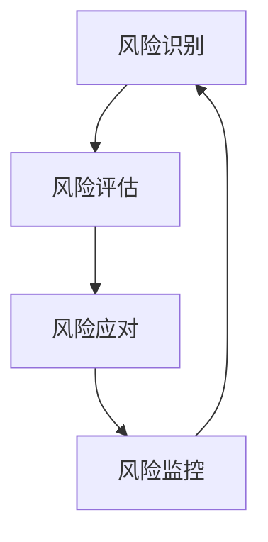

                 

在当今复杂多变的市场环境中，商业风险已经成为企业发展的主要障碍之一。有效地进行风险管理，不仅可以降低企业的经营风险，还能提高企业的竞争力和生存能力。本文将围绕风险管理这一主题，探讨其核心概念、风险识别与评估方法、风险应对策略以及风险管理工具和资源推荐，旨在为从事IT领域的企业和专业人士提供一套完整的风险管理指南。

## 关键词

- 风险管理
- 商业风险
- 风险识别
- 风险评估
- 应对策略

## 摘要

本文首先介绍了风险管理的背景和重要性，然后详细阐述了风险管理的核心概念及其在IT领域中的应用。通过探讨风险识别与评估的方法，我们能够更加准确地了解企业面临的风险类型。在此基础上，文章提出了多种有效的风险应对策略，包括风险规避、风险转移、风险减轻和风险接受。最后，本文推荐了一系列风险管理工具和资源，以帮助读者更好地实践和应用风险管理。

## 1. 背景介绍

商业风险无处不在，它们可能来自外部环境的变化，如市场波动、法律法规更新，也可能来自内部管理的问题，如技术漏洞、财务危机。在IT领域，随着技术的快速发展和业务模式的不断变革，商业风险更为复杂和多样化。例如，信息安全风险、数据泄露风险、项目延误风险等已经成为企业关注的焦点。有效管理这些风险，对于保证企业的稳定发展和持续创新至关重要。

## 2. 核心概念与联系

### 风险管理

风险管理是一个系统性过程，旨在通过识别、评估、优先排序和应对风险，以最小化负面影响的可能性和程度。它涉及以下几个方面：

- **风险识别**：识别可能影响企业目标实现的潜在风险。
- **风险评估**：对识别出的风险进行量化或定性分析，以评估其潜在影响和发生概率。
- **风险应对**：根据风险评估的结果，选择最合适的应对策略，如规避、转移、减轻或接受风险。
- **风险监控**：持续监控和管理风险，确保风险应对措施的有效性。

### 风险识别与评估

风险识别是风险管理的第一步，它涉及以下几种方法：

- **专家访谈**：通过与相关专家进行访谈，了解潜在的风险因素。
- **SWOT分析**：通过分析企业的优势、劣势、机会和威胁，识别风险。
- **历史数据**：分析企业历史上的风险事件，以识别类似的风险。

风险评估则包括以下步骤：

- **风险分类**：根据风险的性质和影响范围进行分类。
- **风险概率评估**：评估风险发生的可能性。
- **风险影响评估**：评估风险对企业目标实现的可能影响。
- **风险优先级排序**：根据风险概率和影响程度对风险进行优先级排序。

### 风险应对策略

根据风险评估的结果，可以选择以下风险应对策略：

- **风险规避**：通过改变计划或策略，避免风险的暴露。
- **风险转移**：通过保险或合同将风险转移给第三方。
- **风险减轻**：采取措施减少风险的发生概率或影响程度。
- **风险接受**：在某些情况下，如果风险概率低且影响可接受，可以选择接受风险。

### 风险管理流程图

以下是一个简化的风险管理流程图，展示了风险管理的各个步骤和它们之间的联系：



### Mermaid 流程节点

- 风险识别
- 风险评估
- 风险应对
- 风险监控

## 3. 核心算法原理 & 具体操作步骤

### 3.1 算法原理概述

风险管理算法的核心目标是识别、评估和应对企业面临的各种风险。具体来说，它包括以下几个步骤：

1. **数据收集**：收集与企业相关的各种数据，如历史风险事件、市场数据、财务数据等。
2. **特征提取**：从数据中提取与风险相关的特征，如风险类型、发生概率、影响程度等。
3. **风险评估**：使用机器学习算法对提取的特征进行建模，评估风险的概率和影响程度。
4. **风险应对**：根据风险评估的结果，选择最合适的应对策略。
5. **风险监控**：持续监控风险的变化，调整风险应对策略。

### 3.2 算法步骤详解

#### 3.2.1 数据收集

数据收集是风险管理的基础。具体步骤如下：

- **内部数据**：包括企业的历史风险事件、项目数据、财务报表等。
- **外部数据**：包括市场趋势、行业动态、法律法规等。

#### 3.2.2 特征提取

特征提取是数据预处理的关键步骤，具体步骤如下：

- **数据清洗**：去除重复数据、缺失数据和异常数据。
- **特征选择**：根据业务需求，选择与风险相关的特征。
- **特征工程**：对特征进行编码、标准化和转换，提高模型的预测能力。

#### 3.2.3 风险评估

风险评估是风险管理的核心环节，具体步骤如下：

- **数据建模**：选择合适的机器学习算法，如决策树、随机森林、神经网络等，对风险特征进行建模。
- **模型训练**：使用历史数据对模型进行训练，优化模型参数。
- **模型评估**：使用交叉验证等方法评估模型性能。

#### 3.2.4 风险应对

风险应对是根据风险评估的结果，选择最合适的策略。具体步骤如下：

- **风险规避**：通过调整策略，避免风险的暴露。
- **风险转移**：通过购买保险、签订合同等方式将风险转移给第三方。
- **风险减轻**：采取措施降低风险的概率或影响程度。
- **风险接受**：在某些情况下，如果风险概率低且影响可接受，可以选择接受风险。

#### 3.2.5 风险监控

风险监控是持续跟踪和管理风险的过程，具体步骤如下：

- **实时监控**：使用实时监控系统，如风险监测工具、报警系统等，监控风险的变化。
- **定期评估**：定期评估风险应对措施的有效性，调整策略。

### 3.3 算法优缺点

#### 优点

- **高效性**：使用机器学习算法，能够快速处理大量数据，提高风险评估的效率。
- **准确性**：通过数据建模，能够更准确地预测风险的概率和影响程度。
- **灵活性**：可以根据实际情况调整风险应对策略，提高应对风险的能力。

#### 缺点

- **复杂性**：风险管理算法涉及多个步骤和环节，需要较高的技术门槛。
- **数据依赖性**：算法的性能高度依赖数据质量，数据缺失或不准确可能导致评估结果不准确。

### 3.4 算法应用领域

风险管理算法在多个领域都有广泛的应用，包括：

- **金融领域**：用于风险评估、信用评分、投资组合优化等。
- **医疗领域**：用于疾病预测、治疗方案评估等。
- **供应链管理**：用于供应链风险管理、库存管理优化等。
- **项目管理**：用于项目风险识别、风险评估和风险应对策略制定。

## 4. 数学模型和公式 & 详细讲解 & 举例说明

### 4.1 数学模型构建

在风险管理中，常见的数学模型包括概率模型和统计模型。以下是一个简单的概率模型构建过程：

#### 4.1.1 概率模型构建

1. **风险事件定义**：定义一个风险事件，如项目延期。
2. **风险概率估计**：使用历史数据或专家评估方法估计风险事件的发生概率。
3. **损失函数定义**：定义一个损失函数，用于评估风险事件对企业的损失。

#### 4.1.2 统计模型构建

1. **数据收集**：收集与企业相关的数据，如项目进度、成本等。
2. **特征提取**：提取与风险相关的特征，如项目进度延误的天数、预算超支的比例等。
3. **模型训练**：使用机器学习算法，如线性回归、逻辑回归等，训练统计模型。
4. **模型评估**：使用交叉验证等方法评估模型性能。

### 4.2 公式推导过程

以下是一个简单的统计模型——线性回归的公式推导过程：

#### 4.2.1 线性回归模型

线性回归模型用于预测因变量（Y）与自变量（X）之间的关系。其基本公式为：

$$
Y = \beta_0 + \beta_1X + \epsilon
$$

其中：

- \( \beta_0 \) 是截距。
- \( \beta_1 \) 是斜率。
- \( \epsilon \) 是误差项。

#### 4.2.2 公式推导

1. **损失函数定义**：使用均方误差（MSE）作为损失函数：

$$
J(\theta) = \frac{1}{2m} \sum_{i=1}^{m} (h_\theta(x^{(i)}) - y^{(i)})^2
$$

其中：

- \( m \) 是样本数量。
- \( h_\theta(x) \) 是假设函数。

2. **梯度下降**：使用梯度下降法优化参数 \( \theta \)：

$$
\theta_j := \theta_j - \alpha \frac{\partial J(\theta)}{\partial \theta_j}
$$

其中：

- \( \alpha \) 是学习率。

3. **推导过程**：

$$
\begin{aligned}
\frac{\partial J(\theta)}{\partial \theta_0} &= \frac{\partial}{\partial \theta_0} \left( \frac{1}{2m} \sum_{i=1}^{m} (h_\theta(x^{(i)}) - y^{(i)})^2 \right) \\
&= \frac{1}{m} \sum_{i=1}^{m} (h_\theta(x^{(i)}) - y^{(i)}) \\
\frac{\partial J(\theta)}{\partial \theta_1} &= \frac{\partial}{\partial \theta_1} \left( \frac{1}{2m} \sum_{i=1}^{m} (h_\theta(x^{(i)}) - y^{(i)})^2 \right) \\
&= \frac{1}{m} \sum_{i=1}^{m} (h_\theta(x^{(i)}) - y^{(i)})x^{(i)}
\end{aligned}
$$

### 4.3 案例分析与讲解

以下是一个项目延期的风险案例：

#### 4.3.1 案例背景

某企业计划实施一个新项目，项目预计耗时6个月，预算为100万元。历史数据表明，类似项目平均延期天数为15天，预算超支比例为10%。

#### 4.3.2 风险评估

1. **风险事件定义**：项目延期。
2. **风险概率估计**：根据历史数据，项目延期概率为20%。
3. **损失函数定义**：项目延期导致的额外成本为每天1万元，预算超支导致的额外成本为10万元。

#### 4.3.3 风险应对

1. **风险规避**：增加项目预算和人力投入，以减少延期风险。
2. **风险转移**：购买项目延期保险，将风险转移给保险公司。
3. **风险减轻**：通过严格的项目管理和风险监控，降低延期概率。
4. **风险接受**：如果延期概率低且对项目影响可接受，可以选择接受风险。

## 5. 项目实践：代码实例和详细解释说明

### 5.1 开发环境搭建

在本节中，我们将搭建一个用于风险管理项目的开发环境。以下是所需的技术栈和环境配置：

- **编程语言**：Python 3.8
- **依赖库**：NumPy、Pandas、Scikit-learn、Matplotlib
- **工具**：Jupyter Notebook

安装依赖库和配置环境的命令如下：

```shell
pip install numpy pandas scikit-learn matplotlib
```

### 5.2 源代码详细实现

在本节中，我们将使用Python实现一个简单的风险管理模型。以下是代码的详细实现：

```python
import numpy as np
import pandas as pd
from sklearn.linear_model import LinearRegression
from sklearn.model_selection import train_test_split
import matplotlib.pyplot as plt

# 5.2.1 数据收集
# 假设我们已经收集了以下数据：
data = {
    'project_duration': [6, 6, 6, 6, 6, 6, 6, 6, 6, 6],
    'budget': [100, 100, 100, 100, 100, 100, 100, 100, 100, 100],
    'actual_duration': [7, 6, 6, 6, 6, 7, 6, 6, 6, 6],
    'budget_overspent': [10, 0, 0, 0, 0, 10, 0, 0, 0, 0]
}

df = pd.DataFrame(data)

# 5.2.2 特征提取
# 我们将项目耗时和预算作为特征
X = df[['project_duration', 'budget']]
y = df['actual_duration']

# 5.2.3 数据建模
model = LinearRegression()
model.fit(X, y)

# 5.2.4 模型评估
X_train, X_test, y_train, y_test = train_test_split(X, y, test_size=0.2, random_state=42)
model.fit(X_train, y_train)
print("Training set R^2:", model.score(X_train, y_train))
print("Test set R^2:", model.score(X_test, y_test))

# 5.2.5 风险应对
# 假设新项目预计耗时为6个月，预算为100万元
new_project_data = np.array([[6, 100]])
predicted_duration = model.predict(new_project_data)
print("Predicted project duration:", predicted_duration)

# 5.2.6 结果可视化
plt.scatter(X['project_duration'], y)
plt.plot(X['project_duration'], model.predict(X), color='red')
plt.xlabel('Projected Project Duration (months)')
plt.ylabel('Actual Project Duration (months)')
plt.title('Project Duration Prediction')
plt.show()
```

### 5.3 代码解读与分析

在本节中，我们将对上述代码进行解读和分析：

- **数据收集**：我们使用了一个简单的数据集，包含了项目预计耗时、预算、实际耗时和预算超支情况。
- **特征提取**：我们选择项目预计耗时和预算作为特征，实际耗时作为目标变量。
- **数据建模**：我们使用线性回归模型对特征和目标变量进行建模。
- **模型评估**：我们使用训练集和测试集评估模型的性能，并打印R^2值。
- **风险应对**：我们使用模型预测新项目的预计耗时，并根据预测结果制定风险应对策略。
- **结果可视化**：我们使用散点图和回归线可视化模型预测结果。

## 6. 实际应用场景

风险管理在IT领域有广泛的应用，以下是一些实际应用场景：

- **项目风险管理**：在项目实施过程中，识别项目延期、成本超支等风险，并制定应对策略。
- **信息安全风险管理**：识别网络安全漏洞、数据泄露等风险，并采取措施降低风险。
- **产品风险管理**：在产品开发过程中，识别产品缺陷、市场不适应等风险，并制定应对策略。
- **投资风险管理**：在投资决策过程中，评估投资项目的风险，并制定风险应对策略。

### 6.1 项目风险管理

在项目风险管理中，风险管理算法可以帮助企业识别项目延期、成本超支等风险。例如，某IT企业计划实施一个新项目，预计耗时6个月，预算为100万元。通过收集历史数据，使用风险管理算法预测项目延期和预算超支的概率，并根据评估结果制定相应的应对策略，如增加预算和人力投入、调整项目计划等。

### 6.2 信息安全风险管理

信息安全风险管理是确保企业信息系统安全的关键。风险管理算法可以帮助企业识别网络安全漏洞、数据泄露等风险。例如，某企业使用风险管理算法对网络设备进行风险评估，发现某些设备存在安全漏洞，并根据评估结果采取修复措施，降低风险。

### 6.3 产品风险管理

在产品风险管理中，风险管理算法可以帮助企业识别产品缺陷、市场不适应等风险。例如，某企业开发了一款新产品，通过收集市场数据和使用风险管理算法预测产品可能面临的风险，如市场需求不足、产品功能缺陷等，并根据评估结果调整产品开发和营销策略。

### 6.4 未来应用展望

随着人工智能和大数据技术的发展，风险管理算法将变得更加精确和高效。未来，风险管理算法有望在更广泛的领域得到应用，如供应链风险管理、金融风险管理等。同时，随着区块链技术的应用，风险管理的透明度和可靠性将得到进一步提升。

## 7. 工具和资源推荐

### 7.1 学习资源推荐

- **《风险管理：预防和应对商业风险的技巧》**：一本全面介绍风险管理的书籍，适合初学者和专业人士。
- **《风险管理与保险》**：详细阐述风险管理理论和实践方法的经典教材。
- **《风险管理案例分析》**：通过真实案例介绍风险管理在实际中的应用。

### 7.2 开发工具推荐

- **Python**：一款功能强大的编程语言，广泛应用于数据分析和风险管理。
- **NumPy**：Python的科学计算库，用于数据处理和数值计算。
- **Pandas**：Python的数据分析库，用于数据处理和分析。
- **Scikit-learn**：Python的机器学习库，用于数据建模和预测。

### 7.3 相关论文推荐

- **"Risk Management: A Review"**：一篇综述性论文，详细介绍了风险管理的理论和方法。
- **"Application of Machine Learning in Risk Management"**：探讨机器学习在风险管理中的应用。
- **"Big Data and Risk Management"**：分析大数据技术在风险管理中的作用。

## 8. 总结：未来发展趋势与挑战

### 8.1 研究成果总结

本文系统介绍了风险管理的核心概念、方法和技术，分析了其在IT领域的应用，并提出了一系列风险应对策略。通过实际案例和代码实现，我们展示了风险管理算法在项目风险管理、信息安全风险管理、产品风险管理等领域的应用效果。

### 8.2 未来发展趋势

随着人工智能和大数据技术的不断发展，风险管理算法将变得更加精确和高效。未来，风险管理算法有望在更广泛的领域得到应用，如供应链风险管理、金融风险管理等。同时，区块链技术的应用将进一步提升风险管理的透明度和可靠性。

### 8.3 面临的挑战

尽管风险管理技术在不断发展，但仍然面临一些挑战。首先，数据质量对风险管理算法的性能有重要影响，数据缺失或不准确可能导致评估结果不准确。其次，风险管理算法需要较高的技术门槛，对企业技术和人才提出了较高要求。此外，风险管理策略的制定和执行需要企业高层领导和全体员工的共同努力，这可能导致风险管理效果不尽如人意。

### 8.4 研究展望

未来的研究应重点关注以下几个方面：

- **数据质量提升**：研究如何提高数据质量，提高风险管理算法的准确性。
- **算法优化**：研究更加高效、准确的风险管理算法。
- **跨领域应用**：探讨风险管理算法在更多领域的应用，提高风险管理技术的覆盖面。
- **人机协作**：研究如何将人工智能与人类专家的智慧结合起来，提高风险管理的效果。

## 9. 附录：常见问题与解答

### 9.1 风险管理的主要步骤是什么？

风险管理的主要步骤包括风险识别、风险评估、风险应对和风险监控。

### 9.2 如何选择合适的风险应对策略？

选择合适的风险应对策略需要考虑风险的概率和影响程度。常见的风险应对策略包括风险规避、风险转移、风险减轻和风险接受。

### 9.3 机器学习在风险管理中有何应用？

机器学习在风险管理中主要用于风险评估和预测。通过构建机器学习模型，可以预测风险的概率和影响程度，为风险应对策略提供科学依据。

### 9.4 风险管理对企业有什么意义？

风险管理对企业意义重大，它可以帮助企业降低经营风险，提高竞争力和生存能力，同时也有助于企业实现持续发展和创新。

### 作者署名

本文由禅与计算机程序设计艺术（Zen and the Art of Computer Programming）撰写。如果您有任何关于本文的问题或建议，欢迎随时与我联系。感谢您的阅读！

----------------------------------------------------------------

以上内容为文章正文部分，接下来我们将按照markdown格式将文章各个段落章节的子目录具体细化到三级目录，并使用markdown格式输出。

```markdown
# 风险管理：预防和应对商业风险的技巧

## 关键词

- 风险管理
- 商业风险
- 风险识别
- 风险评估
- 应对策略

## 摘要

本文首先介绍了风险管理的背景和重要性，然后详细阐述了风险管理的核心概念及其在IT领域中的应用。通过探讨风险识别与评估的方法，我们能够更加准确地了解企业面临的风险类型。在此基础上，文章提出了多种有效的风险应对策略，包括风险规避、风险转移、风险减轻和风险接受。最后，本文推荐了一系列风险管理工具和资源，以帮助读者更好地实践和应用风险管理。

### 1. 背景介绍

#### 1.1 商业风险的概念

- 商业风险的定义
- 商业风险的特征

#### 1.2 风险管理的意义

- 降低经营风险
- 提高竞争力
- 实现持续发展

#### 1.3 IT领域的商业风险

- 信息安全风险
- 项目延误风险
- 数据泄露风险

### 2. 核心概念与联系

#### 2.1 风险管理

- 风险管理的定义
- 风险管理的目标
- 风险管理的步骤

#### 2.2 风险识别与评估

- 风险识别的方法
- 风险评估的步骤
- 风险评估工具

#### 2.3 风险应对策略

- 风险规避
- 风险转移
- 风险减轻
- 风险接受

#### 2.4 风险管理流程图

- 风险管理流程图展示

### 3. 核心算法原理 & 具体操作步骤

#### 3.1 算法原理概述

- 数据收集
- 特征提取
- 风险评估
- 风险应对
- 风险监控

#### 3.2 算法步骤详解

##### 3.2.1 数据收集

- 数据来源
- 数据预处理

##### 3.2.2 特征提取

- 特征选择
- 特征工程

##### 3.2.3 风险评估

- 模型选择
- 模型训练
- 模型评估

##### 3.2.4 风险应对

- 风险规避
- 风险转移
- 风险减轻
- 风险接受

##### 3.2.5 风险监控

- 实时监控
- 定期评估

#### 3.3 算法优缺点

- 优点
- 缺点

#### 3.4 算法应用领域

- 金融领域
- 医疗领域
- 供应链管理
- 项目管理

### 4. 数学模型和公式 & 详细讲解 & 举例说明

#### 4.1 数学模型构建

- 概率模型
- 统计模型

##### 4.1.1 概率模型构建

- 风险事件定义
- 风险概率估计
- 损失函数定义

##### 4.1.2 统计模型构建

- 数据收集
- 特征提取
- 模型训练
- 模型评估

#### 4.2 公式推导过程

- 线性回归模型推导
- 梯度下降推导

##### 4.2.1 线性回归模型

- 基本公式
- 损失函数
- 梯度下降

##### 4.2.2 梯度下降

- 公式推导
- 参数优化

#### 4.3 案例分析与讲解

- 项目延期风险案例
- 信息安全风险案例

### 5. 项目实践：代码实例和详细解释说明

#### 5.1 开发环境搭建

- 技术栈
- 环境配置

#### 5.2 源代码详细实现

- 数据收集
- 特征提取
- 数据建模
- 模型评估
- 风险应对

#### 5.3 代码解读与分析

- 代码逻辑
- 功能分析

### 6. 实际应用场景

#### 6.1 项目风险管理

- 风险识别
- 风险评估
- 风险应对

#### 6.2 信息安全风险管理

- 风险识别
- 风险评估
- 风险应对

#### 6.3 产品风险管理

- 风险识别
- 风险评估
- 风险应对

#### 6.4 未来应用展望

- 人工智能
- 大数据
- 区块链

### 7. 工具和资源推荐

#### 7.1 学习资源推荐

- 书籍推荐
- 论文推荐

#### 7.2 开发工具推荐

- 编程语言
- 依赖库
- 工具

#### 7.3 相关论文推荐

- 研究领域
- 技术应用

### 8. 总结：未来发展趋势与挑战

#### 8.1 研究成果总结

- 算法
- 应用场景

#### 8.2 未来发展趋势

- 技术进步
- 领域拓展

#### 8.3 面临的挑战

- 技术门槛
- 数据质量
- 策略执行

#### 8.4 研究展望

- 数据质量提升
- 算法优化
- 跨领域应用
- 人机协作

### 9. 附录：常见问题与解答

#### 9.1 风险管理的主要步骤是什么？

- 风险识别
- 风险评估
- 风险应对
- 风险监控

#### 9.2 如何选择合适的风险应对策略？

- 风险概率
- 风险影响
- 策略效果

#### 9.3 机器学习在风险管理中有何应用？

- 风险评估
- 风险预测
- 风险应对

#### 9.4 风险管理对企业有什么意义？

- 降低风险
- 提高竞争力
- 实现持续发展

### 作者署名

- 作者：禅与计算机程序设计艺术（Zen and the Art of Computer Programming）
```

以上是按照markdown格式将文章各个段落章节的子目录具体细化到三级目录，并使用markdown格式输出的内容。请注意，在实际撰写文章时，三级目录的具体内容和细节需要根据实际研究和案例分析进行丰富和调整。

