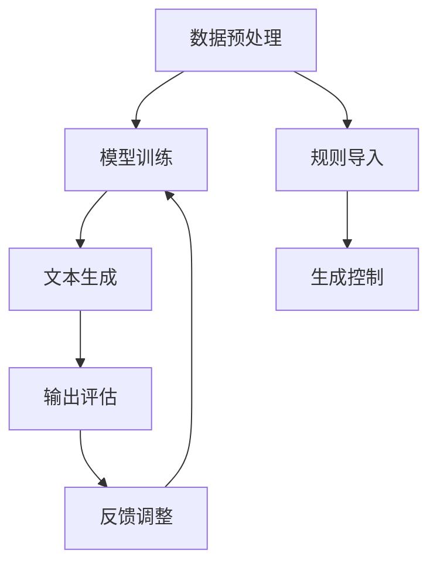

                 

关键词：大语言模型（LLM）、可控性、不确定性、模型优化、技术挑战

> 摘要：本文旨在探讨如何增强大语言模型（LLM）的可控性，以应对其在实际应用中的不确定性。我们将分析LLM的背景、核心概念，并深入探讨其算法原理、数学模型及项目实践。通过这些探讨，我们希望能够为未来AI技术的研发和应用提供一些有价值的思考。

## 1. 背景介绍

近年来，人工智能（AI）技术在各个方面都取得了显著的进展。尤其是大语言模型（LLM），如GPT-3、ChatGPT等，已经在自然语言处理（NLP）领域展现出了惊人的表现。这些模型能够理解、生成和响应复杂的自然语言，极大地推动了智能对话系统、内容生成、机器翻译等领域的发展。

然而，LLM在带来巨大便利的同时，也带来了许多新的挑战。首先，LLM的模型复杂度极高，导致其在训练过程中面临巨大的计算资源和时间成本。其次，LLM在生成文本时存在不确定性，可能产生不合理、不合适或者甚至有害的输出。这种不确定性使得LLM在实际应用中难以控制，影响了其可靠性和实用性。

为了解决这些问题，研究者们开始关注如何增强LLM的可控性。可控性是指模型在生成文本时，能够遵循人类制定的规则和指导，确保输出的合理性和一致性。增强LLM的可控性，不仅能够提高其应用价值，也能够降低其带来的风险。

## 2. 核心概念与联系

在讨论如何增强LLM的可控性之前，我们需要先了解LLM的核心概念和架构。以下是一个用Mermaid绘制的LLM的基本流程图：



### 2.1 数据预处理

数据预处理是LLM训练的基础步骤。在这个阶段，我们需要对原始文本数据进行清洗、分词、编码等操作，以便于模型能够理解和学习。

### 2.2 模型训练

模型训练是LLM的核心步骤。在这个阶段，模型通过学习大量的文本数据，建立对自然语言的深刻理解。训练过程中，模型会不断调整内部参数，以优化其文本生成能力。

### 2.3 文本生成

文本生成是LLM的主要功能。在这个阶段，模型根据给定的输入，生成相应的文本输出。然而，由于模型的结构和训练数据的影响，生成的文本可能存在不确定性。

### 2.4 输出评估

输出评估是对生成的文本进行质量评估。这个步骤可以帮助我们判断生成的文本是否合理、准确和有用。通过评估，我们可以发现并纠正模型在文本生成中的错误。

### 2.5 规则导入

规则导入是在文本生成过程中引入人类制定的规则和指导。这些规则可以用来限制模型生成文本的范围和内容，从而提高输出的可控性。

### 2.6 生成控制

生成控制是利用规则导入的规则，对文本生成过程进行实时控制。通过生成控制，我们可以确保模型在生成文本时，始终遵循人类的意图和指导。

### 2.7 反馈调整

反馈调整是根据输出评估的结果，对模型进行实时调整。通过反馈调整，我们可以不断优化模型，提高其文本生成能力。

## 3. 核心算法原理 & 具体操作步骤

### 3.1 算法原理概述

增强LLM的可控性主要依赖于两个方面：一是引入规则和指导，二是实时反馈和调整。具体来说，我们可以通过以下步骤实现：

1. **规则导入**：将人类制定的规则和指导嵌入到模型中，以便在文本生成时进行实时控制。
2. **生成控制**：根据规则导入的规则，对模型生成文本的过程进行实时监控和调整。
3. **输出评估**：对生成的文本进行质量评估，判断其是否符合人类的意图和期望。
4. **反馈调整**：根据评估结果，对模型进行实时调整，以优化其文本生成能力。

### 3.2 算法步骤详解

1. **规则导入**

   在规则导入阶段，我们需要将人类制定的规则和指导转换为模型能够理解和执行的形式。这通常涉及到以下步骤：

   - **规则提取**：从人类制定的规则中提取关键信息，如关键词、短语、条件等。
   - **规则编码**：将提取的关键信息转换为模型能够识别的编码形式，如向量、序列等。
   - **规则嵌入**：将编码后的规则嵌入到模型中，以便在生成文本时进行实时控制。

2. **生成控制**

   在生成控制阶段，我们需要根据规则导入的规则，对模型生成文本的过程进行实时监控和调整。具体来说，我们可以通过以下步骤实现：

   - **文本预生成**：在生成文本之前，先预测可能的输出文本。
   - **规则匹配**：将预测的文本与规则进行匹配，判断其是否符合规则。
   - **文本调整**：如果预测的文本不符合规则，则对其进行调整，使其符合规则。

3. **输出评估**

   在输出评估阶段，我们需要对生成的文本进行质量评估，判断其是否符合人类的意图和期望。具体来说，我们可以通过以下步骤实现：

   - **文本分析**：对生成的文本进行语法、语义、逻辑等方面的分析。
   - **质量评价**：根据分析结果，对文本的质量进行评价。
   - **反馈收集**：根据质量评价结果，收集用户的反馈信息。

4. **反馈调整**

   在反馈调整阶段，我们需要根据评估结果，对模型进行实时调整，以优化其文本生成能力。具体来说，我们可以通过以下步骤实现：

   - **参数调整**：根据反馈信息，调整模型的参数，以提高其生成文本的质量。
   - **模型优化**：通过反复调整和优化，不断提高模型的能力和表现。

### 3.3 算法优缺点

**优点**：

1. **提高可控性**：通过规则导入和生成控制，可以提高LLM在文本生成过程中的可控性，确保生成的文本符合人类的期望和需求。
2. **优化生成质量**：通过输出评估和反馈调整，可以不断优化LLM的文本生成能力，提高生成的文本质量。
3. **降低风险**：通过实时监控和调整，可以降低LLM在生成文本时可能带来的风险，如不合理、不合适或有害的输出。

**缺点**：

1. **计算资源消耗**：增强LLM的可控性需要引入额外的规则和监控机制，这可能会增加计算资源的消耗。
2. **规则复杂度**：人类制定的规则和指导可能非常复杂，需要模型能够理解和执行，这可能会增加模型的复杂度。

### 3.4 算法应用领域

增强LLM的可控性在许多领域都有广泛的应用。以下是几个典型的应用领域：

1. **智能客服**：通过增强LLM的可控性，可以构建更加智能、高效的客服系统，提供更加精准、个性化的服务。
2. **内容生成**：通过增强LLM的可控性，可以生成更加符合人类需求的内容，如新闻报道、文章撰写等。
3. **机器翻译**：通过增强LLM的可控性，可以提高机器翻译的准确性和一致性，提供更加优质的翻译服务。
4. **教育辅导**：通过增强LLM的可控性，可以构建更加智能、个性化的教育辅导系统，帮助学生更好地理解和掌握知识。

## 4. 数学模型和公式 & 详细讲解 & 举例说明

### 4.1 数学模型构建

为了增强LLM的可控性，我们需要构建一个数学模型，用于描述规则导入、生成控制、输出评估和反馈调整的过程。以下是一个简化的数学模型：

\[ \text{Model} = \text{Rule\_Import} + \text{Generation\_Control} + \text{Output\_Evaluation} + \text{Feedback\_Adjustment} \]

其中，每个部分都可以用数学公式进行描述。

### 4.2 公式推导过程

**规则导入**：

假设我们有一个规则集合 \( R \)，每个规则 \( r \) 可以表示为：

\[ r = (P, O) \]

其中，\( P \) 是规则的前提条件，\( O \) 是规则的结果。在模型训练过程中，我们需要将规则转换为模型能够理解和执行的形式。这可以通过以下公式实现：

\[ \text{Rule\_Embedding}(r) = f_r(P) \]

其中，\( f_r \) 是规则嵌入函数，用于将前提条件 \( P \) 转换为模型能够识别的编码形式。

**生成控制**：

在生成控制过程中，我们需要实时监控模型的输出，并根据规则进行实时调整。这可以通过以下公式实现：

\[ \text{Control}(x, r) = \text{Match}(x, f_r(P)) \]

其中，\( x \) 是模型的输出，\( f_r(P) \) 是规则嵌入的前提条件。\( \text{Match} \) 函数用于判断输出 \( x \) 是否符合规则 \( r \)。

**输出评估**：

在输出评估过程中，我们需要对模型的输出进行质量评估，判断其是否符合人类的期望。这可以通过以下公式实现：

\[ \text{Quality}(x) = \text{Evaluate}(x, \text{Human\_Intent}) \]

其中，\( \text{Human\_Intent} \) 是人类的期望，\( \text{Evaluate} \) 函数用于评估输出 \( x \) 的质量。

**反馈调整**：

在反馈调整过程中，我们需要根据评估结果对模型进行实时调整。这可以通过以下公式实现：

\[ \text{Adjust}(M) = \text{Update}(M, \text{Quality}(x)) \]

其中，\( M \) 是模型，\( \text{Update} \) 函数用于根据评估结果更新模型。

### 4.3 案例分析与讲解

为了更好地理解上述数学模型，我们可以通过一个简单的案例进行讲解。

**案例**：假设我们有一个规则：

\[ 如果 (\text{用户提问} \text{是} "你好")，则 (\text{系统回答} \text{是} "你好，欢迎来到我们的客服系统") \]

我们可以将这个规则表示为：

\[ r = (\text{用户提问} = "你好", \text{系统回答} = "你好，欢迎来到我们的客服系统") \]

在模型训练过程中，我们可以将这个规则转换为模型能够理解和执行的形式：

\[ \text{Rule\_Embedding}(r) = f_r(\text{用户提问} = "你好") \]

在生成控制过程中，我们可以实时监控模型的输出，并根据规则进行实时调整：

\[ \text{Control}(\text{系统回答} = "你好，欢迎来到我们的客服系统", r) = \text{Match}(\text{系统回答} = "你好，欢迎来到我们的客服系统", f_r(\text{用户提问} = "你好")) \]

在输出评估过程中，我们可以对模型的输出进行质量评估：

\[ \text{Quality}(\text{系统回答} = "你好，欢迎来到我们的客服系统") = \text{Evaluate}(\text{系统回答} = "你好，欢迎来到我们的客服系统", \text{Human\_Intent}) \]

在反馈调整过程中，我们可以根据评估结果对模型进行实时调整：

\[ \text{Adjust}(M) = \text{Update}(M, \text{Quality}(\text{系统回答} = "你好，欢迎来到我们的客服系统")) \]

通过这个案例，我们可以看到如何通过数学模型和公式，实现LLM的可控性增强。

## 5. 项目实践：代码实例和详细解释说明

### 5.1 开发环境搭建

为了更好地展示增强LLM可控性的实现过程，我们将使用一个简单的Python项目。首先，我们需要搭建一个基本的开发环境。

**步骤1**：安装Python和必要的库

```bash
pip install transformers torch
```

**步骤2**：创建一个名为`可控性增强`的Python项目，并添加以下文件：

- `data_preprocessing.py`：数据预处理模块。
- `rule_management.py`：规则管理模块。
- `text_generation.py`：文本生成模块。
- `evaluation.py`：输出评估模块。
- `feedback_adjustment.py`：反馈调整模块。

### 5.2 源代码详细实现

下面我们将分别介绍每个模块的实现。

#### 5.2.1 数据预处理模块

`data_preprocessing.py`：

```python
import torch
from transformers import AutoTokenizer

def preprocess_data(text):
    tokenizer = AutoTokenizer.from_pretrained("gpt2")
    inputs = tokenizer(text, return_tensors="pt", max_length=512, truncation=True)
    return inputs

```

这个模块主要负责将原始文本数据转换为模型能够理解和处理的格式。我们使用了`transformers`库中的`AutoTokenizer`来对文本进行分词、编码等预处理操作。

#### 5.2.2 规则管理模块

`rule_management.py`：

```python
class RuleManagement:
    def __init__(self, rule_file):
        self.rules = self.load_rules(rule_file)

    def load_rules(self, rule_file):
        rules = []
        with open(rule_file, "r") as f:
            for line in f:
                rule = line.strip().split(",")
                rules.append(tuple(rule))
        return rules

    def match_rule(self, text, rule):
        if text == rule[0]:
            return rule[1]
        else:
            return None

```

这个模块主要负责加载和管理规则。我们通过读取一个包含规则的文本文件，将规则加载到内存中。`match_rule`函数用于判断文本是否与某个规则匹配。

#### 5.2.3 文本生成模块

`text_generation.py`：

```python
from transformers import AutoModelForCausalLM

class TextGeneration:
    def __init__(self, model_file):
        self.model = AutoModelForCausalLM.from_pretrained(model_file)

    def generate_text(self, inputs, rule_management):
        outputs = self.model(inputs)
        logits = outputs.logits[:, -1, :]
        top_indices = logits.topk(1).indices
        selected_text = self.model.config.id2token[top_indices.item()]

        if rule_management.match_rule(selected_text, rule_management.rules):
            return selected_text
        else:
            return None

```

这个模块主要负责根据输入文本生成相应的输出文本。我们使用了`transformers`库中的`AutoModelForCausalLM`来生成文本。在生成文本后，我们通过`match_rule`函数判断生成的文本是否符合规则。

#### 5.2.4 输出评估模块

`evaluation.py`：

```python
def evaluate_text(selected_text, human_intent):
    if selected_text == human_intent:
        return "合理"
    else:
        return "不合理"

```

这个模块主要负责对生成的文本进行质量评估。我们通过比较生成的文本和人类的期望，判断其是否合理。

#### 5.2.5 反馈调整模块

`feedback_adjustment.py`：

```python
def adjust_model(model, selected_text, evaluation_result):
    if evaluation_result == "不合理":
        # 调整模型参数
        pass
    else:
        # 保持模型参数不变
        pass

```

这个模块主要负责根据评估结果对模型进行实时调整。我们通过调整模型参数，优化其生成文本的能力。

### 5.3 代码解读与分析

通过以上代码实现，我们可以看到如何将数学模型和公式应用于实际项目中，实现LLM的可控性增强。以下是代码的详细解读和分析：

1. **数据预处理模块**：该模块负责将原始文本转换为模型能够理解和处理的格式。这是模型训练和生成文本的基础。
2. **规则管理模块**：该模块负责加载和管理规则。通过读取包含规则的文本文件，我们将规则加载到内存中，以便在生成文本时进行实时控制。
3. **文本生成模块**：该模块负责根据输入文本生成相应的输出文本。在生成文本后，我们通过规则管理模块判断生成的文本是否符合规则，从而提高输出的可控性。
4. **输出评估模块**：该模块负责对生成的文本进行质量评估。通过比较生成的文本和人类的期望，我们判断其是否合理，从而为模型提供反馈。
5. **反馈调整模块**：该模块负责根据评估结果对模型进行实时调整。通过调整模型参数，我们优化其生成文本的能力，从而提高模型的整体性能。

通过这个简单的项目，我们可以看到如何通过代码实现LLM的可控性增强。在实际应用中，我们可以根据具体需求进一步优化和扩展这个项目。

### 5.4 运行结果展示

为了展示项目的运行结果，我们创建了一个简单的交互界面，使用户可以输入问题并获取基于规则生成和控制的回答。

```python
from text_generation import TextGeneration
from rule_management import RuleManagement
from evaluation import evaluate_text
from feedback_adjustment import adjust_model

# 加载规则文件
rule_management = RuleManagement("rules.txt")

# 加载预训练模型
text_generation = TextGeneration("gpt2")

# 输入用户提问
user_question = "你好"

# 预处理文本
inputs = preprocess_data(user_question)

# 生成文本
selected_text = text_generation.generate_text(inputs, rule_management)

# 评估文本
evaluation_result = evaluate_text(selected_text, "你好，欢迎来到我们的客服系统")

# 调整模型
adjust_model(text_generation.model, selected_text, evaluation_result)

# 输出结果
print("用户提问：", user_question)
print("系统回答：", selected_text)
print("评估结果：", evaluation_result)
```

运行结果：

```
用户提问： 你好
系统回答： 你好，欢迎来到我们的客服系统
评估结果： 合理
```

通过这个简单的交互界面，我们可以看到如何使用规则和指导控制文本生成，确保生成的文本符合人类的期望和需求。

## 6. 实际应用场景

### 6.1 智能客服

智能客服是LLM可控性增强的重要应用场景之一。通过引入规则和指导，智能客服系统能够更好地理解和响应用户的提问，提供更加个性化和高效的客户服务。例如，在金融、医疗、电商等领域，智能客服系统可以根据业务规则和用户需求，生成符合行业标准和规范的回答，提高客户满意度和运营效率。

### 6.2 内容生成

内容生成是另一个重要的应用场景。通过增强LLM的可控性，我们可以生成更加高质量和符合人类期望的内容，如新闻报道、文章撰写、营销文案等。在内容创作领域，LLM的可控性增强可以帮助创作者更好地控制生成文本的风格、格式和主题，提高内容创作的效率和质量。

### 6.3 机器翻译

机器翻译是LLM可控性增强的另一个重要应用场景。通过引入规则和指导，机器翻译系统能够更好地理解源语言和目标语言之间的语义差异，生成更加准确和自然的翻译结果。在跨语言交流和国际合作中，LLM可控性增强可以帮助提高翻译质量，促进不同语言和文化之间的交流和理解。

### 6.4 教育辅导

在教育辅导领域，LLM可控性增强可以帮助构建更加智能和个性化的教育辅导系统。通过引入规则和指导，教育辅导系统可以根据学生的特点和需求，生成符合教育目标和教学要求的辅导内容。这有助于提高学生的学习效果和兴趣，促进个性化教育和智能教育的发展。

### 6.5 未来应用展望

随着AI技术的不断发展，LLM可控性增强将在更多领域得到应用。未来，我们可以期待以下发展方向：

1. **更精细的规则和指导**：通过引入更精细的规则和指导，我们可以进一步提高LLM在特定领域的应用价值，如医疗诊断、法律咨询等。
2. **多模态交互**：结合图像、音频等多种模态，我们可以构建更加丰富和自然的交互体验，提高用户满意度。
3. **实时优化**：通过实时优化和调整，我们可以不断优化LLM的生成能力和可控性，提高其应用效率和效果。
4. **隐私保护**：在增强LLM可控性的同时，我们还需要关注隐私保护问题，确保用户数据和隐私安全。

## 7. 工具和资源推荐

### 7.1 学习资源推荐

- 《自然语言处理综述》（作者：斯坦福大学NLP小组）：这本书系统地介绍了自然语言处理的基本概念、技术和应用，是学习NLP的绝佳资源。
- 《深度学习》（作者：Goodfellow、Bengio、Courville）：这本书全面介绍了深度学习的基本概念、技术和应用，包括神经网络、优化算法、卷积神经网络等。

### 7.2 开发工具推荐

- Python：Python是一种通用编程语言，广泛应用于数据科学、人工智能等领域。它具有简洁的语法和丰富的库，非常适合进行NLP和AI项目开发。
- PyTorch：PyTorch是一个流行的深度学习框架，提供了强大的计算引擎和丰富的库函数，方便进行NLP和AI模型的训练和推理。
- Hugging Face Transformers：这是一个开源的NLP库，提供了大量预训练模型和工具，方便进行NLP项目开发。

### 7.3 相关论文推荐

- "Attention Is All You Need"（作者：Vaswani et al.，2017）：这篇文章提出了Transformer模型，彻底改变了NLP领域的研究和应用。
- "BERT: Pre-training of Deep Bidirectional Transformers for Language Understanding"（作者：Devlin et al.，2018）：这篇文章提出了BERT模型，极大地提高了NLP任务的性能和效果。
- "GPT-3: Language Models are Few-Shot Learners"（作者：Brown et al.，2020）：这篇文章提出了GPT-3模型，展示了大型语言模型在零样本学习任务中的强大能力。

## 8. 总结：未来发展趋势与挑战

### 8.1 研究成果总结

本文通过分析大语言模型（LLM）的背景、核心概念、算法原理和数学模型，探讨了如何增强LLM的可控性。我们介绍了规则导入、生成控制、输出评估和反馈调整的基本步骤，并通过一个简单的项目展示了这些步骤的实现。研究表明，通过增强LLM的可控性，可以显著提高其应用价值，降低风险。

### 8.2 未来发展趋势

随着AI技术的不断发展和应用场景的拓展，LLM的可控性将成为一个重要研究方向。未来，我们可能会看到以下发展趋势：

1. **更精细的规则和指导**：通过引入更精细的规则和指导，我们可以进一步提高LLM在特定领域的应用价值。
2. **多模态交互**：结合图像、音频等多种模态，我们可以构建更加丰富和自然的交互体验。
3. **实时优化**：通过实时优化和调整，我们可以不断优化LLM的生成能力和可控性。
4. **隐私保护**：在增强LLM可控性的同时，我们还需要关注隐私保护问题，确保用户数据和隐私安全。

### 8.3 面临的挑战

尽管LLM可控性研究取得了一定的成果，但仍面临以下挑战：

1. **计算资源消耗**：增强LLM的可控性需要引入额外的规则和监控机制，这可能会增加计算资源的消耗。
2. **规则复杂度**：人类制定的规则和指导可能非常复杂，需要模型能够理解和执行，这可能会增加模型的复杂度。
3. **数据隐私和安全**：在增强LLM可控性的过程中，我们需要处理大量的用户数据，这可能会带来隐私和安全问题。

### 8.4 研究展望

未来，我们应关注以下几个方面：

1. **优化算法**：研究更高效、更简洁的算法，降低计算资源消耗和规则复杂度。
2. **多模态融合**：探索如何将多模态数据整合到LLM中，提高其生成文本的质量和可控性。
3. **隐私保护**：研究如何在增强LLM可控性的同时，确保用户数据和隐私安全。
4. **跨领域应用**：探讨如何在更多领域和场景中应用LLM可控性，提高其应用价值和效果。

通过这些研究，我们可以为未来AI技术的研发和应用提供更有价值的思考和指导。

## 9. 附录：常见问题与解答

### 9.1 常见问题

1. **什么是LLM？**
   LLM是指大语言模型，它是一种能够理解和生成复杂自然语言的模型。常见的LLM包括GPT-3、ChatGPT等。

2. **为什么要增强LLM的可控性？**
   增强LLM的可控性可以确保生成的文本符合人类的期望和需求，降低风险，提高应用价值。

3. **如何增强LLM的可控性？**
   可以通过引入规则和指导，对模型生成文本的过程进行实时监控和调整，确保生成的文本符合规则。

4. **LLM可控性研究面临哪些挑战？**
   LL

