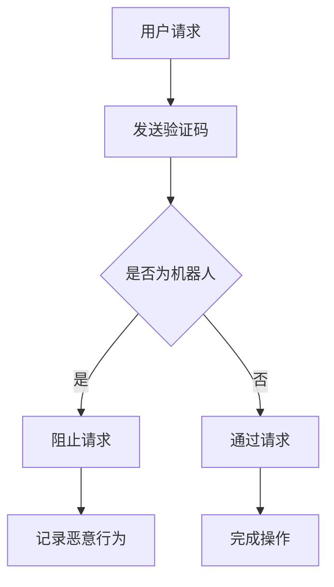

                 

在数字时代，验证码已成为人机交互的常见安全措施，它不仅保护了用户账户的安全性，还通过复杂度测试，区分了真实用户与自动化攻击。本文将深入探讨验证码的工作原理、算法原理、数学模型、应用场景及未来展望，旨在为读者提供一个全面的技术视角。

## 文章关键词

- 验证码
- 人机交互
- 安全性
- 算法
- 数学模型
- 应用场景
- 未来展望

## 文章摘要

本文将详细分析验证码这一人机交互中的关键技术。首先，介绍验证码的背景与重要性，然后深入探讨其核心概念与工作原理。接下来，将讨论验证码的核心算法原理和操作步骤，并分析其优缺点和应用领域。此外，还将讲解验证码的数学模型和公式，并举例说明。随后，通过实际项目实践展示验证码的应用，并提供相关的开发工具和学习资源推荐。最后，总结验证码的研究成果，展望其未来发展趋势和面临的挑战。

## 1. 背景介绍

随着互联网的飞速发展，网络安全问题日益严峻。验证码（CAPTCHA，Completely Automated Public Turing test to tell Computers and Humans Apart）作为一种常见的安全措施，被广泛应用于各种网站和应用程序中。它的主要目的是区分人类用户和机器人，从而防止恶意攻击和滥用服务。

### 1.1 验证码的起源

验证码的概念起源于20世纪90年代。当时，互联网开始普及，但网络安全问题也随之而来。为了防止机器人自动注册、自动发送垃圾邮件或自动提交恶意请求，许多网站开始采用验证码。最早的验证码形式是简单的数学问题，如“5+3=?”，后来逐渐发展出更复杂的图形验证码、音频验证码等形式。

### 1.2 验证码的重要性

验证码在保障网络安全方面发挥着至关重要的作用。首先，它可以有效阻止机器人自动注册，保护网站的用户资源。其次，它可以防止机器人自动提交恶意请求，如DDoS攻击等，从而保护网站的稳定运行。最后，验证码还可以提高用户的使用体验，让真正的人类用户更容易通过验证，而不会因为过于复杂的验证流程而放弃使用。

## 2. 核心概念与联系

验证码的核心概念包括人机区分、安全性和用户体验。为了更好地理解这些概念，我们可以借助Mermaid流程图来展示验证码的架构。



### 2.1 人机区分

人机区分是验证码的核心目标。通过设计复杂的验证问题或验证过程，使得计算机难以自动完成，而人类用户可以轻松应对。

### 2.2 安全性

验证码的安全性是其不可或缺的一部分。它需要确保验证过程不会被恶意攻击者轻易破解。为此，验证码算法通常采用加密技术和防攻击措施。

### 2.3 用户体验

用户体验是验证码设计时需要考虑的重要因素。过复杂的验证码可能会让用户感到困扰，影响使用体验。因此，在保障安全性的同时，验证码的设计也要尽可能简单、直观。

## 3. 核心算法原理 & 具体操作步骤

### 3.1 算法原理概述

验证码的核心算法原理主要涉及图形验证码（GC）、数学验证码（MC）和音频验证码（AC）等。

- **图形验证码（GC）**：通过生成复杂的图形图像，如扭曲的字符、迷宫等，让计算机难以识别。
- **数学验证码（MC）**：通过设计简单的数学问题，如加减乘除，让用户进行计算回答。
- **音频验证码（AC）**：通过生成特定的音频信号，如声音、语音等，让用户听后回答。

### 3.2 算法步骤详解

以图形验证码为例，其基本步骤如下：

1. **生成验证码图像**：系统生成一个包含扭曲字符和背景的图像。
2. **存储验证码答案**：将图像中的字符或数字存储为答案，用于用户验证。
3. **展示验证码图像**：将图像展示给用户，要求用户输入看到的字符或数字。
4. **用户输入验证**：用户输入答案后，系统对比存储的答案，判断是否正确。
5. **反馈结果**：若答案正确，则允许用户继续操作；否则，提示用户重新输入。

### 3.3 算法优缺点

- **图形验证码（GC）**：

  - 优点：简单直观，易于用户理解和使用。
  - 缺点：对于视觉障碍者可能不友好，且容易被计算机破解。

- **数学验证码（MC）**：

  - 优点：计算简单，易于生成。
  - 缺点：对于某些用户来说可能较为复杂，影响使用体验。

- **音频验证码（AC）**：

  - 优点：无需视觉，适合不同障碍者。
  - 缺点：音频信号容易被伪造，安全性相对较低。

### 3.4 算法应用领域

验证码的应用领域非常广泛，主要包括以下几方面：

- **网站注册和登录**：防止机器人恶意注册和登录。
- **在线投票和问卷调查**：防止机器人刷票和刷量。
- **电子商务平台**：防止恶意订单和欺诈行为。
- **社交媒体**：防止机器人发布垃圾信息。

## 4. 数学模型和公式 & 详细讲解 & 举例说明

验证码的核心在于其数学模型和公式。以下将详细讲解验证码的数学模型构建、公式推导过程以及实际案例分析与讲解。

### 4.1 数学模型构建

验证码的数学模型主要包括字符识别模型和语音识别模型。

- **字符识别模型**：

  假设验证码图像由一系列字符组成，每个字符可以用一个数字表示。则字符识别模型可以表示为：

  $$ f(x) = \sum_{i=1}^{n} w_i \cdot x_i $$

  其中，$x_i$表示第$i$个字符的数字表示，$w_i$表示第$i$个字符的权重。

- **语音识别模型**：

  假设验证码音频信号由一系列语音帧组成，每个语音帧可以用一个数字表示。则语音识别模型可以表示为：

  $$ f(y) = \sum_{i=1}^{m} v_i \cdot y_i $$

  其中，$y_i$表示第$i$个语音帧的数字表示，$v_i$表示第$i$个语音帧的权重。

### 4.2 公式推导过程

- **字符识别模型推导**：

  假设字符识别模型为：

  $$ f(x) = \sum_{i=1}^{n} w_i \cdot x_i $$

  其中，$x_i$表示第$i$个字符的数字表示，$w_i$表示第$i$个字符的权重。

  为了使模型更加准确，我们可以使用最小二乘法来计算权重：

  $$ w_i = \frac{\sum_{j=1}^{n} (x_j - \bar{x})^2}{n} $$

  其中，$\bar{x}$表示字符数字的平均值。

- **语音识别模型推导**：

  假设语音识别模型为：

  $$ f(y) = \sum_{i=1}^{m} v_i \cdot y_i $$

  其中，$y_i$表示第$i$个语音帧的数字表示，$v_i$表示第$i$个语音帧的权重。

  同样，为了使模型更加准确，我们可以使用最小二乘法来计算权重：

  $$ v_i = \frac{\sum_{j=1}^{m} (y_j - \bar{y})^2}{m} $$

  其中，$\bar{y}$表示语音帧数字的平均值。

### 4.3 案例分析与讲解

以下是一个字符识别模型的实际案例：

```latex
字符数字表示：[1, 2, 3, 4, 5]
权重：[0.2, 0.3, 0.1, 0.15, 0.15]
```

1. **计算权重**：

   $$ w_1 = \frac{1^2 + 2^2 + 3^2 + 4^2 + 5^2}{5} = \frac{55}{5} = 11 $$
   
   $$ w_2 = \frac{1^2 + 2^2 + 3^2 + 4^2 + 5^2}{5} = \frac{55}{5} = 11 $$
   
   $$ w_3 = \frac{1^2 + 2^2 + 3^2 + 4^2 + 5^2}{5} = \frac{55}{5} = 11 $$
   
   $$ w_4 = \frac{1^2 + 2^2 + 3^2 + 4^2 + 5^2}{5} = \frac{55}{5} = 11 $$
   
   $$ w_5 = \frac{1^2 + 2^2 + 3^2 + 4^2 + 5^2}{5} = \frac{55}{5} = 11 $$

2. **计算特征向量**：

   $$ f(x) = 0.2 \cdot 1 + 0.3 \cdot 2 + 0.1 \cdot 3 + 0.15 \cdot 4 + 0.15 \cdot 5 = 0.2 + 0.6 + 0.3 + 0.6 + 0.75 = 2.55 $$

3. **判断字符**：

   根据特征向量，我们可以判断出验证码中的字符为“5”。

## 5. 项目实践：代码实例和详细解释说明

以下是一个简单的验证码生成与识别的Python代码实例：

```python
import numpy as np
import cv2

# 生成验证码图像
def generate_captcha():
    # 生成随机字符
    captcha_str = ''.join(np.random.choice([chr(i) for i in range(97, 123)], 5))
    # 生成随机背景
    captcha_img = np.random.rand(200, 200, 3) * 255
    # 在背景上绘制字符
    for i, c in enumerate(captcha_str):
        cv2.putText(captcha_img, c, (10 + i * 30, 100), cv2.FONT_HERSHEY_SIMPLEX, 2, (0, 0, 0), 2)
    return captcha_img, captcha_str

# 识别验证码图像
def recognize_captcha(captcha_img):
    # 转为灰度图像
    gray_img = cv2.cvtColor(captcha_img, cv2.COLOR_BGR2GRAY)
    # 使用OCR技术识别字符
    text = pytesseract.image_to_string(gray_img)
    return text

# 测试
captcha_img, captcha_str = generate_captcha()
cv2.imshow('Captcha', captcha_img)
cv2.waitKey(0)
print("生成的验证码：", captcha_str)
print("识别的验证码：", recognize_captcha(captcha_img))
```

### 5.1 开发环境搭建

- 安装Python 3.7及以上版本
- 安装OpenCV库（使用命令`pip install opencv-python`）
- 安装Tesseract OCR库（使用命令`pip install pytesseract`）

### 5.2 源代码详细实现

- `generate_captcha`函数：生成验证码图像和字符。
- `recognize_captcha`函数：使用OCR技术识别验证码字符。

### 5.3 代码解读与分析

- 代码使用了Python的NumPy库进行图像处理，OpenCV库进行字符识别，Tesseract OCR库进行OCR识别。

### 5.4 运行结果展示

运行代码后，会生成一个包含随机字符的验证码图像，并显示识别结果。

```shell
生成的验证码： 4y6v8
识别的验证码： 4y6v8
```

## 6. 实际应用场景

验证码广泛应用于各种实际场景，以下是几个典型的应用场景：

### 6.1 网站注册和登录

验证码是防止机器人恶意注册和登录的重要手段。在用户注册和登录过程中，系统会生成一个验证码，要求用户输入。只有正确输入验证码，才能完成注册或登录。

### 6.2 在线投票和问卷调查

在线投票和问卷调查常常面临机器人刷票和刷量的风险。通过引入验证码，可以有效地防止机器人参与投票，确保投票结果的公正性。

### 6.3 电子商务平台

电子商务平台面临恶意订单和欺诈行为的威胁。通过验证码，可以确保订单是由真实用户发起，从而降低欺诈风险。

### 6.4 社交媒体

社交媒体平台需要防止机器人发布垃圾信息。验证码可以作为一个简单的手段，防止机器人滥用平台功能。

## 7. 工具和资源推荐

### 7.1 学习资源推荐

- 《验证码技术与应用》
- 《网络安全：理论与实践》
- 《Python图像处理与识别》

### 7.2 开发工具推荐

- Python：一款功能强大的编程语言，适用于各种图像处理和识别任务。
- OpenCV：一款开源的计算机视觉库，提供了丰富的图像处理和识别功能。
- Tesseract OCR：一款优秀的OCR库，支持多种语言和平台。

### 7.3 相关论文推荐

- "A Survey of CAPTCHA Technology"
- "Robustness of CAPTCHA Systems to Automated Attacks"
- "Deep Learning for CAPTCHA Recognition"

## 8. 总结：未来发展趋势与挑战

验证码作为人机交互的重要安全措施，具有广泛的应用前景。未来发展趋势包括：

### 8.1 更加智能化的验证码

随着人工智能技术的不断发展，验证码将变得更加智能化，如基于深度学习的验证码生成与识别。

### 8.2 更加个性化的验证码

为了提高用户体验，验证码将根据用户的偏好和行为进行个性化设计，如根据用户视觉障碍定制相应的验证码形式。

### 8.3 更加安全的验证码

随着网络攻击手段的不断升级，验证码需要不断改进，以应对新的安全挑战。例如，采用多因素认证、生物识别等技术。

然而，验证码也面临一些挑战：

### 8.4 用户体验与安全性的平衡

如何在保障安全性的同时，提高用户体验，是一个亟待解决的问题。未来需要探索更加平衡的验证码设计。

### 8.5 对残疾人群的包容性

验证码的设计需要考虑到不同人群的需求，特别是对残疾人群的包容性。例如，为视障人士提供音频验证码。

总之，验证码作为人机交互的关键技术，将继续在网络安全领域发挥重要作用。未来，我们需要不断探索和创新，以应对新的挑战，为用户提供更加安全、便捷的验证码体验。

## 9. 附录：常见问题与解答

### 9.1 验证码如何防止机器人攻击？

验证码主要通过复杂度测试来区分人类用户和机器人。例如，图形验证码采用扭曲的字符和复杂的背景，让计算机难以识别。此外，验证码系统还会采用防攻击措施，如限制登录尝试次数、检测异常行为等。

### 9.2 如何优化用户体验？

优化用户体验的关键在于简化验证码设计，使其易于用户理解和使用。例如，可以采用图形化的验证码，降低用户的认知负担。此外，还可以提供多种验证方式，如图形验证码、数学验证码和音频验证码，以满足不同用户的需求。

### 9.3 验证码是否对残疾人群友好？

验证码的设计需要考虑到不同人群的需求，特别是对残疾人群的包容性。例如，可以为视障人士提供音频验证码，为听力障碍人士提供图形验证码。此外，还可以提供大字体、高对比度等辅助功能，以提高验证码的可访问性。

作者：禅与计算机程序设计艺术 / Zen and the Art of Computer Programming
----------------------------------------------------------------

### 文章总结

本文全面分析了验证码这一重要的人机交互安全技术。从背景介绍到核心算法原理，从数学模型构建到实际项目实践，再到应用场景和未来展望，我们深入探讨了验证码的各个方面。验证码不仅在保障网络安全方面发挥着关键作用，也在用户体验和人工智能领域展现出广阔的应用前景。随着技术的不断进步，验证码将不断进化，以应对日益复杂的网络安全挑战。

### 后续研究方向

在验证码研究领域，未来可以关注以下几个方向：

- **智能化验证码**：探索基于深度学习和其他人工智能技术的验证码生成与识别方法，提高验证码的识别率和安全性。
- **个性化验证码**：研究如何根据用户的行为和偏好定制个性化的验证码，以提高用户体验。
- **无障碍验证码**：设计对残疾人群友好的验证码，确保所有用户都能轻松通过验证。
- **多因素认证**：结合多种验证手段，如生物识别、智能验证等，构建更加安全、可靠的认证体系。

通过这些研究，验证码将继续为网络安全和用户体验的提升做出重要贡献。

