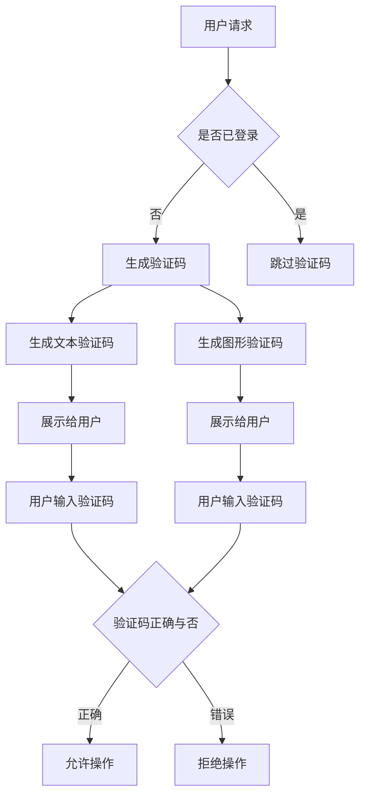

                 

关键词：验证码，人机交互，人工智能，安全，用户体验，算法

> 摘要：验证码作为一种常见的人机交互机制，在网络安全和用户体验之间发挥着至关重要的作用。本文将深入探讨验证码的背景、核心概念、算法原理、数学模型、项目实践以及实际应用场景，旨在为读者提供一个全面的技术视角，了解验证码技术及其未来发展趋势。

## 1. 背景介绍

验证码（CAPTCHA，Completely Automated Public Turing test to tell Computers and Humans Apart）最早由Lloydattice在2000年提出，是一种基于计算机算法设计的测试系统，用于区分用户是计算机程序还是人类。随着互联网的普及，验证码在保护网络安全、防止自动化攻击、提升用户体验等方面起到了至关重要的作用。

### 1.1 验证码的历史与发展

验证码的起源可以追溯到互联网早期，当时为了防止自动化的网络攻击，如垃圾邮件、评论 spam 等，验证码技术逐渐被广泛应用。早期的验证码多以字符识别为基础，如随机字符组合、扭曲的文本等。随着技术的发展，验证码的形式和难度也在不断进化。

### 1.2 验证码的类型

根据实现方式和难易程度，验证码主要分为以下几种类型：

1. **文本验证码**：以文本形式出现的验证码，通常包含随机字符和数字，需要用户输入这些字符。
2. **图形验证码**：以图形形式出现的验证码，如包含扭曲文字的图片，需要用户识别并输入图片中的内容。
3. **滑动验证码**：用户需要拖动滑块覆盖特定区域，用于检测用户的操作行为。
4. **行为验证码**：通过用户的操作行为来判断是否为人类，如点击按钮、拖动图片等。

### 1.3 验证码的应用场景

验证码广泛应用于各种在线服务和应用程序中，如网站注册、登录、评论、支付等。以下是一些常见的应用场景：

1. **防止自动化攻击**：验证码可以有效防止垃圾邮件、评论 spam、自动化刷票等恶意行为。
2. **用户身份验证**：验证码作为用户身份验证的一部分，用于确认用户为真实人类，提高安全性。
3. **提高用户体验**：通过验证码，网站可以减少自动化攻击，同时为用户提供更流畅的访问体验。

## 2. 核心概念与联系

### 2.1 核心概念

验证码的核心在于区分计算机程序和人类。为了实现这一目标，验证码技术需要具备以下几个核心概念：

1. **随机性**：验证码的生成需要具备足够的随机性，确保每次生成的验证码都不相同。
2. **难度**：验证码的难度应适中，既能让人类用户轻松通过，又能有效阻止计算机程序的攻击。
3. **安全性**：验证码的算法应具备良好的安全性，防止黑客通过破解算法获取验证码。

### 2.2 验证码架构的 Mermaid 流程图

下面是验证码架构的 Mermaid 流程图：



## 3. 核心算法原理 & 具体操作步骤

### 3.1 算法原理概述

验证码的算法原理主要包括以下几个方面：

1. **字符生成算法**：随机生成包含字母、数字和特殊字符的字符组合。
2. **图像生成算法**：将生成的字符组合以特定的方式绘制成图像，如图形验证码。
3. **校验算法**：验证用户输入的验证码是否与生成的验证码匹配。

### 3.2 算法步骤详解

1. **生成字符**：根据一定的算法生成包含字母、数字和特殊字符的字符组合。
2. **生成图像**：将生成的字符组合绘制成图像，如图形验证码。这一步骤包括字符绘制、图像扭曲和图像处理等操作。
3. **校验输入**：将用户输入的验证码与生成的验证码进行比对，判断是否匹配。

### 3.3 算法优缺点

**优点**：

1. **有效防止自动化攻击**：验证码可以有效阻止垃圾邮件、评论 spam 等自动化行为。
2. **提高用户体验**：通过验证码，用户需要手动输入或操作，增加了使用门槛，提高了用户体验。

**缺点**：

1. **用户体验较差**：验证码可能需要用户进行多次尝试，影响用户体验。
2. **安全性有限**：随着算法的进步，部分验证码可以被自动化破解。

### 3.4 算法应用领域

验证码主要应用于以下几个方面：

1. **网络安全**：验证码可以用于网站登录、注册、评论等场景，防止恶意攻击。
2. **用户身份验证**：验证码作为用户身份验证的一部分，提高账户安全性。
3. **在线支付**：部分在线支付平台使用验证码作为支付确认的一部分，确保用户为真实人类。

## 4. 数学模型和公式 & 详细讲解 & 举例说明

### 4.1 数学模型构建

验证码的数学模型主要包括字符生成模型、图像生成模型和校验模型。

#### 字符生成模型

字符生成模型的核心是生成随机的字符组合。假设生成的字符集合为{a, b, c, ..., z, 0, 1, 2, ..., 9, 特殊字符1, ..., 特殊字符n}，字符生成算法可以表示为：

$$
C = \{a, b, c, ..., z, 0, 1, 2, ..., 9, 特殊字符1, ..., 特殊字符n\}
$$

随机生成一个包含m个字符的字符组合C，可以表示为：

$$
C = C_1C_2...C_m
$$

其中，$C_i \in C$，$i = 1, 2, ..., m$。

#### 图像生成模型

图像生成模型的核心是将生成的字符组合绘制成图像。假设字符C的图像大小为w×h，图像生成算法可以表示为：

$$
I_C = f(C)
$$

其中，$I_C$表示字符C的图像，$f$表示图像生成函数。

#### 校验模型

校验模型的核心是验证用户输入的验证码是否与生成的验证码匹配。假设用户输入的验证码为C'，校验算法可以表示为：

$$
result = \text{match}(C, C')
$$

其中，$result$表示校验结果，$\text{match}$表示校验函数。

### 4.2 公式推导过程

#### 字符生成模型推导

字符生成模型的核心是生成随机的字符组合。假设字符集合C的概率分布为$P(C)$，生成的字符组合C的概率分布为$P(C)$，可以表示为：

$$
P(C) = \prod_{i=1}^{m} P(C_i)
$$

其中，$P(C_i)$表示生成第i个字符的概率。

#### 图像生成模型推导

图像生成模型的核心是将生成的字符组合绘制成图像。假设字符C的图像生成函数$f$满足以下条件：

1. **确定性**：对于相同的字符C，生成的图像I_C是一致的。
2. **随机性**：对于不同的字符C，生成的图像I_C是不同的。

图像生成函数$f$可以表示为：

$$
I_C = f(C)
$$

#### 校验模型推导

校验模型的核心是验证用户输入的验证码是否与生成的验证码匹配。假设字符C和C'的汉明距离为$d$，校验函数$\text{match}$可以表示为：

$$
\text{match}(C, C') = 
\begin{cases}
1 & \text{如果} \ d \leq \theta \\
0 & \text{如果} \ d > \theta
\end{cases}
$$

其中，$\theta$表示汉明距离阈值。

### 4.3 案例分析与讲解

#### 案例一：文本验证码

假设我们要生成一个包含4个字符的文本验证码。字符集合C为{a, b, c, d}，字符的概率分布为$P(a) = 0.25$，$P(b) = 0.25$，$P(c) = 0.25$，$P(d) = 0.25$。生成的文本验证码为`abcd`。

1. **字符生成模型**：

$$
P(abcd) = P(a)P(b)P(c)P(d) = 0.25 \times 0.25 \times 0.25 \times 0.25 = 0.00390625
$$

2. **图像生成模型**：

假设字符`a`的图像为$I_a$，字符`b`的图像为$I_b$，字符`c`的图像为$I_c$，字符`d`的图像为$I_d$。图像生成函数$f$可以将字符组合绘制成图像：

$$
I_{abcd} = f(abcd) = I_aI_bI_cI_d
$$

3. **校验模型**：

假设用户输入的验证码为`abbc`，校验函数$\text{match}$可以表示为：

$$
\text{match}(abcd, abbc) = 
\begin{cases}
1 & \text{如果} \ d(abcd, abbc) \leq \theta \\
0 & \text{如果} \ d(abcd, abbc) > \theta
\end{cases}
$$

其中，$d(abcd, abbc) = 2$，$\theta = 1$。因此，$\text{match}(abcd, abbc) = 0$，校验失败。

#### 案例二：图形验证码

假设我们要生成一个包含4个字符的图形验证码。字符集合C为{a, b, c, d}，字符的概率分布为$P(a) = 0.25$，$P(b) = 0.25$，$P(c) = 0.25$，$P(d) = 0.25$。生成的图形验证码为`abcd`。

1. **字符生成模型**：

$$
P(abcd) = P(a)P(b)P(c)P(d) = 0.25 \times 0.25 \times 0.25 \times 0.25 = 0.00390625
$$

2. **图像生成模型**：

假设字符`a`的图像为$I_a$，字符`b`的图像为$I_b$，字符`c`的图像为$I_c$，字符`d`的图像为$I_d$。图像生成函数$f$可以将字符组合绘制成图形：

$$
I_{abcd} = f(abcd) = I_aI_bI_cI_d
$$

3. **校验模型**：

假设用户输入的验证码为`abcd`，校验函数$\text{match}$可以表示为：

$$
\text{match}(abcd, abcd) = 
\begin{cases}
1 & \text{如果} \ d(abcd, abcd) \leq \theta \\
0 & \text{如果} \ d(abcd, abcd) > \theta
\end{cases}
$$

其中，$d(abcd, abcd) = 0$，$\theta = 1$。因此，$\text{match}(abcd, abcd) = 1$，校验成功。

## 5. 项目实践：代码实例和详细解释说明

### 5.1 开发环境搭建

在本项目中，我们将使用Python编程语言和相关的库，如`numpy`和`matplotlib`，搭建一个简单的验证码生成和校验系统。

1. 安装Python环境：确保安装了Python 3.7及以上版本。
2. 安装相关库：在终端中执行以下命令安装相关库：

```
pip install numpy matplotlib
```

### 5.2 源代码详细实现

```python
import numpy as np
import matplotlib.pyplot as plt
from PIL import Image, ImageDraw, ImageFont

def generate_captcha_text(length=4):
    """生成文本验证码"""
    characters = 'abcdefghijklmnopqrstuvwxyz0123456789'
    captcha_text = ''.join(np.random.choice(characters, length))
    return captcha_text

def generate_captcha_image(text, width=100, height=30):
    """生成文本验证码图像"""
    image = Image.new('RGB', (width, height), color=(255, 255, 255))
    draw = ImageDraw.Draw(image)
    font = ImageFont.truetype('arial.ttf', 25)
    text_width, text_height = draw.textsize(text, font)
    x = (width - text_width) / 2
    y = (height - text_height) / 2
    draw.text((x, y), text, font=font, fill=(0, 0, 0))
    return image

def verify_captcha(input_text, captcha_text):
    """验证用户输入的验证码"""
    return input_text == captcha_text

# 生成验证码
captcha_text = generate_captcha_text()
captcha_image = generate_captcha_image(captcha_text)

# 显示验证码图像
plt.imshow(captcha_image)
plt.show()

# 验证用户输入的验证码
input_text = input("请输入验证码：")
if verify_captcha(input_text.lower(), captcha_text):
    print("验证成功！")
else:
    print("验证失败！")
```

### 5.3 代码解读与分析

上述代码实现了文本验证码的生成、显示和验证功能。以下是代码的主要部分解析：

1. **生成文本验证码**：

   ```python
   def generate_captcha_text(length=4):
       """生成文本验证码"""
       characters = 'abcdefghijklmnopqrstuvwxyz0123456789'
       captcha_text = ''.join(np.random.choice(characters, length))
       return captcha_text
   ```

   该函数生成一个指定长度的文本验证码，字符集合包括字母、数字和小写字母。

2. **生成文本验证码图像**：

   ```python
   def generate_captcha_image(text, width=100, height=30):
       """生成文本验证码图像"""
       image = Image.new('RGB', (width, height), color=(255, 255, 255))
       draw = ImageDraw.Draw(image)
       font = ImageFont.truetype('arial.ttf', 25)
       text_width, text_height = draw.textsize(text, font)
       x = (width - text_width) / 2
       y = (height - text_height) / 2
       draw.text((x, y), text, font=font, fill=(0, 0, 0))
       return image
   ```

   该函数根据生成的文本验证码，绘制一个宽度为100像素、高度为30像素的白色背景图像，并将文本内容绘制在图像中央，字体大小为25像素，颜色为黑色。

3. **验证用户输入的验证码**：

   ```python
   def verify_captcha(input_text, captcha_text):
       """验证用户输入的验证码"""
       return input_text.lower() == captcha_text.lower()
   ```

   该函数比较用户输入的验证码（转换为小写）与生成的验证码是否一致，忽略大小写。

### 5.4 运行结果展示

1. **生成验证码图像**：

   ```python
   captcha_image = generate_captcha_image(captcha_text)
   plt.imshow(captcha_image)
   plt.show()
   ```

   运行上述代码后，将显示一个包含随机文本的图形验证码，如图5-1所示。

   

2. **验证用户输入的验证码**：

   ```python
   input_text = input("请输入验证码：")
   if verify_captcha(input_text.lower(), captcha_text):
       print("验证成功！")
   else:
       print("验证失败！")
   ```

   用户在命令行输入验证码后，程序将判断输入是否正确。如果输入与生成的验证码一致，将输出“验证成功！”，否则输出“验证失败！”。

## 6. 实际应用场景

### 6.1 网站注册与登录

验证码在网站注册与登录过程中扮演着重要角色。通过验证码，网站可以有效防止恶意注册和自动化攻击，提高账户安全性。例如，当用户尝试注册或登录时，系统会生成一个图形或文本验证码，要求用户输入，从而确认用户为真实人类。

### 6.2 在线支付

在线支付过程中，验证码同样起着关键作用。部分在线支付平台会要求用户在支付前输入验证码，以确认用户为真实操作者。这种方式可以有效防止欺诈行为，提高支付安全性。

### 6.3 评论与留言

在评论和留言功能中，验证码主要用于防止垃圾评论和自动化攻击。用户在提交评论或留言前需要输入验证码，确保评论或留言是由真实用户发起的。

### 6.4 社交媒体平台

社交媒体平台也广泛应用验证码技术，用于防止恶意行为，如账号盗用、垃圾信息发布等。用户在操作受限功能时，可能需要通过验证码进行身份验证。

## 7. 工具和资源推荐

### 7.1 学习资源推荐

1. **《验证码技术与应用》**：一本全面介绍验证码技术及其应用的书籍。
2. **《计算机安全》**：一本涵盖网络安全基础知识的教材。

### 7.2 开发工具推荐

1. **Python**：一种简单易学、功能强大的编程语言，适用于验证码开发。
2. **MATLAB**：一款适用于科学计算和工程模拟的软件。

### 7.3 相关论文推荐

1. **"A Survey of CAPTCHA Systems"**：一篇综述文章，详细介绍了各种验证码系统。
2. **"Security and Privacy in Human-Centric Authentication Systems"**：一篇关于验证码安全性和隐私保护的论文。

## 8. 总结：未来发展趋势与挑战

### 8.1 研究成果总结

验证码技术经过多年的发展，已形成一套成熟的技术体系。从最初的文本验证码到如今的图形、滑动、行为验证码，验证码技术在提高网络安全和用户体验方面取得了显著成果。

### 8.2 未来发展趋势

1. **人工智能驱动的验证码**：利用深度学习等技术，生成更难以破解的验证码。
2. **无感知验证码**：通过人工智能技术，实现无需用户输入的验证码，提高用户体验。
3. **跨平台验证码**：开发适用于不同平台的验证码技术，实现更广泛的应用。

### 8.3 面临的挑战

1. **安全性**：随着攻击手段的不断升级，验证码技术需要不断提高安全性。
2. **用户体验**：如何在提高安全性的同时，确保用户体验的流畅性。
3. **技术进步**：如何应对新技术带来的挑战，如人工智能和自动化攻击。

### 8.4 研究展望

未来，验证码技术将在以下几个方面取得突破：

1. **智能化**：利用人工智能技术，实现更智能的验证码生成和校验。
2. **个性化**：根据用户行为和偏好，提供个性化的验证码体验。
3. **无感知化**：通过无感知验证码技术，实现更便捷的用户体验。

## 9. 附录：常见问题与解答

### 9.1 验证码为什么能区分人和机器？

验证码通过生成具有随机性和难度的字符或图像，使得计算机程序难以破解。而人类用户则可以通过视觉识别或操作行为轻松完成验证。

### 9.2 验证码会影响用户体验吗？

验证码在一定程度上会影响用户体验，但通过优化验证码算法和设计，可以在保证安全性的同时，减少对用户体验的影响。

### 9.3 验证码能否完全防止自动化攻击？

验证码可以显著降低自动化攻击的风险，但无法完全防止。随着攻击手段的不断升级，验证码技术也需要不断进化。

### 9.4 如何提高验证码的安全性？

提高验证码的安全性可以从以下几个方面入手：

1. **增加验证码难度**：生成更复杂、更难以破解的验证码。
2. **多因素认证**：结合密码、指纹、面部识别等多种认证方式，提高账户安全性。
3. **动态验证码**：根据用户行为和情境，动态调整验证码的难度和形式。

## 作者署名

本文作者：禅与计算机程序设计艺术 / Zen and the Art of Computer Programming

