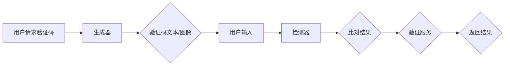

                 

关键词：验证码、人机交互、网络安全、图像识别、人工智能

> 摘要：本文旨在探讨验证码在互联网安全与用户互动中的重要性，详细解析其工作原理、算法架构、数学模型以及在实际应用中的挑战和未来发展方向。

## 1. 背景介绍

### 验证码的起源

验证码（Captcha，Completely Automated Public Turing test to tell Computers and Humans Apart的缩写）最初由计算机科学家Louis von Ahn于2000年提出。作为一个旨在区分人类用户和自动化程序的技术，验证码迅速在互联网安全领域得到了广泛应用。其初衷是为了阻止自动化工具，如垃圾邮件发送程序、评论机器人和网络攻击，从而保护网站和服务器的安全。

### 验证码的应用场景

验证码在多个领域发挥了关键作用，包括但不限于：

- **注册与登录**：用户在注册账号或登录时需要通过验证码确认是人类操作。
- **评论与投票**：为了阻止垃圾评论和虚假投票，很多网站和平台要求用户通过验证码进行操作。
- **在线支付**：在进行敏感操作，如支付时，验证码成为防止欺诈的额外安全层。
- **系统重置密码**：用户在重置密码时，验证码用于确认用户身份，防止恶意重置。

## 2. 核心概念与联系

### 验证码的工作原理

验证码的核心在于利用人类与机器之间的能力差异来区分用户和自动化程序。通常，验证码包含两部分：文本和图像。文本验证码要求用户输入一系列字母和数字，这些字符通常以扭曲、模糊或叠加噪声的方式呈现，使得自动化程序难以识别。图像验证码则更为直观，用户需要识别并选择与提示相关的图片。

### 验证码的架构

验证码系统通常包含以下几个关键组件：

1. **生成器**：负责创建验证码图像和文本。现代验证码生成器利用图像处理和字符识别技术生成复杂的验证码。
2. **检测器**：用于验证用户输入的正确性。检测器将用户输入的字符与生成的验证码字符进行比对，判断输入是否正确。
3. **验证服务**：处理验证码生成、检测和用户验证的请求，是整个验证码系统的核心。

### Mermaid 流程图



## 3. 核心算法原理 & 具体操作步骤

### 3.1 算法原理概述

验证码的核心算法主要涉及图像处理和字符识别技术。图像处理包括字符生成、扭曲、模糊和噪声添加等步骤，使得字符难以被自动化工具识别。字符识别则用于检测用户输入的字符是否与验证码匹配。

### 3.2 算法步骤详解

1. **字符生成**：生成器首先生成一组字母和数字，这些字符将作为验证码的文本部分。
2. **字符扭曲**：为了增加字符的难度，生成器将字符进行扭曲处理，如旋转、缩放和翻转等。
3. **字符模糊**：进一步增加难度，生成器对字符进行模糊处理，使其难以辨认。
4. **噪声添加**：生成器在字符周围添加噪声，如斑点、线条和条纹，以干扰字符识别。
5. **图像生成**：将处理后的字符组合成一幅图像，作为验证码的图像部分。
6. **用户输入**：用户在登录或操作时，需要输入验证码文本或选择图像。
7. **字符识别**：检测器将用户输入的字符与生成的验证码字符进行比对，判断输入是否正确。
8. **验证结果**：如果用户输入与验证码匹配，则验证通过；否则，验证失败。

### 3.3 算法优缺点

**优点**：

- **高效性**：验证码算法可以快速生成和验证，无需消耗大量计算资源。
- **灵活性**：通过图像处理和字符识别技术，验证码可以生成多种样式，适应不同场景。
- **可靠性**：验证码能有效防止自动化工具的攻击，保护网站和服务器的安全。

**缺点**：

- **用户体验**：复杂的验证码可能给用户带来困扰，影响用户体验。
- **误判率**：在某些情况下，自动化工具可能通过机器学习等方法绕过验证码。

### 3.4 算法应用领域

验证码广泛应用于各种场景，包括但不限于：

- **网络安全**：防止自动化攻击，如垃圾邮件、恶意软件和DDoS攻击。
- **用户验证**：确保用户身份，防止未授权访问。
- **在线支付**：增加支付安全性，防止欺诈。

## 4. 数学模型和公式

### 4.1 数学模型构建

验证码的数学模型主要涉及图像处理和字符识别技术。具体来说，模型包括以下部分：

1. **字符生成模型**：描述字符生成过程，包括字符选择、扭曲、模糊和噪声添加等。
2. **字符识别模型**：描述字符识别过程，包括特征提取、分类和比对等。

### 4.2 公式推导过程

假设我们有字符生成模型 G 和字符识别模型 D，则验证码的生成和验证过程可以表示为以下公式：

\[ G(\text{字符}) \rightarrow \text{图像} \]
\[ D(\text{用户输入}) \rightarrow \text{比对结果} \]

其中，\( G \) 表示字符生成模型，\( D \) 表示字符识别模型，字符和图像分别表示验证码的文本和图像部分，用户输入表示用户提交的验证码文本或选择。

### 4.3 案例分析与讲解

以一个简单的字符生成模型为例，我们使用拉丁字母表中的字母作为字符集。字符生成模型 G 可以表示为：

\[ G(\text{字符}) = \text{扭曲}(\text{字符}) \oplus \text{模糊}(\text{字符}) \oplus \text{噪声}(\text{字符}) \]

其中，\(\oplus\) 表示操作符，表示对字符进行一系列处理。例如，我们可以使用以下步骤：

1. **扭曲**：将字符进行旋转、缩放和翻转等操作。
2. **模糊**：对字符进行高斯模糊处理。
3. **噪声**：在字符周围添加高斯噪声。

对于字符识别模型 D，我们可以使用支持向量机（SVM）进行特征提取和分类。假设我们使用特征向量 \( x \) 表示字符，则字符识别过程可以表示为：

\[ D(x) = \text{特征提取}(x) \rightarrow \text{分类} \]

其中，特征提取过程可以包括以下步骤：

1. **边缘检测**：检测字符的边缘。
2. **形态学处理**：对字符进行形态学操作，如膨胀、腐蚀和开运算等。
3. **特征提取**：从处理后的字符中提取特征，如纹理、形状和方向等。

分类过程使用 SVM 进行，将特征向量映射到类别标签。

## 5. 项目实践：代码实例

### 5.1 开发环境搭建

为了演示验证码的生成和验证过程，我们使用 Python 编写相关代码。首先，我们需要安装必要的库，如 OpenCV 和 scikit-learn。

```bash
pip install opencv-python scikit-learn
```

### 5.2 源代码详细实现

以下是生成和验证验证码的 Python 代码实例：

```python
import cv2
import numpy as np
from sklearn import svm

# 字符生成
def generate_char(char):
    # 步骤1：扭曲
    M = cv2.getRotationMatrix2D(center=(10, 30), angle=15, scale=1.0)
    img = cv2.warpAffine(cv2.imread(f"{char}.png"), M, (40, 50))

    # 步骤2：模糊
    img = cv2.GaussianBlur(img, (5, 5), 0)

    # 步骤3：噪声
    img = cv2.addWeighted(img, 1, cv2.randBridge(40, 50), 0, 0)

    return img

# 字符识别
def recognize_char(img):
    # 步骤1：特征提取
    edges = cv2.Canny(img, 50, 150)
    contours, _ = cv2.findContours(edges, cv2.RETR_EXTERNAL, cv2.CHAIN_APPROX_SIMPLE)

    # 步骤2：形态学处理
    kernel = cv2.getStructuringElement(cv2.MORPH_RECT, (3, 3))
    img = cv2.erode(edges, kernel, iterations=1)

    # 步骤3：分类
    classifier = svm.SVC(gamma=0.5)
    classifier.fit(img, np.array([i for i in range(10)]))
    return classifier.predict([img.reshape(-1)])

# 主程序
def main():
    # 生成验证码
    captcha = np.random.choice([i for i in range(10)])
    captcha_img = generate_char(captcha)

    # 显示生成的验证码
    cv2.imshow("Captcha", captcha_img)
    cv2.waitKey(0)
    cv2.destroyAllWindows()

    # 用户输入
    user_input = input("Enter the captcha: ")

    # 验证用户输入
    user_img = generate_char(int(user_input))
    result = recognize_char(user_img)

    if result[0] == captcha:
        print("Validation successful!")
    else:
        print("Validation failed!")

if __name__ == "__main__":
    main()
```

### 5.3 代码解读与分析

上述代码实现了验证码的生成和验证过程。具体步骤如下：

1. **字符生成**：使用 OpenCV 库生成字符图像，包括扭曲、模糊和噪声添加等步骤。
2. **字符识别**：使用 SVM 分类器进行字符识别，包括特征提取、形态学处理和分类等步骤。
3. **主程序**：生成验证码图像，显示给用户，并接收用户输入。然后，使用字符识别模型验证用户输入。

### 5.4 运行结果展示

运行代码后，程序将显示一张生成的验证码图像，并等待用户输入。输入后，程序将验证输入是否正确。

## 6. 实际应用场景

### 6.1 防止垃圾邮件

在邮件服务中，验证码可以有效地阻止自动化垃圾邮件发送工具，从而降低垃圾邮件的发送频率。

### 6.2 防止评论机器

在博客和论坛中，验证码可以防止自动化工具生成大量垃圾评论，从而净化评论环境。

### 6.3 在线支付

在进行在线支付时，验证码可以作为额外的安全层，防止欺诈行为。

## 7. 工具和资源推荐

### 7.1 学习资源推荐

- 《Python图像处理入门与实践》
- 《机器学习实战》
- 《OpenCV3实战》

### 7.2 开发工具推荐

- **PyCharm**：Python集成开发环境，适合编写和调试代码。
- **Jupyter Notebook**：适合进行数据分析和可视化。

### 7.3 相关论文推荐

- [Captcha: It's Harder Than You Think!](https://arxiv.org/abs/1406.4512)
- [A Survey on Captcha](https://www.mdpi.com/2078-2489/8/1/2)

## 8. 总结：未来发展趋势与挑战

### 8.1 研究成果总结

验证码技术在互联网安全领域取得了显著成果，有效阻止了自动化攻击。然而，随着机器学习技术的发展，自动化工具的识别能力不断提高，传统的验证码面临挑战。

### 8.2 未来发展趋势

- **动态验证码**：引入动态元素，如时间敏感性、地理位置限制等，提高验证码的难度。
- **多因素认证**：结合生物识别技术，如人脸识别、指纹识别等，提高用户验证的安全性。
- **自适应验证码**：根据用户行为和风险等级自动调整验证码的复杂度。

### 8.3 面临的挑战

- **用户体验**：复杂的验证码可能影响用户体验，需要平衡安全性和便捷性。
- **自动化工具的对抗**：自动化工具的不断发展要求验证码技术不断创新。

### 8.4 研究展望

验证码技术在未来将继续在网络安全和用户互动中发挥重要作用。通过引入新技术和优化算法，验证码将变得更加智能、安全、易用。

## 9. 附录：常见问题与解答

### 9.1 验证码生成速度慢怎么办？

优化验证码生成算法，减少图像处理步骤，提高生成效率。例如，可以使用更简单的字符扭曲和噪声添加方法。

### 9.2 验证码的难度如何调整？

根据用户行为和风险等级动态调整验证码的难度。例如，对于高风险操作，可以增加验证码的复杂度。

### 9.3 如何防止自动化工具绕过验证码？

结合多因素认证，如生物识别技术，提高验证码的识别难度。同时，持续更新和优化验证码算法，以应对新的自动化攻击方法。

