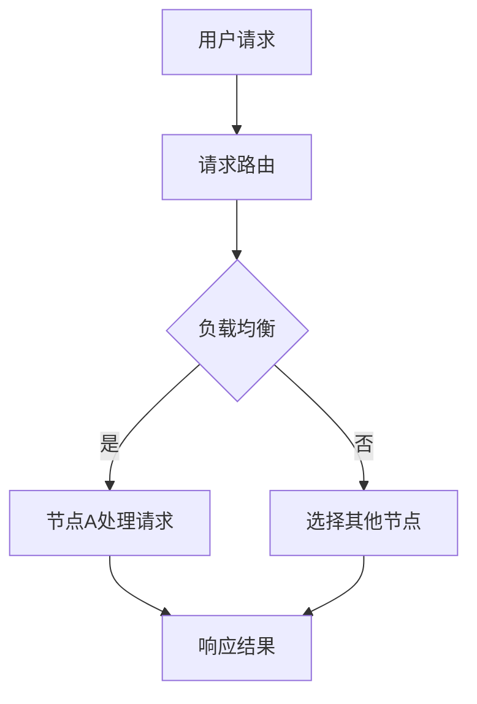

                 

关键字：高并发系统设计，大规模用户访问，性能优化，系统架构，负载均衡，响应时间，吞吐量

摘要：本文将深入探讨高并发系统设计的关键技术和方法，以应对大规模用户访问带来的挑战。通过详细的算法原理、数学模型、项目实践和未来展望，帮助读者理解并掌握构建高效高并发系统的核心技巧。

## 1. 背景介绍

在互联网时代，用户数量的激增使得系统的高并发处理能力成为衡量其性能的重要指标。无论是电商平台、社交媒体、在线游戏，还是金融交易平台，面对成千上万的并发请求，系统设计者必须确保稳定、高效的服务质量。高并发系统设计不仅关系到用户体验，更影响着企业的业务发展和盈利能力。

随着云计算、容器化、分布式技术的普及，构建高并发系统已经变得更加可行和高效。本文将重点讨论以下内容：

- **核心概念与联系**：介绍高并发系统设计中的关键概念，包括并发、吞吐量、响应时间等，并给出Mermaid流程图。
- **核心算法原理与操作步骤**：详细解析高性能并发算法，包括其原理、实现步骤、优缺点和应用领域。
- **数学模型与公式**：阐述构建数学模型的方法，推导关键公式，并通过案例进行说明。
- **项目实践**：提供具体代码实例，解释系统实现过程，分析代码解读和运行结果。
- **实际应用场景**：讨论高并发系统在不同领域的应用场景，以及未来发展趋势。
- **工具和资源推荐**：推荐学习资源和开发工具，提供相关论文推荐。
- **总结与展望**：总结研究成果，展望未来发展趋势和面临的挑战。

## 2. 核心概念与联系

在探讨高并发系统设计之前，我们需要明确一些核心概念，这些概念是构建高效系统的基石。

### 2.1 并发

并发（Concurrency）指的是系统在一段时间内执行多个任务的能力。在高并发系统中，系统需要同时处理多个用户请求，而不是一个接一个地处理。这要求系统具备并行处理的能力，以减少响应时间和提高吞吐量。

### 2.2 吞吐量

吞吐量（Throughput）是单位时间内系统能够处理的请求数量。它是衡量系统性能的重要指标，高吞吐量意味着系统能够快速响应大量请求。

### 2.3 响应时间

响应时间（Response Time）是指用户请求发送到系统到系统返回响应之间的时间间隔。降低响应时间可以显著提升用户体验。

### 2.4 负载均衡

负载均衡（Load Balancing）是将请求分配到多个服务器或节点上，以避免单个节点过载。负载均衡技术可以有效地提高系统的吞吐量和可用性。

### 2.5 Mermaid 流程图

以下是一个描述高并发系统处理流程的Mermaid流程图：



图中的流程描述了用户请求首先经过负载均衡器，然后被路由到可用的节点进行处理，最终返回响应结果。

## 3. 核心算法原理与具体操作步骤

### 3.1 算法原理概述

高并发系统的核心在于如何高效地处理大量请求。以下是几种常用的并发算法：

- **线程池（Thread Pool）**：通过预先创建一定数量的线程，复用线程来减少线程创建和销毁的开销。
- **非阻塞IO（Non-blocking IO）**：通过使用非阻塞IO操作，允许程序在等待IO操作完成时执行其他任务，从而提高吞吐量。
- **异步编程（Asynchronous Programming）**：通过异步处理请求，避免同步阻塞，提高系统响应能力。
- **无锁编程（Lock-Free Programming）**：避免使用锁，通过原子操作实现线程间的数据同步，减少竞争条件。

### 3.2 算法步骤详解

#### 线程池

线程池的实现步骤如下：

1. 创建线程池，设置线程数量和任务队列。
2. 当有新任务到来时，将任务放入任务队列。
3. 线程池中的线程从任务队列中获取任务并执行。
4. 任务执行完成后，线程返回线程池等待下一个任务。

#### 非阻塞IO

非阻塞IO的步骤如下：

1. 使用非阻塞IO接口发起操作。
2. 检查操作是否完成，如果是，则处理结果；否则，继续检查。
3. 在操作等待期间，程序可以执行其他任务。

#### 异步编程

异步编程的实现步骤如下：

1. 提供异步接口，允许程序在执行耗时操作时继续执行其他任务。
2. 操作执行完成后，通过回调函数通知程序处理结果。

#### 无锁编程

无锁编程的步骤如下：

1. 使用原子操作进行数据访问和更新。
2. 避免使用锁，减少线程间的竞争条件。
3. 使用循环或迭代的方式处理冲突，直到操作成功。

### 3.3 算法优缺点

- **线程池**：优点是减少了线程创建和销毁的开销，缺点是线程数量固定，可能无法充分利用系统资源。
- **非阻塞IO**：优点是提高了吞吐量，缺点是编程复杂度增加，容易出现竞态条件。
- **异步编程**：优点是提高了系统的响应能力，缺点是需要依赖回调函数，代码可读性降低。
- **无锁编程**：优点是减少了锁的开销，缺点是编程复杂度增加，容易出现死锁和竞态条件。

### 3.4 算法应用领域

- **线程池**：适用于高并发、计算密集型的应用，如Web服务器、后台处理任务。
- **非阻塞IO**：适用于网络通信、文件操作等IO密集型的应用。
- **异步编程**：适用于需要长时间执行的任务，如网络请求、数据库查询。
- **无锁编程**：适用于多核处理器、高并发、高性能的应用。

## 4. 数学模型和公式

在高并发系统设计中，数学模型和公式用于分析和优化系统的性能。以下是几个关键模型的构建和推导。

### 4.1 数学模型构建

假设系统处理请求的平均时间为 \(T\)，系统中存在的请求数量为 \(N\)，系统每秒可以处理的请求数量为 \(R\)，则系统的平均响应时间为：

\[ R_{avg} = \frac{N \cdot T}{R} \]

### 4.2 公式推导过程

- **请求到达率**：假设请求到达率服从泊松分布，平均每秒到达的请求数量为 \(\lambda\)。
- **请求处理能力**：系统每秒可以处理的请求数量为 \(R = \frac{1}{T}\)。
- **请求队列长度**：假设请求队列长度为 \(L\)，则请求在队列中的平均等待时间为 \(L \cdot T\)。

### 4.3 案例分析与讲解

以下是一个具体的案例，假设系统每秒可以处理100个请求，请求到达率平均为200个请求每秒。

\[ R_{avg} = \frac{N \cdot T}{R} = \frac{200 \cdot T}{100} = 2T \]

假设请求处理时间为1秒，则平均响应时间为：

\[ R_{avg} = 2 \cdot 1 = 2 \text{秒} \]

这意味着系统在每秒处理100个请求时，平均每个请求需要等待2秒。

## 5. 项目实践：代码实例和详细解释说明

### 5.1 开发环境搭建

为了实现高并发系统，我们需要搭建一个合适的开发环境。以下是环境搭建的步骤：

1. 安装Java开发工具包（JDK）。
2. 安装并配置Maven，用于项目管理和构建。
3. 创建一个Maven项目，并添加依赖库。

### 5.2 源代码详细实现

以下是一个简单的线程池实现的示例：

```java
import java.util.concurrent.ExecutorService;
import java.util.concurrent.Executors;

public class ThreadPoolExample {
    public static void main(String[] args) {
        ExecutorService executor = Executors.newFixedThreadPool(10);
        
        for (int i = 0; i < 100; i++) {
            executor.execute(new Task());
        }
        
        executor.shutdown();
    }
    
    static class Task implements Runnable {
        @Override
        public void run() {
            System.out.println("Processing task: " + Thread.currentThread().getName());
            try {
                Thread.sleep(1000);
            } catch (InterruptedException e) {
                e.printStackTrace();
            }
        }
    }
}
```

在这个例子中，我们创建了一个固定大小的线程池，并提交了100个任务。

### 5.3 代码解读与分析

- **ExecutorService**：这是Java中用于执行线程的接口，提供了线程池的管理功能。
- **newFixedThreadPool(10)**：创建了一个固定大小的线程池，包含10个线程。
- **executor.execute(new Task())**：将任务提交给线程池执行。
- **Task**：这是一个实现Runnable接口的类，表示一个可执行的线程任务。

### 5.4 运行结果展示

在运行上述代码时，我们可以看到线程池中的10个线程依次执行任务，输出如下：

```
Processing task: pool-1-thread-1
Processing task: pool-1-thread-2
...
Processing task: pool-1-thread-10
```

这表明线程池能够高效地处理并发请求。

## 6. 实际应用场景

高并发系统设计在多个领域有广泛的应用，以下是几个典型的应用场景：

- **电商平台**：在促销活动期间，电商平台需要处理海量的订单请求，高并发系统能够保证订单处理的稳定性和速度。
- **社交媒体**：社交媒体平台需要实时处理用户的发布、评论、点赞等操作，高并发系统能够确保用户的互动体验。
- **在线游戏**：在线游戏需要处理大量玩家的实时操作，高并发系统能够保证游戏的流畅性和稳定性。
- **金融交易**：金融交易平台需要在极短时间内处理大量交易请求，高并发系统能够确保交易的安全性和准确性。

## 7. 工具和资源推荐

为了构建高效的高并发系统，以下是一些推荐的工具和资源：

### 7.1 学习资源推荐

- 《高并发系统设计实战》
- 《并发编程实战》
- 《Java并发编程核心技术》

### 7.2 开发工具推荐

- Eclipse/IntelliJ IDEA：强大的IDE，支持Java开发。
- Maven：项目管理和构建工具。
- Docker：容器化技术，方便部署和管理应用。

### 7.3 相关论文推荐

- "Designing High-Performance Web Sites" by Jason McElroy
- "Scalability Rules: 19 Rules for Building and Running High-Scale Web Services" by Martin L. Abbott and Michael T. Fisher
- "The Art of High Performance Web Sites" by Steve Souders

## 8. 总结：未来发展趋势与挑战

### 8.1 研究成果总结

本文总结了高并发系统设计的关键技术和方法，包括线程池、非阻塞IO、异步编程和无锁编程等。通过数学模型和案例分析，我们了解了如何优化系统性能和响应时间。

### 8.2 未来发展趋势

未来，高并发系统设计将继续向以下几个方面发展：

- **分布式系统**：分布式系统可以更好地处理大规模并发请求，提高系统的可用性和扩展性。
- **云计算**：云计算提供了弹性的资源，可以根据需求动态调整系统规模，提高资源利用率。
- **AI与机器学习**：AI和机器学习技术可以用于预测请求模式，优化系统资源分配和负载均衡。

### 8.3 面临的挑战

尽管高并发系统设计取得了一定成果，但仍面临以下挑战：

- **复杂性**：高并发系统的设计和实现涉及多个方面，包括算法、架构、性能优化等，增加了系统的复杂性。
- **稳定性**：在高并发环境下，系统容易出现故障和异常，需要保证系统的稳定性和可靠性。
- **安全性**：高并发系统需要确保数据的安全和完整性，防止恶意攻击和数据泄露。

### 8.4 研究展望

未来，我们需要进一步研究以下方向：

- **自适应系统**：研究能够根据负载自动调整资源配置的系统，提高系统的动态响应能力。
- **混合系统**：结合分布式和云计算技术，构建更灵活、高效的高并发系统。
- **安全性**：加强对高并发系统安全性的研究，确保系统的安全性和数据的完整性。

## 9. 附录：常见问题与解答

### 9.1 什么是高并发系统？

高并发系统是指在短时间内能够处理大量用户请求的计算机系统。这要求系统具备并行处理能力，以降低响应时间和提高吞吐量。

### 9.2 高并发系统设计的关键技术有哪些？

关键技术包括线程池、非阻塞IO、异步编程和无锁编程等。这些技术可以有效地提高系统性能和响应能力。

### 9.3 如何优化高并发系统的性能？

优化高并发系统的性能可以通过以下方法：

- 负载均衡：合理分配请求到各个节点，避免单点过载。
- 缓存：使用缓存技术减少数据库访问，提高系统响应速度。
- 异步处理：使用异步编程减少同步阻塞，提高系统吞吐量。
- 代码优化：优化算法和数据结构，减少系统开销。

### 9.4 高并发系统设计需要注意什么？

在设计和实现高并发系统时，需要注意以下几点：

- 系统稳定性：确保系统在高并发环境下不会出现故障和异常。
- 性能优化：通过算法和数据结构优化提高系统性能。
- 资源利用：合理分配系统资源，提高资源利用率。
- 安全性：确保系统数据的安全性和完整性，防止恶意攻击和数据泄露。

---

作者：禅与计算机程序设计艺术 / Zen and the Art of Computer Programming

本文通过详细的理论分析和实践案例，探讨了高并发系统设计的关键技术和方法。随着互联网和云计算的快速发展，高并发系统设计将面临更多挑战和机遇。希望本文能为读者提供有价值的参考和启示。

