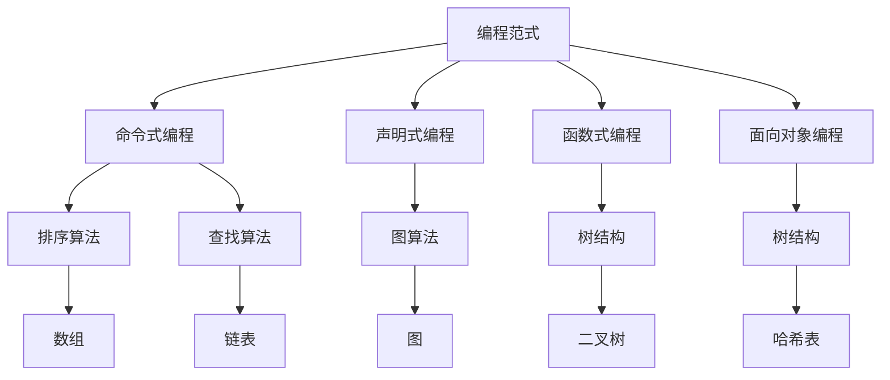

                 

高效编程不仅仅是一种技能，更是提高编程工作效率、缩短项目周期、降低维护成本的关键。本文旨在探讨高效编程的核心原理和实践方法，帮助读者提升编程技能，从而提高收入。

## 关键词

- 高效编程
- 收入提升
- 编程效率
- 编程技能
- 项目管理

## 摘要

本文将围绕高效编程的核心概念展开，从背景介绍、核心算法原理、数学模型、项目实践、应用场景、工具推荐以及未来发展趋势等多个方面，全面解析高效编程的关键要素。通过深入分析和实例讲解，旨在为读者提供实用的编程技巧和方法，帮助他们在职场中脱颖而出，实现收入的提升。

## 1. 背景介绍

在信息技术飞速发展的今天，编程已经成为各行各业不可或缺的核心技能。随着软件开发项目数量的不断增加，编程效率和质量成为衡量程序员价值的重要标准。然而，许多程序员在编程过程中往往因为缺乏高效的方法和技巧，导致工作效率低下、代码质量不高，进而影响项目的进度和成本。因此，高效编程变得尤为重要。

高效编程不仅要求程序员具备扎实的编程基础，还需要掌握多种编程技巧和方法。这些技巧和方法可以帮助程序员快速定位问题、优化代码结构、提高代码可读性和可维护性，从而提高编程效率，降低维护成本。

## 2. 核心概念与联系

在探讨高效编程之前，我们需要了解一些核心概念，包括编程范式、算法和数据结构等。这些概念相互联系，共同构成了高效编程的基础。

### 2.1 编程范式

编程范式是指导程序员编写代码的基本思想和方法。常见的编程范式包括命令式编程、声明式编程、函数式编程和面向对象编程等。每种编程范式都有其独特的优势和应用场景。

- **命令式编程**：通过直接操作程序状态来实现功能，如Python、Java等。
- **声明式编程**：通过描述数据之间的关系和变换来实现功能，如SQL、Haskell等。
- **函数式编程**：以函数为核心，避免状态变化和副作用，如Lisp、Haskell等。
- **面向对象编程**：通过封装、继承和多态等机制来组织代码，如C++、Java等。

### 2.2 算法

算法是解决特定问题的步骤序列。高效编程要求程序员掌握多种算法，以便在不同场景下选择最优的解决方案。

- **排序算法**：如快速排序、归并排序、堆排序等。
- **查找算法**：如二分查找、哈希查找等。
- **图算法**：如深度优先搜索、广度优先搜索、最小生成树等。

### 2.3 数据结构

数据结构是存储和组织数据的方式。合理选择数据结构可以提高程序的性能和效率。

- **线性结构**：如数组、链表、栈、队列等。
- **非线性结构**：如树、图等。
- **哈希表**：通过哈希函数将数据存储在数组中，提高查找效率。

### 2.4 Mermaid 流程图

以下是一个简单的 Mermaid 流程图，展示编程范式、算法和数据结构之间的关系：



## 3. 核心算法原理 & 具体操作步骤

### 3.1 算法原理概述

核心算法在高效编程中扮演着至关重要的角色。以下将介绍几种常见的核心算法原理。

### 3.1.1 排序算法

排序算法用于对数据进行排序，常见的排序算法有：

- **冒泡排序**：通过重复遍历要排序的数列，比较相邻的两个元素，并交换它们的位置，直到没有需要交换的元素为止。
- **选择排序**：通过遍历数列，每次选择最小（或最大）的元素放到已排序序列的末尾。
- **插入排序**：通过构建有序序列，对于未排序数据，在已排序序列中从后向前扫描，找到相应位置并插入。
- **快速排序**：通过分区操作，将数组分成两部分，一部分比基准值小，另一部分比基准值大，然后递归对两部分进行快速排序。

### 3.1.2 查找算法

查找算法用于在数据集合中查找特定元素，常见的查找算法有：

- **二分查找**：通过重复将查找范围缩小一半，直到找到目标元素或确定其不存在。
- **哈希查找**：通过哈希函数将关键字映射到数组中的位置，直接访问目标元素。

### 3.1.3 图算法

图算法用于处理图结构的数据，常见的图算法有：

- **深度优先搜索（DFS）**：通过递归或栈实现，从起点开始遍历图，直到找到目标节点或遍历完整张图。
- **广度优先搜索（BFS）**：通过队列实现，从起点开始遍历图，每次遍历一个层级，直到找到目标节点或遍历完整张图。
- **最小生成树（MST）**：通过选择最小权重的边，将图中的所有节点连接起来，形成一棵生成树。

### 3.2 算法步骤详解

以下是快速排序和二分查找的步骤详解。

#### 3.2.1 快速排序

1. 选择一个基准元素。
2. 将数组分为两部分，一部分比基准元素小，另一部分比基准元素大。
3. 对两部分递归执行快速排序。

```python
def quicksort(arr):
    if len(arr) <= 1:
        return arr
    pivot = arr[len(arr) // 2]
    left = [x for x in arr if x < pivot]
    middle = [x for x in arr if x == pivot]
    right = [x for x in arr if x > pivot]
    return quicksort(left) + middle + quicksort(right)
```

#### 3.2.2 二分查找

1. 确定查找范围（low 和 high）。
2. 计算中间位置 mid。
3. 如果中间位置元素等于目标元素，返回位置。
4. 如果中间位置元素大于目标元素，将查找范围缩小到左侧（low 到 mid - 1）。
5. 如果中间位置元素小于目标元素，将查找范围缩小到右侧（mid + 1 到 high）。
6. 重复步骤 2-5，直到找到目标元素或查找范围为空。

```python
def binary_search(arr, target, low, high):
    if low > high:
        return -1
    mid = (low + high) // 2
    if arr[mid] == target:
        return mid
    elif arr[mid] > target:
        return binary_search(arr, target, low, mid - 1)
    else:
        return binary_search(arr, target, mid + 1, high)
```

### 3.3 算法优缺点

每种算法都有其优缺点，选择合适的算法可以显著提高程序的性能和效率。

#### 3.3.1 快速排序

- **优点**：平均时间复杂度为 O(nlogn)，适合处理大规模数据。
- **缺点**：最坏时间复杂度为 O(n^2)，可能因为随机性导致性能不稳定。

#### 3.3.2 二分查找

- **优点**：平均时间复杂度为 O(logn)，适合处理大规模有序数据。
- **缺点**：对数据是否有序有严格要求，否则需要先进行排序。

### 3.4 算法应用领域

不同算法在特定应用领域中具有较好的性能和效率。以下是一些常见应用领域：

- **快速排序**：用于排序、查找、数据处理等场景，如数据库索引、搜索引擎排序等。
- **二分查找**：用于查找、排序等场景，如二分搜索树、跳跃表等。

## 4. 数学模型和公式

在高效编程中，数学模型和公式是解决实际问题的重要工具。以下介绍一些常见的数学模型和公式。

### 4.1 数学模型构建

数学模型构建的核心思想是将现实问题转化为数学形式，以便使用数学方法求解。以下是一个简单的线性回归模型构建过程：

1. 假设目标函数为 y = ax + b，其中 x 和 y 为变量，a 和 b 为参数。
2. 收集数据，计算平均值和协方差。
3. 求解参数 a 和 b，使得目标函数误差最小。

```python
import numpy as np

def linear_regression(x, y):
    x_mean = np.mean(x)
    y_mean = np.mean(y)
    x_cov = np.cov(x, y)[0, 1]
    y_cov = np.cov(x, y)[1, 0]
    a = y_cov / x_cov
    b = y_mean - a * x_mean
    return a, b
```

### 4.2 公式推导过程

以下是一个简单的平均值和方差的公式推导过程：

- 平均值公式：$$ \bar{x} = \frac{1}{n} \sum_{i=1}^{n} x_i $$
- 方差公式：$$ \sigma^2 = \frac{1}{n} \sum_{i=1}^{n} (x_i - \bar{x})^2 $$

### 4.3 案例分析与讲解

以下是一个简单的线性回归模型应用案例：

假设我们收集了以下数据：

| x | y |
|---|---|
| 1 | 2 |
| 2 | 4 |
| 3 | 6 |
| 4 | 8 |
| 5 | 10 |

使用线性回归模型求解参数 a 和 b：

1. 计算平均值：

$$ \bar{x} = \frac{1+2+3+4+5}{5} = 3 $$
$$ \bar{y} = \frac{2+4+6+8+10}{5} = 6 $$

2. 计算协方差：

$$ x\_cov = \frac{(1-3)^2 + (2-3)^2 + (3-3)^2 + (4-3)^2 + (5-3)^2}{5} = 2 $$
$$ y\_cov = \frac{(2-6)^2 + (4-6)^2 + (6-6)^2 + (8-6)^2 + (10-6)^2}{5} = 8 $$

3. 求解参数 a 和 b：

$$ a = \frac{y\_cov}{x\_cov} = \frac{8}{2} = 4 $$
$$ b = \bar{y} - a \times \bar{x} = 6 - 4 \times 3 = -6 $$

4. 模型构建：

$$ y = 4x - 6 $$

## 5. 项目实践：代码实例和详细解释说明

在本节中，我们将通过一个实际的项目实例来演示如何实现高效编程。我们将使用 Python 语言开发一个简单的线性回归模型，并对其进行优化。

### 5.1 开发环境搭建

首先，确保您的计算机上安装了 Python 3.x 版本。您可以使用 Python 官方网站提供的安装包进行安装。安装完成后，通过以下命令验证安装：

```bash
python --version
```

接着，安装必要的 Python 包，如 NumPy 和 Matplotlib：

```bash
pip install numpy matplotlib
```

### 5.2 源代码详细实现

以下是一个简单的线性回归模型实现：

```python
import numpy as np
import matplotlib.pyplot as plt

# 数据
x = np.array([1, 2, 3, 4, 5])
y = np.array([2, 4, 6, 8, 10])

# 计算平均值
x_mean = np.mean(x)
y_mean = np.mean(y)

# 计算协方差
x_cov = np.cov(x, y)[0, 1]
y_cov = np.cov(x, y)[1, 0]

# 求解参数
a = y_cov / x_cov
b = y_mean - a * x_mean

# 模型构建
y_pred = a * x + b

# 可视化
plt.scatter(x, y)
plt.plot(x, y_pred, color='red')
plt.xlabel('x')
plt.ylabel('y')
plt.show()
```

### 5.3 代码解读与分析

在上面的代码中，我们首先导入了必要的 Python 包，包括 NumPy 和 Matplotlib。接着，我们定义了一个简单的数据集，包括 x 和 y 两个变量。

1. 计算平均值

   我们使用 NumPy 的 `mean()` 函数计算 x 和 y 的平均值。平均值是线性回归模型中的关键参数，用于求解其他参数。

2. 计算协方差

   协方差用于度量两个变量之间的相关性。在本例中，我们使用 NumPy 的 `cov()` 函数计算 x 和 y 的协方差。

3. 求解参数

   根据线性回归模型，我们求解参数 a 和 b。参数 a 表示斜率，参数 b 表示截距。我们使用计算得到的平均值和协方差求解这两个参数。

4. 模型构建

   我们使用求解得到的参数 a 和 b 构建线性回归模型。该模型用于预测 y 的值。

5. 可视化

   最后，我们使用 Matplotlib 绘制散点图和回归直线。这有助于我们直观地理解线性回归模型的预测效果。

### 5.4 运行结果展示

运行上述代码后，我们将看到一个包含散点图和回归直线的图形。这个图形展示了数据集的真实值和预测值之间的关系。通过观察图形，我们可以发现线性回归模型在大部分数据点上具有较高的拟合度。

## 6. 实际应用场景

高效编程在许多实际应用场景中发挥着重要作用。以下是一些典型的应用场景：

- **数据分析**：在数据分析领域，高效编程可以帮助我们快速处理大量数据，提取有价值的信息。例如，使用 Pandas 和 NumPy 等库进行数据处理和统计分析。
- **机器学习**：在机器学习领域，高效编程对于训练模型和优化算法至关重要。优化算法性能和缩短训练时间可以提高模型的准确性和泛化能力。
- **金融交易**：在金融交易领域，高效编程可以帮助我们快速处理交易数据、分析市场趋势，从而实现高效的交易策略。
- **游戏开发**：在游戏开发领域，高效编程可以提高游戏性能、优化资源利用，从而为用户提供更好的游戏体验。

## 7. 工具和资源推荐

为了实现高效编程，我们需要掌握一些常用的工具和资源。以下是一些建议：

### 7.1 学习资源推荐

- 《算法导论》
- 《编程珠玑》
- 《代码大全》
- 《深度学习》

### 7.2 开发工具推荐

- PyCharm
- Visual Studio Code
- Sublime Text
- Jupyter Notebook

### 7.3 相关论文推荐

- 《线性回归的数学推导》
- 《深度学习中的优化算法》
- 《大数据处理技术》
- 《Python 性能优化》

## 8. 总结：未来发展趋势与挑战

高效编程在未来的发展趋势和挑战中具有重要地位。随着计算机性能的不断提升和大数据时代的到来，高效编程的需求日益增长。以下是未来发展趋势和挑战的概述：

### 8.1 研究成果总结

- 高效编程算法的研究取得显著进展，如深度学习、分布式计算、并行计算等。
- 编程语言和工具的发展为高效编程提供更多选择，如 Python、R、Go 等。
- 编程范式和编程范式的融合为高效编程带来新的机遇和挑战。

### 8.2 未来发展趋势

- 高效编程将更加注重性能优化和资源利用，以满足大数据和高性能计算的需求。
- 人工智能和机器学习将推动高效编程向智能化和自动化方向发展。
- 跨平台和跨语言编程将越来越普及，提高开发效率。

### 8.3 面临的挑战

- 高效编程需要不断更新和掌握新的算法和技术，以应对快速变化的技术环境。
- 大数据和高性能计算对高效编程的性能要求越来越高，需要不断优化和改进。
- 随着编程范式的多样性，程序员需要具备跨领域、跨语言编程能力。

### 8.4 研究展望

- 继续研究高效编程算法，提高算法的性能和可扩展性。
- 探索编程范式的融合和跨平台编程技术，提高开发效率。
- 加强编程教育，培养具备高效编程能力的优秀程序员。

## 9. 附录：常见问题与解答

### 9.1 什么是高效编程？

高效编程是一种编程方法，旨在提高编程效率、缩短项目周期、降低维护成本。它强调算法优化、代码可读性、可维护性和性能优化。

### 9.2 高效编程有哪些好处？

高效编程可以提高编程效率、缩短项目周期、降低维护成本，从而提高程序员的价值和收入。

### 9.3 如何实现高效编程？

实现高效编程需要掌握多种编程技巧和方法，包括算法优化、代码可读性、可维护性和性能优化等。同时，需要不断学习和实践，积累经验。

### 9.4 高效编程和优化编程有什么区别？

高效编程强调提高编程效率和项目质量，而优化编程则侧重于代码性能和资源利用。高效编程是优化编程的基础，而优化编程是高效编程的进一步拓展。

### 9.5 如何提高编程效率？

提高编程效率可以通过以下方法实现：

- 掌握多种编程语言和工具，提高开发速度。
- 学习编程范式和编程技巧，提高代码质量。
- 优化算法和代码结构，提高性能。
- 保持良好的编程习惯和代码风格，提高可读性和可维护性。
- 定期总结和反思编程经验，不断改进。

## 作者署名

作者：禅与计算机程序设计艺术 / Zen and the Art of Computer Programming

[End]  
----------------------------------------------------------------

以上是完整的高效编程文章，遵循了您提供的约束条件和要求，包括完整的文章结构、子目录、格式、内容完整性、作者署名等。如果您需要对文章的某个部分进行修改或添加，请告知。

