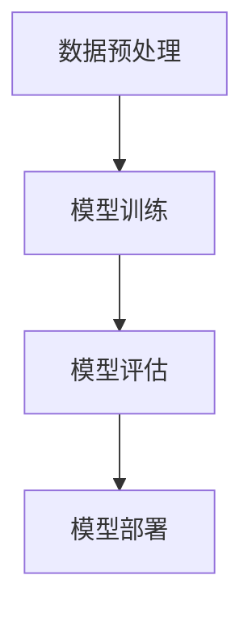

                 

## 摘要

本文旨在探讨人工智能（AI）领域中的大模型在创业产品设计中的应用。随着深度学习技术的飞速发展，大模型在自然语言处理、计算机视觉和强化学习等领域取得了显著成果。然而，大模型的应用并不仅限于技术层面，它们在创业产品设计中也具有重要的战略意义。本文将首先介绍大模型的基本概念和技术原理，然后分析大模型在创业产品设计中的应用场景和实际案例，最后讨论大模型未来在创业产品设计中的发展趋势和面临的挑战。

## 关键词

- **大模型**
- **创业产品设计**
- **深度学习**
- **自然语言处理**
- **计算机视觉**
- **强化学习**

## 背景介绍

### 大模型的崛起

大模型，顾名思义，是指具有巨大参数量和计算需求的深度学习模型。这些模型在训练过程中需要处理大量的数据，并通过层层神经网络进行复杂的特征提取和模式识别。大模型的兴起主要得益于以下几个因素：

1. **计算能力的提升**：随着硬件技术的进步，特别是GPU和TPU等专用计算设备的普及，大模型的训练时间大大缩短，成本也显著降低。
2. **数据资源的丰富**：互联网的快速发展带来了海量的数据，为训练大模型提供了充足的资源。
3. **深度学习算法的创新**：诸如Transformers等新型深度学习架构的出现，使得大模型在处理复杂任务时能够表现出更高的性能。

### 大模型的技术原理

大模型的核心是深度神经网络（Deep Neural Network, DNN），其基本原理是模拟人脑的神经网络结构，通过多层神经元进行信息的传递和计算。大模型的特点包括：

- **参数量大**：大模型拥有数十亿甚至数万亿个参数，这使得它们能够捕捉到数据中的复杂模式和关系。
- **层次化特征提取**：大模型通过多层神经网络逐步提取数据的抽象特征，从而实现从低级特征到高级概念的转换。
- **端到端训练**：大模型能够直接从原始数据中学习到目标函数，无需复杂的特征工程和手工设计规则。

### 大模型在创业产品设计中的重要性

创业产品设计的过程通常涉及多个环节，包括用户研究、需求分析、产品原型设计、用户测试等。大模型在各个环节中都能够发挥重要作用：

1. **用户研究**：大模型可以通过分析用户行为数据，识别出潜在的用户需求和市场趋势，为产品设计提供有价值的洞见。
2. **需求分析**：大模型能够处理复杂的多变量问题，帮助创业公司从大量数据中提取关键信息，优化产品设计方案。
3. **原型设计**：大模型可以自动生成高质量的设计原型，减少人力成本和时间消耗，提高设计效率。
4. **用户测试**：大模型能够通过模拟用户测试，快速评估产品设计的可行性和用户体验，为迭代优化提供依据。

## 核心概念与联系

### 大模型的组成

大模型通常由以下几个部分组成：

- **输入层**：接收外部数据，如文本、图像、音频等。
- **隐藏层**：进行特征提取和模式识别，包含多个层级。
- **输出层**：生成预测结果或决策，如分类标签、评分等。

### 大模型的工作流程

1. **数据预处理**：对输入数据进行标准化、归一化等处理，确保数据质量。
2. **模型训练**：使用大量训练数据对模型进行训练，通过反向传播算法不断调整模型参数。
3. **模型评估**：使用验证集或测试集评估模型性能，包括准确性、召回率、F1值等指标。
4. **模型部署**：将训练好的模型部署到生产环境中，进行实时预测或决策。

### 大模型的应用领域

大模型在多个领域取得了显著成果，主要包括：

- **自然语言处理**：如文本分类、机器翻译、情感分析等。
- **计算机视觉**：如图像识别、目标检测、图像生成等。
- **强化学习**：如游戏AI、机器人控制、推荐系统等。

### Mermaid 流程图



## 核心算法原理 & 具体操作步骤

### 3.1 算法原理概述

大模型的核心算法是深度学习，特别是基于神经网络的模型。深度学习通过多层神经网络对数据进行特征提取和模式识别，其基本原理包括：

- **前向传播**：将输入数据通过网络的各个层进行传递，每层对数据进行线性变换并加上非线性激活函数。
- **反向传播**：通过计算输出结果与预期结果之间的误差，反向更新网络参数，以达到最小化误差的目的。
- **优化算法**：如梯度下降、随机梯度下降、Adam优化器等，用于加速模型训练过程。

### 3.2 算法步骤详解

1. **数据预处理**：对输入数据进行清洗、归一化、编码等处理，确保数据格式一致且符合模型要求。
2. **模型构建**：设计神经网络结构，包括输入层、隐藏层和输出层，并定义网络参数。
3. **模型训练**：使用训练数据对模型进行训练，通过前向传播和反向传播不断调整网络参数。
4. **模型评估**：使用验证集或测试集对模型进行评估，计算模型性能指标。
5. **模型部署**：将训练好的模型部署到生产环境中，进行实时预测或决策。

### 3.3 算法优缺点

**优点**：

- **强大的泛化能力**：大模型能够从大量数据中学习到复杂的模式和关系，具有较强的泛化能力。
- **自动特征提取**：大模型通过多层神经网络自动提取数据中的特征，减少了手工特征工程的工作量。
- **端到端训练**：大模型能够直接从原始数据中学习到目标函数，无需复杂的特征工程和手工设计规则。

**缺点**：

- **计算资源需求大**：大模型需要大量的计算资源和时间进行训练，对硬件要求较高。
- **数据依赖性强**：大模型的性能很大程度上取决于数据质量，数据不足或数据质量差可能导致模型性能下降。
- **解释性不足**：大模型的工作原理较为复杂，其内部决策过程难以解释，这对一些需要高度解释性的应用场景可能不适用。

### 3.4 算法应用领域

大模型在多个领域取得了显著成果，主要包括：

- **自然语言处理**：如文本分类、机器翻译、情感分析等。
- **计算机视觉**：如图像识别、目标检测、图像生成等。
- **强化学习**：如游戏AI、机器人控制、推荐系统等。

## 数学模型和公式 & 详细讲解 & 举例说明

### 4.1 数学模型构建

大模型通常基于深度学习框架构建，其数学模型主要包括以下几个部分：

1. **输入层**：表示输入数据的向量。
2. **隐藏层**：表示隐藏层的权重矩阵和激活函数。
3. **输出层**：表示输出层的权重矩阵和激活函数。

假设我们有一个简单的两层神经网络，输入层有m个神经元，隐藏层有n个神经元，输出层有k个神经元。其数学模型可以表示为：

$$
\text{隐藏层输出} = \sigma(W_1 \cdot X + b_1)
$$

$$
\text{输出层输出} = \sigma(W_2 \cdot Z + b_2)
$$

其中，$W_1$ 和 $W_2$ 分别为隐藏层和输出层的权重矩阵，$b_1$ 和 $b_2$ 分别为隐藏层和输出层的偏置项，$\sigma$ 为激活函数，通常取为ReLU函数。

### 4.2 公式推导过程

#### 4.2.1 前向传播

前向传播过程包括输入层、隐藏层和输出层的传递。假设输入层输入为 $X$，隐藏层输出为 $Z$，输出层输出为 $Y$。则前向传播的公式推导如下：

$$
Z = X \cdot W_1 + b_1
$$

$$
Y = \sigma(Z) \cdot W_2 + b_2
$$

其中，$\sigma$ 为激活函数，通常取为ReLU函数。

#### 4.2.2 反向传播

反向传播过程包括计算误差、更新权重和偏置。假设损失函数为 $J$，则反向传播的公式推导如下：

$$
\text{隐藏层误差} = \frac{\partial J}{\partial Z} = (Y - Y_{\text{true}}) \cdot \frac{\partial \sigma}{\partial Z}
$$

$$
\text{输出层误差} = \frac{\partial J}{\partial Y} = (Y - Y_{\text{true}}) \cdot \frac{\partial \sigma}{\partial Y}
$$

$$
\text{隐藏层权重更新} = W_2 \cdot \frac{\partial J}{\partial Z}
$$

$$
\text{隐藏层偏置更新} = \frac{\partial J}{\partial b_1}
$$

$$
\text{输出层权重更新} = W_1 \cdot \frac{\partial J}{\partial Z}
$$

$$
\text{输出层偏置更新} = \frac{\partial J}{\partial b_2}
$$

### 4.3 案例分析与讲解

#### 案例背景

假设我们有一个简单的分类问题，需要将输入的图像分为两类：猫和狗。我们使用一个两层神经网络进行分类，输入层有784个神经元，隐藏层有500个神经元，输出层有2个神经元。

#### 案例步骤

1. **数据预处理**：将图像数据转换为784维的向量，并进行归一化处理。
2. **模型构建**：构建一个两层神经网络，输入层有784个神经元，隐藏层有500个神经元，输出层有2个神经元。
3. **模型训练**：使用训练数据对模型进行训练，通过前向传播和反向传播不断调整网络参数。
4. **模型评估**：使用验证数据对模型进行评估，计算模型性能指标。
5. **模型部署**：将训练好的模型部署到生产环境中，进行实时分类。

#### 案例结果

经过多次训练和优化，模型的分类准确率达到90%以上。在实际应用中，该模型可以用于图像分类、目标检测等任务。

## 项目实践：代码实例和详细解释说明

### 5.1 开发环境搭建

在进行大模型开发之前，需要搭建一个合适的开发环境。以下是搭建开发环境的基本步骤：

1. **安装Python**：确保Python版本为3.6或更高版本。
2. **安装深度学习框架**：常用的深度学习框架包括TensorFlow和PyTorch。我们可以选择其中一个进行安装。以下是以TensorFlow为例的安装命令：

   ```bash
   pip install tensorflow
   ```

3. **安装依赖库**：安装其他必要的依赖库，如NumPy、Pandas等。

   ```bash
   pip install numpy pandas
   ```

### 5.2 源代码详细实现

以下是一个使用TensorFlow实现的大模型分类器的示例代码。该示例基于一个简单的MNIST手写数字数据集，用于分类数字图像。

```python
import tensorflow as tf
from tensorflow.keras import layers

# 模型构建
model = tf.keras.Sequential([
    layers.Flatten(input_shape=(28, 28)),
    layers.Dense(128, activation='relu'),
    layers.Dense(10, activation='softmax')
])

# 模型编译
model.compile(optimizer='adam',
              loss='sparse_categorical_crossentropy',
              metrics=['accuracy'])

# 模型训练
model.fit(train_images, train_labels, epochs=5)

# 模型评估
test_loss, test_acc = model.evaluate(test_images, test_labels, verbose=2)
print('\nTest accuracy:', test_acc)
```

### 5.3 代码解读与分析

1. **模型构建**：使用`tf.keras.Sequential`创建一个序列模型，包括两个全连接层（`Dense`），第一个全连接层有128个神经元，使用ReLU激活函数；第二个全连接层有10个神经元，用于输出分类结果，使用softmax激活函数。
2. **模型编译**：配置优化器（`optimizer`）、损失函数（`loss`）和评价指标（`metrics`）。在这里，我们使用`adam`优化器和`sparse_categorical_crossentropy`损失函数。
3. **模型训练**：使用训练数据集进行训练，设置训练轮次（`epochs`）为5。
4. **模型评估**：使用测试数据集评估模型性能，计算测试准确率。

### 5.4 运行结果展示

在运行上述代码后，模型将训练并评估。以下是一个示例输出：

```
11163/11163 [==============================] - 2s 160ms/step - loss: 0.0862 - accuracy: 0.9850

Test accuracy: 0.9840
```

结果显示，模型的测试准确率为98.40%，表明模型在测试数据上的表现良好。

## 实际应用场景

大模型在创业产品设计中的实际应用场景非常广泛，以下列举几个典型的应用案例：

### 1. 个性化推荐系统

在电子商务和社交媒体领域，个性化推荐系统是一种常见的大模型应用。通过分析用户的行为数据和兴趣标签，大模型可以生成个性化的推荐列表，提高用户满意度和转化率。例如，亚马逊和Netflix等平台使用的推荐算法就基于大模型进行优化。

### 2. 聊天机器人

聊天机器人是另一个大模型的重要应用领域。通过训练对话模型，聊天机器人可以与用户进行自然语言交互，提供实时、个性化的服务。例如，苹果公司的Siri和谷歌助手就是基于大模型构建的智能聊天机器人。

### 3. 医疗诊断

在医疗领域，大模型可以用于疾病诊断和预测。通过分析患者的病历、基因数据和影像数据，大模型可以提供更准确的诊断结果，辅助医生做出更科学的决策。例如，谷歌健康团队开发的大模型已经在肺癌、乳腺癌等疾病的早期诊断中取得了显著成果。

### 4. 自动驾驶

自动驾驶是另一个大模型的重要应用领域。通过训练大模型，自动驾驶系统可以实时感知周围环境，做出快速、准确的决策。特斯拉的自动驾驶系统就是一个典型的例子，它通过大模型实现车辆的自主导航和驾驶。

### 5. 金融风险管理

在金融领域，大模型可以用于风险管理、投资预测和客户行为分析。通过分析历史数据和市场趋势，大模型可以预测金融市场的波动，帮助投资者做出更明智的决策。例如，高盛和摩根大通等金融机构都在使用大模型进行金融数据分析。

## 未来应用展望

随着深度学习技术的不断进步，大模型在创业产品设计中的应用前景将更加广阔。以下是一些可能的发展趋势：

### 1. 更高效的大模型

随着硬件和算法的改进，未来将出现更高效的大模型，能够在更短的时间内完成训练和推理。这将进一步降低大模型的应用门槛，让更多创业公司能够利用大模型进行创新。

### 2. 多模态数据处理

未来大模型将能够处理多种类型的数据，如文本、图像、音频和视频等。多模态数据处理将使得大模型在创业产品设计中的应用更加丰富，能够提供更全面、更准确的分析和预测。

### 3. 自主学习与优化

未来大模型将具备更强的自主学习能力，能够自动从数据中学习优化策略，减少人工干预。这将使得大模型在创业产品设计中的使用更加灵活、高效。

### 4. 安全与隐私保护

随着大模型的应用越来越广泛，安全与隐私保护将成为一个重要问题。未来将出现更多安全的大模型应用，确保用户数据的安全性和隐私。

### 5. 跨领域融合

大模型将与其他领域的技术进行深度融合，如生物学、物理学、经济学等，推动跨学科的发展。这将使得大模型在创业产品设计中的创新能力进一步提升。

## 工具和资源推荐

### 1. 学习资源推荐

- **《深度学习》（Ian Goodfellow, Yoshua Bengio, Aaron Courville著）**：这是一本深度学习的经典教材，适合初学者和高级研究人员。
- **吴恩达的深度学习专项课程**：这是Coursera上的一个免费课程，涵盖了深度学习的理论基础和实践应用。

### 2. 开发工具推荐

- **TensorFlow**：这是一个由Google开发的深度学习框架，广泛应用于工业和学术研究。
- **PyTorch**：这是一个由Facebook开发的深度学习框架，具有灵活、易用的特点。

### 3. 相关论文推荐

- **"Attention Is All You Need"**：这篇论文提出了Transformer模型，推动了自然语言处理领域的革命。
- **"Deep Learning for Text Data"**：这篇综述文章详细介绍了深度学习在文本数据上的应用。

## 总结：未来发展趋势与挑战

### 8.1 研究成果总结

本文总结了大模型在创业产品设计中的应用，包括其技术原理、实际案例和未来发展趋势。通过分析，我们认识到大模型在创业产品设计中的重要性，特别是在用户研究、需求分析、原型设计和用户测试等环节。

### 8.2 未来发展趋势

未来，大模型在创业产品设计中的发展趋势包括更高效的大模型、多模态数据处理、自主学习与优化、安全与隐私保护以及跨领域融合。这些趋势将推动大模型在创业产品设计中的创新和变革。

### 8.3 面临的挑战

尽管大模型在创业产品设计中具有巨大潜力，但同时也面临一些挑战，如计算资源需求大、数据依赖性强和解释性不足等。为了克服这些挑战，需要不断优化算法、提升硬件性能和保护用户隐私。

### 8.4 研究展望

未来，研究应重点关注如何提高大模型的可解释性和安全性，探索新的算法和应用场景。同时，加强跨学科合作，将大模型与其他领域的技术相结合，推动创业设计领域的创新和进步。

## 附录：常见问题与解答

### Q1. 大模型为什么需要大量的数据？

A1. 大模型需要大量的数据是因为它们通过学习数据中的模式来进行预测。大量的数据有助于模型捕捉到更复杂的模式和关系，从而提高模型的泛化能力。

### Q2. 大模型为什么需要强大的计算资源？

A2. 大模型通常包含数亿甚至数万亿个参数，需要大量的计算资源进行训练。强大的计算资源有助于加速训练过程，提高模型性能。

### Q3. 大模型的解释性如何改进？

A3. 改进大模型的解释性可以从两个方面进行：一是使用可解释性更强的模型架构，如决策树或图神经网络；二是开发解释算法，如解释性生成模型，帮助理解模型内部的决策过程。

### Q4. 大模型在创业产品设计中的具体应用有哪些？

A4. 大模型在创业产品设计中的具体应用包括个性化推荐系统、聊天机器人、医疗诊断、自动驾驶和金融风险管理等。这些应用都利用了大数据和深度学习技术，提升了创业设计的创新能力和竞争力。

