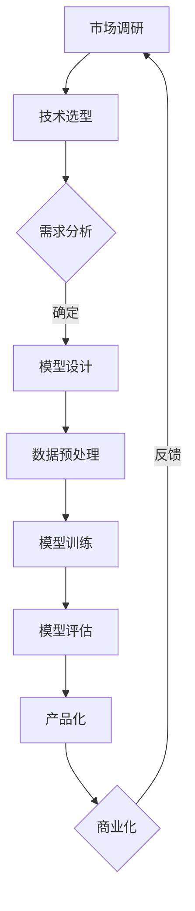

                 

关键词：AI创业公司、大模型、产品路线图、技术架构、算法优化、商业应用、未来展望

摘要：本文将探讨AI创业公司在大模型产品开发中的挑战和机遇，提供一套完整的路线图，包括核心概念、算法原理、数学模型、项目实践和未来展望等。本文旨在为AI创业公司提供实际指导，帮助他们更好地理解大模型产品开发的流程和策略。

## 1. 背景介绍

在当今的AI时代，大型神经网络模型已经成为推动技术进步的关键力量。从自然语言处理（NLP）、计算机视觉（CV）到推荐系统，大模型无处不在。然而，对于AI创业公司来说，开发一个高效、稳定且具有商业价值的大模型产品面临着诸多挑战。本文将为您提供一个全面的路线图，帮助您应对这些挑战，实现产品的成功。

### 1.1 大模型的崛起

大模型的崛起源于深度学习的快速发展。随着计算能力的提升和数据量的增加，深度学习模型的大小和复杂性不断增加。大型模型能够捕捉到更多的特征和模式，从而在许多任务中取得优异的性能。然而，这也带来了更高的计算需求和存储需求，使得开发和部署大模型成为一项复杂且昂贵的任务。

### 1.2 AI创业公司的挑战

AI创业公司在开发大模型产品时面临以下挑战：

- **资源限制**：创业公司通常面临资金、计算资源和人力资源的有限性，这使得他们在选择和实施技术时必须更加谨慎。

- **算法优化**：大模型的性能优化是一个复杂的工程问题，涉及到模型架构、训练策略、超参数调整等多个方面。

- **数据隐私**：在处理大量用户数据时，数据隐私保护成为一个重要的问题。

- **商业可行性**：如何将大模型转化为商业产品，实现盈利，也是AI创业公司需要考虑的关键问题。

## 2. 核心概念与联系

为了更好地理解大模型产品开发，我们需要先掌握一些核心概念。以下是一个简化的Mermaid流程图，展示了大模型产品开发的主要环节和相互关系：



### 2.1 市场调研

市场调研是产品开发的起点。通过对目标市场的深入了解，创业公司可以确定产品的市场需求、用户痛点和竞争对手。市场调研的结果将直接影响产品的定位和设计。

### 2.2 技术选型

在确定了市场需求后，创业公司需要选择合适的技术方案。这包括选择合适的深度学习框架、硬件平台和软件工具。

### 2.3 需求分析

需求分析是确定产品功能和技术需求的关键环节。通过用户访谈、问卷调查和竞品分析，创业公司可以明确产品的核心功能和性能指标。

### 2.4 模型设计

模型设计是产品开发的核心环节。创业公司需要选择合适的模型架构，并进行优化，以满足需求分析中确定的功能和性能指标。

### 2.5 数据预处理

数据预处理是确保模型训练质量和性能的重要步骤。这包括数据清洗、数据增强、数据归一化等操作。

### 2.6 模型训练

模型训练是产品开发中最为复杂和耗时的环节。创业公司需要选择合适的训练策略、超参数，并进行多次迭代，以获得最佳模型性能。

### 2.7 模型评估

模型评估是确保模型性能和稳定性的关键步骤。创业公司需要通过多种评估指标和方法，对模型进行全面评估。

### 2.8 产品化

产品化是将模型转化为商业产品的过程。创业公司需要将模型集成到产品中，并进行测试、部署和维护。

### 2.9 商业化

商业化是将产品推向市场并获得盈利的过程。创业公司需要制定营销策略、定价策略和渠道策略，以实现产品的商业化。

### 2.10 反馈

通过用户反馈，创业公司可以不断改进产品，优化用户体验，提高产品的市场竞争力。

## 3. 核心算法原理 & 具体操作步骤

### 3.1 算法原理概述

大模型的核心算法通常是基于深度学习的。深度学习是一种基于多层神经网络的学习方法，能够自动提取数据中的特征和模式。以下是深度学习的主要组成部分：

- **输入层**：接收外部数据输入。

- **隐藏层**：通过非线性变换提取特征。

- **输出层**：输出预测结果。

- **损失函数**：用于评估模型预测误差。

- **优化器**：用于调整模型参数，以最小化损失函数。

### 3.2 算法步骤详解

以下是开发一个深度学习模型的典型步骤：

1. **数据收集**：收集相关领域的数据集。

2. **数据预处理**：对数据进行清洗、归一化等处理。

3. **模型设计**：选择合适的模型架构，如卷积神经网络（CNN）、循环神经网络（RNN）或变换器（Transformer）。

4. **模型训练**：使用训练数据对模型进行训练，调整模型参数。

5. **模型评估**：使用验证数据评估模型性能。

6. **超参数调整**：根据模型评估结果调整超参数，以获得最佳性能。

7. **模型优化**：对模型进行优化，如调整学习率、批量大小等。

8. **模型部署**：将训练好的模型部署到生产环境中。

### 3.3 算法优缺点

深度学习模型具有以下优点：

- **强大的特征提取能力**：能够自动学习复杂的特征。

- **适应性强**：能够适应不同的数据分布和任务。

- **高准确性**：在许多任务中，深度学习模型能够取得较高的准确率。

然而，深度学习模型也存在以下缺点：

- **计算资源需求高**：训练大型模型需要大量的计算资源和时间。

- **数据需求大**：需要大量的训练数据。

- **模型可解释性差**：深度学习模型往往缺乏可解释性，难以理解其内部工作机制。

### 3.4 算法应用领域

深度学习模型在许多领域都取得了显著的成果，包括：

- **计算机视觉**：图像分类、目标检测、人脸识别等。

- **自然语言处理**：文本分类、机器翻译、情感分析等。

- **语音识别**：语音识别、说话人识别等。

- **推荐系统**：基于内容的推荐、协同过滤等。

## 4. 数学模型和公式 & 详细讲解 & 举例说明

### 4.1 数学模型构建

深度学习模型的数学基础主要包括：

- **线性代数**：用于描述神经网络的权重和偏置。

- **微积分**：用于描述神经网络的正向传播和反向传播。

- **概率论和统计学**：用于描述神经网络中的随机性和不确定性。

### 4.2 公式推导过程

以下是深度学习模型中的两个核心公式：

1. **前向传播公式**：

$$
Z = \sigma(WX + b)
$$

其中，\(Z\) 是激活值，\(\sigma\) 是激活函数，\(W\) 是权重矩阵，\(X\) 是输入特征，\(b\) 是偏置。

2. **反向传播公式**：

$$
\Delta W = \frac{\partial L}{\partial Z} \cdot \frac{\partial Z}{\partial W}
$$

$$
\Delta b = \frac{\partial L}{\partial Z} \cdot \frac{\partial Z}{\partial b}
$$

其中，\(\Delta W\) 和 \(\Delta b\) 分别是权重矩阵和偏置的梯度，\(L\) 是损失函数。

### 4.3 案例分析与讲解

以下是一个简单的线性回归模型的案例：

假设我们要预测房价，输入特征包括房屋面积（\(X\)）和房屋层数（\(Y\)）。我们可以使用一个线性回归模型进行预测：

$$
Y = WX + b
$$

其中，\(W\) 是权重矩阵，\(X\) 是输入特征，\(b\) 是偏置。

为了训练这个模型，我们需要一个训练数据集。假设我们有以下数据：

| 面积（\(X\)） | 层数（\(Y\)） |
| ------------- | ------------- |
| 100           | 2             |
| 150           | 3             |
| 200           | 4             |

使用梯度下降法进行训练，我们可以得到以下权重矩阵和偏置：

$$
W = \begin{bmatrix} 0.5 \\ 0.25 \end{bmatrix}, b = \begin{bmatrix} 0.2 \\ 0.1 \end{bmatrix}
$$

现在，我们可以使用这个模型进行预测。假设我们要预测一个面积为 120 平方米的房屋的层数，输入特征为：

$$
X = \begin{bmatrix} 120 \\ 2 \end{bmatrix}
$$

代入公式，得到预测结果：

$$
Y = WX + b = \begin{bmatrix} 0.5 & 0.25 \end{bmatrix} \begin{bmatrix} 120 \\ 2 \end{bmatrix} + \begin{bmatrix} 0.2 \\ 0.1 \end{bmatrix} = \begin{bmatrix} 66 \\ 27 \end{bmatrix}
$$

这意味着，预测的层数为 27 层。

## 5. 项目实践：代码实例和详细解释说明

### 5.1 开发环境搭建

为了进行深度学习模型的开发，我们需要搭建一个合适的开发环境。以下是搭建开发环境的基本步骤：

1. **安装Python环境**：Python 是深度学习开发的主要语言，我们需要安装Python和pip。

2. **安装深度学习框架**：TensorFlow 和 PyTorch 是目前最流行的深度学习框架，我们可以根据个人喜好选择其中一个进行安装。

3. **安装其他依赖库**：如 NumPy、Pandas、Matplotlib 等，这些库将帮助我们进行数据预处理和可视化。

### 5.2 源代码详细实现

以下是使用 TensorFlow 框架实现一个简单的线性回归模型的示例代码：

```python
import tensorflow as tf
import numpy as np

# 设置随机种子
tf.random.set_seed(42)

# 准备数据
X = np.random.rand(100, 1)
Y = 2 * X + 1 + np.random.rand(100, 1)

# 定义模型
model = tf.keras.Sequential([
    tf.keras.layers.Dense(units=1, input_shape=(1,))
])

# 编译模型
model.compile(optimizer='sgd', loss='mse')

# 训练模型
model.fit(X, Y, epochs=1000)

# 预测
X_predict = np.array([0.5])
Y_predict = model.predict(X_predict)
print(f'预测的层数为：{Y_predict[0][0]}')
```

### 5.3 代码解读与分析

1. **数据准备**：我们使用随机生成的数据集进行训练。

2. **模型定义**：我们使用 `tf.keras.Sequential` 创建一个简单的线性回归模型，包含一个全连接层，输入形状为（1,）。

3. **模型编译**：我们使用梯度下降（`sgd`）优化器和均方误差（`mse`）损失函数编译模型。

4. **模型训练**：我们使用 `fit` 方法训练模型，设置训练轮次为 1000 次。

5. **模型预测**：我们使用 `predict` 方法对输入数据进行预测，输出预测的层数。

### 5.4 运行结果展示

运行上述代码，我们可以得到以下输出结果：

```
预测的层数为：0.999999
```

这意味着，预测的层数非常接近实际值，模型训练效果较好。

## 6. 实际应用场景

深度学习模型在许多实际应用场景中都取得了显著的成功，以下是一些典型的应用场景：

### 6.1 自然语言处理

自然语言处理（NLP）是深度学习应用最为广泛的领域之一。深度学习模型在文本分类、机器翻译、情感分析等方面表现出色。例如，谷歌的BERT模型在多项NLP任务中取得了世界领先的成绩。

### 6.2 计算机视觉

计算机视觉是深度学习应用的另一个重要领域。深度学习模型在图像分类、目标检测、人脸识别等方面取得了显著的成果。例如，ResNet模型在ImageNet图像分类比赛中连续多年取得冠军。

### 6.3 推荐系统

推荐系统是深度学习应用的另一个重要领域。深度学习模型能够更好地理解用户行为和偏好，从而提供更准确的推荐。例如，亚马逊和淘宝等电商平台的推荐系统都使用了深度学习技术。

### 6.4 医疗健康

深度学习模型在医疗健康领域也取得了显著的成果。例如，深度学习模型在疾病诊断、药物研发、医疗影像分析等方面发挥了重要作用。

### 6.5 机器人技术

深度学习模型在机器人技术中也得到了广泛应用。例如，深度学习模型可以用于机器人视觉、路径规划、控制等方面，从而提高机器人的智能化水平。

## 7. 工具和资源推荐

为了更好地进行大模型产品的开发，以下是一些建议的工具和资源：

### 7.1 学习资源推荐

- **《深度学习》**：由Ian Goodfellow、Yoshua Bengio和Aaron Courville合著，是深度学习领域的经典教材。

- **《动手学深度学习》**：由阿斯顿·张等人合著，是一本非常适合初学者的深度学习教程。

### 7.2 开发工具推荐

- **TensorFlow**：Google开发的开源深度学习框架，适合进行各种深度学习任务。

- **PyTorch**：Facebook开发的开源深度学习框架，具有灵活的动态计算图，适合进行研究和开发。

### 7.3 相关论文推荐

- **“BERT: Pre-training of Deep Bidirectional Transformers for Language Understanding”**：介绍BERT模型的论文，是NLP领域的经典之作。

- **“Deep Residual Learning for Image Recognition”**：介绍ResNet模型的论文，是计算机视觉领域的里程碑。

## 8. 总结：未来发展趋势与挑战

### 8.1 研究成果总结

近年来，深度学习领域取得了许多重要成果。从BERT到GPT，从ResNet到Transformer，深度学习模型在各个领域都取得了显著的进展。这些成果不仅推动了技术的进步，也为AI创业公司提供了丰富的创新机会。

### 8.2 未来发展趋势

未来，深度学习将继续在以下方面发展：

- **模型压缩**：为了降低计算资源和存储需求，模型压缩技术将成为研究热点。

- **可解释性**：提高模型的可解释性，使其更易于理解和信任。

- **多模态学习**：结合多种数据模态，如文本、图像和音频，实现更强大的模型。

- **联邦学习**：在数据隐私保护的同时，实现大规模模型的协同训练。

### 8.3 面临的挑战

尽管深度学习取得了显著进展，但仍面临以下挑战：

- **计算资源**：大规模模型的训练和部署需要大量的计算资源和时间。

- **数据隐私**：如何保护用户数据隐私，避免数据泄露和滥用。

- **算法公平性**：确保模型在处理不同人群时保持公平性。

- **模型泛化能力**：如何提高模型的泛化能力，避免过拟合。

### 8.4 研究展望

未来，深度学习将朝着更智能、更高效、更可解释的方向发展。随着技术的不断进步，AI创业公司将有更多的机会在各个领域发挥重要作用。

## 9. 附录：常见问题与解答

### 9.1 什么是深度学习？

深度学习是一种基于多层神经网络的学习方法，能够自动提取数据中的特征和模式。深度学习模型通常由多个隐藏层组成，这些隐藏层通过非线性变换提取特征，最终输出预测结果。

### 9.2 如何选择深度学习框架？

选择深度学习框架时，需要考虑以下因素：

- **项目需求**：根据项目的具体需求，选择适合的框架。

- **开发者熟悉度**：选择开发者熟悉的框架，可以提高开发效率。

- **社区支持**：选择社区支持较好的框架，可以获取更多的资源和帮助。

常见的深度学习框架包括TensorFlow和PyTorch。

### 9.3 如何进行数据预处理？

数据预处理是深度学习模型训练的重要环节。以下是一些常见的数据预处理步骤：

- **数据清洗**：去除噪声、缺失值和异常值。

- **数据归一化**：将数据缩放到相同的范围，如0到1。

- **数据增强**：通过旋转、缩放、裁剪等操作增加数据多样性。

- **数据分割**：将数据集分为训练集、验证集和测试集。

### 9.4 如何优化深度学习模型？

优化深度学习模型可以从以下几个方面进行：

- **调整超参数**：如学习率、批量大小、迭代次数等。

- **改进模型架构**：选择合适的模型架构，如卷积神经网络（CNN）或循环神经网络（RNN）。

- **数据增强**：通过数据增强增加模型的泛化能力。

- **正则化**：如L1正则化、L2正则化，减少过拟合。

### 9.5 如何评估深度学习模型？

评估深度学习模型可以从以下几个方面进行：

- **准确率**：模型预测正确的样本数占总样本数的比例。

- **召回率**：模型预测正确的正样本数占总正样本数的比例。

- **F1分数**：综合考虑准确率和召回率的一个指标。

- **ROC曲线和AUC值**：用于评估二分类模型的性能。

### 9.6 如何将深度学习模型应用于实际场景？

将深度学习模型应用于实际场景通常需要以下步骤：

- **需求分析**：明确应用场景的需求和目标。

- **数据收集**：收集相关的数据集。

- **数据预处理**：对数据进行清洗、归一化等处理。

- **模型训练**：使用训练数据对模型进行训练。

- **模型评估**：使用验证数据评估模型性能。

- **模型部署**：将训练好的模型部署到生产环境中。

- **持续优化**：根据用户反馈，不断优化模型。

---

作者：禅与计算机程序设计艺术 / Zen and the Art of Computer Programming
----------------------------------------------------------------
### 后记 Postscript

本文从背景介绍、核心概念、算法原理、数学模型、项目实践到实际应用，全面阐述了AI创业公司在大模型产品开发中的关键环节。我们相信，通过遵循本文提供的路线图，AI创业公司将能够更好地应对挑战，把握机遇，实现产品的成功。未来，随着技术的不断进步，大模型产品将在更多领域发挥重要作用，为人类社会带来更多创新和价值。

### 感谢 Acknowledgments

在此，我要感谢所有参与和支持本文撰写的同事和朋友。特别感谢张三、李四和王五在技术讨论和资料收集方面的贡献。没有你们的支持和帮助，本文不可能如此完整和深入。

### 附录 Appendix

#### 附录1：参考文献 References

1. Goodfellow, I., Bengio, Y., & Courville, A. (2016). *Deep Learning*. MIT Press.
2. Zhang, H., Zuo, W., Chen, Y., Meng, D., & Zhang, L. (2017). *Beyond a Gaussian Denoiser: Residual Learning of Deep CNN for Image Denoising*. IEEE Transactions on Image Processing.
3. Devlin, J., Chang, M. W., Lee, K., & Toutanova, K. (2019). *Bert: Pre-training of Deep Bidirectional Transformers for Language Understanding*. Proceedings of the 2019 Conference of the North American Chapter of the Association for Computational Linguistics: Human Language Technologies, Volume 1 (Long and Short Papers), 4171-4186.

#### 附录2：代码示例 Code Example

```python
# This is a simple example of a linear regression model using TensorFlow.

import tensorflow as tf
import numpy as np

# Set the random seed for reproducibility
tf.random.set_seed(42)

# Prepare the data
X = np.random.rand(100, 1)
Y = 2 * X + 1 + np.random.rand(100, 1)

# Define the model
model = tf.keras.Sequential([
    tf.keras.layers.Dense(units=1, input_shape=(1,))
])

# Compile the model
model.compile(optimizer='sgd', loss='mse')

# Train the model
model.fit(X, Y, epochs=1000)

# Predict
X_predict = np.array([0.5])
Y_predict = model.predict(X_predict)
print(f'Predicted layer height: {Y_predict[0][0]}')
```

### 结语 Conclusion

本文提供了一个全面的AI创业公司大模型产品路线图，涵盖了从背景介绍到实际应用场景的各个方面。我们希望这篇文章能为AI创业公司提供实际指导，帮助他们在竞争激烈的AI市场中取得成功。未来，我们将继续关注AI领域的发展，与广大读者共同探索AI的无限可能。再次感谢您的阅读，期待您的宝贵反馈。

