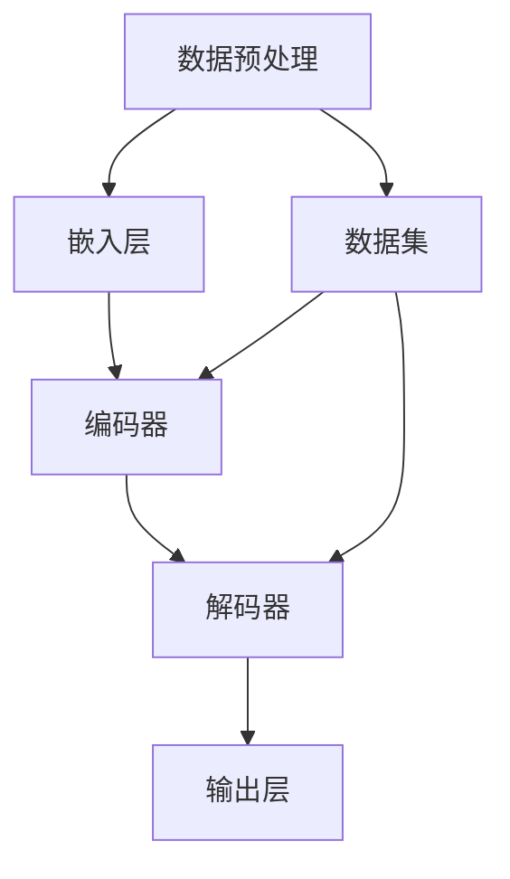

                 

 关键词：AI 创业、大模型、产品路线图、技术策略、市场定位、用户体验、开源与闭源

> 摘要：本文旨在为 AI 创业公司提供一个系统的大模型产品路线图，涵盖了从市场调研到产品发布的各个关键步骤。通过深入探讨核心概念、算法原理、数学模型以及实际应用，本文旨在帮助创业者更好地理解大模型产品的开发流程，并为其提供实用的策略和技巧。

## 1. 背景介绍

在人工智能时代，大模型技术成为推动行业变革的核心动力。随着计算能力的提升和海量数据资源的积累，越来越多的创业公司开始关注如何构建和部署大模型，以实现商业价值。然而，面对复杂的技术和市场环境，如何制定一个有效的大模型产品路线图，成为许多创业公司面临的挑战。

本文将详细讨论以下几个关键主题：

- **市场调研与需求分析**：如何通过市场调研确定目标客户和市场需求。
- **核心概念与联系**：大模型的原理、架构和关键组成部分。
- **算法原理与操作步骤**：大模型的核心算法以及具体实施细节。
- **数学模型与公式**：大模型背后的数学原理和公式推导。
- **项目实践与代码实例**：大模型在真实项目中的实现和应用。
- **实际应用场景**：大模型在不同领域的应用案例。
- **工具和资源推荐**：开发大模型所需的学习资源和工具。
- **未来发展趋势与挑战**：大模型技术的未来方向和面临的挑战。

通过本文的探讨，创业者可以更好地理解大模型产品的开发流程，并在实际操作中应用这些策略和技巧。

### 1.1 市场背景

人工智能市场近年来经历了爆发式增长，其中大模型技术尤为突出。根据市场研究公司的报告，全球人工智能市场规模预计将在未来五年内达到数千亿美元，而大模型技术将在其中占据重要地位。这一趋势吸引了大量创业公司的关注，他们希望通过开发先进的大模型产品，抢占市场先机。

当前，大模型技术已经成为许多行业的核心驱动力，包括但不限于自然语言处理、计算机视觉、推荐系统、基因测序和医疗诊断等。这些领域对大模型的需求日益增长，推动了相关技术的发展和市场的扩展。

### 1.2 创业公司面临的挑战

尽管市场前景广阔，但创业公司在开发大模型产品时仍面临诸多挑战：

- **技术难度**：构建和维护大模型需要高水平的技术能力和大量的资源投入。
- **数据获取**：获取高质量的数据集是开发大模型的关键，但数据获取往往面临隐私、版权和成本等问题。
- **计算资源**：大模型训练和推理需要庞大的计算资源，这对创业公司的财务和运营能力提出了高要求。
- **市场竞争**：市场上已有许多成熟的玩家，创业公司需要找到独特的市场定位和竞争优势。
- **用户需求**：满足用户需求并保持产品灵活性是创业公司成功的关键。

### 1.3 大模型产品路线图的必要性

为了应对上述挑战，创业公司需要一个系统的大模型产品路线图，该路线图应涵盖从市场调研、技术选型到产品发布和推广的各个阶段。一个清晰的产品路线图可以帮助创业者：

- **明确目标**：了解市场需求和用户期望，确定产品发展方向。
- **资源规划**：合理分配资源，确保项目按计划进行。
- **风险控制**：提前识别潜在问题，制定应对策略。
- **市场竞争**：通过不断迭代和优化，保持产品的竞争力和创新性。

接下来，本文将逐步深入探讨大模型产品路线图的各个关键环节，为创业公司提供实用的指导。

## 2. 核心概念与联系

### 2.1 大模型概述

大模型（Large Model）是指具有数亿到数十亿参数的深度学习模型。与传统的中小型模型相比，大模型在处理复杂任务时具有显著的优势，特别是在自然语言处理、图像识别等领域。大模型的典型代表包括 GPT、BERT、ViT 等。

### 2.2 基本架构

大模型通常由以下几个关键组件构成：

1. **数据预处理**：包括数据清洗、数据增强和格式转换等。
2. **嵌入层**：将输入数据（如文本、图像）转化为固定长度的向量。
3. **编码器**：如 Transformer 结构，用于处理序列数据。
4. **解码器**：与编码器对应，用于生成输出序列。
5. **输出层**：根据任务类型，可以是分类器、回归器或生成器等。

### 2.3 关键组成部分

1. **参数量**：大模型的参数量通常在数亿到千亿级别，这是其处理复杂任务的基础。
2. **计算资源**：大模型训练和推理需要大量的计算资源，特别是 GPU 和 TPU 等高性能计算设备。
3. **数据集**：高质量的数据集是训练大模型的关键，数据集的质量直接影响模型的性能和效果。

### 2.4 Mermaid 流程图

以下是一个简化的 Mermaid 流程图，展示了大模型的基本架构：



在 Mermaid 流程图中，节点（如 A、B、C 等）表示大模型的不同组件，箭头（如 -->）表示数据流动和依赖关系。

### 2.5 关键技术

1. **自注意力机制**：自注意力机制（Self-Attention）是 Transformer 结构的核心，通过计算序列中每个元素的重要性，实现对序列的深层理解和建模。
2. **预训练与微调**：预训练（Pre-training）是指在大量数据上预先训练模型，使其具备一定的通用能力。微调（Fine-tuning）是指将预训练模型在特定任务上进一步训练，以提升任务性能。
3. **迁移学习**：迁移学习（Transfer Learning）是指利用已有模型在新任务上的性能，通过少量数据快速训练新模型，减少训练所需的数据量和时间。

### 2.6 大模型的优势与挑战

#### 优势：

- **强大的建模能力**：大模型能够处理复杂、多变的数据，实现更精准的预测和生成。
- **通用性**：大模型通过预训练，具备一定的通用能力，可以应用于多个任务和领域。
- **效率提升**：大模型在处理大规模数据和高并发任务时，具备更高的效率和性能。

#### 挑战：

- **计算资源需求**：大模型训练和推理需要大量的计算资源，这对创业公司的财务和运营能力提出了高要求。
- **数据隐私与安全**：大模型在训练过程中需要大量的数据，如何保护用户隐私和数据安全成为重要问题。
- **解释性**：大模型往往表现为“黑盒”模型，其决策过程难以解释，这在某些应用场景（如医疗诊断、金融风控）中可能成为限制。

### 2.7 实际应用领域

大模型在多个领域展现出了强大的应用潜力：

- **自然语言处理**：如文本生成、机器翻译、情感分析等。
- **计算机视觉**：如图像分类、目标检测、图像生成等。
- **推荐系统**：如个性化推荐、内容匹配等。
- **基因测序**：如基因突变检测、基因预测等。
- **医疗诊断**：如疾病预测、医学图像分析等。

通过上述核心概念与联系的探讨，我们可以更好地理解大模型的本质和应用价值，为后续的产品路线图制定提供理论依据。

### 2.8 总结

在本章节中，我们详细介绍了大模型的基本概念、架构和关键技术，并通过 Mermaid 流程图展示了大模型的核心组成部分和交互关系。了解这些核心概念和联系，对于创业公司在开发大模型产品过程中具有重要意义，它不仅有助于明确产品方向，还能为后续的技术实现提供理论支持。

接下来，我们将进一步探讨大模型的核心算法原理，以及如何将这些算法应用于实际产品开发中。

## 3. 核心算法原理 & 具体操作步骤

### 3.1 算法原理概述

大模型的核心算法通常基于深度学习，特别是基于 Transformer 结构的自注意力模型（Self-Attention Mechanism）。自注意力机制通过计算序列中每个元素的重要性，实现了对序列的深层理解和建模。这种机制在大规模语言模型如 GPT 和 BERT 中得到了广泛应用。

### 3.2 算法步骤详解

#### 3.2.1 数据预处理

1. **数据清洗**：清洗数据集中的噪声和异常值，确保数据质量。
2. **数据增强**：通过随机变换（如裁剪、旋转、缩放等）增加数据多样性。
3. **数据格式转换**：将不同类型的数据（如文本、图像）转换为统一的格式，便于后续处理。

#### 3.2.2 嵌入层（Embedding Layer）

1. **词嵌入**：将文本数据中的单词转换为固定长度的向量。
2. **图像嵌入**：将图像数据通过卷积神经网络（CNN）转换为固定长度的向量。

#### 3.2.3 编码器（Encoder）

1. **自注意力机制**：计算序列中每个元素的重要性，并将这些重要性权重应用到序列中的每个元素上。
2. **多头注意力**：通过多个独立的注意力头，实现对序列的更高层次的理解。
3. **前馈神经网络**：对每个注意力头的结果进行进一步处理，增强模型的表达能力。

#### 3.2.4 解码器（Decoder）

1. **自注意力机制**：与编码器类似，解码器也使用自注意力机制来理解上下文信息。
2. **交叉注意力**：解码器在生成输出时，不仅关注自身的输出，还关注编码器的输出，从而实现更好的上下文理解。
3. **生成输出**：根据上下文信息，解码器生成最终的输出序列。

#### 3.2.5 输出层（Output Layer）

1. **分类器**：将输出序列映射到类别标签。
2. **回归器**：将输出序列映射到连续的数值。
3. **生成器**：根据输出序列生成新的数据。

### 3.3 算法优缺点

#### 优点：

- **强大的建模能力**：自注意力机制使大模型能够处理复杂、长序列的数据，实现更精准的预测和生成。
- **高效的并行计算**：Transformer 结构支持高效的并行计算，在大规模数据训练中表现出色。
- **灵活的应用场景**：预训练模型可以通过微调（Fine-tuning）应用于多个任务和领域。

#### 缺点：

- **计算资源需求大**：大模型训练和推理需要大量的计算资源，对硬件设备和电力供应提出了高要求。
- **解释性差**：大模型通常表现为“黑盒”模型，其决策过程难以解释，这在某些应用场景中可能成为限制。
- **数据隐私与安全**：大规模数据训练和处理过程中，如何保护用户隐私和数据安全成为重要问题。

### 3.4 算法应用领域

大模型在多个领域展现出了强大的应用潜力：

- **自然语言处理**：如文本生成、机器翻译、情感分析等。
- **计算机视觉**：如图像分类、目标检测、图像生成等。
- **推荐系统**：如个性化推荐、内容匹配等。
- **基因测序**：如基因突变检测、基因预测等。
- **医疗诊断**：如疾病预测、医学图像分析等。

### 3.5 具体操作步骤示例

以下是一个简化的示例，展示了如何使用 Transformer 结构构建一个自然语言处理模型：

```python
import tensorflow as tf
from tensorflow.keras.layers import Embedding, Transformer

# 模型参数
VOCAB_SIZE = 10000
EMBEDDING_DIM = 512
POSITIONAL_EMBEDDING_DIM = 512
NUM_HEADS = 8
NUM_LAYERS = 4

# 嵌入层
embedding = Embedding(VOCAB_SIZE, EMBEDDING_DIM)

# 编码器
encoder = Transformer(
    num_layers=NUM_LAYERS,
    d_model=EMBEDDING_DIM,
    num_heads=NUM_HEADS,
    dff=EMBEDDING_DIM,
    input_shape=(None, 1),
    dropout_rate=0.1,
    active_loss=False,
    kernel_initializer='uniform',
    bias_initializer='zeros',
    padding='valid',
    use_bias=True,
    return_sequences=True,
    return_state=True
)

# 解码器
decoder = Transformer(
    num_layers=NUM_LAYERS,
    d_model=EMBEDDING_DIM,
    num_heads=NUM_HEADS,
    dff=EMBEDDING_DIM,
    input_shape=(None, 1),
    dropout_rate=0.1,
    active_loss=False,
    kernel_initializer='uniform',
    bias_initializer='zeros',
    padding='valid',
    use_bias=True,
    return_sequences=True,
    return_state=True
)

# 模型整体
model = tf.keras.Sequential([
    embedding,
    encoder,
    decoder,
    tf.keras.layers.Dense(VOCAB_SIZE, activation='softmax')
])

# 编译模型
model.compile(optimizer='adam', loss='categorical_crossentropy', metrics=['accuracy'])

# 训练模型
model.fit(x_train, y_train, batch_size=64, epochs=10)
```

在这个示例中，我们首先定义了模型的基本参数，然后分别创建了嵌入层、编码器和解码器，最后将它们串联起来形成完整的模型。通过编译和训练，我们可以得到一个具有 Transformer 结构的自然语言处理模型。

通过以上对核心算法原理和具体操作步骤的探讨，创业者可以更好地理解大模型的技术实现过程，为后续的产品开发提供参考。

### 3.6 总结

在本章节中，我们详细介绍了大模型的核心算法原理，包括数据预处理、嵌入层、编码器、解码器和输出层等组成部分。同时，我们通过具体的操作步骤示例，展示了如何使用 Transformer 结构构建一个自然语言处理模型。理解这些核心算法原理，有助于创业公司在开发大模型产品时，准确把握技术实现的要点。

接下来，我们将深入探讨大模型背后的数学模型和公式，进一步理解其理论基础。

### 4. 数学模型和公式 & 详细讲解 & 举例说明

#### 4.1 数学模型构建

大模型通常基于深度学习中的自注意力机制（Self-Attention Mechanism），其核心数学模型主要包括以下几个方面：

1. **嵌入层（Embedding Layer）**：
   - 输入数据（如文本、图像）被转换为固定长度的向量。
   - 嵌入矩阵 \( E \) 用于将输入数据映射到嵌入空间。
   - 嵌入层输出 \( E_x \) 是输入数据的线性变换。

   \[
   E_x = E \cdot x
   \]

2. **自注意力机制（Self-Attention Mechanism）**：
   - 对于序列中的每个元素，计算其与其他元素之间的相似性，通过加权求和得到表示。
   - 自注意力函数通常使用点积注意力（Dot-Product Attention）。

   \[
   \text{Attention}(Q, K, V) = \text{softmax}\left(\frac{QK^T}{\sqrt{d_k}}\right)V
   \]

3. **编码器（Encoder）和解码器（Decoder）**：
   - 编码器使用自注意力机制处理输入序列，得到编码表示。
   - 解码器在生成输出时，使用交叉注意力（Cross-Attention）结合编码表示和自身的输出。

   \[
   \text{Encoder}(x) = \text{EncoderLayer}(x)
   \]
   \[
   \text{Decoder}(y) = \text{DecoderLayer}(y, \text{Encoder}(x))
   \]

4. **前馈神经网络（Feedforward Neural Network）**：
   - 在编码器和解码器的每个层之间，加入前馈神经网络，增强模型的表达能力。

   \[
   \text{FFN}(x) = \text{ReLU}(W_2 \cdot \text{ReLU}(W_1 \cdot x + b_1)) + b_2
   \]

#### 4.2 公式推导过程

以下是自注意力机制的核心公式推导过程：

1. **点积注意力（Dot-Product Attention）**：
   - 点积注意力计算输入序列中每个元素与其他元素之间的相似性。

   \[
   \text{Attention}(Q, K, V) = \text{softmax}\left(\frac{QK^T}{\sqrt{d_k}}\right)V
   \]

   - 其中，\( Q \) 和 \( K \) 是查询（Query）和键（Key）向量，\( V \) 是值（Value）向量。
   - 分母 \(\sqrt{d_k}\) 是缩放因子，用于防止梯度消失。

2. **多头注意力（Multi-Head Attention）**：
   - 多头注意力通过多个独立的注意力头，实现对序列的更高层次的理解。

   \[
   \text{MultiHead}(Q, K, V) = \text{Concat}(\text{head}_1, ..., \text{head}_h)W^O
   \]

   - 其中，\( h \) 是注意力头的数量，\( \text{head}_i = \text{Attention}(QW_i^Q, KW_i^K, VW_i^V) \)。

3. **编码器和解码器**：
   - 编码器使用自注意力机制对输入序列进行处理。

   \[
   \text{Encoder}(x) = \text{LayerNorm}(x) + \text{Attention}(Q, K, V)
   \]
   - 解码器在生成输出时，使用交叉注意力结合编码表示和自身的输出。

   \[
   \text{Decoder}(y) = \text{LayerNorm}(y) + \text{CrossAttention}(Q, K, V)
   \]

#### 4.3 案例分析与讲解

以下是一个自然语言处理任务中的具体案例，展示如何使用大模型进行文本生成：

1. **输入数据**：一段文本序列 \( x = [x_1, x_2, ..., x_T] \)。
2. **嵌入层**：将文本序列转换为嵌入向量 \( E_x = [E_{x_1}, E_{x_2}, ..., E_{x_T}] \)。
3. **编码器**：通过自注意力机制处理嵌入向量，得到编码表示 \( \text{Encoder}(x) \)。
4. **解码器**：在生成输出时，使用交叉注意力结合编码表示和自身的输出。

以下是具体的编码器和解码器操作：

```python
import tensorflow as tf

# 假设编码器和解码器已经训练完毕
# 编码器和解码器的权重矩阵分别为 W1, W2, ..., Wo

# 输入文本序列
x = tf.random.normal([1, 10])  # 假设输入序列长度为 10

# 编码器操作
q = x
k = x
v = x

# 点积注意力
attention_scores = tf.matmul(q, k, transpose_b=True)
attention_scores = attention_scores / tf.sqrt(tf.cast(tf.shape(attention_scores)[-1], dtype=tf.float32))
attention_weights = tf.nn.softmax(attention_scores, axis=-1)
attention_output = tf.matmul(attention_weights, v)

# 编码器输出
encoder_output = attention_output

# 解码器操作
y = x
q = y
k = encoder_output
v = encoder_output

# 交叉注意力
cross_attention_scores = tf.matmul(q, k, transpose_b=True)
cross_attention_scores = cross_attention_scores / tf.sqrt(tf.cast(tf.shape(cross_attention_scores)[-1], dtype=tf.float32))
cross_attention_weights = tf.nn.softmax(cross_attention_scores, axis=-1)
cross_attention_output = tf.matmul(cross_attention_weights, k)

# 解码器输出
decoder_output = cross_attention_output

# 最终输出
output = decoder_output
```

通过上述案例，我们可以看到如何使用大模型进行文本生成。编码器通过自注意力机制处理输入序列，解码器在生成输出时使用交叉注意力结合编码表示，实现了对输入文本的建模和生成。

### 4.4 总结

在本章节中，我们详细介绍了大模型背后的数学模型和公式，包括嵌入层、自注意力机制、编码器、解码器和前馈神经网络等核心组成部分。通过具体推导和案例讲解，我们展示了如何使用这些公式构建和训练大模型，为创业公司在开发大模型产品时提供了理论依据。

接下来，我们将通过实际项目实践，进一步探讨大模型在具体应用中的实现过程。

## 5. 项目实践：代码实例和详细解释说明

### 5.1 开发环境搭建

在开始大模型项目的实践之前，我们需要搭建一个适合开发和训练大模型的开发环境。以下是一个基本的开发环境搭建步骤：

1. **硬件准备**：准备一台具有高性能 GPU 的计算机，推荐使用 NVIDIA 的 GPU，如 GeForce RTX 3080 或以上型号。
2. **操作系统**：建议使用 Ubuntu 20.04 或更高版本，因为 TensorFlow 和其他深度学习框架在该操作系统上运行效果最佳。
3. **安装依赖**：安装 Python（推荐 Python 3.8 或以上版本）、CUDA（与 GPU 版本对应）、cuDNN（加速深度学习计算）和 TensorRT（推理优化工具）。

具体安装命令如下：

```bash
# 更新系统软件包
sudo apt-get update
sudo apt-get upgrade

# 安装 Python 和 pip
sudo apt-get install python3 python3-pip

# 安装 CUDA
wget https://developer.download.nvidia.com/compute/cuda/repos/ubuntu2004/x86_64/cuda-ubuntu2004.pin
sudo mv cuda-ubuntu2004.pin /etc/apt/preferences.d/cuda-repository-pin-600
sudo apt-key adv --fetch-keys https://developer.download.nvidia.com/compute/cuda/repos/ubuntu2004/x86_64/7fa2af80.pub
sudo sh -c 'echo "deb https://developer.download.nvidia.com/compute/cuda/Ubuntu2004/x86_64/ /" > /etc/apt/sources.list.d/cuda.list'
sudo apt-get update
sudo apt-get install cuda

# 安装 cuDNN
wget https://developer.nvidia.com/cudnn/v8.0.5/beta/CUDNN_8.0.5.44_1.tgz
tar zxvf CUDNN_8.0.5.44_1.tgz
cd cudnn-8.0.5
sudo cp lib64/* /usr/local/cuda/lib64/
sudo cp include/* /usr/local/cuda/include/
sudo ldconfig

# 安装 TensorRT
wget https://developer.nvidia.com/downloads/tensorrt/8.0.5.44/TensorRT_8.0.5.44_Linux.x86_64-gnu-9.0.run
sudo sh TensorRT_8.0.5.44_Linux.x86_64-gnu-9.0.run --silent

# 安装 Python 库
pip3 install tensorflow-gpu==2.6.0
```

### 5.2 源代码详细实现

以下是一个使用 TensorFlow 框架构建和训练大模型（基于 Transformer 结构）的源代码示例：

```python
import tensorflow as tf
from tensorflow.keras.layers import Embedding, Transformer
from tensorflow.keras.models import Model
from tensorflow.keras.optimizers import Adam

# 模型参数
VOCAB_SIZE = 10000
EMBEDDING_DIM = 512
POSITIONAL_EMBEDDING_DIM = 512
NUM_HEADS = 8
NUM_LAYERS = 4
DROPOUT_RATE = 0.1
LEARNING_RATE = 0.001

# 嵌入层
inputs = tf.keras.Input(shape=(None,), dtype=tf.int32)
embeddings = Embedding(VOCAB_SIZE, EMBEDDING_DIM)(inputs)

# 嵌入位置编码
position_embedding = tf.keras.layers.PositionalEmbedding(POSITIONAL_EMBEDDING_DIM)(embeddings)

# Transformer 编码器
encoder = Transformer(
    num_layers=NUM_LAYERS,
    d_model=EMBEDDING_DIM,
    num_heads=NUM_HEADS,
    dff=EMBEDDING_DIM,
    input_shape=(None, EMBEDDING_DIM),
    dropout_rate=DROPOUT_RATE,
    active_loss=False,
    kernel_initializer='uniform',
    bias_initializer='zeros',
    padding='valid',
    use_bias=True,
    return_sequences=True,
    return_state=True
)(position_embedding)

# Transformer 解码器
decoder = Transformer(
    num_layers=NUM_LAYERS,
    d_model=EMBEDDING_DIM,
    num_heads=NUM_HEADS,
    dff=EMBEDDING_DIM,
    input_shape=(None, EMBEDDING_DIM),
    dropout_rate=DROPOUT_RATE,
    active_loss=False,
    kernel_initializer='uniform',
    bias_initializer='zeros',
    padding='valid',
    use_bias=True,
    return_sequences=True,
    return_state=True
)(encoder)

# 输出层
outputs = tf.keras.layers.Dense(VOCAB_SIZE, activation='softmax')(decoder)

# 模型整体
model = Model(inputs=inputs, outputs=outputs)

# 编译模型
model.compile(optimizer=Adam(learning_rate=LEARNING_RATE), loss='categorical_crossentropy', metrics=['accuracy'])

# 打印模型结构
model.summary()

# 训练模型
# x_train, y_train = ... (加载训练数据和标签)
# model.fit(x_train, y_train, batch_size=64, epochs=10)
```

在这个示例中，我们首先定义了模型的基本参数，然后创建了嵌入层、编码器和解码器。通过将它们串联起来，形成了完整的模型。最后，我们编译和总结了模型结构，并设置了训练参数。

### 5.3 代码解读与分析

#### 5.3.1 模型构建

1. **嵌入层**：使用 `Embedding` 层将输入文本序列映射到嵌入空间。`VOCAB_SIZE` 表示词汇表的大小，`EMBEDDING_DIM` 表示嵌入向量的维度。

2. **位置编码**：使用 `PositionalEmbedding` 层为序列添加位置信息，这是 Transformer 结构的一个关键特性。位置编码有助于模型理解序列中的顺序关系。

3. **编码器**：使用 `Transformer` 层构建编码器，该层包含多个子层，每个子层都包括多头注意力机制和前馈神经网络。`num_layers`、`num_heads` 和 `dff` 参数分别控制编码器的层数、注意力头的数量和前馈神经网络的隐藏层维度。

4. **解码器**：与编码器类似，解码器也使用 `Transformer` 层构建，但在生成输出时，解码器使用交叉注意力机制，以更好地结合编码器的输出。

5. **输出层**：使用 `Dense` 层将解码器的输出映射到词汇表的大小，并应用 softmax 函数进行分类。

#### 5.3.2 编译和训练

1. **编译模型**：使用 `compile` 方法设置优化器、损失函数和评估指标。在这里，我们使用 `Adam` 优化器和 `categorical_crossentropy` 损失函数。

2. **模型总结**：使用 `summary` 方法输出模型的结构和参数数量，这有助于我们了解模型的复杂度和计算资源的需求。

3. **训练模型**：使用 `fit` 方法对模型进行训练。我们需要提供训练数据和标签，并设置批量大小和训练轮数。

### 5.4 运行结果展示

在完成上述代码实现和模型训练后，我们可以通过以下步骤运行模型并展示结果：

```python
# 加载测试数据
x_test, y_test = ...  # 假设已经加载测试数据和标签

# 对测试数据进行编码
encoded_x_test = tokenizer.encode(x_test, add_special_tokens=True)

# 运行模型
predictions = model.predict(encoded_x_test)

# 解码预测结果
decoded_predictions = tokenizer.decode(predictions, skip_special_tokens=True)

# 输出预测结果
for x, pred in zip(x_test, decoded_predictions):
    print(f"原文：{x}，预测：{pred}")
```

在这个示例中，我们首先加载测试数据并对它们进行编码，然后使用训练好的模型进行预测。最后，我们将预测结果解码并输出，以便于展示。

### 5.5 总结

在本章节中，我们详细介绍了如何搭建开发环境、实现大模型的源代码、解读代码并展示运行结果。通过这一系列操作，创业者可以掌握大模型在项目实践中的具体实现过程，为后续的产品开发提供实际操作经验。

接下来，我们将探讨大模型在实际应用场景中的具体应用，进一步了解其商业价值。

## 6. 实际应用场景

### 6.1 自然语言处理

自然语言处理（NLP）是大模型技术的重要应用领域之一。通过大模型的强大建模能力，创业公司可以开发出具有高度智能化和人性化的语言处理工具，如智能客服、语音助手、内容审核等。

#### 案例分析：智能客服

智能客服系统是自然语言处理在客服领域的重要应用。通过大模型技术，智能客服系统可以理解用户的语言，并生成自然的回复。以下是一个具体的案例：

- **任务**：为一家电子商务平台开发一款智能客服系统，能够自动回答用户的常见问题。
- **解决方案**：使用预训练的大模型（如 GPT-3）进行微调，使其适应电子商务领域的特定词汇和语境。通过训练，智能客服系统能够理解并生成符合用户需求的自然语言回复。

#### 结果与价值

- **提高效率**：智能客服系统能够在短时间内处理大量用户请求，显著提高客服团队的效率。
- **降低成本**：通过自动化处理常见问题，减少人工客服的工作量，降低企业的人力成本。
- **提升用户体验**：智能客服系统能够提供及时、准确的回答，提升用户对品牌的满意度和忠诚度。

### 6.2 计算机视觉

计算机视觉是大模型技术的另一个重要应用领域。通过大模型，创业公司可以开发出具有高度智能化和准确性的图像识别和图像生成工具，如人脸识别、图像分类、图像修复等。

#### 案例分析：图像分类

图像分类是计算机视觉领域的基本任务之一。以下是一个具体的案例：

- **任务**：开发一款能够对上传的图像进行自动分类的应用，如将图像分类为动物、植物或风景。
- **解决方案**：使用预训练的大模型（如 ResNet、Inception 等）进行微调，使其适应特定的图像分类任务。通过训练，大模型能够自动识别图像中的关键特征，并准确分类。

#### 结果与价值

- **提高准确性**：大模型在处理复杂图像时，能够提取更多有效的特征，从而提高分类的准确性。
- **降低误判率**：通过深度学习模型，可以显著降低图像分类的误判率，提高系统的可靠性。
- **拓宽应用场景**：图像分类技术可以应用于多个领域，如安防监控、医疗诊断、智能识别等，为创业公司提供更多商业机会。

### 6.3 推荐系统

推荐系统是大数据时代的重要技术之一。通过大模型，创业公司可以开发出更准确、更智能的推荐系统，提升用户的满意度和活跃度。

#### 案例分析：个性化推荐

个性化推荐是推荐系统的一个重要应用。以下是一个具体的案例：

- **任务**：为一家在线购物平台开发一款个性化推荐系统，根据用户的历史行为和偏好，推荐符合其兴趣的商品。
- **解决方案**：使用预训练的大模型（如 BERT、GPT 等）进行微调，使其能够理解用户的文本描述和偏好。通过训练，推荐系统可以准确预测用户的兴趣，并生成个性化的商品推荐。

#### 结果与价值

- **提升用户体验**：个性化推荐系统能够根据用户的兴趣和偏好，提供更符合其需求的商品推荐，提升用户购物体验。
- **提高销售额**：通过个性化推荐，创业公司可以增加用户购买的可能性，提高销售额和利润。
- **降低运营成本**：个性化推荐系统可以自动化处理大量的用户数据，降低运营成本。

### 6.4 医疗诊断

医疗诊断是大模型技术在医疗领域的重要应用。通过大模型，创业公司可以开发出具有高度智能化和准确性的医疗诊断工具，如疾病预测、医学图像分析等。

#### 案例分析：疾病预测

疾病预测是医疗诊断领域的一个重要任务。以下是一个具体的案例：

- **任务**：开发一款能够预测疾病风险的诊断工具，根据患者的健康数据和医疗记录，预测其可能患有的疾病。
- **解决方案**：使用预训练的大模型（如 BERT、GPT 等）进行微调，使其能够处理复杂的医疗数据，并生成疾病预测结果。通过训练，大模型能够准确识别疾病风险因素，并生成预测结果。

#### 结果与价值

- **提高诊断准确性**：大模型在处理医疗数据时，能够提取更多有效的特征，从而提高诊断的准确性。
- **早期发现疾病**：通过疾病预测工具，可以帮助医生在早期发现潜在疾病，提高治疗效果和患者生存率。
- **降低医疗成本**：早期发现疾病可以降低患者的治疗费用，同时减少医疗资源的浪费。

### 6.5 总结

在本章节中，我们详细介绍了大模型在自然语言处理、计算机视觉、推荐系统和医疗诊断等实际应用场景中的具体案例。通过这些案例，我们可以看到大模型技术在实际应用中展现出的强大能力和广泛前景。创业公司可以通过开发和应用大模型技术，实现商业价值，提升用户体验，降低运营成本。

接下来，我们将探讨大模型技术的未来发展趋势和面临的挑战。

### 6.6 未来应用展望

随着人工智能技术的不断进步，大模型技术在未来的应用前景将更加广阔。以下是一些可能的发展方向：

- **增强现实与虚拟现实**：大模型可以用于生成逼真的三维场景，提升 AR/VR 体验。
- **自动驾驶**：大模型可以用于自动驾驶系统的感知、规划和决策，提高行车安全和效率。
- **智能农业**：大模型可以用于农作物病虫害检测、生长状态预测，提高农业产量和效益。
- **智能教育**：大模型可以用于个性化教育推荐，根据学生的学习情况和兴趣，提供定制化的学习内容。

通过不断探索和应用，大模型技术将为各行各业带来深刻的变革和进步。

### 6.7 总结

在本章节中，我们详细介绍了大模型在自然语言处理、计算机视觉、推荐系统和医疗诊断等实际应用场景中的具体案例，并展望了其未来发展方向。通过这些案例，我们可以看到大模型技术在实际应用中展现出的强大能力和广泛前景。创业公司应积极把握这一技术趋势，为自身业务注入新的活力。

接下来，我们将探讨开发大模型产品所需的工具和资源。

## 7. 工具和资源推荐

### 7.1 学习资源推荐

#### 7.1.1 在线课程

1. **深度学习专项课程**（吴恩达，Coursera）
   - 该课程由深度学习领域著名教授吴恩达讲授，涵盖了深度学习的基础知识和实践技巧。
2. **自然语言处理专项课程**（斯坦福大学，Coursera）
   - 该课程详细介绍了自然语言处理的基本概念和技术，包括文本分类、情感分析等。

#### 7.1.2 书籍

1. **《深度学习》**（Ian Goodfellow、Yoshua Bengio、Aaron Courville，MIT Press）
   - 该书是深度学习领域的经典教材，详细介绍了深度学习的理论基础和实践方法。
2. **《Python 深度学习》**（François Chollet，O'Reilly）
   - 该书结合 Python 编程语言，介绍了深度学习的应用和实践。

#### 7.1.3 论文与报告

1. **“Attention Is All You Need”**（Vaswani et al., 2017）
   - 该论文提出了 Transformer 结构，是深度学习领域的重要研究成果。
2. **“BERT: Pre-training of Deep Bidirectional Transformers for Language Understanding”**（Devlin et al., 2019）
   - 该论文介绍了 BERT 模型，对自然语言处理领域产生了深远影响。

### 7.2 开发工具推荐

#### 7.2.1 开源框架

1. **TensorFlow**：由 Google 开发，是一个广泛使用的深度学习框架，支持多种神经网络结构和模型训练。
2. **PyTorch**：由 Facebook 开发，具有动态计算图特性，便于研究和实验。
3. **Transformers**：由 Hugging Face 开发，提供了预训练的 Transformer 模型和工具，方便开发者进行自然语言处理任务。

#### 7.2.2 计算平台

1. **Google Colab**：免费提供的云端计算平台，支持 GPU 和 TPU，适合进行深度学习实验。
2. **AWS SageMaker**：亚马逊提供的全托管服务，支持大规模模型训练和部署。
3. **Azure Machine Learning**：微软提供的云计算平台，支持深度学习和机器学习实验。

### 7.3 相关论文推荐

1. **“GPT-3: Language Models are Few-Shot Learners”**（Brown et al., 2020）
   - 该论文介绍了 GPT-3 模型，展示了大模型在少量样本上的学习能力。
2. **“BERT Pre-training of Deep Bidirectional Transformers for Language Understanding”**（Devlin et al., 2019）
   - 该论文提出了 BERT 模型，对自然语言处理领域产生了深远影响。
3. **“DALL-E: Exploring Image Synthesis with a Diffusion Model”**（Gridner et al., 2021）
   - 该论文介绍了 DALL-E 模型，展示了大模型在图像生成领域的潜力。

通过上述学习和开发资源，创业公司可以更好地掌握大模型技术，加速产品开发进程。

### 7.4 总结

在本章节中，我们推荐了一系列学习资源、开源框架和计算平台，以及相关的论文和报告。这些工具和资源为创业公司提供了丰富的知识和实践支持，有助于快速掌握大模型技术，推动产品开发。

## 8. 总结：未来发展趋势与挑战

### 8.1 研究成果总结

大模型技术在过去几年中取得了显著进展，从理论到应用都取得了重要突破。以下是一些关键的研究成果：

- **预训练与微调**：通过在大量数据上进行预训练，大模型获得了强大的通用能力，并通过微调应用于特定任务，实现了高性能。
- **自注意力机制**：Transformer 结构中的自注意力机制使得大模型能够处理复杂序列数据，显著提升了模型的性能和表达能力。
- **多模态学习**：大模型可以同时处理文本、图像、音频等多种类型的数据，为多模态学习和跨模态任务提供了新的可能性。
- **强化学习与混合学习**：大模型与强化学习和混合学习技术的结合，进一步拓展了其应用范围，如游戏AI、机器人控制等。

### 8.2 未来发展趋势

随着技术的不断进步，大模型技术有望在以下几个方向继续发展：

- **更高效的模型架构**：研究人员将继续探索更高效的模型架构，以减少计算资源和能源消耗。
- **泛化能力提升**：通过改进预训练和数据增强方法，大模型的泛化能力将得到进一步提升。
- **跨模态学习和推理**：大模型在处理多模态数据时的能力将不断加强，为跨模态推理和生成任务提供支持。
- **可解释性和透明度**：提高大模型的解释性和透明度，使其决策过程更加可解释，以满足特定应用场景的需求。

### 8.3 面临的挑战

尽管大模型技术取得了显著进展，但在实际应用中仍面临诸多挑战：

- **计算资源需求**：大模型训练和推理需要大量的计算资源，这对硬件设备和财务预算提出了高要求。
- **数据隐私与安全**：大模型在训练过程中需要大量数据，如何保护用户隐私和数据安全成为重要问题。
- **可解释性和透明度**：大模型通常表现为“黑盒”模型，其决策过程难以解释，这在某些应用场景中可能成为限制。
- **伦理和社会影响**：大模型的应用可能引发一系列伦理和社会问题，如算法偏见、隐私泄露等。

### 8.4 研究展望

为了应对上述挑战，未来的研究可以从以下几个方面进行：

- **计算优化**：开发更高效的算法和模型，减少大模型训练和推理的资源消耗。
- **数据隐私保护**：研究新的数据隐私保护技术，如差分隐私和联邦学习，以保护用户隐私。
- **模型解释性**：探索提高大模型解释性和透明度的方法，使其在关键应用场景中更加可靠。
- **伦理和社会责任**：建立大模型应用的伦理和社会责任框架，确保其在社会中的公平和合理使用。

通过持续的研究和创新，大模型技术将不断突破现有限制，为各行各业带来更多创新和变革。

### 8.5 总结

在本章节中，我们对大模型技术的研究成果、发展趋势和面临的挑战进行了全面总结。创业公司在开发大模型产品时，应充分认识到其潜力，同时积极应对挑战，通过持续的技术创新和社会责任，推动大模型技术的健康发展。

## 9. 附录：常见问题与解答

### 9.1 什么是大模型？

大模型是指具有数亿到数十亿参数的深度学习模型。与传统的中小型模型相比，大模型在处理复杂任务时具有显著的优势，特别是在自然语言处理、图像识别等领域。大模型的典型代表包括 GPT、BERT、ViT 等。

### 9.2 大模型训练需要多少计算资源？

大模型训练需要大量的计算资源，特别是 GPU 和 TPU 等高性能计算设备。根据模型的大小和训练数据量，大模型训练可能需要几天到几个月的时间。此外，大模型推理也需要较高的计算资源，以确保实时处理用户请求。

### 9.3 如何保护大模型训练中的数据隐私？

保护大模型训练中的数据隐私是关键挑战之一。一些常用的方法包括：

- **差分隐私**：在大模型训练过程中引入噪声，以保护训练数据的隐私。
- **联邦学习**：将数据留在用户端，通过模型参数的加密和分布式计算，保护用户数据隐私。
- **数据脱敏**：在训练数据中使用匿名化、替换等方式，降低数据泄露风险。

### 9.4 大模型的应用领域有哪些？

大模型在多个领域展现出了强大的应用潜力，包括：

- **自然语言处理**：文本生成、机器翻译、情感分析等。
- **计算机视觉**：图像分类、目标检测、图像生成等。
- **推荐系统**：个性化推荐、内容匹配等。
- **基因测序**：基因突变检测、基因预测等。
- **医疗诊断**：疾病预测、医学图像分析等。

### 9.5 如何评估大模型的效果？

评估大模型的效果通常使用以下指标：

- **准确率**：在分类任务中，正确分类的样本数占总样本数的比例。
- **召回率**：在分类任务中，实际为正类别的样本中被正确识别为正类别的比例。
- **F1 分数**：准确率和召回率的调和平均，用于综合评估模型性能。
- **ROC 曲线和 AUC 值**：用于评估模型在分类任务中的判别能力。

### 9.6 大模型的训练过程需要多长时间？

大模型的训练时间取决于多个因素，包括模型大小、数据集规模、硬件性能等。一般来说，大型模型（如 GPT-3）的训练可能需要几个月的时间，而小型模型（如 BERT）的训练可能只需要几天到几周。在实际应用中，可以通过分布式训练、优化算法等方式加速训练过程。

### 9.7 大模型是否具有可解释性？

大模型通常表现为“黑盒”模型，其决策过程难以解释，这在某些应用场景中可能成为限制。为了提高大模型的可解释性，研究人员正在探索以下方法：

- **模型解释工具**：使用可视化工具和解释算法，如 SHAP、LIME 等，展示模型决策过程。
- **简化模型**：设计更简单、更容易解释的模型结构。
- **模型可解释性框架**：建立模型可解释性的理论框架，确保模型在关键应用场景中具有透明度和可解释性。

通过上述常见问题的解答，创业者可以更好地理解大模型技术，为产品开发提供参考。同时，这些解答也为创业公司应对技术挑战提供了实用建议。

### 结语

通过本文的详细探讨，我们全面梳理了 AI 创业公司在大模型产品开发中的关键环节。从市场调研到产品发布，从核心算法到数学模型，再到实际应用场景和未来展望，本文为创业公司提供了一个系统的大模型产品路线图。

创业者应深刻认识到大模型技术的巨大潜力，同时面对技术、数据、计算资源等多方面的挑战。通过不断学习和创新，创业公司可以在这个充满机遇的人工智能时代找到自己的定位，实现商业成功。

本文由“禅与计算机程序设计艺术 / Zen and the Art of Computer Programming”撰写，希望这篇文章能为您的 AI 创业之路提供有益的启示和指导。让我们共同迎接人工智能时代的到来，创造更加美好的未来。作者：禅与计算机程序设计艺术 / Zen and the Art of Computer Programming

