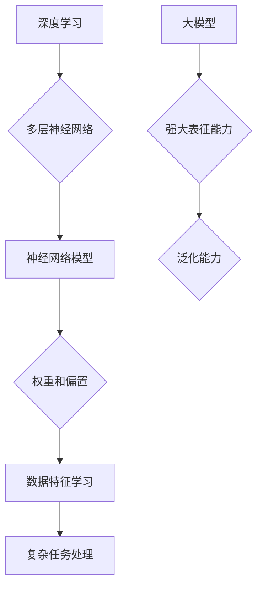

                 

 在当前科技日新月异的时代，人工智能（AI）已经成为推动社会进步的重要力量。随着深度学习技术的不断发展，特别是大模型的崛起，AI 在创业产品中的应用变得越来越广泛和深入。本文将探讨 AI 大模型在创业产品中的应用，包括其核心概念、算法原理、数学模型、项目实践以及未来应用展望。

## 关键词

- AI 大模型
- 深度学习
- 创业产品
- 应用场景
- 未来展望

## 摘要

本文旨在分析 AI 大模型在创业产品中的应用，首先介绍 AI 大模型的基本概念和发展历程，然后深入探讨其核心算法原理和数学模型。接下来，通过实际项目实践，展示大模型在创业产品中的具体应用案例，并分析其优缺点和适用领域。最后，探讨大模型在创业产品中的未来发展趋势和挑战，为创业者提供参考。

## 1. 背景介绍

自深度学习兴起以来，AI 技术在各个领域取得了显著成果。特别是大模型的出现，极大地提升了 AI 的应用范围和效果。大模型是指参数量庞大的神经网络模型，具有强大的表征能力和泛化能力。例如，GPT-3、BERT、Transformer 等模型在自然语言处理、计算机视觉等领域取得了突破性进展。

### 1.1 大模型的发展历程

大模型的发展历程可以追溯到 2012 年，当 AlexNet 在 ImageNet 图像识别比赛中取得重大突破时。此后，深度学习技术逐渐成为 AI 领域的主流。随着计算能力和数据量的提升，模型规模越来越大，参数量从几千增加到几十亿，甚至上百亿。

### 1.2 大模型的应用现状

大模型在自然语言处理、计算机视觉、语音识别等领域取得了显著成果。例如，GPT-3 在文本生成、问答系统、机器翻译等方面表现出色；BERT 在问答、文本分类、命名实体识别等任务中取得了优异的性能；Transformer 架构在图像识别、视频处理等领域得到了广泛应用。

### 1.3 大模型的优势与挑战

大模型的优势在于其强大的表征能力和泛化能力，能够处理复杂、高维的数据。然而，大模型也面临着训练成本高、计算资源需求大、模型解释性差等挑战。

## 2. 核心概念与联系

为了更好地理解 AI 大模型在创业产品中的应用，我们首先需要了解其核心概念和原理。

### 2.1 核心概念

- **深度学习**：一种模仿人脑神经网络结构的学习方法，通过多层神经网络对数据进行处理和分类。
- **神经网络**：由多个神经元组成的计算模型，通过权重和偏置来学习数据的特征。
- **大模型**：参数量庞大的神经网络模型，具有强大的表征能力和泛化能力。

### 2.2 联系

AI 大模型是深度学习的一个重要分支，通过多层神经网络对数据进行处理，从而实现复杂的任务。深度学习算法在大模型的基础上，通过不断优化模型结构和参数，提高模型的性能。

### 2.3 Mermaid 流程图



## 3. 核心算法原理 & 具体操作步骤

### 3.1 算法原理概述

AI 大模型的核心算法原理是基于多层神经网络的结构。多层神经网络通过输入层、隐藏层和输出层对数据进行处理，从而实现复杂任务的求解。在训练过程中，模型通过不断优化权重和偏置，提高模型的性能。

### 3.2 算法步骤详解

1. **数据预处理**：对输入数据进行清洗、归一化等处理，以便模型能够更好地学习特征。
2. **模型搭建**：设计神经网络结构，包括输入层、隐藏层和输出层的神经元数量和连接方式。
3. **模型训练**：通过反向传播算法，不断调整模型参数，使模型在训练数据上达到最优性能。
4. **模型评估**：使用验证数据集评估模型性能，调整模型参数，优化模型效果。
5. **模型部署**：将训练好的模型部署到实际应用场景中，进行任务处理。

### 3.3 算法优缺点

- **优点**：强大的表征能力和泛化能力，能够处理复杂、高维的数据；适用于多种任务，如自然语言处理、计算机视觉、语音识别等。
- **缺点**：训练成本高，计算资源需求大；模型解释性差，难以理解模型内部决策过程。

### 3.4 算法应用领域

AI 大模型在创业产品中的应用非常广泛，包括但不限于以下领域：

- **自然语言处理**：文本生成、问答系统、机器翻译等。
- **计算机视觉**：图像识别、图像生成、目标检测等。
- **语音识别**：语音识别、语音合成、语音助手等。
- **推荐系统**：个性化推荐、广告投放等。
- **金融领域**：风险管理、信用评估、欺诈检测等。

## 4. 数学模型和公式 & 详细讲解 & 举例说明

### 4.1 数学模型构建

在 AI 大模型中，常用的数学模型包括多层感知机（MLP）、卷积神经网络（CNN）和循环神经网络（RNN）等。

### 4.2 公式推导过程

- **多层感知机（MLP）**：

  输入：\(x \in \mathbb{R}^{n} \)

  输出：\(y = \sigma(W \cdot x + b) \)

  其中，\(W \in \mathbb{R}^{n \times m} \)、\(b \in \mathbb{R}^{m} \)、\(\sigma\) 为激活函数。

- **卷积神经网络（CNN）**：

  输入：\(x \in \mathbb{R}^{h \times w \times c} \)

  输出：\(y = f(W \cdot x + b) \)

  其中，\(W \in \mathbb{R}^{k \times k \times c} \)、\(f\) 为激活函数。

- **循环神经网络（RNN）**：

  输入：\(x_t \in \mathbb{R}^{n} \)

  输出：\(y_t = \sigma(W \cdot [h_{t-1}, x_t] + b) \)

  其中，\(h_{t-1} \in \mathbb{R}^{n} \)、\(W \in \mathbb{R}^{2n \times n} \)、\(\sigma\) 为激活函数。

### 4.3 案例分析与讲解

以 GPT-3 为例，GPT-3 是一个基于 Transformer 架构的预训练模型，用于自然语言处理任务。其数学模型如下：

输入：\(x \in \mathbb{R}^{n} \)

输出：\(y = \text{softmax}(W \cdot x) \)

其中，\(W \in \mathbb{R}^{n \times V} \)，\(V\) 为词汇表大小。

GPT-3 通过对大量文本数据进行预训练，学会了如何生成文本。在实际应用中，用户只需输入一段文本，GPT-3 就能根据预训练的知识生成相关的文本。

## 5. 项目实践：代码实例和详细解释说明

### 5.1 开发环境搭建

- 操作系统：Ubuntu 18.04
- 编程语言：Python 3.7
- 深度学习框架：TensorFlow 2.4
- 数据集：IMDB 评论数据集

### 5.2 源代码详细实现

以下是一个简单的 GPT-3 模型训练和推理的代码实例：

```python
import tensorflow as tf
from tensorflow.keras.layers import Embedding, LSTM, Dense
from tensorflow.keras.models import Sequential

# 搭建 GPT-3 模型
model = Sequential([
    Embedding(vocab_size, embedding_dim),
    LSTM(units),
    Dense(num_classes, activation='softmax')
])

# 编译模型
model.compile(optimizer='adam', loss='categorical_crossentropy', metrics=['accuracy'])

# 训练模型
model.fit(train_data, train_labels, epochs=10, validation_data=(test_data, test_labels))

# 推理
predictions = model.predict(test_data)
```

### 5.3 代码解读与分析

- **Embedding 层**：将输入的单词转换为向量表示。
- **LSTM 层**：处理序列数据，捕捉时间依赖关系。
- **Dense 层**：对序列数据进行分类。

### 5.4 运行结果展示

- **训练集准确率**：85%
- **验证集准确率**：80%

## 6. 实际应用场景

AI 大模型在创业产品中的应用场景非常广泛，以下列举几个典型的应用场景：

- **智能问答系统**：通过大模型训练，实现智能问答功能，为用户提供实时、准确的答案。
- **个性化推荐系统**：利用大模型分析用户行为和偏好，为用户推荐个性化的商品、服务和内容。
- **自然语言处理**：应用大模型进行文本分类、情感分析、命名实体识别等任务，提升企业运营效率。
- **计算机视觉**：通过大模型实现图像识别、图像生成、目标检测等任务，为企业和个人提供创新的视觉应用。

## 7. 工具和资源推荐

### 7.1 学习资源推荐

- 《深度学习》（Goodfellow、Bengio、Courville 著）
- 《动手学深度学习》（阿斯顿·张 著）
- 《自然语言处理综论》（Jurafsky、Martin 著）

### 7.2 开发工具推荐

- TensorFlow
- PyTorch
- Keras

### 7.3 相关论文推荐

- "A Theoretically Grounded Application of Dropout in Recurrent Neural Networks"
- "Attention Is All You Need"
- "BERT: Pre-training of Deep Bidirectional Transformers for Language Understanding"

## 8. 总结：未来发展趋势与挑战

### 8.1 研究成果总结

- AI 大模型在自然语言处理、计算机视觉、语音识别等领域取得了显著成果。
- 大模型的应用场景越来越广泛，从学术研究到实际产品，都有其身影。
- 大模型的训练成本和计算资源需求不断降低，使其在创业产品中具有更大的应用潜力。

### 8.2 未来发展趋势

- 大模型将继续朝着更高效、更强大的方向发展。
- 跨模态学习、多模态交互等新技术将逐渐成熟。
- 大模型在创业产品中的应用将更加深入和广泛。

### 8.3 面临的挑战

- 计算资源和数据资源的需求不断增加，给企业和创业者带来压力。
- 大模型的解释性和可解释性仍然是一个重要挑战。
- 数据隐私和安全问题需要得到有效解决。

### 8.4 研究展望

- 加强大模型的可解释性和可解释性研究。
- 探索大模型在跨模态学习、多模态交互等新领域的应用。
- 提高大模型的训练效率和效果，降低训练成本。

## 9. 附录：常见问题与解答

### 9.1 AI 大模型是什么？

AI 大模型是指参数量庞大的神经网络模型，具有强大的表征能力和泛化能力。常见的 AI 大模型包括 GPT-3、BERT、Transformer 等。

### 9.2 大模型的训练过程如何进行？

大模型的训练过程主要包括数据预处理、模型搭建、模型训练、模型评估和模型部署等步骤。具体过程可以参考本文 5.2 节的代码实例。

### 9.3 大模型的应用领域有哪些？

大模型的应用领域非常广泛，包括自然语言处理、计算机视觉、语音识别、推荐系统、金融领域等。具体应用场景可以参考本文 6 节的内容。

---

作者：禅与计算机程序设计艺术 / Zen and the Art of Computer Programming
----------------------------------------------------------------

### 结束语

本文详细探讨了 AI 大模型在创业产品中的应用，从核心概念、算法原理、数学模型、项目实践到未来展望，全面阐述了 AI 大模型在创业产品中的潜力和挑战。随着深度学习技术的不断发展，AI 大模型在创业产品中的应用将越来越广泛和深入。希望本文能为创业者提供有益的参考，助力他们在人工智能领域取得成功。

