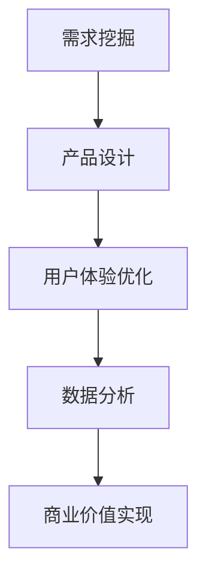

                 

关键词：人工智能、大模型、创业、产品创新、应用趋势

> 摘要：随着人工智能技术的飞速发展，大模型在创业产品创新中的应用已经成为一个热门话题。本文将探讨大模型在创业产品创新中的应用趋势，包括其核心概念与联系、核心算法原理、数学模型与公式、项目实践、实际应用场景以及未来展望。

## 1. 背景介绍

近年来，人工智能（AI）技术取得了显著的进展，尤其是在大模型领域。大模型是指具有数十亿到数万亿参数的深度神经网络模型，例如GPT-3、BERT、Turing等。这些大模型在自然语言处理、计算机视觉、语音识别等领域展现出了强大的能力，极大地推动了AI技术的发展。

创业产品创新是推动社会进步和经济发展的关键。创业者们不断寻找新的产品和服务，以满足用户的需求。大模型技术的出现，为创业产品创新带来了新的机遇。本文将探讨大模型在创业产品创新中的应用趋势，以期为创业者提供参考。

### 1.1 大模型技术发展现状

大模型技术起源于深度学习的发展，特别是神经网络结构的大规模训练和优化。随着计算能力的提升和海量数据资源的积累，大模型的研究和应用逐渐成为AI领域的主流。近年来，Google、OpenAI、微软等科技巨头纷纷投入巨资进行大模型的研究和开发，推动了大模型技术的快速进步。

### 1.2 创业产品创新的重要性

创业产品创新是推动经济发展的重要动力。在激烈的市场竞争中，创业者需要不断创新，开发出具有独特价值的产品和服务，以赢得市场份额。创业产品创新不仅有助于提升企业的竞争力，还有助于推动社会进步和改善人们的生活。

## 2. 核心概念与联系

### 2.1 大模型的核心概念

大模型是指具有数十亿到数万亿参数的深度神经网络模型。这些模型通过大量数据训练，能够自动学习和提取数据中的特征，从而实现复杂的任务。大模型的核心在于其参数规模和计算能力。

### 2.2 创业产品创新的核心概念

创业产品创新是指创业者通过开发新的产品或服务，满足用户需求，实现商业价值的过程。创业产品创新的核心在于市场需求的挖掘和产品价值的实现。

### 2.3 大模型与创业产品创新的联系

大模型技术在创业产品创新中的应用主要体现在以下几个方面：

1. **需求挖掘**：大模型可以通过对大量用户数据进行分析，挖掘出潜在的市场需求，为创业产品的开发提供方向。

2. **产品设计**：大模型可以帮助创业者设计出更符合用户需求的产品，通过生成式模型生成新颖的产品设计方案。

3. **用户体验**：大模型可以为创业者提供智能化的用户体验优化工具，提升产品的用户体验。

4. **数据分析**：大模型可以用于对用户行为数据进行分析，为创业产品的运营提供数据支持。

### 2.4 Mermaid 流程图

以下是描述大模型在创业产品创新中应用流程的Mermaid流程图：



## 3. 核心算法原理 & 具体操作步骤

### 3.1 算法原理概述

大模型的核心算法原理是基于深度学习，特别是神经网络结构。神经网络通过多层非线性变换，对输入数据进行特征提取和表示，从而实现复杂的任务。大模型通过增加参数规模和训练数据量，提高模型的泛化能力和性能。

### 3.2 算法步骤详解

1. **数据预处理**：对原始数据进行清洗、归一化和预处理，以便于模型训练。

2. **模型架构设计**：根据任务需求，设计合适的神经网络架构，包括输入层、隐藏层和输出层。

3. **模型训练**：使用大量的训练数据进行模型训练，通过反向传播算法优化模型参数。

4. **模型评估**：使用测试数据对模型进行评估，验证模型的性能和泛化能力。

5. **模型部署**：将训练好的模型部署到实际应用场景中，为创业产品提供支持。

### 3.3 算法优缺点

**优点**：

1. **强大的学习能力**：大模型可以自动学习和提取数据中的特征，实现复杂的任务。

2. **高泛化能力**：大模型通过大量数据训练，具有较强的泛化能力，可以应用于各种场景。

3. **高效的计算性能**：随着计算能力的提升，大模型的计算性能得到了显著提高。

**缺点**：

1. **计算资源消耗大**：大模型需要大量的计算资源和存储空间，对硬件设施要求较高。

2. **训练时间较长**：大模型的训练时间较长，需要较长的计算周期。

3. **解释性较差**：大模型的决策过程较为复杂，难以解释和验证。

### 3.4 算法应用领域

大模型在创业产品创新中的应用领域广泛，包括自然语言处理、计算机视觉、语音识别、推荐系统等。以下是一些具体的案例：

1. **自然语言处理**：使用大模型进行文本分类、情感分析、机器翻译等任务。

2. **计算机视觉**：使用大模型进行图像分类、目标检测、图像生成等任务。

3. **语音识别**：使用大模型进行语音识别、语音合成等任务。

4. **推荐系统**：使用大模型进行用户行为预测、推荐算法优化等任务。

## 4. 数学模型和公式 & 详细讲解 & 举例说明

### 4.1 数学模型构建

大模型的核心是神经网络模型，其数学基础主要包括以下内容：

1. **线性变换**：神经网络中的每一层都可以看作是一个线性变换，将输入数据映射到输出数据。

2. **激活函数**：为了引入非线性，神经网络中的每一层输出都会通过一个激活函数进行变换。

3. **损失函数**：用于评估模型预测结果与真实结果之间的差距，常用的有均方误差、交叉熵等。

### 4.2 公式推导过程

以下是一个简单的神经网络模型公式推导过程：

假设有一个包含 $L$ 层的神经网络，输入数据为 $x \in \mathbb{R}^{n}$，模型参数为 $W^{(l)} \in \mathbb{R}^{n_l \times n_{l-1}}$ 和 $b^{(l)} \in \mathbb{R}^{n_l}$，其中 $n_l$ 表示第 $l$ 层的节点数。

1. **前向传播**：

$$
z^{(l)} = W^{(l)}a^{(l-1)} + b^{(l)}
$$

$$
a^{(l)} = \sigma(z^{(l)})
$$

其中，$\sigma$ 表示激活函数，常用的有 $Sigmoid$、ReLU等。

2. **反向传播**：

$$
\delta^{(l)} = \frac{\partial L}{\partial a^{(l)}} \odot \frac{\partial \sigma}{\partial z^{(l)}}
$$

$$
\delta^{(l-1)} = \frac{\partial L}{\partial a^{(l-1)}} \odot W^{(l)}
$$

$$
\frac{\partial L}{\partial W^{(l)}} = a^{(l-1)} \delta^{(l)}
$$

$$
\frac{\partial L}{\partial b^{(l)}} = \delta^{(l)}
$$

其中，$\odot$ 表示逐元素乘积。

3. **模型更新**：

$$
W^{(l)} = W^{(l)} - \alpha \frac{\partial L}{\partial W^{(l)}}
$$

$$
b^{(l)} = b^{(l)} - \alpha \frac{\partial L}{\partial b^{(l)}}
$$

其中，$\alpha$ 表示学习率。

### 4.3 案例分析与讲解

以下是一个使用神经网络进行图像分类的案例：

**问题**：给定一个图像数据集，使用神经网络对图像进行分类。

**解决方案**：

1. **数据预处理**：对图像数据进行归一化和裁剪，使其满足神经网络输入要求。

2. **模型设计**：设计一个包含卷积层、池化层和全连接层的神经网络模型。

3. **模型训练**：使用训练数据进行模型训练，优化模型参数。

4. **模型评估**：使用测试数据对模型进行评估，验证模型性能。

5. **模型部署**：将训练好的模型部署到实际应用场景中，进行图像分类。

**具体实现**：

```python
import tensorflow as tf
from tensorflow.keras.models import Sequential
from tensorflow.keras.layers import Conv2D, MaxPooling2D, Flatten, Dense

# 数据预处理
(x_train, y_train), (x_test, y_test) = tf.keras.datasets.cifar10.load_data()
x_train = x_train / 255.0
x_test = x_test / 255.0

# 模型设计
model = Sequential()
model.add(Conv2D(32, (3, 3), activation='relu', input_shape=(32, 32, 3)))
model.add(MaxPooling2D((2, 2)))
model.add(Conv2D(64, (3, 3), activation='relu'))
model.add(MaxPooling2D((2, 2)))
model.add(Conv2D(64, (3, 3), activation='relu'))
model.add(Flatten())
model.add(Dense(64, activation='relu'))
model.add(Dense(10, activation='softmax'))

# 模型训练
model.compile(optimizer='adam', loss='sparse_categorical_crossentropy', metrics=['accuracy'])
model.fit(x_train, y_train, epochs=10, validation_data=(x_test, y_test))

# 模型评估
test_loss, test_acc = model.evaluate(x_test, y_test)
print('Test accuracy:', test_acc)

# 模型部署
predictions = model.predict(x_test)
```

## 5. 项目实践：代码实例和详细解释说明

### 5.1 开发环境搭建

1. 安装 Python 3.7 或以上版本。

2. 安装 TensorFlow 2.x。

3. 安装 Keras。

### 5.2 源代码详细实现

以下是实现图像分类项目的源代码：

```python
import tensorflow as tf
from tensorflow.keras.models import Sequential
from tensorflow.keras.layers import Conv2D, MaxPooling2D, Flatten, Dense

# 数据预处理
(x_train, y_train), (x_test, y_test) = tf.keras.datasets.cifar10.load_data()
x_train = x_train / 255.0
x_test = x_test / 255.0

# 模型设计
model = Sequential()
model.add(Conv2D(32, (3, 3), activation='relu', input_shape=(32, 32, 3)))
model.add(MaxPooling2D((2, 2)))
model.add(Conv2D(64, (3, 3), activation='relu'))
model.add(MaxPooling2D((2, 2)))
model.add(Conv2D(64, (3, 3), activation='relu'))
model.add(Flatten())
model.add(Dense(64, activation='relu'))
model.add(Dense(10, activation='softmax'))

# 模型训练
model.compile(optimizer='adam', loss='sparse_categorical_crossentropy', metrics=['accuracy'])
model.fit(x_train, y_train, epochs=10, validation_data=(x_test, y_test))

# 模型评估
test_loss, test_acc = model.evaluate(x_test, y_test)
print('Test accuracy:', test_acc)

# 模型部署
predictions = model.predict(x_test)
```

### 5.3 代码解读与分析

1. **数据预处理**：

```python
(x_train, y_train), (x_test, y_test) = tf.keras.datasets.cifar10.load_data()
x_train = x_train / 255.0
x_test = x_test / 255.0
```

这段代码从 TensorFlow 的内置数据集中加载数据，并对数据进行归一化处理，将像素值缩放到 [0, 1] 范围内。

2. **模型设计**：

```python
model = Sequential()
model.add(Conv2D(32, (3, 3), activation='relu', input_shape=(32, 32, 3)))
model.add(MaxPooling2D((2, 2)))
model.add(Conv2D(64, (3, 3), activation='relu'))
model.add(MaxPooling2D((2, 2)))
model.add(Conv2D(64, (3, 3), activation='relu'))
model.add(Flatten())
model.add(Dense(64, activation='relu'))
model.add(Dense(10, activation='softmax'))
```

这段代码定义了一个简单的卷积神经网络模型，包括卷积层、池化层、全连接层和输出层。卷积层用于提取图像特征，池化层用于降维和增强特征，全连接层用于分类。

3. **模型训练**：

```python
model.compile(optimizer='adam', loss='sparse_categorical_crossentropy', metrics=['accuracy'])
model.fit(x_train, y_train, epochs=10, validation_data=(x_test, y_test))
```

这段代码编译模型，并使用训练数据进行训练。编译时指定了优化器、损失函数和评估指标。训练过程中，模型通过反向传播算法优化参数。

4. **模型评估**：

```python
test_loss, test_acc = model.evaluate(x_test, y_test)
print('Test accuracy:', test_acc)
```

这段代码使用测试数据对模型进行评估，输出模型的测试准确率。

5. **模型部署**：

```python
predictions = model.predict(x_test)
```

这段代码将训练好的模型应用于实际图像分类任务，输出预测结果。

## 6. 实际应用场景

### 6.1 自然语言处理

大模型在自然语言处理领域具有广泛的应用，如文本分类、情感分析、机器翻译等。创业者可以利用大模型技术开发出具有智能交互能力的聊天机器人、智能客服等应用。

### 6.2 计算机视觉

大模型在计算机视觉领域具有强大的图像识别、目标检测、图像生成等功能。创业者可以利用大模型技术开发出智能安防、智能医疗、智能交通等应用。

### 6.3 语音识别

大模型在语音识别领域具有高效、准确的语音识别能力。创业者可以利用大模型技术开发出智能语音助手、语音翻译等应用。

### 6.4 推荐系统

大模型在推荐系统领域具有强大的用户行为预测和推荐算法优化能力。创业者可以利用大模型技术开发出个性化推荐、智能营销等应用。

## 7. 工具和资源推荐

### 7.1 学习资源推荐

1. 《深度学习》（Goodfellow, Bengio, Courville）  
2. 《Python机器学习》（Sebastian Raschka）  
3. 《神经网络与深度学习》（邱锡鹏）

### 7.2 开发工具推荐

1. TensorFlow  
2. PyTorch  
3. Keras

### 7.3 相关论文推荐

1. “Attention is All You Need”（Vaswani et al., 2017）  
2. “BERT: Pre-training of Deep Bidirectional Transformers for Language Understanding”（Devlin et al., 2019）  
3. “GPT-3: Language Models are Few-Shot Learners”（Brown et al., 2020）

## 8. 总结：未来发展趋势与挑战

### 8.1 研究成果总结

大模型技术在创业产品创新中取得了显著成果，包括自然语言处理、计算机视觉、语音识别、推荐系统等领域。大模型的应用为创业产品创新提供了强大的技术支持，提升了产品的竞争力。

### 8.2 未来发展趋势

1. **模型压缩与优化**：随着模型规模的增大，计算资源和存储资源的消耗也在增加。未来，研究将致力于模型压缩和优化，降低大模型的计算和存储成本。

2. **多模态数据处理**：未来，大模型将更加关注多模态数据的处理，实现文本、图像、语音等多种数据类型的融合和应用。

3. **迁移学习和泛化能力**：提高大模型的迁移学习和泛化能力，使其在新的任务和数据集上表现更好。

### 8.3 面临的挑战

1. **计算资源需求**：大模型训练和推理需要大量的计算资源，对硬件设施要求较高。

2. **数据隐私和安全**：在应用大模型的过程中，如何保护用户数据隐私和安全是一个重要的挑战。

3. **模型解释性**：大模型的决策过程较为复杂，难以解释和验证。如何提高大模型的解释性是一个重要的研究方向。

### 8.4 研究展望

未来，大模型在创业产品创新中的应用将更加广泛，为创业者提供更多的创新机会。同时，研究者将继续探索大模型的理论和方法，提高其性能和解释性，为AI技术的发展做出贡献。

## 9. 附录：常见问题与解答

### 9.1 如何选择合适的大模型？

选择合适的大模型需要考虑以下因素：

1. **任务需求**：根据任务需求选择适合的大模型，例如自然语言处理任务可以选择BERT、GPT等。

2. **计算资源**：根据计算资源的限制选择适当规模的大模型。

3. **数据规模**：根据数据规模选择适合的大模型，大模型对数据量有较高的要求。

### 9.2 大模型训练需要多长时间？

大模型训练时间取决于模型规模、数据规模和硬件设施。通常情况下，大规模大模型训练时间较长，可能需要几天甚至几周的时间。

### 9.3 如何优化大模型性能？

优化大模型性能可以从以下几个方面入手：

1. **模型架构优化**：设计更加高效的模型架构，例如使用残差连接、注意力机制等。

2. **数据预处理**：对数据进行有效的预处理，例如数据增强、归一化等。

3. **超参数调整**：通过调整学习率、批量大小等超参数，优化模型性能。

4. **模型压缩**：使用模型压缩技术，例如剪枝、量化等，降低模型计算和存储成本。

## 参考文献

1. Goodfellow, I., Bengio, Y., & Courville, A. (2016). Deep learning. MIT press.
2. Raschka, S. (2019). Python机器学习. 机械工业出版社.
3. Vaswani, A., Shazeer, N., Parmar, N., Uszkoreit, J., Jones, L., Gomez, A. N., ... & Polosukhin, I. (2017). Attention is all you need. Advances in Neural Information Processing Systems, 30, 5998-6008.
4. Devlin, J., Chang, M. W., Lee, K., & Toutanova, K. (2019). BERT: Pre-training of deep bidirectional transformers for language understanding. Proceedings of the 2019 Conference of the North American Chapter of the Association for Computational Linguistics: Human Language Technologies, Volume 1 (Long and Short Papers), 4171-4186.
5. Brown, T., Mann, B., Ryder, N., Subbiah, M., Kaplan, J., Dhariwal, P., ... & Child, R. (2020). Language models are few-shot learners. Advances in Neural Information Processing Systems, 33.

