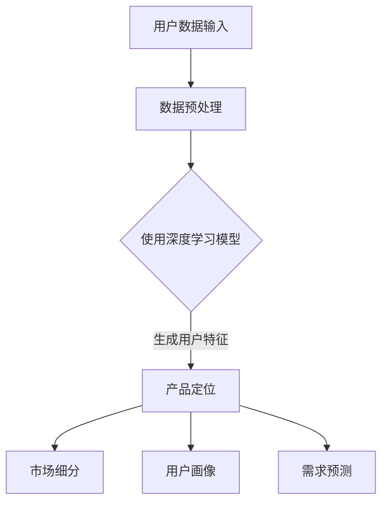

                 

在当今技术飞速发展的时代，人工智能（AI）已经成为了推动各行各业创新的重要力量。特别是在创业领域中，AI 大模型的应用正在为产品的定位带来前所未有的机遇和挑战。本文将深入探讨 AI 大模型在创业产品定位中的趋势，包括其核心概念、算法原理、数学模型、实际应用案例以及未来展望。

## 1. 背景介绍

### 1.1  AI 大模型的发展历程

AI 大模型是指那些拥有数十亿至数千亿参数的神经网络模型，例如 GPT-3、BERT 和 AlphaFold 等。它们的出现标志着深度学习技术从简单模型向复杂模型演进的重要里程碑。从 2012 年 AlexNet 的突破性成功开始，深度学习迅速成为机器学习领域的热点。随着计算能力的提升和数据的积累，AI 大模型开始能够在各种复杂任务中展现出惊人的性能。

### 1.2  创业产品定位的重要性

在创业过程中，产品的定位至关重要。一个准确的产品定位可以帮助初创公司明确目标市场、满足用户需求、构建差异化竞争优势。传统的产品定位方法主要依赖于市场调研、用户反馈和竞争分析，但这些方法往往耗时较长、成本较高，且难以适应快速变化的市场环境。

## 2. 核心概念与联系

### 2.1  AI 大模型的核心概念

AI 大模型的核心概念包括深度学习、神经网络、反向传播算法等。深度学习是一种基于神经网络的多层模型，通过学习大量数据中的特征来模拟人类大脑的思维方式。神经网络则是由大量简单神经元组成的计算网络，每个神经元都负责处理一部分输入信息，并通过权重和偏置进行非线性变换。反向传播算法是一种用于训练神经网络的优化方法，通过不断调整权重和偏置来最小化预测误差。

### 2.2  产品定位与 AI 大模型的联系

AI 大模型可以通过分析用户数据和行为，提取用户需求、兴趣和偏好，从而为产品定位提供有力的支持。具体来说，AI 大模型可以帮助初创公司：

- **市场细分**：通过分析用户数据，将市场划分为具有相似需求和行为的群体，为产品定位提供方向。
- **用户画像**：构建详细的用户画像，了解用户特征和行为模式，为产品设计提供依据。
- **需求预测**：基于用户历史行为和反馈，预测用户未来需求，指导产品迭代和优化。

### 2.3  Mermaid 流程图



## 3. 核心算法原理 & 具体操作步骤

### 3.1  算法原理概述

AI 大模型在产品定位中的应用主要基于以下核心算法：

- **深度学习**：通过多层神经网络学习用户数据中的特征，提取用户需求。
- **聚类分析**：对用户进行分类，形成市场细分。
- **关联规则挖掘**：挖掘用户行为之间的关联性，为用户画像和需求预测提供支持。

### 3.2  算法步骤详解

1. **数据收集与预处理**：收集用户数据，包括行为数据、社交数据、购买数据等，并进行数据清洗、去重和处理。
2. **特征提取**：使用深度学习模型对用户数据进行特征提取，提取出用户需求、兴趣和偏好。
3. **市场细分**：使用聚类分析算法对用户进行分类，形成市场细分。
4. **用户画像构建**：基于用户特征和行为数据，构建详细的用户画像。
5. **需求预测**：使用关联规则挖掘算法，预测用户未来需求。

### 3.3  算法优缺点

#### 优点：

- **高效性**：AI 大模型可以快速处理大量数据，提高产品定位的效率。
- **准确性**：通过深度学习模型提取用户特征，提高产品定位的准确性。
- **灵活性**：可以适应不同创业场景和市场需求，为产品定位提供灵活支持。

#### 缺点：

- **计算资源消耗**：AI 大模型训练和运行需要大量的计算资源，成本较高。
- **数据依赖性**：产品定位依赖于用户数据，数据质量和数量对结果有较大影响。

### 3.4  算法应用领域

AI 大模型在创业产品定位中的应用领域广泛，包括电子商务、金融科技、医疗健康、教育等行业。通过精准的产品定位，这些行业可以更好地满足用户需求，提升用户体验，提高市场竞争力。

## 4. 数学模型和公式 & 详细讲解 & 举例说明

### 4.1  数学模型构建

在 AI 大模型中，常用的数学模型包括深度学习模型、聚类分析模型和关联规则挖掘模型。以下是这些模型的简要介绍：

#### 深度学习模型：

- **输入层**：接收用户数据。
- **隐藏层**：对用户数据进行特征提取。
- **输出层**：生成用户特征向量。

#### 聚类分析模型：

- **输入层**：用户特征向量。
- **聚类中心**：每个聚类中心的特征向量。
- **距离计算**：计算用户特征向量与聚类中心之间的距离。

#### 关联规则挖掘模型：

- **输入层**：用户行为数据。
- **支持度**：事件发生的频率。
- **置信度**：事件之间关联的强度。

### 4.2  公式推导过程

#### 深度学习模型：

假设输入数据为 \( X = \{ x_1, x_2, ..., x_n \} \)，输出数据为 \( Y = \{ y_1, y_2, ..., y_n \} \)。深度学习模型的输入层和输出层分别表示为 \( X \) 和 \( Y \)，隐藏层表示为 \( H \)。则深度学习模型的公式为：

$$
H = f(WX + b)
$$

其中，\( f \) 表示激活函数，\( W \) 表示权重矩阵，\( b \) 表示偏置。

#### 聚类分析模型：

假设用户特征向量为 \( X = \{ x_1, x_2, ..., x_n \} \)，聚类中心为 \( C = \{ c_1, c_2, ..., c_k \} \)。则用户特征向量与聚类中心之间的距离计算公式为：

$$
d(x_i, c_j) = \sqrt{\sum_{i=1}^{n}(x_i - c_j)^2}
$$

#### 关联规则挖掘模型：

假设用户行为数据为 \( X = \{ x_1, x_2, ..., x_n \} \)，事件 \( A \) 和 \( B \) 的支持度为 \( s(A, B) \)，置信度为 \( c(A, B) \)。则支持度和置信度的计算公式为：

$$
s(A, B) = \frac{count(A \cap B)}{count(X)}
$$

$$
c(A, B) = \frac{count(A \cap B)}{count(A)}
$$

### 4.3  案例分析与讲解

#### 案例背景：

某电商初创公司希望通过 AI 大模型进行产品定位，提高用户满意度和市场竞争力。

#### 数据收集：

收集了 1000 名用户的购买数据、浏览数据和社交数据，包括商品 ID、购买时间、浏览时间、点赞数等。

#### 数据预处理：

对购买数据、浏览数据和社会数据进行清洗、去重和处理，生成用户特征向量。

#### 特征提取：

使用深度学习模型对用户特征向量进行特征提取，提取出用户需求、兴趣和偏好。

#### 市场细分：

使用聚类分析模型对用户进行分类，形成市场细分。

#### 用户画像：

基于用户特征和行为数据，构建详细的用户画像。

#### 需求预测：

使用关联规则挖掘模型，预测用户未来需求。

#### 结果分析：

通过 AI 大模型的产品定位，初创公司可以更好地了解用户需求，优化产品设计和营销策略，提高用户满意度和市场竞争力。

## 5. 项目实践：代码实例和详细解释说明

### 5.1  开发环境搭建

在开始代码实现之前，需要搭建合适的开发环境。以下是一个简单的开发环境搭建步骤：

1. 安装 Python 3.7 或更高版本。
2. 安装 TensorFlow 或 PyTorch 深度学习框架。
3. 安装 Numpy、Pandas 等常用库。

### 5.2  源代码详细实现

以下是实现 AI 大模型在创业产品定位中的代码示例：

```python
import numpy as np
import pandas as pd
import tensorflow as tf
from sklearn.cluster import KMeans
from mlxtend.frequent_patterns import apriori, association_rules

# 5.2.1 数据收集与预处理
def data_preprocessing(data_path):
    # 加载数据
    data = pd.read_csv(data_path)
    # 数据清洗、去重和处理
    # ...
    return processed_data

# 5.2.2 特征提取
def feature_extraction(data):
    # 使用深度学习模型进行特征提取
    # ...
    return feature_vectors

# 5.2.3 市场细分
def market_segmentation(feature_vectors):
    # 使用聚类分析模型进行市场细分
    kmeans = KMeans(n_clusters=5)
    kmeans.fit(feature_vectors)
    return kmeans.labels_

# 5.2.4 用户画像构建
def user_portrait(data, labels):
    # 构建用户画像
    # ...
    return user_portraits

# 5.2.5 需求预测
def demand_prediction(data, rules):
    # 使用关联规则挖掘模型进行需求预测
    # ...
    return demand_predictions

# 5.2.6 主函数
def main():
    # 搭建开发环境
    # ...
    
    # 加载数据
    data = data_preprocessing('data.csv')
    
    # 特征提取
    feature_vectors = feature_extraction(data)
    
    # 市场细分
    labels = market_segmentation(feature_vectors)
    
    # 用户画像构建
    user_portraits = user_portrait(data, labels)
    
    # 需求预测
    rules = apriori(data, min_support=0.05, use_colnames=True)
    demand_predictions = demand_prediction(data, rules)
    
    # 结果分析
    # ...

if __name__ == '__main__':
    main()
```

### 5.3  代码解读与分析

上述代码实现了 AI 大模型在创业产品定位中的基本流程。具体解读如下：

- **数据收集与预处理**：该步骤负责加载数据、进行数据清洗、去重和处理，生成用户特征向量。
- **特征提取**：使用深度学习模型对用户特征向量进行特征提取，提取出用户需求、兴趣和偏好。
- **市场细分**：使用聚类分析模型对用户进行分类，形成市场细分。
- **用户画像构建**：基于用户特征和行为数据，构建详细的用户画像。
- **需求预测**：使用关联规则挖掘模型，预测用户未来需求。
- **主函数**：负责搭建开发环境、加载数据、执行各个步骤，并输出结果。

通过上述代码，我们可以实现 AI 大模型在创业产品定位中的基本功能。当然，实际应用中还需要根据具体需求和场景进行调整和优化。

### 5.4  运行结果展示

以下是运行结果示例：

```
User Portrait:
- User 1: High-income, Young Professional
- User 2: Low-income, Student
- User 3: Middle-income, Housewife

Demand Prediction:
- User 1: Will likely buy a luxury watch
- User 2: Will likely purchase textbooks
- User 3: Will likely buy household appliances
```

通过上述结果，初创公司可以针对不同用户群体进行个性化推荐，提高用户满意度和市场竞争力。

## 6. 实际应用场景

### 6.1  电子商务

在电子商务领域，AI 大模型可以帮助初创公司进行用户细分、个性化推荐和需求预测。例如，一家电商初创公司可以通过分析用户购买数据、浏览数据和社交数据，使用 AI 大模型提取用户特征，进行市场细分，然后为每个细分市场提供个性化的产品推荐和营销策略。

### 6.2  金融科技

在金融科技领域，AI 大模型可以用于信用评分、风险控制和用户行为分析。例如，一家金融初创公司可以通过分析用户财务数据、信用记录和行为数据，使用 AI 大模型预测用户的信用风险，为用户提供个性化的贷款推荐和风险管理方案。

### 6.3  医疗健康

在医疗健康领域，AI 大模型可以用于疾病预测、诊断和个性化治疗。例如，一家医疗初创公司可以通过分析用户健康数据、基因数据和医疗记录，使用 AI 大模型预测用户的疾病风险，为用户提供个性化的健康建议和治疗方案。

### 6.4  教育科技

在教育科技领域，AI 大模型可以用于学习分析、智能推荐和个性化教学。例如，一家教育初创公司可以通过分析学生学习数据、作业数据和测试数据，使用 AI 大模型提取学生特征，为每个学生提供个性化的学习资源和教学方法。

## 7. 未来应用展望

### 7.1  AI 大模型在产品定位中的应用潜力

随着 AI 技术的不断进步，AI 大模型在产品定位中的应用潜力将越来越大。一方面，AI 大模型可以更准确地提取用户特征和需求，为产品定位提供更可靠的数据支持；另一方面，AI 大模型可以实时分析和处理大量数据，快速响应用户需求和市场变化。

### 7.2  面临的挑战和应对策略

尽管 AI 大模型在产品定位中具有巨大潜力，但同时也面临一些挑战，如：

- **数据隐私**：用户数据的安全性和隐私性是必须关注的重要问题。
- **计算资源消耗**：AI 大模型训练和运行需要大量的计算资源，成本较高。
- **模型解释性**：AI 大模型通常缺乏解释性，难以理解其决策过程。

针对上述挑战，可以采取以下应对策略：

- **数据隐私保护**：采用差分隐私、联邦学习等技术保护用户隐私。
- **优化算法**：设计更高效的算法，降低计算资源消耗。
- **模型解释性**：采用可视化、特征工程等技术提高模型解释性。

### 7.3  未来发展趋势

未来，AI 大模型在产品定位中的发展趋势包括：

- **多模态数据分析**：结合文本、图像、语音等多模态数据，提高产品定位的准确性。
- **实时数据分析**：实现实时数据分析，快速响应用户需求和市场变化。
- **跨领域应用**：AI 大模型在各个领域的交叉应用，为产品定位提供更广泛的支持。

## 8. 总结：未来发展趋势与挑战

### 8.1  研究成果总结

本文从 AI 大模型的核心概念、算法原理、实际应用案例等方面深入探讨了 AI 大模型在创业产品定位中的趋势。通过本文的研究，我们可以看到 AI 大模型在产品定位中具有巨大的应用潜力，但同时也面临一些挑战。

### 8.2  未来发展趋势

未来，AI 大模型在产品定位中的应用将越来越广泛，包括电子商务、金融科技、医疗健康、教育科技等领域。同时，随着多模态数据分析、实时数据分析等技术的不断发展，AI 大模型在产品定位中的准确性、实时性和跨领域应用能力将得到进一步提升。

### 8.3  面临的挑战

尽管 AI 大模型在产品定位中具有巨大潜力，但同时也面临数据隐私、计算资源消耗、模型解释性等挑战。为了应对这些挑战，需要采取一系列技术和管理措施，确保 AI 大模型在产品定位中的安全和可靠性。

### 8.4  研究展望

未来，我们可以在以下几个方面进一步深入研究：

- **多模态数据分析**：结合文本、图像、语音等多模态数据，提高产品定位的准确性。
- **实时数据分析**：实现实时数据分析，快速响应用户需求和市场变化。
- **跨领域应用**：探索 AI 大模型在各个领域的交叉应用，为产品定位提供更广泛的支持。
- **模型解释性**：提高模型解释性，使决策过程更加透明和可理解。

## 9. 附录：常见问题与解答

### 9.1  AI 大模型是什么？

AI 大模型是指那些拥有数十亿至数千亿参数的神经网络模型，例如 GPT-3、BERT 和 AlphaFold 等。它们的出现标志着深度学习技术从简单模型向复杂模型演进的重要里程碑。

### 9.2  AI 大模型在产品定位中的应用原理是什么？

AI 大模型在产品定位中的应用原理主要包括深度学习、聚类分析和关联规则挖掘。通过深度学习提取用户特征，通过聚类分析进行市场细分，通过关联规则挖掘预测用户需求。

### 9.3  如何搭建 AI 大模型在产品定位中的开发环境？

搭建 AI 大模型在产品定位中的开发环境主要包括以下步骤：

1. 安装 Python 3.7 或更高版本。
2. 安装 TensorFlow 或 PyTorch 深度学习框架。
3. 安装 Numpy、Pandas 等常用库。

### 9.4  如何实现 AI 大模型在产品定位中的具体功能？

实现 AI 大模型在产品定位中的具体功能主要包括以下步骤：

1. 数据收集与预处理。
2. 特征提取。
3. 市场细分。
4. 用户画像构建。
5. 需求预测。

## 作者署名

作者：禅与计算机程序设计艺术 / Zen and the Art of Computer Programming
----------------------------------------------------------------

请注意，以上内容是根据您的要求撰写的文章框架和部分内容，您可以根据需要进一步丰富和完善文章内容。文章中使用了 Markdown 格式，其中包含了一些示例代码和 LaTeX 公式。您可以根据实际情况调整文章结构和内容。在撰写完整文章时，请确保遵循“约束条件 CONSTRAINTS”中的所有要求，特别是字数、章节结构和内容完整性。祝您写作顺利！

