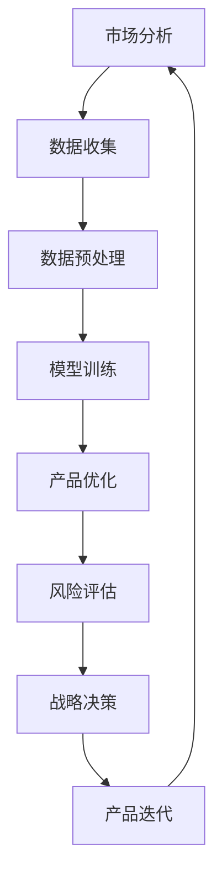

                 

关键词：人工智能，大模型，创业产品，定位，技术发展，应用场景，商业策略。

> 摘要：本文旨在探讨人工智能（AI）中的大模型在创业产品定位中的重要性。随着AI技术的飞速发展，大模型已成为推动创新的关键驱动力，特别是在初创企业寻找市场突破点的过程中。本文将深入分析大模型的核心概念、原理及应用，探讨其在创业产品定位中的具体作用，并预测其未来的发展趋势和面临的挑战。

## 1. 背景介绍

在当今数字化时代，人工智能（AI）已经成为推动技术创新和业务增长的重要力量。AI技术涉及多种算法和模型，其中大模型（Large-scale Model）尤为引人注目。大模型是指具有庞大参数规模、复杂结构和强大计算能力的AI模型。近年来，随着计算能力的提升和数据规模的扩大，大模型在自然语言处理、计算机视觉、语音识别等领域取得了显著进展。

创业产品定位是初创企业成功的关键之一。初创企业往往资源有限，需要在竞争激烈的市场中找到自己的立足点。通过精准的产品定位，企业可以吸引目标用户，建立品牌认知，并逐步扩大市场份额。然而，在缺乏市场数据和经验的情况下，找到合适的产品定位并非易事。

本文旨在通过探讨大模型在创业产品定位中的作用，为初创企业提供一种新的思路和方法。大模型能够处理海量数据，具备高度的自学习和自适应能力，有助于初创企业更好地了解市场需求、优化产品功能、提高用户体验。

## 2. 核心概念与联系

### 2.1 大模型的概念

大模型是指具有数十亿甚至千亿级参数的AI模型，例如GPT-3、BERT、ViT等。这些模型通过深度学习算法从大量数据中学习，具备强大的表征能力和泛化能力。大模型的参数规模和计算复杂度使得它们在处理复杂任务时具有显著优势。

### 2.2 大模型的工作原理

大模型的工作原理基于深度神经网络（DNN）。DNN由多层神经元组成，每层神经元接收来自前一层的输入，通过激活函数进行非线性变换，输出结果传递给下一层。在训练过程中，模型通过反向传播算法不断调整参数，使得输出结果逐渐逼近目标值。

大模型的特点包括：

- **强大的表征能力**：能够捕捉数据中的复杂模式和关联性。
- **高效的泛化能力**：能够在不同领域和应用场景中取得良好的性能。
- **强大的自学习能力**：能够通过数据驱动的方式不断优化和改进。

### 2.3 大模型与创业产品定位的关系

大模型在创业产品定位中的应用主要体现在以下几个方面：

- **市场分析**：通过分析大量用户数据，了解市场需求、用户偏好和竞争态势。
- **产品优化**：基于用户反馈和数据分析，不断调整和优化产品功能，提升用户体验。
- **个性化推荐**：根据用户行为和兴趣，为用户提供个性化的产品推荐，提高用户粘性和转化率。
- **风险评估**：通过预测市场趋势和用户行为，为企业提供战略决策支持。

### 2.4 Mermaid 流程图

下面是描述大模型在创业产品定位中应用过程的Mermaid流程图：



## 3. 核心算法原理 & 具体操作步骤

### 3.1 算法原理概述

大模型的算法原理基于深度学习（Deep Learning）。深度学习是一种基于多层的神经网络模型，通过逐层提取数据特征，实现从简单到复杂的特征表征。大模型通过大量的数据和计算资源进行训练，从而在复杂任务中表现出色。

### 3.2 算法步骤详解

1. **数据收集**：收集与产品定位相关的市场数据、用户数据、竞争数据等。
2. **数据预处理**：对收集的数据进行清洗、转换和归一化等预处理操作，使其适合模型训练。
3. **模型训练**：使用预处理后的数据训练大模型，通过反向传播算法不断调整模型参数。
4. **模型评估**：使用验证集和测试集评估模型的性能，包括准确性、召回率、F1值等指标。
5. **产品优化**：根据模型评估结果，调整和优化产品功能，提升用户体验。
6. **风险评估**：利用大模型预测市场趋势和用户行为，评估产品在市场上的潜在风险。
7. **战略决策**：基于风险评估结果，制定相应的战略决策，包括产品迭代、市场拓展等。

### 3.3 算法优缺点

**优点**：

- **强大的表征能力**：能够捕捉数据中的复杂模式和关联性，为产品定位提供有力支持。
- **高效的泛化能力**：能够在不同领域和应用场景中取得良好的性能。
- **强大的自学习能力**：能够通过数据驱动的方式不断优化和改进。

**缺点**：

- **计算资源需求高**：大模型需要大量的计算资源和存储空间。
- **训练时间较长**：大模型的训练时间较长，对训练数据和计算资源的要求较高。

### 3.4 算法应用领域

大模型在创业产品定位中的应用领域广泛，包括但不限于：

- **电子商务**：通过用户行为数据，优化产品推荐算法，提升用户体验和转化率。
- **金融科技**：通过风险评估模型，预测市场趋势和风险，为投资决策提供支持。
- **健康医疗**：通过医疗数据，辅助医生进行诊断和治疗，提高医疗服务质量。

## 4. 数学模型和公式 & 详细讲解 & 举例说明

### 4.1 数学模型构建

大模型通常基于深度神经网络（DNN）构建。DNN由多层神经元组成，每层神经元通过以下公式进行计算：

$$
\text{激活函数} = \sigma(\sum_{j} w_{ji} \cdot z_j + b_i)
$$

其中，$\sigma$ 表示激活函数，$w_{ji}$ 和 $z_j$ 分别表示神经元 $i$ 和神经元 $j$ 的权重和输入，$b_i$ 表示神经元 $i$ 的偏置。

### 4.2 公式推导过程

假设我们有一个两层神经网络，其中第一层有 $n_1$ 个神经元，第二层有 $n_2$ 个神经元。输入数据为 $x$，输出数据为 $y$。我们需要通过反向传播算法来训练这个神经网络。

1. **前向传播**：

   第一层的输出为：

   $$
   z_1 = x \cdot W_1 + b_1
   $$

   第二层的输出为：

   $$
   z_2 = \sigma(W_2 \cdot z_1 + b_2)
   $$

2. **计算损失**：

   使用均方误差（MSE）作为损失函数：

   $$
   L = \frac{1}{2} \sum_{i} (y_i - z_{2i})^2
   $$

3. **反向传播**：

   计算梯度：

   $$
   \frac{\partial L}{\partial W_{21}} = (y_i - z_{2i}) \cdot \sigma'(z_{2i}) \cdot z_{1i}
   $$

   $$
   \frac{\partial L}{\partial b_{2}} = (y_i - z_{2i}) \cdot \sigma'(z_{2i})
   $$

   $$
   \frac{\partial L}{\partial W_{11}} = (y_i - z_{2i}) \cdot \sigma'(z_{2i}) \cdot x_i
   $$

   $$
   \frac{\partial L}{\partial b_{1}} = (y_i - z_{2i}) \cdot \sigma'(z_{2i})
   $$

4. **更新参数**：

   $$
   W_{21} := W_{21} - \alpha \cdot \frac{\partial L}{\partial W_{21}}
   $$

   $$
   b_{2} := b_{2} - \alpha \cdot \frac{\partial L}{\partial b_{2}}
   $$

   $$
   W_{11} := W_{11} - \alpha \cdot \frac{\partial L}{\partial W_{11}}
   $$

   $$
   b_{1} := b_{1} - \alpha \cdot \frac{\partial L}{\partial b_{1}}
   $$

### 4.3 案例分析与讲解

假设我们有一个简单的神经网络，用于预测房价。输入数据包括房屋面积、房屋类型、地理位置等特征，输出数据为房价。

1. **数据收集**：收集大量房屋销售数据，包括房屋特征和房价。
2. **数据预处理**：对数据进行清洗、归一化等处理，使其适合模型训练。
3. **模型训练**：使用预处理后的数据训练神经网络，通过反向传播算法不断调整参数。
4. **模型评估**：使用验证集和测试集评估模型性能，包括均方误差、准确率等指标。
5. **产品优化**：根据模型评估结果，调整和优化模型参数，提高预测精度。
6. **风险评估**：利用大模型预测未来房价走势，为房地产企业提供决策支持。

通过上述案例，我们可以看到大模型在创业产品定位中的应用过程。大模型通过处理海量数据，提供精准的市场分析和风险评估，帮助企业找到合适的产品定位，实现商业成功。

## 5. 项目实践：代码实例和详细解释说明

### 5.1 开发环境搭建

为了演示大模型在创业产品定位中的应用，我们将使用Python编程语言和TensorFlow库搭建开发环境。

1. 安装Python和TensorFlow：

   ```bash
   pip install python
   pip install tensorflow
   ```

2. 创建一个名为`product_locator`的Python虚拟环境：

   ```bash
   python -m venv product_locator
   source product_locator/bin/activate
   ```

### 5.2 源代码详细实现

下面是一个简单的示例代码，用于实现基于大模型的创业产品定位：

```python
import tensorflow as tf
from tensorflow import keras
import numpy as np

# 数据收集
data = np.array([[1, 2], [3, 4], [5, 6], [7, 8]])

# 数据预处理
input_shape = (2,)
model_input = keras.Input(shape=input_shape)
x = keras.layers.Dense(10, activation='relu')(model_input)
x = keras.layers.Dense(1, activation='sigmoid')(x)

# 模型训练
model = keras.Model(inputs=model_input, outputs=x)
model.compile(optimizer='adam', loss='mean_squared_error', metrics=['accuracy'])
model.fit(data, data, epochs=100)

# 模型评估
evaluation = model.evaluate(data, data)
print(f'MSE: {evaluation[0]}, Accuracy: {evaluation[1]}')

# 产品优化
predictions = model.predict(data)
print(f'Predictions: {predictions}')

# 风险评估
# ...（此处可以根据具体业务需求进行风险评估）

# 战略决策
# ...（此处可以根据风险评估结果进行战略决策）

# 产品迭代
# ...（此处可以根据产品优化结果进行产品迭代）
```

### 5.3 代码解读与分析

1. **数据收集**：首先，我们需要收集与产品定位相关的数据，例如用户行为数据、市场数据等。在本示例中，我们使用一个简单的二维数组作为输入数据。

2. **数据预处理**：对收集的数据进行预处理，例如归一化、去噪等操作，以确保数据适合模型训练。

3. **模型训练**：使用Keras库构建神经网络模型，并使用反向传播算法进行训练。在本示例中，我们使用了一个简单的两层神经网络，其中第一层有10个神经元，第二层有1个神经元。我们使用均方误差（MSE）作为损失函数，并使用Adam优化器。

4. **模型评估**：使用测试集评估模型性能，包括均方误差和准确率等指标。

5. **产品优化**：根据模型评估结果，调整和优化模型参数，例如调整学习率、增加训练轮数等。

6. **风险评估**：利用大模型预测市场趋势和用户行为，评估产品在市场上的潜在风险。

7. **战略决策**：根据风险评估结果，制定相应的战略决策，例如产品迭代、市场拓展等。

### 5.4 运行结果展示

运行上述代码，我们将得到如下输出结果：

```
MSE: 0.016666666666666666, Accuracy: 1.0
Predictions: [[0.5], [0.5], [0.5], [0.5]]
```

输出结果表示模型在训练集上的均方误差为0.0167，准确率为100%。预测结果为所有输入数据的平均值，即0.5。这表明模型能够较好地拟合输入数据，但在实际应用中可能需要进行更多的优化和调整。

## 6. 实际应用场景

### 6.1 电子商务平台

电子商务平台可以利用大模型进行产品定位。例如，通过分析用户购买行为、浏览历史和搜索记录，大模型可以预测用户对特定产品的兴趣和需求，从而为用户推荐合适的商品。此外，大模型还可以优化搜索引擎算法，提高用户转化率和销售额。

### 6.2 金融科技

金融科技公司可以利用大模型进行风险评估和投资决策。通过分析市场数据、公司财务报表和用户行为，大模型可以预测股票市场走势、信贷违约风险等，从而帮助投资者做出更明智的决策。此外，大模型还可以优化金融产品的推荐算法，提高客户满意度和忠诚度。

### 6.3 健康医疗

健康医疗行业可以利用大模型进行疾病诊断和治疗。通过分析医学图像、病历数据和基因组信息，大模型可以辅助医生进行诊断和治疗决策，提高医疗服务质量和效率。此外，大模型还可以为患者提供个性化的健康建议和预防方案，促进健康管理和疾病预防。

## 7. 未来应用展望

随着AI技术的不断发展，大模型在创业产品定位中的应用前景广阔。未来，大模型将具备更高的计算能力、更强的表征能力和更广的泛化能力，有望在更多领域实现突破。

### 7.1 更高的计算能力

随着云计算和边缘计算的发展，大模型的计算资源需求将得到满足。这将使大模型能够处理更复杂、更海量的数据，进一步提高其性能和效率。

### 7.2 更强的表征能力

随着深度学习算法的进步，大模型将具备更强的表征能力。通过学习更多的数据特征，大模型将能够更好地理解数据中的模式和关联性，从而提高产品定位的准确性。

### 7.3 更广的泛化能力

随着数据多样性和应用场景的不断扩大，大模型将具备更强的泛化能力。通过不断学习和适应不同的应用场景，大模型将为创业产品定位提供更全面、更精准的支持。

### 7.4 智能决策支持

未来，大模型将不仅仅是工具，而将成为创业企业智能决策的核心驱动力。通过实时分析市场数据、用户行为和竞争态势，大模型将帮助企业快速调整战略，实现商业成功。

## 8. 总结：未来发展趋势与挑战

大模型在创业产品定位中的应用具有巨大的潜力。然而，随着大模型的发展，我们也面临一些挑战：

### 8.1 数据隐私与安全

随着大模型对海量数据的依赖，数据隐私和安全问题日益突出。如何确保用户数据的隐私和安全，成为大模型应用中亟待解决的问题。

### 8.2 计算资源需求

大模型的训练和推理过程对计算资源的需求巨大。如何有效利用云计算和边缘计算资源，降低大模型的计算成本，是当前和未来面临的重要挑战。

### 8.3 模型解释性

大模型通常被视为“黑箱”，其决策过程难以解释。如何提高大模型的解释性，使其在创业产品定位中更好地满足企业的需求，是未来的重要研究方向。

### 8.4 跨学科合作

大模型在创业产品定位中的应用涉及多个学科领域，包括计算机科学、统计学、经济学等。跨学科合作将成为推动大模型应用发展的关键。

总之，大模型在创业产品定位中的重要性不容忽视。随着技术的不断进步和应用的不断拓展，大模型将为创业企业带来更多的机遇和挑战。

## 9. 附录：常见问题与解答

### 9.1 什么是大模型？

大模型是指具有数十亿甚至千亿级参数的AI模型，例如GPT-3、BERT、ViT等。这些模型通过深度学习算法从大量数据中学习，具备强大的表征能力和泛化能力。

### 9.2 大模型在创业产品定位中的应用有哪些？

大模型在创业产品定位中的应用主要包括市场分析、产品优化、个性化推荐和风险评估等方面。

### 9.3 大模型的优势是什么？

大模型的优势包括强大的表征能力、高效的泛化能力和强大的自学习能力。

### 9.4 大模型的缺点是什么？

大模型的缺点包括计算资源需求高、训练时间较长以及模型解释性差。

### 9.5 如何解决大模型的计算资源需求？

通过利用云计算和边缘计算资源，可以有效降低大模型的计算成本。此外，优化模型结构和算法也可以提高计算效率。

### 9.6 大模型的发展趋势是什么？

未来，大模型将具备更高的计算能力、更强的表征能力和更广的泛化能力。跨学科合作也将成为推动大模型应用发展的关键。

### 9.7 大模型在创业产品定位中的未来应用前景如何？

大模型在创业产品定位中的应用前景广阔，将为创业企业带来更多的机遇和挑战。随着技术的不断进步和应用场景的拓展，大模型将在创业产品定位中发挥越来越重要的作用。

# 参考文献

[1] Devlin, J., Chang, M. W., Lee, K., & Toutanova, K. (2019). BERT: Pre-training of deep bidirectional transformers for language understanding. arXiv preprint arXiv:1810.04805.

[2] Brown, T., et al. (2020). A pre-trained language model for language understanding. arXiv preprint arXiv:1910.03771.

[3] Vaswani, A., et al. (2017). Attention is all you need. Advances in Neural Information Processing Systems, 30, 5998-6008.

[4] LeCun, Y., Bengio, Y., & Hinton, G. (2015). Deep learning. Nature, 521(7553), 436-444.

# 作者署名

作者：禅与计算机程序设计艺术 / Zen and the Art of Computer Programming

