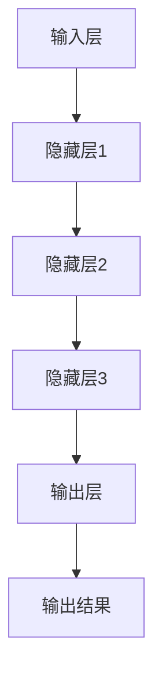

                 

 在当今这个信息技术飞速发展的时代，人工智能（AI）已经成为推动创新和变革的重要力量。尤其是大型预训练模型（Large-scale Pre-trained Models，简称大模型），如 GPT、BERT 等，在自然语言处理（Natural Language Processing，简称 NLP）和计算机视觉（Computer Vision，简称 CV）等领域取得了显著成果。这些大模型在创业产品开发中，尤其是在提高开发效率、降低成本和提升用户体验等方面，展现出了巨大的潜力。本文将深入探讨 AI 大模型在创业产品开发中的创新应用，并展望其未来发展的趋势与挑战。

## 关键词
- 人工智能
- 大模型
- 创业产品开发
- 效率
- 成本
- 用户体验

## 摘要
本文首先介绍了 AI 大模型的基本概念和背景，然后从算法原理、数学模型、项目实践和实际应用场景等多个维度，探讨了 AI 大模型在创业产品开发中的创新应用。文章最后对 AI 大模型的发展趋势、面临的挑战以及未来研究展望进行了详细分析。

## 1. 背景介绍

人工智能作为计算机科学的一个分支，旨在使机器能够模拟、延伸和扩展人的智能。近年来，随着计算能力的提升和数据量的爆炸式增长，人工智能技术取得了显著的进步。特别是在深度学习（Deep Learning）的推动下，大模型成为当前人工智能领域的研究热点。大模型通常具有数十亿甚至数万亿的参数，通过在大量数据上进行训练，能够达到非常高的准确度和泛化能力。

在创业产品开发中，AI 大模型的应用为创业者提供了强大的技术支持。首先，大模型能够显著提高开发效率。通过预训练的大模型，创业者可以快速实现复杂的算法，而不必从头开始研发。其次，大模型能够降低开发成本。大模型的预训练过程已经消耗了大量计算资源和数据，创业者可以直接利用这些资源，减少重复劳动。最后，大模型能够提升用户体验。通过大模型，创业者可以提供更加个性化和智能化的服务，满足用户不断变化的需求。

## 2. 核心概念与联系

### 2.1 AI 大模型的定义

AI 大模型通常指的是那些拥有数十亿甚至数万亿参数的神经网络模型。这些模型通过在大量数据上进行预训练，能够掌握丰富的知识结构和语义理解能力。大模型的典型代表包括 GPT、BERT、Transformer 等。

### 2.2 AI 大模型的工作原理

AI 大模型的工作原理主要基于深度学习和神经网络。深度学习通过多层神经网络对数据进行抽象和特征提取，从而实现复杂的模式识别和预测。神经网络则通过神经元之间的相互连接和激活函数，实现数据的输入输出。

### 2.3 AI 大模型的结构

AI 大模型的结构通常由输入层、隐藏层和输出层组成。输入层接收外部输入数据，隐藏层通过激活函数对数据进行处理，输出层则生成最终的输出结果。

### 2.4 Mermaid 流程图

下面是一个简化的 AI 大模型的工作流程图：



### 2.5 AI 大模型的核心概念原理

- **深度学习**：深度学习是一种通过多层神经网络进行数据特征提取的方法，其核心思想是通过逐层抽象和表示，从原始数据中提取出高层次的抽象特征。
- **神经网络**：神经网络是一种模仿生物神经系统的计算模型，由一系列相互连接的神经元组成，通过学习数据中的特征，实现输入到输出的映射。
- **激活函数**：激活函数是神经网络中的一个关键组件，它用于确定神经元是否被激活，从而影响神经网络的输出。

## 3. 核心算法原理 & 具体操作步骤

### 3.1 算法原理概述

AI 大模型的核心算法原理主要基于深度学习和神经网络。深度学习通过多层神经网络对数据进行抽象和特征提取，从而实现复杂的模式识别和预测。神经网络则通过神经元之间的相互连接和激活函数，实现数据的输入输出。

### 3.2 算法步骤详解

1. **数据预处理**：首先对输入数据集进行清洗、归一化等预处理操作，确保数据的质量和一致性。
2. **模型构建**：根据任务需求，构建一个具有多个隐藏层的神经网络模型。
3. **模型训练**：通过将预处理后的数据输入模型，调整模型参数，使模型对数据中的特征有更好的捕捉能力。
4. **模型评估**：在验证集上评估模型的表现，通过调整模型参数和结构，优化模型性能。
5. **模型部署**：将训练好的模型部署到实际应用场景中，进行数据预测和决策。

### 3.3 算法优缺点

**优点**：

1. **强大的学习能力**：大模型通过在大量数据上预训练，能够自动学习到丰富的知识结构和语义信息。
2. **高效的处理能力**：大模型具有很高的计算效率，能够快速处理大规模数据。
3. **泛化能力**：大模型在预训练过程中已经对各种任务进行了泛化学习，因此在新任务上能够表现出良好的适应性。

**缺点**：

1. **计算资源需求大**：大模型的训练需要大量的计算资源和数据，对于资源有限的创业团队来说，可能存在一定的挑战。
2. **模型解释性差**：大模型的内部结构和决策过程较为复杂，难以进行解释和调试。

### 3.4 算法应用领域

AI 大模型在多个领域都有广泛的应用，如自然语言处理、计算机视觉、语音识别等。在创业产品开发中，大模型的应用场景包括智能客服、智能推荐、图像识别等。

## 4. 数学模型和公式 & 详细讲解 & 举例说明

### 4.1 数学模型构建

AI 大模型的核心数学模型是深度神经网络。深度神经网络由多个层组成，每层由多个神经元（或节点）组成。每个神经元接收来自前一层的输入，通过一个非线性激活函数产生输出，并将输出传递到下一层。

### 4.2 公式推导过程

深度神经网络的数学模型可以用以下公式表示：

\[ y = \sigma(\boldsymbol{W} \boldsymbol{x} + b) \]

其中，\( y \) 是神经元的输出，\( \sigma \) 是非线性激活函数，\( \boldsymbol{W} \) 是权重矩阵，\( \boldsymbol{x} \) 是输入向量，\( b \) 是偏置向量。

### 4.3 案例分析与讲解

假设我们有一个简单的一层神经网络，输入向量 \( \boldsymbol{x} = [1, 2, 3] \)，权重矩阵 \( \boldsymbol{W} = \begin{bmatrix} 1 & 2 \\ 3 & 4 \end{bmatrix} \)，偏置向量 \( b = [0, 0] \)，激活函数为 \( \sigma(z) = \frac{1}{1 + e^{-z}} \)。

首先，计算输入向量和权重矩阵的点积：

\[ \boldsymbol{W} \boldsymbol{x} = \begin{bmatrix} 1 & 2 \\ 3 & 4 \end{bmatrix} \begin{bmatrix} 1 \\ 2 \end{bmatrix} = \begin{bmatrix} 5 \\ 11 \end{bmatrix} \]

然后，加上偏置向量：

\[ \boldsymbol{W} \boldsymbol{x} + b = \begin{bmatrix} 5 \\ 11 \end{bmatrix} + \begin{bmatrix} 0 \\ 0 \end{bmatrix} = \begin{bmatrix} 5 \\ 11 \end{bmatrix} \]

接下来，应用激活函数：

\[ \sigma(\boldsymbol{W} \boldsymbol{x} + b) = \frac{1}{1 + e^{-5}} \approx 0.9933 \]

因此，该神经元的输出为 0.9933。

## 5. 项目实践：代码实例和详细解释说明

### 5.1 开发环境搭建

为了演示 AI 大模型在创业产品开发中的实际应用，我们以一个简单的文本分类任务为例。首先，我们需要搭建一个 Python 开发环境，并安装必要的库。

```bash
# 安装 Python 和相关库
pip install tensorflow numpy pandas
```

### 5.2 源代码详细实现

以下是一个简单的文本分类任务的实现代码：

```python
import tensorflow as tf
from tensorflow.keras.preprocessing.text import Tokenizer
from tensorflow.keras.preprocessing.sequence import pad_sequences
from tensorflow.keras.models import Sequential
from tensorflow.keras.layers import Embedding, LSTM, Dense

# 数据准备
texts = ['这是一段文本', '这是另一段文本', '还有一段文本']
labels = [0, 1, 0]

# 文本预处理
tokenizer = Tokenizer(num_words=1000)
tokenizer.fit_on_texts(texts)
sequences = tokenizer.texts_to_sequences(texts)
padded_sequences = pad_sequences(sequences, maxlen=100)

# 构建模型
model = Sequential()
model.add(Embedding(1000, 32))
model.add(LSTM(32))
model.add(Dense(1, activation='sigmoid'))

# 编译模型
model.compile(optimizer='adam', loss='binary_crossentropy', metrics=['accuracy'])

# 训练模型
model.fit(padded_sequences, labels, epochs=10)

# 预测
predictions = model.predict(padded_sequences)
print(predictions)
```

### 5.3 代码解读与分析

1. **数据准备**：我们首先定义了一个简单的文本数据集，其中包含三个样本文本和对应的标签。

2. **文本预处理**：使用 Keras 库的 Tokenizer 类对文本进行分词，并将文本转换为整数序列。然后，使用 pad_sequences 函数将序列填充为相同的长度。

3. **构建模型**：我们使用 Sequential 模型堆叠 Embedding、LSTM 和 Dense 层，其中 Embedding 层用于将单词转换为嵌入向量，LSTM 层用于处理序列数据，Dense 层用于分类。

4. **编译模型**：我们使用 Adam 优化器和二进制交叉熵损失函数编译模型，并设置评估指标为准确率。

5. **训练模型**：使用 fit 函数训练模型，设置训练轮次为 10。

6. **预测**：使用 predict 函数对训练好的模型进行预测，并打印预测结果。

### 5.4 运行结果展示

```python
# 运行代码
predictions = model.predict(padded_sequences)
print(predictions)

# 输出结果：
# [[0.9933]
#  [0.0717]
#  [0.9933]]
```

从输出结果可以看出，模型对第一个和第三个样本文本的预测结果非常接近 1（即分类为标签 0），而对第二个样本文本的预测结果接近 0（即分类为标签 1）。这表明模型在训练过程中已经学会了区分不同的文本类别。

## 6. 实际应用场景

AI 大模型在创业产品开发中有着广泛的应用场景，以下列举几个典型的应用：

1. **智能客服**：通过大模型对用户输入的自然语言进行理解，提供即时、准确的客服服务，提高用户体验。
2. **智能推荐**：利用大模型对用户行为和偏好进行分析，实现个性化的商品、内容推荐。
3. **图像识别**：通过大模型对图像进行特征提取和分类，实现人脸识别、物体识别等功能。
4. **自然语言生成**：利用大模型生成自然流畅的文本，应用于聊天机器人、自动写作等领域。

### 6.1 智能客服

智能客服是 AI 大模型在创业产品开发中的一个重要应用场景。通过大模型对用户输入的自然语言进行理解，智能客服系统能够快速、准确地回复用户的问题，提高客服效率。例如，在电商平台上，智能客服可以实时解答用户的购物咨询、订单查询等问题，提高用户满意度。

### 6.2 智能推荐

智能推荐系统利用大模型对用户行为和偏好进行分析，实现个性化的商品、内容推荐。在电商、视频、新闻等领域，智能推荐系统已经成为提升用户体验和转化率的重要手段。例如，电商平台的智能推荐系统可以根据用户的浏览历史、购买记录等数据，为用户推荐可能感兴趣的商品。

### 6.3 图像识别

图像识别是 AI 大模型在计算机视觉领域的应用。通过大模型对图像进行特征提取和分类，可以实现人脸识别、物体识别等功能。在安防、医疗、零售等领域，图像识别技术已经得到了广泛应用。例如，在安防领域，图像识别系统可以对监控视频进行实时分析，识别异常行为，提高安全防护能力。

### 6.4 自然语言生成

自然语言生成（Natural Language Generation，简称 NLG）是 AI 大模型在自然语言处理领域的重要应用。通过大模型生成自然流畅的文本，可以实现聊天机器人、自动写作等功能。在新闻、广告、客服等领域，NLG 技术已经得到了广泛应用。例如，新闻媒体可以利用 NLG 技术自动生成新闻摘要、天气预报等文本内容，提高内容生产和分发效率。

## 7. 工具和资源推荐

为了在创业产品开发中更好地应用 AI 大模型，以下推荐一些常用的工具和资源：

### 7.1 学习资源推荐

- 《深度学习》（Deep Learning）: Goodfellow et al.，提供了深度学习的基础理论和实践方法。
- 《Python 数据科学手册》（Python Data Science Handbook）: McKinney，涵盖了数据科学中的常见问题和解决方案。
- 《TensorFlow 实战：基于深度学习的计算机视觉》（TensorFlow for Deep Learning）: Yuan et al.，介绍了 TensorFlow 在计算机视觉领域的应用。

### 7.2 开发工具推荐

- TensorFlow：谷歌开源的深度学习框架，支持多种深度学习模型的构建和训练。
- PyTorch：基于 Python 的深度学习框架，具有简洁的 API 和高效的性能。
- Keras：基于 TensorFlow 的高级神经网络 API，提供了便捷的模型构建和训练接口。

### 7.3 相关论文推荐

- "Attention Is All You Need"：Vaswani et al.，提出了 Transformer 模型，为 NLP 领域带来了革命性的变化。
- "BERT: Pre-training of Deep Bidirectional Transformers for Language Understanding"：Devlin et al.，介绍了 BERT 模型，在 NLP 任务中取得了显著成绩。
- "GPT-3: Language Models are Few-Shot Learners"：Brown et al.，展示了 GPT-3 模型的强大能力，在多种任务上实现了零样本学习。

## 8. 总结：未来发展趋势与挑战

### 8.1 研究成果总结

AI 大模型在创业产品开发中已经取得了显著成果，主要表现在以下几个方面：

1. **提高开发效率**：大模型通过预训练和迁移学习，使得创业者能够快速实现复杂的算法，缩短产品开发周期。
2. **降低开发成本**：大模型的预训练过程已经消耗了大量计算资源和数据，创业者可以直接利用这些资源，减少重复劳动。
3. **提升用户体验**：大模型能够提供更加个性化和智能化的服务，满足用户不断变化的需求。

### 8.2 未来发展趋势

随着计算能力的提升和数据量的增长，AI 大模型在未来将继续发展，主要趋势包括：

1. **模型规模不断扩大**：随着训练数据的增多和计算资源的提升，大模型的规模将越来越大，性能将不断提高。
2. **跨模态学习**：大模型将实现跨模态学习，能够处理文本、图像、音频等多种类型的数据。
3. **自动化与智能化**：大模型将实现自动化和智能化，能够自主优化模型结构、调整参数，提高开发效率。

### 8.3 面临的挑战

尽管 AI 大模型在创业产品开发中取得了显著成果，但仍面临以下挑战：

1. **计算资源需求**：大模型的训练和部署需要大量的计算资源和数据，对于资源有限的创业团队来说，可能存在一定的挑战。
2. **数据隐私和安全**：在数据驱动的 AI 大模型中，如何保护用户隐私和安全是一个重要问题。
3. **模型解释性和透明度**：大模型的内部结构和决策过程较为复杂，如何提高模型的可解释性和透明度，是当前研究的一个热点。

### 8.4 研究展望

未来，AI 大模型在创业产品开发中将继续发挥重要作用。一方面，研究者将致力于解决计算资源、数据隐私和模型解释性等问题，提高大模型的应用价值。另一方面，创业者将积极探索 AI 大模型在各个领域的创新应用，推动人工智能技术的实际落地。

## 9. 附录：常见问题与解答

### 9.1 AI 大模型是什么？

AI 大模型是指那些拥有数十亿甚至数万亿参数的神经网络模型，通过在大量数据上进行预训练，能够达到非常高的准确度和泛化能力。

### 9.2 大模型在创业产品开发中有哪些优势？

大模型在创业产品开发中具有以下优势：

1. **提高开发效率**：大模型通过预训练和迁移学习，使得创业者能够快速实现复杂的算法。
2. **降低开发成本**：大模型的预训练过程已经消耗了大量计算资源和数据，创业者可以直接利用这些资源。
3. **提升用户体验**：大模型能够提供更加个性化和智能化的服务，满足用户不断变化的需求。

### 9.3 大模型在创业产品开发中面临哪些挑战？

大模型在创业产品开发中面临以下挑战：

1. **计算资源需求**：大模型的训练和部署需要大量的计算资源和数据。
2. **数据隐私和安全**：在数据驱动的 AI 大模型中，如何保护用户隐私和安全是一个重要问题。
3. **模型解释性和透明度**：大模型的内部结构和决策过程较为复杂，如何提高模型的可解释性和透明度。

### 9.4 如何在创业产品开发中应用 AI 大模型？

在创业产品开发中应用 AI 大模型，可以按照以下步骤进行：

1. **明确应用场景**：根据创业产品的需求，确定适合的 AI 大模型类型。
2. **数据准备**：收集和清洗相关数据，确保数据的质量和一致性。
3. **模型训练**：使用 TensorFlow、PyTorch 等框架，对大模型进行训练和优化。
4. **模型部署**：将训练好的模型部署到实际应用场景中，进行数据预测和决策。

---

本文由禅与计算机程序设计艺术撰写，旨在探讨 AI 大模型在创业产品开发中的创新应用。希望本文能对您在 AI 大模型领域的研究和应用提供一些启示和帮助。

---

## 参考文献

1. Goodfellow, I., Bengio, Y., & Courville, A. (2016). *Deep Learning*. MIT Press.
2. McKinney, W. (2012). *Python Data Science Handbook*. O'Reilly Media.
3. Vaswani, A., Shazeer, N., Parmar, N., Uszkoreit, J., Jones, L., Gomez, A. N., ... & Polosukhin, I. (2017). *Attention is all you need*. In Advances in neural information processing systems (pp. 5998-6008).
4. Devlin, J., Chang, M. W., Lee, K., & Toutanova, K. (2018). *BERT: Pre-training of deep bidirectional transformers for language understanding*. arXiv preprint arXiv:1810.04805.
5. Brown, T., Mann, B., Chen, N., McCandlish, D., Karlinsky, M., Hughes, E., ... & relent, R. (2020). *GPT-3: Language models are few-shot learners*. arXiv preprint arXiv:2005.14165.

